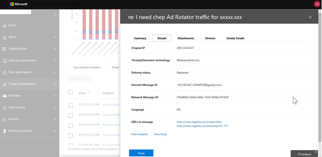

# Exibições no Explorador de Ameaças e detecções em tempo real

[!INCLUDE [Microsoft 365 Defender rebranding](../includes/microsoft-defender-for-office.md)]

**Aplica-se a**
- [Plano 1 e plano 2 do Microsoft Defender para Office 365](defender-for-office-365.md)
- [Microsoft 365 Defender](../defender/microsoft-365-defender.md)

[O Explorador](threat-explorer.md) de Ameaças (e o relatório de detecções em tempo real) é uma ferramenta poderosa e quase em tempo real para ajudar as equipes de Operações de Segurança a investigar e responder a ameaças no Centro de Conformidade & Segurança. O Explorer (e o relatório de detecções em tempo real) exibe informações sobre suspeita de malware e phishing em emails e arquivos no Office 365, bem como outras ameaças e riscos de segurança à sua organização.

- Se você tiver [o Microsoft Defender para Office 365](defender-for-office-365.md) Plano 2, terá o Explorer.
- Se você tiver o Microsoft Defender para Office 365 Plano 1, terá detecções em tempo real.

Quando você abre o Explorer pela primeira vez (ou o relatório de detecções em tempo real), o modo de exibição padrão mostra detecções de malware de email nos últimos 7 dias. Este relatório também pode mostrar detecções do Microsoft Defender para Office 365, como URLs mal-intencionadas detectadas por Links Seguros [e](safe-links.md)arquivos mal-intencionados detectados por [Anexos Seguros.](safe-attachments.md) Este relatório pode ser modificado para mostrar dados dos últimos 30 dias (com uma assinatura paga do Microsoft Defender para Office 365 P2). As assinaturas de avaliação incluirão dados apenas nos últimos sete dias.

****

|Assinatura|Utilitário|Dias de Dados|
|---|---|---|
|Avaliação do Microsoft Defender para Office 365 P1|Detecções em tempo real|7 |
|Microsoft Defender para Office 365 P1 pago|Detecções em tempo real|30|
|Avaliação paga do Microsoft Defender para Office 365 P1 para Office 365 P2|Explorador de Ameaças|7 |
|Avaliação do Microsoft Defender para Office 365 P2|Explorador de Ameaças|7 |
|Microsoft Defender para Office 365 P2 pago|Explorador de Ameaças|30|
|

> [!NOTE]
> Em breve, estenderemos a retenção de dados do Explorer (e detecções em tempo real) e o limite de pesquisa para locatários de avaliação de 7 a 30 dias. Essa alteração está sendo controlada como parte do item de roteiro nº 70544 e está em uma fase de lançamento.

Use o menu **Exibir** para alterar quais informações são exibidas. As dicas de ferramentas ajudam a determinar qual exibição usar.

Depois de selecionar um exibição, você pode aplicar filtros e configurar consultas para realizar mais análises. As seções a seguir fornecem uma breve visão geral das várias exibições disponíveis no Explorer (ou detecções em tempo real).

## Email > Malware

Para exibir esse relatório, no Explorer (ou detecções em tempo real), escolha **Exibir** \> **Malware de** \> **Email**. Esta exibição mostra informações sobre mensagens de email identificadas como contendo malware.

Clique **em Remetente** para abrir sua lista de opções de exibição. Use essa lista para exibir dados por remetente, destinatários, domínio do remetente, assunto, tecnologia de detecção, status de proteção e muito mais.

Por exemplo, para ver quais ações foram tomadas em mensagens de email detectadas, escolha **Status de proteção** na lista. Selecione uma opção e clique no botão Atualizar para aplicar esse filtro ao relatório.

Abaixo do gráfico, confira mais detalhes sobre mensagens específicas. Quando você seleciona um item na lista, um painel de sobrevoo é aberto, onde você pode saber mais sobre o item selecionado.

## Email > Phish

Para exibir esse relatório, no Explorer (ou detecções em tempo real), escolha **Exibir** \> **Phishing de** \> **Email.** Esta exibição mostra mensagens de email identificadas como tentativas de phishing.

Clique **em Remetente** para abrir sua lista de opções de exibição. Use essa lista para exibir dados por remetente, destinatários, domínio do remetente, IP do remetente, domínio de URL, veredito de clique e muito mais.

Por exemplo, para ver quais ações foram tomadas quando as pessoas clicaram  em URLs identificadas como tentativas de phishing, escolha Clique em Veredito na lista, selecione uma ou mais opções e clique no botão Atualizar.

Abaixo do gráfico, confira mais detalhes sobre mensagens específicas, cliques de URL, URLs e origem do email.

Quando você seleciona um item na lista, como uma URL detectada, um painel de sobrevoo é aberto, onde você pode saber mais sobre o item selecionado.

## Envios > email

Para exibir esse relatório, no Explorer (ou detecções em tempo real), escolha **Exibir** \>  \> **Envios de Email**. Esta exibição mostra emails que os usuários relataram como lixo eletrônico, não lixo eletrônico ou email de phishing.

Clique **em Remetente** para abrir sua lista de opções de exibição. Use essa lista para exibir informações por remetente, destinatários, tipo de relatório (a determinação do usuário de que o email era lixo eletrônico, não lixo eletrônico ou phishing) e muito mais.

Por exemplo, para exibir informações sobre mensagens de email relatadas como tentativas de phishing, clique em **Tipo** de Relatório do Remetente, selecione Phish e clique no \> botão Atualizar. 

Abaixo do gráfico, confira mais detalhes sobre mensagens de email específicas, como linha de assunto, endereço IP do remetente, o usuário que relatou a mensagem como lixo eletrônico, não lixo eletrônico ou phishing e muito mais.

Selecione um item na lista para exibir detalhes adicionais.

## Email > Todos os emails

Para exibir esse relatório, no Explorer, escolha **Exibir** \> **Email** \> **Todos os emails**. Esse modo de exibição mostra uma exibição all-up da atividade de email, incluindo emails identificados como mal-intencionados devido a phishing ou malware, bem como todos os emails não mal-intencionados (email normal, spam e email em massa).

> [!NOTE]
> Se você receber um erro que leia **Dados** demais para exibição, adicione um filtro e, se necessário, reduza o intervalo de datas que você está exibindo.

Para aplicar um filtro, escolha **Remetente**, selecione um item na lista e clique no botão Atualizar. No nosso exemplo, nós utilizamos a **tecnologia de detecção** como um filtro (há várias opções disponíveis). Exibir informações por remetente, domínio do remetente, destinatários, assunto, nome do arquivo de anexo, família de malware, status de proteção (ações realizadas pelos recursos e políticas de proteção contra ameaças no Office 365), tecnologia de detecção (como o malware foi detectado) e muito mais.

Abaixo do gráfico, confira mais detalhes sobre mensagens de email específicas, como linha de assunto, destinatário, remetente, status e assim por diante.

## Malware > conteúdo

Para exibir este relatório, no Explorer (ou detecções em tempo real), escolha **Exibir** \> **Malware de** \> **Conteúdo**. Esta exibição mostra arquivos identificados como mal-intencionados pelo [Microsoft Defender para Office 365 no SharePoint Online, No OneDrive for Business e no Microsoft Teams.](mdo-for-spo-odb-and-teams.md)

Exibir informações por família de malware, tecnologia de detecção (como o malware foi detectado) e carga de trabalho (OneDrive, SharePoint ou Teams).

Abaixo do gráfico, confira mais detalhes sobre arquivos específicos, como nome do arquivo de anexo, carga de trabalho, tamanho do arquivo, quem modificou o arquivo pela última vez e muito mais.

## Recursos de clique para filtrar

Com o Explorer (e detecções em tempo real), você pode aplicar um filtro em um clique. Clique em um item na legenda e esse item se tornará um filtro para o relatório. Por exemplo, suponhamos que estamos olhando para o exibição Malware no Explorer:

Clicar em **Detonação ATP** neste gráfico resulta em uma exibição como esta:

Neste ponto de vista, agora estamos procurando dados para arquivos que foram detonados por [Anexos Seguros.](safe-attachments.md) Abaixo do gráfico, podemos ver detalhes sobre mensagens de email específicas que tinham anexos detectados por Anexos Seguros.

Selecionar um ou mais itens ativa o menu **Ações,** que oferece várias opções das quais escolher os itens selecionados.

A capacidade de filtrar em um clique e navegar para detalhes específicos pode economizar muito tempo na investigação de ameaças.

## Consultas e filtros

O Explorer (bem como o relatório de detecções em tempo real) tem vários filtros poderosos e recursos de consulta que permitem detalhar detalhes, como usuários principais direcionados, famílias de malware principais, tecnologia de detecção e muito mais. Cada tipo de relatório oferece várias maneiras de exibir e explorar dados.

> [!IMPORTANT]
> Não use caracteres curinga, como um asterisco ou um ponto de interrogação, na barra de consulta do Explorer (ou detecções em tempo real). Quando você pesquisa no campo **Assunto** para mensagens de email, o Explorer (ou detecções em tempo real) executará correspondência parcial e gerará resultados semelhantes a uma pesquisa de curinga.
