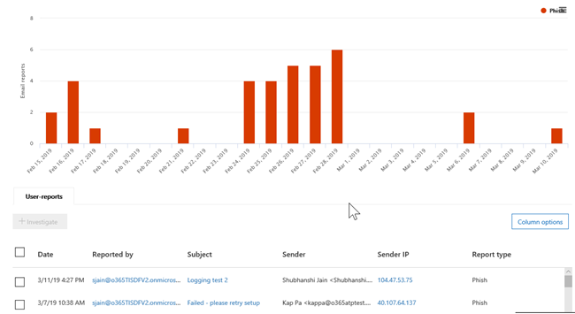
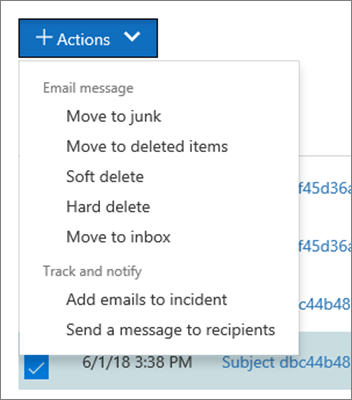

# Exibições no Explorador de Ameaças e detecções em tempo realViews in Threat Explorer and real-time detections

[!INCLUDE [Microsoft 365 Defender rebranding](../includes/microsoft-defender-for-office.md)]

**Aplica-se a****Applies to**
- [Plano 1 e plano 2 do Microsoft Defender para Office 365Microsoft Defender for Office 365 plan 1 and plan 2](defender-for-office-365.md)
- [Microsoft 365 DefenderMicrosoft 365 Defender](../defender/microsoft-365-defender.md)

[O Explorador](threat-explorer.md) de Ameaças (e o relatório de detecções em tempo real) é uma ferramenta poderosa e quase em tempo real para ajudar as equipes de Operações de Segurança a investigar e responder a ameaças no portal Microsoft 365 Defender.[Threat Explorer](threat-explorer.md) (and the real-time detections report) is a powerful, near real-time tool to help Security Operations teams investigate and respond to threats in the Microsoft 365 Defender portal. O Explorer (e o relatório de detecções em tempo real) exibe informações sobre suspeita de malware e phishing em email e arquivos no Office 365, bem como outras ameaças e riscos de segurança à sua organização.Explorer (and the real-time detections report) displays information about suspected malware and phish in email and files in Office 365, as well as other security threats and risks to your organization.

- Se você tiver [o Microsoft Defender para Office 365](defender-for-office-365.md) Plano 2, terá o Explorer.If you have [Microsoft Defender for Office 365](defender-for-office-365.md) Plan 2, then you have Explorer.
- Se você tiver o Microsoft Defender para Office 365 Plano 1, terá detecções em tempo real.If you have Microsoft Defender for Office 365 Plan 1, then you have real-time detections.

Quando você abre o Explorer pela primeira vez (ou o relatório de detecções em tempo real), o modo de exibição padrão mostra detecções de malware de email nos últimos 7 dias.When you first open Explorer (or the real-time detections report), the default view shows email malware detections for the past 7 days. Este relatório também pode mostrar o Microsoft Defender para detecções Office 365, como URLs mal-intencionadas detectadas por links do [Cofre e](safe-links.md)arquivos mal-intencionados detectados por [Cofre Attachments](safe-attachments.md).This report can also show Microsoft Defender for Office 365 detections, such as malicious URLs detected by [Safe Links](safe-links.md), and malicious files detected by [Safe Attachments](safe-attachments.md). Este relatório pode ser modificado para mostrar dados dos últimos 30 dias (com uma assinatura paga do Microsoft Defender para Office 365 P2).This report can be modified to show data for the past 30 days (with a Microsoft Defender for Office 365 P2 paid subscription). As assinaturas de avaliação incluirão dados apenas nos últimos sete dias.Trial subscriptions will include data for the past seven days only.

****

|AssinaturaSubscription|UtilitárioUtility|Dias de DadosDays of Data|
|---|---|---|
|Avaliação do Microsoft Defender Office 365 P1Microsoft Defender for Office 365 P1 trial|Detecções em tempo realReal-time detections|7 7|
|Microsoft Defender para Office 365 P1 pagoMicrosoft Defender for Office 365 P1 paid|Detecções em tempo realReal-time detections|3030|
|Microsoft Defender para Office 365 P1 pago testando o Defender para Office 365 avaliação P2Microsoft Defender for Office 365 P1 paid testing Defender for Office 365 P2 trial|Explorador de AmeaçasThreat Explorer|7 7|
|Avaliação do Microsoft Defender Office 365 P2Microsoft Defender for Office 365 P2 trial|Explorador de AmeaçasThreat Explorer|7 7|
|Microsoft Defender para Office 365 P2 pagoMicrosoft Defender for Office 365 P2 paid|Explorador de AmeaçasThreat Explorer|3030|
|

> [!NOTE]
> Em breve, estenderemos a retenção de dados do Explorer (e detecções em tempo real) e o limite de pesquisa para locatários de avaliação de 7 a 30 dias.We will soon be extending the Explorer (and Real-time detections) data retention and search limit for trial tenants from 7 to 30 days. Essa alteração está sendo controlada como parte do item de roteiro nº 70544 e está em uma fase de lançamento.This change is being tracked as part of roadmap item no. 70544, and is currently in a roll-out phase.

Use o menu **Exibir** para alterar quais informações são exibidas.Use the **View** menu to change what information is displayed. As dicas de ferramentas ajudam a determinar qual exibição usar.Tooltips help you determine which view to use.

Depois de selecionar um exibição, você pode aplicar filtros e configurar consultas para realizar mais análises.Once you have selected a view, you can apply filters and set up queries to conduct further analysis. As seções a seguir fornecem uma breve visão geral das várias exibições disponíveis no Explorer (ou detecções em tempo real).The following sections provide a brief overview of the various views available in Explorer (or real-time detections).

## Email > MalwareEmail > Malware

Para exibir esse relatório, no Explorer (ou detecções em tempo real), escolha **Exibir** \> **Malware de** \> **Email**.To view this report, in Explorer (or real-time detections), choose **View** \> **Email** \> **Malware**. Esta exibição mostra informações sobre mensagens de email identificadas como contendo malware.This view shows information about email messages that were identified as containing malware.

Clique **em Remetente** para abrir sua lista de opções de exibição.Click **Sender** to open your list of viewing options. Use essa lista para exibir dados por remetente, destinatários, domínio do remetente, assunto, tecnologia de detecção, status de proteção e muito mais.Use this list to view data by sender, recipients, sender domain, subject, detection technology, protection status, and more.

Por exemplo, para ver quais ações foram tomadas em mensagens de email detectadas, escolha **Status de proteção** na lista.For example, to see what actions were taken on detected email messages, choose **Protection status** in the list. Selecione uma opção e clique no botão Atualizar para aplicar esse filtro ao relatório.Select an option, and then click the Refresh button to apply that filter to your report.

Abaixo do gráfico, confira mais detalhes sobre mensagens específicas.Below the chart, view more details about specific messages. Quando você seleciona um item na lista, um painel de sobrevoo é aberto, onde você pode saber mais sobre o item selecionado.When you select an item in the list, a fly-out pane opens, where you can learn more about the item you selected.

## Email > PhishEmail > Phish

Para exibir esse relatório, no Explorer (ou detecções em tempo real), escolha **Exibir** \> **Phishing de** \> **Email.**To view this report, in Explorer (or real-time detections), choose **View** \> **Email** \> **Phish**. Esta exibição mostra mensagens de email identificadas como tentativas de phishing.This view shows email messages identified as phishing attempts.

Clique **em Remetente** para abrir sua lista de opções de exibição.Click **Sender** to open your list of viewing options. Use essa lista para exibir dados por remetente, destinatários, domínio do remetente, IP do remetente, domínio de URL, veredito de clique e muito mais.Use this list to view data by sender, recipients, sender domain, sender IP, URL domain, click verdict, and more.

Por exemplo, para ver quais ações foram tomadas quando as pessoas clicaram  em URLs identificadas como tentativas de phishing, escolha Clique em Veredito na lista, selecione uma ou mais opções e clique no botão Atualizar.For example, to see what actions were taken when people clicked on URLs that were identified as phishing attempts, choose **Click verdict** in the list, select one or more options, and then click the Refresh button.

Abaixo do gráfico, confira mais detalhes sobre mensagens específicas, cliques de URL, URLs e origem do email.Below the chart, view more details about specific messages, URL clicks, URLs, and email origin.

Quando você seleciona um item na lista, como uma URL detectada, um painel de sobrevoo é aberto, onde você pode saber mais sobre o item selecionado.When you select an item in the list, such as a URL that was detected, a fly-out pane opens, where you can learn more about the item you selected.

## Envios > emailEmail > Submissions

Para exibir esse relatório, no Explorer (ou detecções em tempo real), escolha **Exibir** \>  \> **Envios de Email**.To view this report, in Explorer (or real-time detections), choose **View** \> **Email** \> **Submissions**. Esta exibição mostra emails que os usuários relataram como lixo eletrônico, não lixo eletrônico ou email de phishing.This view shows email that users have reported as junk, not junk, or phishing email.

Clique **em Remetente** para abrir sua lista de opções de exibição.Click **Sender** to open your list of viewing options. Use essa lista para exibir informações por remetente, destinatários, tipo de relatório (a determinação do usuário de que o email era lixo eletrônico, não lixo eletrônico ou phishing) e muito mais.Use this list to view information by sender, recipients, report type (the user's determination that the email was junk, not junk, or phish), and more.

Por exemplo, para exibir informações sobre mensagens de email relatadas como tentativas de phishing, clique em **Tipo** de Relatório do Remetente, selecione Phish e clique no \> botão Atualizar. For example, to view information about email messages that were reported as phishing attempts, click **Sender** \> **Report type**, select **Phish**, and then click the Refresh button.

Abaixo do gráfico, confira mais detalhes sobre mensagens de email específicas, como linha de assunto, endereço IP do remetente, o usuário que relatou a mensagem como lixo eletrônico, não lixo eletrônico ou phishing e muito mais.Below the chart, view more details about specific email messages, such as subject line, the sender's IP address, the user that reported the message as junk, not junk, or phish, and more.

Selecione um item na lista para exibir detalhes adicionais.Select an item in the list to view additional details.

## Email > Todos os emailsEmail > All email

Para exibir esse relatório, no Explorer, escolha **Exibir** \> **Email** \> **Todos os emails**.To view this report, in Explorer, choose **View** \> **Email** \> **All mail**. Esse modo de exibição mostra uma exibição all-up da atividade de email, incluindo emails identificados como mal-intencionados devido a phishing ou malware, bem como todos os emails não mal-intencionados (email normal, spam e email em massa).This views shows an all-up view of email activity, including email identified as malicious due to phishing or malware, as well all non-malicious mail (normal email, spam, and bulk mail).

> [!NOTE]
> Se você receber um erro que leia **Dados** demais para exibição, adicione um filtro e, se necessário, reduza o intervalo de datas que você está exibindo.If you get an error that reads **Too much data to display**, add a filter and, if necessary, narrow the date range you're viewing.

Para aplicar um filtro, escolha **Remetente**, selecione um item na lista e clique no botão Atualizar.To apply a filter, choose **Sender**, select an item in the list, and then click the Refresh button. No nosso exemplo, nós utilizamos a **tecnologia de detecção** como um filtro (há várias opções disponíveis).In our example, we used **Detection technology** as a filter (there are several options available). Exibir informações por remetente, domínio do remetente, destinatários, assunto, nome do arquivo de anexo, família de malware, status de proteção (ações realizadas pelos recursos e políticas de proteção contra ameaças no Office 365), tecnologia de detecção (como o malware foi detectado) e muito mais.View information by sender, sender's domain, recipients, subject, attachment filename, malware family, protection status (actions taken by your threat protection features and policies in Office 365), detection technology (how the malware was detected), and more.

Abaixo do gráfico, confira mais detalhes sobre mensagens de email específicas, como linha de assunto, destinatário, remetente, status e assim por diante.Below the chart, view more details about specific email messages, such as subject line, recipient, sender, status, and so on.

## Malware > conteúdoContent > Malware

Para exibir este relatório, no Explorer (ou detecções em tempo real), escolha **Exibir** \> **Malware de** \> **Conteúdo**.To view this report, in Explorer (or real-time detections), choose **View** \> **Content** \> **Malware**. Esta exibição mostra arquivos que foram identificados como mal-intencionados pelo Microsoft Defender para Office 365 [no SharePoint Online, OneDrive for Business e Microsoft Teams](mdo-for-spo-odb-and-teams.md).This view shows files that were identified as malicious by [Microsoft Defender for Office 365 in SharePoint Online, OneDrive for Business, and Microsoft Teams](mdo-for-spo-odb-and-teams.md).

Exibir informações por família de malware, tecnologia de detecção (como o malware foi detectado) e carga de trabalho (OneDrive, SharePoint ou Teams).View information by malware family, detection technology (how the malware was detected), and workload (OneDrive, SharePoint, or Teams).

Abaixo do gráfico, confira mais detalhes sobre arquivos específicos, como nome do arquivo de anexo, carga de trabalho, tamanho do arquivo, quem modificou o arquivo pela última vez e muito mais.Below the chart, view more details about specific files, such as attachment filename, workload, file size, who last modified the file, and more.

## Recursos de clique para filtrarClick-to-filter capabilities

Com o Explorer (e detecções em tempo real), você pode aplicar um filtro em um clique.With Explorer (and real-time detections), you can apply a filter in a click. Clique em um item na legenda e esse item se tornará um filtro para o relatório.Click an item in the legend, and that item becomes a filter for the report. Por exemplo, suponhamos que estamos olhando para o exibição Malware no Explorer:For example, suppose we are looking at the Malware view in Explorer:

Clicar em **Detonação ATP** neste gráfico resulta em uma exibição como esta:Clicking **ATP Detonation** in this chart results in a view like this:

Neste ponto de vista, agora estamos procurando dados para arquivos que foram detonados por Cofre [Anexos](safe-attachments.md).In this view, we are now looking at data for files that were detonated by [Safe Attachments](safe-attachments.md). Abaixo do gráfico, podemos ver detalhes sobre mensagens de email específicas que tinham anexos que foram detectados por Cofre Anexos.Below the chart, we can see details about specific email messages that had attachments that were detected by Safe Attachments.

Selecionar um ou mais itens ativa o menu **Ações,** que oferece várias opções das quais escolher os itens selecionados.Selecting one or more items activates the **Actions** menu, which offers several choices from which to choose for the selected item(s).

A capacidade de filtrar em um clique e navegar para detalhes específicos pode economizar muito tempo na investigação de ameaças.The ability to filter in a click and navigate to specific details can save you a lot of time in investigating threats.

## Consultas e filtrosQueries and filters

O Explorer (bem como o relatório de detecções em tempo real) tem vários filtros poderosos e recursos de consulta que permitem detalhar detalhes, como usuários principais direcionados, famílias de malware principais, tecnologia de detecção e muito mais.Explorer (as well as the real-time detections report) has several powerful filters and querying capabilities that enable you to drill into details, such as top targeted users, top malware families, detection technology and more. Cada tipo de relatório oferece várias maneiras de exibir e explorar dados.Each kind of report offers a variety of ways to view and explore data.

> [!IMPORTANT]
> Não use caracteres curinga, como um asterisco ou um ponto de interrogação, na barra de consulta do Explorer (ou detecções em tempo real).Do not use wildcard characters, such as an asterisk or a question mark, in the query bar for Explorer (or real-time detections). Quando você pesquisa no campo **Assunto** para mensagens de email, o Explorer (ou detecções em tempo real) executará correspondência parcial e gerará resultados semelhantes a uma pesquisa de curinga.When you search on the **Subject field** for email messages, Explorer (or real-time detections) will perform partial matching and yield results similar to a wildcard search.
