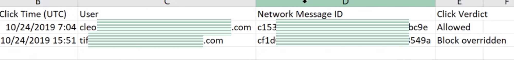
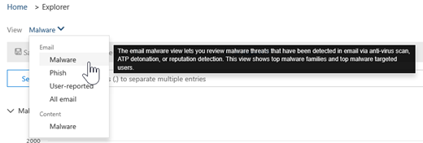
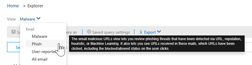

# Gerenciador de ameaças e detecções em tempo realThreat Explorer and real-time detections

Se sua organização tem a [proteção avançada contra ameaças do office 365](office-365-atp.md) (Office 365 ATP) e você tem as [permissões necessárias](#required-licenses-and-permissions), você tem as detecções do **Explorer** ou do **tempo real** (anteriormente conhecida como *relatórios em tempo real* , [consulte What ' s New](#new-features-in-threat-explorer-and-real-time-detections)!).If your organization has [Office 365 Advanced Threat Protection](office-365-atp.md) (Office 365 ATP), and you have the [necessary permissions](#required-licenses-and-permissions), you have either **Explorer** or **real-time detections** (formerly *real-time reports* — [see what's new](#new-features-in-threat-explorer-and-real-time-detections)!). No centro de conformidade & segurança, vá para **Gerenciamento de ameaças**e escolha as detecções do **Explorer** ou **em tempo real**.In the Security & Compliance Center, go to **Threat management**, and then choose **Explorer** OR **Real-time detections**. 

|Com o plano ATP 2, você vê:With ATP Plan 2, you see:  |Com o plano ATP 1, você vê:With ATP Plan 1, you see:  |
|---------|---------|
|      |         |

Com o Explorer (ou detecções em tempo real), você tem um relatório poderoso que permite que sua equipe de operações de segurança investigue e responda às ameaças de forma eficaz e eficiente.With Explorer (or real-time detections), you have a powerful report that enables your Security Operations team to investigate and respond to threats effectively and efficiently. O relatório é semelhante à seguinte imagem:The report resembles the following image: 

Com esse relatório, você pode:With this report, you can:
- [Consulte malware detectado pelos recursos de segurança do Office 365See malware detected by Office 365 security features](#see-malware-detected-in-email-by-technology)
- [Exibir dados sobre URLs de phishing e clicar em veredictoView data about phishing URLs and click verdict](#view-data-about-phishing-urls-and-click-verdict)
- [Iniciar um processo de investigação e resposta automatizado de um modo de exibição no Explorer](#start-automated-investigation-and-response) (apenas plano ATP 2)[Start an automated investigation and response process from a view in Explorer](#start-automated-investigation-and-response) (ATP Plan 2 only)
- ... [Investigue emails mal-intencionados e muito mais](#more-ways-to-use-explorer-or-real-time-detections)!... [Investigate malicious email, and more](#more-ways-to-use-explorer-or-real-time-detections)!

## Novos recursos no Gerenciador de ameaças e detecções em tempo realNew features in Threat Explorer and real-time detections

Três novos recursos adicionados ao Gerenciador de ameaças e às detecções em tempo real:Three new features added into Threat Explorer and real-time detections:
- [Visualizar o cabeçalho de email e baixar o corpo do emailPreview email header and download email body](#preview-email-header-and-download-email-body)
- [Linha do tempo de emailEmail timeline](#email-timeline)
- [Exportar URL clique em dadosExport URL click data](#export-url-click-data)

Esses novos recursos estão descritos abaixo.These new features are outlined below.

### Visualizar o cabeçalho de email e baixar o corpo do emailPreview email header and download email body

A capacidade de Visualizar um cabeçalho de email e baixar o corpo do email são novos recursos disponíveis no explorador de ameaças.The ability to preview an email header and download the email body are new features available in Threat Explorer. Os administradores poderão analisar os cabeçalhos/mensagens de email baixados para ameaças.Admins will be able to analyze downloaded headers/email messages for threats. Como o download de mensagens de email pode arriscar a exposição de informações, esse processo é controlado pelo controle de acesso baseado em funções (RBAC).Because downloading email messages can risk the exposure of information, this process is controlled by roles-based access control (RBAC). Uma nova função, *Visualização*, deve ser adicionada a outro grupo de função do Office 365 (como operações de segurança ou administrador de segurança) para conceder a capacidade de baixar emails e Visualizar cabeçalhos em todas as mensagens de email exibir.A new role, *Preview*, must be added to another Office 365 role group (such as Security Operations or Security Administrator) to grant the ability to download mails and preview headers in all-email messages view.

Mas o Explorer (e as detecções em tempo real) também adiciona novos campos criados para fornecer uma imagem mais completa de onde suas mensagens de email estão no terreno.But Explorer (and real-time detections) also adds fresh new fields designed to give you a more complete picture of where your email messages land. Parte da meta dessa alteração é tornar a busca mais fácil para pessoas de operações de segurança, mas o resultado líquido é saber o local das mensagens de email de problemas em um relance.Part of the goal of this change is to make hunting easier for Security Ops people, but the net result is knowing the location of problem email messages at a glance.

Como isso é feito?How is this done? O status de entrega agora é dividido em duas colunas:Delivery Status is now broken out into two columns:

- **Ação de entrega** -Qual é o status desse email?**Delivery Action** - What is the status of this email?
- **Local de entrega** -onde esse email foi roteado como resultado?**Delivery Location** - Where was this email routed as a result?

A ação de entrega é a ação realizada em um email devido a políticas ou detecções existentes.Delivery Action is the action taken on an email due to existing policies or detections. Veja a seguir as possíveis ações que um email pode executar:Here are the possible actions an email can take:

|GeradosDelivered  |Lixo eletrônicoJunked  |BlockedBlocked  |DevidoReplaced  |
|---------|---------|---------|---------|
|O email foi entregue na caixa de entrada do usuário ou em outra pasta, e o usuário pode acessá-lo diretamente.Email was delivered to the user's inbox or another folder, and the user can directly access it.    | O email foi enviado para a pasta de lixo eletrônico do usuário ou para a pasta excluída e o usuário tem acesso a mensagens de email nessas pastas.Email was sent to either user's Junk folder or Deleted folder, and the user has access to email messages in those folders.       | Qualquer mensagem de email em quarentena, que falhou ou foi interrompida, e não pode ser acessada pelo usuário.Any email messages that are quarantined, that failed, or were dropped, and are not accessible by the user.     | Quaisquer mensagens de email em que anexos mal-intencionados foram substituídos por arquivos. txt que indicam que os anexos foram mal-intencionados.Any email messages where malicious attachments were replaced by .txt files that state the attachments were malicious.     |

E aqui está o que o usuário pode ver e o que eles não podem:And here is what the user can see, and what they can't:

|Acessível para os usuários finaisAccessible to end users  |Inacessível para os usuários finaisInaccessible to end users  |
|---------|---------|
|GeradosDelivered     | BlockedBlocked        |
|Lixo eletrônicoJunked     | DevidoReplaced        |

O local de entrega mostra os resultados das políticas e detecções que executam post-Delivery.Delivery location shows the results of policies and detections that run post-delivery. Ele está vinculado a uma ação de entrega.It's linked to a Delivery Action. Este campo foi adicionado para dar informações sobre a ação tomada quando um email de problema é encontrado.This field was added to give insight into the action taken when a problem mail is found. Estes são os possíveis valores de local de entrega:Here are the possible values of delivery location:

- **Caixa de entrada ou pasta**: o email está na caixa de entrada ou uma pasta (de acordo com suas regras de email).**Inbox or folder**: The email is in inbox or a folder (according to your email rules).
- **Local ou externo**: a caixa de correio não existe na nuvem, mas está no local.**On-prem or external**: The mailbox doesn't exist on cloud but is on-premises.
- **Pasta de lixo eletrônico**: o email está na pasta lixo eletrônico de um usuário.**Junk folder**: The email is in the Junk folder of a user.
- **Pasta itens excluídos**: o email na pasta itens excluídos de um usuário.**Deleted items folder**: The email in the Deleted items folder of a user.
- **Quarantine**: o email em quarentena e não está na caixa de correio de um usuário.**Quarantine**: The email in quarantine, and is not in a user's mailbox.
- **Falha**: o email não pôde chegar à caixa de correio.**Failed**: The email failed to reach the mailbox.
- **Descartado**: o email é perdido em algum lugar no fluxo de emails.**Dropped**: The email gets lost somewhere in the mail flow.

### Linha do tempo de emailEmail timeline

A **linha do tempo de email** é outro novo recurso do Explorer destinado a tornar a experiência de busca melhor para administradores.The **Email Timeline** is another new Explorer feature aimed at making the hunting experience better for admins. Ele reduz a randomização porque há menos tempo gasto na verificação de locais diferentes para tentar entender o evento.It cuts down on randomization because there is less time spent checking different locations to try to understand the event. Quando vários eventos ocorrem ou próximos à mesma hora em um email, esses eventos serão exibidos em um modo de exibição de linha do tempo.When multiple events happen at, or close to, the same time on an email, those events will show up in a timeline view. Na verdade, alguns eventos que acontecerão após a entrega ao seu email serão capturados na coluna "ação especial".In fact, some events that happen post-delivery to your mail will be captured in the 'Special action' column. A combinação das informações da linha do tempo dos emails com a ação especial tomada no envio de mensagens enviará aos administradores informações sobre como as políticas funcionam, onde o email foi finalmente encaminhado e, em alguns casos, qual era a avaliação final.Combining the information from the timeline of that mail with the special action taken on the mail post-delivery will give admins insight into how their policies work, where the mail was finally routed, and, in some cases, what the final assessment was.

Para obter mais informações sobre a investigação de mensagens de email mal-intencionadas, consulte [Localizar e investigar emails mal-intencionados que foram entregues no Office 365](https://docs.microsoft.com/office365/securitycompliance/investigate-malicious-email-that-was-delivered).For more discussion about investigating malicious email messages, see [Find and investigate malicious email that was delivered in Office 365](https://docs.microsoft.com/office365/securitycompliance/investigate-malicious-email-that-was-delivered).

### Exportar URL clique em dadosExport URL click data

Além disso, agora você poderá exportar relatórios para cliques de URL para o Microsoft Excel a fim de exibir a ID da mensagem de rede e o clique em veredicto, tornando a tarefa de compreensão onde sua URL clica em tráfego originado mais facilmente.Also, you will now be able to export reports for URL clicks to Microsoft Excel in order to view both their Network Message ID, and their Click Verdict, making the task of understanding where your URL click traffic originated easier. Veja como funciona.Here's how it works. A partir do gerenciamento de ameaças no Office 365 Quick-Launch, clique nesta cadeia:Starting in Threat Management on the Office 365 quick-launch, click through this chain:

**Explorer** > **Exibir Phish** > \*\*\*\* cliques > **principais URLs ou URL principais cliques** > **clique em qualquer registro para abrir o submenu URL****Explorer** > **View Phish** > **Clicks** > **Top URLs or URL Top Clicks** > **Click on any record to open URL flyout**

Ao clicar em uma URL na lista, você verá um novo botão de exportação no painel de saída.When you click on a URL in the list, you'll see a new Export button on the fly-out panel. Use este botão para mover dados para uma planilha do Excel para facilitar o relatório.Use this button to move data to an Excel spreadsheet for easier reporting.

Você pode obter o mesmo local no relatório de detecções em tempo real da seguinte maneira:You can get to the same location in the real-time detections report as follows:

**Gerenciador** > **de detecções** > em tempo real**Exibir** > **URLs** > de phishing**principais URLs ou principais cliques** > **clique em qualquer registro para abrir o submenu** > URL**navegue até a guia cliques.****Explorer** > **Real-time Detections** > **View Phish** > **URLs** > **Top URLs or Top Clicks** > **Click on any record to open URL flyout** > **Navigate to the Clicks Tab.**

> [!TIP]
> Mapeamento de ID de mensagem de rede o clique em voltar para emails específicos quando você pesquisa pelo Explorer ou ferramentas de terceiros associadas via ID de mensagem de rede.Network Message ID maps the click back to specific mails when you search through Explorer or associated 3rd party tools via Network Message ID. A pesquisa da ID da mensagem de rede fornecerá aos administradores o email específico associado a um clique.Searching through the Network Message ID will give admins the specific email associated with a click result. Na exportação, a identificação de correlação da ID da mensagem de rede realiza uma análise mais rápida e eficiente.On export having, the correlating identification of Network Message ID makes for quicker and more powerful analysis.

## Confira malware detectado em email por tecnologiaSee malware detected in email by technology

Suponha que você queira ver o malware detectado no email, pela tecnologia do Office 365.Suppose you want to see malware detected in email, by Office 365 technology. Para fazer isso, use o [>](threat-explorer-views.md#email--malware) modo de exibição de malware de email do Explorer (ou detecções em tempo real).To do this, use the [Email > Malware](threat-explorer-views.md#email--malware) view of Explorer (or real-time detections).

1. No centro de conformidade e segurança &[https://protection.office.com](https://protection.office.com)(), escolha**Gerenciador** de **Gerenciamento** > de ameaças (ou **detecções em tempo real**).In the Security & Compliance Center ([https://protection.office.com](https://protection.office.com)), choose **Threat management** > **Explorer** (or **Real-time detections**). (Este exemplo usa o Explorer.)(This example uses Explorer.)

2. No menu **Exibir** , escolha**malware**de **email** > .In the **View** menu, choose **Email** > **Malware**.  

3. Clique em **remetente**e escolha**tecnologia de detecção** **básica** > .Click **Sender**, and then choose **Basic** > **Detection technology**. Agora, suas tecnologias de detecção estão disponíveis como filtros para o relatório.Your detection technologies are now available as filters for the report.   

4. Selecione uma opção e, em seguida, clique no botão **Atualizar** para aplicar esse filtro.Select an option, and then click the **Refresh** button to apply that filter.   

O relatório é atualizado para mostrar o malware de resultados detectado no email, usando a opção de tecnologia que você selecionou.The report refreshes to show the results malware detected in email, using the technology option you selected. A partir daqui, você pode realizar uma análise adicional.From here, you can conduct further analysis.

## Exibir dados sobre URLs de phishing e clicar em veredictoView data about phishing URLs and click verdict

Suponha que você queira ver as tentativas de phishing por meio de URLs no email, incluindo uma lista de URLs que foram permitidas, bloqueadas e substituídas.Suppose that you want to see phishing attempts through URLs in email, including a list of URLs that were allowed, blocked, and overridden. A identificação de URLs que foram clicadas requer que os [links seguros de ATP](atp-safe-links.md) sejam configurados.Identifying URLs that were clicked requires [ATP Safe links](atp-safe-links.md) to be configured. Verifique se você configurou [as políticas de links seguros de ATP](set-up-atp-safe-links-policies.md) para proteção de tempo de clique e log de clique em verdicts por links seguros de ATP.Make sure that you have set up [ATP Safe Links policies](set-up-atp-safe-links-policies.md) for time-of-click protection and logging of click verdicts by ATP Safe Links. 

Para examinar as URLs de phishing em mensagens e clicar em URLs nas mensagens de phishing, use a exibição de [Email > Phish](threat-explorer-views.md#email--phish) do Explorer (ou detecções em tempo real).To review phish URLs in messages and clicks on URLs in phish messages, use the [Email > Phish](threat-explorer-views.md#email--phish) view of Explorer (or real-time detections).

1. No centro de conformidade e segurança &[https://protection.office.com](https://protection.office.com)(), escolha**Gerenciador** de **Gerenciamento** > de ameaças (ou **detecções em tempo real**).In the Security & Compliance Center ([https://protection.office.com](https://protection.office.com)), choose **Threat management** > **Explorer** (or **Real-time detections**). (Este exemplo usa o Explorer.)(This example uses Explorer.)

2. No menu **Exibir** , escolha**phishing**de **email** > .In the **View** menu, choose **Email** > **Phish**.  

3. Clique em **remetente**e, em seguida, escolha **URLs** > **clique em veredicto**.Click **Sender**, and then choose **URLs** > **Click verdict**.

4. Selecione uma ou mais opções, como **bloqueado** e **substituído**e, em seguida, clique no botão **Atualizar** que está na mesma linha que as opções para aplicar esse filtro.Select one or more options, such as **Blocked** and **Block overridden**, and then click the **Refresh** button that is on the same line as the options to apply that filter. (Não atualize a janela do navegador.)(Don't refresh your browser window.)  

    O relatório é atualizado para mostrar duas tabelas de URL diferentes na guia URL no relatório:The report refreshes to show two different URL tables on the URL tab under the report:

   - As **principais URLs** são as URLs contidas nas mensagens que foram filtradas para baixo e a ação de entrega de emails conta para cada URL.**Top URLs** are the URLs contained in the messages you have filtered down to, and the email delivery action counts for each URL. No modo de exibição email de phishing, essa lista normalmente conterá URLs legítimas.In the phish email view, this list typically will contain legitimate URLs. Os invasores incluem uma mistura de URLs boas e ruins nas mensagens para tentar obtê-las, mas eles farão com que os links mal-intencionados sejam mais interessantes para o usuário clicar.Attackers include a mix of good and bad URLs in their messages to try to get them delivered, but they will make the malicious links more interesting for the user to click. A tabela de URLs é classificada pela contagem total de emails (Observação: esta coluna não é mostrada para simplificar o modo de exibição).The table of URLs is sorted by total email count (NOTE: This column is not shown to simplify the view).

   - Os **principais cliques** são as URLs encapsuladas de links seguros que foram clicados, classificados por contagem de clique total (essa coluna também não é exibida para simplificar o modo de exibição).**Top clicks** are the Safe Links wrapped URLs that were clicked, sorted by total click count (this column is also not shown to simplify the view). Total de contagens por coluna indicam os links seguros clique em contagem de veredicto para cada URL clicada.Total counts by column indicate the Safe Links click verdict count for each clicked URL. No modo de exibição email de phishing, eles são URLs suspeitas ou maliciosas mais frequentes, mas podem incluir URLs limpas que estão nas mensagens de phishing.In the phish email view, these are more often suspicious or malicious URLs, but could include clean URLs that are in phish messages. Os cliques de URL em links não ajustados não aparecerão aqui.URL clicks on unwrapped links will not show up here.
   
   As duas tabelas de URL mostram as principais URLs nas mensagens de email de phishing por ação de entrega e local, e mostram cliques de URL que foram bloqueados (ou visitados apesar de um aviso) para que você possa entender quais links defeituosos possíveis foram recebidos por usuários e interagem com os usuários.The two URL tables show top URLs in phishing email messages by delivery action and location, and they show URL clicks that were blocked (or visited despite a warning) so that you can understand what potential bad links were received by users and interacted with by users. A partir daqui, você pode realizar uma análise adicional.From here, you can conduct further analysis. Por exemplo, abaixo do gráfico, você pode ver as principais URLs nas mensagens de email que foram bloqueadas no ambiente da sua organização.For example, below the chart, you can see the top URLs in email messages that were blocked in your organization's environment.
   
   
   
   Selecione uma URL para exibir informações mais detalhadas.Select a URL to view more detailed information. **Observação**: na caixa de diálogo de submenu URL, a filtragem em mensagens de email é removida para mostrar a exibição completa da exposição da URL em seu ambiente.**Note**: In the URL flyout dialog, the filtering on email messages is removed to show you the full view of the URL's exposure in your environment. Isso permite que você filtre mensagens de email no Explorer para as quais você está preocupado, encontre URLs específicas que são ameaças potenciais e, em seguida, expanda a compreensão da exposição de URL no seu ambiente (por meio da caixa de diálogo de detalhes da URL) sem ter que adicionar filtros de URL para a própria exibição do Explorer.This lets you filter down email messages in Explorer to ones you are concerned about, find specific URLs that are potential threats, then expand your understanding of the URL exposure in your environment (via the URL details dialog) without having to add URL filters to the Explorer view itself.

## Analisar mensagens de email relatadas por usuáriosReview email messages reported by users

Suponha que você queira ver as mensagens de email que os usuários em sua organização relataram como lixo eletrônico, não lixo eletrônico ou phishing usando o [suplemento de mensagem de relatório para Outlook e Outlook na Web](enable-the-report-message-add-in.md).Suppose that you want to see email messages that users in your organization have reported as Junk, Not Junk, or Phishing by using the [Report Message add-in for Outlook and Outlook on the web](enable-the-report-message-add-in.md). Para fazer isso, use a exibição de [Email > envios](threat-explorer-views.md#email--submissions) do Explorer (ou detecções em tempo real).To do this, use the [Email > Submissions](threat-explorer-views.md#email--submissions) view of Explorer (or real-time detections).

1. No centro de conformidade e segurança &[https://protection.office.com](https://protection.office.com)(), escolha**Gerenciador** de **Gerenciamento** > de ameaças (ou **detecções em tempo real**).In the Security & Compliance Center ([https://protection.office.com](https://protection.office.com)), choose **Threat management** > **Explorer** (or **Real-time detections**). (Este exemplo usa o Explorer.)(This example uses Explorer.)

2. No menu **Exibir** , escolha**envios**de **email** > .In the **View** menu, choose **Email** > **Submissions**.  

3. Clique em **remetente**e, em seguida, escolha**tipo de relatório** **básico** > .Click **Sender**, and then choose **Basic** > **Report type**.

4. Selecione uma opção, como **Phish**, e clique no botão **Atualizar** .Select an option, such as **Phish**, and then click the **Refresh** button.    

O relatório é atualizado para mostrar dados sobre mensagens de email que as pessoas em sua organização relataram como uma tentativa de phishing.The report refreshes to show data about email messages that people in your organization have reported as a phishing attempt. Você pode usar essas informações para realizar mais análises e, se necessário, ajustar as [políticas de anti-phishing da ATP](set-up-anti-phishing-policies.md).You can use this information to conduct further analysis, and if necessary, adjust your [ATP anti-phishing policies](set-up-anti-phishing-policies.md).

## Iniciar investigação e resposta automatizadasStart automated investigation and response

> [!NOTE]
> Os recursos de investigação e resposta automatizados estão disponíveis no **office 365 ATP Plan 2** e no **Office 365 E5**.Automated investigation and response capabilities are available in **Office 365 ATP Plan 2** and **Office 365 E5**.

(Novo!) A [investigação e a resposta automatizadas](automated-investigation-response-office.md) podem salvar sua equipe de operações de segurança muito tempo e esforço na investigação e redução do cyberattacks.(NEW!) [Automated investigation and response](automated-investigation-response-office.md) can save your security operations team much time and effort in investigating and mitigating cyberattacks. Além de configurar alertas que podem acionar um guia de segurança, você pode iniciar um processo de investigação e resposta automatizado de um modo de exibição no Explorer.In addition to configuring alerts that can trigger a security playbook, you can start an automated investigation and response process from a view in Explorer. 

Para obter detalhes sobre isso, consulte [example: um administrador de segurança dispara uma investigação do Explorer](automated-investigation-response-office.md#example-a-security-administrator-triggers-an-investigation-from-threat-explorer).For details on this, see [Example: A security administrator triggers an investigation from Explorer](automated-investigation-response-office.md#example-a-security-administrator-triggers-an-investigation-from-threat-explorer).

## Outras maneiras de usar o Explorer (ou detecções em tempo real)More ways to use Explorer (or real-time detections)

Além dos cenários descritos neste artigo, você tem muito mais opções de relatórios disponíveis com o Explorer (ou detecções em tempo real).In addition to the scenarios outlined in this article, you have many more reporting options available with Explorer (or real-time detections). 
- [Localizar e investigar emails mal-intencionados entreguesFind and investigate malicious email that was delivered](investigate-malicious-email-that-was-delivered.md)
- [Exibir arquivos mal-intencionados detectados no SharePoint Online, no OneDrive e no Microsoft TeamsView malicious files detected in SharePoint Online, OneDrive, and Microsoft Teams](malicious-files-detected-in-spo-odb-or-teams.md)
- [Obter uma visão geral dos modos de exibição no explorador de ameaças (e detecções em tempo real)Get an overview of the views in Threat Explorer (and real-time detections)](threat-explorer-views.md)

## Licenças e permissões necessáriasRequired licenses and permissions

Você deve ter o [Office 365 ATP](office-365-atp.md) para obter as detecções do Explorer ou em tempo real.You must have [Office 365 ATP](office-365-atp.md) to get Explorer or real-time detections.
- O Explorer está incluído no plano 2 do Office 365 ATP.Explorer is included in Office 365 ATP Plan 2. 
- O relatório de detecções em tempo real está incluído no plano 1 de ATP do Office 365.The real-time detections report is included in Office 365 ATP Plan 1.
- Planejar a atribuição de licenças para todos os usuários que devem estar protegidos pelo Office 365 ATP.Plan to assign licenses for all users who should be protected by Office 365 ATP. (As detecções de Explorer ou em tempo real mostram dados de detecção para usuários licenciados.)(Explorer or real-time detections shows detection data for licensed users.)

Para exibir e usar as detecções do Explorer ou em tempo real, você deve ter as permissões apropriadas, como aquelas concedidas a um administrador de segurança ou leitor de segurança.To view and use Explorer or real-time detections, you must have appropriate permissions, such as those granted to a security administrator or security reader. 

- Para o centro &amp; de conformidade de segurança, você deve ter uma das seguintes funções atribuídas:For the Security &amp; Compliance Center, you must have one of the following roles assigned:
    - Gerenciamento de OrganizaçãoOrganization Management
    - Administrador de segurança (pode ser atribuído no centro[https://aad.portal.azure.com](https://aad.portal.azure.com)de administração do Azure Active Directory)Security Administrator (this can be assigned in the Azure Active Directory admin center ([https://aad.portal.azure.com](https://aad.portal.azure.com)))
    - Leitor de segurançaSecurity Reader

- Para o Exchange Online, você deve ter uma das seguintes funções atribuídas no centro de administração do Exchange[https://outlook.office365.com/ecp](https://outlook.office365.com/ecp)() ou com cmdlets do PowerShell (Confira [Exchange Online PowerShell](https://docs.microsoft.com/powershell/exchange/exchange-online/exchange-online-powershell)):For Exchange Online, you must have one of the following roles assigned in either the Exchange admin center ([https://outlook.office365.com/ecp](https://outlook.office365.com/ecp)) or with PowerShell cmdlets (See [Exchange Online PowerShell](https://docs.microsoft.com/powershell/exchange/exchange-online/exchange-online-powershell)):
    - Gerenciamento de OrganizaçãoOrganization Management
    - Gerenciamento de Organização Somente para ExibiçãoView-only Organization Management
    - Função de Destinatários Somente para ExibiçãoView-Only Recipients role
    - Gerenciamento de ConformidadeCompliance Management

Para saber mais sobre funções e permissões, confira os seguintes recursos:To learn more about roles and permissions, see the following resources:

- [Permissions in the Office 365 Security &amp; Compliance CenterPermissions in the Office 365 Security &amp; Compliance Center](permissions-in-the-security-and-compliance-center.md)
- [Permissões de recursos no Exchange OnlineFeature permissions in Exchange Online](https://docs.microsoft.com/exchange/permissions-exo/feature-permissions)
  
## Algumas diferenças entre o Gerenciador de ameaças e as detecções em tempo realSome differences between Threat Explorer and real-time detections

 - O relatório de **detecções em tempo real** está disponível no Office 365 ATP Plan 1, enquanto o **Explorador de ameaças** está disponível no Office 365 ATP Plan 2.The **real-time detections** report is available in Office 365 ATP Plan 1, whereas **Threat Explorer** is available in Office 365 ATP Plan 2.
 - O relatório de **detecções em tempo real** permite que você visualize detecções em tempo real.The **real-time detections** report allows you to view detections in real-time. O **Gerenciador de ameaças** também faz isso, mas também permite que você exiba detalhes adicionais de um determinado ataque.**Threat Explorer** does this as well, but also allows you to view additional details for a given attack.
