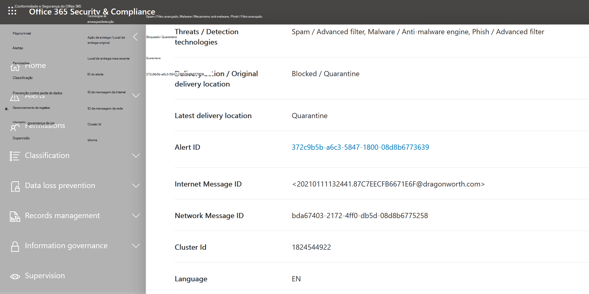
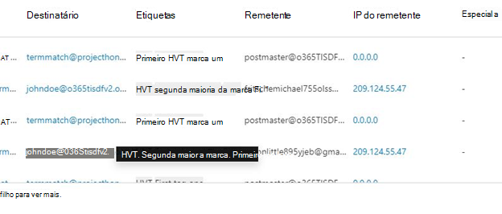
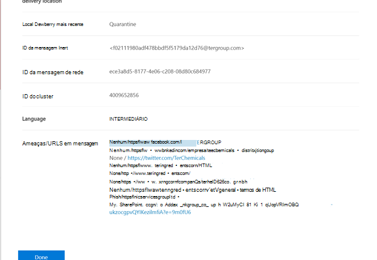
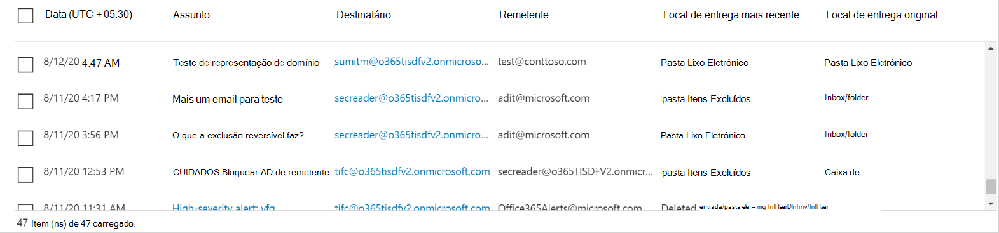
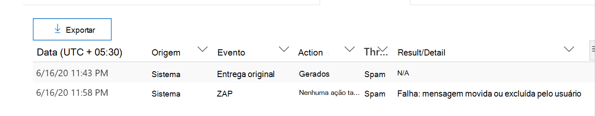
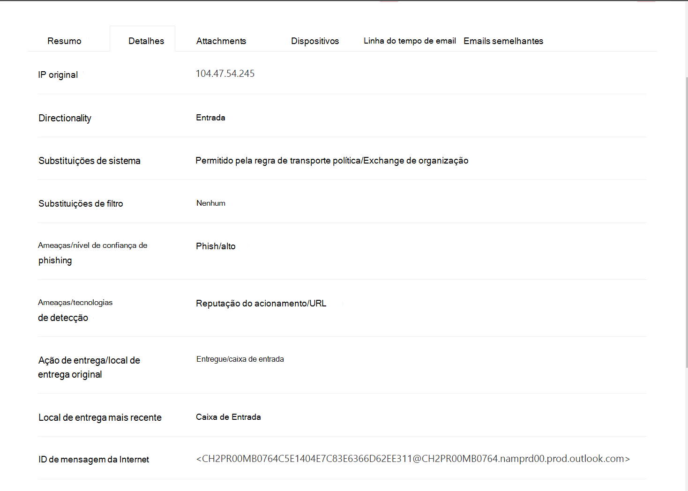
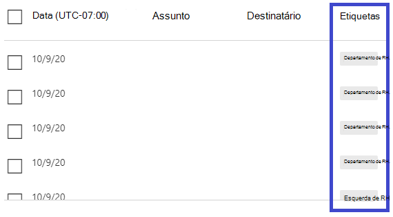

# Explorador de Ameaças e Detecções em tempo real

**Aplica-se a**
- [Plano 1 e plano 2 do Microsoft Defender para Office 365](defender-for-office-365.md)
- [Microsoft 365 Defender](../defender/microsoft-365-defender.md)

Se a sua organização tiver o [Microsoft Defender](defender-for-office-365.md)para Office 365 , e você tiver as permissões [necessárias,](#required-licenses-and-permissions)você terá detecções do **Explorer** ou em tempo **real** (anteriormente relatórios em tempo *real* [—](#new-features-in-threat-explorer-and-real-time-detections)consulte novidades !). No Centro de Conformidade & segurança, vá para **Gerenciamento de** ameaças e escolha **Explorer** _ou_ **Detecções em tempo real.**

 

****

|Com o Microsoft Defender para Office 365 Plano 2, você verá:|Com o Microsoft Defender para Office 365 Plano 1, consulte:|
|---|---|
|||
|

As detecções do Explorer ou em tempo real ajudam sua equipe de operações de segurança a investigar e responder a ameaças com eficiência. O relatório se parece com a seguinte imagem:

Com este relatório, você pode:

- [Consulte malware detectado pelos recursos Microsoft 365 segurança](#see-malware-detected-in-email-by-technology)
- [Exibir URL de phishing e clicar em dados de veredito](#view-phishing-url-and-click-verdict-data)
- [Inicie um processo automatizado de investigação e resposta a](#start-automated-investigation-and-response) partir de uma exibição no Explorer (Defender para Office 365 Plano 2 somente)
- [Investigar emails mal-intencionados e muito mais](#more-ways-to-use-explorer-and-real-time-detections)

## Melhorias na Experiência de Busca de Ameaças

### Introdução à ID de alerta do Defender para Office 365 alertas no Explorer/Detecções em tempo real

Hoje, se você navegar de um alerta para o Explorador de Ameaças, ele abrirá uma exibição filtrada dentro do Explorer, com o exibição filtrado pela ID da política de alerta (a ID da política é um identificador exclusivo para uma política de alerta).
Estamos tornando essa integração mais relevante introduzindo a ID de alerta (consulte um exemplo de ID de alerta abaixo) no Explorador de Ameaças e detecções em tempo real para que você veja mensagens relevantes para o alerta específico, bem como uma contagem de emails. Você também poderá ver se uma mensagem fazia parte de um alerta, bem como navegar dessa mensagem para o alerta específico.

A ID do alerta está disponível na URL quando você está exibindo um alerta individual; um exemplo sendo `https://protection.office.com/viewalerts?id=372c9b5b-a6c3-5847-fa00-08d8abb04ef1` .

> [!div class="mx-imgBorder"]
> 

> [!div class="mx-imgBorder"]
> 

### Estendendo a retenção de dados do Explorer (e detecções em tempo real) e o limite de pesquisa para locatários de avaliação de 7 a 30 dias

Como parte dessa alteração, você poderá pesquisar e filtrar dados de email por 30 dias (um aumento dos últimos 7 dias) no Explorador de Ameaças/Detecções em tempo real para os locatários de avaliação do Defender para Office P1 e P2.
Isso não afeta locatários de produção para clientes P1 e P2/E5, que já têm os recursos de pesquisa e retenção de dados de 30 dias.

### Limites atualizados para Exportação de registros para o Explorador de Ameaças

Como parte dessa atualização, o número de linhas para registros de email que podem ser exportados do Explorador de Ameaças é aumentado de 9990 para 200.000 registros. O conjunto de colunas que podem ser exportadas no momento permanecerá o mesmo, mas o número de linhas aumentará do limite atual.

### Marcas no Explorador de Ameaças

> [!NOTE]
> O recurso de marcas de usuário está em *Visualização*, não está disponível para todos e está sujeito a alterações. Para obter informações sobre o cronograma de lançamento, confira o Microsoft 365 de lançamento.

As marcas de usuário identificam grupos específicos de usuários no Microsoft Defender para Office 365. Para obter mais informações sobre marcas, incluindo licenciamento e configuração, consulte [Marcas de usuário](user-tags.md).

No Explorador de Ameaças, você pode ver informações sobre marcas de usuário nas experiências a seguir.

#### Exibição de grade de email

A **coluna Marcas** na grade de email contém todas as marcas que foram aplicadas às caixas de correio do remetente ou destinatário. Por padrão, as marcas do sistema, como contas de prioridade, são mostradas primeiro.

> [!div class="mx-imgBorder"]
> 

#### Filtragem

Você pode usar marcas como filtro. Hunt just across priority accounts or specific user tags scenarios. Você também pode excluir resultados que tenham determinadas marcas. Combine essa funcionalidade com outros filtros para restringir seu escopo de investigação.

> [!div class="mx-imgBorder"]
> 

#### Sobremenu de detalhes de email

Para exibir as marcas individuais para remetente e destinatário, selecione o assunto para abrir o sobremenu de detalhes da mensagem. Na guia **Resumo,** as marcas de remetente e destinatário são mostradas separadamente, se elas estão presentes para um email.
As informações sobre marcas individuais para remetente e destinatário também se estendem aos dados CSV exportados, onde você pode ver esses detalhes em duas colunas separadas.

> [!div class="mx-imgBorder"]
> 

As informações de marcas também são mostradas no flyout de cliques da URL. Para exibi-lo, vá para Phish ou Todos os Emails e, em seguida, para a **guia UrLs** ou **Cliques de URL.** Selecione um flyout de URL individual para exibir detalhes adicionais sobre cliques para essa URL, incluindo marcas associadas a esse clique.

### Exibição de linha do tempo atualizada

> [!div class="mx-imgBorder"]
> 
>
Saiba mais assistindo a [este vídeo](https://www.youtube.com/watch?v=UoVzN0lYbfY&list=PL3ZTgFEc7LystRja2GnDeUFqk44k7-KXf&index=4).

## Melhorias na experiência de busca de ameaças (futuras)

### Informações atualizadas sobre ameaças para emails

Nos concentramos em melhorias de plataforma e qualidade de dados para aumentar a precisão e a consistência dos dados para registros de email. As melhorias incluem a consolidação de informações de pré-entrega e pós-entrega, como ações executadas em um email como parte do processo ZAP, em um único registro. Detalhes adicionais, como veredito de spam, ameaças no nível da entidade (por exemplo, qual URL foi mal-intencionada) e locais de entrega mais recentes também estão incluídos.

Após essas atualizações, você verá uma única entrada para cada mensagem, independentemente dos diferentes eventos pós-entrega que afetam a mensagem. As ações podem incluir ZAP, correção manual (o que significa ação de administrador), entrega dinâmica e assim por diante.

Além de mostrar ameaças de malware e phishing, você vê o veredito de spam associado a um email. No email, confira todas as ameaças associadas ao email juntamente com as tecnologias de detecção correspondentes. Um email pode ter zero, uma ou várias ameaças. Você verá as ameaças atuais na seção **Detalhes** do sobremenu de email. Para várias ameaças (como malware e  phishing), o campo técnico detecção mostra o mapeamento de detecção de ameaças, que é a tecnologia de detecção que identificou a ameaça.

O conjunto de tecnologias de detecção agora inclui novos métodos de detecção, bem como tecnologias de detecção de spam. Você pode usar o mesmo conjunto de tecnologias de detecção para filtrar os resultados nas diferentes exibições de email (Malware, Phish, Todos os Emails).

> [!NOTE]
> A análise de veredito pode não estar necessariamente vinculada a entidades. Por exemplo, um email pode ser classificado como phishing ou spam, mas não há URLs carimbadas com um veredito de phish/spam. Isso porque os filtros também avaliam o conteúdo e outros detalhes de um email antes de atribuir um veredito.

#### Ameaças em URLs

Agora você pode ver a ameaça específica para uma URL na guia Detalhes do sobrevoo **de** email. A ameaça pode ser *malware,* *phish*, *spam* ou *nenhum*.)

> [!div class="mx-imgBorder"]
> 

### Exibição de linha do tempo atualizada (futura)

> [!div class="mx-imgBorder"]
> 

O exibição linha do tempo identifica todos os eventos de entrega e pós-entrega. Ele inclui informações sobre a ameaça identificada nesse ponto de tempo para um subconjunto desses eventos. O modo de exibição linha do tempo também fornece informações sobre qualquer ação adicional realizada (como ZAP ou correção manual), juntamente com o resultado dessa ação. As informações de exibição de linha do tempo incluem:

- **Fonte:** Origem do evento. Pode ser administrador/sistema/usuário.
- **Evento:** Inclui eventos de nível superior, como entrega original, correção manual, ZAP, envios e entrega dinâmica.
- **Ação:** A ação específica que foi tomada como parte da ação ZAP ou administrador (por exemplo, exclusão suave).
- **Ameaças:** Aborda as ameaças (malware, phish, spam) identificadas nesse momento.
- **Resultado/Detalhes:** Mais informações sobre o resultado da ação, como se ela foi executada como parte da ação ZAP/administrador.

### Local de entrega original e mais recente

No momento, vamos superfícier o local de entrega na grade de email e no sobrevoo de email. O **campo Local de** entrega está sendo renomeado local de **_entrega_ original *_. E estamos introduzindo outro campo, _ Local de*_entrega mais recente._**

**O local de entrega original** dará mais informações sobre onde um email foi entregue inicialmente. **O local de entrega mais** recente irá dizer onde um email foi parar após ações do sistema, como ações de administrador ou *ZAP,* como *Mover para itens excluídos.* O local de entrega mais recente destina-se a dizer aos administradores o último local conhecido da mensagem após a entrega ou qualquer ação do sistema/administrador. Ele não inclui nenhuma ação do usuário final no email. Por exemplo, se um usuário excluiu uma mensagem ou moveu a mensagem para arquivo morto/pst, o local de "entrega" da mensagem não será atualizado. Mas se uma ação do sistema atualizou o local (por exemplo, ZAP resultando em um email mudando para **quarentena),** o local de entrega mais recente seria "quarentena".

> [!div class="mx-imgBorder"]
> 

> [!NOTE]
> Há alguns casos em que o local de **entrega** e a **ação De entrega** podem ser "desconhecidas":
>
> - Você pode  ver o local  de entrega como "entregue" e o local de entrega como "desconhecido" se a mensagem foi entregue, mas uma regra de Caixa de Entrada moveu a mensagem para uma pasta padrão (como Rascunho ou Arquivo Morto) em vez de para a pasta Caixa de Entrada ou Lixo Eletrônico.
>
> - **O local de entrega** mais recente pode ser desconhecido se uma ação de administrador/sistema (como ZAP) foi tentada, mas a mensagem não foi encontrada. Normalmente, a ação acontece depois que o usuário moveu ou excluiu a mensagem. Nesses casos, verifique a coluna **Resultado/Detalhes** no exibição de linha do tempo. Procure a instrução "Mensagem movida ou excluída pelo usuário".

> [!div class="mx-imgBorder"]
> 

### Ações adicionais

*Ações adicionais* foram aplicadas após a entrega do email. Eles podem incluir *ZAP*, *correção manual* (ação tomada por um Administrador, como exclusão *suave),* entrega dinâmica e *reprocessado* (para um email que foi detectado retroativamente como bom).

> [!NOTE]
> Como parte das alterações pendentes, o valor "Removido por ZAP" atualmente é removido no filtro Ação de Entrega. Você terá uma maneira de pesquisar todos os emails com a tentativa ZAP por meio **de ações adicionais.**

> [!div class="mx-imgBorder"]
> 

### Substituições do sistema

*As substituições do* sistema permitem que você faça exceções ao local de entrega pretendido de uma mensagem. Você substitui o local de entrega fornecido pelo sistema, com base nas ameaças e outras detecções identificadas pela pilha de filtragem. As substituições do sistema podem ser definidas por meio de uma política de locatário ou de usuário para entregar a mensagem conforme sugerido pela política. As substituições podem identificar a entrega não intencional de mensagens mal-intencionadas devido a lacunas de configurações, como uma política de Cofre Sender muito ampla definida por um usuário. Esses valores de substituição podem ser:

- Permitido pela política de usuário: um usuário cria políticas no nível da caixa de correio para permitir domínios ou destinatários.

- Bloqueado pela política de usuário: um usuário cria políticas no nível da caixa de email para bloquear domínios ou senders.

- Permitido pela política organizacional: as equipes de segurança da organização configuram políticas ou Exchange de fluxo de emails (também conhecidas como regras de transporte) para permitir que os envios e domínios para usuários em sua organização. Isso pode ser para um conjunto de usuários ou toda a organização.

- Bloqueado pela política de organização: as equipes de segurança da organização configuram políticas ou regras de fluxo de emails para bloquear os envios, domínios, idiomas de mensagens ou IPs de origem para usuários em sua organização. Isso pode ser aplicado a um conjunto de usuários ou a toda a organização.

- Extensão de arquivo bloqueada pela política da organização: a equipe de segurança de uma organização bloqueia uma extensão de nome de arquivo pelas configurações de política anti-malware. Esses valores agora serão exibidos em detalhes de email para ajudar nas investigações. As equipes do Secops também podem usar o recurso rich-filtering para filtrar extensões de arquivo bloqueados.

> [!div class="mx-imgBorder"]
> 

### Melhorias na URL e experiência de cliques

As melhorias incluem:

- Mostre a URL clicada completa (incluindo todos os parâmetros de consulta que fazem parte da URL) na seção **Cliques** do flyout da URL. Atualmente, o domínio e o caminho da URL aparecem na barra de título. Estamos estendendo essas informações para mostrar a URL completa.

- Correções entre filtros de URL (*URL* versus domínio *url* versus domínio *de URL* e caminho ): as atualizações afetam a pesquisa de mensagens que contêm um veredito de URL/clique. Habilitamos o suporte para pesquisas agnósticas de protocolo, para que você possa pesquisar uma URL sem usar `http` . Por padrão, a pesquisa de URL é mapeada para http, a menos que outro valor seja explicitamente especificado. Por exemplo:
  - Pesquise com e sem `http://` o prefixo nos **campos de filtro URL,** **Domínio de URL** e Domínio **de URL** e Caminho. As pesquisas devem mostrar os mesmos resultados.
  - Pesquise `https://` o prefixo em **URL**. Quando nenhum valor é especificado, o `http://` prefixo é assumido.
  - `/`é ignorado no início e no final dos campos caminho **da URL,** **Domínio da URL,** **domínio de URL e caminho.** `/` no final do campo **URL** é ignorado.

### Nível de confiança de phishing

O nível de confiança de phishing ajuda a identificar o grau de confiança com o qual um email foi categorizado como "phish". Os dois valores possíveis são *Alto* e *Normal*. Nos estágios iniciais, esse filtro estará disponível somente na exibição phishing do Explorador de Ameaças.

### Sinal de URL do ZAP

O sinal de URL zap é geralmente usado para cenários de alerta zap phishing em que um email foi identificado como Phish e removido após a entrega. Esse sinal conecta o alerta aos resultados correspondentes no Explorer. É um dos IOCs do alerta.

Para melhorar o processo de busca, atualizamos o Explorador de Ameaças e as detecções em tempo real para tornar a experiência de busca mais consistente. As alterações são descritas aqui:

- [Melhorias no timezone](#timezone-improvements)
- [Atualização no processo de atualização](#update-in-the-refresh-process)
- [Detalhamento de gráficos para adicionar a filtros](#chart-drilldown-to-add-to-filters)
- [Em atualizações de informações do produto](#in-product-information-updates)

### Filtrar por marcas de usuário

Agora você pode classificar e filtrar o sistema ou marcas de usuário personalizadas para entender rapidamente o escopo das ameaças. Para saber mais, confira [Marcas de usuário](user-tags.md).

> [!IMPORTANT]
> A filtragem e a classificação por marcas de usuário estão atualmente em visualização pública. Essa funcionalidade pode ser substancialmente modificada antes de ser lançada comercialmente. A Microsoft não faz garantias, expressas ou implícitas, com relação às informações fornecidas sobre ele.

> [!div class="mx-imgBorder"]
> 

### Melhorias no timezone

Você verá o fuso horário para os registros de email no Portal, bem como para dados exportados. Ele ficará visível em experiências como Grade de Email, Detalhes, Linha do Tempo do Email e Emails Semelhantes, portanto, o fuso horário para o conjunto de resultados é claro.

> [!div class="mx-imgBorder"]
> 

### Atualização no processo de atualização

Alguns usuários comentaram sobre a confusão com a atualização automática (por exemplo, assim que você alterar a data, as atualizações de página) e a atualização manual (para outros filtros). Da mesma forma, remover filtros leva à atualização automática. Alterar filtros durante a modificação da consulta pode causar experiências de pesquisa inconsistentes. Para resolver esses problemas, estamos mudando para um mecanismo de filtragem manual.

Do ponto de vista da experiência, o usuário pode aplicar e remover o intervalo diferente de filtros (do conjunto de filtros e da data) e selecionar o botão de atualização para filtrar os resultados depois de definir a consulta. O botão de atualização também agora é enfatizado na tela. Também atualizamos as dicas de ferramentas relacionadas e a documentação no produto.

> [!div class="mx-imgBorder"]
> 

### Detalhamento de gráficos para adicionar a filtros

Agora você pode gráficor valores de legenda para adicioná-los como filtros. Selecione o **botão Atualizar** para filtrar os resultados.

> [!div class="mx-imgBorder"]
> 

### Atualizações de informações no produto

Detalhes adicionais agora estão disponíveis dentro do produto, como o número total de resultados de pesquisa dentro da grade (consulte abaixo). Melhoramos rótulos, mensagens de erro e dicas de ferramentas para fornecer mais informações sobre os filtros, a experiência de pesquisa e o conjunto de resultados.

> [!div class="mx-imgBorder"]
> 

## Recursos estendidos no Explorador de Ameaças

### Principais usuários direcionados

Hoje, expõemos a lista dos principais usuários direcionados na exibição Malware para emails, na seção **Principais Famílias de Malware.** Também estenderemos essa exibição nos pontos de exibição Phish and All Email. Você poderá ver os cinco principais usuários direcionados, juntamente com o número de tentativas para cada usuário para o exibição correspondente. Por exemplo, para exibição phishing, você verá o número de tentativas de Phishing.

Você poderá exportar a lista de usuários direcionados, até um limite de 3.000, juntamente com o número de tentativas de análise offline para cada modo de exibição de email. Além disso, selecionar o número de tentativas (por exemplo, 13 tentativas na imagem abaixo) abrirá um modo de exibição filtrado no Explorador de Ameaças, para que você possa ver mais detalhes em emails e ameaças para esse usuário.

> [!div class="mx-imgBorder"]
> 

### Exchange de transporte

Como parte do enriquecimento de dados, você poderá ver todas as diferentes regras de transporte Exchange (ETR) que foram aplicadas a uma mensagem. Essas informações estarão disponíveis na exibição grade Email. Para exibi-lo, selecione **Opções de** coluna na grade e **adicione Exchange Regra** de Transporte nas opções de coluna. Ele também estará visível no **sobremenu de** Detalhes no email.

Você poderá ver o GUID e o nome das regras de transporte que foram aplicadas à mensagem. Você poderá pesquisar as mensagens usando o nome da regra de transporte. Esta é uma pesquisa "Contém", o que significa que você também pode fazer pesquisas parciais.

> [!IMPORTANT]
> A pesquisa ETR e a disponibilidade de nome dependem da função específica atribuída a você. Você precisa ter uma das seguintes funções/permissões para exibir os nomes e a pesquisa do ETR. Se você não tiver nenhuma dessas funções atribuídas a você, não poderá ver os nomes das regras de transporte ou pesquisar mensagens usando nomes ETR. No entanto, você pode ver o rótulo ETR e informações GUID nos Detalhes do Email. Outras experiências de visualização de registro em Grades de Email, Sub-sub-sublhsados de email, Filtros e Exportação não são afetadas.
>
> - Somente EXO - Prevenção contra Perda de Dados: Todos
> - Somente EXO - O365SupportViewConfig: Todos
> - Microsoft Azure Active Directory ou EXO - Administrador de Segurança: Todos
> - AAD ou EXO - Leitor de Segurança: Tudo
> - Somente EXO - Regras de Transporte: Todos
> - Somente EXO - View-Only configuração: todos
>
> Na grade de email, sobremenos e CSV exportados, os ETRs são apresentados com um Nome/GUID, conforme mostrado abaixo.
>
> > [!div class="mx-imgBorder"]
> > 

### Conectores de entrada

Conectores são uma coleção de instruções que personalizam como seu email flui de e para sua Microsoft 365 ou Office 365 organização. Eles permitem que você aplique quaisquer restrições ou controles de segurança. No Explorador de Ameaças, agora você pode exibir os conectores relacionados a um email e pesquisar emails usando nomes de conectores.

A pesquisa por conectores é "contém" na natureza, o que significa que pesquisas parciais de palavra-chave também devem funcionar. Na exibição de grade principal, no sobremenu de Detalhes e no CSV Exportado, os conectores são mostrados no formato Nome/GUID, conforme mostrado aqui:

> [!div class="mx-imgBorder"]
> 

## Novos recursos no Explorador de Ameaças e detecções em tempo real

- [Exibir emails de phishing enviados a usuários e domínios personificados](#view-phishing-emails-sent-to-impersonated-users-and-domains)
- [Visualizar o header de email e baixar o corpo do email](#preview-email-header-and-download-email-body)
- [Linha do tempo do email](#email-timeline)
- [Exportar dados de clique de URL](#export-url-click-data)

### Exibir emails de phishing enviados a usuários e domínios personificados

Para identificar tentativas de phishing contra usuários e domínios que são usuários personificados devem ser adicionados à lista *de usuários para proteger*. Para domínios, os administradores devem habilitar *domínios da* Organização ou adicionar um nome de domínio a *Domínios para proteger*. Os domínios a proteger são encontrados na página *política Anti-Phishing* na *seção Representação.*

Para revisar mensagens de phishing e pesquisar usuários ou domínios personificados, use a exibição [Email > Phish](threat-explorer-views.md) do Explorer.

Este exemplo usa o Explorador de Ameaças.

1. No Centro [de Conformidade & segurança](https://protection.office.com) ( , escolha Gerenciamento de ameaças > Explorer https://protection.office.com) (ou detecções em tempo real).

2. No menu Exibir, escolha Email > Phish.

   Aqui você pode escolher **domínio personificado ou** **usuário personificado.**

3. **Selecione** **Domínio personificado** e digite um domínio protegido na caixa de texto.

   Por exemplo, procure nomes de domínio protegidos como *contoso,* *contoso.com* ou *contoso.com.au*.

4. Selecione o Assunto de qualquer mensagem na guia Email > Detalhes para ver informações adicionais de representação, como Domínio Personificado / Local Detectado.

    **OU**

    Selecione **Usuário personificado** e digite o endereço de email de um usuário protegido na caixa de texto.

    > [!TIP]
    > **Para melhores resultados,** use *endereços de email completos* para pesquisar usuários protegidos. Você encontrará seu usuário protegido com mais rapidez e mais êxito se procurar por firstname.lastname@contoso.com *,* por exemplo, ao investigar a representação do usuário. Ao pesquisar um domínio protegido, a pesquisa levará o domínio raiz (contoso.com, por exemplo) e o nome de domínio (*contoso*). Pesquisar o domínio raiz *contoso.com* retornará as duas contoso.com *e* o nome de domínio *contoso*.

5. Selecione o **Assunto de** qualquer mensagem na guia Detalhes da guia **Email** para ver informações de representação adicionais sobre o usuário ou domínio e o  >   local *detectado.*

    :::image type="content" source="../../media/threat-ex-views-impersonated-user-image.png" alt-text="O painel de detalhes do Explorador de Ameaças para um usuário protegido mostrando o local de detecção e a ameaça detectada (aqui representação de phishing de um usuário).":::

> [!NOTE]
> Na etapa 3 ou 5, se  você escolher  Tecnologia de Detecção e selecionar Domínio de Representação ou Usuário de Representação, respectivamente, as informações na guia **Detalhes** da guia Email sobre o usuário ou domínio e o local Detectado serão mostradas somente nas mensagens relacionadas ao usuário ou domínio listados na página  política  >   *Anti-Phishing.* 

### Visualizar o header de email e baixar o corpo do email

Agora você pode visualizar um header de email e baixar o corpo do email no Explorador de Ameaças. Os administradores podem analisar os headers/mensagens de email baixadas para ameaças. Como baixar mensagens de email pode correr o risco de exposição de informações, esse processo é controlado pelo controle de acesso baseado em função (RBAC). Uma nova função, *Preview*, deve ser adicionada a outro grupo de funções (como Operações de Segurança ou Administrador de Segurança) para conceder a capacidade de baixar emails no visualização de mensagens de email. No entanto, a exibição do header de email não exige nenhuma função adicional (diferente do necessário para exibir mensagens no Explorador de Ameaças).

As detecções do Explorer e em tempo real também receberão novos campos que fornecem uma imagem mais completa de onde suas mensagens de email chegarão. Essas alterações facilitam a busca para Operações de Segurança. Mas o resultado principal é que você pode saber o local das mensagens de email com problemas rapidamente.

Como isso é feito? O status de entrega agora está dividido em duas colunas:

- **Ação de entrega** - Status do email.
- **Local de entrega** - Onde o email foi roteado.

*Ação de* entrega é a ação realizada em um email devido a políticas ou detecções existentes. Aqui estão as ações possíveis para um email:

 

****

|Entregue|Junked|Blocked|Substituído|
|---|---|---|---|
|O email foi entregue na caixa de entrada ou pasta de um usuário e o usuário pode acessá-lo.|O email foi enviado para a pasta Lixo Eletrônico ou Excluído do usuário e o usuário pode acessá-lo.|Emails que estão em quarentena, que falharam ou foram descartados. Esses emails são inacessíveis para o usuário.|O email tinha anexos mal-intencionados substituídos .txt arquivos que afirmam que o anexo era mal-intencionado.|
|

Veja o que o usuário pode ou não ver:

 

****

|Acessível aos usuários finais|Usuários inacessíveis para os usuários finais|
|---|---|
|Entregue|Blocked|
|Junked|Substituído|
|

**O local de** entrega mostra os resultados de políticas e detecções que são executados após a entrega. Ele está vinculado à ação **_Entrega_**. Estes são os valores possíveis:

- *Caixa de entrada ou pasta*: o email está na caixa de entrada ou em uma pasta (de acordo com suas regras de email).
- *Local ou externo:* a caixa de correio não existe na nuvem, mas é local.
- *Pasta lixo* eletrônico : o email está na pasta Lixo Eletrônico do usuário.
- *Pasta itens excluídos*: o email na pasta Itens Excluídos de um usuário.
- *Quarentena*: o email está em quarentena e não na caixa de correio de um usuário.
- *Falha*: O email falhou ao chegar à caixa de correio.
- *Descartado*: o email foi perdido em algum lugar no fluxo de emails.

### Linha do tempo do email

A **linha do tempo de** Email é um novo recurso do Explorer que melhora a experiência de busca para administradores. Isso reduz o tempo gasto verificando locais diferentes para tentar entender o evento. Quando vários eventos ocorrem ao mesmo tempo em que um email chega, esses eventos são exibidos em um modo de exibição de linha do tempo. Alguns eventos que ocorrem com seu email após a entrega são capturados na **coluna Ação** especial. Os administradores podem combinar informações da linha do tempo com a ação especial realizada na entrega de email para obter informações sobre como suas políticas funcionam, onde o email foi finalmente roteado e, em alguns casos, qual foi a avaliação final.

Para obter mais informações, [consulte Investigar e correção de emails](investigate-malicious-email-that-was-delivered.md)mal-intencionados que foram entregues Office 365 .

### Exportar dados de clique de URL

Agora você pode exportar relatórios para cliques de URL para Microsoft Excel para exibir a **ID** da mensagem de rede e clicar em **veredito**, o que ajuda a explicar de onde o tráfego de clique de URL se originou. Veja como funciona: no Gerenciamento de Ameaças na barra Office 365 de início rápido, siga esta cadeia:

**Explorer** \> **Exibir Phish** \> **Cliques** \> **Principais URLs** ou **URL Principais Cliques** \> selecione qualquer registro para abrir o flyout da URL.

Quando você selecionar uma URL na lista, você verá um novo botão **Exportar** no painel de sobressalto. Use este botão para mover dados para uma planilha Excel para facilitar o relatório.

Siga este caminho para chegar ao mesmo local no relatório de detecções em tempo real:

**Explorer** \> **Detecções em tempo real** \> **Exibir Phish** \> **URLs** \> **URLs principais** ou **Cliques Principais** Selecione qualquer registro para abrir o \> flyout de URL \> navegue até a guia **Cliques.**

> [!TIP]
> A ID da Mensagem de Rede mapeia o clique de volta para emails específicos quando você pesquisa a ID por meio do Explorer ou ferramentas de terceiros associadas. Essas pesquisas identificam o email associado a um resultado de clique. Ter a ID de Mensagem de Rede correlacionada torna a análise mais rápida e mais eficiente.

> [!div class="mx-imgBorder"]
> 

## Ver malware detectado no email por tecnologia

Suponha que você queira ver malware detectado em emails organizados por Microsoft 365 tecnologia. Para fazer isso, use a [exibição Email > Malware](threat-explorer-views.md#email--malware) do Explorer (ou detecções em tempo real).

1. No Centro de Conformidade & segurança ( ), escolha Explorador de gerenciamento de ameaças <https://protection.office.com>  \>  (ou **detecções em tempo real).** (Este exemplo usa o Explorer.)

2. No menu **Exibir,** escolha **Malware de** \> **Email**.

   > [!div class="mx-imgBorder"]
   > 

3. Clique **em Remetente** e, em seguida, escolha Tecnologia de **Detecção** \> **Básica**.

   Suas tecnologias de detecção agora estão disponíveis como filtros para o relatório.

   > [!div class="mx-imgBorder"]
   > 

4. Escolha uma opção. Em seguida, selecione **o botão** Atualizar para aplicar esse filtro.

   > [!div class="mx-imgBorder"]
   > 

O relatório é atualizado para mostrar os resultados que o malware detectou no email, usando a opção de tecnologia selecionada. A partir daqui, você pode realizar uma análise mais detalhada.

## Exibir URL de phishing e clicar em dados de veredito

Suponha que você queira ver tentativas de phishing por meio de URLs por email, incluindo uma lista de URLs que foram permitidas, bloqueadas e anuladas. Para identificar URLs que foram clicadas, Cofre [links](safe-links.md) devem ser configurados. Certifique-se de configurar as políticas [Cofre Links](set-up-safe-links-policies.md) para proteção de tempo de clique e registro em log de vereditos de clique por Cofre Links.

Para revisar URLs de phishing em mensagens e cliques em URLs em mensagens de phishing, use a exibição [   >  **phishing**](threat-explorer-views.md#email--phish) de email do Explorer ou detecções em tempo real.

1. No Centro de Conformidade & segurança ( ), escolha Explorador de gerenciamento de ameaças <https://protection.office.com>  \>  (ou **detecções em tempo real).** (Este exemplo usa o Explorer.)

2. No menu **Exibir,** escolha **Email** \> **Phish**.

   > [!div class="mx-imgBorder"]
   > 

3. Clique **em Remetente** e, em seguida, escolha **URLs** \> **Clique em veredito**.

4. Selecione uma ou mais opções, como **Bloqueado** e Bloqueado  **substituído,** e selecione o botão Atualizar na mesma linha que as opções para aplicar esse filtro. (Não atualize a janela do navegador.)

   > [!div class="mx-imgBorder"]
   > 

   O relatório é atualizado para mostrar duas tabelas de URL diferentes na guia URL no relatório:

   - **As URLs principais** são as URLs nas mensagens que você filtreu para baixo e a ação de entrega de email conta para cada URL. Na exibição de email phishing, essa lista normalmente contém URLs legítimas. Os invasores incluem uma mistura de URLs boas e ruins em suas mensagens para tentar fazê-las entregues, mas fazem com que os links mal-intencionados pareçam mais interessantes. A tabela de URLs é classificação pela contagem total de emails, mas essa coluna está oculta para simplificar o exibição.

   - **Os cliques principais** são os Cofre URLs empacotadas por links que foram clicadas, classificação por contagem total de cliques. Esta coluna também não é exibida, para simplificar o exibição. Contagens totais por coluna indicam Cofre links clicam em contagem de vereditos para cada URL clicada. Na exibição de email phishing, geralmente são URLs suspeitas ou mal-intencionadas. Mas a exibição pode incluir URLs que não são ameaças, mas estão em mensagens de phishing. Os cliques de URL em links não mapeados não aparecem aqui.

   As duas tabelas de URL mostram URLs principais em mensagens de email de phishing por ação de entrega e local. As tabelas mostram cliques de URL que foram bloqueados ou visitados apesar de um aviso, para que você possa ver quais possíveis links inválidos foram apresentados aos usuários e que o usuário clicou. A partir daqui, você pode realizar uma análise mais detalhada. Por exemplo, abaixo do gráfico, você pode ver as PRINCIPAIS URLs em mensagens de email que foram bloqueadas no ambiente da sua organização.

   > [!div class="mx-imgBorder"]
   > 

   Selecione uma URL para exibir informações mais detalhadas.

   > [!NOTE]
   > Na caixa de diálogo sobre o sobrevoo de URL, a filtragem em mensagens de email é removida para mostrar a exibição completa da exposição da URL em seu ambiente. Isso permite filtrar as mensagens de email que você está preocupado no Explorer, encontrar URLs específicas que são possíveis ameaças e, em seguida, expandir seu entendimento sobre a exposição de URL em seu ambiente (por meio da caixa de diálogo detalhes da URL) sem precisar adicionar filtros de URL ao próprio exibição do Explorer.

### Interpretação de vereditos de clique

Nos flyouts Email ou URL, Cliques Principais, bem como em nossas experiências de filtragem, você verá valores de veredito de clique diferentes:

- **Nenhuma:** Não é possível capturar o veredito para a URL. O usuário pode ter clicado na URL.
- **Permitido:** O usuário teve permissão para navegar até a URL.
- **Bloqueado:** O usuário foi impedido de navegar para a URL.
- **Veredito pendente:** O usuário foi apresentado com a página pendente de detonação.
- **Bloqueado substituído:** O usuário foi impedido de navegar diretamente para a URL. Mas o usuário sobrecarregue o bloco para navegar até a URL.
- **Veredito pendente ignorado:** O usuário foi apresentado com a página de detonação. Mas o usuário overrode a mensagem para acessar a URL.
- **Erro:** O usuário foi apresentado com a página de erro ou ocorreu um erro na captura do veredito.
- **Falha:** Ocorreu uma exceção desconhecida durante a captura do veredito. O usuário pode ter clicado na URL.

## Revisar mensagens de email relatadas pelos usuários

Suponha que você queira ver mensagens de email que os usuários em sua organização relataram como *Lixo* *Eletrônico*, Não Lixo Eletrônico ou *Phishing* por meio do [add-in](enable-the-report-message-add-in.md) Mensagem de Relatório ou do complemento Relatar [Phishing](enable-the-report-phish-add-in.md). Para vê-los, use a [ **exibição**  >  **Envios de** Email](threat-explorer-views.md#email--submissions) do Explorer (ou detecções em tempo real).

1. No Centro de Conformidade & segurança ( ), escolha Explorador de gerenciamento de ameaças <https://protection.office.com>  \>  (ou **detecções em tempo real).** (Este exemplo usa o Explorer.)

2. No menu **Exibir,** escolha  \> **Envios de Email**.

   > [!div class="mx-imgBorder"]
   > 

3. Clique **em Remetente** e escolha Tipo de **Relatório** \> **Básico.**

4. Selecione uma opção, como **Phish** e, em seguida, selecione o **botão Atualizar.**

   > [!div class="mx-imgBorder"]
   > 

O relatório é atualizado para mostrar dados sobre mensagens de email relatadas por pessoas em sua organização como uma tentativa de phishing. Você pode usar essas informações para conduzir análises adicionais e, se necessário, ajustar suas políticas [anti-phishing](configure-mdo-anti-phishing-policies.md)no Microsoft Defender para Office 365 .

## Iniciar investigação e resposta automatizadas

> [!NOTE]
> Recursos automatizados de investigação e resposta estão disponíveis no Microsoft Defender para Office 365 *Plano 2* e *Office 365 E5*.

[A investigação e a resposta automatizadas](automated-investigation-response-office.md) podem economizar tempo e esforço gastos da equipe de operações de segurança investigando e atenuando ataques cibernéticos. Além de configurar alertas que podem disparar uma playbook de segurança, você pode iniciar um processo automatizado de investigação e resposta a partir de uma exibição no Explorer. Para obter detalhes, consulte [Example: A security administrator triggers an investigation from Explorer](automated-investigation-response-office.md#example-a-security-administrator-triggers-an-investigation-from-threat-explorer).

## Mais maneiras de usar detecções do Explorer e em tempo real

Além dos cenários descritos neste artigo, você tem muito mais opções de relatórios disponíveis com o Explorer (ou detecções em tempo real). Confira os seguintes artigos:

- [Localizar e investigar emails mal-intencionados entregues](investigate-malicious-email-that-was-delivered.md)
- [Exibir arquivos mal-intencionados detectados no SharePoint Online, OneDrive e Microsoft Teams](./mdo-for-spo-odb-and-teams.md)
- [Obter uma visão geral dos exibições no Explorador de Ameaças (e detecções em tempo real)](threat-explorer-views.md)
- [Relatório de status de proteção contra ameaças](view-email-security-reports.md#threat-protection-status-report)
- [Investigação e resposta automatizadas em Microsoft 365 Defender](../defender/m365d-autoir.md)

## Licenças e permissões necessárias

Você deve ter [o Microsoft Defender para Office 365](defender-for-office-365.md) usar detecções do Explorer ou em tempo real.

- O Explorer está incluído no Defender para Office 365 Plano 2.
- O relatório de detecções em tempo real está incluído no Defender para Office 365 Plano 1.
- Planeje atribuir licenças para todos os usuários que devem ser protegidos pelo Defender para Office 365. As detecções do Explorer e em tempo real mostram dados de detecção para usuários licenciados.

Para exibir e usar detecções do Explorer ou em tempo real, você deve ter permissões apropriadas, como as concedidas a um administrador de segurança ou leitor de segurança.

- Para o Centro de Conformidade & segurança, você deve ter uma das seguintes funções atribuídas:

  - Gerenciamento da Organização
  - Administrador de Segurança (isso pode ser atribuído no Azure Active Directory de administração ( <https://aad.portal.azure.com> )
  - Leitor de segurança

- Para Exchange Online, você deve ter uma das seguintes funções atribuídas no centro de administração do Exchange ( ) ou <https://admin.protection.outlook.com/ecp/> [Exchange Online PowerShell](/powershell/exchange/exchange-online-powershell):

  - Gerenciamento de Organização
  - Gerenciamento de Organização Somente Exibição
  - Destinatários Somente para Exibição
  - Gerenciamento de Conformidade

Para saber mais sobre funções e permissões, consulte os seguintes recursos:

- [Permissões no portal do Microsoft 365 Defender](permissions-microsoft-365-security-center.md)
- [Permissões de recursos no Exchange Online](/exchange/permissions-exo/feature-permissions)

## Diferenças entre o Explorador de Ameaças e detecções em tempo real

- O *relatório de detecções* em tempo real está disponível no Defender para Office 365 Plano 1. *O Explorador* de Ameaças está disponível no Defender para Office 365 Plano 2.
- O relatório de detecções em tempo real permite que você veja detecções em tempo real. O Explorador de Ameaças também faz isso, mas também fornece detalhes adicionais para um determinado ataque.
- Uma *exibição todos os* emails está disponível no Explorador de Ameaças, mas não no relatório de detecções em tempo real.
- Mais recursos de filtragem e ações disponíveis estão incluídos no Explorador de Ameaças. Para obter mais informações, consulte [Microsoft Defender for Office 365 Service Description: Feature availability across Defender for Office 365 plans](/office365/servicedescriptions/office-365-advanced-threat-protection-service-description#feature-availability-across-advanced-threat-protection-atp-plans).

## Outros artigos

[Investigar emails com a página Entidade de Email](mdo-email-entity-page.md)
