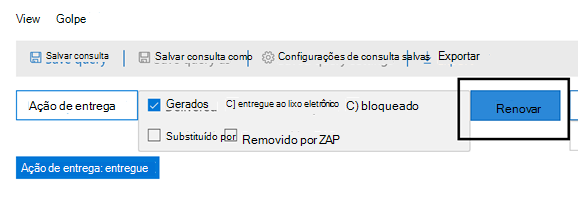

# Gerenciador de ameaças e detecções em tempo realThreat Explorer and Real-time detections

Se sua organização tem a [proteção avançada contra ameaças do office 365](office-365-atp.md) (Office 365 ATP) e você tem as [permissões necessárias](#required-licenses-and-permissions), você tem as detecções do **Explorer** ou do **tempo real** (anteriormente conhecida como *relatórios em tempo real* , [consulte What ' s New](#new-features-in-threat-explorer-and-real-time-detections)!).If your organization has [Office 365 Advanced Threat Protection](office-365-atp.md) (Office 365 ATP), and you have the [necessary permissions](#required-licenses-and-permissions), you have either **Explorer** or **Real-time detections** (formerly *Real-time reports* — [see what's new](#new-features-in-threat-explorer-and-real-time-detections)!). No centro de conformidade & segurança, vá para **Gerenciamento de ameaças** e escolha as detecções do **Explorer** _ou_ **em tempo real** .In the Security & Compliance Center, go to **Threat management** , and then choose **Explorer** _or_ **Real-time detections** .

|Com o plano ATP 2, você vê:With ATP Plan 2, you see:|Com o plano ATP 1, você vê:With ATP Plan 1, you see:|
|---|---|
|||
|

Com o Explorer (ou detecções em tempo real), você tem um relatório poderoso que permite que sua equipe de operações de segurança investigue e responda às ameaças de forma eficaz e eficiente.With Explorer (or Real-time detections), you have a powerful report that enables your Security Operations team to investigate and respond to threats effectively and efficiently. O relatório é semelhante à seguinte imagem:The report resembles the following image:

Com esse relatório, você pode:With this report, you can:

- [Consulte malware detectado pelos recursos de segurança do Microsoft 365See malware detected by Microsoft 365 security features](#see-malware-detected-in-email-by-technology)
- [Exibir dados sobre URLs de phishing e clicar em veredictoView data about phishing URLs and click verdict](#view-data-about-phishing-urls-and-click-verdict)
- [Iniciar um processo de investigação e resposta automatizado de um modo de exibição no Explorer](#start-automated-investigation-and-response) (apenas plano ATP 2)[Start an automated investigation and response process from a view in Explorer](#start-automated-investigation-and-response) (ATP Plan 2 only)
- ... [Investigue emails mal-intencionados e muito mais](#more-ways-to-use-explorer-or-real-time-detections)!... [Investigate malicious email, and more](#more-ways-to-use-explorer-or-real-time-detections)!

## Aprimoramentos de experiência para o explorador de ameaças e detecções em tempo realExperience Improvements to Threat Explorer and Real-time detections

## Marcas no explorador de ameaçasTags in Threat Explorer

> [!NOTE]
> O recurso de marcas de usuário está em visualização, não está disponível para todos e está sujeito a alterações.The user tags feature is in Preview, isn't available to everyone, and is subject to change. Para obter informações sobre o cronograma de lançamento, confira o Microsoft 365 Roadmap.For information about the release schedule, check out the Microsoft 365 roadmap.

Marcas de usuário são identificadores para grupos específicos de usuários no Microsoft defender para Office 365.User tags are identifiers for specific groups of users in Microsoft Defender for Office 365. Para obter mais informações sobre marcas, licenciamento e configuração de marcas, leia mais aqui: [marcas de usuário no Office 365 ATP](user-tags.md).For more information around Tags, licensing and configuring Tags, read more here: [User tags in Office 365 ATP](user-tags.md).

No explorador de ameaças, você poderá ver informações sobre marcas de usuário nas seguintes experiências:Within Threat Explorer, you will be able to see information around User Tags in the following experiences:

#### Exibição de grade de emailEmail Grid View

A coluna marcas mostrada na grade de emails contém todas as marcas que foram aplicadas às caixas de correio de remetentes ou destinatários.The Tags column shown in the email grid would contain all the tags that have been applied to the sender or recipient mailboxes. Por padrão, marcas de sistema como contas de prioridade são mostradas primeiro.By default, system tags like priority accounts are shown first.

> [!div class="mx-imgBorder"]
> 

#### FiltragemFiltering
Agora, temos marcas como um filtro para que você possa procurar apenas por contas de prioridade ou em cenários de marcas de usuário específicos (e até mesmo excluir resultados com determinadas marcas como parte dessa experiência).We now have Tags as a filter so you can hunt just across priority accounts, or specific User tags scenarios (and even exclude results with certain tags as part of this experience). A combinação desses com os vários outros filtros que fornecemos ajuda você a reduzir o escopo da investigaçãoCombining these with the multiple other filters that we provide, would help you to narrow down your scope of investigation

[ de filtro](../../media/tags-filter-normal.png#lightbox)

> [!div class="mx-imgBorder"]
> 

#### Submenu detalhes do emailEmail Detail Flyout
Para exibir as marcas individuais do remetente e do destinatário, clique no assunto.To view the individual tags for sender and Recipient, click on the subject. Ele abre o submenu de detalhes da mensagem.It opens the message details flyout. Na guia Resumo, as marcas de remetente e destinatário são mostradas separadamente, se estiverem presentes para um email.In the summary tab, sender and recipient tags are shown separately, if they are present for an email.
As informações sobre marcas individuais para remetente e destinatário, também são estendidas para CSV exportado, onde você pode ver esses detalhes em duas colunas separadas.The information about individual tags for sender and Recipient, also extends to exported CSV, where you can see these details in 2 separate columns.

> [!div class="mx-imgBorder"]
> 

As informações de marcas também são mostradas no submenu de cliques de URL.Tags information is also shown in URL clicks flyout. Para acessar o submenu de cliques de URL, você precisará ir para Phish ou para todos os modos de exibição de email e, em seguida, para a guia URLs ou URL. clicar em um submenu de URL individual mostraria mais detalhes sobre cliques para essa URL e teria marcas associadas a esse clique.To get to the URL clicks flyout, you would need to go to Phish or All Email view, and then to URLs or URL Clicks Tab. Clicking on an individual URL flyout would show more details about Clicks for that URL, and would have Tags associated with that click.

> [!div class="mx-imgBorder"]
> 

## Melhorias na experiência de busca de ameaças (futuro)Improvements to Threat Hunting Experience (upcoming)

### Informações de ameaças atualizadas para emailsUpdated Threat Information for Emails

Nos concentramos nos aprimoramentos de qualidade da plataforma e dos dados para aumentar a precisão dos dados e a consistência dos registros de email.We have focused on platform and data quality improvements to increase data accuracy and consistency for email records. Esse conjunto de atualizações inclui a consolidação das informações de pré e entrega e de envio (exemplo de ação executada em um email como parte do processo ZAP) em um único registro, juntamente com uma riqueza adicional, como spam veredicto, ameaças no nível da entidade (por exemplo, qual URL era mal-intencionada) e locais de entrega mais recentes.These set of updates includes consolidation of pre-delivery and post-delivery information (example action executed on an email as part of ZAP process) into a single record  along with added richness like Spam verdict, Entity level threats (e.g., which URL was malicious) and latest delivery locations.

Após essas atualizações, você verá uma única entrada para cada mensagem, independentemente dos diferentes eventos de envio que ocorreram na mensagem.After these updates, you'll see a single entry for each message, regardless of the different post-delivery events that have taken place on the message. As ações podem incluir ZAP, correção manual (o que significa ação de administrador), entrega dinâmica, etc.Actions can include ZAP, Manual Remediation (which means admin action), Dynamic Delivery etc.

Além de mostrar ameaças de malware e phishing, agora você poderá ver as veredicto de spam associadas a um email.In addition to showing malware and phish threats, you'll now be able to see spam verdict associated with an email. No email, você poderá ver todas as ameaças associadas ao email junto com as tecnologias de detecção correspondentes.Within the email, you will be able to see all the threats associated with the email along with the corresponding detection technologies. Cada email pode ter 0, 1 ou várias ameaças.Each email can have 0, 1, or multiple threats. Você verá as ameaças atuais na seção detalhes do submenu email.You'll see the current Threats in the Details section of the Email flyout. Além disso, para várias ameaças (por exemplo, um email com malware e phishing), o campo Tech de detecção forneceria o mapeamento de Threat-Detection, o que significa que a tecnologia de detecção levou à identificação da ameaça.Additionally, for multiple threats (e.g., an email having both Malware and Phish), Detection tech field would give the Threat-Detection mapping, meaning which detection tech led to the identification of the Threat.

O conjunto de tecnologias de detecção foi atualizado para incluir novos métodos de detecção, bem como tecnologias de detecção de spam, e em todos os diferentes modos de exibição de email (malware, Phish, todos os emails), você terá o mesmo conjunto consistente de tecnologias de detecção para filtrar os resultados.The set of detection technologies has been updated to include new detection methods, as well as spam detection technologies, and across all the different email views (Malware, Phish, All Email), you'll have the same, consistent set of Detection technologies to filter the results.

> [!NOTE]
> A análise do veredicto pode não estar necessariamente associada a entidades.Verdict analysis might not necessarily be tied to entities. Por exemplo, um email pode ser classificado como Phish ou spam, mas não há URLs com veredicto de phishing/spam marcados.As an example, an email might be classified as Phish or Spam, but there are no URLs which have any Phish/Spam verdict stamped on them. Isso ocorre porque nossos filtros também avaliam o conteúdo e outros detalhes de um email, antes de atribuir um veredicto.This is because our filters also evaluate content and other details for an email, before assigning a verdict.

#### Ameaças em URLsThreats in URLs

Na guia detalhes do submenu de email >, agora você poderá ver a ameaça específica para uma URL (a ameaça de uma URL pode ser malware, Phish, spam ou nenhum)Within email flyout-> Details tab, you would now be able to see the specific threat for a URL (Threat for a URL can be Malware, Phish, Spam or None)

> [!div class="mx-imgBorder"]
> 

### Exibição de linha do tempo atualizada (próximo)Updated Timeline View (upcoming)

> [!div class="mx-imgBorder"]
> 

Além da identificação de todos os eventos Delivery e post-Delivery, a exibição de linha do tempo também fornece informações sobre a ameaça identificada nesse ponto de tempo para um subconjunto desses eventos.In addition to identifying all delivery and post-delivery events, timeline view also gives information about the Threat identified at that point of time for a subset of these events. Também fornece mais informações sobre ações adicionais (por exemplo, ZAP, correção manual) juntamente com o resultado dessa ação.It also gives you more information about Additional Actions (e.g., ZAP, Manual Remediation) along with the Result of that action. O modo de exibição linha do tempo contém informações sobre a entrega original e, em seguida, quaisquer eventos de post-Delivery executados em um email.Timeline view contains information about the Original delivery and subsequently any post-delivery events performed on an email.

-   Fonte: pode ser administrador/sistema/usuário com base em qual era a origem do evento.Source: This can be Admin/System/user based on what was the source of the event.
-   Evento: isso inclui eventos de nível superior, como entrega original, correção manual, ZAP, envios e entrega dinâmica.Event: This includes top-level events like Original Delivery, Manual Remediation, ZAP, Submissions, and Dynamic Delivery.
-   Ação: isso abrange a ação específica que foi realizada como parte de ZAP ou ação de administrador (por exemplo, exclusão reversível).Action: This covers the specific action that was taken either as part of ZAP or Admin Action (e.g., Soft Delete).
-   Ameaças: aborda as ameaças (malware, Phish, spam) identificadas nesse momento.Threats: Covers the threats (Malware, Phish, Spam) identified at that point of time.
-   Resultado/detalhes: aborda mais informações sobre o resultado da ação, se ela foi executada como parte da ação ZAP/administrador.Result/Details: Covers more information about the Result of the Action, whether it was performed as part of ZAP/Admin Action.

### Local de entrega original e mais recenteOriginal and Latest Delivery location

Hoje, apresentamos o local de entrega dentro da grade de email e do submenu de email.Today, we surface delivery Location within email grid and email flyout. No futuro, o campo local de entrega será renomeado para o local de entrega original.Going forward, the Delivery Location field will be renamed to Original Delivery Location. Além disso, também vamos apresentar outro campo chamado local de entrega mais recente.Additionally, we're also introducing another field called Latest delivery location.

O local de entrega original forneceria mais informações sobre onde um email foi entregue inicialmente.The original delivery location would give more information about where an email was delivered initially. O local de entrega mais recente incluiria local onde um email pode ter redirecionado após ações do sistema, como ações de ZAP ou de administração, como **mover para itens excluídos** .The latest delivery location would include location where an email may have landed after system actions like ZAP or admin actions like **Move to Deleted Items** . O local de entrega mais recente destina-se a informar aos administradores sobre a última postagem de local conhecida da mensagem ou qualquer ação de sistema/administrador.Latest delivery location is intended to inform admins of the message's last known location post-delivery or any system/admin actions. Por design, ele não inclui nenhuma ação relacionada ao usuário final no email.By design, it doesn't include any end-user-related actions on the email. Por exemplo: se um usuário excluir uma mensagem ou mover a mensagem para arquivo morto/PST, o local de "entrega" da mensagem não será atualizado.For example: if a user deletes a message or moves the message to archive/pst, the message "delivery" location will not be updated. No entanto, se uma ação do sistema tiver atualizado o local (por exemplo, ZAP resultando em um email movendo para quarentena), você verá o local de entrega mais recente como quarentena.However, if a system action updated the location (e.g., ZAP resulting in an email moving to Quarantine), you would see the Latest delivery location as Quarantine.

> [!div class="mx-imgBorder"]
> 

> [!NOTE]
> Há alguns casos em que a ação de entrega e o local de entrega podem mostrar ' Unknown ' como o valor:There are few cases where Delivery Location and Delivery Action may show 'Unknown' as the value:
>
> - Você pode ver o local de entrega como entregue e o local de entrega como desconhecido.You might see Delivery location as Delivered, and Delivery Location as Unknown. Isso acontece quando a mensagem foi entregue, mas uma regra de caixa de entrada moveu a mensagem para uma pasta padrão (rascunho, arquivo morto etc.) em vez das pastas caixa de correio ou lixo eletrônico.This happens when the message was delivered, but an Inbox rule moved the message to a default folder (Draft, Archive, etc.) instead of the Inbox or Junk Email folders.
>
> - O local de entrega mais recente pode ser desconhecido se uma ação de administrador/sistema (por exemplo, ZAP, ação de administrador) for tentada, mas a mensagem não for encontrada.Latest Delivery Location can be unknown if an admin/system action (e.g., ZAP, Admin Action) is attempted, but the message isn't found. Normalmente, a ação ocorre depois que o usuário moveu ou excluiu a mensagem.Typically, the action happens after the user has moved or deleted the Message. Nesses casos, verifique a coluna resultados/detalhes no modo de exibição linha do tempo.In such cases, verify the Result/Details Column in timeline view. Procure a mensagem: mensagem movida ou excluída pelo usuário.Look for the message: Message moved or deleted by the user.

> [!div class="mx-imgBorder"]
> 

### Ações adicionaisAdditional Actions

Ações adicionais consistem nas ações que foram aplicadas postar a entrega do email e podem incluir ZAP, correção manual (ação tomada por um administrador, por exemplo, exclusão reversível), entrega dinâmica e reprocessada (um email foi detectado retroativamente como bom).Additional Actions consist of the actions that were applied post the delivery of the Email, and can include ZAP, Manual Remediation (action taken by an Admin e.g., Soft Delete), Dynamic Delivery, and Reprocessed (an email was retroactively detected as good).

> [!NOTE]
>
> - Como parte dessa alteração, o valor removido por ZAP atualmente no filtro de ação de entrega está desaparecendo.As part of this change, the Removed by ZAP value currently surfaced in the Delivery Action filter is going away. Você terá uma maneira de Pesquisar todos os emails com a ZAP durante a tentativa de ações adicionais.You'll have a way to search for all email with the ZAP attempt through the Additional Actions.
>
> - Haverá novos campos e valores para tecnologias de detecção e ações adicionais (especialmente para cenários ZAP).There will be new fields and values for Detection technologies and Additional actions (especially for ZAP scenarios). Avaliar suas consultas salvas e consultas rastreadas existentes para garantir que elas funcionem com os novos valores.Evaluate your existing Saved Queries and Tracked queries to make sure they work with the new values.

> [!div class="mx-imgBorder"]
> 

### Substituições de sistemaSystem overrides

Substituições de sistema são um método de fazer exceções para o local de entrega pretendido de uma mensagem, substituindo o local de entrega fornecido pelo sistema (com base nas ameaças e outras detecções identificadas por nossa pilha de filtragem).System overrides are a method of making exceptions to the intended delivery location of a message by overriding the delivery location provided by system (based on the threats and other detections identified by our filtering stack). As substituições do sistema podem ser definidas por meio do locatário ou da política de usuário para entregar a mensagem, conforme sugerido pela política.System overrides can be set through tenant or user policy to deliver the message as suggested by the policy. As substituições são úteis para identificar qualquer entrega não intencional de mensagens mal-intencionadas devido às lacunas de configuração (por exemplo, uma política de remetente seguro muito ampla definida por um usuário).Overrides are useful in identifying any unintentional delivery of malicious messages due to configurations gaps (for example, a very broad Safe Sender policy set by a user). Esses valores de substituição podem ser:These override values can be:

- Permitido pela política de usuário: quando um usuário permite domínios ou remetentes criando políticas no nível da caixa de correio.Allowed by user policy: This is when a user allows domains or senders by creating policies at the mailbox level.
- Bloqueado pela política de usuário: quando um usuário bloqueia domínios ou remetentes, criando políticas no nível da caixa de correio.Blocked by user policy: This is when a user blocks domains or senders by creating policies at the mailbox level.
- Permitido pela política da org: isso ocorre quando as equipes de segurança da organização definem as regras de fluxo de emails do Exchange (também conhecidas como regras de transporte) para permitir remetentes e domínios para usuários em sua organização.Allowed by org policy: This is when the organization's security teams set policies or Exchange mail flow rules (also known as transport rules) to allow senders and domains for users in their organization. Isso pode ser para um conjunto de usuários ou para toda a organização.This can be for a set of users or the entire organization.
- Bloqueado pela política da organização: quando as equipes de segurança da organização definem regras de fluxo de emails ou políticas para bloquear remetentes, domínios, idiomas de mensagens ou IPs de origem para usuários em sua organização.Blocked by org policy: This is when the organization's security teams set policies or mail flow rules to block senders, domains, message languages, or source IPs for users in their organization. Isso também pode ser para um conjunto de usuários ou para toda a organização.This can also be for a set of users or the entire organization.
- Extensão de arquivo bloqueada pela política org: quando uma extensão de tipo de arquivo é bloqueada pelas equipes de segurança de uma organização por meio das configurações de política antimalware.File extension blocked by org policy: This is when a file type extension is blocked by the security teams of an organization through the anti-malware policy settings. Esses valores agora serão exibidos nos detalhes do email para ajudar nas investigações.These values will now be displayed in email details to help with investigations. As equipes do SecOPS também podem filtrar as extensões de arquivo bloqueados usando o avançado recurso de filtragem.Secops teams can also filter on blocked file extensions using the rich filtering capability.

> [!div class="mx-imgBorder"]
> 

### Aprimoramentos em relação à URL e cliquesImprovements around URL and Clicks Experience

O conjunto de melhorias voltadas para os dados de URL e de URL são:The set of improvements focused towards URL and URL clicks data include:

 - Mostrando a URL de clique completo (incluindo qualquer parâmetro de consulta que faça parte da URL) na seção cliques no submenu URL.Showing full Clicked URL (including any query Parameters which are part of URL) within the Clicks Section in URL Flyout. No momento, mostramos o domínio e o caminho da URL na barra de título.Currently we show the URL domain and path in title bar. Estamos estendendo essas informações para mostrar a URL completa.We're extending that information to show the full URL.

 - Corrige nos filtros de URL (URL vs domínio de URL vs domínio de URL e caminho): fizemos atualizações em torno de mensagens que contêm uma URL/clique em veredicto.Fixes across URL filters (URL vs URL domain vs URL Domain and path): We've made updates around searching for messages that contain a URL/Click verdict. Como parte desse, habilitamos o suporte para pesquisas que não eram de protocolo (ou seja, você pode pesquisar uma URL diretamente sem http).As part of that, we've enabled support for protocol agnostic searches (meaning, you can directly search for a URL without http). Por padrão, a pesquisa de URL mapeia para http, a menos que explicitamente especificado.By default, the URL search maps to http, unless explicitly specified. Por exemplo:For example:

   1. Pesquise e sem o `http://` prefixo nos campos de filtro "URL", "domínio de URL" e "domínio de URL e caminho".Search with and without the `http://` prefix in "URL", "URL Domain", and "URL Domain and Path" filter fields. Esse comportamento é consistente e deve mostrar o mesmo resultado.This behavior is consistent, and should show the same result.

   1. Procure o `https://` prefixo em "URL".Search for the `https://` prefix in "URL". Quando não estiver presente, o `http://` prefixo será assumido.When not present, the `http://` prefix is assumed.

   1. `/` no início e no final dos campos "caminho de URL", "domínio de URL", "URL de domínio e caminho" será ignorado.`/` in beginning and end of the "URL path", "URL Domain", "URL domain and path" fields is ignored. `/` no final do campo "URL" será ignorado.`/` at the end of the "URL" field is ignored.

### Nível de confiança de phishingPhish Confidence Level

O nível de confiança de phishing ajuda a identificar o grau de confiança, com o qual um email foi Categorizado como phishing.Phish confidence level helps to identify the degree of confidence, with which an email was categorized as Phish. Os dois valores possíveis são High e normal.The two possible values are High and Normal. Nos estágios iniciais, esse filtro estará disponível somente no modo de exibição de Phish do explorador de ameaças.In the initial stages, this filter will be available only in the Phish view of Threat Explorer.

### Sinal de URL ZAPZAP URL Signal

Normalmente usado para cenários de alerta de Phish de ZAP em que um email foi identificado como Phish e removido após a entrega.Typically used for ZAP Phish Alert scenarios where an email was identified as Phish and removed after delivery. Isso é usado para conectar o alerta com os resultados correspondentes no Explorer.This is used to connect the alert with the corresponding results in Explorer. É um dos IOCs para o alerta.It is one of the IOCs for the alert.

Como parte do aprimoramento do processo de caça, fizemos algumas atualizações no Gerenciador de ameaças e nas detecções em tempo real.As part of improving the hunting process, we have made a few updates to Threat Explorer and Real-time detections. Eles são aprimoramentos de "experiência", com o objetivo de tornar a experiência de busca mais consistente.These are ‘experience’ improvements, with the focus on making the hunting experience more consistent. Essas alterações são descritas abaixo:These changes are outlined below:

- [Melhorias de fuso horárioTimezone improvements](#timezone-improvements)
- [Atualização no processo de atualizaçãoUpdate in the Refresh process](#update-in-the-refresh-process)
- [Detalhamento de gráfico para adicionar a filtrosChart drilldown to add to filters](#chart-drilldown-to-add-to-filters)
- [Atualizações de informações do produtoIn product information updates](#in-product-information-updates)

### Melhorias de fuso horárioTimezone improvements

Você verá o fuso horário dos registros de email no portal, bem como os dados exportados.You will see the timezone for the email records within the Portal, as well as for Exported data. O fuso horário ficará visível em experiências como grade de email, submenu de detalhes, linha do tempo de email e emails semelhantes, para que o fuso horário do conjunto de resultados seja claro para o usuário.The timezone will be visible across experiences like Email Grid, Details Flyout, Email Timeline, and Similar Emails, so that the timezone for the result set is clear to the user.

> [!div class="mx-imgBorder"]
> 

### Atualização no processo de atualizaçãoUpdate in the Refresh process

Ouvimos comentários em relação à confusão com a atualização automática (por exemplo, para data, assim que você alterar a data, a página seria atualizada) e a atualização manual (para outros filtros).We have heard feedback around confusion with automatic refresh (e.g. for date, as soon as you change the date, the page would refresh) and manual refresh (for other filters). Da mesma forma, remover filtros leva à atualização automática, isso causa situações em que alterar os diferentes filtros enquanto modifica a consulta pode causar experiências de pesquisa inconsistentes.Similarly, removing filters leads to automatic refresh, this causes situations where changing the different filters while modifying the query can cause inconsistent search experiences. Para resolver isso, estamos migrando para um mecanismo de filtragem manual.To solve this, we are moving to a manual filtering mechanism.

A partir de um ponto de vista da experiência, o usuário pode aplicar e remover o intervalo diferente de filtros (do conjunto de filtros e data) e pressionar o botão atualizar para filtrar os resultados depois que eles forem feitos com a definição da consulta.From an experience standpoint, the user can apply and remove the different range of filters (from the filter set, and date), and press the refresh button to filter the results once they are done with defining the query. O botão atualizar também foi atualizado para chamá-lo com clareza na tela.The refresh button has also been updated to call it out clearly on the screen. Também atualizamos as dicas de ferramentas e a documentação do produto em torno dessa alteração.We have also updated tooltips and in-product documentation around this change.

> [!div class="mx-imgBorder"]
> 

### Detalhamento de gráfico para adicionar a filtrosChart drilldown to add to filters

Agora, você poderá clicar nos valores de legenda do gráfico para adicionar esse valor como um filtro.You will now be able to click on the chart legend values to add that value as a filter. Observe que você ainda terá que clicar no botão atualizar para filtrar os resultados como parte da alteração descrita acima.Note that you will still have to click on the refresh button to filter the results as part of the change described above.

> [!div class="mx-imgBorder"]
> 

### Atualizações de informações do produtoIn product information updates

Você também deve ver detalhes adicionais no produto.You should also see additional details within the product. Por exemplo, o número total de resultados de pesquisa dentro da grade (veja abaixo), bem como melhorias em relação a rótulos, mensagens de erro e dicas de ferramentas, para fornecer mais informações sobre filtros, experiência de pesquisa e conjunto de resultados.For example, the total number of search results within grid (see below), as well as improvements around labels, error messages and tooltips, to give more information around filters, search experience, and result set.

> [!div class="mx-imgBorder"]
> 

## Recursos estendidos no explorador de ameaçasExtended capabilities in Threat Explorer

### Principais usuários direcionadosTop targeted users

Hoje, expostos a lista dos principais usuários direcionados no modo de exibição de malware para emails (na seção principais famílias de malware).Today we expose the list of the top targeted users in the Malware View for Emails (within the Top Malware Families section). Estenderemos a extensão desse modo de exibição no phishing e em todos os modos de exibição de email, onde você poderá ver os cinco principais usuários direcionados junto com o número de tentativas para cada usuário para o modo de exibição correspondente (por exemplo, para o modo de exibição de phishing, você poderá ver o número de tentativas de Phish).We will be extending this view within Phish and All Email views as well, where you will be able to see the top five targeted users along with the number of attempts for each user for the corresponding view (for example, for Phish view you will be able to see the number of Phish attempts).
Você também será capaz de exportar a lista de usuários direcionados até um limite de 3000, juntamente com o número de tentativas para a análise offline para cada exibição de email.You will also be able to export the list of targeted users up to a limit of 3000 along with the number of attempts for offline analysis for each email view. Além disso, selecione não.In addition to that, selecting No. de tentativas (por exemplo, 13 tentativas abaixo) abriria um modo de exibição filtrado no explorador de ameaças, para que você possa ver mais detalhes nos emails e ameaças desse usuário.of attempts (for example, 13 attempts below) would open a filtered view in Threat Explorer, so that you can look at more details across emails and threats for that user.

> [!div class="mx-imgBorder"]
> 

### Regras de transporte do ExchangeExchange transport rules
Como parte do enriquecimento de dados, você também deve ser capaz de ver todas as diferentes regras de transporte que foram aplicadas a uma mensagem.As part of data enrichment, you should also be able to see all the different transport rules which were applied to a message. Essas informações estarão presentes no modo de exibição de grade de email (para exibir isso, selecione opções de coluna na grade e Adicionar regra de transporte do Exchange das opções de coluna na grade), bem como submenu de detalhes no email.This information will be present within the Email grid view (to view this, select Column options in the grid and add Exchange Transport Rule from the Column options in the grid) as well as Details flyout in the email.
Você poderá ver o GUID, bem como o nome das regras de transporte que foram aplicadas à mensagem.You would be able to see both the GUID as well as the name of the transport rules which were applied to the message. Além disso, você poderá pesquisar as mensagens usando o nome da regra de transporte.Additionally, you would be able to search for the messages using the name of the transport rule. Essa seria uma pesquisa "contém", o que significa que você também poderá pesquisar usando pesquisas parciais.This would be a ‘Contains’ search which means you will be able to search using partial searches as well.

#### Observação importante:Important Note:
A pesquisa e o nome da disponibilidade do ETR dependeriam da função específica que foi atribuída a você.ETR search and name availability would depend on the specific role that has been assigned to you. Você precisará ter uma das seguintes funções/permissões para exibir os nomes e a pesquisa do ETR.You will need to have one of the following roles/permissions in order to view the ETR names and search.  Se você não tiver uma das funções a seguir atribuídas a você, não poderá ver os nomes das regras de transporte e pesquisar as mensagens usando os nomes ETR.If you do not have any of the following roles assigned to you, you will not be able to see the names of the transport rules, and search for the messages using the ETR names. No entanto, você poderá ver as informações de rótulo e GUID do ETR nos detalhes do email.However, you will be able to see the ETR label and GUID information within the Email Details. Suas outras experiências em relação à exibição de registros em grades de email, submenus de email, filtros e exportação não são impactadas.Your other experiences around viewing records in Email Grids, Email flyouts, Filters, and Export are not impacted.

- EXO-prevenção de perda de dados: ALLEXO Only - Data Loss Prevention: All
- Somente EXO-O365SupportViewConfig: ALLEXO Only - O365SupportViewConfig: All
- AAD ou EXO-administrador de segurança: todosAAD or EXO - Security Admin: All
- AAD ou EXO-leitor de segurança: todosAAD or EXO - Security Reader: All
- Regras de transporte somente EXO: ALLEXO Only - Transport Rules: All
- Somente EXO-configuração de View-Only: ALLEXO Only - View-Only Configuration: All

Na grade de emails, no submenu detalhes e no CSV exportado, o ETRs é apresentado com um nome/GUID, conforme mostrado abaixo.Within the email grid, Details flyout, and Exported CSV, the ETRs are presented with a Name/GUID as shown below.

> [!div class="mx-imgBorder"]
> 

### Conectores de entradaInbound connectors

Os conectores são uma coleção de instruções que personalizam a forma como seu email flui para e a partir da sua organização do Microsoft 365 ou do Office 365, com a capacidade de aplicar qualquer restrição de segurança ou controles.Connectors are a collection of instructions that customize the way your email flows to and from your Microsoft 365 or Office 365 organization, with the ability to apply any security restriction or controls. No explorador de ameaças, agora você terá a capacidade de exibir os conectores relacionados a um email, bem como Pesquisar emails usando os nomes de conectores.Within Threat Explorer, you will now have the ability to view the connectors which are related to an email as well as search for emails using the connector names.
A pesquisa de conectores é ' Contains ', por natureza, que significa que as pesquisas parciais de palavra-chave também devem funcionar.The search for connectors is ‘Contains’ in nature which means partial keyword searches should work as well.
Dentro do modo de exibição de grade principal, o submenu detalhes e o CSV exportado, os conectores são mostrados no formato de nome/GUID, conforme mostrado abaixo:Within the Main grid view, the Details flyout, and the Exported CSV, the connectors are shown in the Name/GUID format as shown below:

> [!div class="mx-imgBorder"]
> 

## Novos recursos no Gerenciador de ameaças e detecções em tempo realNew features in Threat Explorer and Real-time detections

Três novos recursos adicionados ao Gerenciador de ameaças e às detecções em tempo real:Three new features added into Threat Explorer and Real-time detections:

- [Visualizar o cabeçalho de email e baixar o corpo do emailPreview email header and download email body](#preview-email-header-and-download-email-body)
- [Linha do tempo de emailEmail timeline](#email-timeline)
- [Exportar URL clique em dadosExport URL click data](#export-url-click-data)

Esses novos recursos estão descritos abaixo.These new features are outlined below.

### Visualizar o cabeçalho de email e baixar o corpo do emailPreview email header and download email body

A capacidade de Visualizar um cabeçalho de email e baixar o corpo do email são novos recursos disponíveis no explorador de ameaças.The ability to preview an email header and download the email body are new features available in Threat Explorer. Os administradores poderão analisar os cabeçalhos/mensagens de email baixados para ameaças.Admins will be able to analyze downloaded headers/email messages for threats. Como o download de mensagens de email pode arriscar a exposição de informações, esse processo é controlado pelo controle de acesso baseado em funções (RBAC).Because downloading email messages can risk the exposure of information, this process is controlled by roles-based access control (RBAC). Uma nova função, *Visualização* , deve ser adicionada a outro grupo de função (como operações de segurança ou administrador de segurança) para conceder a capacidade de baixar emails e Visualizar cabeçalhos em todas as mensagens de email exibir.A new role, *Preview* , must be added to another role group (such as Security Operations or Security Administrator) to grant the ability to download mails and preview headers in all-email messages view.

Mas o Explorer (e as detecções em tempo real) também adiciona novos campos criados para fornecer uma imagem mais completa de onde suas mensagens de email estão no terreno.But Explorer (and Real-time detections) also adds fresh new fields designed to give you a more complete picture of where your email messages land. Parte da meta dessa alteração é tornar a busca mais fácil para pessoas de operações de segurança, mas o resultado líquido é saber o local das mensagens de email de problemas em um relance.Part of the goal of this change is to make hunting easier for Security Ops people, but the net result is knowing the location of problem email messages at a glance.

Como isso é feito?How is this done? O status de entrega agora é dividido em duas colunas:Delivery Status is now broken out into two columns:

- **Ação de entrega** -Qual é o status desse email?**Delivery Action** - What is the status of this email?
- **Local de entrega** -onde esse email foi roteado como resultado?**Delivery Location** - Where was this email routed as a result?

A ação de entrega é a ação realizada em um email devido a políticas ou detecções existentes.Delivery Action is the action taken on an email due to existing policies or detections. Veja a seguir as possíveis ações que um email pode executar:Here are the possible actions an email can take:

|GeradosDelivered|Lixo eletrônicoJunked|BlockedBlocked|DevidoReplaced|
|---|---|---|---|
|O email foi entregue à caixa de entrada ou pasta de um usuário, e o usuário pode acessá-lo diretamente.Email was delivered to Inbox or folder of a user and the user can directly access it.|O email foi enviado à pasta de lixo eletrônico ou à pasta excluída do usuário, e o usuário tem acesso a emails nessas pastas.Email was sent to either user’s Junk folder or Deleted folder, and the user has access to emails in those folders.|Todos os emails colocados em quarentena, que falharam ou foram descartados.Any emails that are quarantined, that  failed, or were dropped. Isso é completamente inacessível pelo usuário!This is completely inaccessible by the user!|Qualquer email onde anexos mal-intencionados são substituídos por arquivos. txt que indicam que o anexo era mal-intencionado.Any email where malicious attachments are replaced by .txt files that state the attachment was malicious.|

|GeradosDelivered|Lixo eletrônicoJunked|BlockedBlocked|DevidoReplaced|
|---|---|---|---|
|O email foi entregue na caixa de entrada do usuário ou em outra pasta, e o usuário pode acessá-lo diretamente.Email was delivered to the user's inbox or another folder, and the user can directly access it.|O email foi enviado para a pasta de lixo eletrônico do usuário ou para a pasta excluída e o usuário tem acesso a mensagens de email nessas pastas.Email was sent to either user's Junk folder or Deleted folder, and the user has access to email messages in those folders.|Qualquer mensagem de email em quarentena, que falhou ou foi interrompida, e não pode ser acessada pelo usuário.Any email messages that are quarantined, that failed, or were dropped, and are not accessible by the user.|Quaisquer mensagens de email em que anexos mal-intencionados foram substituídos por arquivos. txt que indicam que os anexos foram mal-intencionados.Any email messages where malicious attachments were replaced by .txt files that state the attachments were malicious.|
|

E aqui está o que o usuário pode ver e o que eles não podem:And here is what the user can see, and what they can't:

|Acessível para os usuários finaisAccessible to end users|Inacessível para os usuários finaisInaccessible to end users|
|---|---|
|GeradosDelivered|BlockedBlocked|
|Lixo eletrônicoJunked|DevidoReplaced|

O local de entrega mostra os resultados das políticas e detecções que executam post-Delivery.Delivery location shows the results of policies and detections that run post-delivery. Ele está vinculado a uma ação de entrega.It's linked to a Delivery Action. Este campo foi adicionado para dar informações sobre a ação tomada quando um email de problema é encontrado.This field was added to give insight into the action taken when a problem mail is found. Estes são os possíveis valores de local de entrega:Here are the possible values of delivery location:

- **Caixa de entrada ou pasta** : o email está na caixa de entrada ou uma pasta (de acordo com suas regras de email).**Inbox or folder** : The email is in inbox or a folder (according to your email rules).
- **Local ou externo** : a caixa de correio não existe na nuvem, mas está no local.**On-prem or external** : The mailbox doesn't exist on cloud but is on-premises.
- **Pasta de lixo eletrônico** : o email está na pasta lixo eletrônico de um usuário.**Junk folder** : The email is in the Junk folder of a user.
- **Pasta itens excluídos** : o email na pasta itens excluídos de um usuário.**Deleted items folder** : The email in the Deleted items folder of a user.
- **Quarantine** : o email em quarentena e não está na caixa de correio de um usuário.**Quarantine** : The email in quarantine, and is not in a user's mailbox.
- **Falha** : o email não pôde chegar à caixa de correio.**Failed** : The email failed to reach the mailbox.
- **Descartado** : o email é perdido em algum lugar no fluxo de emails.**Dropped** : The email gets lost somewhere in the mail flow.

### Linha do tempo de emailEmail timeline

A **linha do tempo de email** é outro novo recurso do Explorer destinado a tornar a experiência de busca melhor para administradores.The **Email Timeline** is another new Explorer feature aimed at making the hunting experience better for admins. Ele reduz a randomização porque há menos tempo gasto na verificação de locais diferentes para tentar entender o evento.It cuts down on randomization because there is less time spent checking different locations to try to understand the event. Quando vários eventos ocorrem ou próximos à mesma hora em um email, esses eventos serão exibidos em um modo de exibição de linha do tempo.When multiple events happen at, or close to, the same time on an email, those events will show up in a timeline view. Na verdade, alguns eventos que acontecerão após a entrega ao seu email serão capturados na coluna "ação especial".In fact, some events that happen post-delivery to your mail will be captured in the 'Special action' column. A combinação das informações da linha do tempo dos emails com a ação especial tomada no envio de mensagens enviará aos administradores informações sobre como as políticas funcionam, onde o email foi finalmente encaminhado e, em alguns casos, qual era a avaliação final.Combining the information from the timeline of that mail with the special action taken on the mail post-delivery will give admins insight into how their policies work, where the mail was finally routed, and, in some cases, what the final assessment was.

Para mais informações sobre a investigação de mensagens de email mal-intencionadas, consulte [investigar e corrigir emails mal-intencionados que foram entregues no Office 365](investigate-malicious-email-that-was-delivered.md).For more discussion about investigating malicious email messages, see [Investigate and remediate malicious email that was delivered in Office 365](investigate-malicious-email-that-was-delivered.md).

### Exportar URL clique em dadosExport URL click data

Além disso, agora você poderá exportar relatórios para cliques de URL para o Microsoft Excel a fim de exibir a ID da mensagem de rede e o clique em veredicto, tornando a tarefa de compreensão onde sua URL clica em tráfego originado mais facilmente.Also, you will now be able to export reports for URL clicks to Microsoft Excel in order to view both their Network Message ID, and their Click Verdict, making the task of understanding where your URL click traffic originated easier. Veja como funciona.Here's how it works. A partir do gerenciamento de ameaças no Office 365 Quick-Launch, clique nesta cadeia:Starting in Threat Management on the Office 365 quick-launch, click through this chain:

**Explorer** \> **Exibir Phish** \> **Clica em** \> **Principais URLs ou principais cliques** \> de URL **Clique em qualquer registro para abrir o submenu URL****Explorer** \> **View Phish** \> **Clicks** \> **Top URLs or URL Top Clicks** \> **Click on any record to open URL flyout**

Ao clicar em uma URL na lista, você verá um novo botão de exportação no painel de saída.When you click on a URL in the list, you'll see a new Export button on the fly-out panel. Use este botão para mover dados para uma planilha do Excel para facilitar o relatório.Use this button to move data to an Excel spreadsheet for easier reporting.

Você pode obter o mesmo local no relatório de detecções em tempo real da seguinte maneira:You can get to the same location in the Real-time detections report as follows:

**Explorer** \> Detecções em tempo **real** \> **Exibir Phish** \> **URLs** \> **Principais URLs ou principais cliques** \> **Clique em qualquer registro para abrir o submenu URL** \> **Navegue até a guia cliques.****Explorer** \> **Real-time detections** \> **View Phish** \> **URLs** \> **Top URLs or Top Clicks** \> **Click on any record to open URL flyout** \> **Navigate to the Clicks Tab.**

> [!TIP]
> Mapeamento de ID de mensagem de rede o clique em voltar para emails específicos quando você pesquisa pelo Explorer ou ferramentas de terceiros associadas via ID de mensagem de rede.Network Message ID maps the click back to specific mails when you search through Explorer or associated third-party tools via Network Message ID. A pesquisa da ID da mensagem de rede fornecerá aos administradores o email específico associado a um clique.Searching through the Network Message ID will give admins the specific email associated with a click result. Na exportação, ter a identificação de correlação de ID de mensagem de rede realiza uma análise mais rápida e eficiente.On export, having the correlating identification of Network Message ID makes for quicker and more powerful analysis.

> [!div class="mx-imgBorder"]
> 

## Confira malware detectado em email por tecnologiaSee malware detected in email by technology

Suponha que você queira ver o malware detectado no email, pela tecnologia Microsoft 365.Suppose you want to see malware detected in email, by Microsoft 365 technology. Para fazer isso, use o [>](threat-explorer-views.md#email--malware) modo de exibição de malware de email do Explorer (ou detecções em tempo real).To do this, use the [Email > Malware](threat-explorer-views.md#email--malware) view of Explorer (or Real-time detections).

1. No centro de conformidade e segurança & ( [https://protection.office.com](https://protection.office.com) ), escolha Gerenciador de **Gerenciamento de ameaças**  >  **Explorer** (ou **detecções em tempo real** ).In the Security & Compliance Center ( [https://protection.office.com](https://protection.office.com)), choose **Threat management** > **Explorer** (or **Real-time detections** ). (Este exemplo usa o Explorer.)(This example uses Explorer.)

2. No menu **Exibir** , escolha malware de **email**  >  **Malware** .In the **View** menu, choose **Email** > **Malware** .

   > [!div class="mx-imgBorder"]
   > 

3. Clique em **remetente** e escolha tecnologia **Basic** de  >  **detecção** básica.Click **Sender** , and then choose **Basic** > **Detection technology** .

   Agora, suas tecnologias de detecção estão disponíveis como filtros para o relatório.Your detection technologies are now available as filters for the report.

   > [!div class="mx-imgBorder"]
   > 

4. Selecione uma opção e, em seguida, clique no botão **Atualizar** para aplicar esse filtro.Select an option, and then click the **Refresh** button to apply that filter.

   > [!div class="mx-imgBorder"]
   > 

O relatório é atualizado para mostrar o malware de resultados detectado no email, usando a opção de tecnologia que você selecionou.The report refreshes to show the results malware detected in email, using the technology option you selected. A partir daqui, você pode realizar uma análise adicional.From here, you can conduct further analysis.

## Exibir dados sobre URLs de phishing e clicar em veredictoView data about phishing URLs and click verdict

Suponha que você queira ver as tentativas de phishing por meio de URLs no email, incluindo uma lista de URLs que foram permitidas, bloqueadas e substituídas.Suppose that you want to see phishing attempts through URLs in email, including a list of URLs that were allowed, blocked, and overridden. A identificação de URLs que foram clicadas exige que os [links seguros](atp-safe-links.md) sejam configurados.Identifying URLs that were clicked requires [Safe Links](atp-safe-links.md) to be configured. Certifique-se de ter configurado [políticas de links seguros](set-up-atp-safe-links-policies.md) para proteção de tempo de clique e log de clique em verdicts por links seguros.Make sure that you have set up [Safe Links policies](set-up-atp-safe-links-policies.md) for time-of-click protection and logging of click verdicts by Safe Links.

Para examinar as URLs de phishing em mensagens e clicar em URLs nas mensagens de phishing, use a exibição de [Email > Phish](threat-explorer-views.md#email--phish) do Explorer (ou detecções em tempo real).To review phish URLs in messages and clicks on URLs in phish messages, use the [Email > Phish](threat-explorer-views.md#email--phish) view of Explorer (or Real-time detections).

1. No centro de conformidade e segurança & ( [https://protection.office.com](https://protection.office.com) ), escolha Gerenciador de **Gerenciamento de ameaças**  >  **Explorer** (ou **detecções em tempo real** ).In the Security & Compliance Center ( [https://protection.office.com](https://protection.office.com)), choose **Threat management** > **Explorer** (or **Real-time detections** ). (Este exemplo usa o Explorer.)(This example uses Explorer.)

2. No menu **Exibir** , escolha phishing de **email**  >  **Phish** .In the **View** menu, choose **Email** > **Phish** .

   > [!div class="mx-imgBorder"]
   > 

3. Clique em **remetente** e, em seguida, escolha **URLs**  >  **clique em veredicto** .Click **Sender** , and then choose **URLs** > **Click verdict** .

4. Selecione uma ou mais opções, como **bloqueado** e **substituído** e, em seguida, clique no botão **Atualizar** que está na mesma linha que as opções para aplicar esse filtro.Select one or more options, such as **Blocked** and **Block overridden** , and then click the **Refresh** button that is on the same line as the options to apply that filter. (Não atualize a janela do navegador.)(Don't refresh your browser window.)

   > [!div class="mx-imgBorder"]
   > 

   O relatório é atualizado para mostrar duas tabelas de URL diferentes na guia URL no relatório:The report refreshes to show two different URL tables on the URL tab under the report:

   - As **principais URLs** são as URLs contidas nas mensagens que foram filtradas para baixo e a ação de entrega de emails conta para cada URL.**Top URLs** are the URLs contained in the messages you have filtered down to, and the email delivery action counts for each URL. No modo de exibição email de phishing, essa lista normalmente conterá URLs legítimas.In the phish email view, this list typically will contain legitimate URLs. Os invasores incluem uma mistura de URLs boas e ruins nas mensagens para tentar obtê-las, mas eles farão com que os links mal-intencionados sejam mais interessantes para o usuário clicar.Attackers include a mix of good and bad URLs in their messages to try to get them delivered, but they will make the malicious links more interesting for the user to click. A tabela de URLs é classificada pela contagem total de emails (mas observe que essa coluna está oculta para simplificar o modo de exibição).The table of URLs is sorted by total email count (but note that this column is hidden to simplify the view).

   - Os **principais cliques** são as URLs encapsuladas de links seguros que foram clicados, classificados por contagem de clique total (essa coluna também não é exibida para simplificar o modo de exibição).**Top clicks** are the Safe Links wrapped URLs that were clicked, sorted by total click count (this column is also not shown to simplify the view). Total de contagens por coluna indicam os links seguros clique em contagem de veredicto para cada URL clicada.Total counts by column indicate the Safe Links click verdict count for each clicked URL. No modo de exibição email de phishing, essas URLs são mais frequentes ou mal-intencionadas, mas podem incluir URLs que não são ameaças, mas que estão em mensagens de phishing.In the phish email view, these are more often suspicious or malicious URLs, but could include URLs that are not threats but are in phish messages. Os cliques de URL em links não ajustados não aparecerão aqui.URL clicks on unwrapped links will not show up here.

   As duas tabelas de URL mostram as principais URLs nas mensagens de email de phishing por ação de entrega e local, e mostram cliques de URL que foram bloqueados (ou visitados apesar de um aviso) para que você possa entender quais links defeituosos possíveis foram recebidos por usuários e interagem com os usuários.The two URL tables show top URLs in phishing email messages by delivery action and location, and they show URL clicks that were blocked (or visited despite a warning) so that you can understand what potential bad links were received by users and interacted with by users. A partir daqui, você pode realizar uma análise adicional.From here, you can conduct further analysis. Por exemplo, abaixo do gráfico, você pode ver as principais URLs nas mensagens de email que foram bloqueadas no ambiente da sua organização.For example, below the chart, you can see the top URLs in email messages that were blocked in your organization's environment.

   > [!div class="mx-imgBorder"]
   > 

   Selecione uma URL para exibir informações mais detalhadas.Select a URL to view more detailed information.

   > [!NOTE]
   > Na caixa de diálogo de submenu URL, a filtragem em mensagens de email é removida para mostrar a exibição completa da exposição da URL em seu ambiente.In the URL flyout dialog, the filtering on email messages is removed to show you the full view of the URL's exposure in your environment. Isso permite que você filtre mensagens de email no Explorer para as quais você está preocupado, encontre URLs específicas que são ameaças potenciais e, em seguida, expanda a compreensão da exposição de URL no seu ambiente (por meio da caixa de diálogo de detalhes da URL) sem ter que adicionar filtros de URL à própria exibição do Explorer.This lets you filter down email messages in Explorer to ones you are concerned about, find specific URLs that are potential threats, then expand your understanding of the URL exposure in your environment (via the URL details dialog) without having to add URL filters to the Explorer view itself.

### Interpretação de diferentes clique em verdictsInterpretation of different click verdicts

Dentro dos submenus de email ou URL, principais cliques e em nossas experiências de filtragem, você verá diferentes valores de clique como parte de sua experiência de busca.Within the Email or URL flyouts, Top Clicks as well as within our filtering experiences, you will see different click values as part of your hunting experience. Veja a seguir os valores possíveis de Click verdicts e sua interpretação:Below are the possible values of Click Verdicts and their interpretation:

- **Nenhum** : não foi possível capturar o veredicto para a URL.**None** : We were unable to capture the verdict for the URL. O usuário pode ter clicado através da URL.The user might have clicked through the URL.
- **Permitido** : o usuário tem permissão para navegar até a URL.**Allowed** : The user was allowed to navigate to the URL.
- **Bloqueado** : o usuário foi impedido de navegar para a URL.**Blocked** : The User was blocked from navigating to the URL.
- **Veredicto pendente** : o usuário foi apresentado com a página de acionamento pendente.**Pending verdict** : The user was presented with the detonation pending page.
- **Bloqueado, substituído** : o usuário foi impedido de navegar para a URL; no entanto, o usuário overrode o bloco para navegar até a URL.**Blocked overridden** : The user was blocked from navigating to the URL; however, the user overrode the block to navigate to the URL.
- **Veredicto pendente ignorada** : o usuário foi apresentado com a página acionamento; no entanto, o usuário overrode a página para navegar até a URL.**Pending verdict bypassed** : The user was presented with the detonation page; however, the user overrode the page to navigate to the URL.
- **Erro** : o usuário foi apresentado com a página de erro.**Error** : The user was presented with the error page. Isso também pode significar que houve um erro ao capturar o veredicto.This can also mean there was an error in capturing the verdict.
- **Falha** : houve uma exceção desconhecida ao capturar o veredicto.**Failure** : There was unknown exception while capturing the verdict. O usuário pode ter clicado através da URL.The user might have clicked through the URL.

## Analisar mensagens de email relatadas por usuáriosReview email messages reported by users

Suponha que você queira ver as mensagens de email que os usuários em sua organização relataram como lixo eletrônico, não lixo eletrônico ou phishing usando o [suplemento de mensagem de relatório para Outlook e Outlook na Web](enable-the-report-message-add-in.md).Suppose that you want to see email messages that users in your organization have reported as Junk, Not Junk, or Phishing by using the [Report Message add-in for Outlook and Outlook on the web](enable-the-report-message-add-in.md). Para fazer isso, use a exibição de [Email > envios](threat-explorer-views.md#email--submissions) do Explorer (ou detecções em tempo real).To do this, use the [Email > Submissions](threat-explorer-views.md#email--submissions) view of Explorer (or Real-time detections).

1. No centro de conformidade e segurança & ( [https://protection.office.com](https://protection.office.com) ), escolha Gerenciador de **Gerenciamento de ameaças**  >  **Explorer** (ou **detecções em tempo real** ).In the Security & Compliance Center ( [https://protection.office.com](https://protection.office.com)), choose **Threat management** > **Explorer** (or **Real-time detections** ). (Este exemplo usa o Explorer.)(This example uses Explorer.)

2. No menu **Exibir** , escolha **Email**  >  **envios** de email.In the **View** menu, choose **Email** > **Submissions** .

   > [!div class="mx-imgBorder"]
   > 

3. Clique em **remetente** e, em seguida, escolha tipo de **Basic**  >  **relatório** básico.Click **Sender** , and then choose **Basic** > **Report type** .

4. Selecione uma opção, como **Phish** , e clique no botão **Atualizar** .Select an option, such as **Phish** , and then click the **Refresh** button.

   > [!div class="mx-imgBorder"]
   > 

O relatório é atualizado para mostrar dados sobre mensagens de email que as pessoas em sua organização relataram como uma tentativa de phishing.The report refreshes to show data about email messages that people in your organization have reported as a phishing attempt. Você pode usar essas informações para realizar mais análises e, se necessário, ajustar as [políticas de anti-phishing da ATP](configure-atp-anti-phishing-policies.md).You can use this information to conduct further analysis, and if necessary, adjust your [ATP anti-phishing policies](configure-atp-anti-phishing-policies.md).

## Iniciar investigação e resposta automatizadasStart automated investigation and response

> [!NOTE]
> Os recursos de investigação e resposta automatizados estão disponíveis no **office 365 ATP Plan 2** e no **Office 365 E5** .Automated investigation and response capabilities are available in **Office 365 ATP Plan 2** and **Office 365 E5** .

(Novo!) A [investigação e a resposta automatizadas](automated-investigation-response-office.md) podem salvar sua equipe de operações de segurança muito tempo e esforço na investigação e redução do cyberattacks.(NEW!) [Automated investigation and response](automated-investigation-response-office.md) can save your security operations team much time and effort in investigating and mitigating cyberattacks. Além de configurar alertas que podem acionar um guia de segurança, você pode iniciar um processo de investigação e resposta automatizado de um modo de exibição no Explorer.In addition to configuring alerts that can trigger a security playbook, you can start an automated investigation and response process from a view in Explorer.

Para obter detalhes sobre isso, consulte [example: um administrador de segurança dispara uma investigação do Explorer](automated-investigation-response-office.md#example-a-security-administrator-triggers-an-investigation-from-threat-explorer).For details on this, see [Example: A security administrator triggers an investigation from Explorer](automated-investigation-response-office.md#example-a-security-administrator-triggers-an-investigation-from-threat-explorer).

## Outras maneiras de usar o Explorer (ou detecções em tempo real)More ways to use Explorer (or Real-time detections)

Além dos cenários descritos neste artigo, você tem muito mais opções de relatórios disponíveis com o Explorer (ou detecções em tempo real).In addition to the scenarios outlined in this article, you have many more reporting options available with Explorer (or Real-time detections).

- [Localizar e investigar emails mal-intencionados entreguesFind and investigate malicious email that was delivered](investigate-malicious-email-that-was-delivered.md)
- [Exibir arquivos mal-intencionados detectados no SharePoint Online, no OneDrive e no Microsoft TeamsView malicious files detected in SharePoint Online, OneDrive, and Microsoft Teams](malicious-files-detected-in-spo-odb-or-teams.md)
- [Obter uma visão geral dos modos de exibição no explorador de ameaças (e detecções em tempo real)Get an overview of the views in Threat Explorer (and Real-time detections)](threat-explorer-views.md)
- [Relatório de status de proteção contra ameaçasThreat protection status report](view-email-security-reports.md#threat-protection-status-report)
- [Investigação e resposta automatizadas na Proteção contra Ameaças da MicrosoftAutomated investigation and response in Microsoft Threat Protection](https://docs.microsoft.com/microsoft-365/security/mtp/mtp-autoir)

## Licenças e permissões necessáriasRequired licenses and permissions

Você deve ter o [Office 365 ATP](office-365-atp.md) para obter as detecções do Explorer ou em tempo real.You must have [Office 365 ATP](office-365-atp.md) to get Explorer or Real-time detections.

- O Explorer está incluído no plano 2 do Office 365 ATP.Explorer is included in Office 365 ATP Plan 2.
- O relatório de detecções em tempo real está incluído no plano 1 de ATP do Office 365.The Real-time detections report is included in Office 365 ATP Plan 1.
- Planejar a atribuição de licenças para todos os usuários que devem estar protegidos pelo Office 365 ATP.Plan to assign licenses for all users who should be protected by Office 365 ATP. (As detecções de Explorer ou em tempo real mostram dados de detecção para usuários licenciados.)(Explorer or Real-time detections shows detection data for licensed users.)

Para exibir e usar as detecções do Explorer ou em tempo real, você deve ter as permissões apropriadas, como aquelas concedidas a um administrador de segurança ou leitor de segurança.To view and use Explorer or Real-time detections, you must have appropriate permissions, such as those granted to a security administrator or security reader.

- Para o centro de conformidade de segurança &amp; , você deve ter uma das seguintes funções atribuídas:For the Security &amp; Compliance Center, you must have one of the following roles assigned:

  - Gerenciamento de OrganizaçãoOrganization Management
  - Administrador de segurança (pode ser atribuído no centro de administração do Azure Active Directory [https://aad.portal.azure.com](https://aad.portal.azure.com) )Security Administrator (this can be assigned in the Azure Active Directory admin center ([https://aad.portal.azure.com](https://aad.portal.azure.com)))
  - Leitor de segurançaSecurity Reader

- Para o Exchange Online, você deve ter uma das seguintes funções atribuídas no centro de administração do Exchange ( [https://outlook.office365.com/ecp](https://outlook.office365.com/ecp) ) ou com cmdlets do PowerShell (Confira [Exchange Online PowerShell](https://docs.microsoft.com/powershell/exchange/exchange-online-powershell)):For Exchange Online, you must have one of the following roles assigned in either the Exchange admin center ([https://outlook.office365.com/ecp](https://outlook.office365.com/ecp)) or with PowerShell cmdlets (See [Exchange Online PowerShell](https://docs.microsoft.com/powershell/exchange/exchange-online-powershell)):

  - Gerenciamento de OrganizaçãoOrganization Management
  - Gerenciamento de Organização Somente para ExibiçãoView-only Organization Management
  - Função de Destinatários Somente para ExibiçãoView-Only Recipients role
  - Gerenciamento de ConformidadeCompliance Management

Para saber mais sobre funções e permissões, confira os seguintes recursos:To learn more about roles and permissions, see the following resources:

- [Permissões no centro de &amp; conformidade de segurançaPermissions in the Security &amp; Compliance Center](permissions-in-the-security-and-compliance-center.md)
- [Permissões de recursos no Exchange OnlineFeature permissions in Exchange Online](https://docs.microsoft.com/exchange/permissions-exo/feature-permissions)

## Algumas diferenças entre o Gerenciador de ameaças e as detecções em tempo realSome differences between Threat Explorer and Real-time detections

- O relatório de **detecções em tempo real** está disponível no Office 365 ATP Plan 1, enquanto o **Explorador de ameaças** está disponível no Office 365 ATP Plan 2.The **Real-time detections** report is available in Office 365 ATP Plan 1, whereas **Threat Explorer** is available in Office 365 ATP Plan 2.
- O relatório de **detecções em tempo real** permite que você visualize detecções em tempo real.The **Real-time detections** report allows you to view detections in real-time. O **Gerenciador de ameaças** também faz isso, mas também permite que você exiba detalhes adicionais de um determinado ataque.**Threat Explorer** does this as well, but also allows you to view additional details for a given attack.
- Um modo de exibição de **todos os emails** está disponível no **Explorador de ameaças** (e não está no relatório de **detecções em tempo real** ).An **All email** view is available in **Threat Explorer** (and is not in the **Real-time detections** report).
- Mais recursos de filtragem e ações disponíveis estão incluídos no **Explorador de ameaças** .More filtering capabilities and available actions are included in **Threat Explorer** .

Para obter mais detalhes, consulte a [Descrição do serviço do Office 365 ATP: disponibilidade de recursos nos planos de proteção avançada contra ameaças (ATP)](https://docs.microsoft.com/office365/servicedescriptions/office-365-advanced-threat-protection-service-description#feature-availability-across-advanced-threat-protection-atp-plans).For more details, see [Office 365 ATP Service Description: Feature availability across Advanced Threat Protection (ATP) plans](https://docs.microsoft.com/office365/servicedescriptions/office-365-advanced-threat-protection-service-description#feature-availability-across-advanced-threat-protection-atp-plans).
