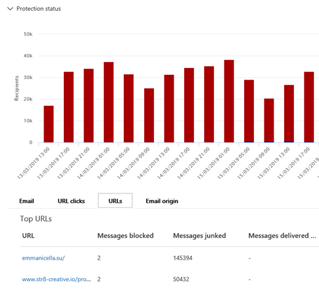

# Gerenciador de ameaças e detecções em tempo real

Se sua organização tem [o Microsoft defender para Office 365](office-365-atp.md) e você tem [as permissões necessárias](#required-licenses-and-permissions), você tem acesso ao *Explorer* ou às *detecções em tempo real*, que antes eram relatórios em *tempo real*. ([Consulte What ' s New.](#new-features-in-threat-explorer-and-real-time-detections)) No centro de conformidade & segurança, vá para **Gerenciamento de ameaças** e selecione as detecções do **Explorer** _ou_ **em tempo real**.

|Com o Microsoft defender para Office 365 plano 2, você vê:|Com o Microsoft defender para Office 365 plano 1, você vê:|
|---|---|
|||
|

As detecções do Explorer ou em tempo real ajudam a equipe de operações de segurança a investigar e responder a ameaças com eficiência. O relatório é semelhante à seguinte imagem:

Com esse relatório, você pode:

- [Consulte malware detectado pelos recursos de segurança do Microsoft 365](#see-malware-detected-in-email-by-technology)
- [Exibir URL de phishing e clicar em dados de veredicto](#view-phishing-url-and-click-verdict-data)
- [Iniciar um processo de investigação e resposta automatizado de um modo de exibição no Explorer](#start-automated-investigation-and-response) (defender para Office 365 Plan 2 apenas)
- [Investigue emails mal-intencionados e muito mais](#more-ways-to-use-explorer-and-real-time-detections)

## Aprimoramentos no explorador de ameaças e detecções em tempo real

### Marcas no explorador de ameaças

> [!NOTE]
> O recurso de marcas de usuário está em *Visualização*, não está disponível para todos e está sujeito a alterações. Para obter informações sobre o cronograma de lançamento, confira o Microsoft 365 Roadmap.

Marcas de usuário identificam grupos específicos de usuários no Microsoft defender para Office 365. Para obter mais informações sobre marcas, incluindo licenciamento e configuração, consulte [User Tags](user-tags.md).

No explorador de ameaças, você pode ver informações sobre marcas de usuário nas seguintes experiências.

#### Exibição de grade de email

A coluna **marcas** na grade de emails contém todas as marcas que foram aplicadas às caixas de correio de remetentes ou destinatários. Por padrão, marcas de sistema como contas de prioridade são mostradas primeiro.

> [!div class="mx-imgBorder"]
> 

#### Filtragem

Você pode usar marcas como um filtro. Busca apenas por contas de prioridade ou cenários de marcas de usuário específico. Você também pode excluir resultados com certas marcas. Combine essa funcionalidade com outros filtros para restringir o escopo de investigação.

> [!div class="mx-imgBorder"]
> 

#### Submenu detalhes do email
Para exibir as marcas individuais do remetente e do destinatário, selecione o assunto para abrir o submenu de detalhes da mensagem. Na guia **Resumo** , as marcas de remetente e destinatário são mostradas separadamente, se estiverem presentes para um email.
As informações sobre marcas individuais para remetente e destinatário também se estendem a dados CSV exportados, onde você pode ver esses detalhes em duas colunas separadas.

> [!div class="mx-imgBorder"]
> 

As informações de marcas também são mostradas no submenu de cliques de URL. Para exibi-lo, vá para Phish ou para todos os modos de exibição de email e, em seguida, clique na guia **URLs** ou **URL** . Selecione um submenu de URL individual para exibir detalhes adicionais sobre cliques dessa URL, incluindo marcas associadas a esse clique.

> [!div class="mx-imgBorder"]
> 

## Aprimoramentos na experiência de busca da ameaça (futuro)

### Informações de ameaças atualizadas para emails

Nos concentramos nos aprimoramentos da plataforma e da qualidade dos dados para aumentar a precisão dos dados e a consistência dos registros de email. Os aprimoramentos incluem a consolidação de informações de pré e entrega, como ações executadas em um email como parte do processo de ZAP em um único registro. Detalhes adicionais como spam veredicto, ameaças no nível da entidade (por exemplo, qual URL era mal-intencionada) e locais de entrega mais recentes também estão incluídos.

Após essas atualizações, você verá uma única entrada para cada mensagem, independentemente dos diferentes eventos de envio que afetam a mensagem. As ações podem incluir ZAP, correção manual (o que significa ação de administrador), entrega dinâmica e assim por diante.

Além de mostrar ameaças de malware e phishing, você vê a veredicto de spam associada a um email. No email, Confira todas as ameaças associadas ao email junto com as tecnologias de detecção correspondentes. Um email pode ter zero, uma ou várias ameaças. Você verá as ameaças atuais na seção **detalhes** do submenu email. Para várias ameaças (como malware e phishing), o campo **Tech de detecção** mostra o mapeamento de detecção de ameaças, que é a tecnologia de detecção que identificou a ameaça.

O conjunto de tecnologias de detecção agora inclui novos métodos de detecção, bem como as tecnologias de detecção de spam. Você pode usar o mesmo conjunto de tecnologias de detecção para filtrar os resultados em diferentes modos de exibição de email (malware, Phish, todos os emails).

> [!NOTE]
> A análise do veredicto pode não estar necessariamente associada a entidades. Por exemplo, um email pode ser classificado como Phish ou spam, mas não há URLs carimbadas com um veredicto de phishing/spam. Isso ocorre porque os filtros também avaliam o conteúdo e outros detalhes de um email antes de atribuir um veredicto.

#### Ameaças em URLs

Agora você pode ver a ameaça específica para uma URL na guia **detalhes** do submenu email. A ameaça pode ser *malware*, *Phish*, *spam* ou *nenhum*.)

> [!div class="mx-imgBorder"]
> 

### Exibição de linha do tempo atualizada (próximo)

> [!div class="mx-imgBorder"]
> 

O modo de exibição linha do tempo identifica todos os eventos Delivery e post-Delivery. Ele inclui informações sobre a ameaça identificada nesse ponto de tempo para um subconjunto desses eventos. O modo de exibição de linha do tempo também fornece informações sobre qualquer ação adicional tomada (como ZAP ou correção manual), juntamente com o resultado dessa ação. As informações de exibição da linha do tempo incluem:

- **Fonte:** Origem do evento. Pode ser administrador/sistema/usuário.
- **Evento:** Inclui eventos de nível superior, como entrega original, correção manual, ZAP, envios e entrega dinâmica.
- **Ação:** A ação específica que foi executada como parte de ZAP ou ação de administrador (por exemplo, exclusão reversível).
- **Ameaças:** Aborda as ameaças (malware, phishing, spam) identificadas nesse momento.
- **Resultado/detalhes:** Obter mais informações sobre o resultado da ação, por exemplo, se ela foi executada como parte da ação ZAP/administrador.

### Local de entrega original e mais recente

No momento, fazemos o local de entrega na grade de email e no submenu de email. O campo **local de entrega** está sendo renomeado * local de *_entrega original_* _. E estamos introduzindo outro campo, o _*_local de entrega mais recente_*_.

_ O *local de entrega original** fornecerá mais informações sobre onde um email foi entregue inicialmente. O **local de entrega mais recente** será um estado em que um email redirecionado após ações do sistema, como ações de *zap* ou de administração, como *mover para itens excluídos*. O local de entrega mais recente destina-se a informar aos administradores a última entrega de local conhecida da mensagem ou qualquer ação de sistema/administrador. Ele não inclui nenhuma ação do usuário final no email. Por exemplo, se um usuário excluiu uma mensagem ou moveu a mensagem para arquivo morto/PST, o local de "entrega" da mensagem não será atualizado. Mas, se uma ação do sistema tiver atualizado o local (por exemplo, ZAP resultando em um email movendo para quarentena), o **local de entrega mais recente** será mostrado como "quarentena".

> [!div class="mx-imgBorder"]
> 

> [!NOTE]
> Há alguns casos em que a **ação de entrega** e o **local** de entrega podem ser mostrados como "desconhecido":
>
> - Você pode ver o **local de entrega** como "entregue" e o local de **entrega** como "desconhecido" se a mensagem foi entregue, mas uma regra de caixa de entrada moveu a mensagem para uma pasta padrão (como rascunho ou arquivo morto) em vez de para a pasta caixa de entrada ou lixo eletrônico.
>
> - O **local de entrega mais recente** pode ser desconhecido se uma ação de administrador/sistema (como zap) foi tentada, mas a mensagem não foi encontrada. Normalmente, a ação ocorre depois que o usuário moveu ou excluiu a mensagem. Nesses casos, verifique a coluna **resultados/detalhes** no modo de exibição linha do tempo. Procure a instrução "mensagem movida ou excluída pelo usuário".

> [!div class="mx-imgBorder"]
> 

### Ações adicionais

*Ações adicionais* foram aplicadas após a entrega do email. Eles podem incluir *zap*, *correção manual* (ação tomada por um administrador, como exclusão reversível), *entrega dinâmica* e *reprocessada* (para um email que foi detectado retroativamente como bom).

> [!NOTE]
> - Como parte das alterações pendentes, o valor "removido por ZAP" Atualmente aparece no filtro de ação de entrega. Você terá uma maneira de Pesquisar todos os emails com o ZAP tentando executar **ações adicionais**.
>
> - Haverá novos campos e valores para tecnologias de **detecção** e **ações adicionais** (especialmente para cenários zap). Você precisará avaliar suas consultas salvas e consultas rastreadas existentes para garantir que elas funcionem com os novos valores.

> [!div class="mx-imgBorder"]

> 

### Substituições de sistema

As *substituições de sistema* permitem que você faça exceções para o local de entrega desejado de uma mensagem. Você substitui o local de entrega fornecido pelo sistema, com base nas ameaças e outras detecções identificadas pela pilha de filtragem. As substituições do sistema podem ser definidas por meio do locatário ou da política de usuário para entregar a mensagem, conforme sugerido pela política. As substituições podem identificar a entrega não intencional de mensagens mal-intencionadas devido a lacunas de configurações, como uma política de remetente seguro muito ampla definida por um usuário. Esses valores de substituição podem ser:

- Permitido pela política de usuário: um usuário cria políticas no nível da caixa de correio para permitir domínios ou remetentes.
- Bloqueado pela política de usuário: um usuário cria políticas no nível de caixa de email para bloquear domínios ou remetentes.
- Permitido pela política da org: as equipes de segurança da organização definem as regras de fluxo de emails ou as regras de fluxo de mensagens do Exchange (também conhecidas como regras de transporte) para permitir remetentes e domínios para usuários em sua organização. Isso pode ser para um conjunto de usuários ou para toda a organização.
- Bloqueado pela política org: as equipes de segurança da organização definem políticas ou regras de fluxo de email para bloquear remetentes, domínios, idiomas de mensagens ou IPs de origem para usuários em sua organização. Isso pode ser aplicado a um conjunto de usuários ou a toda a organização.
- Extensão de arquivo bloqueada pela política org: a equipe de segurança de uma organização bloqueia uma extensão de nome de arquivo por meio das configurações de política antimalware. Esses valores agora serão exibidos nos detalhes do email para ajudar nas investigações. O SecOPS Teams também pode usar o recurso de filtragem avançada para filtrar as extensões de arquivo bloqueados.

> [!div class="mx-imgBorder"]
> 

### Aprimoramentos para a URL e cliques de experiência

Os aprimoramentos incluem:

- Mostrar a URL de clique completo (incluindo qualquer parâmetro de consulta que faça parte da URL) na seção **cliques** do submenu URL. No momento, o domínio e o caminho da URL aparecem na barra de título. Estamos estendendo essas informações para mostrar a URL completa.

- Corrige nos filtros de URL (*URL* versus *domínio* de URL versus *domínio de URL e caminho*): as atualizações afetam a pesquisa de mensagens que contenham uma URL/clique em veredicto. Habilitamos o suporte a pesquisas desindependentes de protocolo, portanto, você pode pesquisar por uma URL sem usar o `http` . Por padrão, a pesquisa de URL mapeia para http, a menos que outro valor seja explicitamente especificado. Por exemplo:

   -  Pesquise e sem o `http://` prefixo nos campos **URL**, **domínio da URL** e **domínio da URL e** filtro de caminho. As pesquisas devem mostrar os mesmos resultados.

   -  Procure o `https://` prefixo na **URL**. Quando nenhum valor é especificado, o `http://` prefixo é assumido.

   - `/` é ignorado no início e no final dos campos **caminho da URL**, **domínio** da URL, **domínio da URL e caminho** . `/` no final do campo **URL** será ignorado.

### Nível de confiança de phishing

O nível de confiança de phishing ajuda a identificar o grau de confiança com o qual um email foi Categorizado como "Phish". Os dois valores possíveis são *High* e *normal*. Nos estágios iniciais, esse filtro estará disponível somente no modo de exibição de Phish do explorador de ameaças.

### Sinal de URL ZAP

O sinal de URL ZAP é normalmente usado para cenários de alerta de Phish de ZAP em que um email foi identificado como Phish e removido após a entrega. Este sinal conecta o alerta com os resultados correspondentes no Explorer. É um dos IOCs para o alerta.

Para melhorar o processo de busca, atualizamos o Gerenciador de ameaças e as detecções em tempo real para tornar a experiência de busca mais consistente. As alterações são descritas aqui:

- [Melhorias de fuso horário](#timezone-improvements)
- [Atualização no processo de atualização](#update-in-the-refresh-process)
- [Detalhamento de gráfico para adicionar a filtros](#chart-drilldown-to-add-to-filters)
- [Atualizações de informações do produto](#in-product-information-updates)

### Filtrar por marcas de usuário

Agora, você pode classificar e filtrar o sistema ou as marcas de usuário personalizadas para entender rapidamente o escopo de ameaças. Para saber mais, confira [marcas de usuário](user-tags.md).

> [!IMPORTANT]
> A filtragem e classificação por marcas de usuário estão atualmente em visualização pública. Essa funcionalidade pode ser modificada substancialmente antes de ser lançada comercialmente. A Microsoft não oferece garantias, expressas ou implícitas, com relação às informações fornecidas sobre ela.

### Melhorias de fuso horário

Você verá o fuso horário dos registros de email no portal, bem como os dados exportados. Ele ficará visível em experiências como grade de email, submenu de detalhes, linha do tempo de email e emails semelhantes, portanto, o fuso horário do conjunto de resultados será claro.

> [!div class="mx-imgBorder"]
> 

### Atualização no processo de atualização

Alguns usuários comentou a confusão com a atualização automática (por exemplo, assim que você alterar a data, a página é atualizada) e a atualização manual (para outros filtros). Da mesma forma, remover filtros leva à atualização automática. Alterar os filtros enquanto modifica a consulta pode causar experiências de pesquisa inconsistentes. Para resolver esses problemas, estamos migrando para um mecanismo de filtragem manual.

A partir de um ponto de vista da experiência, o usuário pode aplicar e remover o intervalo diferente de filtros (do conjunto de filtros e data) e selecionar o botão atualizar para filtrar os resultados após a definição da consulta. O botão atualizar também está agora enfatizado na tela. Também atualizamos as dicas de ferramentas relacionadas e a documentação no produto.

> [!div class="mx-imgBorder"]
> 

### Detalhamento de gráfico para adicionar a filtros

Agora você pode gráfico de valores de legenda para adicioná-los como filtros. Selecione o botão **Atualizar** para filtrar os resultados.

> [!div class="mx-imgBorder"]
> 

### Atualizações de informações no produto

Detalhes adicionais já estão disponíveis no produto, como o número total de resultados de pesquisa dentro da grade (veja abaixo). Aprimoramos rótulos, mensagens de erro e dicas de ferramenta para fornecer mais informações sobre os filtros, a experiência de pesquisa e o conjunto de resultados.

> [!div class="mx-imgBorder"]
> 

## Recursos estendidos no explorador de ameaças

### Principais usuários direcionados

Hoje, expostos a lista dos principais usuários direcionados no modo de exibição de malware para emails, na seção **principais famílias de malware** . Também estenderemos esse modo de exibição no phishing e em todos os modos de exibição de email. Você poderá ver os cinco principais usuários direcionados, juntamente com o número de tentativas para cada usuário para o modo de exibição correspondente. Por exemplo, para o modo de exibição de phishing, você verá o número de tentativas de Phish.

Você poderá exportar a lista de usuários direcionados, até um limite de 3.000, juntamente com o número de tentativas para a análise offline para cada exibição de email. Além disso, a seleção do número de tentativas (por exemplo, 13 tentativas na imagem abaixo) abrirá um modo de exibição filtrado no explorador de ameaças, para que você possa ver mais detalhes nos emails e ameaças desse usuário.

> [!div class="mx-imgBorder"]
> 

### Regras de transporte do Exchange

Como parte do enriquecimento de dados, você poderá ver todas as diferentes regras de transporte do Exchange (ETR) que foram aplicadas a uma mensagem. Essas informações estarão disponíveis no modo de exibição grade de email. Para exibi-lo, selecione **Opções de coluna** na grade e, em seguida, **adicione regra de transporte do Exchange** das opções de coluna. Ele também estará visível no submenu **detalhes** no email.

Você poderá ver tanto o GUID quanto o nome das regras de transporte que foram aplicadas à mensagem. Você poderá procurar as mensagens usando o nome da regra de transporte. Essa é uma pesquisa "contém", o que significa que você também pode fazer pesquisas parciais.

#### Observação importante:

ETR a pesquisa e o nome disponibilidade dependem da função específica que é atribuída a você. Você precisa ter uma das seguintes funções/permissões para exibir os nomes e a pesquisa do ETR. Se você não tiver nenhuma dessas funções atribuídas a você, não poderá ver os nomes das regras de transporte ou procurar mensagens usando nomes do ETR. No entanto, você pode ver as informações de rótulo e GUID do ETR nos detalhes do email. Outras experiências de exibição de registros em grades de email, submenus de email, filtros e exportação não são afetadas.

- EXO-prevenção de perda de dados: ALL
- Somente EXO-O365SupportViewConfig: ALL
- Microsoft Azure Active Directory ou EXO-Security admin: ALL
- AAD ou EXO-leitor de segurança: todos
- Regras de transporte somente EXO: ALL
- Somente EXO-configuração de View-Only: ALL

Na grade de emails, no submenu detalhes e no CSV exportado, o ETRs é apresentado com um nome/GUID, conforme mostrado abaixo.

> [!div class="mx-imgBorder"]
> 

### Conectores de entrada

Os conectores são uma coleção de instruções que personalizam como o email flui para e da sua organização do Microsoft 365 ou do Office 365. Eles permitem que você aplique qualquer restrição de segurança ou controle. No explorador de ameaças, agora você pode exibir os conectores relacionados a um email e Pesquisar emails usando nomes de conectores.

A pesquisa de conectores é "contém" em natureza, o que significa que as pesquisas de palavras-chave parciais também funcionam. Dentro do modo de exibição de grade principal, o submenu detalhes e o CSV exportado, os conectores são mostrados no formato de nome/GUID, conforme mostrado aqui:

> [!div class="mx-imgBorder"]
> 

## Novos recursos no Gerenciador de ameaças e detecções em tempo real

Três novos recursos estão disponíveis no Gerenciador de ameaças e detecções em tempo real:

- [Visualizar o cabeçalho de email e baixar o corpo do email](#preview-email-header-and-download-email-body)
- [Linha do tempo de email](#email-timeline)
- [Exportar URL clique em dados](#export-url-click-data)

Esses novos recursos estão descritos abaixo.

### Visualizar o cabeçalho de email e baixar o corpo do email

Agora você pode visualizar um cabeçalho de email e baixar o corpo do email no Gerenciador de ameaças os administradores podem analisar os cabeçalhos/mensagens de email baixados para ameaças. Como o download de mensagens de email pode arriscar a exposição de informações, esse processo é controlado pelo controle de acesso baseado em função (RBAC). Uma nova função, *Visualização*, deve ser adicionada a outro grupo de função (como operações de segurança ou administrador de segurança) para conceder a capacidade de baixar emails e Visualizar cabeçalhos em todas as mensagens de email exibir.

O Explorer e as detecções em tempo real também receberão novos campos que oferecem uma imagem mais completa de onde suas mensagens de email vão. Essas alterações tornam a busca mais fácil para as operações de segurança. Mas o resultado principal é que você pode saber o local das mensagens de email de problemas em um relance.

Como isso é feito? O status de entrega agora é dividido em duas colunas:

- **Ação de entrega** -status do email.
- **Local de entrega** -onde o email foi roteado.

A *ação de entrega* é a ação realizada em um email devido a políticas ou detecções existentes. Veja a seguir as ações possíveis para um email:

|Gerados|Lixo eletrônico|Blocked|Devido|
|---|---|---|---|
|O email foi entregue à caixa de entrada ou pasta de um usuário, e o usuário pode acessá-lo.|O email foi enviado para a pasta lixo eletrônico ou excluído do usuário, e o usuário pode acessá-lo.|Emails que são colocados em quarentena, que falharam ou foram descartados. Esses emails não podem ser acessados pelo usuário.|Os emails tinham anexos mal-intencionados substituídos por arquivos. txt que indicam que o anexo era mal-intencionado.|

Veja o que o usuário pode ou não ver:

|Acessível para os usuários finais|Inacessível para os usuários finais|
|---|---|
|Gerados|Blocked|
|Lixo eletrônico|Devido|

O **local de entrega** mostra os resultados das políticas e detecções que executam post-Delivery. Ele está vinculado à *_ação de entrega_* _. Estes são os valores possíveis:

- _Inbox ou pasta *: o email está na caixa de entrada ou em uma pasta (de acordo com suas regras de email).
- *Local ou externo*: a caixa de correio não existe na nuvem, mas está no local.
- *Pasta de lixo eletrônico*: o email está na pasta de lixo eletrônico de um usuário.
- *Pasta itens excluídos*: o email na pasta itens excluídos de um usuário.
- *Quarantine*: o email está em quarentena e não na caixa de correio de um usuário.
- *Falha*: o email não pôde chegar à caixa de correio.
- *Descartado*: o email foi perdido em algum lugar no fluxo de emails.

### Linha do tempo de email

A **linha do tempo de email** é um novo recurso do Explorer que melhora a experiência de busca para administradores. Ele recorta o tempo gasto na verificação de locais diferentes para tentar entender o evento. Quando vários eventos ocorrem ou próximos ao mesmo tempo que um email chega, esses eventos são exibidos em um modo de exibição de linha do tempo. Alguns eventos que acontecem em seu email post-Delivery são capturados na coluna **especial Action** . Os administradores podem combinar as informações da linha do tempo com a ação especial tomada no envio de postagem para obter informações sobre como as políticas funcionam, onde o email foi finalmente encaminhado e, em alguns casos, qual era a avaliação final.

Para obter mais informações, consulte [investigar e corrigir emails mal-intencionados que foram entregues no Office 365](investigate-malicious-email-that-was-delivered.md).

### Exportar URL clique em dados

Agora você pode exportar relatórios para cliques de URL para o Microsoft Excel para exibir sua **ID de mensagem de rede** e **clique em veredicto**, que ajuda a explicar onde sua URL clica no tráfego originado. Veja como funciona: no gerenciamento de ameaças na barra de início rápido do Office 365, siga esta cadeia:

**Explorer** \> **Exibir Phish** \> **Clica em** \> **Principais URLs** ou **principais cliques de URL** \> Selecione qualquer registro para abrir o submenu URL.

Ao selecionar uma URL na lista, você verá um novo botão de **exportação** no painel de saída. Use este botão para mover dados para uma planilha do Excel para facilitar o relatório.

Siga este caminho para obter o mesmo local no relatório de detecções em tempo real:

**Explorer** \> Detecções em tempo **real** \> **Exibir Phish** \> **URLs** \> **Principais URLs** ou **principais cliques** \> Selecione qualquer registro para abrir o submenu URL \> navegue até a guia **cliques** .

> [!TIP]
> A ID da mensagem de rede mapeia o clique em voltar para emails específicos quando você pesquisa o ID pelo Explorer ou ferramentas de terceiros associadas. Essas pesquisas identificam o email associado a um resultado de clique. A identificação da mensagem de rede correlacionada faz uma análise mais rápida e eficiente.

> [!div class="mx-imgBorder"]
> 

## Confira malware detectado em email por tecnologia

Suponha que você queira ver malware detectado em emails classificados pela tecnologia Microsoft 365. Para fazer isso, use o [>](threat-explorer-views.md#email--malware) modo de exibição de malware de email do Explorer (ou detecções em tempo real).

1. No centro de conformidade e segurança & ( <https://protection.office.com> ), escolha Gerenciador de **Gerenciamento de ameaças** \>  (ou **detecções em tempo real**). (Este exemplo usa o Explorer.)

2. No menu **Exibir** , escolha malware de **email** \> .

   > [!div class="mx-imgBorder"]
   > 

3. Clique em **remetente** e escolha tecnologia  de \> **detecção** básica.

   Agora, suas tecnologias de detecção estão disponíveis como filtros para o relatório.

   > [!div class="mx-imgBorder"]
   > 

4. Escolha uma opção. Em seguida, selecione o botão **Atualizar** para aplicar esse filtro.

   > [!div class="mx-imgBorder"]
   > 

O relatório é atualizado para mostrar os resultados detectados pelo malware no email, usando a opção de tecnologia que você selecionou. A partir daqui, você pode realizar uma análise adicional.

## Exibir URL de phishing e clicar em dados de veredicto

Suponha que você queira ver as tentativas de phishing por meio de URLs no email, incluindo uma lista de URLs que foram permitidas, bloqueadas e substituídas. Para identificar URLs que foram clicadas, os [links seguros](atp-safe-links.md) devem ser configurados. Certifique-se de configurar [políticas de links seguros](set-up-atp-safe-links-policies.md) para proteção de tempo de clique e log de clique em verdicts por links seguros.

Para examinar as URLs de phishing em mensagens e clicar em URLs nas mensagens de phishing, use o modo de exibição [   >  **phishing Phish**](threat-explorer-views.md#email--phish) de detecções do Explorer ou em tempo real.

1. No centro de conformidade e segurança & ( <https://protection.office.com> ), escolha Gerenciador de **Gerenciamento de ameaças** \>  (ou **detecções em tempo real**). (Este exemplo usa o Explorer.)

2. No menu **Exibir** , escolha phishing de **email** \> .

   > [!div class="mx-imgBorder"]
   > 

3. Clique em **remetente** e, em seguida, escolha **URLs** \> **clique em veredicto**.

4. Selecione uma ou mais opções, como **bloqueado** e **substituído** e, em seguida, selecione o botão **Atualizar** na mesma linha que as opções para aplicar esse filtro. (Não atualize a janela do navegador.)

   > [!div class="mx-imgBorder"]
   > 

   O relatório é atualizado para mostrar duas tabelas de URL diferentes na guia URL no relatório:

   - As URLs **principais** são as URLs nas mensagens que você filtrou para baixo e a ação de entrega de email conta para cada URL. No modo de exibição email de phishing, esta lista normalmente contém URLs legítimas. Os invasores incluem uma mistura de URLs boas e ruins em suas mensagens para tentar obtê-las, mas eles fazem com que os links mal-intencionados pareçam mais interessantes. A tabela de URLs é classificada pela contagem total de emails, mas essa coluna fica oculta para simplificar o modo de exibição.

   - Os **principais cliques** são as URLs de links seguros que foram clicados, classificados por contagem de clique total. Essa coluna também não é exibida para simplificar o modo de exibição. Total de contagens por coluna indicam os links seguros clique em contagem de veredicto para cada URL clicada. No modo de exibição email de phishing, são normalmente URLs suspeitas ou mal-intencionadas. Mas o modo de exibição pode incluir URLs que não são ameaças, mas que estão em mensagens de phishing. Os cliques de URL em links desajustados não aparecem aqui.

   As duas tabelas de URL mostram as principais URLs nas mensagens de email de phishing por ação de entrega e local. As tabelas mostram cliques de URL que foram bloqueados ou visitados apesar de um aviso, para que você possa ver quais links defeituosos possíveis foram apresentados aos usuários e se o usuário clicou. A partir daqui, você pode realizar uma análise adicional. Por exemplo, abaixo do gráfico, você pode ver as principais URLs nas mensagens de email que foram bloqueadas no ambiente de sua organização.

   > [!div class="mx-imgBorder"]
   > 

   Selecione uma URL para exibir informações mais detalhadas.

   > [!NOTE]
   > Na caixa de diálogo submenu URL, a filtragem em mensagens de email é removida para mostrar o modo de exibição completo da exposição da URL em seu ambiente. Isso permite que você filtre as mensagens de email que você está preocupado no Explorer, encontre URLs específicas que são ameaças potenciais e, em seguida, expanda a compreensão da exposição de URL no seu ambiente (por meio da caixa de diálogo detalhes da URL) sem ter que adicionar filtros de URL à própria exibição do Explorer.

### Interpretação de clique em verdicts

Dentro dos submenus de email ou URL, principais cliques, bem como em nossas experiências de filtragem, você verá os valores de veredicto em diferentes:

- **Nenhum:** Não é possível capturar o veredicto para a URL. O usuário pode ter clicado através da URL.
- **Permitido:** O usuário tem permissão para navegar até a URL.
- **Bloqueado:** O usuário foi impedido de navegar para a URL.
- **Veredicto pendente:** O usuário foi apresentado com a página acionamento-Pending.
- **Bloqueados substituídos:** O usuário foi impedido de navegar diretamente para a URL. Mas o usuário overrode o bloco para navegar até a URL.
- **Veredicto pendente ignorada:** O usuário foi apresentado com a página acionamento. Mas o usuário overrode a mensagem para acessar a URL.
- **Erro:** O usuário foi apresentado à página de erro ou ocorreu um erro ao capturar o veredicto.
- **Falha:** Ocorreu uma exceção desconhecida ao capturar o veredicto. O usuário pode ter clicado através da URL.

## Analisar mensagens de email relatadas por usuários

Suponha que você queira ver as mensagens de email que os usuários da sua organização relataram como *lixo eletrônico*, *não lixo eletrônico* ou *phishing* por meio do [suplemento de mensagem de relatório para Outlook e Outlook na Web](enable-the-report-message-add-in.md). Para vê-los, use o modo de exibição [   >  **envios** de email](threat-explorer-views.md#email--submissions) do Explorer (ou detecções em tempo real).

1. No centro de conformidade e segurança & ( <https://protection.office.com> ), escolha Gerenciador de **Gerenciamento de ameaças** \>  (ou **detecções em tempo real**). (Este exemplo usa o Explorer.)

2. No menu **Exibir** , escolha  \> **envios** de email.

   > [!div class="mx-imgBorder"]
   > 

3. Clique em **remetente** e, em seguida, escolha tipo de  \> **relatório** básico.

4. Selecione uma opção, como **Phish**, e, em seguida, selecione o botão **Atualizar** .

   > [!div class="mx-imgBorder"]
   > 

O relatório é atualizado para mostrar dados sobre mensagens de email que as pessoas em sua organização relataram como uma tentativa de phishing. Você pode usar essas informações para realizar mais análises e, se necessário, ajustar suas [políticas anti-phishing no Microsoft defender para Office 365](configure-atp-anti-phishing-policies.md).

## Iniciar investigação e resposta automatizadas

> [!NOTE]
> Os recursos de investigação e resposta automatizados estão disponíveis no *Microsoft defender para Office 365 plano 2* e no *Office 365 E5*.

A [investigação e a resposta automatizadas](automated-investigation-response-office.md) podem salvar o tempo e esforço da equipe de operações de segurança gasto investigando e reduzindo o cyberattacks. Além de configurar alertas que podem acionar um guia de segurança, você pode iniciar um processo de investigação e resposta automatizado de um modo de exibição no Explorer. Para obter detalhes, consulte [example: um administrador de segurança dispara uma investigação do Explorer](automated-investigation-response-office.md#example-a-security-administrator-triggers-an-investigation-from-threat-explorer).

## Outras maneiras de usar o Explorer e detecções em tempo real

Além dos cenários descritos neste artigo, você tem muito mais opções de relatórios disponíveis com o Explorer (ou detecções em tempo real). Confira os seguintes artigos:

- [Localizar e investigar emails mal-intencionados entregues](investigate-malicious-email-that-was-delivered.md)
- [Exibir arquivos mal-intencionados detectados no SharePoint Online, no OneDrive e no Microsoft Teams](malicious-files-detected-in-spo-odb-or-teams.md)
- [Obter uma visão geral dos modos de exibição no explorador de ameaças (e detecções em tempo real)](threat-explorer-views.md)
- [Relatório de status de proteção contra ameaças](view-email-security-reports.md#threat-protection-status-report)
- [Investigação e resposta automatizadas na Proteção contra Ameaças da Microsoft](https://docs.microsoft.com/microsoft-365/security/mtp/mtp-autoir)

## Licenças e permissões necessárias

Você deve ter [o Microsoft defender para Office 365](office-365-atp.md) para usar as detecções do Explorer ou em tempo real.

- O Explorer está incluído no defender para Office 365 plano 2.
- O relatório de detecções em tempo real está incluído no defender para Office 365 plano 1.
- Planejar a atribuição de licenças para todos os usuários que devem ser protegidos pelo defender para Office 365. As detecções do Explorer e em tempo real mostram dados de detecção para usuários licenciados.

Para exibir e usar as detecções do Explorer ou em tempo real, você deve ter as permissões apropriadas, como aquelas concedidas a um administrador de segurança ou leitor de segurança.

- Para o centro de conformidade & segurança, você deve ter uma das seguintes funções atribuídas:

  - Gerenciamento de Organização
  - Administrador de segurança (isso pode ser atribuído no centro de administração do Azure Active Directory ( <https://aad.portal.azure.com> )
  - Leitor de segurança

- Para o Exchange Online, você deve ter uma das seguintes funções atribuídas no centro de administração do Exchange ( <https://admin.protection.outlook.com/ecp/> ) ou no [PowerShell do Exchange Online](https://docs.microsoft.com/powershell/exchange/exchange-online-powershell):

  - Gerenciamento de Organização
  - Gerenciamento de Organização Somente Exibição
  - Destinatários Somente para Exibição
  - Gerenciamento de Conformidade

Para saber mais sobre funções e permissões, confira os seguintes recursos:

- [Permissões no Centro de Segurança e Conformidade](permissions-in-the-security-and-compliance-center.md)
- [Permissões de recursos no Exchange Online](https://docs.microsoft.com/exchange/permissions-exo/feature-permissions)

## Diferenças entre as detecções do Gerenciador de ameaças e do tempo real

- O relatório de *detecções em tempo real* está disponível no defender para Office 365 plano 1. O *Explorador de ameaças* está disponível no defender para Office 365 plano 2.
- O relatório de detecções em tempo real permite que você visualize detecções em tempo real. O Gerenciador de ameaças também faz isso, mas também fornece detalhes adicionais para um determinado ataque.
- Um modo de exibição de *todos os emails* está disponível no Gerenciador de ameaças, mas não no relatório de detecções em tempo real.
- Mais recursos de filtragem e ações disponíveis estão incluídos no explorador de ameaças. Para obter mais informações, consulte [Microsoft defender para Office 365 descrição do serviço: disponibilidade de recursos nos planos do defender para office 365](https://docs.microsoft.com/office365/servicedescriptions/office-365-advanced-threat-protection-service-description#feature-availability-across-advanced-threat-protection-atp-plans).
