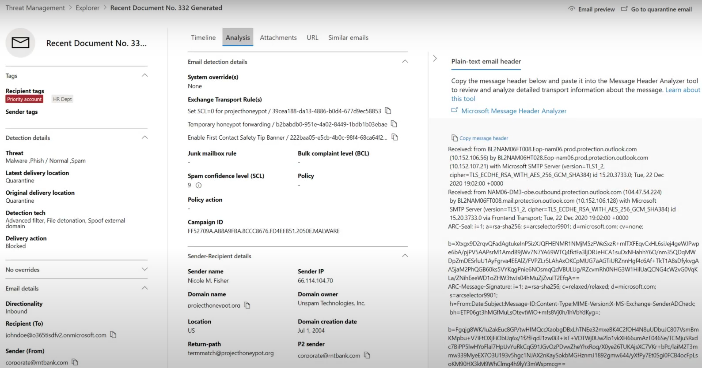

# Busca de ameaças no Explorador de Ameaças para o Microsoft Defender para Office 365Threat hunting in Threat Explorer for Microsoft Defender for Office 365

Neste artigo:In this article:

- [Passo a passo do Explorador de AmeaçasThreat Explorer walk-through](#threat-explorer-walk-through)
- [Investigação de emailEmail investigation](#email-investigation)
- [Correção de emailEmail remediation](#email-remediation)
- [Melhorias na experiência de busca de ameaçasImprovements to threat hunting experience](#improvements-to-threat-hunting-experience)

> [!NOTE]
> Isso faz parte de uma série de 3 artigos no Explorador de Ameaças **(Explorer),** segurança de **email** e noções **básicas** de detecções do Explorer e em tempo real (como diferenças entre as ferramentas e permissões necessárias para operá-las). This is part of a **3-article series** on **Threat Explorer (Explorer)**, **email security**, and **Explorer and Real-time detections basics** (such as differences between the tools, and permissions needed to operate them). Os outros dois artigos desta série são Segurança de email com [o Explorador](email-security-in-microsoft-defender.md) de Ameaças e o Explorador de Ameaças e noções [básicas de detecções em tempo real.](real-time-detections.md)The other two articles in this series are [Email security with Threat Explorer](email-security-in-microsoft-defender.md) and [Threat Explorer and Real-time detections basics](real-time-detections.md).

**Aplica-se a****Applies to**
- [Plano 1 e plano 2 do Microsoft Defender para Office 365Microsoft Defender for Office 365 plan 1 and plan 2](defender-for-office-365.md)
- [Microsoft 365 DefenderMicrosoft 365 Defender](../defender/microsoft-365-defender.md)

Se sua organização tiver [o Microsoft Defender](defender-for-office-365.md)para Office 365 , e você tiver as permissões , você poderá usar detecções do **Explorer** ou em tempo **real** para detectar e remediar ameaças. If your organization has [Microsoft Defender for Office 365](defender-for-office-365.md), and you have the [permissions](#required-licenses-and-permissions), you can use **Explorer** or **Real-time detections** to detect and remediate threats. 

No portal **Microsoft 365 Defender,** acesse **Email & colaboração** e escolha **Explorer**.In the **Microsoft 365 Defender portal**, go to **Email & collaboration**, and then choose **Explorer**.

 

****

|Com o Microsoft Defender para Office 365 Plano 2, você verá:With Microsoft Defender for Office 365 Plan 2, you see:|Com o Microsoft Defender para Office 365 Plano 1, consulte:With Microsoft Defender for Office 365 Plan 1, you see:|
|---|---|
|||
|

Com essas ferramentas, você pode:With these tools, you can:

- Consulte malware detectado pelos recursos Microsoft 365 segurançaSee malware detected by Microsoft 365 security features
- Exibir URL de phishing e clicar em dados de vereditoView phishing URL and click verdict data
- Iniciar um processo automatizado de investigação e resposta a partir de uma exibição no ExplorerStart an automated investigation and response process from a view in Explorer
- Investigar emails mal-intencionados e muito maisInvestigate malicious email, and more

Para obter mais informações, consulte [Segurança de email com o Explorador de Ameaças.](email-security-in-microsoft-defender.md)For more information, see [Email security with Threat Explorer](email-security-in-microsoft-defender.md). 

## Passo a passo do Explorador de AmeaçasThreat Explorer walk-through

No Microsoft Defender para Office 365, há dois planos de assinatura: Plano 1 e Plano 2.In Microsoft Defender for Office 365, there are two subscription plans—Plan 1 and Plan 2. Ferramentas de busca de ameaças operadas manualmente existem em ambos os planos, em nomes diferentes e com diferentes recursos.Manually operated Threat hunting tools exist in both plans, under different names and with different capabilities.

O Defender para Office 365 Plano 1 usa detecções em tempo *real*, que é um subconjunto da ferramenta de busca *do Explorador* de Ameaças (também chamada de *Explorer)* no Plano 2.Defender for Office 365 Plan 1 uses *Real-time detections*, which is a subset of the *Threat Explorer* (also called *Explorer*) hunting tool in Plan 2. Nesta série de artigos, a maioria dos exemplos foi criada usando o Explorador de Ameaças completo.In this series of articles, most of the examples were created using the full Threat Explorer. Os administradores devem testar todas as etapas em detecções em tempo real para ver onde se aplicam.Admins should test any steps in Real-time detections to see where they apply.

Para abrir a ferramenta Explorer, vá para Microsoft 365 **Portal do Defender** Email & Colaboração  >    >  **Explorer**.To open the Explorer tool, go to **Microsoft 365 Defender portal** > **Email & collaboration** > **Explorer**. Por padrão, você chegará na página **Malware,** mas use a lista de opções Exibir para se familiarizar com suas opções. By default, you’ll arrive on the **Malware** page, but use the **View** drop down to get familiar with your options. Se você estiver procurando Phish, ou pesquisando uma campanha de ameaça, escolha esses pontos de exibição.If you’re hunting Phish, or digging into a threat campaign, choose those views.

> [!div class="mx-imgBorder"]
> 

Uma vez que uma pessoa de operações de segurança (Operações de Sec) selecione os dados que deseja ver, se o escopo é uma exibição estreita, como **envios** do usuário, ou uma exibição mais ampla, como Todos os **emails,** pode usar o botão **Remetente** para filtrar ainda mais.Once a security operations (Sec Ops) person selects the data they want to see, whether the scope is narrow view like user **Submissions**, or a wider view, like **All email**, they can use the **Sender** button to further filter. Lembre-se de selecionar Atualizar para concluir suas ações de filtragem.Remember to select Refresh to complete your filtering actions.

> [!div class="mx-imgBorder"]
> 

O foco de refinamento no Explorer ou na detecção em tempo real pode ser pensado em camadas.Refining focus in Explorer or Real-time detection can be thought of in layers. O primeiro é **Exibir**.The first is **View**. O segundo pode ser pensado como um *foco filtrado.*The second can be thought of as a *filtered focus*. Por exemplo, você pode refazer as etapas que você tomou para encontrar uma ameaça registrando suas decisões como esta: Para encontrar o problema no Explorer, eu escolhi **o Foco** de filtro De exibição de malware com um destinatário.For example, you can retrace the steps you took in finding a threat by recording your decisions like this: To find the issue in Explorer, **I chose the Malware View with a Recipient filter focus**. Isso facilita a retração das etapas.This makes retracing your steps easier.

> [!TIP]
> Se o Sec Ops usar **Tags** para marcar contas que consideram destinos de alto valor, eles poderão fazer seleções como o Phish View com um foco de filtro tags (inclua um intervalo de datas, se *usado)*.If Sec Ops uses **Tags** to mark accounts they consider high valued targets, they can make selections like *Phish View with a Tags filter focus (include a date range if used)*. Isso mostrará a eles quaisquer tentativas de phishing direcionadas aos seus destinos de usuário de alto valor durante um intervalo de tempo (como datas em que determinados ataques de phishing estão ocorrendo muito para o setor).This will show them any phishing attempts directed at their high value user targets during a time-range (like dates when certain phishing attacks are happening a lot for their industry). 

Refinamentos podem ser feitos em intervalos de data usando os controles de intervalo de datas.Refinements can be made on date ranges by using the date range controls. Aqui você pode ver o explorer no **ponto de exibição Malware,** com um foco de filtro **tecnologia** de detecção.Here you can see Explorer in **Malware** view, with a **Detection Technology** filter focus. Mas é o botão **filtro** avançado que permite que as equipes de Operações Sec cavem profundamente.But it’s the **Advanced filter** button that lets Sec Ops teams dig deep. 

> [!div class="mx-imgBorder"]
> 

Clicar no **filtro Avançado** aparece em um painel que permitirá que os caçadores de Ops Sec criem consultas por conta própria, deixando-os incluir ou excluir as informações necessárias para ver.Clicking the **Advanced filter** pops a panel that will let Sec Ops hunters build queries themselves, letting them include or exclude the information they need to see. O gráfico e a tabela na página Explorer refletirão seus resultados.Both the chart and table on the Explorer page will reflect their results. 

> [!div class="mx-imgBorder"]
> 

Use o **botão Opções de** coluna para obter o tipo de informação na tabela que seria mais útil:Use the **Column options** button to get the kind of information on the table that would be most helpful: 

> [!div class="mx-imgBorder"]
> 

> [!div class="mx-imgBorder"]
> 

No mesmo mien, certifique-se de testar suas opções de exibição.In the same mien, make sure to test your display options. Audiências diferentes reagirão bem a apresentações diferentes dos mesmos dados.Different audiences will react well to different presentations of the same data. Para alguns visualizadores, o **mapa Origens** do Email pode mostrar que uma ameaça é difundida ou discreta mais rapidamente do que a **opção de** exibição campanha ao lado dela.For some viewers, the **Email Origins** map can show that a threat is widespread or discreet more quickly than the **Campaign display** option right next to it. As Ops sec podem usar essas exibições para melhor fazer pontos que sublinham a necessidade de segurança e proteção, ou para comparação posterior, para demonstrar a eficácia de suas ações.Sec Ops can make use of these displays to best make points that underscore the need for security and protection, or for later comparison, to demonstrate the effectiveness of their actions. 

> [!div class="mx-imgBorder"]
> 

> [!div class="mx-imgBorder"]
> 

### Investigação de emailEmail investigation

Quando você vir um email suspeito, clique no nome para expandir o sobrevoo à direita.When you see a suspicious email, click the name to expand the flyout on the right. Aqui, o banner que permite que as Ops Sec vejam a página da entidade [de email](mdo-email-entity-page.md) está disponível.Here, the banner that lets Sec Ops see the [email entity page](mdo-email-entity-page.md) is available.

A página da entidade de email reúne conteúdos que podem ser encontrados em **Detalhes,** **Anexos, Dispositivos,** mas inclui dados mais organizados.The email entity page pulls together contents that can be found under **Details**, **Attachments**, **Devices**, but includes more organized data. Isso inclui coisas como resultados DMARC, exibição simples de texto do header de email com uma opção de cópia, informações de veredito sobre anexos que foram detonados com segurança e arquivos que essas detonações foram descartados (pode incluir endereços IP que foram contatados e capturas de tela de páginas ou arquivos).This includes things like DMARC results, plain text display of the email header with a copy option, verdict information on attachments that were securely detonated, and files those detonations dropped (can include IP addresses that were contacted and screenshots of pages or files). URLs e seus vereditos também são listados com detalhes semelhantes relatados.URLs and their verdicts are also listed with similar details reported. 

Quando você chegar a esse estágio, a página da entidade de email será fundamental para a etapa final:*correção*.When you reach this stage, the email entity page will be critical to the final step—*remediation*. 

> [!div class="mx-imgBorder"]
> 

> [!TIP]
> Para saber mais sobre a página de  entidade rich email (vista abaixo na guia Análise), incluindo os resultados de Anexos detonados, descobertas para URLs incluídas e visualização de email seguro, clique [aqui](mdo-email-entity-page.md).To learn more about the rich email entity page (seen below on the **Analysis** tab), including the results of detonated Attachments, findings for included URLs, and safe Email preview, click [here](mdo-email-entity-page.md).

> [!div class="mx-imgBorder"]
> 

### Correção de emailEmail remediation

Depois que uma pessoa de Operações da Sec determina que um email é uma ameaça, a próxima etapa de detecção do Explorer ou em tempo real está lidando com a ameaça e remediando-a.Once a Sec Ops person determines that an email is a threat, the next Explorer or Real-time detection step is dealing with the threat and remediating it. Isso pode ser feito retornando ao Explorador de Ameaças, selecionando a caixa de seleção para o email do problema e usando o **botão Ações.**This can be done by returning to Threat Explorer, selecting the checkbox for the problem email, and using the **Actions** button.

> [!div class="mx-imgBorder"]
> 

Aqui, o analista pode tomar ações como relatar o email como Spam, Phishing ou Malware, contatar destinatários ou outras investigações que podem incluir a acionamento de cartilhas de Investigação e Resposta Automatizada (ou AIR) (se você tiver o Plano 2).Here, the analyst can take actions like reporting the mail as Spam, Phishing, or Malware, contacting recipients, or further investigations that can include triggering Automated Investigation and Response (or AIR) playbooks (if you have Plan 2). Ou, o email também pode ser relatado como limpo.Or, the mail can also be reported as clean.

> [!div class="mx-imgBorder"]
> 

## Melhorias na experiência de busca de ameaçasImprovements to threat hunting experience

### ID do alertaAlert ID

Ao navegar de um alerta para o Explorador de Ameaças, o **View** será filtrado pela **ID do Alerta.**When navigating from an alert into Threat Explorer, the **View** will be filtered by **Alert ID**. Isso também se aplica à detecção em tempo real.This also applies in Real-time detection. As mensagens relevantes para o alerta específico e um total de emails (uma contagem) são mostradas.Messages relevant to the specific alert, and an email total (a count) are shown. Você poderá ver se uma mensagem fazia parte de um alerta, bem como navegar dessa mensagem para o alerta relacionado.You will be able to see if a message was part of an alert, as well as navigate from that message to the related alert.

Por fim, a ID do alerta está incluída na URL, por exemplo: `https://https://security.microsoft.com/viewalerts`Finally, alert ID is included in the URL, for example: `https://https://security.microsoft.com/viewalerts`

> [!div class="mx-imgBorder"]
> 

> [!div class="mx-imgBorder"]
> 

### Extensão do Explorer (e detecções em tempo real) e limite de pesquisa para locatários de avaliaçãoExtending Explorer (and Real-time detections) data retention and search limit for trial tenants 

Como parte dessa alteração, os analistas poderão pesquisar e filtrar dados de email por 30 dias (aumento de sete dias) no Explorador de Ameaças e detecções em tempo real para os locatários de avaliação do Defender para Office P1 e P2.As part of this change, analysts will be able to search for, and filter email data across 30 days (increased from seven days) in Threat Explorer and Real-time detections for both Defender for Office P1 and P2 trial tenants. Isso não afeta locatários de produção para clientes P1 e P2 E5, onde o padrão de retenção já é de 30 dias.This doesn’t impact any production tenants for both P1 and P2 E5 customers, where the retention default is already 30 days.

### Limite de exportação atualizadoUpdated Export limit 

O número de registros de Emails que podem ser exportados do Explorador de Ameaças agora é 200.000 (era 9990).The number of Emails records that can be exported from Threat Explorer is now 200,000 (was 9990). O conjunto de colunas que pode ser exportado não mudou.The set of columns that can be exported is unchanged. 

### Marcas no Explorador de AmeaçasTags in Threat Explorer

> [!NOTE]
> O recurso de marcas de usuário está em Visualização e pode não estar disponível para todos.The user tags feature is in Preview and may not be available to everyone. Além disso, as visualizações estão sujeitas a alterações.Also, Previews are subject to change. Para obter informações sobre o cronograma de lançamento, confira o Microsoft 365 de lançamento.For information about the release schedule, check out the Microsoft 365 roadmap.

As marcas de usuário identificam grupos específicos de usuários no Microsoft Defender para Office 365.User tags identify specific groups of users in Microsoft Defender for Office 365. Para obter mais informações sobre marcas, incluindo licenciamento e configuração, consulte [Marcas de usuário](user-tags.md).For more information about tags, including licensing and configuration, see [User tags](user-tags.md).

No Explorador de Ameaças, você pode ver informações sobre marcas de usuário nas experiências a seguir.In Threat Explorer, you can see information about user tags in the following experiences.

#### Exibição de grade de emailEmail grid view

Quando os analistas olham para a coluna **Marcas** da grade de email, eles estão vendo todas as marcas que foram aplicadas a caixas de correio de remetente ou destinatário.When analysts look at the **Tags** column the email grid, they are seeing all tags that have been applied to sender or recipient mailboxes. Por padrão, as marcas do sistema, como *contas de prioridade,* são mostradas primeiro.By default, system tags like *priority accounts* are shown first.

> [!div class="mx-imgBorder"]
> 

#### FiltragemFiltering

As marcas podem ser usadas como filtros.Tags can be used as filters. Hunt among priority accounts only, or use specific user tags scenarios this way.Hunt among priority accounts only, or use specific user tags scenarios this way. Você também pode excluir resultados que tenham determinadas marcas.You can also exclude results that have certain tags. Combine marcas com outros filtros e intervalos de datas para restringir seu escopo de investigação.Combine Tags with other filters and date ranges to narrow your scope of investigation. 

> [!div class="mx-imgBorder"]
> 

#### Sobremenu de detalhes de emailEmail detail flyout

Para exibir as marcas individuais de remetente e destinatário, selecione um email para abrir o sobremenu de detalhes da mensagem.To view the individual tags for sender and recipient, select an email to open the message details flyout. Na guia **Resumo,** as marcas remetente e destinatário são mostradas separadamente.On the **Summary** tab, the sender and recipient tags are shown separately. As informações sobre marcas individuais para remetente e destinatário podem ser exportadas como dados CSV.The information about individual tags for sender and recipient can be exported as CSV data. 

> [!div class="mx-imgBorder"]
> 

As informações de marcas também são mostradas no flyout de cliques da URL.Tags information is also shown in the URL clicks flyout. Para vê-lo, vá para Phish or All Email view > **URLs** ou **URL Clicks** tab. Selecione um flyout de URL individual para ver detalhes adicionais sobre cliques para essa URL, incluindo todas as Marcas associadas a esse clique.To see it, go to Phish or All Email view > **URLs** or **URL Clicks** tab. Select an individual URL flyout to see additional details about clicks for that URL, including any Tags associated with that click.

### Exibição de linha do tempo atualizadaUpdated Timeline View

> [!div class="mx-imgBorder"]
> 
>
Saiba mais assistindo a [este vídeo](https://www.youtube.com/watch?v=UoVzN0lYbfY&list=PL3ZTgFEc7LystRja2GnDeUFqk44k7-KXf&index=4).Learn more by watching [this video](https://www.youtube.com/watch?v=UoVzN0lYbfY&list=PL3ZTgFEc7LystRja2GnDeUFqk44k7-KXf&index=4).

## Recursos estendidosExtended capabilities

### Principais usuários direcionadosTop targeted users

As Principais Famílias de Malware mostram os principais usuários **direcionados** na seção Malware.Top Malware Families shows the **top targeted users** in the Malware section. Os principais usuários direcionados também serão estendidos por meio de exibições phishing e Todos os emails.Top targeted users will be extended through Phish and All Email views too. Os analistas poderão ver os cinco principais usuários direcionados, juntamente com o número de tentativas para cada usuário em cada exibição.Analysts will be able to see the top-five targeted users, along with the number of attempts for each user in each view. 

As pessoas de operações de segurança podem exportar a lista de usuários direcionados, até um limite de 3.000, juntamente com o número de tentativas feitas, para análise offline para cada modo de exibição de email.Security operations people be able to export the list of targeted users, up to a limit of 3,000, along with the number of attempts made, for offline analysis for each email view. Além disso, selecionar o número de tentativas (por exemplo, 13 tentativas na imagem abaixo) abrirá um modo de exibição filtrado no Explorador de Ameaças, para que você possa ver mais detalhes em emails e ameaças para esse usuário.Also, selecting the number of attempts (for example, 13 attempts in the image below) will open a filtered view in Threat Explorer, so you can see more details across emails, and threats for that user.  

> [!div class="mx-imgBorder"]
> 

### Exchange de transporteExchange transport rules

A equipe de operações de segurança poderá ver todas as regras de Exchange de transporte (ou regras de fluxo de email) aplicadas a uma mensagem, na exibição grade Email.The security operations team will be able to see all the Exchange transport rules (or Mail flow rules) applied to a message, in the Email grid view. Selecione **Opções de** coluna na grade e, em seguida, adicione Exchange Regra de **Transporte** nas opções de coluna.Select **Column options** in the grid and then **Add Exchange Transport Rule** from the column options. A Exchange de regras de transporte também está visível no **sobremenu de detalhes** no email.The Exchange transport rules option is also visible on the **Details** flyout in the email. 

Os nomes e GUIDs das regras de transporte aplicadas à mensagem são exibidos.Names and GUIDs of the transport rules applied to the message appear. Os analistas poderão pesquisar mensagens usando o nome da regra de transporte.Analysts will be able to search for messages by using the name of the transport rule. Esta é uma pesquisa CONTAINS, o que significa que você também pode fazer pesquisas parciais.This is a CONTAINS search, which means you can do partial searches as well. 

> [!IMPORTANT]
> Exchange de pesquisa de regra de transporte e disponibilidade de nome dependem da função específica atribuída a você.Exchange transport rule search and name availability depend on the specific role assigned to you. Você precisa ter uma das seguintes funções ou permissões para exibir os nomes das regras de transporte e a pesquisa.You need to have one of the following roles or permissions to view the transport rule names and search. No entanto, mesmo sem as funções ou permissões abaixo, um analista pode ver o rótulo de regra de transporte e informações guid nos Detalhes do Email.However, even without the roles or permissions below, an analyst may see the transport rule label and GUID information in the Email Details. Outras experiências de visualização de registro em Grades de Email, Sub-sub-sublhsados de email, Filtros e Exportação não são afetadas.Other record-viewing experiences in Email Grids, Email flyouts, Filters, and Export are not affected.
>
> - Exchange Online Somente - Prevenção contra Perda de Dados: TodosExchange Online Only - Data Loss Prevention: All
> - Exchange Online Somente - O365SupportViewConfig: AllExchange Online Only - O365SupportViewConfig: All
> - Microsoft Azure Active Directory ou Exchange Online - Administrador de Segurança: TodosMicrosoft Azure Active Directory or Exchange Online - Security Admin: All
> - Azure Active Directory ou Exchange Online - Leitor de Segurança: TudoAzure Active Directory or Exchange Online - Security Reader: All
> - Exchange Online Somente - Regras de Transporte: TodosExchange Online Only - Transport Rules: All
> - Exchange Online Somente - View-Only Configuração: TudoExchange Online Only - View-Only Configuration: All
>
> Na grade de email, sobremenos e CSV exportados, os ETRs são apresentados com um Nome/GUID, conforme mostrado abaixo.Within the email grid, Details flyout, and Exported CSV, the ETRs are presented with a Name/GUID as shown below.
>
> > [!div class="mx-imgBorder"]
> > 

### Conectores de entradaInbound connectors

Conectores são uma coleção de instruções que personalizam como seu email flui de e para sua Microsoft 365 ou Office 365 organização.Connectors are a collection of instructions that customize how your email flows to and from your Microsoft 365 or Office 365 organization. Eles permitem que você aplique quaisquer restrições ou controles de segurança.They enable you to apply any security restrictions or controls. No Explorador de Ameaças, você pode exibir os conectores relacionados a um email e pesquisar emails usando nomes de conectores.In Threat Explorer, you can view the connectors that are related to an email and search for emails using connector names. 

A pesquisa por conectores é uma consulta CONTAINS, o que significa que pesquisas parciais de palavra-chave podem funcionar:The search for connectors is a CONTAINS query, which means partial keyword searches can work: 

> [!div class="mx-imgBorder"]
> 

## Licenças e permissões necessáriasRequired licenses and permissions

Você deve ter [o Microsoft Defender para Office 365](defender-for-office-365.md) usar detecções do Explorer ou em tempo real.You must have [Microsoft Defender for Office 365](defender-for-office-365.md) to use Explorer or Real-time detections.

- O Explorer está incluído no Defender para Office 365 Plano 2.Explorer is included in Defender for Office 365 Plan 2.
- O relatório de detecções em tempo real está incluído no Defender para Office 365 Plano 1.The Real-time detections report is included in Defender for Office 365 Plan 1.
- Planeje atribuir licenças para todos os usuários que devem ser protegidos pelo Defender para Office 365.Plan to assign licenses for all users who should be protected by Defender for Office 365. As detecções do Explorer e em tempo real mostram dados de detecção para usuários licenciados.Explorer and Real-time detections show detection data for licensed users.

Para exibir e usar detecções do Explorer ou em tempo real, você deve ter o seguinte:To view and use Explorer or Real-time detections, you must have the following:

- Para o portal Microsoft 365 Defender:For the Microsoft 365 Defender portal:

  - Gerenciamento de OrganizaçãoOrganization Management
  - Administrador de Segurança (isso pode ser atribuído no Azure Active Directory de administração ( <https://aad.portal.azure.com> )Security Administrator (this can be assigned in the Azure Active Directory admin center (<https://aad.portal.azure.com>)
  - Leitor de segurançaSecurity Reader

- Para Exchange Online:For Exchange Online:

  - Gerenciamento de OrganizaçãoOrganization Management
  - Gerenciamento de Organização Somente ExibiçãoView-Only Organization Management
  - Destinatários Somente para ExibiçãoView-Only Recipients
  - Gerenciamento de ConformidadeCompliance Management

Para saber mais sobre funções e permissões, consulte os seguintes recursos:To learn more about roles and permissions, see the following resources:

- [Permissões no portal do Microsoft 365 DefenderPermissions in the Microsoft 365 Defender portal](permissions-in-the-security-and-compliance-center.md)
- [Permissões de recursos no Exchange OnlineFeature permissions in Exchange Online](/exchange/permissions-exo/feature-permissions)
- [PowerShell do Exchange OnlineExchange Online PowerShell](/powershell/exchange/exchange-online-powershell)

## Mais InformaçõesMore information

- [Localizar e investigar emails mal-intencionados entreguesFind and investigate malicious email that was delivered](investigate-malicious-email-that-was-delivered.md) 
- [Exibir arquivos mal-intencionados detectados no SharePoint Online, OneDrive e Microsoft TeamsView malicious files detected in SharePoint Online, OneDrive, and Microsoft Teams](mdo-for-spo-odb-and-teams.md) 
- [Obter uma visão geral dos exibições no Explorador de Ameaças (e detecções em tempo real)Get an overview of the views in Threat Explorer (and Real-time detections)](threat-explorer-views.md) 
- [Relatório de status de proteção contra ameaçasThreat protection status report](view-email-security-reports.md#threat-protection-status-report) 
- [Investigação e resposta automatizadas na Proteção contra Ameaças da MicrosoftAutomated investigation and response in Microsoft Threat Protection](automated-investigation-response-office.md) 
- [Investigar emails com a página Entidade de EmailInvestigate emails with the Email Entity Page](mdo-email-entity-page.md)