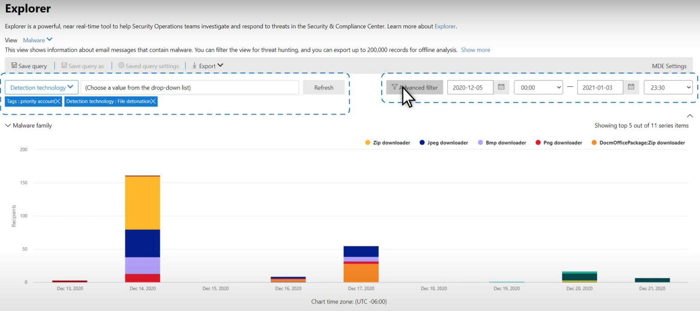
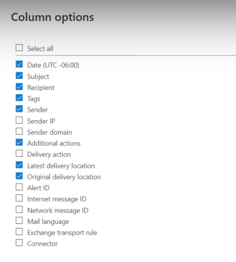

# Busca de ameaças no Explorador de Ameaças para o Microsoft Defender para Office 365

Neste artigo:

- [Passo a passo do Explorador de Ameaças](#threat-explorer-walk-through)
- [Investigação de email](#email-investigation)
- [Correção de email](#email-remediation)
- [Melhorias na experiência de busca de ameaças](#improvements-to-threat-hunting-experience)

> [!NOTE]
> Isso faz parte de uma série de 3 artigos no Explorador de Ameaças **(Explorer),** segurança de **email** e noções **básicas** de detecções do Explorer e em tempo real (como diferenças entre as ferramentas e permissões necessárias para operá-las).  Os outros dois artigos desta série são Segurança de email com [o Explorador](email-security-in-microsoft-defender.md) de Ameaças e o Explorador de Ameaças e noções [básicas de detecções em tempo real.](real-time-detections.md)

**Aplica-se a**
- [Plano 1 e plano 2 do Microsoft Defender para Office 365](defender-for-office-365.md)
- [Microsoft 365 Defender](../defender/microsoft-365-defender.md)

Se sua organização tiver [o Microsoft Defender](defender-for-office-365.md)para Office 365 , e você tiver as permissões , você poderá usar detecções do **Explorer** ou em tempo **real** para detectar e remediar ameaças.  

No Centro **de Conformidade & segurança,** vá para Gerenciamento de ameaças **e** escolha **Explorer** _ou_ Detecções em tempo **real.**

 

****

|Com o Microsoft Defender para Office 365 Plano 2, você verá:|Com o Microsoft Defender para Office 365 Plano 1, consulte:|
|---|---|
|||
|

Com essas ferramentas, você pode:

- Consulte malware detectado pelos recursos Microsoft 365 segurança
- Exibir URL de phishing e clicar em dados de veredito
- Iniciar um processo automatizado de investigação e resposta a partir de uma exibição no Explorer
- Investigar emails mal-intencionados e muito mais

Para obter mais informações, consulte [Segurança de email com o Explorador de Ameaças.](email-security-in-microsoft-defender.md) 

## Passo a passo do Explorador de Ameaças

No Microsoft Defender para Office 365, há dois planos de assinatura: Plano 1 e Plano 2. Ferramentas de busca de ameaças operadas manualmente existem em ambos os planos, em nomes diferentes e com diferentes recursos.

O Defender para Office 365 Plano 1 usa detecções em tempo *real*, que é um subconjunto da ferramenta de busca *do Explorador* de Ameaças (também chamada de *Explorer)* no Plano 2. Nesta série de artigos, a maioria dos exemplos foi criada usando o Explorador de Ameaças completo. Os administradores devem testar todas as etapas em detecções em tempo real para ver onde se aplicam.

Para abrir a ferramenta Explorer, acesse **Security & Compliance Center Threat**  >  **management**  >  **Explorer** (ou **Detecções em tempo real).** Por padrão, você chegará na página **Malware,** mas use a lista de opções Exibir para se familiarizar com suas opções.  Se você estiver procurando Phish, ou pesquisando uma campanha de ameaça, escolha esses pontos de exibição.

> [!div class="mx-imgBorder"]
> 

Uma vez que uma pessoa de operações de segurança (Operações de Sec) selecione os dados que deseja ver, se o escopo é uma exibição estreita, como **envios** do usuário, ou uma exibição mais ampla, como Todos os **emails,** pode usar o botão **Remetente** para filtrar ainda mais. Lembre-se de selecionar Atualizar para concluir suas ações de filtragem.

> [!div class="mx-imgBorder"]
> 

O foco de refinamento no Explorer ou na detecção em tempo real pode ser pensado em camadas. O primeiro é **Exibir**. O segundo pode ser pensado como um *foco filtrado.* Por exemplo, você pode refazer as etapas que você tomou para encontrar uma ameaça registrando suas decisões como esta: Para encontrar o problema no Explorer, eu escolhi **o Foco** de filtro De exibição de malware com um destinatário. Isso facilita a retração das etapas.

> [!TIP]
> Se o Sec Ops usar **Tags** para marcar contas que consideram destinos de alto valor, eles poderão fazer seleções como o Phish View com um foco de filtro tags (inclua um intervalo de datas, se *usado)*. Isso mostrará a eles quaisquer tentativas de phishing direcionadas aos seus destinos de usuário de alto valor durante um intervalo de tempo (como datas em que determinados ataques de phishing estão ocorrendo muito para o setor). 

Refinamentos podem ser feitos em intervalos de data usando os controles de intervalo de datas. Aqui você pode ver o explorer no **ponto de exibição Malware,** com um foco de filtro **tecnologia** de detecção. Mas é o botão **filtro** avançado que permite que as equipes de Operações Sec cavem profundamente. 

> [!div class="mx-imgBorder"]
> 

Clicar no **filtro Avançado** aparece em um painel que permitirá que os caçadores de Ops Sec criem consultas por conta própria, deixando-os incluir ou excluir as informações necessárias para ver. O gráfico e a tabela na página Explorer refletirão seus resultados. 

> [!div class="mx-imgBorder"]
> 

Use o **botão Opções de** coluna para obter o tipo de informação na tabela que seria mais útil: 

> [!div class="mx-imgBorder"]
> 

> [!div class="mx-imgBorder"]
> 

No mesmo mien, certifique-se de testar suas opções de exibição. Audiências diferentes reagirão bem a apresentações diferentes dos mesmos dados. Para alguns visualizadores, o **mapa Origens** do Email pode mostrar que uma ameaça é difundida ou discreta mais rapidamente do que a **opção de** exibição campanha ao lado dela. As Ops sec podem usar essas exibições para melhor fazer pontos que sublinham a necessidade de segurança e proteção, ou para comparação posterior, para demonstrar a eficácia de suas ações. 

> [!div class="mx-imgBorder"]
> 

> [!div class="mx-imgBorder"]
> 

### Investigação de email

Quando você vir um email suspeito, clique no nome para expandir o sobrevoo à direita. Aqui, o banner que permite que as Ops Sec vejam a página da entidade [de email](mdo-email-entity-page.md) está disponível.

A página da entidade de email reúne conteúdos que podem ser encontrados em **Detalhes,** **Anexos, Dispositivos,** mas inclui dados mais organizados. Isso inclui coisas como resultados DMARC, exibição simples de texto do header de email com uma opção de cópia, informações de veredito sobre anexos que foram detonados com segurança e arquivos que essas detonações foram descartados (pode incluir endereços IP que foram contatados e capturas de tela de páginas ou arquivos). URLs e seus vereditos também são listados com detalhes semelhantes relatados. 

Quando você chegar a esse estágio, a página da entidade de email será fundamental para a etapa final:*correção*. 

> [!div class="mx-imgBorder"]
> 

> [!TIP]
> Para saber mais sobre a página de  entidade rich email (vista abaixo na guia Análise), incluindo os resultados de Anexos detonados, descobertas para URLs incluídas e visualização de email seguro, clique [aqui](mdo-email-entity-page.md).

> [!div class="mx-imgBorder"]
> 

### Correção de email

Depois que uma pessoa de Operações da Sec determina que um email é uma ameaça, a próxima etapa de detecção do Explorer ou em tempo real está lidando com a ameaça e remediando-a. Isso pode ser feito retornando ao Explorador de Ameaças, selecionando a caixa de seleção para o email do problema e usando o **botão Ações.**

> [!div class="mx-imgBorder"]
> 

Aqui, o analista pode tomar ações como relatar o email como Spam, Phishing ou Malware, contatar destinatários ou outras investigações que podem incluir a acionamento de cartilhas de Investigação e Resposta Automatizada (ou AIR) (se você tiver o Plano 2). Ou, o email também pode ser relatado como limpo.

> [!div class="mx-imgBorder"]
> 

## Melhorias na experiência de busca de ameaças

### ID do alerta

Ao navegar de um alerta para o Explorador de Ameaças, o **View** será filtrado pela **ID do Alerta.** Isso também se aplica à detecção em tempo real. As mensagens relevantes para o alerta específico e um total de emails (uma contagem) são mostradas. Você poderá ver se uma mensagem fazia parte de um alerta, bem como navegar dessa mensagem para o alerta relacionado.

Por fim, a ID do alerta está incluída na URL, por exemplo: `https://protection.office.com/viewalerts?id=372c9b5b-a6c3-5847-fa00-08d8abb04ef1`

> [!div class="mx-imgBorder"]
> 

> [!div class="mx-imgBorder"]
> 

### Extensão do Explorer (e detecções em tempo real) e limite de pesquisa para locatários de avaliação 

Como parte dessa alteração, os analistas poderão pesquisar e filtrar dados de email por 30 dias (aumento de sete dias) no Explorador de Ameaças e detecções em tempo real para os locatários de avaliação do Defender para Office P1 e P2. Isso não afeta locatários de produção para clientes P1 e P2 E5, onde o padrão de retenção já é de 30 dias.

### Limite de exportação atualizado 

O número de registros de Emails que podem ser exportados do Explorador de Ameaças agora é 200.000 (era 9990). O conjunto de colunas que pode ser exportado não mudou. 

### Marcas no Explorador de Ameaças

> [!NOTE]
> O recurso de marcas de usuário está em Visualização e pode não estar disponível para todos. Além disso, as visualizações estão sujeitas a alterações. Para obter informações sobre o cronograma de lançamento, confira o Microsoft 365 de lançamento.

As marcas de usuário identificam grupos específicos de usuários no Microsoft Defender para Office 365. Para obter mais informações sobre marcas, incluindo licenciamento e configuração, consulte [Marcas de usuário](user-tags.md).

No Explorador de Ameaças, você pode ver informações sobre marcas de usuário nas experiências a seguir.

#### Exibição de grade de email

Quando os analistas olham para a coluna **Marcas** da grade de email, eles estão vendo todas as marcas que foram aplicadas a caixas de correio de remetente ou destinatário. Por padrão, as marcas do sistema, como *contas de prioridade,* são mostradas primeiro.

> [!div class="mx-imgBorder"]
> 

#### Filtragem

As marcas podem ser usadas como filtros. Hunt among priority accounts only, or use specific user tags scenarios this way. Você também pode excluir resultados que tenham determinadas marcas. Combine marcas com outros filtros e intervalos de datas para restringir seu escopo de investigação. 

> [!div class="mx-imgBorder"]
> 

#### Sobremenu de detalhes de email

Para exibir as marcas individuais de remetente e destinatário, selecione um email para abrir o sobremenu de detalhes da mensagem. Na guia **Resumo,** as marcas remetente e destinatário são mostradas separadamente. As informações sobre marcas individuais para remetente e destinatário podem ser exportadas como dados CSV. 

> [!div class="mx-imgBorder"]
> 

As informações de marcas também são mostradas no flyout de cliques da URL. Para vê-lo, vá para Phish or All Email view > **URLs** ou **URL Clicks** tab. Selecione um flyout de URL individual para ver detalhes adicionais sobre cliques para essa URL, incluindo todas as Marcas associadas a esse clique.

### Exibição de linha do tempo atualizada

> [!div class="mx-imgBorder"]
> 
>
Saiba mais assistindo a [este vídeo](https://www.youtube.com/watch?v=UoVzN0lYbfY&list=PL3ZTgFEc7LystRja2GnDeUFqk44k7-KXf&index=4).

## Recursos estendidos

### Principais usuários direcionados

As Principais Famílias de Malware mostram os principais usuários **direcionados** na seção Malware. Os principais usuários direcionados também serão estendidos por meio de exibições phishing e Todos os emails. Os analistas poderão ver os cinco principais usuários direcionados, juntamente com o número de tentativas para cada usuário em cada exibição. 

As pessoas de operações de segurança podem exportar a lista de usuários direcionados, até um limite de 3.000, juntamente com o número de tentativas feitas, para análise offline para cada modo de exibição de email. Além disso, selecionar o número de tentativas (por exemplo, 13 tentativas na imagem abaixo) abrirá um modo de exibição filtrado no Explorador de Ameaças, para que você possa ver mais detalhes em emails e ameaças para esse usuário.  

> [!div class="mx-imgBorder"]
> 

### Exchange de transporte

A equipe de operações de segurança poderá ver todas as regras de Exchange de transporte (ou regras de fluxo de email) aplicadas a uma mensagem, na exibição grade Email. Selecione **Opções de** coluna na grade e, em seguida, adicione Exchange Regra de **Transporte** nas opções de coluna. A Exchange de regras de transporte também está visível no **sobremenu de detalhes** no email. 

Os nomes e GUIDs das regras de transporte aplicadas à mensagem são exibidos. Os analistas poderão pesquisar mensagens usando o nome da regra de transporte. Esta é uma pesquisa CONTAINS, o que significa que você também pode fazer pesquisas parciais. 

> [!IMPORTANT]
> Exchange de pesquisa de regra de transporte e disponibilidade de nome dependem da função específica atribuída a você. Você precisa ter uma das seguintes funções ou permissões para exibir os nomes das regras de transporte e a pesquisa. No entanto, mesmo sem as funções ou permissões abaixo, um analista pode ver o rótulo de regra de transporte e informações guid nos Detalhes do Email. Outras experiências de visualização de registro em Grades de Email, Sub-sub-sublhsados de email, Filtros e Exportação não são afetadas.
>
> - Exchange Online Somente - Prevenção contra Perda de Dados: Todos
> - Exchange Online Somente - O365SupportViewConfig: All
> - Microsoft Azure Active Directory ou Exchange Online - Administrador de Segurança: Todos
> - Azure Active Directory ou Exchange Online - Leitor de Segurança: Tudo
> - Exchange Online Somente - Regras de Transporte: Todos
> - Exchange Online Somente - View-Only Configuração: Tudo
>
> Na grade de email, sobremenos e CSV exportados, os ETRs são apresentados com um Nome/GUID, conforme mostrado abaixo.
>
> > [!div class="mx-imgBorder"]
> > 

### Conectores de entrada

Conectores são uma coleção de instruções que personalizam como seu email flui de e para sua Microsoft 365 ou Office 365 organização. Eles permitem que você aplique quaisquer restrições ou controles de segurança. No Explorador de Ameaças, você pode exibir os conectores relacionados a um email e pesquisar emails usando nomes de conectores. 

A pesquisa por conectores é uma consulta CONTAINS, o que significa que pesquisas parciais de palavra-chave podem funcionar: 

> [!div class="mx-imgBorder"]
> 

## Licenças e permissões necessárias

Você deve ter [o Microsoft Defender para Office 365](defender-for-office-365.md) usar detecções do Explorer ou em tempo real.

- O Explorer está incluído no Defender para Office 365 Plano 2.
- O relatório de detecções em tempo real está incluído no Defender para Office 365 Plano 1.
- Planeje atribuir licenças para todos os usuários que devem ser protegidos pelo Defender para Office 365. As detecções do Explorer e em tempo real mostram dados de detecção para usuários licenciados.

Para exibir e usar detecções do Explorer ou em tempo real, você deve ter o seguinte:

- Para o Centro de Conformidade & segurança:

  - Gerenciamento de Organização
  - Administrador de Segurança (isso pode ser atribuído no Azure Active Directory de administração ( <https://aad.portal.azure.com> )
  - Leitor de segurança

- Para Exchange Online:

  - Gerenciamento de Organização
  - Gerenciamento de Organização Somente Exibição
  - Destinatários Somente para Exibição
  - Gerenciamento de Conformidade

Para saber mais sobre funções e permissões, consulte os seguintes recursos:

- [Permissões no Centro de Segurança e Conformidade](permissions-in-the-security-and-compliance-center.md)
- [Permissões de recursos no Exchange Online](/exchange/permissions-exo/feature-permissions)
- [PowerShell do Exchange Online](/powershell/exchange/exchange-online-powershell)

## Mais informações

- [Localizar e investigar emails mal-intencionados entregues](investigate-malicious-email-that-was-delivered.md) 
- [Exibir arquivos mal-intencionados detectados no SharePoint Online, OneDrive e Microsoft Teams](mdo-for-spo-odb-and-teams.md) 
- [Obter uma visão geral dos exibições no Explorador de Ameaças (e detecções em tempo real)](threat-explorer-views.md) 
- [Relatório de status de proteção contra ameaças](view-email-security-reports.md#threat-protection-status-report) 
- [Investigação e resposta automatizadas na Proteção contra Ameaças da Microsoft](automated-investigation-response-office.md) 
- [Investigar emails com a página Entidade de Email](mdo-email-entity-page.md)