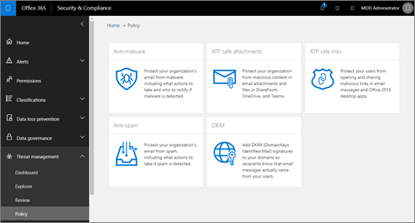
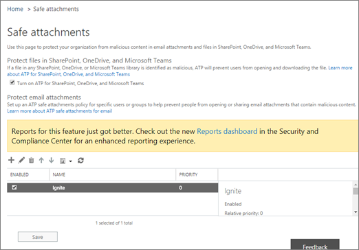

# Ative a ATP para SharePoint, OneDrive e Microsoft TeamsTurn on ATP for SharePoint, OneDrive, and Microsoft Teams

> [!IMPORTANT]
> Este artigo destina-se aos clientes corporativos que têm a [Proteção Avançada contra Ameaças do Office 365](office-365-atp.md).This article is intended for business customers who have [Office 365 Advanced Threat Protection](office-365-atp.md). Se você for um usuário doméstico que procura informações sobre links seguros no Outlook, consulte [Advanced Outlook.com Security](https://support.office.com/article/882d2243-eab9-4545-a58a-b36fee4a46e2).If you are a home user looking for information about Safe Links in Outlook, see [Advanced Outlook.com security](https://support.office.com/article/882d2243-eab9-4545-a58a-b36fee4a46e2).

O [Office 365 ATP para SharePoint, onedrive e Microsoft Teams](atp-for-spo-odb-and-teams.md) protege sua organização contra o compartilhamento inadvertidamente de arquivos mal-intencionados.[Office 365 ATP for SharePoint, OneDrive, and Microsoft Teams](atp-for-spo-odb-and-teams.md) protects your organization from inadvertently sharing malicious files. Quando um arquivo mal-intencionado é detectado, esse arquivo é bloqueado para que ninguém possa abri-lo, copiá-lo ou compartilhá-lo até que outras ações sejam executadas pela equipe de segurança da organização.When a malicious file is detected, that file is blocked so that no one can open, copy, move, or share it until further actions are taken by the organization's security team. Leia este artigo para habilitar a ATP para o SharePoint, o OneDrive e o Microsoft Teams, configure os alertas a serem notificados sobre os arquivos detectados e execute suas próximas etapas.Read this article to turn on ATP for SharePoint, OneDrive, and Teams, set up alerts to be notified about detected files, and take your next steps.

Para definir (ou editar) políticas ATP, você deve ter uma função apropriada atribuída.To define (or edit) ATP policies, you must be assigned an appropriate role. Alguns exemplos são descritos na tabela a seguir:Some examples are described in the following table:

|RoleRole|Onde/como a atribuiçãoWhere/how assigned|
|---------|---------|
|administrador globalglobal administrator|Por padrão, a pessoa que se inscreve para comprar a Microsoft 365 é um administrador global.The person who signs up to buy Microsoft 365 is a global admin by default. (Consulte [about Microsoft 365 admin Roles](https://docs.microsoft.com/office365/admin/add-users/about-admin-roles) para saber mais.)(See [About Microsoft 365 admin roles](https://docs.microsoft.com/office365/admin/add-users/about-admin-roles) to learn more.)|
|Administrador de SegurançaSecurity Administrator|Centro de administração do Azure Active Directory ( [https://aad.portal.azure.com](https://aad.portal.azure.com) )Azure Active Directory admin center ([https://aad.portal.azure.com](https://aad.portal.azure.com))|
|Gerenciamento de Organização do Exchange OnlineExchange Online Organization Management|Centro de administração do Exchange ( [https://outlook.office365.com/ecp](https://outlook.office365.com/ecp) )Exchange admin center ([https://outlook.office365.com/ecp](https://outlook.office365.com/ecp))  ouor    Cmdlets do PowerShell (consulte [Exchange Online PowerShell](https://docs.microsoft.com/powershell/exchange/exchange-online/exchange-online-powershell))PowerShell cmdlets (See [Exchange Online PowerShell](https://docs.microsoft.com/powershell/exchange/exchange-online/exchange-online-powershell))|

## Ative a ATP para SharePoint, OneDrive e Microsoft TeamsTurn on ATP for SharePoint, OneDrive, and Microsoft Teams

**Antes de iniciar esse procedimento, certifique-se de que o log de auditoria já esteja ativado para seu ambiente do Microsoft 365**.**Before you begin this procedure, make sure that audit logging is already turned on for your Microsoft 365 environment**. Isso geralmente é feito por alguém que tenha a função de logs de auditoria atribuída no Exchange Online.This is typically done by someone who has the Audit Logs role assigned in Exchange Online. Para saber mais, confira [Ativar ou desativar a pesquisa de log de auditoria](../../compliance/turn-audit-log-search-on-or-off.md).For more information, see [Turn audit log search on or off](../../compliance/turn-audit-log-search-on-or-off.md).

1. Vá até [https://protection.office.com](https://protection.office.com) e entre com sua conta corporativa ou de estudante.Go to [https://protection.office.com](https://protection.office.com), and sign in with your work or school account.

2. No centro de conformidade & segurança, no painel de navegação esquerdo, em **Gerenciamento de ameaças**, **Policy** escolha \> **anexos seguros**da política.In the Security & Compliance Center, in the left navigation pane, under **Threat management**, choose **Policy** \> **Safe Attachments**.

   

3. Selecione **Ativar ATP para SharePoint, onedrive e Microsoft Teams**.Select **Turn on ATP for SharePoint, OneDrive, and Microsoft Teams**.

   

4. Clique em **Salvar**.Click **Save**.

5. Revise (e, conforme apropriado, edite) as [políticas de anexos seguros](set-up-atp-safe-attachments-policies.md) da sua organização e [as políticas de links seguros](set-up-atp-safe-links-policies.md).Review (and, as appropriate, edit) your organization's [Safe Attachments policies](set-up-atp-safe-attachments-policies.md) and [Safe Links policies](set-up-atp-safe-links-policies.md).

6. Recomenda Como administrador global ou administrador do SharePoint Online, execute o cmdlet **[set-SPOTenant](https://docs.microsoft.com/powershell/module/sharepoint-online/Set-SPOTenant)** com o parâmetro _DisallowInfectedFileDownload_ definido como *true*.(Recommended) As a global administrator or a SharePoint Online administrator, run the **[Set-SPOTenant](https://docs.microsoft.com/powershell/module/sharepoint-online/Set-SPOTenant)** cmdlet with the _DisallowInfectedFileDownload_ parameter set to *true*.

   - Definir o parâmetro como *true* bloqueia todas as ações (exceto excluir) para arquivos detectados.Setting the parameter to *true* blocks all actions (except Delete) for detected files. As pessoas não podem abrir, mover, copiar ou compartilhar arquivos detectados.People cannot open, move, copy, or share detected files.

   - A definição do parâmetro como *false* bloqueia todas as ações, exceto excluir e baixar.Setting the parameter to *false* blocks all actions except Delete and Download. As pessoas podem optar por aceitar o risco e baixar um arquivo detectado.People can choose to accept the risk and download a detected file.

7. Aguarde até 30 minutos para que as alterações se espalhem para todos os datacenters da Microsoft 365.Allow up to 30 minutes for your changes to spread to all Microsoft 365 datacenters.

8. Recomenda Vá para configurar alertas para arquivos detectados.(Recommended) Proceed to set up alerts for detected files.

Para saber mais sobre como usar o PowerShell com o Microsoft 365, confira [gerenciar o microsoft 365 com o PowerShell](https://docs.microsoft.com/office365/enterprise/powershell/manage-office-365-with-office-365-powershell).To learn more about using PowerShell with Microsoft 365, see [Manage Microsoft 365 with PowerShell](https://docs.microsoft.com/office365/enterprise/powershell/manage-office-365-with-office-365-powershell).

Para saber mais sobre a experiência do usuário quando um arquivo foi detectado como mal-intencionado, confira [o que fazer quando um arquivo mal-intencionado é encontrado no SharePoint Online, no onedrive ou no Microsoft Teams](https://support.microsoft.com/en-us/office/what-to-do-when-a-malicious-file-is-found-in-sharepoint-online-onedrive-or-microsoft-teams-01e902ad-a903-4e0f-b093-1e1ac0c37ad2).To learn more about the user experience when a file has been detected as malicious, see [What to do when a malicious file is found in SharePoint Online, OneDrive, or Microsoft Teams](https://support.microsoft.com/en-us/office/what-to-do-when-a-malicious-file-is-found-in-sharepoint-online-onedrive-or-microsoft-teams-01e902ad-a903-4e0f-b093-1e1ac0c37ad2).

## Configurar alertas para arquivos detectadosSet up alerts for detected files

Para receber notificações quando um arquivo no SharePoint Online, no OneDrive for Business ou no Microsoft Teams foi identificado como mal-intencionado, você pode configurar um alerta.To receive notification when a file in SharePoint Online, OneDrive for Business, or Microsoft Teams has been identified as malicious, you can set up an alert.

1. No [centro de conformidade & segurança](https://protection.office.com), escolha **alertas** \> **Gerenciar alertas**.In the [Security & Compliance Center](https://protection.office.com), choose **Alerts** \> **Manage alerts**.

2. Escolha **nova política de alerta**.Choose **New alert policy**.

3. Especifique um nome para o alerta.Specify a name for the alert. Por exemplo, você pode digitar arquivos mal-intencionados em bibliotecas.For example, you could type Malicious Files in Libraries.

4. Digite uma descrição para o alerta.Type a description for the alert. Por exemplo, você pode digitar notifica os administradores quando arquivos mal-intencionados são detectados no SharePoint Online, no OneDrive ou no Microsoft Teams.For example, you could type Notifies admins when malicious files are detected in SharePoint Online, OneDrive, or Microsoft Teams.

5. Na seção **Enviar este alerta quando...** , faça o seguinte:In the **Send this alert when...** section, do the following:

   a.a. Na lista **atividades** , escolha **malware detectado em arquivo**.In the **Activities** list, choose **Detected malware in file**.

   b.b. Deixe o campo **usuários** vazio.Leave the **Users** field empty.

6. Na seção **Enviar este alerta para...** , selecione um ou mais administradores globais, administradores de segurança ou leitores de segurança que devem receber notificações quando um arquivo mal-intencionado for detectado.In the **Send this alert to...** section, select one or more global administrators, security administrators, or security readers who should receive notification when a malicious file is detected.

7. Clique em **Salvar**.Click **Save**.

Para saber mais sobre alertas, confira [criar alertas de atividade no centro de conformidade de & de segurança](../../compliance/create-activity-alerts.md).To learn more about alerts, see [Create activity alerts in the Security & Compliance Center](../../compliance/create-activity-alerts.md).

## Próximas etapasNext steps

1. [Exibir informações sobre arquivos mal-intencionados detectados no SharePoint, no OneDrive ou no Microsoft TeamsView information about malicious files detected in SharePoint, OneDrive, or Microsoft Teams](malicious-files-detected-in-spo-odb-or-teams.md)

2. [Gerenciar arquivos e mensagens em quarentena como um administrador no Microsoft 365Manage quarantined messages and files as an administrator in Microsoft 365](manage-quarantined-messages-and-files.md)
