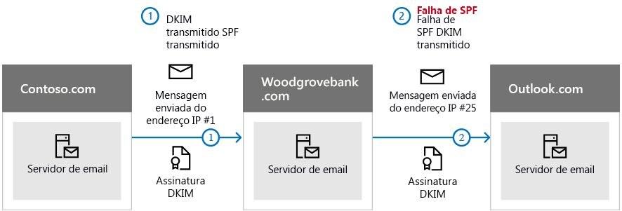

# <a name="use-dkim-to-validate-outbound-email-sent-from-your-custom-domain"></a>Usar o DKIM para validar emails enviados de seu domínio personalizado

[!INCLUDE [Microsoft 365 Defender rebranding](../includes/microsoft-defender-for-office.md)]

**Aplica-se a**
- [Proteção do Exchange Online](exchange-online-protection-overview.md)
- [Plano 1 e plano 2 do Microsoft Defender para Office 365](defender-for-office-365.md)
- [Microsoft 365 Defender](../defender/microsoft-365-defender.md)

 Este artigo lista as etapas de uso do DKIM (DomainKeys Identified Mail) com o Microsoft 365 para garantir que os sistemas de email de destino confiem em mensagens enviadas de seu domínio personalizado.

Neste artigo:

- [Como o DKIM funciona melhor do que o SPF para evitar a falsificação maliciosa](use-dkim-to-validate-outbound-email.md#HowDKIMWorks)

- [Etapas para atualizar manualmente suas chaves de 1024 bits para chaves de criptografia DKIM de 2048 bits](use-dkim-to-validate-outbound-email.md#1024to2048DKIM)

- [Etapas para configurar o DKIM manualmente](use-dkim-to-validate-outbound-email.md#SetUpDKIMO365)

- [Etapas para configurar o DKIM para mais de um domínio personalizado](use-dkim-to-validate-outbound-email.md#DKIMMultiDomain)

- [Desabilitar a política de assinatura do DKIM para um domínio personalizado](use-dkim-to-validate-outbound-email.md#DisableDKIMSigningPolicy)

- [Comportamento padrão para o DKIM e o Microsoft 365](use-dkim-to-validate-outbound-email.md#DefaultDKIMbehavior)

- [Configurar o DKIM de forma que um serviço terceirizado possa enviar, ou fazer spoof de, emails em nome de seu domínio personalizado](use-dkim-to-validate-outbound-email.md#SetUp3rdPartyspoof)

- [Próximas etapas: após configurar o DKIM para o Microsoft 365](use-dkim-to-validate-outbound-email.md#DKIMNextSteps)

> [!NOTE]
> O Microsoft 365 configura automaticamente o DKIM para domínios iniciais de “onmicrosoft.com”. Isso significa que não é preciso fazer nada para configurar o DKIM para qualquer nome de domínio inicial (por exemplo, litware.onmicrosoft.com). Para saber mais sobre domínios, confira [Perguntas frequentes sobre domínios](../../admin/setup/domains-faq.yml#why-do-i-have-an--onmicrosoft-com--domain).

DKIM é um dos três métodos de autenticação (SPF, DKIM e DMARC) que ajudam a evitar que os invasores enviem mensagens que parecem vir de seu domínio.

O DKIM permite adicionar a mensagens de email enviadas uma assinatura digital no cabeçalho da mensagem. Ao configurar o DKIM, você autoriza o domínio a associar, ou assinar, o nome dele a uma mensagem de email usando a autenticação de criptografia. Os sistemas de email que receberem emails do seu domínio podem usar a assinatura digital para ajudar a verificar se os emails de entrada são legítimos.

No básico, uma chave privada criptografa o cabeçalho no email de saída de um domínio. A chave pública é publicada nos registros DNS do domínio, e os servidores de recebimento podem usar essa chave para decodificar a assinatura. A verificação DKIM ajuda os servidores de recebimento a confirmar se o correio está realmente vindo de seu domínio e não de alguém *falsificando* o domínio.

> [!TIP]
>Você também pode optar por não fazer nada sobre o DKIM em relação ao seu domínio personalizado. Se você não configurar o DKIM para o seu domínio personalizado, o Microsoft 365 criará um par de chaves privada e pública, habilitará a assinatura do DKIM e configurará a política padrão do Microsoft 365 para o seu domínio personalizado.

 A configuração DKIM interna do Microsoft 365 é abrangente o suficiente para a maioria dos clientes. No entanto, configure manualmente o DKIM para seu domínio personalizado nas seguintes circunstâncias:

- Você tem mais de um domínio personalizado no Microsoft 365

- Você também vai configurar o DMARC (**recomendado**)

- Quiser ter controle sobre sua chave privada

- Quiser personalizar seus registros CNAME

- Configure as chaves do DKIM para emails provenientes de um domínio de terceiros, por exemplo, se você usar um programa de email em massa terceirizado.


## <a name="how-dkim-works-better-than-spf-alone-to-prevent-malicious-spoofing"></a>Como o DKIM funciona melhor do que o SPF para evitar a falsificação maliciosa
<a name="HowDKIMWorks"> </a>

O SPF adiciona informações a um envelope de mensagem, mas o DKIM *criptografa* uma assinatura no cabeçalho da mensagem. Ao encaminhar uma mensagem, partes de seu envelope podem ser removidas pelo servidor de encaminhamento. Como a assinatura digital permanece com a mensagem de email porque faz parte do cabeçalho do email, o DKIM funciona mesmo quando uma mensagem é encaminhada conforme mostrado no exemplo a seguir.



Neste exemplo, se você tivesse apenas publicado um registro TXT SPF do seu domínio, o servidor de email do destinatário poderia ter marcado seu email como spam e gerado um resultado de falso positivo. **A adição do DKIM nesse cenário reduz relatórios de spam com *falso positivo*.** Como o DKIM depende de criptografia de chave pública para autenticar, e não apenas de endereços IP, ele é considerado uma forma muito mais forte de autenticação que o SPF. Recomendamos usar o SPF e o DKIM, bem como o DMARC, em sua implantação.

> [!TIP]
> O DKIM usa uma chave privada para inserir uma assinatura criptografada nos cabeçalhos de mensagens. A domínio que assina, ou domínio de saída, é inserido como o valor do campo **d=** no cabeçalho. O domínio que verifica, ou o domínio do destinatário, usa esse campo **d=** para procurar a chave pública no DNS e autenticar a mensagem. Se a mensagem for verificada, a verificação do DKIM passará.


## <a name="steps-to-manually-upgrade-your-1024-bit-keys-to-2048-bit-dkim-encryption-keys"></a>Etapas para atualizar manualmente suas chaves de 1024 bits para chaves de criptografia DKIM de 2048 bits
<a name="1024to2048DKIM"> </a>

> [!NOTE]
> O Microsoft 365 configura automaticamente o DKIM para domínios *onmicrosoft.com*. Nenhuma etapa é necessária para usar o DKIM para qualquer nome de domínio inicial (como litware. *onmicrosoft.com*). Para saber mais sobre domínios, confira [Perguntas frequentes sobre domínios](../../admin/setup/domains-faq.yml#why-do-i-have-an--onmicrosoft-com--domain).

Já que tanto o número de bits 1024 e o 2048 têm suporte para chaves DKIM, estas instruções mostrarão como atualizar sua chave de 1024 para 2048 bits em [Exchange Online PowerShell](/powershell/exchange/connect-to-exchange-online-powershell). As etapas abaixo são para dois casos de uso, favor escolher o que melhor se encaixa em sua configuração.

- Se você **já tiver configurado o DKIM**, altere a configuração de bits executando o seguinte comando:

  ```powershell
  Rotate-DkimSigningConfig -KeySize 2048 -Identity {Guid of the existing Signing Config}
  ```

  **ou**

- Para uma **nova implementação de DKIM**, execute o seguinte comando:

  ```powershell
  New-DkimSigningConfig -DomainName <Domain for which config is to be created> -KeySize 2048 -Enabled $true
  ```

Mantenha-se conectado ao Exchange Online PowerShell para *verificar* a configuração executando o seguinte comando:

```powershell
Get-DkimSigningConfig -Identity <Domain for which the configuration was set> | Format-List
```

> [!TIP]
> Essa nova chave de 2048 bits entra em vigor no RotateOnDate e enviará emails com a chave 1024 bits provisoriamente. Após quatro dias, você poderá testar novamente com a chave de 2048 bits (ou seja, quando a rotação entrar em vigor no segundo seletor).

Se deseja alternar para o segundo seletor, as opções são: a) permitir que o serviço do Microsoft 365 alterne o seletor e atualize para o número 2048 de bits nos próximos 6 meses, ou b) após 4 dias confirmado que número 2048 de bits está em uso, alterne manualmente a segunda chave de seletor usando o cmdlet apropriado listado acima.

Para informações detalhadas de sintaxe e parâmetro, confira os seguintes artigos: [Rotate-DkimSigningConfig](/powershell/module/exchange/rotate-dkimsigningconfig), [New-DkimSigningConfig](/powershell/module/exchange/new-dkimsigningconfig), e [Get-DkimSigningConfig](/powershell/module/exchange/get-dkimsigningconfig).

## <a name="steps-to-manually-set-up-dkim"></a>Etapas para configurar o DKIM manualmente
<a name="SetUpDKIMO365"> </a>

Para configurar o DKIM, execute estas etapas:

- [Publicar dois registros CNAME para o seu domínio personalizado no DNS](use-dkim-to-validate-outbound-email.md#Publish2CNAME)

- [Habilitar a assinatura DKIM para o seu domínio personalizado](use-dkim-to-validate-outbound-email.md#EnableDKIMinO365)

### <a name="publish-two-cname-records-for-your-custom-domain-in-dns"></a>Publicar dois registros CNAME para o seu domínio personalizado no DNS
<a name="Publish2CNAME"> </a>

Para cada domínio para o qual você deseja adicionar uma assinatura de DKIM no DNS, é preciso publicar dois registros CNAME.

> [!NOTE]
> Se você não leu o artigo completo, pode ter perdido esta informação de conexão do PowerShell que economiza tempo: [Conectar-se ao Exchange Online PowerShell](/powershell/exchange/connect-to-exchange-online-powershell).

Execute os seguintes comandos no Exchange Online PowerShell para criar os registros do seletor:

```powershell
New-DkimSigningConfig -DomainName <domain> -Enabled $false
Get-DkimSigningConfig -Identity <domain> | Format-List Selector1CNAME, Selector2CNAME
```

Se você não provisionou domínios personalizados além do domínio inicial no Microsoft 365, publique dois registros CNAME para cada domínio adicional. Portanto, se você tiver dois domínios, publique dois registros CNAME adicionais, e assim por diante.

Use o seguinte formato para os registros CNAME.

> [!IMPORTANT]
> Se você for um dos nossos clientes GCC High, nós calculamos o _domainGuid_ de maneira diferente! Em vez de procurar o registro MX do seu _initialDomain_ para calcular o _domainGuid_, ele é calculado diretamente a partir do domínio personalizado. Por exemplo, se seu domínio personalizado for "contoso.com", o domainGuid vai se tornar "contoso-com", os pontos serão substituídos por um traço. Portanto, independentemente de qual registro MX seu initialDomain apontar, você sempre usará o método acima para calcular o domainGuid para usar em seus registros CNAME.

```console
Host name:            selector1._domainkey
Points to address or value:    selector1-<domainGUID>._domainkey.<initialDomain>
TTL:                3600

Host name:            selector2._domainkey
Points to address or value:    selector2-<domainGUID>._domainkey.<initialDomain>
TTL:                3600
```

Onde:

- Para o Microsoft 365, os seletores sempre serão "seletor1" ou "seletor2".

- O _domainGUID_ é igual ao _domainGUID_ no registro MX personalizado para o seu domínio personalizado, que aparece antes de mail.protection.outlook.com. Por exemplo, no seguinte registro MX para o domínio contoso.com, o _domainGUID_ é contoso-com:

  > contoso.com.  3600  IN  MX   5 contoso-com.mail.protection.outlook.com

- O _initialDomain_ foi o domínio usado quando se inscreveu no Microsoft 365. Os domínios iniciais sempre terminam em onmicrosoft.com. Para saber mais sobre como determinar seu domínio inicial, confira [Perguntas frequentes sobre domínios](../../admin/setup/domains-faq.yml#why-do-i-have-an--onmicrosoft-com--domain).

Por exemplo, se você tiver o domínio inicial cohovineyardandwinery.onmicrosoft.com e dois domínios personalizados, cohovineyard.com e cohowinery.com, precisará configurar dois registros CNAME para cada domínio adicional, totalizando quatro registros CNAME.

```console
Host name:            selector1._domainkey
Points to address or value:    selector1-cohovineyard-com._domainkey.cohovineyardandwinery.onmicrosoft.com
TTL:                3600

Host name:            selector2._domainkey
Points to address or value:    selector2-cohovineyard-com._domainkey.cohovineyardandwinery.onmicrosoft.com
TTL:                3600

Host name:            selector1._domainkey
Points to address or value:    selector1-cohowinery-com._domainkey.cohovineyardandwinery.onmicrosoft.com
TTL:                3600

Host name:            selector2._domainkey
Points to address or value:    selector2-cohowinery-com._domainkey.cohovineyardandwinery.onmicrosoft.com
TTL:                3600
```

> [!NOTE]
> É importante criar o segundo registro, mas apenas um dos seletores pode estar disponível no momento da criação. Em essência, o segundo seletor pode apontar para um endereço que ainda não foi criado. Ainda recomendamos que você crie o segundo registro CNAME, pois a rotação de chaves será contínua.


### <a name="steps-to-enable-dkim-signing-for-your-custom-domain"></a>Etapas para habilitar a assinatura DKIM do seu domínio personalizado
<a name="EnableDKIMinO365"> </a>

Depois de publicar os registros CNAME no DNS, você estará pronto para habilitar a assinatura DKIM pelo Microsoft 365. Para tanto, use o Centro de administração do Microsoft 365 ou o PowerShell.

#### <a name="to-enable-dkim-signing-for-your-custom-domain-through-the-admin-center"></a>Para habilitar a assinatura DKIM para o seu domínio personalizado por meio do centro de administração

1. [Entre no Microsoft 365](https://support.microsoft.com/office/e9eb7d51-5430-4929-91ab-6157c5a050b4) com a sua conta corporativa ou de estudante.

2. Vá para [protection.office.com](https://protection.office.com) ou [security.microsoft.com](https://security.microsoft.com) dependendo de qual portal você usa, e siga o caminho abaixo.

|protection.office.com  |security.microsoft.com  |
|---------|---------|
| Gerenciamento de ameaças > Política > Políticas adicionais > DKIM     | Email e colaboração > Políticas e regras > Políticas de ameaças > Políticas adicionais > DKIM        | 

3. Selecione o domínio para o qual você deseja habilitar o DKIM e, para **Assinar mensagens deste domínio com assinaturas DKIM**, escolha **Habilitar**. Repita essa etapa para cada domínio personalizado.

#### <a name="to-enable-dkim-signing-for-your-custom-domain-by-using-powershell"></a>Para habilitar a assinatura DKIM para o seu domínio personalizado usando o PowerShell

> [!IMPORTANT]
>:::image type="content" source="../../media/DKIMNoKeysSavedForThisDomain.PNG" alt-text="O erro &quot;Nenhuma tecla DKIM salva para este domínio&quot;.":::
> Se você estiver configurando o DKIM pela primeira vez e vir o erro "Nenhuma tecla DKIM salva para este domínio". Conclua o comando na etapa 2 abaixo (por exemplo, *Set-DkimSigningConfig -Identity contoso.com -Enabled $true*) para ver a chave.

1. [Conectar-se ao Exchange Online PowerShell](/powershell/exchange/connect-to-exchange-online-powershell).

2. Execute o seguinte comando:

   ```powershell
   Set-DkimSigningConfig -Identity <domain> -Enabled $true
   ```

   Em que _domínio_ é o nome do domínio personalizado para o qual você deseja habilitar a assinatura DKIM.

   Por exemplo, para o domínio contoso.com:

   ```powershell
   Set-DkimSigningConfig -Identity contoso.com -Enabled $true
   ```

#### <a name="to-confirm-dkim-signing-is-configured-properly-for-microsoft-365"></a>Para confirmar que a assinatura de DKIM está configurada adequadamente no Microsoft 365

Aguarde alguns minutos antes de prosseguir com essas etapas para confirmar que você configurou o DKIM corretamente. Isso permite que as informações do DKIM sobre o domínio sejam distribuídas por toda a rede.

- Envie uma mensagem de uma conta do seu domínio do Microsoft 365 habilitado com DKIM para outra conta de email, como outlook.com ou Hotmail.com.

- Não use uma conta aol.com para fins de teste. A AOL pode ignorar a verificação de DKIM se a verificação de SPF passar. Isso anula o teste.

- Abra a mensagem e veja o cabeçalho. As instruções para exibir o cabeçalho da mensagem variam dependendo do seu cliente de mensagens. Para obter instruções sobre como exibir cabeçalhos de mensagens no Outlook, consulte [Exibir cabeçalhos de mensagens da Internet no Outlook](https://support.microsoft.com/office/cd039382-dc6e-4264-ac74-c048563d212c).

  A mensagem assinada com DKIM conterá o nome do host e o domínio definidos quando você publicou as entradas CNAME. A mensagem terá uma aparência similar à do exemplo:

  ```console
    From: Example User <example@contoso.com>
    DKIM-Signature: v=1; a=rsa-sha256; q=dns/txt; c=relaxed/relaxed;
        s=selector1; d=contoso.com; t=1429912795;
        h=From:To:Message-ID:Subject:MIME-Version:Content-Type;
        bh=<body hash>;
        b=<signed field>;
  ```

- Procure pelo cabeçalho Authentication-Results. Embora cada serviço receptor use um formato ligeiramente diferente para carimbar as mensagens recebidas, o resultado deve incluir algo parecido com **DKIM=pass** ou **DKIM=OK**.

## <a name="to-configure-dkim-for-more-than-one-custom-domain"></a>Para configurar o DKIM em mais de um domínio personalizado
<a name="DKIMMultiDomain"> </a>

Se em algum momento no futuro você decidir adicionar outro domínio personalizado e quiser habilitar o DKIM para o novo domínio, deve executar as etapas deste artigo para cada domínio. Especificamente, execute todas as etapas em [O que é necessário fazer para configurar manualmente o DKIM](use-dkim-to-validate-outbound-email.md#SetUpDKIMO365).

## <a name="disabling-the-dkim-signing-policy-for-a-custom-domain"></a>Desabilitar a política de assinatura do DKIM para um domínio personalizado
<a name="DisableDKIMSigningPolicy"> </a>

Desabilitar a política de assinatura não desabilita completamente o DKIM. Após um período de tempo, o Microsoft 365 aplicará automaticamente a política padrão ao seu domínio. Para saber mais, confira [Comportamento padrão do DKIM e do Microsoft 365](use-dkim-to-validate-outbound-email.md#DefaultDKIMbehavior).

### <a name="to-disable-the-dkim-signing-policy-by-using-windows-powershell"></a>Para desabilitar a política de assinatura do DKIM usando o Windows PowerShell

1. [Conectar-se ao Exchange Online PowerShell](/powershell/exchange/connect-to-exchange-online-powershell).

2. Execute um dos seguintes comandos para cada domínio para o qual você deseja desabilitar a assinatura de DKIM.

   ```powershell
   $p = Get-DkimSigningConfig -Identity <domain>
   $p[0] | Set-DkimSigningConfig -Enabled $false
   ```

   Por exemplo:

   ```powershell
   $p = Get-DkimSigningConfig -Identity contoso.com
   $p[0] | Set-DkimSigningConfig -Enabled $false
   ```

   Ou

   ```powershell
   Set-DkimSigningConfig -Identity $p[<number>].Identity -Enabled $false
   ```

   Em que _number_ é o índice da política. Por exemplo:

   ```powershell
   Set-DkimSigningConfig -Identity $p[0].Identity -Enabled $false
   ```

## <a name="default-behavior-for-dkim-and-microsoft-365"></a>Comportamento padrão do DKIM e do Microsoft 365
<a name="DefaultDKIMbehavior"> </a>

Se você não habilitar o DKIM, o Microsoft 365 cria automaticamente uma chave pública de DKIM de 1024 bits para seu domínio e a chave privada associada que é armazenada internamente em nosso datacenter. Por padrão, o Microsoft 365 usa uma configuração de assinatura padrão para domínios que não tem uma política aplicada. Isso significa que se você não configurar o DKIM por conta própria, o Microsoft 365 usa a política e as chaves padrões que ele cria para habilitar o DKIM para seu domínio.

Além disso, se desabilitar a assinatura DKIM após ativá-la, após um período de tempo o Microsoft 365 aplicará automaticamente a política padrão em seu domínio.

No exemplo a seguir, suponha que o DKIM de fabrikam.com foi habilitado pelo Microsoft 365, e não pelo administrador do domínio. Isso significa que os CNAMEs necessários não existem no DNS. As assinaturas DKIM para email desse domínio terão uma aparência similar a esta:

```console
From: Second Example <second.example@fabrikam.com>
DKIM-Signature: v=1; a=rsa-sha256; q=dns/txt; c=relaxed/relaxed;
    s=selector1-fabrikam-com; d=contoso.onmicrosoft.com; t=1429912795;
    h=From:To:Message-ID:Subject:MIME-Version:Content-Type;
    bh=<body hash>;
    b=<signed field>;
```

Neste exemplo, o nome de host e o domínio contêm os valores para os quais o CNAME apontaria se a assinatura de DKIM para fabrikam.com tivesse sido ativada pelo administrador do domínio. Eventualmente, cada mensagem enviada do Microsoft 365 será assinada com DKIM. Se você mesmo habilitar o DKIM, o domínio será o mesmo que o do campo de endereço From:, neste caso fabrikam.com. Caso contrário, os domínios não corresponderão entre si e, em vez disso, será usado o domínio inicial da sua organização. Para saber mais sobre como determinar seu domínio inicial, confira [Perguntas frequentes sobre domínios](../../admin/setup/domains-faq.yml#why-do-i-have-an--onmicrosoft-com--domain).

## <a name="set-up-dkim-so-that-a-third-party-service-can-send-or-spoof-email-on-behalf-of-your-custom-domain"></a>Configurar o DKIM de forma que um serviço terceirizado possa enviar, ou fazer falsificar, emails em nome de seu domínio personalizado
<a name="SetUp3rdPartyspoof"> </a>

Alguns provedores de serviço de hospedagem de email em massa, ou provedores de software como serviço, permitem que você configure as chaves DKIM para o email originado de seu serviço. Isso exige a coordenação entre sua empresa e a empresa terceirizada para configurar os registros DNS necessários. Alguns servidores de terceiros podem ter seus próprios registros CNAME com seletores diferentes. Não há duas organizações que façam isso exatamente da mesma forma. Em vez disso, o processo depende totalmente da organização.

Um exemplo de mensagem mostrando um DKIM configurado adequadamente para contoso.com e bulkemailprovider.com pode parecer com este:

```console
Return-Path: <communication@bulkemailprovider.com>
 From: <sender@contoso.com>
 DKIM-Signature: s=s1024; d=contoso.com
 Subject: Here is a message from Bulk Email Provider's infrastructure, but with a DKIM signature authorized by contoso.com
```

Neste exemplo, para obter este resultado:

1. O provedor de email em massa deu à Contoso uma chave pública de DKIM.

2. A Contoso publicou a chave de DKIM em seu registro DNS.

3. Ao enviar emails, o Provedor de Email em Massa assina a chave com a chave privada correspondente. Ao fazer isso, o Provedor de Email em Massa anexa a assinatura DKIM ao cabeçalho da mensagem.

4. Sistemas de recebimento de email executam uma verificação de DKIM autenticando o valor DKIM-Signature d=\<domain\> em relação ao domínio no campo de endereço From: (5322.From) da mensagem. Neste exemplo, os valores são correspondentes:

   > remetente@**contoso.com**

   > d=**contoso.com**

## <a name="identify-domains-that-do-not-send-email"></a>Identificar domínios que não enviam email

As organizações devem declarar explicitamente se um domínio não envia email especificando `v=DKIM1; p=`estes domínios no registro DKIM. Isto sugere aos servidores receptores de email que não há chaves públicas válidas para o domínio, e que qualquer email que declara ser desse domínio deve ser rejeitada. Você deve fazer isto para cada domínio e subdomínio usando um DKIM curinga.

Por exemplo, o registro DKIM ficaria assim:

```console
*._domainkey.SubDomainThatShouldntSendMail.contoso.com. TXT "v=DKIM1; p="
```

## <a name="next-steps-after-you-set-up-dkim-for-microsoft-365"></a>Próximas etapas: depois de configurar o DKIM no Microsoft 365
<a name="DKIMNextSteps"> </a>

Embora o DKIM tenha sido projetado para ajudar a evitar a falsificação, ele funciona melhor com SPF e DMARC. Depois que você configurar o DKIM, se já não tiver configurado o SPF, deve fazê-lo. Para obter uma introdução rápida à SPF e para configurá-la rapidamente, confira [Configurar a SPF no Microsoft 365 para ajudar a evitar falsificação](set-up-spf-in-office-365-to-help-prevent-spoofing.md). Para compreender melhor como o Microsoft 365 usa a SPF, para solucionar problemas ou para implantações fora do padrão, como as implantações híbridas, comece com [Como o Microsoft 365 usa a estrutura de política do remetente (SPF) para evitar a falsificação](how-office-365-uses-spf-to-prevent-spoofing.md). A seguir, confira [Usar DMARC para validar emails](use-dmarc-to-validate-email.md). [Cabeçalhos de mensagem antispam](anti-spam-message-headers.md) inclui a sintaxe e os campos de cabeçalho usados pelo Microsoft 365 para verificações de DKIM.

## <a name="more-information"></a>Mais informações

Rotação de teclas via Windows PowerShell [Girar DkimSigningConfig](/powershell/module/exchange/rotate-dkimsigningconfig)
