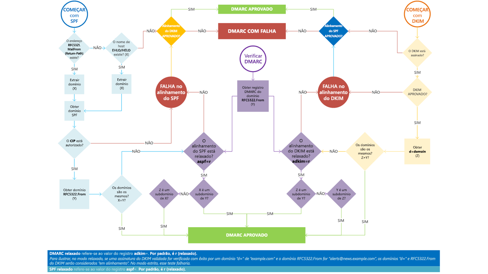

# <a name="use-dmarc-to-validate-email"></a>Usar DMARC para validar emails

[!INCLUDE [Microsoft 365 Defender rebranding](../includes/microsoft-defender-for-office.md)]

**Aplica-se a**
- [Proteção do Exchange Online](exchange-online-protection-overview.md)
- [Plano 1 e plano 2 do Microsoft Defender para Office 365](defender-for-office-365.md)
- [Microsoft 365 Defender](../defender/microsoft-365-defender.md)

A autenticação de mensagens baseada em domínio, os relatórios e a conformidade ([DMARC](https://dmarc.org)) funciona com a SPF (estrutura de políticas de remetente) e com o DomainKeys Identified Mail (DKIM) para autenticar remetentes de email e garantir que as mensagens confiáveis de sistemas de email de destino sejam enviadas de seu domínio. Implementar o DMARC com SPF e DKIM proporciona proporção adicional contra o spoofing e o phishing no email. O DMARC ajuda os sistemas de recepção de email a determinarem o que fazer com as mensagens enviadas a partir do seu domínio que falharem em verificações de SPF ou de DKIM.

> [!TIP]
> Visite o catálogo [Associação de Segurança Inteligente da Microsoft (MISA)](https://www.microsoft.com/misapartnercatalog) para exibir os fornecedores de terceiros que oferecem relatórios de DMARC para o Microsoft 365.

## <a name="how-do-spf-and-dmarc-work-together-to-protect-email-in-microsoft-365"></a>Como o SPF e o DMARC trabalham juntos para proteger o e-mail no Microsoft 365?

 Uma mensagem de email pode conter vários endereços originadores ou de remetente. Esses endereços são usados com finalidades diferentes. Por exemplo, considere esses endereços:

- **Endereço de "Email de"**: identifica o remetente e especifica onde enviar avisos de retorno se algum problema ocorrer com a entrega da mensagem, como notificações de falha na entrega. Isso aparece na parte do envelope de uma mensagem de email, e normalmente não é exibido pelo seu aplicativo de email. Isso algumas vezes é chamado de endereço 5321.MailFrom ou endereço reverso.

- **Endereço "De"** O endereço exibido como o endereço De pelo seu aplicativo de email. Esse endereço identifica o autor do email. Ou seja, a caixa de correio da pessoa ou sistema responsável por escrever a mensagem. Isso também é conhecido como endereço 5322.From.

O SPF usa um registro TXT DNS para fornecer uma lista de endereços IP de envio autorizados para um determinado domínio. Normalmente, só são executadas verificações de SPF contra o endereço 5321.MailFrom. Isso significa que o endereço 5322.From não é autenticado ao usar SPF por si só. Isso possibilita que exista um cenário em que um usuário recebe uma mensagem que passa por uma verificação de SPF mas tem um endereço de remetente 5322.From falso. Por exemplo, considere esta transcrição SMTP:

```console
S: Helo woodgrovebank.com
S: Mail from: phish@phishing.contoso.com
S: Rcpt to: astobes@tailspintoys.com
S: data
S: To: "Andrew Stobes" <astobes@tailspintoys.com>
S: From: "Woodgrove Bank Security" <security@woodgrovebank.com>
S: Subject: Woodgrove Bank - Action required
S:
S: Greetings User,
S:
S: We need to verify your banking details.
S: Please click the following link to verify that we have the right information for your account.
S:
S: https://short.url/woodgrovebank/updateaccount/12-121.aspx
S:
S: Thank you,
S: Woodgrove Bank
S: .
```

Nesta transcrição, os endereços de remetente são os seguintes:

- Endereço MailFrom (5321.MailFrom): phish@phishing.contoso.com

- Endereço De (5322.From): segurança@woodgrovebank.com

Se você configurou o SPF, o servidor de recebimento executa uma verificação do endereço MailFrom phish@phishing.contoso.com. Se a mensagem veio de uma fonte válida para o domínio phishing.contoso.com, ela passa na verificação de SPF. Como o cliente de email exibe apenas o endereço De, o usuário vê que essa mensagem é proveniente de segurança@woodgrovebank.com. Com o SPF sozinho, a validade de woodgrovebank.com nunca foi autenticada.

Quando você usa o DMARC, o servidor de recebimento também executa uma verificação do endereço De. No exemplo acima, se houver um registro TXT do DMARC para woodgrovebank.com, a verificação do endereço De falha.

## <a name="what-is-a-dmarc-txt-record"></a>O que é um registro TXT do DMARC?

Como os registros DNS para SPF, o registro do DMARC é um registro de texto (TXT) de DNS que ajuda a evitar os tipos de falsificação spoofing e phishing. Você publica registros TXT de DMARC no DNS. Os registros TXT de DMARC validam a origem das mensagens de email verificando o endereço IP do remetente em relação ao suposto proprietário do domínio de envio. O registro TXT do DMARC identifica os servidores de email de saída autorizados. Os sistemas de email de destino conseguem, então, verificar se as mensagens têm origem em servidores de email de saída autorizados.

O registro TXT DMARC da Microsoft tem a seguinte aparência:

```console
_dmarc.microsoft.com.   3600    IN      TXT     "v=DMARC1; p=none; pct=100; rua=mailto:d@rua.agari.com; ruf=mailto:d@ruf.agari.com; fo=1"
```

A Microsoft envia seus relatórios de DMARC à [Agari](https://agari.com), uma terceirizada. A Agari coleta e analisa os relatórios de DMARC. Visite o [catálogo MISA](https://www.microsoft.com/misapartnercatalog) para ver mais fornecedores de terceiros que oferecem relatórios de DMARC para o Microsoft 365.

## <a name="implement-dmarc-for-inbound-mail"></a>Implementar DMARC para email de entrada

Você não precisa fazer nada para configurar o DMARC para mensagens que receber no Microsoft 365. Nós já cuidamos de tudo para você. Se você deseja saber o que acontece com as mensagens que não passam em nossas verificações de DMARC, confira [Como o Microsoft 365 lida com emails de entrada que não passam na verificação do DMARC](#how-microsoft-365-handles-inbound-email-that-fails-dmarc).

## <a name="implement-dmarc-for-outbound-mail-from-microsoft-365"></a>Implementar DMARC para emails de saída do Microsoft 365

Se você usa o Microsoft 365, mas não está usando um domínio personalizado, ou seja, você usa o onmicrosoft.com, não é preciso fazer mais nada para configurar ou implementar o DMARC para a sua organização. O SPF já está configurado, e o Microsoft 365 gera automaticamente uma assinatura do DKIM para o seu email de saída. Para saber mais sobre essa assinatura, confira [Comportamento padrão para o DKIM e o Microsoft 365](use-dkim-to-validate-outbound-email.md#DefaultDKIMbehavior).

 Se tiver um domínio personalizado ou se estiver usando servidores do Exchange no local além do Microsoft 365, você precisará implementar manualmente o DMARC para os seus emails de saída. Para implementar o DMARC no seu domínio personalizado, siga estas etapas:

- [Etapa 1: Identificar fontes válidas de email para seu domínio](#step-1-identify-valid-sources-of-mail-for-your-domain)

- [Etapa 2: Definir o SPF para seu domínio](#step-2-set-up-spf-for-your-domain)

- [Etapa 3: Configurar o DKIM para o seu domínio personalizado](#step-3-set-up-dkim-for-your-custom-domain)

- [Etapa 4: Formar o registro TXT do DMARC para seu domínio](#step-4-form-the-dmarc-txt-record-for-your-domain)

### <a name="step-1-identify-valid-sources-of-mail-for-your-domain"></a>Etapa 1: Identificar fontes válidas de email para seu domínio

Se você já configurou o SPF, já executou esta etapa. Entretanto, para o DMARC, há outras considerações. Ao identificar fontes de email para seu domínio, há duas perguntas que você deve responder:

- Que endereços IP enviam mensagens do meu domínio?

- Para emails enviados de terceiros em meu nome, os domínios de 5321.MailFrom e 5322.From são iguais?

### <a name="step-2-set-up-spf-for-your-domain"></a>Etapa 2: Definir o SPF para seu domínio

Agora que você tem uma lista de todos os seus remetentes válidos, pode seguir as etapas para [Set up SPF in to help prevent spoofing](set-up-spf-in-office-365-to-help-prevent-spoofing.md).

Por exemplo, supondo que contoso.com envia emails do Exchange Online, um servidor Exchange local cujo endereço IP é 192.168.0.1 e um aplicativo Web cujo endereço IP é 192.168.100.100, o registro TXT do SPF teria a seguinte aparência:

```console
contoso.com  IN  TXT  " v=spf1 ip4:192.168.0.1 ip4:192.168.100.100 include:spf.protection.outlook.com -all"
```

Como prática recomendada, certifique-se de que seu registro TXT do SPF leva em consideração contas de remetentes terceirizados.

### <a name="step-3-set-up-dkim-for-your-custom-domain"></a>Etapa 3: Configurar o DKIM para o seu domínio personalizado

Quando já tiver definido o SPF, precisará configurar o DKIM. O DKIM possibilita adicionar uma assinatura digital a mensagens de email no cabeçalho da mensagem. Se você não configurar o DKIM e, ao invés disso, permitir que o Microsoft 365 use as configurações padrão do DKIM para seu domínio, o DMARC poderá falhar. Isso ocorre porque a configuração padrão do DKIM usa seu domínio inicial onmicrosoft.com como o endereço 5322.From, e não o seu domínio personalizado. Isso causa uma incompatibilidade entre os endereços 5321.MailFrom e 5322.From em todos os emails enviados a partir do seu domínio.

Se você tem remetentes terceirizados que enviam emails em seu nome e o email que eles enviarem tiver endereços 5321.MailFrom e 5322.From incompatíveis, o DMARC falhará para aquele email. Para evitar isto, é preciso configurar especificamente o DKIM para seu domínio com o remetente terceirizado. Isso possibilita que o Microsoft 365 autentique o email do serviço terceirizado. Também permite que outros serviços, como Yahoo, Gmail e Comcast, verifiquem o email enviado a eles pela parte terceirizada, como se o email tivesse sido enviado por você. Isso é benéfico porque permite que seus clientes confiem em seu domínio, independentemente de onde sua caixa de correio está localizada e, ao mesmo tempo, o Microsoft 365 não marca a mensagem como spam devido a spoofing, porque ela passa nas verificações de autenticação para seu domínio.

Para obter instruções sobre como configurar o DKIM para seu domínio, incluindo como configurar o DKIM para remetentes terceirizados para que possam imitar o seu domínio, confira [Usar DKIM para validar emails enviados de seu domínio personalizado](use-dkim-to-validate-outbound-email.md).

### <a name="step-4-form-the-dmarc-txt-record-for-your-domain"></a>Etapa 4: Formar o registro TXT do DMARC para seu domínio 

Apesar de haver outras opções de sintaxe que não são mencionadas aqui, essas são as opções mais comumente usadas para o Microsoft 365. Formar o registro TXT do DMARC para seu domínio no formato:

```console
_dmarc.domain  TTL  IN  TXT  "v=DMARC1; p=policy; pct=100"
```

em que:

- *domain* é o domínio que você deseja proteger. Por padrão, o registro protege os emails do domínio e de todos os seus subdomínios. Por exemplo, se você especificar\_dmarc.contoso.com, então o DMARC protegerá os emails desse domínio e de todos os seus subdomínios, como eletrodomesticos.contoso.com ou encanamento.contoso.com.

- *TTL* deve ser sempre equivalente a uma hora. A unidade usada para TTL, horas (1 hora), minutos (60 minutos) ou segundos (3600 segundos), varia dependendo do registrador de seu domínio.

- *pct=100* indica que esta regra deve ser usada para 100% dos emails.

- *policy* especifica quais políticas você deseja que o servidor de recebimento siga se o DMARC falhar. Você pode definir a política como none (nenhuma), quarantine (quarentena) ou reject (rejeitar).

Para saber mais sobre quais opções usar, familiarize-se com os conceitos em [Práticas recomendadas para implementar o DMARC no Microsoft 365](#best-practices-for-implementing-dmarc-in-microsoft-365).

Exemplos:

- Política definida como none

    ```console
    _dmarc.contoso.com 3600 IN  TXT  "v=DMARC1; p=none"
    ```

- Política definida como quarantine

    ```console
    _dmarc.contoso.com 3600 IN  TXT  "v=DMARC1; p=quarantine"
    ```

- Política definida como reject

    ```console
    _dmarc.contoso.com  3600 IN  TXT  "v=DMARC1; p=reject"
    ```

Após formar seu registro, é preciso atualizá-lo com seu registrador de domínio. Para saber mais sobre como adicionar o registro TXT do DMARC em seus registros de DNS para o Microsoft 365, confira [Criar registros DNS para o Microsoft 365 ao gerenciar seus registros DNS](../../admin/get-help-with-domains/create-dns-records-at-any-dns-hosting-provider.md).

## <a name="best-practices-for-implementing-dmarc-in-microsoft-365"></a>Práticas recomendadas para implementar o DMARC no Microsoft 365

Você pode implementar o DMARC gradualmente sem causar impacto no restante de seu fluxo de emails. Crie e execute um plano de implementação que siga estas etapas. Realize cada uma dessas etapas primeiro em um subdomínio, depois em outros subdomínios e, por fim, com o domínio principal de sua organização antes de seguir para a próxima etapa.

1. Monitorar o impacto da implementação do DMARC

    Comece com um registro de modo de monitoramento simples para um subdomínio ou domínio que exija que os receptores do DMARC enviem a você estatísticas sobre mensagens que virem usando esse domínio. Um registro de modo de monitoramento é um registro TXT do DMARC que tem a política definida como none (p=none). Muitas empresas publicam um registro TXT do DMARC com p=none porque não têm certeza sobre quantos emails eles podem perder ao publicar uma política de DMARC mais restritiva.

    Você pode fazer isso até mesmo antes de ter implementado o SPF ou o DKIM em sua infraestrutura de mensagens. Entretanto, não será possível colocar em quarentena ou rejeitar eficazmente os emails usando o DMARC até que você também implemente o SPF e o DKIM. Conforme você introduz o SPF e o DKIM, os relatórios gerados pelo DMARC fornecem a quantidade e as fontes das mensagens que passam por essas verificações, e as que não passam. É possível ver facilmente quanto de seu tráfego legítimo é ou não abrangido por eles, e solucionar quaisquer problemas. Você também começará a ver quantas mensagens fraudulentas estão sendo enviadas, e de onde.

2. Solicitar que sistemas de email externos coloquem em quarentena as mensagens que não passam na verificação do DMARC

    Quando você acredita que todo o, ou a maior parte de, seu tráfego legítimo é protegido por SPF e DKIM, e quando compreende o impacto da implementação do DMARC, pode, então, implementar uma política de quarentena. Uma política de quarentena é um registro TXT do DMARC que tem sua política definida como quarantine (p=quarantine). Ao fazer isto, você pede que os receptores do DMARC coloquem as mensagens de seu domínio que falharem na verificação em um local equivalente a uma pasta de spam, ao invés de colocá-las nas caixas de entrada dos clientes.

3. Solicitar que sistemas de email externos rejeitem as mensagens que não passam na verificação do DMARC

    A etapa final é implementar uma política de rejeição. Uma política de rejeição é um registro TXT do DMARC que tem a política definida como reject (p=reject). Ao fazer isto, você pede aos receptores do DMARC que não aceitem as mensagens que falham na verificação.

4. Como configurar DMARC para subdomínio?

   DMARC é implementado por meio da publicação de uma política como um registro TXT no DNS e é hierárquico (por exemplo, uma política publicada para contoso.com será aplicada a sub.domain.contonos.com, a menos que uma política diferente seja explicitamente definida para o subdomínio). Isso é útil para que as organizações possam especificar um número menor de registros DMARC de alto nível para uma cobertura mais ampla. Cuidado deve ser tomado ao configurar registros DMARC explícitos de subdomínio, onde você não quer que os subdomínios herdem o registro DMARC do domínio de nível superior.

   Também, você pode adicionar uma política do tipo curinga para DMARC quando os subdomínios não devem enviar emails, pela adição do valor `sp=reject`. Por exemplo:

   ```text
   _dmarc.contoso.com. TXT "v=DMARC1; p=reject; sp=reject; ruf=mailto:authfail@contoso.com; rua=mailto:aggrep@contoso.com"
   ```

## <a name="how-microsoft-365-handles-outbound-email-that-fails-dmarc"></a>Como o Microsoft 365 lida com emails de saída que não passam na verificação do DMARC

Se uma mensagem que está saindo do Microsoft 365 falhar na verificação do DMARC e você tiver a política definida como p=quarentena ou p=rejeitar, a mensagem será direcionada pelo [pool de entrega de alto risco para mensagens de saída](high-risk-delivery-pool-for-outbound-messages.md). Não há cancelamentos para emails de saída.

Se você publicar uma política de rejeição (p=reject) do DMARC, nenhum outro cliente no Microsoft 365 poderá imitar (spoof) seu domínio, porque as mensagens não conseguirão passar pelas verificações de SPF ou DKIM para seu domínio durante a retransmissão de uma mensagem de saída pelo serviço. No entanto, se você publicar uma política de rejeição do DMARC, mas não tiver todos os seus emails autenticados pelo Microsoft 365, algumas mensagens poderão ser marcadas como spam para emails de entrada (conforme descrito acima), ou poderão ser rejeitadas, caso você não publique o SPF e tente retransmiti-las pelo serviço. Isso acontece, por exemplo, se você esquecer de incluir alguns dos endereços IP para servidores e aplicativos que enviam emails em nome do seu domínio ao formar o registro TXT do DMARC.

## <a name="how-microsoft-365-handles-inbound-email-that-fails-dmarc"></a>Como o Microsoft 365 lida com emails de entrada que não passam na verificação do DMARC

Se a política de DMARC do servidor de envio é `p=reject`, [Proteção do Exchange Online](exchange-online-protection-overview.md) (EOP) marca a mensagem como falsa, em vez de rejeitá-la. Em outras palavras, para emails de entrada, o Microsoft 365 trata `p=reject` e `p=quarantine` da mesma maneira. Os administradores podem definir a ação a ser executada nas mensagens classificadas como spoof dentro da [política antiphishing](set-up-anti-phishing-policies.md).

O Microsoft 365 é configurado assim porque alguns emails legítimos podem falhar na verificação do DMARC. Por exemplo, uma mensagem pode não passar na verificação do DMARC se for enviada a uma lista de endereçamento que retransmite a mensagem a todos os participantes da lista. Se o Microsoft 365 rejeitar essas mensagens, as pessoas podem perder emails legítimos e não têm como recuperá-los. Em vez disso, essas mensagens ainda falharão na verificação do DMARC, mas serão marcadas como spam e não rejeitadas. Se quiserem, os usuários ainda podem receber essas mensagens em suas caixas de entrada fazendo o seguinte:

- Os usuários podem adicionar os remetentes seguros individualmente usando seus clientes de email.

- Os administradores podem atualizar o relatório de [Inteligência de Spoof](learn-about-spoof-intelligence.md) para permitir o spoof.

- Os administradores podem criar uma Regra de Transporte do Exchange (ETR) para todos os usuários que permitem mensagens desses remetentes específicos. 

Para obter mais informações, confira [Criar listas de remetentes seguros](create-safe-sender-lists-in-office-365.md).

## <a name="how-microsoft-365-utilizes-authenticated-received-chain-arc"></a>Como o Microsoft 365 usa o Authenticated Received Chain (ARC)

Todas as caixas de correio hospedadas no Microsoft 365 agora terão os benefícios do ARC com capacidade de entrega de mensagens e proteção anti-falsificação aprimoradas. O ARC preserva os resultados de autenticação de email de todos os participantes intermediários, ou saltos, quando um email é roteado do servidor de origem para a caixa de correio do destinatário. Antes do ARC, as modificações realizadas pelos intermediários no roteamento de emails, como as regras de encaminhamento ou assinaturas automáticas, podiam causar falhas no DMARC quando o email chegava à caixa de correio do destinatário. Com o ARC, a preservação criptográfica dos resultados da autenticação permite ao Microsoft 365 verificar a autenticidade do remetente de um email.

Atualmente, o Microsoft 365 usa o ARC para verificar os resultados da autenticação quando a Microsoft é o ARC Sealer, porém está nos planos adicionar suporte para o ARC Sealer de terceiros no futuro.

## <a name="troubleshooting-your-dmarc-implementation"></a>Solucionar problemas com sua implementação do DMARC

Se você tiver configurado os registros MX de seu domínio de forma que o EOP não é a primeira entrada, o DMARC não será aplicado ao seu domínio.

Se você é um cliente e o registro MX primário de seu domínio não aponta para o EOP, você não terá os benefícios do DMARC. Por exemplo, o DMARC não funcionará se você apontar o registro MX para seu servidor de email local e direcionar os emails para o EOP usando um conector. Neste cenário, o domínio receptor é um de seus Domínios Aceitos, mas o EOP não é o MX primário. Por exemplo, suponha que contoso.com aponta seu registro MX para si mesmo e usa o EOP como registro MX secundário. O registro MX de contoso.com tem a seguinte aparência:

```console
contoso.com     3600   IN  MX  0  mail.contoso.com
contoso.com     3600   IN  MX  10 contoso-com.mail.protection.outlook.com
```

Todos os, ou a maioria dos, emails primeiro serão direcionados a mail.contoso.com, já que este é o MX primário e, então, serão direcionados para o EOP. Em alguns casos, o EOP pode nem estar listado como registro MX e você usa conectores para direcionar os emails. EOP não precisa ser a primeira entrada para a validação do DMARC. Ele só garante a validação, pois nem todos os servidores locais/não O365 farão a verificação de DMARCs.  A DMARC está qualificada para ser imposta para o domínio de um cliente (não para o servidor) ao configurar o registro TXT do DMARC, mas fica até o servidor de recebimento para realmente fazer a imposição.  Se você configurar o EOP como o servidor de recebimento, o EOP fará a imposição de DMARC.



## <a name="for-more-information"></a>Para obter mais informações

Quer mais informações sobre o DMARC? Estes recursos podem ajudar.

- [Cabeçalhos de mensagem antispam](anti-spam-message-headers.md) inclui a sintaxe e os campos de cabeçalho usados pelo Microsoft 365 para verificações de DMARC.

- Faça a [Série de Treinamento DMARC](https://www.m3aawg.org/activities/training/dmarc-training-series) do M<sup>3</sup>AAWG (Sistema de Mensagens de Malware e Grupo de Trabalho Anti-Abuso de Mensagens, Malware).

- Use a lista de verificação em [dmarcian](https://space.dmarcian.com/deployment/).

- Vá direto à fonte em [DMARC.org](https://dmarc.org).

## <a name="see-also"></a>Confira também

[Como o Microsoft 365 usa SPF (Sender Policy Framework) para evitar falsificação](how-office-365-uses-spf-to-prevent-spoofing.md)

[Configure a SPF no Microsoft 365 para ajudar a evitar falsificações](set-up-spf-in-office-365-to-help-prevent-spoofing.md)

[Use o DKIM para validar emails enviados de seu domínio personalizado no Microsoft 365](use-dkim-to-validate-outbound-email.md)
