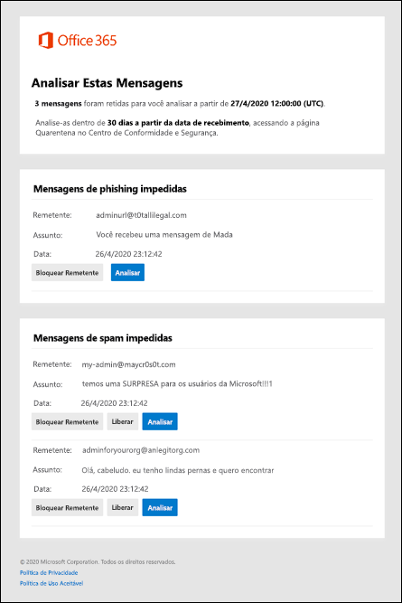

# Notificações de spam do usuário final no Office 365End-user spam notifications in Office 365

A quarentena mantém mensagens potencialmente perigosas ou indesejadas nas organizações do Office 365 com caixas de correio do Exchange Online ou de organizações autônomas do Exchange Online Protection (EOP) sem as caixas de correio do Exchange Online.Quarantine holds potentially dangerous or unwanted messages in Office 365 organizations with mailboxes in Exchange Online or standalone Exchange Online Protection (EOP) organizations without Exchange Online mailboxes. Para obter mais informações, consulte [Quarentena no Office 365](quarantine-email-messages.md).For more information, see [Quarantine in Office 365](quarantine-email-messages.md).

Por padrão, as notificações de spam do usuário final estão desabilitadas em políticas antispam.By default, end-user spam notifications are disabled in anti-spam policies. Quando um administrador [habilita as notificações de spam para o usuário final](configure-your-spam-filter-policies.md), os destinatários das mensagens receberão notificações periódicas sobre suas mensagens que foram colocadas em quarentena como spam, emails em massa ou (em abril de 2020) phishing.When an admin [enables end-user spam notifications](configure-your-spam-filter-policies.md), message recipients will receive periodic notifications about their messages that were quarantined as spam, bulk email, or (as of April, 2020) phishing.

> [!NOTE]
> Em outubro de 2019, removemos a capacidade de liberar mensagens em quarentena diretamente de notificações de spam do usuário final.In October 2019, we removed the ability to release quarantined messages directly from end-user spam notifications. Em vez disso, os usuários agora podem ir para o centro de conformidade & segurança do Office 365 para liberar as mensagens em quarentena (seja diretamente ou clicando em **revisar** na notificação).Instead, users can now go to the Office 365 Security & Compliance Center to release their quarantined messages (either directly, or by clicking **Review** in the notification). Para obter mais informações, consulte [Localizar e liberar mensagens em quarentena como um usuário no Office 365](find-and-release-quarantined-messages-as-a-user.md).For more information, see [Find and release quarantined messages as a user in Office 365](find-and-release-quarantined-messages-as-a-user.md).    As mensagens que foram colocadas em quarentena como phishing de alta confiança, malware ou por regras de fluxo de emails (também conhecidas como regras de transporte) só estão disponíveis para administradores.Messages that were quarantined as high confidence phishing, malware, or by mail flow rules (also known as transport rules) are only available to admins. Para obter mais informações, consulte [gerenciar mensagens em quarentena e arquivos como um administrador no Office 365](manage-quarantined-messages-and-files.md).For more information, see [Manage quarantined messages and files as an admin in Office 365](manage-quarantined-messages-and-files.md).

Uma notificação de spam do usuário final contém as seguintes informações para cada mensagem em quarentena:An end-user spam notification contains the following information for each quarantined message:

- **Remetente**: o nome de envio e o endereço de email da mensagem em quarentena.**Sender**: The send name and email address of the quarantined message.

- **Assunto**: o texto da linha de assunto da mensagem em quarentena.**Subject**: The subject line text of the quarantined message.

- **Date**: a data e a hora (em UTC) em que a mensagem foi colocada em quarentena.**Date**: The date and time (in UTC) that the message was quarantined.

- **Remetente do bloco**: clique neste link para adicionar o remetente à sua lista de remetentes bloqueados.**Block Sender**: Click this link to add the sender to your Blocked Senders list.

- **Revisão**: clique neste link para ir para a quarentena no centro de conformidade & segurança, onde você pode liberar, excluir ou relatar suas mensagens em quarentena.**Review**: Click this link to go the the Quarantine in the Security & Compliance Center, where you can release, delete or report your quarantined messages.

