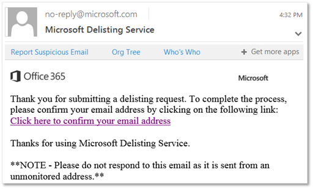

# Usar o portal de remoção da lista para ser removido da lista de remetentes bloqueadosUse the delist portal to remove yourself from the blocked senders list

[!INCLUDE [Microsoft 365 Defender rebranding](../includes/microsoft-defender-for-office.md)]

Você está recebendo uma mensagem de erro ao tentar enviar um email para um destinatário cujo endereço de email está no Microsoft 365?Are you getting an error message when you try to send an email to a recipient whose email address is in Microsoft 365? Se achar que você não deve receber a mensagem de erro, você pode usar o portal de remoção da lista para se remover da lista de remetentes bloqueados.If you think you should not be receiving the error message, you can use the delist portal to remove yourself from the blocked senders list.

## O que é a lista de remetentes bloqueados?What is the blocked senders list?

A Microsoft usa a lista de remetentes bloqueados para proteger seus clientes contra spam, falsificação e ataques de phishing.Microsoft uses the blocked senders list to protect its customers from spam, spoofing, and phishing attacks. O endereço IP do seu servidor de email, ou seja, o endereço que seu servidor de email usa para identificar-se na Internet, foi marcado como uma ameaça potencial para a Microsoft 365 por um dos vários motivos.Your mail server's IP address, that is, the address your mail server uses to identify itself on the Internet, was tagged as a potential threat to Microsoft 365 for one of a variety of reasons. Quando o Microsoft 365 adiciona o endereço IP à lista, ele impede todas as outras comunicações entre o endereço IP e qualquer um de nossos clientes por meio de nossos data centers.When Microsoft 365 adds the IP address to the list, it prevents all further communication between the IP address and any of our customers through our datacenters.

Você saberá que foi adicionado à lista quando receber uma resposta a uma mensagem de email que inclui um erro parecido com o seguinte:You will know you have been added to the list when you receive a response to a mail message that includes an error that looks something like this:

> 550 5.7.606-649 acesso negado, envio de IP proibido [_endereço IP_]; Para solicitar a remoção dessa lista, acesse <https://sender.office.com/> e siga as instruções.550 5.7.606-649 Access denied, banned sending IP [_IP address_]; To request removal from this list please visit <https://sender.office.com/> and follow the directions. Confira mais informações [em notificações de falha na entrega de email no Exchange Online](https://docs.microsoft.com/Exchange/mail-flow-best-practices/non-delivery-reports-in-exchange-online/non-delivery-reports-in-exchange-online).For more information see [Email non-delivery reports in Exchange Online](https://docs.microsoft.com/Exchange/mail-flow-best-practices/non-delivery-reports-in-exchange-online/non-delivery-reports-in-exchange-online).

em que  _IP address_ é o endereço IP do computador no qual o servidor de email é executado.where  _IP address_ is the IP address of the computer on which the mail server runs.

### Para usar o portal de remoção da lista para ser removido da lista de remetentes bloqueadosTo use delist portal to remove yourself from the blocked senders list

1. Em um navegador da Web, acesse <https://sender.office.com>.In a web browser, go to <https://sender.office.com>.

2. Siga as instruções descritas na página. Certifique-se de usar o endereço de email ao qual a mensagem de erro foi enviada e o endereço IP que é especificado na mensagem de erro. Você só pode inserir um endereço de email e um endereço IP por visita.Follow the instructions on the page. Ensure that you use the email address to which the error message was sent, and the IP address that is specified in the error message. You can only enter one email address and one IP address per visit.

3. Clique em **Enviar**.Click **Submit**.

    O portal envia um email para o endereço de email que você fornecer.The portal sends an email to the email address that you supply. O email será parecido com o seguinte: The email will look something like the following: 

4. Clique no link confirmação no email enviado a você pelo portal de remoção da lista.Click the confirmation link in the email sent to you by the delisting portal.

    Isso leva você de volta ao portal de remoção da lista.This brings you back to the delist portal.

5. No portal de remoção da lista, clique em **remover IP da lista**.In the delist portal, click **Delist IP**.

    Depois que o endereço IP for removido da lista de remetentes bloqueados, as mensagens de email desse endereço IP serão entregues aos destinatários que usam o Microsoft 365.After the IP address is removed from the blocked senders list, email messages from that IP address will be delivered to recipients who use Microsoft 365. Portanto, certifique-se de que os emails enviados a partir desse endereço IP não sejam ofensivos ou mal-intencionados; caso contrário, o endereço IP pode ser bloqueado novamente.So, make sure you're confident that email sent from that IP address won't be abusive or malicious; otherwise, the IP address might be blocked again.

    > [!NOTE]
    > Pode levar até 24 horas ou os resultados podem variar muito antes de as restrições serem removidas.It may take up to 24 hours or results can vary widely before restrictions are removed.

Consulte [criar listas de remetentes seguros no EOP](create-safe-sender-lists-in-office-365.md) e [proteção contra spam de saída no EOP](outbound-spam-controls.md) para impedir que um IP seja bloqueado.See [Create safe sender lists in EOP](create-safe-sender-lists-in-office-365.md) and [Outbound spam protection in EOP](outbound-spam-controls.md) to prevent an IP from being blocked.
