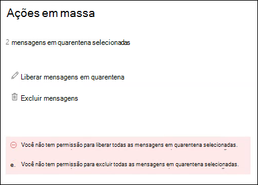

# <a name="view-and-release-quarantined-messages-from-shared-mailboxes"></a><span data-ttu-id="71670-103">Exibir e liberar mensagens em quarentena de caixas de correio compartilhadas</span><span class="sxs-lookup"><span data-stu-id="71670-103">View and release quarantined messages from shared mailboxes</span></span>

> [!NOTE]
> <span data-ttu-id="71670-104">Os recursos descritos neste artigo estão atualmente em versão prévia, que não estão disponíveis para todos, e estão sujeitos a alterações.</span><span class="sxs-lookup"><span data-stu-id="71670-104">The features that are described in this article are currently in Preview, aren't available to everyone, and are subject to change.</span></span>

<span data-ttu-id="71670-105">Os usuários podem gerenciar mensagens em quarentena onde são um dos destinatários, conforme descrito em [Localizar e liberar mensagens em quarentena como um usuário no EOP](find-and-release-quarantined-messages-as-a-user.md).</span><span class="sxs-lookup"><span data-stu-id="71670-105">Users can manage quarantined messages where they are one of the recipients as described in [Find and release quarantined messages as a user in EOP](find-and-release-quarantined-messages-as-a-user.md).</span></span> <span data-ttu-id="71670-106">Mas e quanto às caixas de correio compartilhadas onde o usuário possui permissões de acesso total e enviar como ou enviar em nome de para a caixa de correio, conforme descrito em [caixas de correio compartilhadas no Exchange Online](https://docs.microsoft.com/exchange/collaboration-exo/shared-mailboxes)?</span><span class="sxs-lookup"><span data-stu-id="71670-106">But what about shared mailboxes where the user has Full Access and Send As or Send on Behalf permissions to the mailbox as described in [Shared mailboxes in Exchange Online](https://docs.microsoft.com/exchange/collaboration-exo/shared-mailboxes)?</span></span>

<span data-ttu-id="71670-107">Anteriormente, a capacidade de os usuários gerenciarem as mensagens em quarentena enviadas a uma caixa de correio compartilhada, os administradores, devem deixar o mapeamento automático habilitado para a caixa de correio compartilhada (habilitada por padrão quando um administrador dá acesso a um usuário a outra caixa de correio).</span><span class="sxs-lookup"><span data-stu-id="71670-107">Previously, the ability for users to manage quarantined messages sent to a shared mailbox required admins to leave automapping enabled for the shared mailbox (it's enabled by default when an admin gives a user access to another mailbox).</span></span> <span data-ttu-id="71670-108">No entanto, dependendo do tamanho e do número de caixas de correio às quais o usuário tem acesso, o desempenho pode sofrer como buscas tenta abrir *todas as* caixas de correio às quais o usuário tem acesso.</span><span class="sxs-lookup"><span data-stu-id="71670-108">However, depending on the size and number of mailboxes that the user has access to, performance can suffer as Outlooks tries to open *all* mailboxes that the user has access to.</span></span> <span data-ttu-id="71670-109">Por esse motivo, muitos administradores optam por [remover o mapeamento automático para caixas de correio compartilhadas](https://docs.microsoft.com/outlook/troubleshoot/profiles-and-accounts/remove-automapping-for-shared-mailbox).</span><span class="sxs-lookup"><span data-stu-id="71670-109">For this reason, many admins choose to [remove automapping for shared mailboxes](https://docs.microsoft.com/outlook/troubleshoot/profiles-and-accounts/remove-automapping-for-shared-mailbox).</span></span>

<span data-ttu-id="71670-110">Agora, o mapeamento automático não é mais necessário para que os usuários gerenciem mensagens em quarentena que foram enviadas para caixas de correio compartilhadas.</span><span class="sxs-lookup"><span data-stu-id="71670-110">Now, automapping is no longer required for users to manage quarantined messages that were sent to shared mailboxes.</span></span> <span data-ttu-id="71670-111">Ele simplesmente funciona.</span><span class="sxs-lookup"><span data-stu-id="71670-111">It just works.</span></span> <span data-ttu-id="71670-112">Há dois métodos diferentes para acessar mensagens em quarentena que foram enviadas para uma caixa de correio compartilhada:</span><span class="sxs-lookup"><span data-stu-id="71670-112">There are two different methods to access quarantined messages that were sent to a shared mailbox:</span></span>

- <span data-ttu-id="71670-113">Se o administrador tiver [habilitado as notificações de spam para o usuário final](https://docs.microsoft.com/microsoft-365/security/office-365-security/configure-your-spam-filter-policies) em políticas antispam, qualquer usuário que tenha acesso às notificações de spam do usuário final na caixa de correio compartilhada poderá clicar no botão **revisar** na notificação para acessar a quarentena no centro de conformidade do & de segurança.</span><span class="sxs-lookup"><span data-stu-id="71670-113">If the admin has [enabled end-user spam notifications](https://docs.microsoft.com/microsoft-365/security/office-365-security/configure-your-spam-filter-policies) in anti-spam policies, any user that has access to the end-user spam notifications in the shared mailbox can click the **Review** button in the notification to go to quarantine in the Security & Compliance Center.</span></span> <span data-ttu-id="71670-114">Observe que esse método só permite que os usuários gerenciem mensagens em quarentena que foram enviadas para a caixa de correio compartilhada.</span><span class="sxs-lookup"><span data-stu-id="71670-114">Note that this method only allows users to manage quarantined messages that were sent to the shared mailbox.</span></span> <span data-ttu-id="71670-115">Os usuários não podem gerenciar suas próprias mensagens de quarentena neste contexto.</span><span class="sxs-lookup"><span data-stu-id="71670-115">Users can't manage their own quarantine messages in this context.</span></span>

- <span data-ttu-id="71670-116">O usuário pode [ir para a quarentena no centro de conformidade de & de segurança](find-and-release-quarantined-messages-as-a-user.md).</span><span class="sxs-lookup"><span data-stu-id="71670-116">The user can [go to the quarantine in the Security & Compliance Center](find-and-release-quarantined-messages-as-a-user.md).</span></span> <span data-ttu-id="71670-117">Por padrão, somente mensagens que foram enviadas para o usuário são exibidas.</span><span class="sxs-lookup"><span data-stu-id="71670-117">By default, only messages that were sent to the user are shown.</span></span> <span data-ttu-id="71670-118">No entanto, o usuário pode alterar os **resultados da classificação** (o **botão ID da mensagem** por padrão) para endereço de email do **destinatário**, inserir o endereço de email da caixa de correio compartilhada e, em seguida, clicar em **Atualizar** para ver as mensagens em quarentena que foram enviadas para a caixa de correio compartilhada.</span><span class="sxs-lookup"><span data-stu-id="71670-118">However, the user can change the **Sort results** (the **Message ID button** by default) to **Recipient email address**, enter the shared mailbox email address, and then click **Refresh** to see the quarantined messages that were sent to the shared mailbox.</span></span>

  

<span data-ttu-id="71670-120">Independentemente do método, os usuários podem evitar confusão, incluindo a coluna de **destinatários** para mensagens em quarentena.</span><span class="sxs-lookup"><span data-stu-id="71670-120">Regardless of the method, users can avoid confusion by including the **Recipient** column for quarantined messages.</span></span> <span data-ttu-id="71670-121">O número máximo de colunas a serem exibidas é 7, portanto, o usuário deverá clicar em **Modificar colunas**, remover uma coluna existente (por exemplo **, tipo de política**), selecionar **destinatário** e clicar em **salvar** ou **salvar como padrão**.</span><span class="sxs-lookup"><span data-stu-id="71670-121">The maximum number of columns to display is 7, so the user will need to click **Modify columns**, remove an existing column (for example, **Policy type**), select **Recipient**, and then click **Save** or **Save as default**.</span></span>

  

## <a name="things-to-keep-in-mind"></a><span data-ttu-id="71670-123">Tenha em mente</span><span class="sxs-lookup"><span data-stu-id="71670-123">Things to keep in mind</span></span>

- <span data-ttu-id="71670-124">O primeiro usuário a atuar na mensagem em quarentena decide o mão da mensagem para todos os usuários que usam a caixa de correio compartilhada.</span><span class="sxs-lookup"><span data-stu-id="71670-124">The first user to act on the quarantined message decides the fate of the message for everyone who uses the shared mailbox.</span></span> <span data-ttu-id="71670-125">Por exemplo, se uma caixa de correio compartilhada for acessada por 10 usuários e um usuário decidir excluir a mensagem de quarentena, a mensagem será excluída para todos os 10 usuários.</span><span class="sxs-lookup"><span data-stu-id="71670-125">For example, if a shared mailbox is accessed by 10 users, and a user decides to delete the quarantine message, the message is deleted for all 10 users.</span></span> <span data-ttu-id="71670-126">Da mesma forma, se um usuário decidir liberar a mensagem, ele é liberado para a caixa de correio compartilhada e é acessível por todos os outros usuários da caixa de correio compartilhada.</span><span class="sxs-lookup"><span data-stu-id="71670-126">Likewise, if a user decides to release the message, it's released to the shared mailbox and is accessible by all other users of the shared mailbox.</span></span>

- <span data-ttu-id="71670-127">Atualmente, se um usuário selecionar várias mensagens em quarentena que foram enviadas para a caixa de correio compartilhada, os seguintes erros enganosas serão retornados quando o usuário clicar em **liberar mensagens** ou **excluir mensagens** no submenu **ações em massa** :</span><span class="sxs-lookup"><span data-stu-id="71670-127">Currently, if a user selects multiple quarantined messages that were sent to the shared mailbox, the following misleading errors are returned when the user clicks **Release messages** or **Delete messages** in the **Bulk actions** flyout:</span></span>

  > <span data-ttu-id="71670-128">Você não tem permissão para liberar todas as mensagens em quarentena selecionadas.</span><span class="sxs-lookup"><span data-stu-id="71670-128">You do not have permission to release all selected quarantined messages.</span></span>
  >
  > <span data-ttu-id="71670-129">Você não tem permissão para excluir todas as mensagens em quarentena selecionadas.</span><span class="sxs-lookup"><span data-stu-id="71670-129">You do not have permission to delete all selected quarantined messages.</span></span>

  <span data-ttu-id="71670-130">Independentemente do erro, a ação é executada nas mensagens e o erro pode ser ignorado.</span><span class="sxs-lookup"><span data-stu-id="71670-130">Regardless of the error, the action is taken on the messages, and the error can be ignored.</span></span>

  

- <span data-ttu-id="71670-132">No momento, o botão **bloquear remetente** não está disponível no submenu **detalhes** das mensagens em quarentena que foram enviadas para a caixa de correio compartilhada.</span><span class="sxs-lookup"><span data-stu-id="71670-132">Currently, the **Block sender** button is not available in the **Details** flyout for quarantined messages that were sent to the shared mailbox.</span></span>

- <span data-ttu-id="71670-133">Para gerenciar mensagens em quarentena para a caixa de correio compartilhada no [PowerShell do Exchange Online](https://docs.microsoft.com/powershell/exchange/connect-to-exchange-online-powershell), o usuário final precisará usar o cmdlet [Get-QuarantineMessage](https://docs.microsoft.com/powershell/module/exchange/get-quarantinemessage) com o endereço de email da caixa de correio compartilhada para o valor do parâmetro _RecipientAddress_ para identificar as mensagens.</span><span class="sxs-lookup"><span data-stu-id="71670-133">To manage quarantined messages for the shared mailbox in [Exchange Online PowerShell](https://docs.microsoft.com/powershell/exchange/connect-to-exchange-online-powershell), the end-user will need to use the [Get-QuarantineMessage](https://docs.microsoft.com/powershell/module/exchange/get-quarantinemessage) cmdlet with shared mailbox email address for the value of the _RecipientAddress_ parameter to identify the messages.</span></span> <span data-ttu-id="71670-134">Por exemplo:</span><span class="sxs-lookup"><span data-stu-id="71670-134">For example:</span></span>

  ```powershell
  Get-QuarantinedMessage -RecipientAddress officeparty@contoso.com
  ```

  <span data-ttu-id="71670-135">Em seguida, o usuário final pode selecionar uma mensagem em quarentena na lista para exibir ou executar uma ação.</span><span class="sxs-lookup"><span data-stu-id="71670-135">Then, the end-user can select a quarantined message from the list to view or take action on.</span></span>

  <span data-ttu-id="71670-136">Este exemplo mostra todas as mensagens em quarentena que foram enviadas para a caixa de correio compartilhada e, em seguida, libera a primeira mensagem na lista da quarentena (a primeira mensagem na lista é 0, a segunda é 1 e assim por diante).</span><span class="sxs-lookup"><span data-stu-id="71670-136">This example shows all of the quarantined messages that were sent to the shared mailbox, and then releases the first message in the list from quarantine (the first message in the list is 0, the second is 1, and so on).</span></span>

  ```powershell
  $SharedMessages = Get-QuarantinedMessage -RecipientAddress officeparty@contoso.com | select -ExpandProperty Identity
  $SharedMessages
  Release-QuarantinedMessage -Identity $SharedMessages[0]
  ```

  <span data-ttu-id="71670-137">Para obter informações detalhadas sobre sintaxes e parâmetros, consulte os seguintes tópicos:</span><span class="sxs-lookup"><span data-stu-id="71670-137">For detailed syntax and parameter information, see the following topics:</span></span>

  - [<span data-ttu-id="71670-138">Get-QuarantineMessage</span><span class="sxs-lookup"><span data-stu-id="71670-138">Get-QuarantineMessage</span></span>](https://docs.microsoft.com/powershell/module/exchange/get-quarantinemessage)
  - [<span data-ttu-id="71670-139">Get-QuarantineMessageHeader</span><span class="sxs-lookup"><span data-stu-id="71670-139">Get-QuarantineMessageHeader</span></span>](https://docs.microsoft.com/powershell/module/exchange/get-quarantinemessageheader)
  - [<span data-ttu-id="71670-140">Visualização-QuarantineMessage</span><span class="sxs-lookup"><span data-stu-id="71670-140">Preview-QuarantineMessage</span></span>](https://docs.microsoft.com/powershell/module/exchange/preview-quarantinemessage)
  - [<span data-ttu-id="71670-141">Release-QuarantineMessage</span><span class="sxs-lookup"><span data-stu-id="71670-141">Release-QuarantineMessage</span></span>](https://docs.microsoft.com/powershell/module/exchange/release-quarantinemessage)
