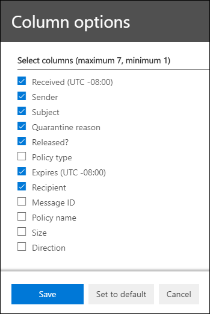

# <a name="view-and-release-quarantined-messages-from-shared-mailboxes"></a>Exibir e liberar mensagens em quarentena de caixas de correio compartilhadas

> [!NOTE]
> Os recursos descritos neste artigo estão atualmente em versão prévia, que não estão disponíveis para todos, e estão sujeitos a alterações.

Os usuários podem gerenciar mensagens em quarentena onde são um dos destinatários, conforme descrito em [Localizar e liberar mensagens em quarentena como um usuário no EOP](find-and-release-quarantined-messages-as-a-user.md). Mas e quanto às caixas de correio compartilhadas onde o usuário possui permissões de acesso total e enviar como ou enviar em nome de para a caixa de correio, conforme descrito em [caixas de correio compartilhadas no Exchange Online](https://docs.microsoft.com/exchange/collaboration-exo/shared-mailboxes)?

Anteriormente, a capacidade de os usuários gerenciarem as mensagens em quarentena enviadas a uma caixa de correio compartilhada, os administradores, devem deixar o mapeamento automático habilitado para a caixa de correio compartilhada (habilitada por padrão quando um administrador dá acesso a um usuário a outra caixa de correio). No entanto, dependendo do tamanho e do número de caixas de correio às quais o usuário tem acesso, o desempenho pode sofrer como buscas tenta abrir *todas as* caixas de correio às quais o usuário tem acesso. Por esse motivo, muitos administradores optam por [remover o mapeamento automático para caixas de correio compartilhadas](https://docs.microsoft.com/outlook/troubleshoot/profiles-and-accounts/remove-automapping-for-shared-mailbox).

Agora, o mapeamento automático não é mais necessário para que os usuários gerenciem mensagens em quarentena que foram enviadas para caixas de correio compartilhadas. Ele simplesmente funciona. Há dois métodos diferentes para acessar mensagens em quarentena que foram enviadas para uma caixa de correio compartilhada:

- Se o administrador tiver [habilitado as notificações de spam para o usuário final](https://docs.microsoft.com/microsoft-365/security/office-365-security/configure-your-spam-filter-policies) em políticas antispam, qualquer usuário que tenha acesso às notificações de spam do usuário final na caixa de correio compartilhada poderá clicar no botão **revisar** na notificação para acessar a quarentena no centro de conformidade do & de segurança. Observe que esse método só permite que os usuários gerenciem mensagens em quarentena que foram enviadas para a caixa de correio compartilhada. Os usuários não podem gerenciar suas próprias mensagens de quarentena neste contexto.

- O usuário pode [ir para a quarentena no centro de conformidade de & de segurança](find-and-release-quarantined-messages-as-a-user.md). Por padrão, somente mensagens que foram enviadas para o usuário são exibidas. No entanto, o usuário pode alterar os **resultados da classificação** (o **botão ID da mensagem** por padrão) para endereço de email do **destinatário**, inserir o endereço de email da caixa de correio compartilhada e, em seguida, clicar em **Atualizar** para ver as mensagens em quarentena que foram enviadas para a caixa de correio compartilhada.

  

Independentemente do método, os usuários podem evitar confusão, incluindo a coluna de **destinatários** para mensagens em quarentena. O número máximo de colunas a serem exibidas é 7, portanto, o usuário deverá clicar em **Modificar colunas**, remover uma coluna existente (por exemplo **, tipo de política**), selecionar **destinatário** e clicar em **salvar** ou **salvar como padrão**.

  

## <a name="things-to-keep-in-mind"></a>Tenha em mente

- O primeiro usuário a atuar na mensagem em quarentena decide o mão da mensagem para todos os usuários que usam a caixa de correio compartilhada. Por exemplo, se uma caixa de correio compartilhada for acessada por 10 usuários e um usuário decidir excluir a mensagem de quarentena, a mensagem será excluída para todos os 10 usuários. Da mesma forma, se um usuário decidir liberar a mensagem, ele é liberado para a caixa de correio compartilhada e é acessível por todos os outros usuários da caixa de correio compartilhada.

- No momento, o botão **bloquear remetente** não está disponível no submenu **detalhes** das mensagens em quarentena que foram enviadas para a caixa de correio compartilhada.

- Para gerenciar mensagens em quarentena para a caixa de correio compartilhada no [PowerShell do Exchange Online](https://docs.microsoft.com/powershell/exchange/connect-to-exchange-online-powershell), o usuário final precisará usar o cmdlet [Get-QuarantineMessage](https://docs.microsoft.com/powershell/module/exchange/get-quarantinemessage) com o endereço de email da caixa de correio compartilhada para o valor do parâmetro _RecipientAddress_ para identificar as mensagens. Por exemplo:

  ```powershell
  Get-QuarantinedMessage -RecipientAddress officeparty@contoso.com
  ```

  Em seguida, o usuário final pode selecionar uma mensagem em quarentena na lista para exibir ou executar uma ação.

  Este exemplo mostra todas as mensagens em quarentena que foram enviadas para a caixa de correio compartilhada e, em seguida, libera a primeira mensagem na lista da quarentena (a primeira mensagem na lista é 0, a segunda é 1 e assim por diante).

  ```powershell
  $SharedMessages = Get-QuarantinedMessage -RecipientAddress officeparty@contoso.com | select -ExpandProperty Identity
  $SharedMessages
  Release-QuarantinedMessage -Identity $SharedMessages[0]
  ```

  Para obter informações detalhadas sobre sintaxes e parâmetros, consulte os seguintes tópicos:

  - [Get-QuarantineMessage](https://docs.microsoft.com/powershell/module/exchange/get-quarantinemessage)
  - [Get-QuarantineMessageHeader](https://docs.microsoft.com/powershell/module/exchange/get-quarantinemessageheader)
  - [Visualização-QuarantineMessage](https://docs.microsoft.com/powershell/module/exchange/preview-quarantinemessage)
  - [Release-QuarantineMessage](https://docs.microsoft.com/powershell/module/exchange/release-quarantinemessage)
