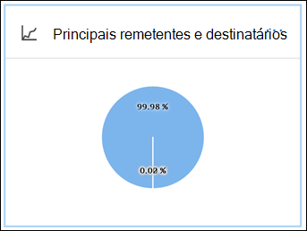
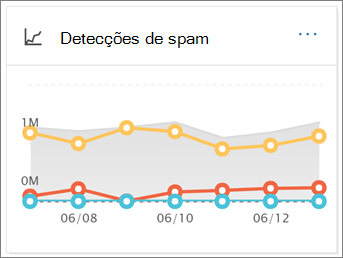
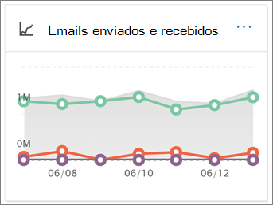

# Exibir relatórios de segurança de email no Centro de Conformidade e SegurançaView email security reports in the Security & Compliance Center

Vários relatórios estão disponíveis no [centro de conformidade & segurança](https://protection.office.com) para ajudá-lo a ver como os recursos de segurança de email, como os recursos antispam, Antimalware e de criptografia no Microsoft 365 estão protegendo sua organização.A variety of reports are available in the [Security & Compliance Center](https://protection.office.com) to help you see how email security features, such as anti-spam, anti-malware, and encryption features in Microsoft 365 are protecting your organization. Se você tiver as [permissões necessárias](#what-permissions-are-needed-to-view-these-reports), poderá exibir esses relatórios no centro de conformidade & de segurança acessando **Reports** o \> **painel**relatórios.If you have the [necessary permissions](#what-permissions-are-needed-to-view-these-reports), you can view these reports in the Security & Compliance Center by going to **Reports** \> **Dashboard**.

Os relatórios de segurança de email incluem o seguinte:Your email security reports include the following:

- [Relatório de proteção contra ameaças de URL](#url-threat-protection-report-new) (**novo!**)[URL Threat Protection report](#url-threat-protection-report-new) (**NEW!**)
- [Relatório de usuários comprometidosCompromised Users report](#compromised-users-report)
- [Relatório de criptografiaEncryption report](#encryption-report)
- [Relatório de Status da Proteção contra AmeaçasThreat Protection Status report](#threat-protection-status-report)
- [Relatório de detecções de malwareMalware Detections report](#malware-detections-report)
- [Relatório de malware superiorTop Malware report](#top-malware-report)
- [Relatório de principais remetentes e destinatáriosTop Senders and Recipients report](#top-senders-and-recipients-report)
- [Relatório de detecções falsasSpoof Detections report](#spoof-detections-report)
- [Relatório de detecções de spamSpam Detections report](#spam-detections-report)
- [Relatório de email enviado e recebidoSent and received email report](#sent-and-received-email-report)
- [Relatório de mensagens relatadas pelo usuárioUser-reported messages report](#user-reported-messages-report)

## Relatório de proteção contra ameaças de URL (**novo!**)URL Threat Protection report (**NEW!**)

O relatório de proteção contra ameaças de URL está disponível para qualquer pessoa com:The URL Threat Protection report is available to anyone with:

- Uma proteção do Exchange Online *e* um complemento de proteção avançada contra ameaças (plano 1 *ou* plano 2)An Exchange Online Protection, *and* Advanced Threat Protection add-on (Plan 1 *or* Plan 2)
- Uma assinatura do Microsoft 365 e5A Microsoft 365 E5 subscription

Este é um relatório de ' clique centralizado ' que tem dois modos de exibição agregados.This is a 'click-centric' report that has two aggregated views.

1. O primeiro modo de exibição é por *ação de proteção de clique de URL*, que se concentra em mostrar o número de cliques de URL por usuários no locatário e o resultado do clique.The first view is by *URL click-protection action*, which is focused on showing the number of URL clicks by users within the tenant, and the result of the click. Um clique aqui indica que o usuário clicou através da página de bloqueio para o site mal-intencionado (isso pode ser desabilitado pelo administrador dentro de uma política de links seguros).A click here indicates that the user has clicked through the block page to the malicious website (this can be disabled by the administrator within a Safe Links policy).

2. O segundo modo de exibição é *URL clique em aplicativos*, que mostra o número de URLs em diferentes aplicativos que dão suporte a links seguros hoje, como em um cliente de email ou no Microsoft Word.The second view is *URL click by applications*, which shows the number of URLs click in different applications that support Safe Links today, such as in an email client or in Microsoft Word. Os dados em modos de exibição agregados são atualizados uma vez a cada quatro horas.Data in both aggregated views are refreshed once every 4 hours.

A tabela de detalhes do relatório de proteção contra ameaças de URL fornece uma visualização quase em tempo real de todos os cliques que acontecem no locatário, e inclui informações investigativas, como *nome de usuário*, *URL*, a ID da *mensagem de rede* (se a URL foi clicada em um email) e outras informações valiosas para investigações e análises.The details table of the URL Threat Protection report provides a near-real-time view of all clicks that happen within the tenant, and it includes investigative information such as *username*, *URL*, the *network message ID* (if the URL was clicked from an email), and other valuable pieces of information useful for investigations and analyses.

Por padrão, o relatório mostra apenas os dados sobre os cliques de URLs que foram bloqueados por links seguros, mas também é possível ver as informações de todos os cliques de URL na caixa de seleção selecionar *URLs permitidas* nos filtros.By default, the report only shows data on clicks from URLs that were blocked by Safe Links, but it is also possible to see information for all URL clicks through selecting *Allowed URLs* checkbox in the filters.

Este relatório não terá dados de cliques de usuários em que a política de links seguros aplicada tenha a opção *não rastrear os cliques do usuário* selecionada.This report will not have data of clicks from users where the Safe Links policy applied has the *Do not track user clicks* option selected.

## Relatório de usuários comprometidosCompromised Users report

Este relatório, disponível para qualquer pessoa com proteção do Exchange Online, mostra o número de contas de usuário marcadas como usuários suspeitos ou restritos, dados particularmente úteis como contas Insira um dos Estados que indicam que a conta de usuário pode ser problemática ou até mesmo comprometida.This report, available to anyone with Exchange Online Protection, shows the number of user accounts marked as Suspicious or Restricted users, data particularly useful as accounts enter either of the states that indicate the user account may be problematic, or even compromised. Com o uso frequente, o relatório de usuário comprometido pode apontar picos e até mesmo tendências, em contas marcadas em Estados suspeitos ou restritos, fornecendo evidências, pode haver um problema com a segurança e o benefício do seu locatário.With frequent use, the Compromised User report can spot spikes, and even trends, in accounts marked in suspicious or restricted states, giving evidence there could be an issue with security and the wellness of your tenant.

## Relatório de criptografiaEncryption report

O **relatório de criptografia** mostra informações sobre as mensagens de email que foram criptografadas, seja por meio das políticas da sua organização ou por meio de controles de usuário final.The **Encryption report** shows information about email messages that were encrypted, either through your organization's policies, or through end-user controls. A equipe de segurança da sua organização pode usar informações neste relatório para identificar padrões e aplicar proativamente ou ajustar políticas para mensagens de email confidenciais.Your organization's security team can use information in this report to identify patterns and proactively apply or adjust policies for sensitive email messages.

Para exibir esse relatório, no centro de conformidade & de segurança, vá **Reports** para relatório de criptografia de \> **painel** de relatórios \> **Encryption report**.To view this report, in the Security & Compliance Center, go to **Reports** \> **Dashboard** \> **Encryption report**.

Quando o relatório for aberto pela primeira vez, você verá dados sobre os métodos de criptografia usados em mensagens de email dos últimos sete (7) dias.When the report first opens, you'll see data about encryption methods used on email messages for the past seven (7) days. Você pode alterar o intervalo de datas e os detalhes que são exibidos no relatório clicando em **filtros** no canto superior direito da tela.You can change the date range and the details that are displayed in the report by clicking **Filters** in the upper right corner of the screen.

Você também pode usar o menu **dividir por** para exibir dados por modelo de criptografia (ou método).You can also use the **Break down by** menu to view data by encryption template (or method).

E você pode usar o menu **exibir dados por** para alterar o modo de exibição para ver as contagens de mensagens criptografadas para os cinco domínios de destinatários principais.And, you can use the **View data by** menu to change the view to see counts of encrypted messages to the top five recipient domains.

Com a flexibilidade do novo relatório de criptografia, você pode exibir tendências e tomar as ações apropriadas.With the flexibility of the new Encryption report, you can view trends and take appropriate actions. Por exemplo, se você vir um grande número de mensagens de email criptografadas por usuários, talvez queira adicionar uma política de criptografia para automatizar a criptografia para determinados casos de uso.For example, if you see a high number of email messages encrypted by users, you might want to add an encryption policy to automate encryption for certain use cases. (Para obter ajuda com isso, consulte [definir regras de fluxo de email para criptografar mensagens de email no Microsoft 365](../../compliance/define-mail-flow-rules-to-encrypt-email.md).) Como outro exemplo, se você tiver vários modelos de criptografia disponíveis, mas nenhum estiver usando, você poderá explorar se os usuários precisam de treinamento para esse recurso.(To get help with that, see [Define mail flow rules to encrypt email messages in Microsoft 365](../../compliance/define-mail-flow-rules-to-encrypt-email.md).) As another example, if you have a number of encryption templates available but no one is using them, you might explore whether users need training for that feature.

Use este relatório permite que a equipe de segurança e conformidade da sua organização monitore a forma como a criptografia de mensagens está sendo usada e se as ações serão necessárias.Use this report enables your organization's security and compliance team to monitor how message encryption is being used, and whether further actions are needed. Para saber mais sobre criptografia, confira [criptografia de email no Microsoft 365](../../compliance/email-encryption.md).To learn more about encryption, see [Email encryption in Microsoft 365](../../compliance/email-encryption.md).

## Relatório de Status da Proteção contra AmeaçasThreat Protection Status report

O relatório de **status de proteção contra ameaças** é um relatório inteligente que mostra emails mal-intencionados que foram detectados e bloqueados pela proteção do Exchange Online.The **Threat Protection Status** report is a smart report that shows malicious email that was detected and blocked by Exchange Online Protection. Este relatório é útil para exibir emails identificados como malware ou uma tentativa de phishing ao longo do tempo (até 90 dias) e permite que administradores de segurança identifiquem tendências ou determinem se as políticas precisam de ajustes.This report is useful for viewing email identified as malware or a phishing attempt over time (up to 90 days), and it enables security administrators to identify trends or determine whether policies need adjustments.

> [!NOTE]
> Um relatório de status de proteção contra ameaças está disponível para clientes que tenham o [Office 365 ATP](https://docs.microsoft.com/microsoft-365/security/office-365-security/office-365-atp) ou o [Exchange Online Protection](exchange-online-protection-overview.md) (EOP); no entanto, as informações exibidas no relatório de status de proteção contra ameaças para clientes ATP provavelmente conterão dados diferentes do que os clientes do EOP podem ver.A Threat Protection Status report is available to customers who have either [Office 365 ATP](https://docs.microsoft.com/microsoft-365/security/office-365-security/office-365-atp) or [Exchange Online Protection](exchange-online-protection-overview.md) (EOP); however, the information that is displayed in the Threat Protection Status report for ATP customers will likely contain different data than what EOP customers might see. Por exemplo, os clientes do EOP podem exibir informações sobre malware detectado no email, mas não informações sobre [arquivos mal-intencionados detectados no SharePoint Online, no onedrive ou no Microsoft Teams](https://docs.microsoft.com/microsoft-365/security/office-365-security/atp-for-spo-odb-and-teams), um recurso específico de ATP.For example, EOP customers can view information about malware detected in email, but not information about [malicious files detected in SharePoint Online, OneDrive, or Microsoft Teams](https://docs.microsoft.com/microsoft-365/security/office-365-security/atp-for-spo-odb-and-teams), an ATP-specific capability. ([Saiba mais sobre os relatórios de ATP](https://docs.microsoft.com/microsoft-365/security/office-365-security/view-reports-for-atp).)([Learn more about ATP reports](https://docs.microsoft.com/microsoft-365/security/office-365-security/view-reports-for-atp).)

Para exibir esse relatório, no [centro de conformidade & segurança](https://protection.office.com), vá para **Reports** \> **painel** relatórios \> **status de proteção contra ameaças**.To view this report, in the [Security & Compliance Center](https://protection.office.com), go to **Reports** \> **Dashboard** \> **Threat Protection Status**.

Quando você abre o relatório de status de proteção contra ameaças pela primeira vez, o relatório mostra os dados dos últimos sete dias por padrão; no entanto, você pode clicar em **filtros** e alterar o intervalo de datas para até 90 dias de detalhes.When you first open the Threat Protection Status report, the report shows data for the past seven days by default; however, you can click **Filters** and change the date range for up to 90 days of detail. (Se estiver usando uma assinatura de avaliação, você poderá estar limitado a 30 dias de dados.)(If you are using a trial subscription, you might be limited to 30 days' of data.)

Este relatório é útil para ver a eficácia e o impacto dos recursos de [proteção do Exchange Online](https://docs.microsoft.com/microsoft-365/security/office-365-security/eop-features)da sua organização e para tendência de longo prazo.This report is useful for viewing the effectiveness and impact of your organization's [Exchange Online Protection features](https://docs.microsoft.com/microsoft-365/security/office-365-security/eop-features), and for longer-term trending.

Você também pode escolher se deseja exibir dados para emails identificados como mal-intencionados, emails identificados como tentativas de phishing ou emails identificados como contendo malware.You can also choose whether to view data for email identified as malicious, email identified as a phishing attempts, or email identified as containing malware.

## Relatório de detecções de malwareMalware Detections report

O relatório de **detecções de malware** mostra quantas mensagens de entrada e saída foram detectadas como contendo malware para sua organização.The **Malware Detections** report shows how many incoming and outgoing messages were detected as containing malware for your organization.

Para exibir esse relatório, no [centro de conformidade & segurança](https://protection.office.com), vá para **relatórios** de \> malware de **painel** de relatórios \> **Malware Detections**.To view this report, in the [Security & Compliance Center](https://protection.office.com), go to **Reports** \> **Dashboard** \> **Malware Detections**.

Semelhante a outros relatórios, como o [relatório de status de proteção contra ameaças](#threat-protection-status-report), o relatório exibe dados dos últimos sete dias por padrão.Similar to other reports, like the [Threat Protection Status report](#threat-protection-status-report), the report displays data for the past seven days by default. No entanto, você pode escolher **filtros** para alterar o intervalo de datas.However, you can choose **Filters** to change the date range.

## Relatório de malware superiorTop Malware report

O relatório de **malware superior** mostra os vários tipos de malware detectados pelo [Exchange Online](https://docs.microsoft.com/microsoft-365/security/office-365-security/eop-features).The **Top Malware** report shows the various kinds of malware that was detected by [Exchange Online](https://docs.microsoft.com/microsoft-365/security/office-365-security/eop-features).

Para exibir esse relatório, no [centro de conformidade & segurança](https://protection.office.com), vá para painel de **relatórios** de \> **Dashboard** \> **malware superior**.To view this report, in the [Security & Compliance Center](https://protection.office.com), go to **Reports** \> **Dashboard** \> **Top Malware**.

Ao passar o mouse sobre uma fatia no gráfico de pizza, você pode ver o nome de um tipo de malware e quantas mensagens foram detectadas como tendo esse malware.When you hover over a wedge in the pie chart, you can see the name of a kind of malware and how many messages were detected as having that malware.

Clique (ou toque) no relatório para abri-lo em uma nova janela do navegador, onde você pode obter uma visão mais detalhada do relatório.Click (or tap) the report to open it in a new browser window, where you can get a more detailed view of the report.

Abaixo do gráfico, você verá uma lista de malware detectado e quantas mensagens foram detectadas como tendo esse malware.Below the chart, you'll see a list of detected malware and how many messages were detected as having that malware.

## Relatório de principais remetentes e destinatáriosTop Senders and Recipients report

O relatório de **remetentes e destinatários principais** é um gráfico de pizza mostrando seus principais remetentes de email.The **Top Senders and Recipients** report is a pie chart showing your top email senders.

Para exibir esse relatório, no [centro de conformidade & segurança](https://protection.office.com), vá para painel de **relatórios** \> **Dashboard** \> **principais remetentes e destinatários**.To view this report, in the [Security & Compliance Center](https://protection.office.com), go to **Reports** \> **Dashboard** \> **Top Senders and Recipients**.

Ao passar o mouse sobre uma fatia no gráfico de pizza, você pode ver uma contagem de mensagens enviadas ou recebidas.When you hover over a wedge in the pie chart, you can see a count of messages sent or received.

Clique (ou toque) no relatório para abri-lo em uma nova janela do navegador, onde você pode obter uma visão mais detalhada do relatório.Click (or tap) the report to open it in a new browser window, where you can get a more detailed view of the report.

Use a lista **Mostrar dados de** para escolher se deseja exibir dados para os remetentes principais, receptores, destinatários de spam e destinatários de malware.Use the **Show data for** list to choose whether to view data for top senders, receivers, spam recipients, and malware recipients. Você também pode ver quem recebeu o malware que foi detectado pela [proteção do Exchange Online](exchange-online-protection-overview.md).You can also see who received malware that was detected by [Exchange Online Protection](exchange-online-protection-overview.md).

Abaixo do gráfico, você verá quem os principais remetentes ou destinatários de emails foram, juntamente com uma contagem de mensagens enviadas ou recebidas pelo período de tempo especificado.Below the chart, you'll see who the top email senders or recipients were, along with a count of messages sent or received for the given time period.

## Relatório de detecções falsasSpoof Detections report

O relatório de **detecções falsas** mostra quantas mensagens de email de falsificação foram detectadas, e dessas, quais foram consideradas "boas" (emails falsos realizados por motivos de negócios legítimos).The **Spoof Detections** report shows how many spoof mail messages were detected, and of those, which ones were considered "good" (spoof mail done for legitimate business reasons).

Para exibir esse relatório, no [centro de conformidade & segurança](https://protection.office.com), vá para **relatório** de \> **Dashboard** \> **falsificação**de painel de relatórios.To view this report, in the [Security & Compliance Center](https://protection.office.com), go to **Reports** \> **Dashboard** \> **Spoof Mail**.

Ao passar o mouse sobre um dia no gráfico, você pode ver quantas mensagens de email de falsificação foram recebidas.When you hover over a day in the chart, you can see how many spoof mail messages came through.

Clique (ou toque) no relatório para abri-lo em uma nova janela do navegador, onde você pode obter uma visão mais detalhada do relatório.Click (or tap) the report to open it in a new browser window, where you can get a more detailed view of the report. Para saber mais sobre proteção contra falsificação, confira [proteção contra falsificação no Microsoft 365](anti-spoofing-protection.md).To learn more about anti-spoof protection, see [Anti-spoofing protection in Microsoft 365](anti-spoofing-protection.md).

## Relatório de detecções de spamSpam Detections report

O relatório **detecções de spam** mostra todo o conteúdo de spam bloqueado pelo Exchange Online.The **Spam Detections** report shows all the spam content blocked by Exchange Online. As mensagens são contadas por mensagem e não por destinatário.Messages are counted per message, and not per recipient. Por exemplo, se uma mensagem de email foi enviada a 100 destinatários em sua organização, ela será contada como uma mensagem.For example, if an email message was sent to 100 recipients in your organization, it is counted as one message.

Para exibir esse relatório, no [centro de conformidade & segurança](https://protection.office.com), vá para **relatórios** de \> spam do **painel** de relatórios \> **Spam Detections**.To view this report, in the [Security & Compliance Center](https://protection.office.com), go to **Reports** \> **Dashboard** \> **Spam Detections**.

Ao passar o mouse sobre um dia no gráfico, você pode ver quantos itens foram bloqueados naquele dia, bem como os itens são categorizados.When you hover over a day in the chart, you can see how many items were blocked that day, as well as how those items are categorized. Por exemplo, você pode ver quantas mensagens de spam foram filtradas e quantos itens vieram de um endereço IP bloqueado.For example, you can see how many spam messages were filtered, and how many items came from a blocked Internet Protocol (IP) address.

Clique (ou toque) no relatório para abri-lo em uma nova janela do navegador, onde você pode obter uma visão mais detalhada do relatório.Click (or tap) the report to open it in a new browser window, where you can get a more detailed view of the report.

Abaixo do gráfico, você verá uma lista de itens de spam que foram detectados.Below the chart, you'll see a list of spam items that were detected. Selecione um item para exibir informações adicionais, como se o item de spam era de entrada ou de saída, sua ID de mensagem e seu destinatário.Select an item to view additional information, such as whether the spam item was inbound or outbound, its message ID, and its recipient. Para saber mais sobre proteção antispam, confira [proteção antispam de email do Office 365](https://docs.microsoft.com/microsoft-365/security/office-365-security/anti-spam-and-anti-malware-protection).To learn more about anti-spam protection, see [Office 365 email anti-spam protection](https://docs.microsoft.com/microsoft-365/security/office-365-security/anti-spam-and-anti-malware-protection).

## Relatório de email enviado e recebidoSent and received email report

O relatório de **email enviado e recebido** é um relatório inteligente que mostra informações sobre emails de entrada e saída, incluindo detecções de spam, malware e email identificados como "bom".The **Sent and received email** report is a smart report that shows information about incoming and outgoing email, including spam detections, malware, and email identified as "good."

Para exibir esse relatório, no [centro de conformidade & segurança](https://protection.office.com), vá para o painel **relatórios** \> **Dashboard** \> **enviado e recebido emails**.To view this report, in the [Security & Compliance Center](https://protection.office.com), go to **Reports** \> **Dashboard** \> **Sent and received email**.

Ao passar o mouse sobre um dia no gráfico, você pode ver quantas mensagens vieram e como essas mensagens são categorizadas.When you hover over a day in the chart, you can see how many messages came in, and how those messages are categorized. Por exemplo, você pode ver quantas mensagens foram detectadas como contendo malware e quantas foram identificadas como spam.For example, you can see how many messages were detected as containing malware, and how many were identified as spam.

Clique (ou toque) no relatório para abri-lo em uma nova janela do navegador, onde você pode obter uma visão mais detalhada do relatório.Click (or tap) the report to open it in a new browser window, where you can get a more detailed view of the report.

Você pode usar a lista **dividir por** para exibir informações por tipo ou por direção (entrada e saída).You can use the **Break down by** list to view information by type or by direction (incoming and outgoing).

Abaixo do gráfico, você verá uma lista de categorias de email, como **GoodMail**, **SpamContentFiltered**e assim por diante.Below the chart, you'll see a list of email categories, such as **GoodMail**, **SpamContentFiltered**, and so on. Selecione uma categoria para exibir informações adicionais, como ações que foram tomadas para malware e se o email era de entrada ou saída.Select a category to view additional information, such as actions that were taken for malware, and whether email was incoming or outgoing.

Para saber mais sobre inteligência de email, consulte [inteligência de fluxo de email no Microsoft 365](https://docs.microsoft.com/microsoft-365/security/office-365-security/mail-flow-intelligence-in-office-365).To learn more about email intelligence, see [Mail flow intelligence in Microsoft 365](https://docs.microsoft.com/microsoft-365/security/office-365-security/mail-flow-intelligence-in-office-365).

## Relatório de mensagens relatadas pelo usuárioUser-reported messages report

O relatório de **mensagens relatadas pelo usuário** mostra informações sobre as mensagens de email que os usuários relataram como lixo eletrônico, tentativas de phishing ou emails de boa qualidade usando o [suplemento de mensagem de relatório](https://docs.microsoft.com/microsoft-365/security/office-365-security/enable-the-report-message-add-in).The **User-reported messages** report shows information about email messages that users have reported as junk, phishing attempts, or good mail by using the [Report Message add-in](https://docs.microsoft.com/microsoft-365/security/office-365-security/enable-the-report-message-add-in).

Os detalhes estão disponíveis para cada mensagem, incluindo o motivo da entrega, como uma exceção de política de spam ou uma regra de fluxo de email configurada para sua organização.Details are available for each message, including the delivery reason, such a spam policy exception or mail flow rule configured for your organization. Para exibir detalhes, selecione um item na lista relatórios do usuário e, em seguida, exiba as informações nas guias **Resumo** e **detalhes** .To view details, select an item in the user-reports list, and then view the information on the **Summary** and **Details** tabs.

Para exibir esse relatório, no [centro de conformidade & segurança](https://protection.office.com), siga um destes procedimentos:To view this report, in the [Security & Compliance Center](https://protection.office.com), do one of the following:

- Vá para o painel **Gerenciamento** \> **Dashboard** \> **de ameaças mensagens relatadas pelo usuário**.Go to **Threat management** \> **Dashboard** \> **User-reported messages**.

- Vá para **Gerenciamento de ameaças** \> **revise** \> **mensagens relatadas pelo usuário**.Go to **Threat management** \> **Review** \> **User-reported messages**.

> [!IMPORTANT]
> Para que o relatório de mensagens relatadas pelo usuário funcione corretamente, o **log de auditoria deve estar ativado** para o seu ambiente do Office 365.In order for the User-reported messages report to work correctly, **audit logging must be turned on** for your Office 365 environment. Isso geralmente é feito por alguém que tenha a função de logs de auditoria atribuída no Exchange Online.This is typically done by someone who has the Audit Logs role assigned in Exchange Online. Para obter mais informações, consulte [Ativar ou desativar a pesquisa de log de auditoria da Microsoft 365](https://docs.microsoft.com/microsoft-365/compliance/turn-audit-log-search-on-or-off).For more information, see [Turn Microsoft 365 audit log search on or off](https://docs.microsoft.com/microsoft-365/compliance/turn-audit-log-search-on-or-off).

## Quais permissões são necessárias para exibir esses relatórios?What permissions are needed to view these reports?

Para exibir e usar os relatórios descritos neste artigo, **você deve ter uma função apropriada atribuída para o centro de conformidade & segurança e o centro de administração do Exchange**.In order to view and use the reports described in this article, **you must have an appropriate role assigned for both the Security & Compliance Center and the Exchange admin center**.

- Para o centro de conformidade & segurança, você deve ter uma das seguintes funções atribuídas:For the Security & Compliance Center, you must have one of the following roles assigned:

  – Gerenciamento de organização-administrador de segurança (pode ser atribuído no centro de administração do Azure Active Directory [https://aad.portal.azure.com](https://aad.portal.azure.com) )-leitor de segurança-Organization Management -Security Administrator (this can be assigned in the Azure Active Directory admin center ([https://aad.portal.azure.com](https://aad.portal.azure.com)) -Security Reader

- Para o Exchange Online, você deve ter uma das seguintes funções atribuídas no centro de administração do Exchange ( [https://outlook.office365.com/ecp](https://outlook.office365.com/ecp) ) ou com cmdlets do PowerShell (Confira [Exchange Online PowerShell](https://docs.microsoft.com/powershell/exchange/exchange-online-powershell)):For Exchange Online, you must have one of the following roles assigned in either the Exchange admin center ([https://outlook.office365.com/ecp](https://outlook.office365.com/ecp)) or with PowerShell cmdlets (See [Exchange Online PowerShell](https://docs.microsoft.com/powershell/exchange/exchange-online-powershell)):

  – Gerenciamento da organização – gerenciamento da organização somente para exibição-somente para exibição-Gerenciamento de conformidade-Organization Management -View-only Organization Management -View-Only Recipients role -Compliance Management

Para saber mais, confira os seguintes recursos:To learn more, see the following resources:

- [Permissões no Centro de Segurança e ConformidadePermissions in the Security & Compliance Center](https://docs.microsoft.com/microsoft-365/security/office-365-security/permissions-in-the-security-and-compliance-center)
 
- [Permissões de recursos no Exchange OnlineFeature permissions in Exchange Online](https://docs.microsoft.com/exchange/permissions-exo/feature-permissions)

## E se os relatórios não estiverem mostrando dados?What if the reports aren't showing data?

Se você não estiver vendo dados nos seus relatórios, verifique se as suas políticas estão configuradas corretamente.If you are not seeing data in your reports, double-check that your policies are set up correctly. Para saber mais, confira [proteção contra ameaças no Microsoft 365](https://docs.microsoft.com/microsoft-365/security/office-365-security/protect-against-threats).To learn more, see [Protect against threats in Microsoft 365](https://docs.microsoft.com/microsoft-365/security/office-365-security/protect-against-threats).

## Tópicos relacionadosRelated topics

[Proteção antispam de email da Microsoft 365Microsoft 365 Email Anti-Spam Protection](https://docs.microsoft.com/microsoft-365/security/office-365-security/anti-spam-and-anti-malware-protection)

[Relatórios e insights no centro de conformidade e segurança &Reports and insights in the Security & Compliance Center](https://docs.microsoft.com/microsoft-365/security/office-365-security/reports-and-insights-in-security-and-compliance)
