# Exibir relatórios de segurança de email no Centro de Conformidade e Segurança

Vários relatórios estão disponíveis no [centro de conformidade & segurança](https://protection.office.com) para ajudá-lo a ver como os recursos de segurança de email, como os recursos antispam, Antimalware e de criptografia no Microsoft 365 estão protegendo sua organização. Se você tiver as [permissões necessárias](#what-permissions-are-needed-to-view-these-reports), poderá exibir esses relatórios no centro de conformidade & de segurança acessando **Reports** o \> **painel**relatórios. Para ir diretamente para o painel relatórios, abra <https://protection.office.com/insightdashboard> .

## Relatório de usuários comprometidos

> [!NOTE]
> Este relatório está disponível nas organizações do Microsoft 365 com caixas de correio do Exchange Online. Ele não está disponível em organizações autônomas de proteção do Exchange Online (EOP), sem caixas de correio do Exchange Online.

O relatório **usuários comprometidos** mostra o número de contas de usuário que foram marcadas como **suspeitas** ou **restritas** nos últimos sete dias. As contas em um desses Estados são problemáticas ou até mesmo comprometidas. Com o uso frequente, você pode usar o relatório para identificar picos e até mesmo tendências, em contas suspeitas ou restritas. Para obter mais informações sobre usuários comprometidos, consulte [responder a uma conta de email comprometida](responding-to-a-compromised-email-account.md).

O modo de exibição de agregação mostra os dados dos últimos 90 dias e o modo de exibição de detalhes mostra os dados dos últimos 30 dias.

Para exibir o relatório, abra o [centro de conformidade & segurança](https://protection.office.com), vá **Reports** para \> **painel** relatórios e selecione **usuários comprometidos**. Para ir diretamente para o relatório, abra <https://protection.office.com/reportv2?id=CompromisedUsers> .

Você pode filtrar tanto o gráfico quanto a tabela detalhes clicando em **filtros** e selecionando um ou mais dos seguintes valores:

- **Data de início** e **data de término**

- **Suspeito**: a conta de usuário enviou emails suspeitos e está correndo o risco de ser restrito a enviar emails.

- **Restricted**: a conta de usuário foi restrita ao envio de emails devido a padrões altamente suspeitos.

Se você clicar em **Exibir tabela de detalhes**, poderá ver os seguintes detalhes:

- **Hora de criação**
- **ID de usuário**
- **Action**

Para voltar para o modo de exibição de relatório, clique em **Exibir relatório**.

## Relatório de criptografia

O **relatório de criptografia** está disponível em EOP (inscrições com caixas de correio no Exchange Online ou EOP autônomo sem caixas de correio do Exchange Online). A equipe de segurança da sua organização pode usar informações neste relatório para identificar padrões e aplicar proativamente ou ajustar políticas para mensagens de email confidenciais. Por exemplo:

- Se você vir um grande número de mensagens de email criptografadas por usuários, talvez queira adicionar uma política de criptografia para automatizar a criptografia para determinados casos de uso. Para obter mais informações, consulte [definir regras de fluxo de email para criptografar mensagens de email no Microsoft 365](../../compliance/define-mail-flow-rules-to-encrypt-email.md).

- Se você tiver vários modelos de criptografia disponíveis, mas nenhum estiver usando, você poderá explorar se os usuários precisam de treinamento de recurso.

O modo de exibição agregado permite a filtragem dos últimos 90 dias, enquanto o modo de exibição de detalhes permite filtragem por 10 dias.

Para exibir o relatório, abra o [centro de conformidade & segurança](https://protection.office.com), vá **Reports** para \> **painel** relatórios e selecione **relatório de criptografia**. Para ir diretamente para o relatório, abra <https://protection.office.com/reportv2?id=EncryptionReport> .

Para saber mais sobre criptografia, confira [criptografia de email no Microsoft 365](../../compliance/email-encryption.md).

### Exibição de relatório para o relatório de criptografia

Você pode usar os seguintes filtros no gráfico:

- **Exibir dados por: relatório de criptografia de mensagens** e **dividir por: método**de criptografia: os seguintes métodos de criptografia estão disponíveis:

  - **Criptografia por usuário**
  - **Criptografia por política**

  Se você clicar em **filtros**, poderá modificar o gráfico com os seguintes filtros:

  - **Data de início** e **data de término**
  - Método de criptografia.
  - Modelo de criptografia.

- **Exibir dados por: relatório de criptografia de mensagens** e **dividir por: modelo**de criptografia: os seguintes métodos de criptografia estão disponíveis:

  - **Não encaminhar**
  - **Criptografar apenas**
  - **OME anterior**
  - **Personalizados**

  Se você clicar em **filtros**, poderá modificar o gráfico com os seguintes filtros:

  - **Data de início** e **data de término**
  - Método de criptografia
  - Modelo de criptografia

- **Exibir dados por: 5 principais domínios de destinatário**: este modo de exibição mostra um gráfico de pizza com contagens de mensagens enviadas para os cinco domínios de destinatários principais.

  Se você clicar em **filtros**, poderá selecionar uma **data de início** e uma **data de término**.

### Exibição da tabela de detalhes para o relatório de criptografia

Se você clicar em **Exibir tabela de detalhes**, as informações mostradas dependem do gráfico que você estava observando:

- **Dividir em: método de criptografia** ou **dividir por: modelo de criptografia**: as seguintes informações são mostradas:

  - **Date**
  - **Endereço do remetente**.
  - **Modelo de criptografia**
  - **Método de criptografia**
  - **Endereço do destinatário**
  - **Assunto**

- **Exibir dados por: cinco domínios principais de destinatários**:

  - **Date**
  - **Domínio do destinatário**
  - **Contagem de mensagem**
  
Se você clicar em **filtros** em um modo de exibição de tabela de detalhes, poderá modificar os resultados com os seguintes filtros:

- **Data de início** e **data de término**
- Método de criptografia
- Modelo de criptografia

Para voltar para o modo de exibição de relatório, clique em **Exibir relatório**.

## Relatório de status do fluxo

O **relatório de status do fluxo** contém informações sobre malware, spam, phishing e mensagens bloqueadas de borda. Para obter mais detalhes, consulte [fluxo status Report](view-mail-flow-reports.md#mailflow-status-report).

## Detecção de malware no relatório de email

O relatório **detecções de malware no email** mostra informações sobre detecções de malware em mensagens de email de entrada e saída (malware detectado pelo Exchange Online Protection ou EOP). Para obter mais informações sobre proteção contra malware no EOP, consulte [Anti-Malware Protection in EOP](anti-malware-protection.md).

 O filtro de exibição agregada permite 90 dias, enquanto o filtro da tabela detalhes permite apenas 10 dias.

Para exibir o relatório, abra o [centro de conformidade & segurança](https://protection.office.com), vá **Reports** para \> **painel** relatórios e selecione **detecções de malware no email**. Para ir diretamente para o relatório, abra <https://protection.office.com/reportv2?id=MalwareDetections> .

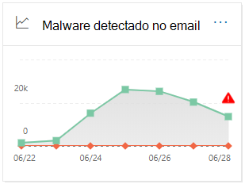

Você pode filtrar tanto o gráfico quanto a tabela detalhes clicando em **filtros** e selecionando:

- **Data de início** e **data de término**
- **Entrada**
- **Saída**

Se você clicar em **Exibir tabela de detalhes**, poderá ver os seguintes detalhes:

- **Date**
- **Endereço do remetente**.
- **Endereço do destinatário**
- **ID da mensagem**
- **Assunto**
- **Filename**
- **Nome do malware**

Para voltar para o modo de exibição de relatório, clique em **Exibir relatório**.

## Relatório de email enviado e recebido

O relatório de **email enviado e recebido** contém informações sobre malware, spam, regras de fluxo de emails (também conhecidas como regras de transporte) e detecções de malware avançadas após o email entrar no serviço. Para obter mais informações, consulte [envio e recebimento de email Report](view-mail-flow-reports.md#sent-and-received-email-report).

## Relatório de detecções de spam

O relatório **detecções de spam** mostra mensagens de email de spam que foram bloqueadas pelo EOP. As mensagens são contadas individualmente, e não por destinatário. Por exemplo, se a mesma mensagem de spam tiver sido enviada para 100 destinatários em sua organização, ela contará como uma mensagem.

O modo de exibição agregado permite filtragem de 90 dias, enquanto a tabela detalhes permite a filtragem de 10 dias.

Para exibir o relatório, abra o [centro de conformidade & segurança](https://protection.office.com), vá **Reports** para \> **painel** relatórios e selecione **detecções de spam**. Para ir diretamente para o relatório, abra <https://protection.office.com/reportv2?id=SpamDetections> .

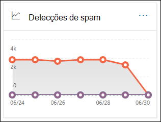

Para obter mais informações sobre proteção antispam, consulte [proteção antispam no EOP](anti-spam-protection.md).

### Exibição de relatório para o relatório de detecções de spam

Os gráficos a seguir estão disponíveis no modo de exibição de relatório:

- **Dividir por: ação**: os seguintes tipos de eventos são mostrados:

  - **Conteúdo de spam filtrado**
  - **Bloqueio de IP de spam**
  - **Bloco de envelope de spam**
  - **Filtro de DBEB de spam**: bloqueio de borda baseado em diretório (DBEB)

  Ao passar o mouse sobre um dia (ponto de dados) no gráfico, você pode ver quantos itens foram bloqueados naquele dia, bem como os itens que foram categorizados.

  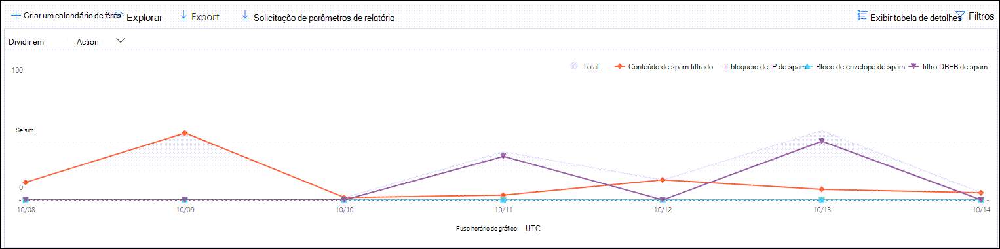

- Dividido **por: direção**: as seguintes direções são exibidas:

  - **Entrada**
  - **Saída**

  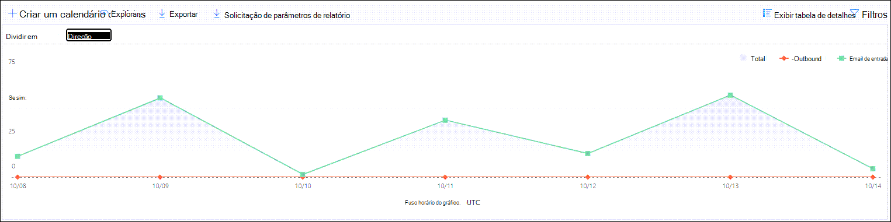

Se você clicar em **filtros** em um modo de exibição de relatório, poderá modificar os resultados com os seguintes filtros:

- **Data de início** e **data de término**
- Valores de direção
- Valores de tipo de evento

### Exibição da tabela de detalhes para o relatório de detecções de spam

Se você clicar em **Exibir tabela de detalhes** em qualquer modo de exibição de relatório, as seguintes informações serão exibidas:

- **Date**
- **Endereço do remetente**.
- **Endereço do destinatário**
- **Tipo de evento**
- **Action**
- **Assunto**

Se você clicar em **filtros** em uma tabela de detalhes, poderá modificar os resultados com os seguintes filtros:

- **Data de início** e **data de término**
- Valores de direção
- Valores de tipo de evento

Para voltar para o modo de exibição de relatório, clique em **Exibir relatório**.

## Relatório de detecções falsas

O relatório de **detecções falsas** mostra quantas mensagens de email de falsificação foram detectadas, e dessas, quais foram consideradas "boas" (emails falsos realizados por motivos de negócios legítimos). Para obter mais informações sobre falsificação, consulte [proteção contra falsificação no EOP](anti-spoofing-protection.md).

O modo de exibição de agregação do relatório permite 90 dias de filtragem, enquanto o modo de exibição de detalhes permite apenas dez dias de filtragem.

Para exibir o relatório, abra o [centro de conformidade & segurança](https://protection.office.com), vá **Reports** para \> **painel** relatórios e selecione **detecções falsas**. Para ir diretamente para o relatório, abra <https://protection.office.com/reportv2?id=SpoofMailReport> .

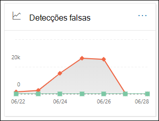

Ao passar o mouse sobre um dia (ponto de dados) no gráfico, você pode ver quantas mensagens de email de falsificação vieram.

Você pode filtrar tanto o gráfico quanto a tabela detalhes clicando em **filtros** e selecionando um ou mais dos seguintes valores:

- **Data de início** e **data de término**

- **Boa mensagem**

- **Detectado como spam**

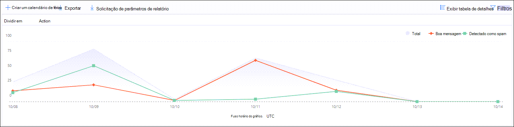

Se você clicar em **Exibir tabela de detalhes**, poderá ver os seguintes detalhes:

- **Date**
- **Remetente falsificado**
- **Remetente verdadeiro**
- **IP do remetente**
- **Action**
- **Contagem de mensagem**

Para voltar para o modo de exibição de relatório, clique em **Exibir relatório**.

## Relatório de status de proteção contra ameaças

O relatório de **status de proteção contra ameaças** está disponível no EOP e no Office 365 ATP; no entanto, os relatórios contêm dados diferentes. Por exemplo, os clientes do EOP podem exibir informações sobre malware detectado no email, mas não informações sobre [arquivos mal-intencionados detectados no SharePoint Online, no onedrive ou no Microsoft Teams](atp-for-spo-odb-and-teams.md). Para obter mais informações sobre os relatórios de ATP do Office 365, consulte [View Reports for Office 365 Advanced Threat Protection](view-reports-for-atp.md).

Este é um relatório inteligente que mostra emails mal-intencionados que foram detectados e bloqueados, e permite que os administradores de segurança identifiquem tendências ou determine se as políticas da organização precisam de ajuste.

Para exibir o relatório, abra o [centro de conformidade & segurança](https://protection.office.com), vá **Reports** para \> **painel** relatórios e selecione **status de proteção contra ameaças**. Para ir diretamente para o relatório, abra <https://protection.office.com/reportv2?id=ATPV2AggregateReport> .

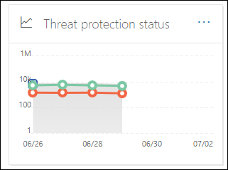

Por padrão, o gráfico mostra os dados dos últimos 7 dias. Se você clicar em **filtros**, poderá selecionar um intervalo de data de 90 dias (as assinaturas de avaliação podem ser limitadas a 30 dias). O modo de exibição tabela de detalhes permite a filtragem por 30 dias.

### Exibição de relatório para o relatório de status de proteção contra ameaças

Os seguintes modos de exibição estão disponíveis:

- **Exibir dados por: visão geral**: as seguintes informações de detecção são exibidas:

  - **Malware de email**
  - **Phishing de email**
  - **Malware de conteúdo**

  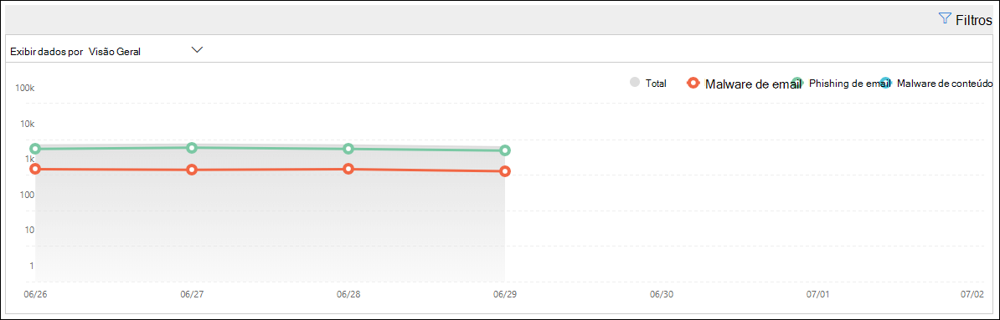

- **Exibir dados por: conteúdo \> Malware**1: as seguintes informações são mostradas para organizações do Office 365 ATP:

  - **Mecanismo Antimalware**
  - **Arquivo acionamento**

  

- **Divida por: tecnologia de detecção** e **exibir dados por: \> Phish de email**: as informações a seguir são exibidas:

  - **Reputação da URL gerada por ATP**1
  - **Filtro de phishing avançado**
  - **Antifalsificação: falha de DMARC**
  - **Anti-falsificação: dentro da organização**
  - **Antifalsificação: domínio externo**
  - **Representação da marca**
  - **Representação de domínio**1
  - **Reputação da URL do EOP**
  - **Filtro de phishing geral**
  - **Outros**
  - **Phishing zap**2
  - **URL acionamento**1
  - **Representação de usuário**1

  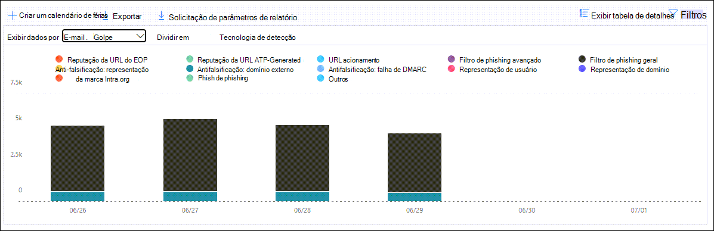

- **Divida por: tecnologia de detecção** e **exibir dados por: \> malware de email**: as informações a seguir são exibidas:

  - **Reputação de arquivo gerado por ATP**1
  - **Mecanismo anti-malware**1
  - **Bloco de tipo de arquivo de política Antimalware**
  - **Arquivo acionamento**1
  - **Reputação de arquivos mal-intencionados**
  - **Malware zap**2
  - **Outros**

  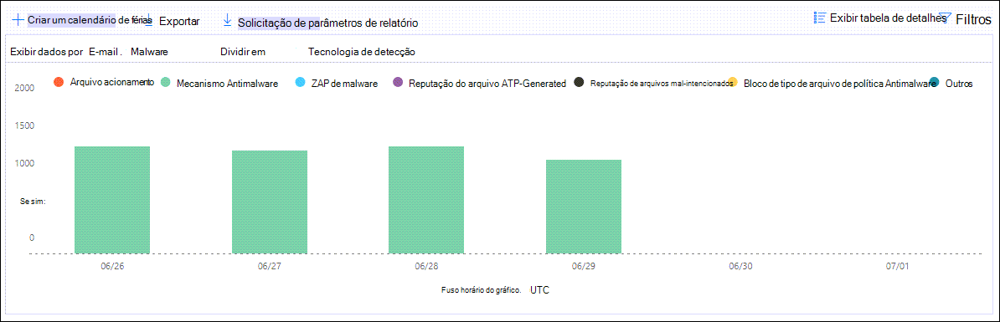

- **Divida por: tipo de política** e **exibir dados por: \> Phish de emails** ou **exibir dados por: \> malware de email**: as seguintes informações são mostradas:

  - **Antimalware**
  - **Anexo seguro**1
  - **Anti-Phish**
  - **Antispam**
  - **Regra de fluxo de emails** (também conhecida como regra de transporte)
  - **Outros**

  

- **Dividir em: status de entrega** e **exibir dados por: \> Phish de emails** ou **exibir dados por: \> malware de email**: as informações a seguir são exibidas:

  - **Falha na entrega**
  - **Abandonado**
  - **Encaminhadas**
  - **Caixa de correio hospedada: pasta personalizada**
  - **Caixa de correio hospedada: itens excluídos**
  - **Caixa de correio hospedada: caixa de entrada**
  - **Caixa de correio hospedada: lixo eletrônico**
  - **Servidor local: entregue**
  - **Quarentena**

  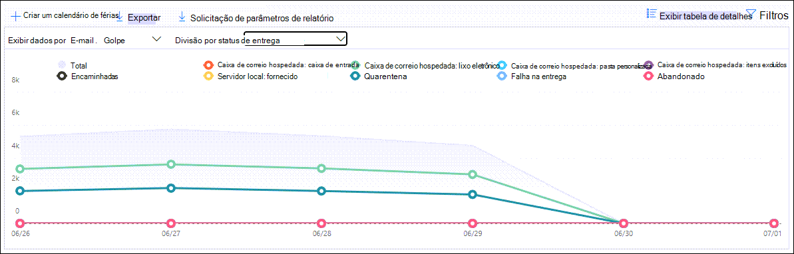

1 somente o Office 365 ATP

2 a limpeza automática de zero horas (zap) não está disponível no EOP autônomo (funciona apenas em caixas de correio do Exchange Online).

Se você clicar em **filtros**, poderá modificar o relatório com os seguintes filtros:

- **Data de início** e **data de término**
- Valor de detecção
- **Protegido por** (somente o Office 365 ATP): **ATP** ou **EOP**. Observe que essa propriedade filtrável não está disponível em **exibir dados por: \> malware de conteúdo**.

### Exibição da tabela de detalhes para o relatório de status de proteção contra ameaças

Se você clicar em **Exibir tabela de detalhes**, as informações mostradas dependem do gráfico que você estava observando:

- **Exibir dados por: conteúdo \> Malware**:

  - **Date**
  - **Location**
  - **Direcionado por**
  - **Nome do malware**

- **Exibir dados por: visão geral**: não há botão **Exibir tabela detalhes** disponível.

- Todos os outros gráficos:

  - **Date**
  - **Assunto**
  - **Sender**
  - **Destinatários**
  - **Detectado por**
  - **Status de entrega**
  - **Origem de comprometimento**

Se você clicar em **filtros**, poderá modificar o relatório com os seguintes filtros:

- **Data de início** e **data de término**
- Valor de detecção
- **Protegido por** (somente o Office 365 ATP): **ATP** ou **EOP**. Observe que essa propriedade filtrável não está disponível em **exibir dados por: \> malware de conteúdo**.

## Relatório de malware superior

O relatório de **malware superior** mostra os vários tipos de malware detectados pela [proteção Antimalware no EOP](anti-malware-protection.md).

Para exibir o relatório, abra o [centro de conformidade & segurança](https://protection.office.com), vá **Reports** para \> **painel** relatórios e selecione **malware superior**. Para ir diretamente para o relatório, abra <https://protection.office.com/reportv2?id=TopMalware> .

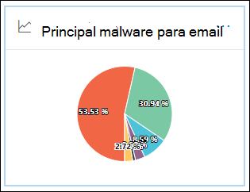

Ao passar o mouse sobre uma fatia no gráfico de pizza, você pode ver o nome de um tipo de malware e quantas mensagens foram detectadas como tendo esse malware.

Se você clicar em **Exibir tabela de detalhes**, poderá ver os seguintes detalhes:

- **Principais malware**
- **Count**

Se você clicar em **filtros** no modo de exibição relatório ou tabela de detalhes, poderá especificar um intervalo de datas com **data de início** e data de **término**.

## Relatório de proteção contra ameaças de URL

> [!NOTE]
> Este relatório está disponível somente na proteção avançada contra ameaças do Office 365 (ATP). Por exemplo, uma assinatura do Microsoft 365 E5 ou um complemento plano ATP 1 ou de plano 2.

O **relatório de proteção de ameaças de URL** fornece as exibições de resumo e tendência para ameaças detectadas e ações tomadas em cliques de URL como parte dos [links seguros de ATP](atp-safe-links.md). Este relatório não terá clique em dados de usuários em que a política de links seguros aplicada tenha a opção **não rastrear os cliques do usuário** selecionada.

Para exibir o relatório, abra o [centro de conformidade & segurança](https://protection.office.com), vá **Reports** para \> **painel** relatórios e selecione **proteção de URL**. Para ir diretamente para o relatório, abra <https://protection.office.com/reportv2?id=URLProtectionActionReport> .

### Exibição de relatório para o relatório de proteção contra ameaças de URL

O relatório de **proteção contra ameaças de URL** tem duas exibições agregadas que são atualizadas uma vez a cada quatro horas que mostram dados dos últimos 90 dias:

- **URL clique em ação de proteção**: mostra o número de cliques de URL por usuários na organização e os resultados do clique:

  - **Blocked**
  - **Bloqueado e clicado**
  - **Clicado durante a verificação**

  Um clique indica que o usuário clicou através da página de bloqueio para o site mal-intencionado (os administradores podem desabilitar o clique em políticas de links seguros).

  Se você clicar em **filtros**, poderá modificar o relatório com os seguintes filtros:

  - **Data de início** e **data de término**
  - O disponível clique em ações de proteção, mais o valor **permitido** para ver informações de todos os cliques de URL (não apenas cliques bloqueados).

  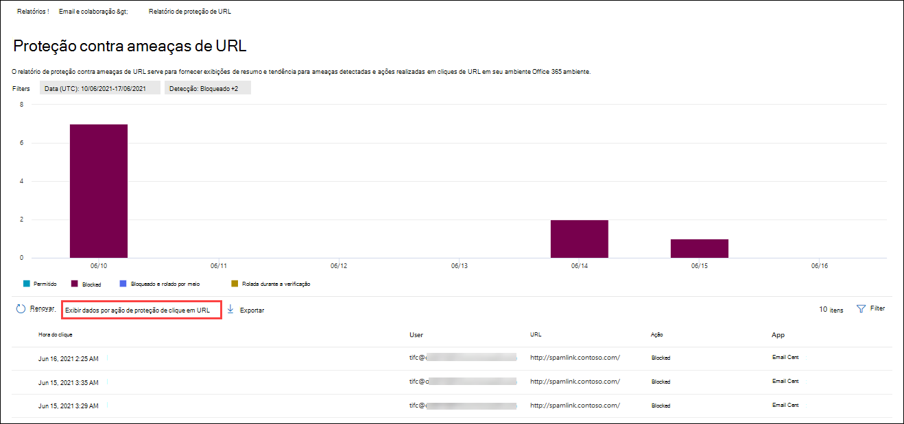

- **URL clique por aplicativo**: mostra o número de cliques de URL por aplicativos que dão suporte a links seguros de ATP do Office 365:

  - **Cliente de email**
  - **PowerPoint**
  - **Word**
  - **Excel**
  - **OneNote**
  - **Visio**
  - **Teams**
  - **Outros**

  Se você clicar em **filtros**, poderá modificar o relatório com os seguintes filtros:

  - **Data de início** e **data de término**
  - Os aplicativos disponíveis.

### Exibição da tabela de detalhes para o relatório de proteção contra ameaças

Se você clicar em **Exibir tabela de detalhes**, o relatório fornecerá uma visão quase em tempo real de todos os cliques que acontecerem na organização pelos últimos 7 dias com os seguintes detalhes:

- **Horário de clique**
- **Usuário**
- **URL**
- **Action**
- **App**

Se você clicar em **filtros** no modo de exibição tabela de detalhes, poderá filtrar pelos mesmos critérios do modo de exibição relatório e também por **domínios** ou **destinatários** separados por vírgulas.

Para voltar para o modo de exibição relatórios, clique em **Exibir relatório**.

## Relatório de mensagens relatadas pelo usuário

O relatório de **mensagens relatadas pelo usuário** mostra informações sobre as mensagens de email que os usuários relataram como lixo eletrônico, tentativas de phishing ou emails de boa qualidade usando o [suplemento de mensagem de relatório](https://docs.microsoft.com/microsoft-365/security/office-365-security/enable-the-report-message-add-in).

Os detalhes estão disponíveis para cada mensagem, incluindo o motivo da entrega, como uma exceção de política de spam ou uma regra de fluxo de email configurada para sua organização. Para exibir detalhes, selecione um item na lista relatórios do usuário e, em seguida, exiba as informações nas guias **Resumo** e **detalhes** .

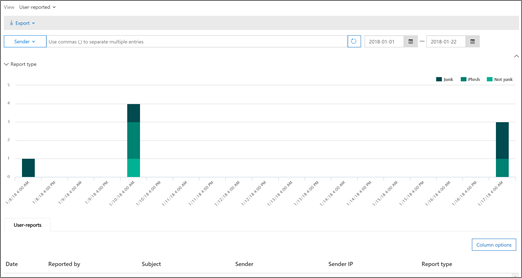

Para exibir esse relatório, no [centro de conformidade & segurança](https://protection.office.com), siga um destes procedimentos:

- Vá para o painel **Gerenciamento** \> **Dashboard** \> **de ameaças mensagens relatadas pelo usuário**.

- Vá para **Gerenciamento de ameaças** \> **revise** \> **mensagens relatadas pelo usuário**.

> [!IMPORTANT]
> Para que o relatório de mensagens relatadas pelo usuário funcione corretamente, o **log de auditoria deve estar ativado** para o seu ambiente do Office 365. Isso geralmente é feito por alguém que tenha a função de logs de auditoria atribuída no Exchange Online. Para obter mais informações, consulte [Ativar ou desativar a pesquisa de log de auditoria da Microsoft 365](https://docs.microsoft.com/microsoft-365/compliance/turn-audit-log-search-on-or-off).

## Quais permissões são necessárias para exibir esses relatórios?

Para exibir e usar os relatórios, você precisa ser membro do grupo de função especificado no centro de conformidade e segurança & **e** no Exchange Online.

- No centro de conformidade & segurança, você precisa ser membro de um dos seguintes grupos de função:

  – Gerenciamento de organização-administrador de segurança (você também pode fazer isso no [centro de administração do Azure Active Directory](https://aad.portal.azure.com) -leitor de segurança

  Para saber mais, confira [Permissões no Centro de Conformidade de Segurança](https://docs.microsoft.com/microsoft-365/security/office-365-security/permissions-in-the-security-and-compliance-center).

- No Exchange Online, você precisa ser membro de um dos grupos de função a seguir:

  – Gerenciamento de organização – gerenciamento de organização somente de exibição-somente os destinatários do gerenciamento de conformidade

Para obter mais informações, consulte [permissões no Exchange Online](https://docs.microsoft.com/Exchange/permissions-exo/permissions-exo) e [gerenciar grupos de função no Exchange Online](https://docs.microsoft.com/Exchange/permissions-exo/role-groups).

## E se os relatórios não estiverem mostrando dados?

Se você não estiver vendo dados nos seus relatórios, verifique se as suas políticas estão configuradas corretamente. Para saber mais, confira [proteção contra ameaças](protect-against-threats.md).

## Tópicos relacionados

[Proteção antispam e antimalware no EOP](anti-spam-and-anti-malware-protection.md)

[Relatórios inteligentes e insights no Centro de Conformidade e Segurança](reports-and-insights-in-security-and-compliance.md)
