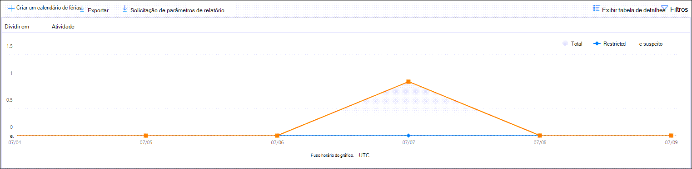
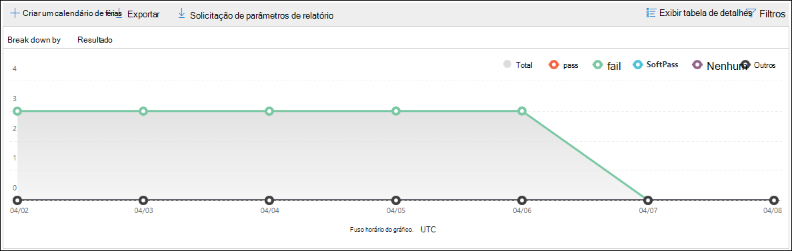

# Exibir relatórios de segurança de email no Centro de Conformidade e SegurançaView email security reports in the Security & Compliance Center

[!INCLUDE [Microsoft 365 Defender rebranding](../includes/microsoft-defender-for-office.md)]

Vários relatórios estão disponíveis no [centro de conformidade & segurança](https://protection.office.com) para ajudá-lo a ver como os recursos de segurança de email, como os recursos antispam, Antimalware e de criptografia no Microsoft 365 estão protegendo sua organização.A variety of reports are available in the [Security & Compliance Center](https://protection.office.com) to help you see how email security features, such as anti-spam, anti-malware, and encryption features in Microsoft 365 are protecting your organization. Se você tiver as [permissões necessárias](#what-permissions-are-needed-to-view-these-reports), poderá exibir esses relatórios no centro de conformidade & de segurança acessando **Reports** o \> **painel** relatórios.If you have the [necessary permissions](#what-permissions-are-needed-to-view-these-reports), you can view these reports in the Security & Compliance Center by going to **Reports** \> **Dashboard**. Para ir diretamente para o painel relatórios, abra <https://protection.office.com/insightdashboard> .To go directly to the Reports dashboard, open <https://protection.office.com/insightdashboard>.

## Relatório de usuários comprometidosCompromised users report

> [!NOTE]
> Este relatório está disponível nas organizações do Microsoft 365 com caixas de correio do Exchange Online.This report is available in Microsoft 365 organizations with Exchange Online mailboxes. Ele não está disponível em organizações autônomas do Exchange Online Protection (EOP).It's not available in standalone Exchange Online Protection (EOP) organizations.

O relatório **usuários comprometidos** mostra o número de contas de usuário que foram marcadas como **suspeitas** ou **restritas** nos últimos sete dias.The **Compromised users** report shows shows the number of user accounts that were marked as **Suspicious** or **Restricted** within the last 7 days. As contas em um desses Estados são problemáticas ou até mesmo comprometidas.Accounts in either of these states are problematic or even compromised. Com o uso frequente, você pode usar o relatório para identificar picos e até mesmo tendências, em contas suspeitas ou restritas.With frequent use, you can use the report to spot spikes, and even trends, in suspicious or restricted accounts. Para obter mais informações sobre usuários comprometidos, consulte [responder a uma conta de email comprometida](responding-to-a-compromised-email-account.md).For more information about compromised users, see [Responding to a compromised email account](responding-to-a-compromised-email-account.md).

O modo de exibição de agregação mostra os dados dos últimos 90 dias e o modo de exibição de detalhes mostra os dados dos últimos 30 dias.The aggregate view shows data for the last 90 days and the detail view shows data for the last 30 days.

Para exibir o relatório, abra o [centro de conformidade & segurança](https://protection.office.com), vá **Reports** para \> **painel** relatórios e selecione **usuários comprometidos**.To view the report, open the [Security & Compliance Center](https://protection.office.com), go to **Reports** \> **Dashboard** and select **Compromised users**. Para ir diretamente para o relatório, abra <https://protection.office.com/reportv2?id=CompromisedUsers> .To go directly to the report, open <https://protection.office.com/reportv2?id=CompromisedUsers>.

Você pode filtrar tanto o gráfico quanto a tabela detalhes clicando em **filtros** e selecionando um ou mais dos seguintes valores:You can filter both the chart and the details table by clicking **Filters** and selecting one or more of the following values:

- **Data de início** e **data de término****Start date** and **End date**

- **Suspeito** : a conta de usuário enviou emails suspeitos e está correndo o risco de ser restrito a enviar emails.**Suspicious** : The user account has sent suspicious email and is at risk of being restricted from sending email.

- **Restricted** : a conta de usuário foi restrita ao envio de emails devido a padrões altamente suspeitos.**Restricted** : The user account has been restricted from sending email due to highly suspicious patterns.

Se você clicar em **Exibir tabela de detalhes** , poderá ver os seguintes detalhes:If you click **View details table** , you can see the following details:

- **Hora de criação****Creation time**
- **ID de usuário****User ID**
- **Ação****Action**

Para voltar para o modo de exibição de relatório, clique em **Exibir relatório**.To go back to the report view, click **View report**.

## Relatório de criptografiaEncryption report

O **relatório de criptografia** está disponível em EOP (inscrições com caixas de correio no Exchange Online ou EOP autônomo sem caixas de correio do Exchange Online).The **Encryption report** is available in EOP (subscriptions with mailboxes in Exchange Online or standalone EOP without Exchange Online mailboxes). A equipe de segurança da sua organização pode usar informações neste relatório para identificar padrões e aplicar proativamente ou ajustar políticas para mensagens de email confidenciais.Your organization's security team can use information in this report to identify patterns and proactively apply or adjust policies for sensitive email messages. Por exemplo:For example:

- Se você vir um grande número de mensagens de email criptografadas por usuários, talvez queira adicionar uma política de criptografia para automatizar a criptografia para determinados casos de uso.If you see a high number of email messages encrypted by users, you might want to add an encryption policy to automate encryption for certain use cases. Para obter mais informações, consulte [definir regras de fluxo de email para criptografar mensagens de email no Microsoft 365](../../compliance/define-mail-flow-rules-to-encrypt-email.md).For more information, see [Define mail flow rules to encrypt email messages in Microsoft 365](../../compliance/define-mail-flow-rules-to-encrypt-email.md).

- Se você tiver vários modelos de criptografia disponíveis, mas nenhum estiver usando, você poderá explorar se os usuários precisam de treinamento de recurso.If you have a number of encryption templates available but no one is using them, you might explore whether users need feature training.

O modo de exibição agregado permite a filtragem dos últimos 90 dias, enquanto o modo de exibição de detalhes permite filtragem por 10 dias.The aggregate view allows filtering for the last 90 days, while the detail view allows filtering for 10 days.

Para exibir o relatório, abra o [centro de conformidade & segurança](https://protection.office.com), vá **Reports** para \> **painel** relatórios e selecione **relatório de criptografia**.To view the report, open the [Security & Compliance Center](https://protection.office.com), go to **Reports** \> **Dashboard** and select **Encryption report**. Para ir diretamente para o relatório, abra <https://protection.office.com/reportv2?id=EncryptionReport> .To go directly to the report, open <https://protection.office.com/reportv2?id=EncryptionReport>.

Para saber mais sobre criptografia, confira [criptografia de email no Microsoft 365](../../compliance/email-encryption.md).To learn more about encryption, see [Email encryption in Microsoft 365](../../compliance/email-encryption.md).

### Exibição de relatório para o relatório de criptografiaReport view for the Encryption report

Você pode usar os seguintes filtros no gráfico:You can use the following filters on the chart:

- **Exibir dados por: relatório de criptografia de mensagens** e **dividir por: método** de criptografia: os seguintes métodos de criptografia estão disponíveis:**View data by: Message Encryption Report** and **Break down by: Encryption method** : The following encryption methods are available:

  - **Criptografia por usuário****Encryption by user**
  - **Criptografia por política****Encryption by policy**

  Se você clicar em **filtros** , poderá modificar o gráfico com os seguintes filtros:If you click **Filters** , you can modify the chart with the following filters:

  - **Data de início** e **data de término****Start date** and **End date**
  - Método de criptografia.Encryption method.
  - Modelo de criptografia.Encryption template.

- **Exibir dados por: relatório de criptografia de mensagens** e **dividir por: modelo** de criptografia: os seguintes métodos de criptografia estão disponíveis:**View data by: Message Encryption Report** and **Break down by: Encryption template** : The following encryption methods are available:

  - **Não encaminhar****Do not forward**
  - **Criptografar apenas****Encrypt only**
  - **OME anterior****OME previous**
  - **Personalizados****Custom**

  Se você clicar em **filtros** , poderá modificar o gráfico com os seguintes filtros:If you click **Filters** , you can modify the chart with the following filters:

  - **Data de início** e **data de término****Start date** and **End date**
  - Método de criptografiaEncryption method
  - Modelo de criptografiaEncryption template

- **Exibir dados por: 5 principais domínios de destinatário** : este modo de exibição mostra um gráfico de pizza com contagens de mensagens enviadas para os cinco domínios de destinatários principais.**View data by: Top 5 recipient domains** : This view shows a pie chart with sent message counts for the top 5 recipient domains.

  Se você clicar em **filtros** , poderá selecionar uma **data de início** e uma **data de término**.If you click **Filters** , you can select a **Start date** and **End date**.

### Exibição da tabela de detalhes para o relatório de criptografiaDetails table view for the Encryption report

Se você clicar em **Exibir tabela de detalhes** , as informações mostradas dependem do gráfico que você estava observando:If you click **View details table** , the information that's shown depends on the chart you were looking at:

- **Dividir em: método de criptografia** ou **dividir por: modelo de criptografia** : as seguintes informações são mostradas:**Break down by: Encryption method** or **Break down by: Encryption template** : The following information is shown:

  - **Date****Date**
  - **Endereço do remetente**.**Sender address**
  - **Modelo de criptografia****Encryption template**
  - **Método de criptografia****Encryption method**
  - **Endereço do destinatário****Recipient address**
  - **Assunto****Subject**

- **Exibir dados por: cinco domínios principais de destinatários** :**View data by: Top 5 recipient domains** :

  - **Date****Date**
  - **Domínio do destinatário****Recipient domain**
  - **Contagem de mensagem****Message count**
  
Se você clicar em **filtros** em um modo de exibição de tabela de detalhes, poderá modificar os resultados com os seguintes filtros:If you click **Filters** in a details table view, you can modify the results with the following filters:

- **Data de início** e **data de término****Start date** and **End date**
- Método de criptografiaEncryption method
- Modelo de criptografiaEncryption template

Para voltar para o modo de exibição de relatório, clique em **Exibir relatório**.To go back to the report view, click **View report**.

## Relatório de status do fluxoMailflow status report

O **relatório de status do fluxo** contém informações sobre malware, spam, phishing e mensagens bloqueadas de borda.The **Mailflow status report** contains information about malware, spam, phishing and edge blocked messages. Para obter mais detalhes, consulte [fluxo status Report](view-mail-flow-reports.md#mailflow-status-report).For more details, see [Mailflow status report](view-mail-flow-reports.md#mailflow-status-report).

## Detecções de malware no relatório de emailMalware detections in email report

O relatório **detecções de malware no email** mostra informações sobre detecções de malware em mensagens de email de entrada e saída (malware detectado pelo Exchange Online Protection ou EOP).The **Malware detections in email** report shows information about malware detections in incoming and outgoing email messages (malware detected by Exchange Online Protection or EOP). Para obter mais informações sobre proteção contra malware no EOP, consulte [Anti-Malware Protection in EOP](anti-malware-protection.md).For more information about malware protection in EOP, see [Anti-malware protection in EOP](anti-malware-protection.md).

 O filtro de exibição agregada permite 90 dias, enquanto o filtro da tabela detalhes permite apenas 10 dias.The aggregate view filter allows for 90 days, while the details table filter only allows for 10 days.

Para exibir o relatório, abra o [centro de conformidade & segurança](https://protection.office.com), vá **Reports** para \> **painel** relatórios e selecione **detecções de malware no email**.To view the report, open the [Security & Compliance Center](https://protection.office.com), go to **Reports** \> **Dashboard** and select **Malware detections in email**. Para ir diretamente para o relatório, abra <https://protection.office.com/reportv2?id=MalwareDetections> .To go directly to the report, open <https://protection.office.com/reportv2?id=MalwareDetections>.

Você pode filtrar tanto o gráfico quanto a tabela detalhes clicando em **filtros** e selecionando:You can filter both the chart and the details table by clicking **Filters** and selecting:

- **Data de início** e **data de término****Start date** and **End date**
- **Entrada****Inbound**
- **Saída****Outbound**

Se você clicar em **Exibir tabela de detalhes** , poderá ver os seguintes detalhes:If you click **View details table** , you can see the following details:

- **Date****Date**
- **Endereço do remetente**.**Sender address**
- **Endereço do destinatário****Recipient address**
- **ID da mensagem** : disponível no campo de cabeçalho **Message-ID** no cabeçalho da mensagem e deve ser exclusivo.**Message ID** : Available in the **Message-ID** header field in the message header and should be unique. Um valor de exemplo é `<08f1e0f6806a47b4ac103961109ae6ef@server.domain>` (Observe os colchetes angulares).An example value is `<08f1e0f6806a47b4ac103961109ae6ef@server.domain>` (note the angle brackets).
- **Assunto****Subject**
- **Filename****Filename**
- **Nome do malware****Malware name**

Para voltar para o modo de exibição de relatório, clique em **Exibir relatório**.To go back to the report view, click **View report**.

## Relatório de email enviado e recebidoSent and received email report

O relatório de **email enviado e recebido** contém informações sobre malware, spam, regras de fluxo de emails (também conhecidas como regras de transporte) e detecções de malware avançadas após o email entrar no serviço.The **Sent and received email** report contains information about malware, spam, mail flow rules (also known as transport rules), and advanced malware detections after email enters the service. Para obter mais informações, consulte [envio e recebimento de email Report](view-mail-flow-reports.md#sent-and-received-email-report).For more information, see [Sent and received email report](view-mail-flow-reports.md#sent-and-received-email-report).

## Relatório de detecções de spamSpam detections report

O relatório **detecções de spam** mostra mensagens de email de spam que foram bloqueadas pelo EOP.The **Spam detections** report shows spam email messages that were blocked by EOP. As mensagens são contadas individualmente, e não por destinatário.Messages are counted individually, not per recipient. Por exemplo, se a mesma mensagem de spam tiver sido enviada para 100 destinatários em sua organização, ela contará como uma mensagem.For example, if the same spam message was sent to 100 recipients in your organization, it counts as one message.

O modo de exibição agregado permite filtragem de 90 dias, enquanto a tabela detalhes permite a filtragem de 10 dias.The aggregate view allows for 90 days filtering, while the details table allows for 10 days filtering.

Para exibir o relatório, abra o [centro de conformidade & segurança](https://protection.office.com), vá **Reports** para \> **painel** relatórios e selecione **detecções de spam**.To view the report, open the [Security & Compliance Center](https://protection.office.com), go to **Reports** \> **Dashboard** and select **Spam detections**. Para ir diretamente para o relatório, abra <https://protection.office.com/reportv2?id=SpamDetections> .To go directly to the report, open <https://protection.office.com/reportv2?id=SpamDetections>.

Para obter mais informações sobre proteção antispam, consulte [proteção antispam no EOP](anti-spam-protection.md).For more information about anti-spam protection, see [Anti-spam protection in EOP](anti-spam-protection.md).

### Exibição de relatório para o relatório de detecções de spamReport view for the Spam detections report

Os gráficos a seguir estão disponíveis no modo de exibição de relatório:The following charts are available in the report view:

- **Dividir por: ação** : os seguintes tipos de eventos são mostrados:**Break down by: Action** : The following event types are shown:

  - **Conteúdo de spam filtrado****Spam content filtered**
  - **Bloqueio de IP de spam****Spam IP block**
  - **Bloco de envelope de spam****Spam envelope block**
  - **Filtro de DBEB de spam** : bloqueio de borda baseado em diretório (DBEB)**Spam DBEB filter** : Directory based edge blocking (DBEB)

  Ao passar o mouse sobre um dia (ponto de dados) no gráfico, você pode ver quantos itens foram bloqueados naquele dia, bem como os itens que foram categorizados.When you hover over a day (data point) in the chart, you can see how many items were blocked that day, as well as how those items are categorized.

  

- Dividido **por: direção** : as seguintes direções são exibidas:**Break down by: Direction** : The following directions are shown:

  - **Entrada****Inbound**
  - **Saída****Outbound**

  

Se você clicar em **filtros** em um modo de exibição de relatório, poderá modificar os resultados com os seguintes filtros:If you click **Filters** in a report view, you can modify the results with the following filters:

- **Data de início** e **data de término****Start date** and **End date**
- Valores de direçãoDirection values
- Valores de tipo de eventoEvent type values

### Exibição da tabela de detalhes para o relatório de detecções de spamDetails table view for the Spam detections report

Se você clicar em **Exibir tabela de detalhes** em qualquer modo de exibição de relatório, as seguintes informações serão exibidas:If you click **View details table** in any report view, the following information is shown:

- **Date****Date**
- **Endereço do remetente**.**Sender address**
- **Endereço do destinatário****Recipient address**
- **Tipo de evento****Event type**
- **Ação****Action**
- **Assunto****Subject**

Se você clicar em **filtros** em uma tabela de detalhes, poderá modificar os resultados com os seguintes filtros:If you click **Filters** in a details table, you can modify the results with the following filters:

- **Data de início** e **data de término****Start date** and **End date**
- Valores de direçãoDirection values
- Valores de tipo de eventoEvent type values

Para voltar para o modo de exibição de relatório, clique em **Exibir relatório**.To go back to the report view, click **View report**.

## Relatório de detecções falsasSpoof detections report

O relatório de **detecções falsas** mostra quantas mensagens de email de falsificação foram detectadas, e dessas, quais foram consideradas "boas" (emails falsos realizados por motivos de negócios legítimos).The **Spoof detections** report shows how many spoof mail messages were detected, and of those, which ones were considered "good" (spoof mail done for legitimate business reasons). Para obter mais informações sobre falsificação, consulte [proteção contra falsificação no EOP](anti-spoofing-protection.md).For more information about spoofing, see [Anti-spoofing protection in EOP](anti-spoofing-protection.md).

O modo de exibição de agregação do relatório permite 90 dias de filtragem, enquanto o modo de exibição de detalhes permite apenas dez dias de filtragem.The aggregate view of the report allows for 90 days of filtering, while the detail view only allows for ten days of filtering.

Para exibir o relatório, abra o [centro de conformidade & segurança](https://protection.office.com), vá **Reports** para \> **painel** relatórios e selecione **detecções falsas**.To view the report, open the [Security & Compliance Center](https://protection.office.com), go to **Reports** \> **Dashboard** and select **Spoof detections**. Para ir diretamente para o relatório, abra <https://protection.office.com/reportv2?id=SpoofMailReport> .To go directly to the report, open <https://protection.office.com/reportv2?id=SpoofMailReport>.

Ao passar o mouse sobre um dia (ponto de dados) no gráfico, você pode ver quantas mensagens de email de falsificação vieram.When you hover over a day (data point) in the chart, you can see how many spoof mail messages came through.

Você pode filtrar tanto o gráfico quanto a tabela detalhes clicando em **filtros** e selecionando um ou mais dos seguintes valores:You can filter both the chart and the details table by clicking **Filters** and selecting one or more of the following values:

- **Data de início** e **data de término****Start date** and **End date**

- **Boa mensagem****Good mail**

- **Detectado como spam****Caught as spam**

Se você clicar em **Exibir tabela de detalhes** , poderá ver os seguintes detalhes:If you click **View details table** , you can see the following details:

- **Date****Date**
- **Remetente falsificado****Spoofed sender**
- **Remetente verdadeiro****True sender**
- **IP do remetente****Sender IP**
- **Ação****Action**
- **Contagem de mensagem****Message count**

Para voltar para o modo de exibição de relatório, clique em **Exibir relatório**.To go back to the report view, click **View report**.

## Relatório de status de proteção contra ameaçasThreat protection status report

O relatório de **status de proteção contra ameaças** está disponível no EOP e no Microsoft defender para Office 365; no entanto, os relatórios contêm dados diferentes.The **Threat protection status** report is available in both EOP and Microsoft Defender for Office 365; however, the reports contain different data. Por exemplo, os clientes do EOP podem exibir informações sobre malware detectado no email, mas não informações sobre [arquivos mal-intencionados detectados pela ATP para SharePoint, onedrive ou Microsoft Teams](atp-for-spo-odb-and-teams.md).For example, EOP customers can view information about malware detected in email, but not information about [malicious files detected by ATP for SharePoint, OneDrive, or Microsoft Teams](atp-for-spo-odb-and-teams.md).

O relatório fornece a contagem de mensagens de email com conteúdo mal-intencionado, como arquivos ou endereços de sites (URLs) que foram bloqueados pelo Mecanismo Antimalware, [exclusão automática de zero horas (zap)](zero-hour-auto-purge.md)e recursos do defender para Office 365, como [links seguros](atp-safe-links.md), [anexos seguros](atp-safe-attachments.md)e [anti-phishing](set-up-anti-phishing-policies.md).The report provides the count of email messages with malicious content, such as files or website addresses (URLs) that were blocked by the anti-malware engine, [zero-hour auto purge (ZAP)](zero-hour-auto-purge.md), and Defender for Office 365 features like [Safe Links](atp-safe-links.md), [Safe Attachments](atp-safe-attachments.md), and [Anti-phishing](set-up-anti-phishing-policies.md). Você pode usar essas informações para identificar tendências ou determinar se as políticas da organização precisam de ajuste.You can use this information to identify trends or determine whether organization policies need adjustment. É importante entender que, se uma mensagem for enviada para cinco destinatários, contaremos como cinco mensagens diferentes e não uma mensagem.It's important to understand that if a message is sent to five recipients we count it as five different messages and not one message.

Para exibir o relatório, abra o [centro de conformidade & segurança](https://protection.office.com), vá **Reports** para \> **painel** relatórios e selecione **status de proteção contra ameaças**.To view the report, open the [Security & Compliance Center](https://protection.office.com), go to **Reports** \> **Dashboard** and select **Threat protection status**. Para ir diretamente para o relatório, abra uma das seguintes URLs:To go directly to the report, open one of the following URLs:

- Microsoft defender para Office 365: <https://protection.office.com/reportv2?id=TPSAggregateReportATP>Microsoft Defender for Office 365: <https://protection.office.com/reportv2?id=TPSAggregateReportATP>
- EOP <https://protection.office.com/reportv2?id=TPSAggregateReport>EOP: <https://protection.office.com/reportv2?id=TPSAggregateReport>

Por padrão, o gráfico mostra os dados dos últimos 7 dias.By default, the chart shows data for the past 7 days. Se você clicar em **filtros** , poderá selecionar um intervalo de data de 90 dias (as assinaturas de avaliação podem ser limitadas a 30 dias).If you click **Filters** , you can select a 90 day date range (trial subscriptions might be limited to 30 days). O modo de exibição tabela de detalhes permite a filtragem por 30 dias.The details table view allows filtering for 30 days.

### Exibição de relatório para o relatório de status de proteção contra ameaçasReport view for the Threat protection status report

Os seguintes modos de exibição estão disponíveis:The following views are available:

- **Exibir dados por: visão geral** : as seguintes informações de detecção são exibidas:**View data by: Overview** : The following detection information is shown:

  - **Malware de email****Email malware**
  - **Phishing de email****Email phish**
  - **Malware de conteúdo****Content malware**

  

- **Exibir dados por: conteúdo \> Malware**1: as informações a seguir são mostradas para as organizações do Microsoft Defender para Office 365:**View data by: Content \> Malware**1: The following information is shown for Microsoft Defender for Office 365 organizations:

  - **Mecanismo Antimalware** : captura de arquivos mal-intencionados no SharePoint Online, no onedrive e no Microsoft Teams por anti-malware.**Anti-malware engine** : Catches of malicious files in Sharepoint Online, OneDrive, and Teams by anti-malware.
  - **Arquivo acionamento** : acionamento de arquivos mal-intencionados no SharePoint Online, no onedrive e no Microsoft Teams por anexos seguros.**File detonation** : Detonation of malicious files in Sharepoint Online, OneDrive, and Teams by Safe Attachments.

  

- **Exibir dados por: substituição de mensagens** : as seguintes informações de motivo de substituição são exibidas:**View data by: Message Override** : The following override reason information is shown:

  - **Ignorar local****On-premises skip**
  - **Permissão de IP****IP Allow**
  - **Regra de fluxo de emails****Mail flow rule**
  - **Permissão de remetente****Sender allow**
  - **Permissão de domínio****Domain allow**
  - **ZAP não habilitado****ZAP not enabled**
  - **Pasta lixo eletrônico não habilitada****Junk Mail folder not enabled**
  - **Remetente seguro do usuário****User Safe Sender**
  - **Domínio seguro do usuário****User Safe Domain**

  

- **Divida por: tecnologia de detecção** e **exibir dados por: \> Phish de email** : as informações a seguir são exibidas:**Break down by: Detection technology** and **View data by: Email \> Phish** : The following information is shown:

  - **Reputação de URL gerada por ATP**: reputaçãode URL mal-intencionado gerada a partir do defender para Office 365 detonations em outros clientes do Office 365.**ATP-generated URL reputation**1: Malicious URL reputation generated from Defender for Office 365 detonations in other Defender for Office 365 customers.
  - **Filtro avançado de Phish** : sinais de phishing baseados no Machine Learning.**Advanced phish filter** : Phishing signals based on machine learning.
  - **Falha antifalsificação do DMARC** : falha na autenticação do DMARC nas mensagens.**Anti-spoof - DMARC failure** : DMARC authentication failure on messages.
  - **Anti-spoof-intra-org** : o remetente está tentando falsificar o domínio do destinatário.**Anti-spoof - intra-org** : Sender is trying to spoof the recipient domain.
  - **Antifalsificação-domínio externo** : o remetente está tentando falsificar outro domínio.**Anti-spoof - external domain** : Sender is trying to spoof some other domain.
  - **Representação da marca** : representação de marcas conhecidas com base nos remetentes.**Brand impersonation** : Impersonation of well-known brands based on senders.
  - **Representação de domínio**1: representação de domínios pertencentes ao cliente ou definição.**Domain impersonation**1: Impersonation of domains that the customer owns or defines.
  - **Reputação da URL do EOP** : reputação de URL mal-intencionado.**EOP URL reputation** : Malicious URL reputation.
  - **Filtro de phishing geral** : sinais de phishing com base em regras de analista.**General phish filter** : Phishing signals based on analyst rules. 
  - **Outros****Others**
  - **Phish zap**2: mensagens de phishing de limpeza automática de zero hora.**Phish ZAP**2: Zero hour auto purge phishing messages.
  - **URL acionamento**1**URL detonation**1
  - **Representação de usuário**1: representação de usuários definidos por administrador ou aprendidos por meio da inteligência de caixa de correio.**User impersonation**1: Impersonation of users defined by admin or learned through mailbox intelligence.

  

- **Divida por: tecnologia de detecção** e **exibir dados por: \> malware de email** : as informações a seguir são exibidas:**Break down by: Detection technology** and **View data by: Email \> Malware** : The following information is shown:

  - **Reputação de arquivo gerado por ATP**: toda a reputação dearquivos mal-intencionados gerada pelo defender para Office 365 detonations.**ATP-generated file reputation**1: All malicious file reputation generated by Defender for Office 365 detonations.
  - **Mecanismo anti-malware**1: detecção de mecanismos antimalware.**Anti-malware engine**1: Detection from anti-malware engines.
  - **Bloqueio de tipo de arquivo de política Antimalware** : Estas são mensagens de email filtradas devido ao tipo de arquivo mal-intencionado identificado na mensagem.**Anti-malware policy file type block** : These are email messages filtered out due to the type of malicious file identified in the message.
  - **Arquivo acionamento**1: o arquivo acionamento captura por anexos seguros.**File detonation**1: File detonation catches by Safe Attachments.  
  - **Reputação de arquivos mal-intencionados****Malicious file reputation**
  - **Malware zap**2**Malware ZAP**2
  - **Outros****Others**

  

- **Divida por: tipo de política** e **exibir dados por: \> Phish de emails** ou **exibir dados por: \> malware de email** : as seguintes informações são mostradas:**Break down by: Policy type** and **View data by: Email \> Phish** or **View data by: Email \> Malware** : The following information is shown:

  - **Anti-malware****Anti-malware**
  - **Anexo seguro**1**Safe Attachment**1
  - **Anti-Phish****Anti-phish**
  - **Antispam****Anti-spam**
  - **Regra de fluxo de emails** (também conhecida como regra de transporte)**Mail flow rule** (also known as a transport rule)
  - **Outros****Others**

  

- **Dividir em: status de entrega** e **exibir dados por: \> Phish de emails** ou **exibir dados por: \> malware de email** : as informações a seguir são exibidas:**Break down by: Delivery status** and **View data by: Email \> Phish** or **View data by: Email \> Malware** : The following information is shown:

  - **Falha na entrega****Delivery failed**
  - **Abandonado****Dropped**
  - **Encaminhadas****Forwarded**
  - **Caixa de correio hospedada: pasta personalizada****Hosted mailbox: Custom folder**
  - **Caixa de correio hospedada: itens excluídos****Hosted mailbox: Deleted items**
  - **Caixa de correio hospedada: caixa de entrada****Hosted mailbox: Inbox**
  - **Caixa de correio hospedada: lixo eletrônico****Hosted mailbox: Junk**
  - **Servidor local: entregue****On-premises server: Delivered**
  - **Quarentena****Quarantine**

  

1 defender apenas para o Office 3651 Defender for Office 365 only

2 a limpeza automática de zero horas (zap) não está disponível no EOP autônomo (funciona apenas em caixas de correio do Exchange Online).2 Zero-hour auto purge (ZAP) isn't available in standalone EOP (it only works in Exchange Online mailboxes).

Se você clicar em **filtros** , os filtros disponíveis dependerão do gráfico que você estava examinando:If you click **Filters** , the filters available depends on the chart you were looking at:

Para **\> malware de conteúdo** , você pode modificar o relatório por **data de início** e **data de término** e o valor de **detecção** .For **Content \> Malware** , you can modify the report by **Start date** and **End date** , and the **Detection** value.

Para **substituição de mensagens** , você pode modificar o relatório com os seguintes filtros:For **Message Override** , you can modify the report with the following filters:

- **Data de início** e **data de término****Start date** and **End date**
- **Motivo da substituição****Override Reason**
- **Marca** : filtrar por marca para retornar usuários ou grupos que tiveram uma marca específica aplicada.**Tag** : filter by tag to return users or groups that have had a specific tag applied. Para obter mais informações sobre marcas de usuário, consulte [User Tags](user-tags.md).For more information about user tags, see [User tags](user-tags.md).
- **Domínio****Domain**

Para todos os outros modos de exibição, você pode modificar o relatório com os seguintes filtros:For all other views, you can modify the report with the following filters:

- **Data de início** e **data de término****Start date** and **End date**
- **Detecção****Detection**
- **Protegido por** : **ATP** ou **EOP****Protected by** : **ATP** or **EOP**
- **Marca** : filtrar por marca para retornar usuários ou grupos que tiveram uma marca específica aplicada.**Tag** : filter by tag to return users or groups that have had a specific tag applied. Para obter mais informações sobre marcas de usuário, consulte [User Tags](user-tags.md).For more information about user tags, see [User tags](user-tags.md).
- **Domínio****Domain**

### Exibição da tabela de detalhes para o relatório de status de proteção contra ameaçasDetails table view for the Threat protection status report

Se você clicar em **Exibir tabela de detalhes** , as informações mostradas dependem do gráfico que você estava observando:If you click **View details table** , the information that's shown depends on the chart you were looking at:

- **Exibir dados por: conteúdo \> Malware** :**View data by: Content \> Malware** :

  - **Date****Date**
  - **Location****Location**
  - **Direcionado por****Directed by**
  - **Nome do malware****Malware name**

Se você clicar em **filtros** neste modo de exibição, poderá modificar o relatório por **data de início** e data de **término** e o valor de **detecção** .If you click **Filters** in this view, you can modify the report by **Start date** and **End date** , and the **Detection** value.

- **Exibir dados por: substituição de mensagem** :**View data by: Message Override** :

  - **Date****Date**
  - **Assunto****Subject**
  - **Sender****Sender**
  - **Destinatários****Recipients**
  - **Detectado por****Detected by**
  - **Motivo da substituição****Override Reason**
  - **Origem de comprometimento****Source of Compromise**
  - **Marcas****Tags**

Se você clicar em **filtros** neste modo de exibição, poderá modificar o relatório com os seguintes filtros:If you click **Filters** in this view, you can modify the report with the following filters:

- **Data de início** e **data de término****Start date** and **End date**
- **Motivo da substituição****Override Reason**
- **Marca** : filtrar por marca para retornar usuários ou grupos que tiveram uma marca específica aplicada.**Tag** : filter by tag to return users or groups that have had a specific tag applied. Para obter mais informações sobre marcas de usuário, consulte [User Tags](user-tags.md).For more information about user tags, see [User tags](user-tags.md).
- **Domínio****Domain**
- **Destinatários** (Observe que essa propriedade Filterable só está disponível no modo de exibição tabela de detalhes)**Recipients** (Note that this filterable property is only available in the details table view)

**Exibir dados por: visão geral** : não há botão **Exibir tabela detalhes** disponível.**View data by: Overview** : No **View details table** button is available.

- Todos os outros gráficos:All other charts:

  - **Date****Date**
  - **Assunto****Subject**
  - **Sender****Sender**
  - **Destinatários****Recipients**
  - **Detectado por****Detected by**
  - **Status de entrega****Delivery Status**
  - **Origem de comprometimento****Source of Compromise**
  - **Marcas****Tags**

Se você clicar em **filtros** , poderá modificar o relatório com os seguintes filtros:If you click **Filters** , you can modify the report with the following filters:

- **Data de início** e **data de término****Start date** and **End date**
- **Detecção****Detection**
- **Protegido por** : **Defender para Office 365** ou **EOP****Protected by** : **Defender for Office 365** or **EOP**
- **Marca** : filtrar por marca para retornar usuários ou grupos que tiveram uma marca específica aplicada.**Tag** : filter by tag to return users or groups that have had a specific tag applied. Para obter mais informações sobre marcas de usuário, consulte [User Tags](user-tags.md).For more information about user tags, see [User tags](user-tags.md).
- **Domínio****Domain**
- **Destinatários** (Observe que essa propriedade Filterable só está disponível no modo de exibição tabela de detalhes)**Recipients** (Note that this filterable property is only available in the details table view)

## Relatório de malware superiorTop malware report

O relatório de **malware superior** mostra os vários tipos de malware detectados pela [proteção Antimalware no EOP](anti-malware-protection.md).The **Top malware** report shows the various kinds of malware that was detected by [anti-malware protection in EOP](anti-malware-protection.md).

Para exibir o relatório, abra o [centro de conformidade & segurança](https://protection.office.com), vá **Reports** para \> **painel** relatórios e selecione **malware superior**.To view the report, open the [Security & Compliance Center](https://protection.office.com), go to **Reports** \> **Dashboard** and select **Top malware**. Para ir diretamente para o relatório, abra <https://protection.office.com/reportv2?id=TopMalware> .To go directly to the report, open <https://protection.office.com/reportv2?id=TopMalware>.

Ao passar o mouse sobre uma fatia no gráfico de pizza, você pode ver o nome de um tipo de malware e quantas mensagens foram detectadas como tendo esse malware.When you hover over a wedge in the pie chart, you can see the name of a kind of malware and how many messages were detected as having that malware.

Se você clicar em **Exibir tabela de detalhes** , poderá ver os seguintes detalhes:If you click **View details table** , you can see the following details:

- **Principais malware****Top malware**
- **Count****Count**

Se você clicar em **filtros** no modo de exibição relatório ou tabela de detalhes, poderá especificar um intervalo de datas com **data de início** e data de **término**.If you click **Filters** in the report view or details table view, you can specify a date range with **Start date** and **End date**.

## Relatório de proteção contra ameaças de URLURL threat protection report

O **relatório de proteção contra ameaças de URL** está disponível no Microsoft defender para Office 365.The **URL threat protection report** is available in Microsoft Defender for Office 365. Para saber mais, confira [relatório de proteção contra ameaças de URL](view-reports-for-atp.md#url-threat-protection-report).For more information, see [URL threat protection report](view-reports-for-atp.md#url-threat-protection-report).

## Relatório de mensagens relatadas pelo usuárioUser-reported messages report

O relatório de **mensagens relatadas pelo usuário** mostra informações sobre as mensagens de email que os usuários relataram como lixo eletrônico, tentativas de phishing ou emails de boa qualidade usando o [suplemento de mensagem de relatório](https://docs.microsoft.com/microsoft-365/security/office-365-security/enable-the-report-message-add-in).The **User-reported messages** report shows information about email messages that users have reported as junk, phishing attempts, or good mail by using the [Report Message add-in](https://docs.microsoft.com/microsoft-365/security/office-365-security/enable-the-report-message-add-in).

Os detalhes estão disponíveis para cada mensagem, incluindo o motivo da entrega, como uma exceção de política de spam ou uma regra de fluxo de email configurada para sua organização.Details are available for each message, including the delivery reason, such a spam policy exception or mail flow rule configured for your organization. Para exibir detalhes, selecione um item na lista relatórios do usuário e, em seguida, exiba as informações nas guias **Resumo** e **detalhes** .To view details, select an item in the user-reports list, and then view the information on the **Summary** and **Details** tabs.

Para exibir esse relatório, no [centro de conformidade & segurança](https://protection.office.com), siga um destes procedimentos:To view this report, in the [Security & Compliance Center](https://protection.office.com), do one of the following:

- Vá para o painel **Gerenciamento** \> **Dashboard** \> **de ameaças mensagens relatadas pelo usuário**.Go to **Threat management** \> **Dashboard** \> **User-reported messages**.

- Vá para **Gerenciamento de ameaças** \> **revise** \> **mensagens relatadas pelo usuário**.Go to **Threat management** \> **Review** \> **User-reported messages**.

> [!IMPORTANT]
> Para que o relatório de mensagens relatadas pelo usuário funcione corretamente, o **log de auditoria deve estar ativado** para o seu ambiente do Office 365.In order for the User-reported messages report to work correctly, **audit logging must be turned on** for your Office 365 environment. Isso geralmente é feito por alguém que tenha a função de logs de auditoria atribuída no Exchange Online.This is typically done by someone who has the Audit Logs role assigned in Exchange Online. Para obter mais informações, consulte [Ativar ou desativar a pesquisa de log de auditoria da Microsoft 365](https://docs.microsoft.com/microsoft-365/compliance/turn-audit-log-search-on-or-off).For more information, see [Turn Microsoft 365 audit log search on or off](https://docs.microsoft.com/microsoft-365/compliance/turn-audit-log-search-on-or-off).

## Quais permissões são necessárias para exibir esses relatórios?What permissions are needed to view these reports?

Para exibir e usar os relatórios, você precisa ser membro do grupo de função especificado no centro de conformidade e segurança & **e** no Exchange Online.To view and use the reports, you need to be a member of the specified role group in the Security & Compliance Center **and** in Exchange Online.

- No centro de conformidade & segurança, você precisa ser membro de um dos seguintes grupos de função:In the Security & Compliance Center, you need to be a member of one of the following role groups:

  – Gerenciamento de organização-administrador de segurança (você também pode fazer isso no [centro de administração do Azure Active Directory](https://aad.portal.azure.com) -leitor de segurança-Organization Management -Security Administrator (you can also do this in the [Azure Active Directory admin center](https://aad.portal.azure.com) -Security Reader

  Para saber mais, confira [Permissões no Centro de Conformidade de Segurança](https://docs.microsoft.com/microsoft-365/security/office-365-security/permissions-in-the-security-and-compliance-center).For more information, see [Permissions in the Security & Compliance Center](https://docs.microsoft.com/microsoft-365/security/office-365-security/permissions-in-the-security-and-compliance-center).

- No Exchange Online, você precisa ser membro de um dos grupos de função a seguir:In Exchange Online, you need to be a member of one of the following role groups:

  – Gerenciamento de organização – gerenciamento de organização somente de exibição-somente os destinatários do gerenciamento de conformidade-Organization Management -View-only Organization Management -View-Only Recipients -Compliance Management

Para obter mais informações, consulte [permissões no Exchange Online](https://docs.microsoft.com/Exchange/permissions-exo/permissions-exo) e [gerenciar grupos de função no Exchange Online](https://docs.microsoft.com/Exchange/permissions-exo/role-groups).For more information, see [Permissions in Exchange Online](https://docs.microsoft.com/Exchange/permissions-exo/permissions-exo) and [Manage role groups in Exchange Online](https://docs.microsoft.com/Exchange/permissions-exo/role-groups).

## E se os relatórios não estiverem mostrando dados?What if the reports aren't showing data?

Se você não estiver vendo dados nos seus relatórios, verifique se as suas políticas estão configuradas corretamente.If you are not seeing data in your reports, double-check that your policies are set up correctly. Para saber mais, confira [proteção contra ameaças](protect-against-threats.md).To learn more, see [Protect against threats](protect-against-threats.md).

## Tópicos relacionadosRelated topics

[Proteção antispam e antimalware no EOPAnti-spam and anti-malware protection in EOP](anti-spam-and-anti-malware-protection.md)

[Relatórios inteligentes e insights no Centro de Conformidade e SegurançaSmart reports and insights in the Security & Compliance Center](reports-and-insights-in-security-and-compliance.md)

[Exibir relatórios de fluxo de emails no centro de conformidade & segurançaView mail flow reports in the Security & Compliance Center](view-mail-flow-reports.md)

[Exibir relatórios do defender para Office 365View reports for Defender for Office 365](view-reports-for-atp.md)
