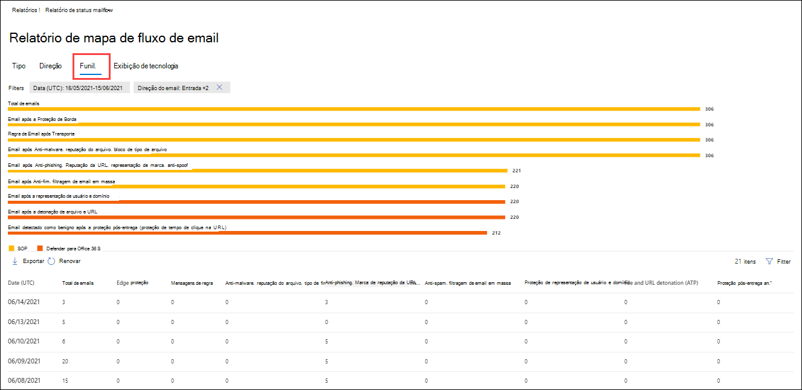
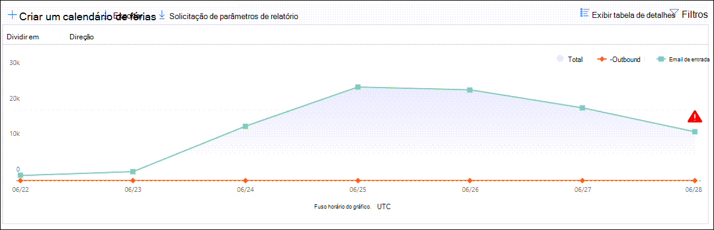

# Exibir relatórios de segurança de email no portal do Microsoft 365 DefenderView email security reports in the Microsoft 365 Defender portal

[!INCLUDE [Microsoft 365 Defender rebranding](../includes/microsoft-defender-for-office.md)]

**Aplica-se a****Applies to**
- [Proteção do Exchange OnlineExchange Online Protection](exchange-online-protection-overview.md)
- [Plano 1 e plano 2 do Microsoft Defender para Office 365Microsoft Defender for Office 365 plan 1 and plan 2](defender-for-office-365.md)
- [Microsoft 365 DefenderMicrosoft 365 Defender](../defender/microsoft-365-defender.md)

Vários relatórios estão disponíveis no portal do Microsoft 365 Defender para ajudá-lo a ver como os recursos de segurança de email, como anti-spam, anti-malware e recursos de criptografia no Microsoft 365 estão protegendo sua <https://security.microsoft.com> organização.A variety of reports are available in the Microsoft 365 Defender portal at <https://security.microsoft.com> to help you see how email security features, such as anti-spam, anti-malware, and encryption features in Microsoft 365 are protecting your organization. Se você tiver as permissões [necessárias,](#what-permissions-are-needed-to-view-these-reports)poderá exibir esses relatórios no portal  do Microsoft 365 Defender, indo para Relatórios Email & colaboração \>  \> **Email & relatórios de colaboração**.If you have the [necessary permissions](#what-permissions-are-needed-to-view-these-reports), you can view these reports in the Microsoft 365 Defender portal by going to **Reports** \> **Email & collaboration** \> **Email & collaboration reports**. Para ir diretamente para a página Relatórios de **colaboração & email,** abra <https://security.microsoft.com/emailandcollabreport> .To go directly to the **Email & collaboration reports** page, open <https://security.microsoft.com/emailandcollabreport>.

> [!NOTE]
>
> Alguns dos relatórios na página Relatórios de & **de** colaboração exigem o Microsoft Defender para Office 365.Some of the reports on the **Email & collaboration reports** page require Microsoft Defender for Office 365. Para obter informações sobre esses relatórios, consulte [View Defender for Office 365 reports in the Microsoft 365 Defender portal](view-reports-for-mdo.md).For information about these reports, see [View Defender for Office 365 reports in the Microsoft 365 Defender portal](view-reports-for-mdo.md).
>
> Os relatórios relacionados ao fluxo de emails agora estão no Centro de administração do Exchange (EAC).Reports that are related to mail flow are now in the Exchange admin center (EAC). Para obter mais informações sobre esses relatórios, consulte [Mail flow reports in the new Exchange admin center](/exchange/monitoring/mail-flow-reports/mail-flow-reports).For more information about these reports, see [Mail flow reports in the new Exchange admin center](/exchange/monitoring/mail-flow-reports/mail-flow-reports).

## Relatório de usuários comprometidosCompromised users report

> [!NOTE]
> Este relatório está disponível em organizações do Microsoft 365 com caixas de correio do Exchange Online.This report is available in Microsoft 365 organizations with Exchange Online mailboxes. Ele não está disponível em organizações autônomas do Exchange Online Protection (EOP).It's not available in standalone Exchange Online Protection (EOP) organizations.

O **relatório Usuários Comprometidos** mostra o número de contas de usuário que foram marcadas como **Suspeitas** ou **Restritas** nos últimos 7 dias.The **Compromised users** report shows shows the number of user accounts that were marked as **Suspicious** or **Restricted** within the last 7 days. As contas em qualquer um desses estados são problemáticas ou até mesmo comprometidas.Accounts in either of these states are problematic or even compromised. Com o uso frequente, você pode usar o relatório para detectar picos e até tendências, em contas suspeitas ou restritas.With frequent use, you can use the report to spot spikes, and even trends, in suspicious or restricted accounts. Para obter mais informações sobre usuários comprometidos, consulte [Respondendo a uma conta de email comprometida.](responding-to-a-compromised-email-account.md)For more information about compromised users, see [Responding to a compromised email account](responding-to-a-compromised-email-account.md).

A exibição agregada mostra os dados dos últimos 90 dias e a exibição de detalhes mostra os dados dos últimos 30 dias.The aggregate view shows data for the last 90 days and the detail view shows data for the last 30 days.

Para exibir o relatório no portal do Microsoft 365 Defender, acesse **Relatórios** \> **Email & colaboração** Email & relatórios de \> **colaboração**.To view the report in the Microsoft 365 Defender portal, go to **Reports** \> **Email & collaboration** \> **Email & collaboration reports**. Em **Usuários comprometidos,** clique **em Exibir detalhes.**On **Compromised users**, click **View details**. Para ir diretamente para o relatório, abra <https://security.microsoft.com/reports/CompromisedUsers> .To go directly to the report, open <https://security.microsoft.com/reports/CompromisedUsers>.

Depois de clicar em **Exibir** detalhes, você pode filtrar o gráfico e a tabela de detalhes clicando em **Filtrar** e selecionando um ou mais dos seguintes valores no flyout que aparece:After you click **View details**, you can filter both the chart and the details table by clicking **Filter** and selecting one or more of the following values in the flyout that appears:

- **Data (UTC)**: Data **de início** **e data de término.****Date (UTC)**: **Start date** and **End date**.
- **Atividade**:**Activity**:
  - **Suspeito**: a conta de usuário enviou emails suspeitos e corre o risco de ser restringida ao envio de emails.**Suspicious**: The user account has sent suspicious email and is at risk of being restricted from sending email.
  - **Restrito**: a conta de usuário foi restrita ao envio de emails devido a padrões altamente suspeitos.**Restricted**: The user account has been restricted from sending email due to highly suspicious patterns.

Quando terminar a filtragem, clique em **Aplicar ou** **Cancelar.**When you're finished filtering, click **Apply** or **Cancel**.

Na tabela abaixo do gráfico, você pode ver os seguintes detalhes:In the table below the graph, you can see the following details:

- **Hora da criação****Creation time**
- **ID de usuário****User ID**
- **Action****Action**

## Relatório de regra de transporte do ExchangeExchange transport rule report

O **relatório de regra de** transporte do Exchange mostra o efeito das regras de fluxo de emails (também conhecidas como regras de transporte) em mensagens de entrada e saída em sua organização.The **Exchange transport rule** report shows the effect of mail flow rules (also known as transport rules) on incoming and outgoing messages in your organization.

Para exibir o relatório no portal do Microsoft 365 Defender, acesse **Relatórios** \> **Email & colaboração** Email & relatórios de \> **colaboração**.To view the report in the Microsoft 365 Defender portal, go to **Reports** \> **Email & collaboration** \> **Email & collaboration reports**. Na **regra de transporte do Exchange,** clique em Exibir **detalhes.**On **Exchange transport rule**, click **View details**. Para ir diretamente para o relatório, abra <https://security.microsoft.com/reports/ETRRuleReport> .To go directly to the report, open <https://security.microsoft.com/reports/ETRRuleReport>.

Depois de clicar **em Exibir detalhes,** os seguintes gráficos e dados estarão disponíveis:After you click **View details**, the following charts and data are available:

- **Exibir dados por regras de transporte do** \> Exchange **Divisão de gráficos por Direção**: este  gráfico mostra o número **de** mensagens de Entrada e Saída que foram afetadas pelas regras de fluxo de emails.**View data by Exchange transport rules** \> **Chart breakdown by Direction**: This chart shows the number of **Inbound** and **Outbound** messages that were affected by mail flow rules.

- **Exibir dados por regras de transporte do** \> Exchange **Divisão de gráficos por Gravidade**: este gráfico mostra o número de mensagens de Alta **gravidade,** Gravidade **média** e **Baixa gravidade.****View data by Exchange transport rules** \> **Chart breakdown by Severity**: This chart shows the number of **High severity**, **Medium severity**, and **Low severity** messages. Você definirá o nível de gravidade como uma ação na regra (**Audite essa** regra com nível de gravidade ou _SetAuditSeverity_).You set the severity level as an action in the rule (**Audit this rule with severity level** or _SetAuditSeverity_). Para obter mais informações, consulte [Ações de regra de fluxo de email no Exchange Online](/Exchange/security-and-compliance/mail-flow-rules/mail-flow-rule-actions).For more information, see [Mail flow rule actions in Exchange Online](/Exchange/security-and-compliance/mail-flow-rules/mail-flow-rule-actions).

- **Exibir dados por regras de transporte do Exchange** \> DLP **Divisão de gráficos** por Direção  : este  gráfico mostra o número de mensagens de entrada e saída que foram afetadas pelas regras de fluxo de emails de prevenção contra perda de dados (DLP).**View data by DLP Exchange transport rules** \> **Chart breakdown by Direction**: This chart shows the number of **Inbound** and **Outbound** messages that were affected by data loss prevention (DLP) mail flow rules.

- **Exibir dados por regras de transporte do Exchange** \> DLP **Divisão de gráficos por Severidade**: Este ponto de exibição mostra o número de mensagens de alta **gravidade,** gravidade média e Baixa gravidade que foram afetadas pelas regras de fluxo de emails DLP. **View data by DLP Exchange transport rules** \> **Chart breakdown by Severity**: This view shows the number of **High severity**, **Medium severity**, and **Low severity** messages that were affected by DLP mail flow rules.

Para **Exibir dados por seleções** de regras de transporte do Exchange, as seguintes informações são mostradas na tabela de detalhes abaixo do gráfico:For **View data by Exchange transport rules** selections, the following information is shown in the details table below the graph:

- **Date****Date**
- **Regra de transporte****Transport rule**
- **Assunto****Subject**
- **Endereço do remetente**.**Sender address**
- **Endereço do destinatário****Recipient address**
- **Gravidade****Severity**
- **Direção****Direction**

Para **exibir dados por seleções** de regras de transporte do Exchange DLP, as seguintes informações são mostradas na tabela de detalhes abaixo do gráfico:For **View data by DLP Exchange transport rules** selections, the following information is shown in the details table below the graph:

- **Date****Date**
- **Política DLP****DLP policy**
- **Regra de transporte****Transport rule**
- **Assunto****Subject**
- **Endereço do remetente**.**Sender address**
- **Endereço do destinatário****Recipient address**
- **Gravidade****Severity**
- **Direção****Direction**

Você pode filtrar o gráfico e a tabela de detalhes clicando em **Filtrar** e selecionando um ou mais dos seguintes valores no flyout que aparece:You can filter both the chart and the details table by clicking **Filter** and selecting one or more of the following values in the flyout that appears:

- **Data de início** **e data de término****Start date** and **End date**
- **Direção**: **Saída** e **Entrada****Direction**: **Outbound** and **Inbound**
- **Severidade**: **alta gravidade,** **gravidade média** e baixa **gravidade****Severity**: **High severity**, **Medium severity**, and **Low severity**

## Relatório de status de fluxo de emailsMailflow status report

O relatório de status de **fluxo** de emails é um relatório inteligente que mostra informações sobre emails de entrada e saída, detecções de spam, malware, email identificado como "bom" e informações sobre emails permitidos ou bloqueados na borda.The **Mailflow status report** is a smart report that shows information about incoming and outgoing email, spam detections, malware, email identified as "good", and information about email allowed or blocked on the edge. Este é o único relatório que contém informações de proteção de borda e mostra a quantos emails são bloqueados antes de serem permitidos no serviço para avaliação pela Proteção do Exchange Online (EOP).This is the only report that contains edge protection information, and shows just how much email is blocked before being allowed into the service for evaluation by Exchange Online Protection (EOP). É importante entender que, se uma mensagem for enviada a cinco destinatários, a contaremos como cinco mensagens diferentes e não uma mensagem.It's important to understand that if a message is sent to five recipients we count it as five different messages and not one message.

Para exibir o relatório no portal do Microsoft 365 Defender, acesse **Relatórios** \> **Email & colaboração** Email & relatórios de \> **colaboração**.To view the report in the Microsoft 365 Defender portal, go to **Reports** \> **Email & collaboration** \> **Email & collaboration reports**. No **resumo de status do fluxo de emails,** clique em Exibir **detalhes.**On **Mailflow status summary**, click **View details**. Para ir diretamente para o relatório, abra <https://security.microsoft.com/reports/mailflowStatusReport> .To go directly to the report, open <https://security.microsoft.com/reports/mailflowStatusReport>.

### Exibição de tipo para o relatório de status de fluxo de emailsType view for the Mailflow status report

Quando você abre o relatório, a guia **Tipo** é selecionada por padrão.When you open the report, the **Type** tab is selected by default. Por padrão, esse modo de exibição contém um gráfico e uma tabela de dados configurada com os seguintes filtros:By default, this view contains a chart and a data table that's configured with the following filters:

- **Data**: os últimos 7 dias.**Date**: The last 7 days.
- **Direção do email**:**Mail direction**:
  - **Entrada****Inbound**
  - **Saída****Outbound**
  - **Intra-org**: essa contagem é para mensagens dentro de um locatário ou seja,**Intra-org**: this count is for messages within a tenant i.e remetente abc@domain.com envia ao destinatário xyz@domain.com (contado separadamente de **Entrada** e **Saída**)sender abc@domain.com sends to recipient xyz@domain.com  (counted separately from **Inbound** and **Outbound**)
- **Tipo**:**Type**:
  - **Bom email****Good mail**
  - **Malware****Malware**
  - **Spam****Spam**
  - **Proteção de borda****Edge protection**
  - **Mensagens de regra****Rule messages**
  - **Email de phishing****Phishing email**
- **Domínio**: **Todos****Domain**: **All**

O gráfico é organizado pelos valores **Type.**The chart is organized by the **Type** values.

Você pode alterar esses filtros clicando em **Filtrar** ou clicando em um valor na legenda do gráfico.You can change these filters by clicking **Filter** or by clicking a value in the chart legend.

A tabela de dados contém as seguintes informações:The data table contains the following information:

- **Direção****Direction**
- **Tipo****Type**
- **24 horas****24 hours**
- **3 dias****3 days**
- **7 dias****7 days**
- **15 dias****15 days**
- **30 dias****30 days**

Se você clicar **em Escolher uma categoria para obter** mais detalhes, você poderá selecionar entre os seguintes valores:If you click **Choose a category for more details**, you can select from the following values:

- **Email de phishing**: essa seleção o leva ao relatório de [status de proteção contra ameaças.](view-email-security-reports.md#threat-protection-status-report)**Phishing email**: This selection takes you to the [Threat protection status report](view-email-security-reports.md#threat-protection-status-report).
- **Malware no email**: essa seleção o leva ao relatório de [status de proteção contra ameaças.](view-email-security-reports.md#threat-protection-status-report)**Malware in email**: This selection takes you to the [Threat protection status report](view-email-security-reports.md#threat-protection-status-report).
- **Detecções de** spam: essa seleção o leva ao relatório de [Detecções de Spam.](view-email-security-reports.md#spam-detections-report)**Spam detections**: This selection takes you to the [Spam Detections report](view-email-security-reports.md#spam-detections-report).
- **Spam bloqueado de borda:** essa seleção o leva ao relatório de [Detecções de Spam.](view-email-security-reports.md#spam-detections-report)**Edge blocked spam**: This selection takes you to the [Spam Detections report](view-email-security-reports.md#spam-detections-report).

#### Exportar do tipo de exibiçãoExport from Type view

Para a exibição de detalhes, você só pode exportar dados por um dia.For the detail view, you can only export data for one day. Portanto, se você quiser exportar dados por 7 dias, precisará fazer 7 ações de exportação diferentes.So, if you want to export data for 7 days, you need to do 7 different export actions.

Cada arquivo .csv é limitado a 150.000 linhas.Each exported .csv file is limited to 150,000 rows. Se os dados desse dia contiver mais de 150.000 linhas, vários arquivos .csv serão criados.If the data for that day contains more than 150,000 rows, then multiple .csv files will be created.

### Exibição de direção para o relatório de status de fluxo de emailsDirection view for the Mailflow status report

Se você clicar na guia **Direção,** os mesmos filtros padrão do modo de exibição **Tipo** serão usados.If you click the **Direction** tab, the same default filters from the **Type** view are used.

O gráfico é organizado pelos **valores Direction.**The chart is organized by **Direction** values.

Você pode alterar esses filtros clicando em **Filtrar** ou clicando em um valor na legenda do gráfico.You can change these filters by clicking **Filter** or by clicking a value in the chart legend. Os mesmos filtros do modo **de exibição Type** são usados.The same filters from the **Type** view are used.

A tabela de dados contém as mesmas informações do modo **de exibição Tipo.**The data table contains same information from the **Type** view.

A **opção Escolher uma categoria para obter** mais detalhes sobre as seleções e o comportamento disponíveis são os mesmos que o modo de **exibição Tipo.**The **Choose a category for more details** available selections and behavior are the same as the **Type** view.

#### Exportar do ponto de vista De direçãoExport from Direction view

Para a exibição de detalhes, você só pode exportar dados por um dia.For the detail view, you can only export data for one day. Portanto, se você quiser exportar dados por 7 dias, precisará fazer 7 ações de exportação diferentes.So, if you want to export data for 7 days, you need to do 7 different export actions.

Cada arquivo .csv é limitado a 150.000 linhas.Each exported .csv file is limited to 150,000 rows. Se os dados desse dia contiver mais de 150.000 linhas, vários arquivos .csv serão criados.If the data for that day contains more than 150,000 rows, then multiple .csv files will be created.

### Exibição de funil para o relatório de status de fluxo de emailsFunnel view for the Mailflow status report

A **exibição** Funil mostra como os recursos de proteção contra ameaças de email da Microsoft filtram emails de entrada e saída em sua organização.The **Funnel** view shows you how Microsoft's email threat protection features filter incoming and outgoing email in your organization. Ele fornece detalhes sobre a contagem total de emails e como os recursos de proteção contra ameaças configurados, incluindo proteção de borda, anti-malware, anti-phishing, anti-spam e anti-spoofing afetam essa contagem.It provides details on the total email count, and how the configured threat protection features, including edge protection, anti-malware, anti-phishing, anti-spam, and anti-spoofing affect this count.

Se você clicar na guia **Funil,** por padrão, esse modo de exibição conterá um gráfico e uma tabela de dados configurada com os seguintes filtros:If you click the **Funnel** tab, by default, this view contains a chart and a data table that's configured with the following filters:

- **Data**: os últimos 7 dias.**Date**: The last 7 days.

- **Direção**:**Direction**:

  - **Entrada****Inbound**
  - **Saída****Outbound**
  - **Intra-org**: esta contagem é para mensagens enviadas dentro de um locatário; Ou seja, o remetente abc@domain.com envia para o destinatário xyz@domain.com (contado separadamente de Entrada e Saída).**Intra-org**: This count is for messages sent within a tenant; i.e, sender abc@domain.com sends to recipient xyz@domain.com (counted separately from Inbound and Outbound).

A exibição agregada e a exibição da tabela de dados permitem 90 dias de filtragem.The aggregate view and data table view allow for 90 days of filtering.

Se você clicar **em Filtrar,** poderá filtrar o gráfico e a tabela de dados.If you click **Filter**, you can filter both the chart and the data table.

Este gráfico mostra a contagem de emails organizada por:This chart shows the email count organized by:

- **Total de emails****Total email**
- **Email após proteção de borda****Email after edge protection**
- **Regra de email após transporte** (regra de fluxo de emails)**Email after transport rule** (mail flow rule)
- **Email após anti-malware, reputação de arquivo, bloco de tipo de arquivo****Email after anti-malware, file reputation, file type block**
- **Email após anti-phishing, reputação de URL, representação de marca, anti-spoof****Email after anti-phish, URL reputation, brand impersonation, anti-spoof**
- **Email após anti-spam, filtragem de email em massa****Email after anti-spam, bulk mail filtering**
- **Email após a representação de usuário e domínio**\***Email after user and domain impersonation**\*
- **Email após a detonação de arquivo e URL**\***Email after file and URL detonation**\*
- **Email detectado como benigno após a proteção pós-entrega (proteção de tempo de clique na URL)****Email detected as benign after post-delivery protection (URL click time protection)**

\*Defender para Office 365 somente\* Defender for Office 365 only

Para exibir o email filtrado por EOP ou Defender Office 365 separadamente, clique no valor na legenda do gráfico.To view the email filtered by EOP or Defender for Office 365 separately, click on the value in the chart legend.

A tabela de dados contém as seguintes informações, mostradas na ordem de data decrescente:The data table contains the following information, shown in descending date order:

- **Date****Date**
- **Total de emails****Total email**
- **Proteção de borda****Edge protection**
- **Anti-malware, reputação de arquivo, bloco de tipo de arquivo**:**Anti-malware, file reputation, file type block**:
  - **Reputação do** arquivo : Mensagens filtradas devido à identificação de um arquivo anexado por outros clientes da Microsoft.**File reputation**: Messages filtered due to identification of an attached file by other Microsoft customers.
  - **Bloco de tipo de** arquivo : Mensagens filtradas devido ao tipo de arquivo mal-intencionado identificado na mensagem.**File type block**: Messages filtered due to the type of malicious file identified in the message.
- **Anti-phish, reputação de URL, representação de marca, anti-spoof**:**Anti-phish, URL reputation, Brand impersonation, anti-spoof**:
  - **Reputação da URL**: Mensagens filtradas devido à identificação da URL por outros clientes da Microsoft.**URL reputation**: Messages filtered due to the identification of the URL by other Microsoft customers.
  - **Representação de marca**: Mensagens filtradas devido à mensagem proveniente de uma marca conhecida que representa os senders.**Brand impersonation**: Messages filtered due to the message coming from well-known brand impersonating senders.
  - **Anti-spoof**: Mensagens filtradas devido à mensagem que está tentando fazer a spoof de um domínio que o destinatário pertence ou a um domínio que o remetente da mensagem não possui.**Anti-spoof**: Messages filtered due to the message attempting to spoof a domain that the recipient belongs to, or a domain that the message sender doesn't own.
- **Anti-spam, filtragem de email em massa:****Anti-spam, bulk mail filtering**:
  - **Filtragem de emails** em massa: Mensagens filtradas com base no limite de bcl (nível de reclamação em massa) em uma política anti-spam.**Bulk mail filtering**: Messages filtered based on the bulk complain level (BCL) threshold in an anti-spam policy.
- **Representação de usuário e domínio (Defender para Office 365)**:**User and domain impersonation (Defender for Office 365)**:
  - **Representação do** usuário : Mensagens filtradas devido a uma tentativa de representar um usuário (remetente de mensagem) definido nas configurações de proteção de representação de uma política anti-phishing.**User impersonation**: Messages filtered due to an attempt to impersonate a user (message sender) that's defined in the impersonation protection settings of an anti-phishing policy.
  - **Representação de domínio**: Mensagens filtradas devido a uma tentativa de representar um domínio definido nas configurações de proteção de representação de uma política anti-phishing.**Domain impersonation**: Messages filtered due to an attempt to impersonate a domain that's defined in the impersonation protection settings of an anti-phishing policy.
- **Detonação de arquivo e URL (Defender para Office 365)**:**File and URL detonation (Defender for Office 365)**:
  - **Detonação de** arquivo : Mensagens filtradas por uma política Cofre Anexos.**File detonation**: Messages filtered by a Safe Attachments policy.
  - **Detonação de URL**: Mensagem filtrada por uma política Cofre Links.**URL detonation**: Message filtered by a Safe Links policy.
- **Proteção pós-entrega e ZAP (ATP) ou ZAP (EOP)**: Limpeza automática zero hora (ZAP) para malware, spam e phishing.**Post-delivery protection and ZAP (ATP), or ZAP (EOP)**: Zero-hour auto purge (ZAP) for malware, spam, and phishing.

Se você selecionar uma linha na tabela de dados, uma nova divisão das contagens de email será mostrada no sobrevoo.If you select a row in the data table, a further breakdown of the email counts are shown in the flyout.

#### Exportar do exibição FunilExport from Funnel view

Depois de clicar **em Exportar** **em Opções,** selecione um dos seguintes valores:After you click **Export** under **Options**, you can select one of the following values:

- **Resumo (com dados dos últimos 90 dias no máximo)****Summary (with data for last 90 days at most)**
- **Detalhes (com dados dos últimos 30 dias no máximo)****Details (with data for last 30 days at most)**

Em **Data**, escolha um intervalo e clique em **Aplicar**.Under **Date**, choose a range, and then click **Apply**. Os dados dos filtros atuais serão exportados para um arquivo .csv.Data for the current filters will be exported to a .csv file.

Cada arquivo .csv é limitado a 150.000 linhas.Each exported .csv file is limited to 150,000 rows. Se os dados contiver mais de 150.000 linhas, vários arquivos .csv serão criados.If the data contains more than 150,000 rows, then multiple .csv files will be created.

### Exibição técnica do relatório de status mailflowTech view for the Mailflow status report

O **modo de exibição** Tech é semelhante ao modo de exibição **Funil,** fornecendo detalhes mais granulares para os recursos configurados de proteções contra ameaças.The **Tech view** is similar to the **Funnel** view, providing more granular details for the configured threat protections features. No gráfico, você pode ver como as mensagens são categorizadas nos diferentes estágios da proteção contra ameaças.From the chart, you can see how messages are categorized at the different stages of threat protection.

Se você clicar na **guia Modo de** Exibição de Tecnologia, por padrão, esse modo de exibição conterá um gráfico e uma tabela de dados configurada com os seguintes filtros:If you click the **Tech view** tab, by default, this view contains a chart and a data table that's configured with the following filters:

- **Data**: os últimos 7 dias.**Date**: The last 7 days.

- **Direção**:**Direction**:

  - **Entrada****Inbound**
  - **Saída****Outbound**
  - **Intra-org**: essa contagem é para mensagens dentro de um locatário ou seja,**Intra-org**: this count is for messages within a tenant i.e remetente abc@domain.com envia ao destinatário xyz@domain.com (contado separadamente de Entrada e Saída)sender abc@domain.com sends to recipient xyz@domain.com (counted separately from Inbound and Outbound)

A exibição agregada e a exibição da tabela de dados permitem 90 dias de filtragem.The aggregate view and data table view allow for 90 days of filtering.

Se você clicar **em Filtrar,** poderá filtrar o gráfico e a tabela de dados.If you click **Filter**, you can filter both the chart and the data table.

Este gráfico mostra mensagens organizadas nas seguintes categorias:This chart shows messages organized into the following categories:

- **Total de emails****Total email**
- **Permitir borda** e **Borda filtrada****Edge allow** and **Edge filtered**
- **Regra de transporte permitir** e **regra de transporte filtrada** (regras de fluxo de emails)**Transport rule allow** and **Transport rule filtered** (mail flow rules)
- **Não malware,** **Cofre detecção de anexos** \* e detecção de mecanismo **anti-malware****Not malware**, **Safe Attachments detection**\*, and **Anti-malware engine detection**
- **Não phish**, **falha de DMARC,** detecção **de representação,** detecção de \* **spoof** e **detecção de phishing****Not phish**, **DMARC failure**, **Impersonation detection**\*, **Spoof detection**, and **Phish detection**
- **Nenhuma detecção com detonação de URL** e detecção **de detonação de URL**\***No detection with URL detonation** and **URL detonation detection**\*
- **Não spam** e  **spam****Not spam** and  **Spam**
- **Email não mal-intencionado,** **Cofre de links** e \* **ZAP****Non-malicious email**, **Safe Links detection**\*, and **ZAP**

\*Defender para Office 365\* Defender for Office 365

Ao passar o mouse sobre uma categoria no gráfico, você pode ver o número de mensagens nessa categoria.When you hover over a category in the chart, you can see the number of messages in that category.

A tabela de dados contém as seguintes informações, mostradas na ordem de data decrescente:The data table contains the following information, shown in descending date order:

- **Date****Date**
- **Total de emails****Total email**
- **Borda filtrada****Edge filtered**
- **Mensagens de regra**: Mensagens filtradas devido a regras de fluxo de emails (também conhecidas como regras de transporte).**Rule messages**: Messages filtered due to  mail flow rules (also known as transport rules).
- **Mecanismo anti-malware**, **Cofre Anexos** \* :**Anti-malware engine**, **Safe Attachments**\*:
- **DMARC, representação** \* , **spoof**, **phish filtered**:**DMARC, impersonation**\*, **spoof**, **phish filtered**:
  - **DMARC**: Mensagens filtradas devido à falha da mensagem em sua verificação de autenticação DMARC.**DMARC**: Messages filtered due to the message failing its DMARC authentication check.
- **Detecção de detonação de URL**\***URL detonation detection**\*
- **Anti-spam filtrado****Anti-spam filtered**
- **ZAP removido****ZAP removed**
- **Detecção por Cofre Links**\***Detection by Safe Links**\*

\*Defender para Office 365\* Defender for Office 365

Se você selecionar uma linha na tabela de dados, uma nova divisão das contagens de email será mostrada no sobrevoo.If you select a row in the data table, a further breakdown of the email counts are shown in the flyout.

#### Exportar do ponto de vista techExport from Tech view

Ao clicar em **Exportar**, em **Opções,** você pode selecionar um dos seguintes valores:On clicking **Export**, under **Options** you can select one of the following values:

- **Resumo (com dados dos últimos 90 dias no máximo)****Summary (with data for last 90 days at most)**
- **Detalhes (com dados dos últimos 30 dias no máximo)****Details (with data for last 30 days at most)**

Em **Data**, escolha um intervalo e clique em **Aplicar**.Under **Date**, choose a range, and then click **Apply**. Os dados dos filtros atuais serão exportados para um arquivo .csv.Data for the current filters will be exported to a .csv file.

Cada arquivo .csv é limitado a 150.000 linhas.Each exported .csv file is limited to 150,000 rows. Se os dados contiver mais de 150.000 linhas, vários arquivos .csv serão criados.If the data contains more than 150,000 rows, then multiple .csv files will be created.

## Relatório de detecções de malwareMalware detections report

O **relatório de detecções** de malware mostra informações sobre detecções de malware em mensagens de email de entrada e saída (malware detectado por Proteção do Exchange Online ou EOP).The **Malware detections report** report shows information about malware detections in incoming and outgoing email messages (malware detected by Exchange Online Protection or EOP). Para obter mais informações sobre a proteção contra malware no EOP, consulte [Proteção anti-malware no EOP](anti-malware-protection.md).For more information about malware protection in EOP, see [Anti-malware protection in EOP](anti-malware-protection.md).

O filtro de exibição agregado permite 90 dias, enquanto o filtro de tabela de detalhes só permite por 10 dias.The aggregate view filter allows for 90 days, while the details table filter only allows for 10 days.

Para exibir o relatório no portal Microsoft 365 Defender, acesse **Relatórios** \> **Email & colaboração** Email & relatórios de \> **colaboração**.To view the report in the Microsoft 365 Defender portal, go to **Reports** \> **Email & collaboration** \> **Email & collaboration reports**. Em **Malware detectado no email,** clique em Exibir **detalhes.**On **Malware detected in email**, click **View details**. Para ir diretamente para o relatório, abra <https://security.microsoft.com/reports/MalwareDetections> .To go directly to the report, open <https://security.microsoft.com/reports/MalwareDetections>.

Depois de clicar **em Exibir detalhes,** você pode filtrar o gráfico e a tabela de detalhes clicando em **Filtrar** e selecionando:After you click **View details**, you can filter both the chart and the details table by clicking **Filter** and selecting:

- **Data**: **Data de início** e data de **término****Date**: **Start date** and **End date**
- **Direção**: **Entrada** e **Saída****Direction**: **Inbound** and **Outbound**

Na tabela de detalhes abaixo do gráfico, você pode ver os seguintes detalhes:In the details table below the graph, you can see the following details:

- **Date****Date**
- **Endereço do remetente**.**Sender address**
- **Endereço do destinatário****Recipient address**
- **ID da** mensagem : disponível no campo de header **Message-ID** no header da mensagem e deve ser exclusivo.**Message ID**: Available in the **Message-ID** header field in the message header and should be unique. Um valor de exemplo `<08f1e0f6806a47b4ac103961109ae6ef@server.domain>` é (observe os colchetes angulares).An example value is `<08f1e0f6806a47b4ac103961109ae6ef@server.domain>` (note the angle brackets).
- **Assunto****Subject**
- **Filename****Filename**
- **Nome do malware****Malware name**

## Relatório de latência de emailMail latency report

O **relatório de latência de** email no Defender para Office 365 contém informações sobre a entrega de emails e a latência de detonação experimentado em sua organização.The **Mail latency report** in Defender for Office 365 contains information on the mail delivery and detonation latency experienced within your organization. Para obter mais informações, consulte [Relatório de latência de email](view-reports-for-mdo.md#mail-latency-report).For more information, see [Mail latency report](view-reports-for-mdo.md#mail-latency-report).

## Relatório de detecções de spamSpam detections report

> [!NOTE]
> O **relatório de detecções de spam** desaparecerá em 30 de junho de 2021.The **Spam detections report** will go away on June 30, 2021. As mesmas informações estão disponíveis no relatório de [status de proteção contra ameaças.](#threat-protection-status-report)The same information is available in the [Threat protection status report](#threat-protection-status-report).

## Relatório de detecções de spoofSpoof detections report

> [!NOTE]
> O relatório aprimorado de detecções de Spoof conforme descrito neste artigo está em Visualização, está sujeito a alterações e não está disponível em todas as organizações.The improved Spoof detections report as described in this article is in Preview, is subject to change, and is not available in all organizations. A versão mais antiga do relatório mostra apenas **Emails bons e** **capturados como spam.**The older version of the report shows only **Good mail** and **Caught as spam**.

O **relatório de detecções Spoof** mostra informações sobre mensagens que foram bloqueadas ou permitidas devido à fraude.The **Spoof detections** report shows information about messages that were blocked or allowed due to spoofing. Para obter mais informações sobre a spoofing, consulte [Anti-spoofing protection in EOP](anti-spoofing-protection.md).For more information about spoofing, see [Anti-spoofing protection in EOP](anti-spoofing-protection.md).

A exibição agregada do relatório permite 45 dias de filtragem, enquanto a exibição de detalhes permite apenas \* dez dias de filtragem.The aggregate view of the report allows for 45 days of filtering\*, while the detail view only allows for ten days of filtering.

\* Eventualmente, você poderá usar até 90 dias de filtragem.\* Eventually, you'll be able to use up to 90 days of filtering.

Para exibir o relatório no portal Microsoft 365 Defender, acesse **Relatórios** \> **Email & colaboração** Email & relatórios de \> **colaboração**.To view the report in the Microsoft 365 Defender portal, go to **Reports** \> **Email & collaboration** \> **Email & collaboration reports**. Em **Detecções de Spoof,** clique **em Exibir detalhes.**On **Spoof detections**, click **View details**. Para ir diretamente para o relatório, abra <https://security.microsoft.com/reports/SpoofMailReportV2> .To go directly to the report, open <https://security.microsoft.com/reports/SpoofMailReportV2>.

Ao passar o mouse sobre um dia (ponto de dados) no gráfico, você pode ver quantas mensagens falsas foram detectadas e por quê.When you hover over a day (data point) in the chart, you can see how many spoofed messages were detected and why.

Depois de clicar em **Exibir detalhes,** você pode filtrar o gráfico e a tabela de detalhes clicando em **Filtrar** e selecionando um ou mais dos seguintes valores:After you click **View details**, you can filter both the chart and the details table by clicking **Filter** and selecting one or more of the following values:

- **Data**: **Data de início** e data de **término****Date**: **Start date** and **End date**
- **Resultado**:**Result**:
  - **Passagem****Pass**
  - **Fail****Fail**
  - **SoftPass****SoftPass**
  - **Nenhum****None**
  - **Outros****Other**
- **Tipo de spoof**: **Interno** e **Externo****Spoof type**: **Internal** and **External**

Na tabela abaixo do gráfico, você pode ver os seguintes detalhes:In the table below the graph, you can see the following details:

- **Date****Date**
- **Usuário com spoofed****Spoofed user**
- **Enviando infraestrutura****Sending infrastructure**
- **Tipo de spoof****Spoof type**
- **Resultado****Result**
- **Código de resultado****Result code**
- **SPF****SPF**
- **DKIM****DKIM**
- **DMARCDMARC****DMARC**
- **Contagem de mensagem****Message count**

Para obter mais informações sobre códigos de resultados de autenticação composta, consulte [Headers de mensagem anti-spam em Microsoft 365](anti-spam-message-headers.md).For more information about composite authentication result codes, see [Anti-spam message headers in Microsoft 365](anti-spam-message-headers.md).

## Relatório de status de proteção contra ameaçasThreat protection status report

O **relatório de status de** proteção contra ameaças está disponível no EOP e no Defender para Office 365; no entanto, os relatórios contêm dados diferentes.The **Threat protection status** report is available in both EOP and Defender for Office 365; however, the reports contain different data. Por exemplo, os clientes do EOP podem exibir informações sobre malware detectados no email, mas não informações sobre arquivos [mal-intencionados detectados](mdo-for-spo-odb-and-teams.md)por Cofre Anexos para SharePoint, OneDrive e Microsoft Teams .For example, EOP customers can view information about malware detected in email, but not information about malicious files detected by [Safe Attachments for SharePoint, OneDrive, and Microsoft Teams](mdo-for-spo-odb-and-teams.md).

O relatório fornece a contagem de mensagens de email com conteúdo mal-intencionado, como arquivos ou endereços de site (URLs) bloqueados pelo mecanismo anti-malware, zap (limpeza automática zero [hora)](zero-hour-auto-purge.md)e o Defender para recursos do Office 365, como [links Cofre,](safe-links.md) [anexos Cofre](safe-attachments.md)e recursos de proteção contra representação em políticas [anti-phishing.](set-up-anti-phishing-policies.md#exclusive-settings-in-anti-phishing-policies-in-microsoft-defender-for-office-365)The report provides the count of email messages with malicious content, such as files or website addresses (URLs) that were blocked by the anti-malware engine, [zero-hour auto purge (ZAP)](zero-hour-auto-purge.md), and Defender for Office 365 features like [Safe Links](safe-links.md), [Safe Attachments](safe-attachments.md), and [impersonation protection features in anti-phishing policies](set-up-anti-phishing-policies.md#exclusive-settings-in-anti-phishing-policies-in-microsoft-defender-for-office-365). Você pode usar essas informações para identificar tendências ou determinar se as políticas da organização precisam de ajustes.You can use this information to identify trends or determine whether organization policies need adjustment.

**Observação**: é importante entender que, se uma mensagem for enviada a cinco destinatários, a contaremos como cinco mensagens diferentes e não uma mensagem.**Note**: It's important to understand that if a message is sent to five recipients we count it as five different messages and not one message.

Para exibir o relatório no portal Microsoft 365 Defender, acesse **Relatórios** \> **Email & colaboração** Email & relatórios de \> **colaboração**.To view the report in the Microsoft 365 Defender portal, go to **Reports** \> **Email & collaboration** \> **Email & collaboration reports**. Em **Status de proteção contra ameaças,** clique em Exibir **detalhes.**On **Threat protection status**, click **View details**. Para ir diretamente ao relatório, abra uma das seguintes URLs:To go directly to the report, open one of the following URLs:

- Defender para Office 365:<https://security.microsoft.com/reports/TPSAggregateReportATP>Defender for Office 365: <https://security.microsoft.com/reports/TPSAggregateReportATP>
- EOP: <https://security.microsoft.com/reports/TPSAggregateReport>EOP: <https://security.microsoft.com/reports/TPSAggregateReport>

Por padrão, depois de clicar em **Exibir detalhes,** o gráfico mostra dados dos últimos 7 dias.By default, after you click **View details**, the chart shows data for the past 7 days. Se você clicar **em Filtrar**, você poderá selecionar um intervalo de 90 dias (as assinaturas de avaliação podem ser limitadas a 30 dias).If you click **Filter**, you can select a 90 day date range (trial subscriptions might be limited to 30 days). A tabela de detalhes permite a filtragem por 30 dias.The details table allows filtering for 30 days.

As exibições disponíveis são descritas nas seções a seguir.The available views are described in the following sections.

### Exibir dados por Visão GeralView data by Overview

Na **exibição Exibir dados por visão** geral, as seguintes informações de detecção são mostradas no gráfico:In the **View data by Overview** view, the following detection information is shown in the chart:

- **Malware de email****Email malware**
- **Phishing de email****Email phish**
- **Malware de conteúdo****Content malware**

Nenhuma tabela de detalhes está disponível abaixo do gráfico.No details table is available below the chart.

Se você clicar em **Filtrar,** os seguintes filtros estarão disponíveis:If you click **Filter**, the following filters are available:

- **Data**: **Data de início** e data de **término****Date**: **Start date** and **End date**
- **Detecção**: **malware de email,** **phishing** de email ou **malware de conteúdo****Detection**: **Email malware**, **Email phish**, or **Content malware**
- **Protegido por**: **MDO** (Defender para Office 365) ou **EOP****Protected by**: **MDO** (Defender for Office 365) or **EOP**
- **Marca**: filtre os resultados por usuários ou grupos que tiveram a marca de usuário especificada aplicada (incluindo contas prioritárias).**Tag**: Filter the results by users or groups that have had the specified user tag applied (including priority accounts). Para obter mais informações sobre marcas de usuário, consulte [Marcas de usuário](user-tags.md).For more information about user tags, see [User tags](user-tags.md).
- **Direção****Direction**
- **Domínio****Domain**
- **Tipo de política****Policy type**

Quando terminar de configurar os filtros, clique em **Aplicar,** **Cancelar** ou **Limpar filtros**.When you're finished configuring the filters, click **Apply**, **Cancel**, or **Clear filters**.

### Exibir dados por Email \> Phish and Chart breakdown by Detection TechnologyView data by Email \> Phish and Chart breakdown by Detection Technology

Na **exibição Exibir dados por \> phishing** de email e **gráfico** por tecnologia de detecção, as seguintes informações são mostradas no gráfico:In the **View data by Email \> Phish** and **Chart breakdown by Detection Technology** view, the following information is shown in the chart:

- **Reputação mal-intencionada** da URL : reputação de URL mal-intencionada gerada pelo \* Defender para Office 365 detonações em outros Microsoft 365 clientes.**URL malicious reputation**\*: Malicious URL reputation generated from Defender for Office 365 detonations in other Microsoft 365 customers.
- **Filtro avançado**: sinais de phishing com base no aprendizado de máquina.**Advanced filter**: Phishing signals based on machine learning.
- **Filtro geral**: sinais de phishing com base em regras de analista.**General filter**: Phishing signals based on analyst rules.
- **Spoof intra-org**: O remetente está tentando fazer a spoof do domínio do destinatário.**Spoof intra-org**: Sender is trying to spoof the recipient domain.
- **Spoof external domain**: O remetente está tentando fazer a spoof de algum outro domínio.**Spoof external domain**: Sender is trying to spoof some other domain.
- **Spoof DMARC**: Falha de autenticação DMARC em mensagens.**Spoof DMARC**: DMARC authentication failure on messages.
- **Marca de representação**: Representação de marcas conhecidas com base em senders.**Impersonation brand**: Impersonation of well-known brands based on senders.
- **Detecção de análise mista****Mixed analysis detection**
- **Reputação de arquivos****File reputation**
- **Correspondência de impressão digital****Fingerprint matching**
- **Reputação de detonação de URL**\***URL detonation reputation**\*
- **Detonação de URL**\***URL detonation**\*
- **Usuário de representação**\***Impersonation user**\*
- **Domínio de representação** \* : Representação de domínios que o cliente possui ou define.**Impersonation domain**\*: Impersonation of domains that the customer owns or defines.
- **Representação de inteligência de caixa de** correio : Representação de usuários \* definidos pelo administrador ou aprendidos por meio da inteligência da caixa de correio.**Mailbox intelligence impersonation**\*: Impersonation of users defined by admin or learned through mailbox intelligence.
- **Detonação de arquivo**\***File detonation**\*
- **Campanha**\***Campaign**\*

Na tabela de detalhes abaixo do gráfico, as seguintes informações estão disponíveis:In the details table below the chart, the following information is available:

- **Date****Date**
- **Assunto****Subject**
- **Sender****Sender**
- **Destinatários****Recipients**
- **Detectado por****Detected by**
- **Status da Entrega****Delivery Status**
- **Fonte de comprometimento****Source of Compromise**
- **Marcas****Tags**

Se você clicar em **Filtrar,** os seguintes filtros estarão disponíveis:If you click **Filter**, the following filters are available:

- **Data**: **Data de início** e data de **término****Date**: **Start date** and **End date**
- **Detecção****Detection**
- **Protegido por**: **MDO** (Defender para Office 365) ou **EOP****Protected by**: **MDO** (Defender for Office 365) or **EOP**
- **Direção****Direction**
- **Marca**: filtre os resultados por usuários ou grupos que tiveram a marca de usuário especificada aplicada (incluindo contas prioritárias).**Tag**: Filter the results by users or groups that have had the specified user tag applied (including priority accounts). Para obter mais informações sobre marcas de usuário, consulte [Marcas de usuário](user-tags.md).For more information about user tags, see [User tags](user-tags.md).
- **Domínio****Domain**
- **Tipo de política****Policy type**
- **Nome da política** (somente tabela de detalhes)**Policy name** (details table only)
- **Destinatários****Recipients**

Quando terminar de configurar os filtros, clique em **Aplicar,** **Cancelar** ou **Limpar filtros**.When you're finished configuring the filters, click **Apply**, **Cancel**, or **Clear filters**.

### Exibir dados por \> Malware de Email e Divisão de Gráficos pela Tecnologia de DetecçãoView data by Email \> Malware and Chart breakdown by Detection Technology

Na **exibição Exibir dados por \> Malware** de Email e **Gráfico** pela Tecnologia de Detecção, as seguintes informações são mostradas no gráfico:In the **View data by Email \> Malware** and **Chart breakdown by Detection Technology** view, the following information is shown in the chart:

- **Detonação de** \* arquivo : detecção por Cofre Anexos.**File detonation**\*: Detection by Safe Attachments.
- **Reputação de detonação de** \* arquivo : toda a reputação de arquivo mal-intencionado gerada pelo Defender para Office 365 detonações.**File detonation reputation**\*: All malicious file reputation generated by Defender for Office 365 detonations.
- **Reputação de arquivos****File reputation**
- **Mecanismo anti-malware** \* : Detecção de mecanismos anti-malware.**Anti-malware engine**\*: Detection from anti-malware engines.
- Bloco de tipo de arquivo de **política anti-malware**: São mensagens de email filtradas devido ao tipo de arquivo mal-intencionado identificado na mensagem.**Anti-malware policy file type block**: These are email messages filtered out due to the type of malicious file identified in the message.
- **Reputação mal-intencionada de URL****URL malicious reputation**
- **Detonação de URL****URL detonation**
- **Reputação da detonação de URL****URL detonation reputation**
- **Campanha****Campaign**

Na tabela de detalhes abaixo do gráfico, as seguintes informações estão disponíveis:In the details table below the chart, the following information is available:

- **Date****Date**
- **Assunto****Subject**
- **Sender****Sender**
- **Destinatários****Recipients**
- **Detectado por****Detected by**
- **Status da Entrega****Delivery Status**
- **Fonte de comprometimento****Source of Compromise**
- **Marcas****Tags**

Se você clicar em **Filtrar,** os seguintes filtros estarão disponíveis:If you click **Filter**, the following filters are available:

- **Data**: **Data de início** e data de **término****Date**: **Start date** and **End date**
- **Detecção****Detection**
- **Protegido por**: **MDO** (Defender para Office 365) ou **EOP****Protected by**: **MDO** (Defender for Office 365) or **EOP**
- **Direção****Direction**
- **Marca**: filtre os resultados por usuários ou grupos que tiveram a marca de usuário especificada aplicada (incluindo contas prioritárias).**Tag**: Filter the results by users or groups that have had the specified user tag applied (including priority accounts). Para obter mais informações sobre marcas de usuário, consulte [Marcas de usuário](user-tags.md).For more information about user tags, see [User tags](user-tags.md).
- **Domínio****Domain**
- **Tipo de política****Policy type**
- **Nome da política** (somente tabela de detalhes)**Policy name** (details table only)
- **Destinatários****Recipients**

Quando terminar de configurar os filtros, clique em **Aplicar,** **Cancelar** ou **Limpar filtros**.When you're finished configuring the filters, click **Apply**, **Cancel**, or **Clear filters**.

### Divisão de gráfico por tipo de política e Exibir dados por Phishing de Email \> ou Exibir dados por Malware de \> EmailChart breakdown by Policy type and View data by Email \> Phish or View data by Email \> Malware

Na divisão **Gráfico por Tipo** de Política e Exibir dados por **Phishing \>** de Email ou Exibir dados por exibição de Malware de **Email, \>** as seguintes informações são mostradas nos gráficos:In the **Chart breakdown by Policy type** and **View data by Email \> Phish** or **View data by Email \> Malware** views, the following information is shown in the charts:

- **Anti-malware****Anti-malware**
- **Cofre Anexos**\***Safe Attachments**\*
- **Anti-phish****Anti-phish**
- **Anti-spam****Anti-spam**
- **Regra de fluxo de emails** (também conhecida como regra de transporte)**Mail flow rule** (also known as a transport rule)
- **Outros****Others**

Na tabela de detalhes abaixo do gráfico, as seguintes informações estão disponíveis:In the details table below the chart, the following information is available:

- **Date****Date**
- **Assunto****Subject**
- **Sender****Sender**
- **Destinatários****Recipients**
- **Detectado por****Detected by**
- **Status da Entrega****Delivery Status**
- **Fonte de comprometimento****Source of Compromise**
- **Marcas****Tags**

Se você clicar em **Filtrar,** os seguintes filtros estarão disponíveis:If you click **Filter**, the following filters are available:

- **Data**: **Data de início** e data de **término****Date**: **Start date** and **End date**
- **Detecção****Detection**
- **Protegido por**: **MDO** (Defender para Office 365) ou **EOP****Protected by**: **MDO** (Defender for Office 365) or **EOP**
- **Direção****Direction**
- **Marca**: filtre os resultados por usuários ou grupos que tiveram a marca de usuário especificada aplicada (incluindo contas prioritárias).**Tag**: Filter the results by users or groups that have had the specified user tag applied (including priority accounts). Para obter mais informações sobre marcas de usuário, consulte [Marcas de usuário](user-tags.md).For more information about user tags, see [User tags](user-tags.md).
- **Domínio****Domain**
- **Tipo de política****Policy type**
- **Nome da política** (somente tabela de detalhes)**Policy name** (details table only)
- **Destinatários****Recipients**

Quando terminar de configurar os filtros, clique em **Aplicar,** **Cancelar** ou **Limpar filtros**.When you're finished configuring the filters, click **Apply**, **Cancel**, or **Clear filters**.

### Divisão de gráficos por status de entrega e Exibir dados por Phishing de Email \> ou Exibir dados por Malware de \> EmailChart breakdown by Delivery status and View data by Email \> Phish or View data by Email \> Malware

Na divisão **gráfico por status** de entrega e Exibir dados por **Phishing \>** de Email ou Exibir dados por exibição **de \> Malware** de Email, as seguintes informações são mostradas nos gráficos:In the **Chart breakdown by Delivery status** and **View data by Email \> Phish** or **View data by Email \> Malware** views, the following information is shown in the charts:

- **Caixa de correio hospedada: Caixa de Entrada****Hosted mailbox: Inbox**
- **Caixa de correio hospedada: Lixo eletrônico****Hosted mailbox: Junk**
- **Caixa de correio hospedada: Pasta personalizada****Hosted mailbox: Custom folder**
- **Caixa de correio hospedada: itens excluídos****Hosted mailbox: Deleted items**
- **Encaminhado****Forwarded**
- **Servidor local: Entregue****On-premises server: Delivered**
- **Quarentena****Quarantine**
- **Falha na entrega****Delivery failed**
- **Descartado****Dropped**

Na tabela de detalhes abaixo do gráfico, as seguintes informações estão disponíveis:In the details table below the chart, the following information is available:

- **Date****Date**
- **Assunto****Subject**
- **Sender****Sender**
- **Destinatários****Recipients**
- **Detectado por****Detected by**
- **Status da Entrega****Delivery Status**
- **Fonte de comprometimento****Source of Compromise**
- **Marcas****Tags**

Se você clicar em **Filtrar,** os seguintes filtros estarão disponíveis:If you click **Filter**, the following filters are available:

- **Data**: **Data de início** e data de **término****Date**: **Start date** and **End date**
- **Detecção****Detection**
- **Protegido por**: **MDO** (Defender para Office 365) ou **EOP****Protected by**: **MDO** (Defender for Office 365) or **EOP**
- **Direção****Direction**
- **Marca**: filtre os resultados por usuários ou grupos que tiveram a marca de usuário especificada aplicada (incluindo contas prioritárias).**Tag**: Filter the results by users or groups that have had the specified user tag applied (including priority accounts). Para obter mais informações sobre marcas de usuário, consulte [Marcas de usuário](user-tags.md).For more information about user tags, see [User tags](user-tags.md).
- **Domínio****Domain**
- **Tipo de política****Policy type**
- **Nome da política** (somente tabela de detalhes)**Policy name** (details table only)
- **Destinatários****Recipients**

Quando terminar de configurar os filtros, clique em **Aplicar,** **Cancelar** ou **Limpar filtros**.When you're finished configuring the filters, click **Apply**, **Cancel**, or **Clear filters**.

### Exibir dados por Malware de \> ConteúdoView data by Content \> Malware

Na **exibição Exibir dados por \> Malware** de Conteúdo, as informações a seguir são mostradas no gráfico do Microsoft Defender para Office 365 organizações:In the **View data by Content \> Malware** view, the following information is shown in the chart for Microsoft Defender for Office 365 organizations:

- **Mecanismo anti-malware**: arquivos mal-intencionados detectados no Sharepoint, OneDrive e Microsoft Teams pela detecção interna de [vírus no Microsoft 365](virus-detection-in-spo.md).**Anti-malware engine**: Malicious files detected in Sharepoint, OneDrive, and Microsoft Teams by the [built-in virus detection in Microsoft 365](virus-detection-in-spo.md).
- **Detonação de** arquivo : Arquivos mal-intencionados [detectados por Cofre anexos](mdo-for-spo-odb-and-teams.md)para SharePoint, OneDrive e Microsoft Teams .**File detonation**: Malicious files detected by [Safe Attachments for SharePoint, OneDrive, and Microsoft Teams](mdo-for-spo-odb-and-teams.md).

Na tabela de detalhes abaixo do gráfico, as seguintes informações estão disponíveis:In the details table below the chart, the following information is available:

- **Data**: **Data de início** e data de **término****Date**: **Start date** and **End date**
- **Localização****Location**
- **Detectado por****Detected by**
- **Nome do malware****Malware name**

Se você clicar em **Filtrar,** os seguintes filtros estarão disponíveis:If you click **Filter**, the following filters are available:

- **Data**: **Data de início** e data de **término****Date**: **Start date** and **End date**
- **Detecção**: **mecanismo anti-malware ou** **detonação de arquivo****Detection**: **Anti-malware engine** or **File detonation**

Quando terminar de configurar os filtros, clique em **Aplicar,** **Cancelar** ou **Limpar filtros**.When you're finished configuring the filters, click **Apply**, **Cancel**, or **Clear filters**.

### Exibir dados por substituição do sistemaView data by System override

No **exibição Exibir dados por substituição do** sistema, as informações do motivo de substituição a seguir são mostradas no gráfico:In the **View data by System override** view, the following override reason information is shown in the chart:

- **Ignorar local****On-premises skip**
- **Ip allow****IP allow**
- **Exchange de transporte de email** (regra de fluxo de emails)**Exchange mail transport rule** (mail flow rule)
- **Senders permitidos pela organização****Organization allowed senders**
- **Domínios permitidos pela organização****Organization allowed domains**
- **ZAP não habilitado****ZAP not enabled**
- **Pasta Lixo Eletrônico não habilitada****Junk Mail folder not enabled**
- **Usuário Cofre Remetente****User Safe Sender**
- **Domínio Cofre usuário****User Safe Domain**

Na tabela de detalhes abaixo do gráfico, as seguintes informações estão disponíveis:In the details table below the chart, the following information is available:

- **Date****Date**
- **Assunto****Subject**
- **Sender****Sender**
- **Destinatários****Recipients**
- **Detectado por****Detected by**
- **Status da Entrega****Delivery Status**
- **Fonte de comprometimento****Source of Compromise**
- **Marcas****Tags**

Se você clicar em **Filtrar,** os seguintes filtros estarão disponíveis:If you click **Filter**, the following filters are available:

- **Data**: **Data de início** e data de **término****Date**: **Start date** and **End date**
- **Detecção****Detection**
- **Protegido por**: **MDO** (Defender para Office 365) ou **EOP****Protected by**: **MDO** (Defender for Office 365) or **EOP**
- **Direção****Direction**
- **Marca**: filtre os resultados por usuários ou grupos que tiveram a marca de usuário especificada aplicada (incluindo contas prioritárias).**Tag**: Filter the results by users or groups that have had the specified user tag applied (including priority accounts). Para obter mais informações sobre marcas de usuário, consulte [Marcas de usuário](user-tags.md).For more information about user tags, see [User tags](user-tags.md).
- **Domínio****Domain**
- **Tipo de política****Policy type**
- **Nome da política** (somente tabela de detalhes)**Policy name** (details table only)
- **Destinatários****Recipients**

Quando terminar de configurar os filtros, clique em **Aplicar,** **Cancelar** ou **Limpar filtros**.When you're finished configuring the filters, click **Apply**, **Cancel**, or **Clear filters**.

\*Defender para Office 365 somente\* Defender for Office 365 only

## Relatório de malware principalTop malware report

O **relatório de malware** Top mostra os vários tipos de malware detectados pela proteção [anti-malware no EOP](anti-malware-protection.md).The **Top malware** report shows the various kinds of malware that was detected by [anti-malware protection in EOP](anti-malware-protection.md).

Para exibir o relatório no portal Microsoft 365 Defender, acesse **Relatórios** \> **Email & colaboração** Email & relatórios de \> **colaboração**.To view the report in the Microsoft 365 Defender portal, go to **Reports** \> **Email & collaboration** \> **Email & collaboration reports**. Em **Malware superior,** clique **em Exibir detalhes.**On **Top malware**, click **View details**. Para ir diretamente para o relatório, abra <https://security.microsoft.com/reports/TopMalware> .To go directly to the report, open <https://security.microsoft.com/reports/TopMalware>.

Quando você passar o mouse sobre uma cunha no gráfico de pizza, você pode ver o nome de um tipo de malware e quantas mensagens foram detectadas como tendo esse malware.When you hover over a wedge in the pie chart, you can see the name of a kind of malware and how many messages were detected as having that malware.

Depois de clicar **em Exibir detalhes,** uma versão maior do gráfico de pizza será exibida na página de relatório. A tabela de detalhes abaixo do gráfico mostra as seguintes informações:After you click **View details**, a larger version of the pie chart is displayed on the report page.The details table below the chart shows the following information:

- **Malware principal****Top malware**
- **Count****Count**

Se você clicar **em Filtrar,** poderá especificar um intervalo de datas com **Data de** Início e Data **de Término.**If you click **Filter**, you can specify a date range with **Start date** and **End date**.

## Relatório de proteção contra ameaças de URLURL threat protection report

O **relatório de proteção contra** ameaças de URL está disponível no Microsoft Defender para Office 365.The **URL threat protection report** is available in Microsoft Defender for Office 365. Para obter mais informações, consulte [RELATÓRIO de proteção contra ameaças de URL](view-reports-for-mdo.md#url-threat-protection-report).For more information, see [URL threat protection report](view-reports-for-mdo.md#url-threat-protection-report).

## Relatório de mensagens relatadas pelo usuárioUser reported messages report

> [!IMPORTANT]
> Para que o relatório de mensagens **relatadas** pelo usuário funcione corretamente, o **log** de auditoria deve ser ligado para seu ambiente Microsoft 365 ambiente.In order for the **User reported messages** report to work correctly, **audit logging must be turned on** for your Microsoft 365 environment. Isso normalmente é feito por alguém que tem a função Logs de Auditoria atribuída Exchange Online.This is typically done by someone who has the Audit Logs role assigned in Exchange Online. Para obter mais informações, consulte Ativar ou desativar [Microsoft 365 pesquisa de log de auditoria.](../../compliance/turn-audit-log-search-on-or-off.md)For more information, see [Turn Microsoft 365 audit log search on or off](../../compliance/turn-audit-log-search-on-or-off.md).

O **relatório** de mensagens relatadas pelo usuário mostra informações sobre mensagens de email que os usuários relataram como lixo eletrônico, tentativas de phishing ou emails bons usando o complemento [Mensagem](enable-the-report-message-add-in.md) de Relatório ou o complemento Relatar [Phishing](enable-the-report-phish-add-in.md).The **User reported messages** report shows information about email messages that users have reported as junk, phishing attempts, or good mail by using the [Report Message add-in](enable-the-report-message-add-in.md) or the [Report Phishing add-in](enable-the-report-phish-add-in.md).

Para exibir o relatório no portal Microsoft 365 Defender, acesse **Relatórios** Email & colaboração Email & relatórios de colaboração \>  \>  \> **Mensagens relatadas pelo usuário**.To view the report in the Microsoft 365 Defender portal, go to **Reports** \> **Email & collaboration** \>**Email & collaboration reports** \> **User reported messages**. Em **Mensagens relatadas pelo usuário,** clique **em Exibir detalhes.**On **User reported messages**, click **View details**. Para ir diretamente para o relatório, abra <https://security.microsoft.com/reports/userSubmissionReport> .To go directly to the report, open <https://security.microsoft.com/reports/userSubmissionReport>. Para acessar [envios de administrador no portal Microsoft 365 Defender,](admin-submission.md)clique **em Ir para Envios**.To go to [admin submissions in the Microsoft 365 Defender portal](admin-submission.md), click **Go to Submissions**.

Depois de clicar em **Exibir** detalhes, você pode filtrar o gráfico e a tabela de detalhes clicando em **Filtrar** e selecionando um ou mais dos seguintes valores no flyout que aparece:After you click **View details**, you can filter both the chart and the details table by clicking **Filter** and selecting one or more of the following values in the flyout that appears:

- **Data relatada**: **Hora de início** e hora de **término****Date reported**: **Start time** and **End time**
- **Relatado por****Reported by**
- **Assunto do email****Email subject**
- **ID da mensagem relatada****Message reported ID**
- **ID da mensagem de rede****Network Message ID**
- **Sender****Sender**
- **Motivo relatado****Reported reason**
  - **Não é lixo eletrônico****Not junk**
  - **Golpe****Phish**
  - **Spam****Spam**
- **Simulação de phishing**: **Sim** ou **Não****Phish simulation**: **Yes** or **No**

Quando terminar de configurar os filtros, clique em **Aplicar,** **Cancelar** ou **Limpar filtros**.When you're finished configuring the filters, click **Apply**, **Cancel**, or **Clear filters**.

Para agrupar as entradas, clique em **Grupo** e selecione um dos seguintes valores na listada:To group the entries, click **Group** and select one of the following values from the drop down list:

- **Nenhum****None**
- **Motivo****Reason**
- **Sender****Sender**
- **Relatado por****Reported by**
- **Rescan result****Rescan result**
- **Simulação de phishing****Phish simulation**

Na tabela abaixo do gráfico, você pode ver os seguintes detalhes:In the table below the graph, you can see the following details:

- **Assunto do email****Email subject**
- **Relatado por****Reported by**
- **Data relatada****Date reported**
- **Sender****Sender**
- **Motivo relatado****Reported reason**
- **Rescan result****Rescan result**
- **Marcas****Tags**

Para enviar uma mensagem à Microsoft para análise, selecione a entrada da mensagem na tabela, clique em Enviar para a **Microsoft** para análise e selecione um dos seguintes valores na lista abaixo:To submit a message to Microsoft for analysis, select the message entry from the table, click **Submit to Microsoft for analysis** and then select one of the following values from the drop down list:

- **Relatório limpo****Report clean**
- **Relatar phishing****Report phishing**
- **Relatar malware****Report malware**
- **Relatar spam**'**Report spam**'
- **Investigação de gatilho** (Defender para Office 365)**Trigger investigation** (Defender for Office 365)

## Quais permissões são necessárias para exibir esses relatórios?What permissions are needed to view these reports?

Para exibir e usar os relatórios descritos neste artigo, você precisa ser membro de um dos seguintes grupos de função no portal Microsoft 365 Defender:In order to view and use the reports described in this article, you need to be a member of one of the following role groups in the Microsoft 365 Defender portal:

- **Organization Management****Organization Management**
- **Administrador de Segurança****Security Administrator**
- **Leitor de Segurança****Security Reader**
- **Leitor Global****Global Reader**

Para obter mais informações, consulte [Permissões no portal Microsoft 365 Defender .](permissions-in-the-security-and-compliance-center.md)For more information, see [Permissions in the Microsoft 365 Defender portal](permissions-in-the-security-and-compliance-center.md).

**Observação**: adicionar usuários à função Active Directory do Azure correspondente no Centro de administração do Microsoft 365 fornece aos usuários as permissões necessárias no _portal_ do Microsoft 365 Defender e permissões para outros recursos no Microsoft 365.**Note**: Adding users to the corresponding Azure Active Directory role in the Microsoft 365 admin center gives users the required permissions in the Microsoft 365 Defender portal _and_ permissions for other features in Microsoft 365. Para obter mais informações, confira o artigo [Sobre funções de administrador](../../admin/add-users/about-admin-roles.md).For more information, see [About admin roles](../../admin/add-users/about-admin-roles.md).

## E se os relatórios não mostrarem dados?What if the reports aren't showing data?

Se você não estiver vendo dados em seus relatórios, verifique duas vezes se suas políticas estão configuradas corretamente.If you are not seeing data in your reports, double-check that your policies are set up correctly. Para saber mais, confira [Proteger contra ameaças](protect-against-threats.md).To learn more, see [Protect against threats](protect-against-threats.md).

## Tópicos relacionadosRelated topics

[Proteção anti-spam e anti-malware no EOPAnti-spam and anti-malware protection in EOP](anti-spam-and-anti-malware-protection.md)

[Relatórios inteligentes e percepções no portal Microsoft 365 Defender portalSmart reports and insights in the Microsoft 365 Defender portal](reports-and-insights-in-security-and-compliance.md)

[Exibir relatórios de fluxo de emails no portal Microsoft 365 Defender de emailView mail flow reports in the Microsoft 365 Defender portal](view-mail-flow-reports.md)

[Exibir relatórios do Defender para Office 365View reports for Defender for Office 365](view-reports-for-mdo.md)
