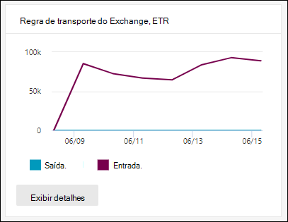

# Exibir relatórios de segurança de email no portal do Microsoft 365 Defender

[!INCLUDE [Microsoft 365 Defender rebranding](../includes/microsoft-defender-for-office.md)]

**Aplica-se a**
- [Proteção do Exchange Online](exchange-online-protection-overview.md)
- [Plano 1 e plano 2 do Microsoft Defender para Office 365](defender-for-office-365.md)
- [Microsoft 365 Defender](../defender/microsoft-365-defender.md)

Vários relatórios estão disponíveis no portal do Microsoft 365 Defender para ajudá-lo a ver como os recursos de segurança de email, como anti-spam, anti-malware e recursos de criptografia no Microsoft 365 estão protegendo sua <https://security.microsoft.com> organização. Se você tiver as permissões [necessárias,](#what-permissions-are-needed-to-view-these-reports)poderá exibir esses relatórios no portal  do Microsoft 365 Defender, indo para Relatórios Email & colaboração \>  \> **Email & relatórios de colaboração**. Para ir diretamente para a página Relatórios de **colaboração & email,** abra <https://security.microsoft.com/emailandcollabreport> .

> [!NOTE]
>
> Alguns dos relatórios na página Relatórios de & **de** colaboração exigem o Microsoft Defender para Office 365. Para obter informações sobre esses relatórios, consulte [View Defender for Office 365 reports in the Microsoft 365 Defender portal](view-reports-for-mdo.md).
>
> Os relatórios relacionados ao fluxo de emails agora estão no Centro de administração do Exchange (EAC). Para obter mais informações sobre esses relatórios, consulte [Mail flow reports in the new Exchange admin center](/exchange/monitoring/mail-flow-reports/mail-flow-reports).

## Relatório de usuários comprometidos

> [!NOTE]
> Este relatório está disponível em organizações do Microsoft 365 com caixas de correio do Exchange Online. Ele não está disponível em organizações autônomas do Exchange Online Protection (EOP).

O **relatório Usuários Comprometidos** mostra o número de contas de usuário que foram marcadas como **Suspeitas** ou **Restritas** nos últimos 7 dias. As contas em qualquer um desses estados são problemáticas ou até mesmo comprometidas. Com o uso frequente, você pode usar o relatório para detectar picos e até tendências, em contas suspeitas ou restritas. Para obter mais informações sobre usuários comprometidos, consulte [Respondendo a uma conta de email comprometida.](responding-to-a-compromised-email-account.md)

A exibição agregada mostra os dados dos últimos 90 dias e a exibição de detalhes mostra os dados dos últimos 30 dias.

Para exibir o relatório no portal do Microsoft 365 Defender, acesse **Relatórios** \> **Email & colaboração** Email & relatórios de \> **colaboração**. Em **Usuários comprometidos,** clique **em Exibir detalhes.** Para ir diretamente para o relatório, abra <https://security.microsoft.com/reports/CompromisedUsers> .

Depois de clicar em **Exibir** detalhes, você pode filtrar o gráfico e a tabela de detalhes clicando em **Filtrar** e selecionando um ou mais dos seguintes valores no flyout que aparece:

- **Data (UTC)**: Data **de início** **e data de término.**
- **Atividade**:
  - **Suspeito**: a conta de usuário enviou emails suspeitos e corre o risco de ser restringida ao envio de emails.
  - **Restrito**: a conta de usuário foi restrita ao envio de emails devido a padrões altamente suspeitos.

Quando terminar a filtragem, clique em **Aplicar ou** **Cancelar.**

Na tabela abaixo do gráfico, você pode ver os seguintes detalhes:

- **Hora da criação**
- **ID de usuário**
- **Action**

## Relatório de regra de transporte do Exchange

O **relatório de regra de** transporte do Exchange mostra o efeito das regras de fluxo de emails (também conhecidas como regras de transporte) em mensagens de entrada e saída em sua organização.

Para exibir o relatório no portal do Microsoft 365 Defender, acesse **Relatórios** \> **Email & colaboração** Email & relatórios de \> **colaboração**. Na **regra de transporte do Exchange,** clique em Exibir **detalhes.** Para ir diretamente para o relatório, abra <https://security.microsoft.com/reports/ETRRuleReport> .

Depois de clicar **em Exibir detalhes,** os seguintes gráficos e dados estarão disponíveis:

- **Exibir dados por regras de transporte do** \> Exchange **Divisão de gráficos por Direção**: este  gráfico mostra o número **de** mensagens de Entrada e Saída que foram afetadas pelas regras de fluxo de emails.

- **Exibir dados por regras de transporte do** \> Exchange **Divisão de gráficos por Gravidade**: este gráfico mostra o número de mensagens de Alta **gravidade,** Gravidade **média** e **Baixa gravidade.** Você definirá o nível de gravidade como uma ação na regra (**Audite essa** regra com nível de gravidade ou _SetAuditSeverity_). Para obter mais informações, consulte [Ações de regra de fluxo de email no Exchange Online](/Exchange/security-and-compliance/mail-flow-rules/mail-flow-rule-actions).

- **Exibir dados por regras de transporte do Exchange** \> DLP **Divisão de gráficos** por Direção  : este  gráfico mostra o número de mensagens de entrada e saída que foram afetadas pelas regras de fluxo de emails de prevenção contra perda de dados (DLP).

- **Exibir dados por regras de transporte do Exchange** \> DLP **Divisão de gráficos por Severidade**: Este ponto de exibição mostra o número de mensagens de alta **gravidade,** gravidade média e Baixa gravidade que foram afetadas pelas regras de fluxo de emails DLP. 

Para **Exibir dados por seleções** de regras de transporte do Exchange, as seguintes informações são mostradas na tabela de detalhes abaixo do gráfico:

- **Date**
- **Regra de transporte**
- **Assunto**
- **Endereço do remetente**.
- **Endereço do destinatário**
- **Gravidade**
- **Direção**

Para **exibir dados por seleções** de regras de transporte do Exchange DLP, as seguintes informações são mostradas na tabela de detalhes abaixo do gráfico:

- **Date**
- **Política DLP**
- **Regra de transporte**
- **Assunto**
- **Endereço do remetente**.
- **Endereço do destinatário**
- **Gravidade**
- **Direção**

Você pode filtrar o gráfico e a tabela de detalhes clicando em **Filtrar** e selecionando um ou mais dos seguintes valores no flyout que aparece:

- **Data de início** **e data de término**
- **Direção**: **Saída** e **Entrada**
- **Severidade**: **alta gravidade,** **gravidade média** e baixa **gravidade**

## Relatório de status de fluxo de emails

O relatório de status de **fluxo** de emails é um relatório inteligente que mostra informações sobre emails de entrada e saída, detecções de spam, malware, email identificado como "bom" e informações sobre emails permitidos ou bloqueados na borda. Este é o único relatório que contém informações de proteção de borda e mostra a quantos emails são bloqueados antes de serem permitidos no serviço para avaliação pela Proteção do Exchange Online (EOP). É importante entender que, se uma mensagem for enviada a cinco destinatários, a contaremos como cinco mensagens diferentes e não uma mensagem.

Para exibir o relatório no portal do Microsoft 365 Defender, acesse **Relatórios** \> **Email & colaboração** Email & relatórios de \> **colaboração**. No **resumo de status do fluxo de emails,** clique em Exibir **detalhes.** Para ir diretamente para o relatório, abra <https://security.microsoft.com/reports/mailflowStatusReport> .

### Exibição de tipo para o relatório de status de fluxo de emails

Quando você abre o relatório, a guia **Tipo** é selecionada por padrão. Por padrão, esse modo de exibição contém um gráfico e uma tabela de dados configurada com os seguintes filtros:

- **Data**: os últimos 7 dias.
- **Direção do email**:
  - **Entrada**
  - **Saída**
  - **Intra-org**: essa contagem é para mensagens dentro de um locatário ou seja, remetente abc@domain.com envia ao destinatário xyz@domain.com (contado separadamente de **Entrada** e **Saída**)
- **Tipo**:
  - **Bom email**
  - **Malware**
  - **Spam**
  - **Proteção de borda**
  - **Mensagens de regra**
  - **Email de phishing**
- **Domínio**: **Todos**

O gráfico é organizado pelos valores **Type.**

Você pode alterar esses filtros clicando em **Filtrar** ou clicando em um valor na legenda do gráfico.

A tabela de dados contém as seguintes informações:

- **Direção**
- **Tipo**
- **24 horas**
- **3 dias**
- **7 dias**
- **15 dias**
- **30 dias**

Se você clicar **em Escolher uma categoria para obter** mais detalhes, você poderá selecionar entre os seguintes valores:

- **Email de phishing**: essa seleção o leva ao relatório de [status de proteção contra ameaças.](view-email-security-reports.md#threat-protection-status-report)
- **Malware no email**: essa seleção o leva ao relatório de [status de proteção contra ameaças.](view-email-security-reports.md#threat-protection-status-report)
- **Detecções de** spam: essa seleção o leva ao relatório de [Detecções de Spam.](view-email-security-reports.md#spam-detections-report)
- **Spam bloqueado de borda:** essa seleção o leva ao relatório de [Detecções de Spam.](view-email-security-reports.md#spam-detections-report)

#### Exportar do tipo de exibição

Para a exibição de detalhes, você só pode exportar dados por um dia. Portanto, se você quiser exportar dados por 7 dias, precisará fazer 7 ações de exportação diferentes.

Cada arquivo .csv é limitado a 150.000 linhas. Se os dados desse dia contiver mais de 150.000 linhas, vários arquivos .csv serão criados.

### Exibição de direção para o relatório de status de fluxo de emails

Se você clicar na guia **Direção,** os mesmos filtros padrão do modo de exibição **Tipo** serão usados.

O gráfico é organizado pelos **valores Direction.**

Você pode alterar esses filtros clicando em **Filtrar** ou clicando em um valor na legenda do gráfico. Os mesmos filtros do modo **de exibição Type** são usados.

A tabela de dados contém as mesmas informações do modo **de exibição Tipo.**

A **opção Escolher uma categoria para obter** mais detalhes sobre as seleções e o comportamento disponíveis são os mesmos que o modo de **exibição Tipo.**

#### Exportar do ponto de vista De direção

Para a exibição de detalhes, você só pode exportar dados por um dia. Portanto, se você quiser exportar dados por 7 dias, precisará fazer 7 ações de exportação diferentes.

Cada arquivo .csv é limitado a 150.000 linhas. Se os dados desse dia contiver mais de 150.000 linhas, vários arquivos .csv serão criados.

### Exibição de funil para o relatório de status de fluxo de emails

A **exibição** Funil mostra como os recursos de proteção contra ameaças de email da Microsoft filtram emails de entrada e saída em sua organização. Ele fornece detalhes sobre a contagem total de emails e como os recursos de proteção contra ameaças configurados, incluindo proteção de borda, anti-malware, anti-phishing, anti-spam e anti-spoofing afetam essa contagem.

Se você clicar na guia **Funil,** por padrão, esse modo de exibição conterá um gráfico e uma tabela de dados configurada com os seguintes filtros:

- **Data**: os últimos 7 dias.

- **Direção**:

  - **Entrada**
  - **Saída**
  - **Intra-org**: esta contagem é para mensagens enviadas dentro de um locatário; Ou seja, o remetente abc@domain.com envia para o destinatário xyz@domain.com (contado separadamente de Entrada e Saída).

A exibição agregada e a exibição da tabela de dados permitem 90 dias de filtragem.

Se você clicar **em Filtrar,** poderá filtrar o gráfico e a tabela de dados.

Este gráfico mostra a contagem de emails organizada por:

- **Total de emails**
- **Email após proteção de borda**
- **Regra de email após transporte** (regra de fluxo de emails)
- **Email após anti-malware, reputação de arquivo, bloco de tipo de arquivo**
- **Email após anti-phishing, reputação de URL, representação de marca, anti-spoof**
- **Email após anti-spam, filtragem de email em massa**
- **Email após a representação de usuário e domínio**\*
- **Email após a detonação de arquivo e URL**\*
- **Email detectado como benigno após a proteção pós-entrega (proteção de tempo de clique na URL)**

\*Defender para Office 365 somente

Para exibir o email filtrado por EOP ou Defender Office 365 separadamente, clique no valor na legenda do gráfico.

A tabela de dados contém as seguintes informações, mostradas na ordem de data decrescente:

- **Date**
- **Total de emails**
- **Proteção de borda**
- **Anti-malware, reputação de arquivo, bloco de tipo de arquivo**:
  - **Reputação do** arquivo : Mensagens filtradas devido à identificação de um arquivo anexado por outros clientes da Microsoft.
  - **Bloco de tipo de** arquivo : Mensagens filtradas devido ao tipo de arquivo mal-intencionado identificado na mensagem.
- **Anti-phish, reputação de URL, representação de marca, anti-spoof**:
  - **Reputação da URL**: Mensagens filtradas devido à identificação da URL por outros clientes da Microsoft.
  - **Representação de marca**: Mensagens filtradas devido à mensagem proveniente de uma marca conhecida que representa os senders.
  - **Anti-spoof**: Mensagens filtradas devido à mensagem que está tentando fazer a spoof de um domínio que o destinatário pertence ou a um domínio que o remetente da mensagem não possui.
- **Anti-spam, filtragem de email em massa:**
  - **Filtragem de emails** em massa: Mensagens filtradas com base no limite de bcl (nível de reclamação em massa) em uma política anti-spam.
- **Representação de usuário e domínio (Defender para Office 365)**:
  - **Representação do** usuário : Mensagens filtradas devido a uma tentativa de representar um usuário (remetente de mensagem) definido nas configurações de proteção de representação de uma política anti-phishing.
  - **Representação de domínio**: Mensagens filtradas devido a uma tentativa de representar um domínio definido nas configurações de proteção de representação de uma política anti-phishing.
- **Detonação de arquivo e URL (Defender para Office 365)**:
  - **Detonação de** arquivo : Mensagens filtradas por uma política Cofre Anexos.
  - **Detonação de URL**: Mensagem filtrada por uma política Cofre Links.
- **Proteção pós-entrega e ZAP (ATP) ou ZAP (EOP)**: Limpeza automática zero hora (ZAP) para malware, spam e phishing.

Se você selecionar uma linha na tabela de dados, uma nova divisão das contagens de email será mostrada no sobrevoo.

#### Exportar do exibição Funil

Depois de clicar **em Exportar** **em Opções,** selecione um dos seguintes valores:

- **Resumo (com dados dos últimos 90 dias no máximo)**
- **Detalhes (com dados dos últimos 30 dias no máximo)**

Em **Data**, escolha um intervalo e clique em **Aplicar**. Os dados dos filtros atuais serão exportados para um arquivo .csv.

Cada arquivo .csv é limitado a 150.000 linhas. Se os dados contiver mais de 150.000 linhas, vários arquivos .csv serão criados.

### Exibição técnica do relatório de status mailflow

O **modo de exibição** Tech é semelhante ao modo de exibição **Funil,** fornecendo detalhes mais granulares para os recursos configurados de proteções contra ameaças. No gráfico, você pode ver como as mensagens são categorizadas nos diferentes estágios da proteção contra ameaças.

Se você clicar na **guia Modo de** Exibição de Tecnologia, por padrão, esse modo de exibição conterá um gráfico e uma tabela de dados configurada com os seguintes filtros:

- **Data**: os últimos 7 dias.

- **Direção**:

  - **Entrada**
  - **Saída**
  - **Intra-org**: essa contagem é para mensagens dentro de um locatário ou seja, remetente abc@domain.com envia ao destinatário xyz@domain.com (contado separadamente de Entrada e Saída)

A exibição agregada e a exibição da tabela de dados permitem 90 dias de filtragem.

Se você clicar **em Filtrar,** poderá filtrar o gráfico e a tabela de dados.

Este gráfico mostra mensagens organizadas nas seguintes categorias:

- **Total de emails**
- **Permitir borda** e **Borda filtrada**
- **Regra de transporte permitir** e **regra de transporte filtrada** (regras de fluxo de emails)
- **Não malware,** **Cofre detecção de anexos** \* e detecção de mecanismo **anti-malware**
- **Não phish**, **falha de DMARC,** detecção **de representação,** detecção de \* **spoof** e **detecção de phishing**
- **Nenhuma detecção com detonação de URL** e detecção **de detonação de URL**\*
- **Não spam** e  **spam**
- **Email não mal-intencionado,** **Cofre de links** e \* **ZAP**

\*Defender para Office 365

Ao passar o mouse sobre uma categoria no gráfico, você pode ver o número de mensagens nessa categoria.

A tabela de dados contém as seguintes informações, mostradas na ordem de data decrescente:

- **Date**
- **Total de emails**
- **Borda filtrada**
- **Mensagens de regra**: Mensagens filtradas devido a regras de fluxo de emails (também conhecidas como regras de transporte).
- **Mecanismo anti-malware**, **Cofre Anexos** \* :
- **DMARC, representação** \* , **spoof**, **phish filtered**:
  - **DMARC**: Mensagens filtradas devido à falha da mensagem em sua verificação de autenticação DMARC.
- **Detecção de detonação de URL**\*
- **Anti-spam filtrado**
- **ZAP removido**
- **Detecção por Cofre Links**\*

\*Defender para Office 365

Se você selecionar uma linha na tabela de dados, uma nova divisão das contagens de email será mostrada no sobrevoo.

#### Exportar do ponto de vista tech

Ao clicar em **Exportar**, em **Opções,** você pode selecionar um dos seguintes valores:

- **Resumo (com dados dos últimos 90 dias no máximo)**
- **Detalhes (com dados dos últimos 30 dias no máximo)**

Em **Data**, escolha um intervalo e clique em **Aplicar**. Os dados dos filtros atuais serão exportados para um arquivo .csv.

Cada arquivo .csv é limitado a 150.000 linhas. Se os dados contiver mais de 150.000 linhas, vários arquivos .csv serão criados.

## Relatório de detecções de malware

O **relatório de detecções** de malware mostra informações sobre detecções de malware em mensagens de email de entrada e saída (malware detectado por Proteção do Exchange Online ou EOP). Para obter mais informações sobre a proteção contra malware no EOP, consulte [Proteção anti-malware no EOP](anti-malware-protection.md).

O filtro de exibição agregado permite 90 dias, enquanto o filtro de tabela de detalhes só permite por 10 dias.

Para exibir o relatório no portal Microsoft 365 Defender, acesse **Relatórios** \> **Email & colaboração** Email & relatórios de \> **colaboração**. Em **Malware detectado no email,** clique em Exibir **detalhes.** Para ir diretamente para o relatório, abra <https://security.microsoft.com/reports/MalwareDetections> .

Depois de clicar **em Exibir detalhes,** você pode filtrar o gráfico e a tabela de detalhes clicando em **Filtrar** e selecionando:

- **Data**: **Data de início** e data de **término**
- **Direção**: **Entrada** e **Saída**

Na tabela de detalhes abaixo do gráfico, você pode ver os seguintes detalhes:

- **Date**
- **Endereço do remetente**.
- **Endereço do destinatário**
- **ID da** mensagem : disponível no campo de header **Message-ID** no header da mensagem e deve ser exclusivo. Um valor de exemplo `<08f1e0f6806a47b4ac103961109ae6ef@server.domain>` é (observe os colchetes angulares).
- **Assunto**
- **Filename**
- **Nome do malware**

## Relatório de latência de email

O **relatório de latência de** email no Defender para Office 365 contém informações sobre a entrega de emails e a latência de detonação experimentado em sua organização. Para obter mais informações, consulte [Relatório de latência de email](view-reports-for-mdo.md#mail-latency-report).

## Relatório de detecções de spam

> [!NOTE]
> O **relatório de detecções de spam** desaparecerá em 30 de junho de 2021. As mesmas informações estão disponíveis no relatório de [status de proteção contra ameaças.](#threat-protection-status-report)

## Relatório de detecções de spoof

> [!NOTE]
> O relatório aprimorado de detecções de Spoof conforme descrito neste artigo está em Visualização, está sujeito a alterações e não está disponível em todas as organizações. A versão mais antiga do relatório mostra apenas **Emails bons e** **capturados como spam.**

O **relatório de detecções Spoof** mostra informações sobre mensagens que foram bloqueadas ou permitidas devido à fraude. Para obter mais informações sobre a spoofing, consulte [Anti-spoofing protection in EOP](anti-spoofing-protection.md).

A exibição agregada do relatório permite 45 dias de filtragem, enquanto a exibição de detalhes permite apenas \* dez dias de filtragem.

\* Eventualmente, você poderá usar até 90 dias de filtragem.

Para exibir o relatório no portal Microsoft 365 Defender, acesse **Relatórios** \> **Email & colaboração** Email & relatórios de \> **colaboração**. Em **Detecções de Spoof,** clique **em Exibir detalhes.** Para ir diretamente para o relatório, abra <https://security.microsoft.com/reports/SpoofMailReportV2> .

Ao passar o mouse sobre um dia (ponto de dados) no gráfico, você pode ver quantas mensagens falsas foram detectadas e por quê.

Depois de clicar em **Exibir detalhes,** você pode filtrar o gráfico e a tabela de detalhes clicando em **Filtrar** e selecionando um ou mais dos seguintes valores:

- **Data**: **Data de início** e data de **término**
- **Resultado**:
  - **Passagem**
  - **Fail**
  - **SoftPass**
  - **Nenhum**
  - **Outros**
- **Tipo de spoof**: **Interno** e **Externo**

Na tabela abaixo do gráfico, você pode ver os seguintes detalhes:

- **Date**
- **Usuário com spoofed**
- **Enviando infraestrutura**
- **Tipo de spoof**
- **Resultado**
- **Código de resultado**
- **SPF**
- **DKIM**
- **DMARCDMARC**
- **Contagem de mensagem**

Para obter mais informações sobre códigos de resultados de autenticação composta, consulte [Headers de mensagem anti-spam em Microsoft 365](anti-spam-message-headers.md).

## Relatório de status de proteção contra ameaças

O **relatório de status de** proteção contra ameaças está disponível no EOP e no Defender para Office 365; no entanto, os relatórios contêm dados diferentes. Por exemplo, os clientes do EOP podem exibir informações sobre malware detectados no email, mas não informações sobre arquivos [mal-intencionados detectados](mdo-for-spo-odb-and-teams.md)por Cofre Anexos para SharePoint, OneDrive e Microsoft Teams .

O relatório fornece a contagem de mensagens de email com conteúdo mal-intencionado, como arquivos ou endereços de site (URLs) bloqueados pelo mecanismo anti-malware, zap (limpeza automática zero [hora)](zero-hour-auto-purge.md)e o Defender para recursos do Office 365, como [links Cofre,](safe-links.md) [anexos Cofre](safe-attachments.md)e recursos de proteção contra representação em políticas [anti-phishing.](set-up-anti-phishing-policies.md#exclusive-settings-in-anti-phishing-policies-in-microsoft-defender-for-office-365) Você pode usar essas informações para identificar tendências ou determinar se as políticas da organização precisam de ajustes.

**Observação**: é importante entender que, se uma mensagem for enviada a cinco destinatários, a contaremos como cinco mensagens diferentes e não uma mensagem.

Para exibir o relatório no portal Microsoft 365 Defender, acesse **Relatórios** \> **Email & colaboração** Email & relatórios de \> **colaboração**. Em **Status de proteção contra ameaças,** clique em Exibir **detalhes.** Para ir diretamente ao relatório, abra uma das seguintes URLs:

- Defender para Office 365:<https://security.microsoft.com/reports/TPSAggregateReportATP>
- EOP: <https://security.microsoft.com/reports/TPSAggregateReport>

Por padrão, depois de clicar em **Exibir detalhes,** o gráfico mostra dados dos últimos 7 dias. Se você clicar **em Filtrar**, você poderá selecionar um intervalo de 90 dias (as assinaturas de avaliação podem ser limitadas a 30 dias). A tabela de detalhes permite a filtragem por 30 dias.

As exibições disponíveis são descritas nas seções a seguir.

### Exibir dados por Visão Geral

Na **exibição Exibir dados por visão** geral, as seguintes informações de detecção são mostradas no gráfico:

- **Malware de email**
- **Phishing de email**
- **Malware de conteúdo**

Nenhuma tabela de detalhes está disponível abaixo do gráfico.

Se você clicar em **Filtrar,** os seguintes filtros estarão disponíveis:

- **Data**: **Data de início** e data de **término**
- **Detecção**: **malware de email,** **phishing** de email ou **malware de conteúdo**
- **Protegido por**: **MDO** (Defender para Office 365) ou **EOP**
- **Marca**: filtre os resultados por usuários ou grupos que tiveram a marca de usuário especificada aplicada (incluindo contas prioritárias). Para obter mais informações sobre marcas de usuário, consulte [Marcas de usuário](user-tags.md).
- **Direção**
- **Domínio**
- **Tipo de política**

Quando terminar de configurar os filtros, clique em **Aplicar,** **Cancelar** ou **Limpar filtros**.

### Exibir dados por Email \> Phish and Chart breakdown by Detection Technology

Na **exibição Exibir dados por \> phishing** de email e **gráfico** por tecnologia de detecção, as seguintes informações são mostradas no gráfico:

- **Reputação mal-intencionada** da URL : reputação de URL mal-intencionada gerada pelo \* Defender para Office 365 detonações em outros Microsoft 365 clientes.
- **Filtro avançado**: sinais de phishing com base no aprendizado de máquina.
- **Filtro geral**: sinais de phishing com base em regras de analista.
- **Spoof intra-org**: O remetente está tentando fazer a spoof do domínio do destinatário.
- **Spoof external domain**: O remetente está tentando fazer a spoof de algum outro domínio.
- **Spoof DMARC**: Falha de autenticação DMARC em mensagens.
- **Marca de representação**: Representação de marcas conhecidas com base em senders.
- **Detecção de análise mista**
- **Reputação de arquivos**
- **Correspondência de impressão digital**
- **Reputação de detonação de URL**\*
- **Detonação de URL**\*
- **Usuário de representação**\*
- **Domínio de representação** \* : Representação de domínios que o cliente possui ou define.
- **Representação de inteligência de caixa de** correio : Representação de usuários \* definidos pelo administrador ou aprendidos por meio da inteligência da caixa de correio.
- **Detonação de arquivo**\*
- **Campanha**\*

Na tabela de detalhes abaixo do gráfico, as seguintes informações estão disponíveis:

- **Date**
- **Assunto**
- **Sender**
- **Destinatários**
- **Detectado por**
- **Status da Entrega**
- **Fonte de comprometimento**
- **Marcas**

Se você clicar em **Filtrar,** os seguintes filtros estarão disponíveis:

- **Data**: **Data de início** e data de **término**
- **Detecção**
- **Protegido por**: **MDO** (Defender para Office 365) ou **EOP**
- **Direção**
- **Marca**: filtre os resultados por usuários ou grupos que tiveram a marca de usuário especificada aplicada (incluindo contas prioritárias). Para obter mais informações sobre marcas de usuário, consulte [Marcas de usuário](user-tags.md).
- **Domínio**
- **Tipo de política**
- **Nome da política** (somente tabela de detalhes)
- **Destinatários**

Quando terminar de configurar os filtros, clique em **Aplicar,** **Cancelar** ou **Limpar filtros**.

### Exibir dados por \> Malware de Email e Divisão de Gráficos pela Tecnologia de Detecção

Na **exibição Exibir dados por \> Malware** de Email e **Gráfico** pela Tecnologia de Detecção, as seguintes informações são mostradas no gráfico:

- **Detonação de** \* arquivo : detecção por Cofre Anexos.
- **Reputação de detonação de** \* arquivo : toda a reputação de arquivo mal-intencionado gerada pelo Defender para Office 365 detonações.
- **Reputação de arquivos**
- **Mecanismo anti-malware** \* : Detecção de mecanismos anti-malware.
- Bloco de tipo de arquivo de **política anti-malware**: São mensagens de email filtradas devido ao tipo de arquivo mal-intencionado identificado na mensagem.
- **Reputação mal-intencionada de URL**
- **Detonação de URL**
- **Reputação da detonação de URL**
- **Campanha**

Na tabela de detalhes abaixo do gráfico, as seguintes informações estão disponíveis:

- **Date**
- **Assunto**
- **Sender**
- **Destinatários**
- **Detectado por**
- **Status da Entrega**
- **Fonte de comprometimento**
- **Marcas**

Se você clicar em **Filtrar,** os seguintes filtros estarão disponíveis:

- **Data**: **Data de início** e data de **término**
- **Detecção**
- **Protegido por**: **MDO** (Defender para Office 365) ou **EOP**
- **Direção**
- **Marca**: filtre os resultados por usuários ou grupos que tiveram a marca de usuário especificada aplicada (incluindo contas prioritárias). Para obter mais informações sobre marcas de usuário, consulte [Marcas de usuário](user-tags.md).
- **Domínio**
- **Tipo de política**
- **Nome da política** (somente tabela de detalhes)
- **Destinatários**

Quando terminar de configurar os filtros, clique em **Aplicar,** **Cancelar** ou **Limpar filtros**.

### Divisão de gráfico por tipo de política e Exibir dados por Phishing de Email \> ou Exibir dados por Malware de \> Email

Na divisão **Gráfico por Tipo** de Política e Exibir dados por **Phishing \>** de Email ou Exibir dados por exibição de Malware de **Email, \>** as seguintes informações são mostradas nos gráficos:

- **Anti-malware**
- **Cofre Anexos**\*
- **Anti-phish**
- **Anti-spam**
- **Regra de fluxo de emails** (também conhecida como regra de transporte)
- **Outros**

Na tabela de detalhes abaixo do gráfico, as seguintes informações estão disponíveis:

- **Date**
- **Assunto**
- **Sender**
- **Destinatários**
- **Detectado por**
- **Status da Entrega**
- **Fonte de comprometimento**
- **Marcas**

Se você clicar em **Filtrar,** os seguintes filtros estarão disponíveis:

- **Data**: **Data de início** e data de **término**
- **Detecção**
- **Protegido por**: **MDO** (Defender para Office 365) ou **EOP**
- **Direção**
- **Marca**: filtre os resultados por usuários ou grupos que tiveram a marca de usuário especificada aplicada (incluindo contas prioritárias). Para obter mais informações sobre marcas de usuário, consulte [Marcas de usuário](user-tags.md).
- **Domínio**
- **Tipo de política**
- **Nome da política** (somente tabela de detalhes)
- **Destinatários**

Quando terminar de configurar os filtros, clique em **Aplicar,** **Cancelar** ou **Limpar filtros**.

### Divisão de gráficos por status de entrega e Exibir dados por Phishing de Email \> ou Exibir dados por Malware de \> Email

Na divisão **gráfico por status** de entrega e Exibir dados por **Phishing \>** de Email ou Exibir dados por exibição **de \> Malware** de Email, as seguintes informações são mostradas nos gráficos:

- **Caixa de correio hospedada: Caixa de Entrada**
- **Caixa de correio hospedada: Lixo eletrônico**
- **Caixa de correio hospedada: Pasta personalizada**
- **Caixa de correio hospedada: itens excluídos**
- **Encaminhado**
- **Servidor local: Entregue**
- **Quarentena**
- **Falha na entrega**
- **Descartado**

Na tabela de detalhes abaixo do gráfico, as seguintes informações estão disponíveis:

- **Date**
- **Assunto**
- **Sender**
- **Destinatários**
- **Detectado por**
- **Status da Entrega**
- **Fonte de comprometimento**
- **Marcas**

Se você clicar em **Filtrar,** os seguintes filtros estarão disponíveis:

- **Data**: **Data de início** e data de **término**
- **Detecção**
- **Protegido por**: **MDO** (Defender para Office 365) ou **EOP**
- **Direção**
- **Marca**: filtre os resultados por usuários ou grupos que tiveram a marca de usuário especificada aplicada (incluindo contas prioritárias). Para obter mais informações sobre marcas de usuário, consulte [Marcas de usuário](user-tags.md).
- **Domínio**
- **Tipo de política**
- **Nome da política** (somente tabela de detalhes)
- **Destinatários**

Quando terminar de configurar os filtros, clique em **Aplicar,** **Cancelar** ou **Limpar filtros**.

### Exibir dados por Malware de \> Conteúdo

Na **exibição Exibir dados por \> Malware** de Conteúdo, as informações a seguir são mostradas no gráfico do Microsoft Defender para Office 365 organizações:

- **Mecanismo anti-malware**: arquivos mal-intencionados detectados no Sharepoint, OneDrive e Microsoft Teams pela detecção interna de [vírus no Microsoft 365](virus-detection-in-spo.md).
- **Detonação de** arquivo : Arquivos mal-intencionados [detectados por Cofre anexos](mdo-for-spo-odb-and-teams.md)para SharePoint, OneDrive e Microsoft Teams .

Na tabela de detalhes abaixo do gráfico, as seguintes informações estão disponíveis:

- **Data**: **Data de início** e data de **término**
- **Localização**
- **Detectado por**
- **Nome do malware**

Se você clicar em **Filtrar,** os seguintes filtros estarão disponíveis:

- **Data**: **Data de início** e data de **término**
- **Detecção**: **mecanismo anti-malware ou** **detonação de arquivo**

Quando terminar de configurar os filtros, clique em **Aplicar,** **Cancelar** ou **Limpar filtros**.

### Exibir dados por substituição do sistema

No **exibição Exibir dados por substituição do** sistema, as informações do motivo de substituição a seguir são mostradas no gráfico:

- **Ignorar local**
- **Ip allow**
- **Exchange de transporte de email** (regra de fluxo de emails)
- **Senders permitidos pela organização**
- **Domínios permitidos pela organização**
- **ZAP não habilitado**
- **Pasta Lixo Eletrônico não habilitada**
- **Usuário Cofre Remetente**
- **Domínio Cofre usuário**

Na tabela de detalhes abaixo do gráfico, as seguintes informações estão disponíveis:

- **Date**
- **Assunto**
- **Sender**
- **Destinatários**
- **Detectado por**
- **Status da Entrega**
- **Fonte de comprometimento**
- **Marcas**

Se você clicar em **Filtrar,** os seguintes filtros estarão disponíveis:

- **Data**: **Data de início** e data de **término**
- **Detecção**
- **Protegido por**: **MDO** (Defender para Office 365) ou **EOP**
- **Direção**
- **Marca**: filtre os resultados por usuários ou grupos que tiveram a marca de usuário especificada aplicada (incluindo contas prioritárias). Para obter mais informações sobre marcas de usuário, consulte [Marcas de usuário](user-tags.md).
- **Domínio**
- **Tipo de política**
- **Nome da política** (somente tabela de detalhes)
- **Destinatários**

Quando terminar de configurar os filtros, clique em **Aplicar,** **Cancelar** ou **Limpar filtros**.

\*Defender para Office 365 somente

## Relatório de malware principal

O **relatório de malware** Top mostra os vários tipos de malware detectados pela proteção [anti-malware no EOP](anti-malware-protection.md).

Para exibir o relatório no portal Microsoft 365 Defender, acesse **Relatórios** \> **Email & colaboração** Email & relatórios de \> **colaboração**. Em **Malware superior,** clique **em Exibir detalhes.** Para ir diretamente para o relatório, abra <https://security.microsoft.com/reports/TopMalware> .

Quando você passar o mouse sobre uma cunha no gráfico de pizza, você pode ver o nome de um tipo de malware e quantas mensagens foram detectadas como tendo esse malware.

Depois de clicar **em Exibir detalhes,** uma versão maior do gráfico de pizza será exibida na página de relatório. A tabela de detalhes abaixo do gráfico mostra as seguintes informações:

- **Malware principal**
- **Count**

Se você clicar **em Filtrar,** poderá especificar um intervalo de datas com **Data de** Início e Data **de Término.**

## Relatório de proteção contra ameaças de URL

O **relatório de proteção contra** ameaças de URL está disponível no Microsoft Defender para Office 365. Para obter mais informações, consulte [RELATÓRIO de proteção contra ameaças de URL](view-reports-for-mdo.md#url-threat-protection-report).

## Relatório de mensagens relatadas pelo usuário

> [!IMPORTANT]
> Para que o relatório de mensagens **relatadas** pelo usuário funcione corretamente, o **log** de auditoria deve ser ligado para seu ambiente Microsoft 365 ambiente. Isso normalmente é feito por alguém que tem a função Logs de Auditoria atribuída Exchange Online. Para obter mais informações, consulte Ativar ou desativar [Microsoft 365 pesquisa de log de auditoria.](../../compliance/turn-audit-log-search-on-or-off.md)

O **relatório** de mensagens relatadas pelo usuário mostra informações sobre mensagens de email que os usuários relataram como lixo eletrônico, tentativas de phishing ou emails bons usando o complemento [Mensagem](enable-the-report-message-add-in.md) de Relatório ou o complemento Relatar [Phishing](enable-the-report-phish-add-in.md).

Para exibir o relatório no portal Microsoft 365 Defender, acesse **Relatórios** Email & colaboração Email & relatórios de colaboração \>  \>  \> **Mensagens relatadas pelo usuário**. Em **Mensagens relatadas pelo usuário,** clique **em Exibir detalhes.** Para ir diretamente para o relatório, abra <https://security.microsoft.com/reports/userSubmissionReport> . Para acessar [envios de administrador no portal Microsoft 365 Defender,](admin-submission.md)clique **em Ir para Envios**.

Depois de clicar em **Exibir** detalhes, você pode filtrar o gráfico e a tabela de detalhes clicando em **Filtrar** e selecionando um ou mais dos seguintes valores no flyout que aparece:

- **Data relatada**: **Hora de início** e hora de **término**
- **Relatado por**
- **Assunto do email**
- **ID da mensagem relatada**
- **ID da mensagem de rede**
- **Sender**
- **Motivo relatado**
  - **Não é lixo eletrônico**
  - **Golpe**
  - **Spam**
- **Simulação de phishing**: **Sim** ou **Não**

Quando terminar de configurar os filtros, clique em **Aplicar,** **Cancelar** ou **Limpar filtros**.

Para agrupar as entradas, clique em **Grupo** e selecione um dos seguintes valores na listada:

- **Nenhum**
- **Motivo**
- **Sender**
- **Relatado por**
- **Rescan result**
- **Simulação de phishing**

Na tabela abaixo do gráfico, você pode ver os seguintes detalhes:

- **Assunto do email**
- **Relatado por**
- **Data relatada**
- **Sender**
- **Motivo relatado**
- **Rescan result**
- **Marcas**

Para enviar uma mensagem à Microsoft para análise, selecione a entrada da mensagem na tabela, clique em Enviar para a **Microsoft** para análise e selecione um dos seguintes valores na lista abaixo:

- **Relatório limpo**
- **Relatar phishing**
- **Relatar malware**
- **Relatar spam**'
- **Investigação de gatilho** (Defender para Office 365)

## Quais permissões são necessárias para exibir esses relatórios?

Para exibir e usar os relatórios descritos neste artigo, você precisa ser membro de um dos seguintes grupos de função no portal Microsoft 365 Defender:

- **Organization Management**
- **Administrador de Segurança**
- **Leitor de Segurança**
- **Leitor Global**

Para obter mais informações, consulte [Permissões no portal Microsoft 365 Defender .](permissions-in-the-security-and-compliance-center.md)

**Observação**: adicionar usuários à função Active Directory do Azure correspondente no Centro de administração do Microsoft 365 fornece aos usuários as permissões necessárias no _portal_ do Microsoft 365 Defender e permissões para outros recursos no Microsoft 365. Para obter mais informações, confira o artigo [Sobre funções de administrador](../../admin/add-users/about-admin-roles.md).

## E se os relatórios não mostrarem dados?

Se você não estiver vendo dados em seus relatórios, verifique duas vezes se suas políticas estão configuradas corretamente. Para saber mais, confira [Proteger contra ameaças](protect-against-threats.md).

## Tópicos relacionados

[Proteção anti-spam e anti-malware no EOP](anti-spam-and-anti-malware-protection.md)

[Relatórios inteligentes e percepções no portal Microsoft 365 Defender portal](reports-and-insights-in-security-and-compliance.md)

[Exibir relatórios de fluxo de emails no portal Microsoft 365 Defender de email](view-mail-flow-reports.md)

[Exibir relatórios do Defender para Office 365](view-reports-for-mdo.md)
