# Exibir relatórios de fluxo de emails no painel de relatórios no centro de conformidade e segurança &View mail flow reports in the Reports dashboard in Security & Compliance Center

Além dos relatórios de fluxo de emails disponíveis no painel de [fluxo de emails](mail-flow-insights-v2.md) no centro de conformidade com segurança &, vários relatórios de fluxo de email adicionais estão disponíveis no painel de relatórios para ajudá-lo a monitorar sua organização do Microsoft 365.In addition to the mail flow reports that are available in the [Mail flow dashboard](mail-flow-insights-v2.md) in the Security & Compliance Center, a variety of additional mail flow reports are available in the Reports dashboard to help you monitor your Microsoft 365 organization.

Se você tiver as [permissões necessárias](#what-permissions-are-needed-to-view-these-reports), poderá exibir esses relatórios no centro de [conformidade & de segurança](https://office.protection.com) acessando **Reports** o \> **painel**relatórios.If you have the [necessary permissions](#what-permissions-are-needed-to-view-these-reports), you can view these reports in the [Security & Compliance Center](https://office.protection.com) by going to **Reports** \> **Dashboard**. Para ir diretamente para o painel relatórios, abra <https://protection.office.com/insightdashboard> .To go directly to the Reports dashboard, open <https://protection.office.com/insightdashboard>.

## Relatório do conectorConnector report

O **relatório do conector** mostra a atividade de fluxo de emails nos [conectores de entrada e saída](https://docs.microsoft.com/Exchange/mail-flow-best-practices/use-connectors-to-configure-mail-flow/use-connectors-to-configure-mail-flow) que estão configurados para sua organização.The **Connector report** shows mail flow activity on the [inbound and outbound connectors](https://docs.microsoft.com/Exchange/mail-flow-best-practices/use-connectors-to-configure-mail-flow/use-connectors-to-configure-mail-flow) that are configured for your organization.

Para exibir o relatório, abra o [centro de conformidade & segurança](https://protection.office.com), vá **Reports** para \> **painel** relatórios e selecione **relatório do conector**.To view the report, open the [Security & Compliance Center](https://protection.office.com), go to **Reports** \> **Dashboard** and select **Connector report**. Para ir diretamente para o relatório, abra <https://protection.office.com/reportv2?id=ConnectorReport> .To go directly to the report, open <https://protection.office.com/reportv2?id=ConnectorReport>.

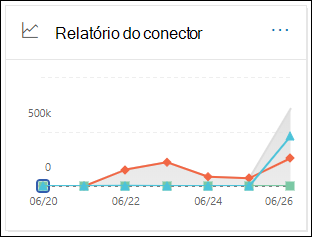

### Exibição de relatório para o relatório do conectorReport view for the Connector report

Os gráficos a seguir estão disponíveis no modo de exibição relatório:The following charts are available in report view:

- **Exibir dados por: fluxo de email**: Este gráfico mostra o número de mensagens de entrada e de saída organizadas por:**View data by: Mail flow**: This chart shows the number of inbound and outbound messages organized by:

  - **Total****Total**
  - **Da Internet sem um conector****From the internet without a connector**
  - **Para a Internet sem um conector****To the internet without a connector**
  - Um conector específico que você configurou.A specific connector that you've configured.

  Para isolar os dados no gráfico, use o recurso **Mostrar dados do** controle para selecionar uma destas opções ou **todo o fluxo de emails**.To isolate the data in the chart, use the **Show data for** control to select one of these options or **All mail flow**.

  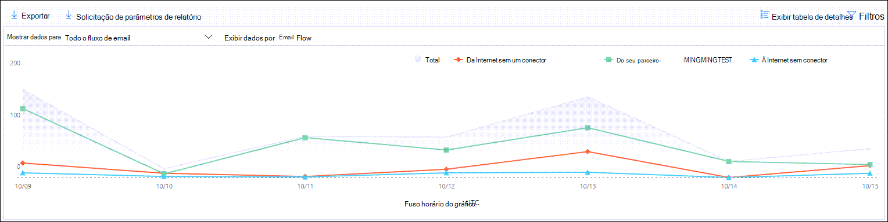

- **Exibir dados por: uso de TLS**: Este gráfico mostra a porcentagem de uso da versão do protocolo TLS para o fluxo de emails.**View data by: TLS usage**: This chart shows the percentage of Transport Layer Security (TLS) version usage for mail flow.

  Para isolar os dados no gráfico, use a opção **Mostrar dados do** controle para selecionar uma das seguintes opções:To isolate the data in the chart, use the **Show data for** control to select one of the following options:

  - **Todo o fluxo de email****All mail flow**
  - **Da Internet sem um conector****From the internet without a connector**
  - **Para a Internet sem um conector****To the internet without a connector**
  - Um conector específico que você configurou.A specific connector that you've configured.

  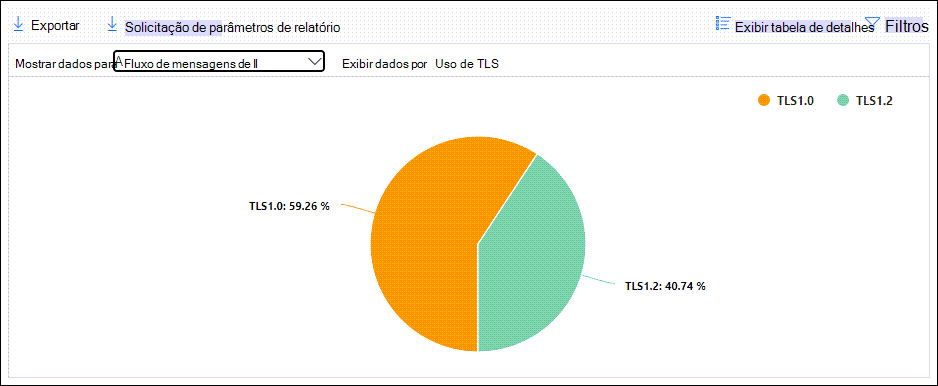

Se você clicar em **filtros** em um modo de exibição de relatório, poderá especificar um intervalo de datas com **data de início** e data de **término**.If you click **Filters** in a report view, you can specify a date range with **Start date** and **End date**.

### Exibição da tabela de detalhes para o relatório do conectorDetails table view for the Connector report

Se você clicar em **Exibir tabela de detalhes** em um modo de exibição de relatório, as seguintes informações serão exibidas:If you click **View details table** in a report view, the following information is shown:

- **Date****Date**
- **Direção e nome do conector****Connector direction and name**
- **Tipo de conector****Connector type**
- **TLS forçado?**: o valor **true** ou **false**.**Forced TLS?**: The value **True** or **False**.
- **Sem TLS** (porcentagem)**No TLS** (percentage)
- **TLS 1,0** (porcentagem)**TLS 1.0** (percentage)
- **TLS 1,1** (porcentagem)**TLS 1.1** (percentage)
- **TLS 1,2** (porcentagem)**TLS 1.2** (percentage)
- **Volume**: o número de mensagens.**Volume**: The number of messages.

Se você clicar em **filtros** em um modo de exibição de tabela detalhes, poderá especificar um intervalo de datas com **data de início** e data de **término**.If you click **Filters** in a details table view, you can specify a date range with **Start date** and **End date**.

Para voltar para o modo de exibição de relatório, clique em **Exibir relatório**.To go back to the report view, click **View report**.

## Relatório de regras de transporte do ExchangeExchange transport rule report

O **relatório** de regras de transporte do Exchange mostra o efeito das regras de fluxo de emails (também conhecidas como regras de transporte) em mensagens de entrada e de saída em sua organização.The **Exchange transport rule report** shows the effect of mail flow rules (also known as transport rules) on incoming and outgoing messages in your organization.

Para exibir o relatório, abra o [centro de conformidade & segurança](https://protection.office.com), vá **Reports** para \> **painel** relatórios e selecione regra de **transporte do Exchange**.To view the report, open the [Security & Compliance Center](https://protection.office.com), go to **Reports** \> **Dashboard** and select **Exchange Transport rule**. Para ir diretamente para o relatório, abra <https://protection.office.com/reportv2?id=ETRRuleReport> .To go directly to the report, open <https://protection.office.com/reportv2?id=ETRRuleReport>.

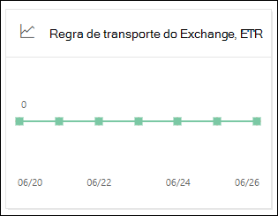

### Exibição de relatório para o relatório de regra de transporte do ExchangeReport view for the Exchange transport rule report

Os gráficos a seguir estão disponíveis no modo de exibição relatório:The following charts are available in report view:

- **Exibir dados por: regras** \> de transporte do Exchange **Dividir em: direção**: Este gráfico mostra o número de mensagens de **entrada** e de **saída** que foram afetadas por regras de transporte.**View data by: Exchange transport rules** \> **Break down by: Direction**: This chart shows the number of **Inbound** and **Outbound** messages that were affected by transport rules.

- **Exibir dados por: regras** \> de transporte do Exchange **Dividir em: severidade**: Este gráfico mostra o número de **alta gravidade** e **severidade média**e mensagens de **baixa gravidade** .**View data by: Exchange transport rules** \> **Break down by: Severity**: This chart shows the number of **High severity** and **Medium severity**, and **Low severity** messages. Você define o nível de severidade como uma ação na regra (**auditar esta regra com nível de severidade** ou _SetAuditSeverity_).You set the severity level as an action in the rule (**Audit this rule with severity level** or _SetAuditSeverity_). Para obter mais informações, consulte [Mail Flow Rule Actions in Exchange Online](https://docs.microsoft.com//Exchange/security-and-compliance/mail-flow-rules/mail-flow-rule-actions).For more information, see [Mail flow rule actions in Exchange Online](https://docs.microsoft.com//Exchange/security-and-compliance/mail-flow-rules/mail-flow-rule-actions).

- **Exibir dados por: regras** \> de transporte do Exchange DLP **Divisão por: direção**: Este gráfico mostra o número de mensagens de **entrada** e de **saída** que foram afetadas pelas regras de transporte de prevenção de perda de dados (DLP).**View data by: DLP Exchange transport rules** \> **Break down by: Direction**: This chart shows the number of **Inbound** and **Outbound** messages that were affected by data loss prevention (DLP) transport rules. Você pode refinar ainda mais o gráfico selecionando uma das seguintes opções:You can further refine the chart by selecting on of the following options:

  - **Mostrar dados de: todas as regras de transporte DLP****Show data for: All DLP transport rules**
  - **Mostrar dados de: usuários comprometidos****Show data for: Compromised users**
  - **Mostrar dados de: baixo volume de conteúdo detectado Patriot lei americano****Show data for: Low volume of content detected U.S. Patriot Act**

- **Exibir dados por: regras** \> de transporte do Exchange DLP **Divisão por: direção**: este modo de exibição mostra o número de **alta** gravidade e **severidade média**e mensagens de **baixa gravidade** que foram afetadas pelas regras de transporte DLP.**View data by: DLP Exchange transport rules** \> **Break down by: Direction**: This view shows the number of **High severity** and **Medium severity**, and **Low severity** messages that were affected by DLP transport rules. Você pode refinar ainda mais o gráfico selecionando uma das seguintes opções:You can further refine the chart by selecting on of the following options:

  - **Mostrar dados de: todas as regras de transporte DLP****Show data for: All DLP transport rules**
  - **Mostrar dados de: usuários comprometidos****Show data for: Compromised users**
  - **Mostrar dados de: baixo volume de conteúdo detectado Patriot lei americano****Show data for: Low volume of content detected U.S. Patriot Act**

Se você clicar em **filtros** em um modo de exibição de relatório, poderá modificar os resultados com os seguintes filtros:If you click **Filters** in a report view, you can modify the results with the following filters::

- **Data de início** e **data de término****Start date** and **End date**
- Valores de direçãoDirection values
- Valores de gravidadeSeverity values

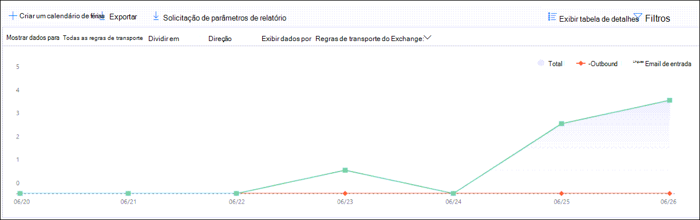

### Exibição da tabela de detalhes para o relatório de regras de transporte do ExchangeDetails table view for the Exchange transport rule report

Se você clicar em **Exibir tabela de detalhes**, as informações mostradas dependem do gráfico que você estava observando:If you click **View details table**, the information that's shown depends on the chart you were looking at:

- **Exibir dados por: regras de transporte do Exchange**:**View data by: Exchange Transport rules**:

  - **Date****Date**
  - **Regra de transporte****Transport rule**
  - **Assunto****Subject**
  - **Endereço do remetente**.**Sender address**
  - **Endereço do destinatário****Recipient address**
  - **Severidade****Severity**
  - **Direção****Direction**

- **Exibir dados por: regras de transporte do Exchange DLP**:**View data by: DLP Exchange transport rules**:

  - **Date****Date**
  - **Política de DLP****DLP policy**
  - **Regra de transporte****Transport rule**
  - **Assunto****Subject**
  - **Endereço do remetente**.**Sender address**
  - **Endereço do destinatário****Recipient address**
  - **Severidade****Severity**
  - **Direção****Direction**

Se você clicar em **filtros** em um modo de exibição de tabela de detalhes, poderá modificar os resultados com os seguintes filtros:If you click **Filters** in a details table view, you can modify the results with the following filters:

- **Data de início** e **data de término****Start date** and **End date**
- Valores de direçãoDirection values
- Valores de gravidadeSeverity values

Para voltar para o modo de exibição de relatório, clique em **Exibir relatório**.To go back to the report view, click **View report**.

## Encaminhando relatórioForwarding report

O **relatório de encaminhamento** mostra as mensagens automaticamente encaminhadas de sua organização para domínios externos de caixas de correio do Exchange Online.The **Forwarding report** shows your organization's automatically forwarded messages to external domains from Exchange Online mailboxes. As mensagens encaminhadas podem representar um risco de segurança ou de conformidade e podem indicar uma conta comprometida.Forwarded messages can pose a security or compliance risk, and might indicate a compromised account.

Para exibir o relatório, abra o [centro de conformidade & segurança](https://protection.office.com), vá **Reports** para \> **painel** relatórios e selecione **relatório de encaminhamento**.To view the report, open the [Security & Compliance Center](https://protection.office.com), go to **Reports** \> **Dashboard** and select **Forwarding report**. Para ir diretamente para o relatório, abra <https://protection.office.com/reportv2?id=MailFlowForwarding> .To go directly to the report, open <https://protection.office.com/reportv2?id=MailFlowForwarding>.

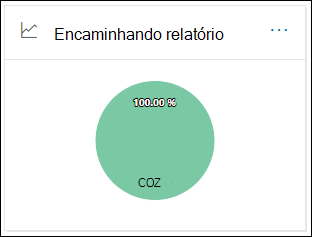

### Exibição de relatório para o relatório de encaminhamentoReport view for the Forwarding report

Os gráficos a seguir estão disponíveis no modo de exibição de relatório:The following charts are available in the report view:

- **Mostrar dados para: métodos de encaminhamento**: os seguintes métodos são mostrados:**Show data for: Forwarding methods**: The following methods are shown:

  - **Regra de transporte**: também conhecida como [regras de fluxo de emails](https://docs.microsoft.com/Exchange/security-and-compliance/mail-flow-rules/mail-flow-rules).**Transport rule**: Also known as [mail flow rules](https://docs.microsoft.com/Exchange/security-and-compliance/mail-flow-rules/mail-flow-rules).
  - **Regra de caixa de correio**: também conhecida como [regras de caixa de entrada](https://support.microsoft.com/office/c24f5dea-9465-4df4-ad17-a50704d66c59).**Mailbox rule**: Also known as [Inbox rules](https://support.microsoft.com/office/c24f5dea-9465-4df4-ad17-a50704d66c59).

  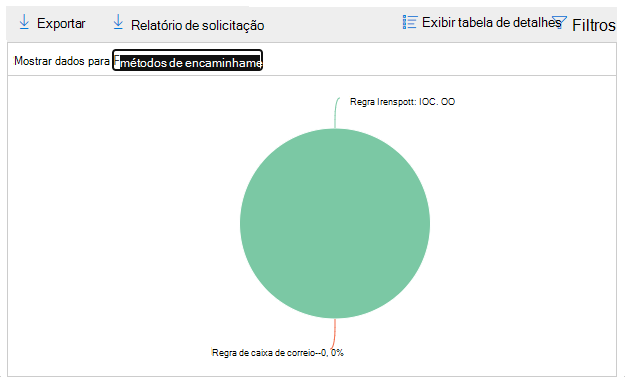

- **Mostrar dados para: encaminhar domínios**: este modo de exibição mostra os domínios de destinatário que são os destinos para encaminhamento.**Show data for: Forwarding domains**: This view shows the recipient domains that are the destinations for forwarding.

  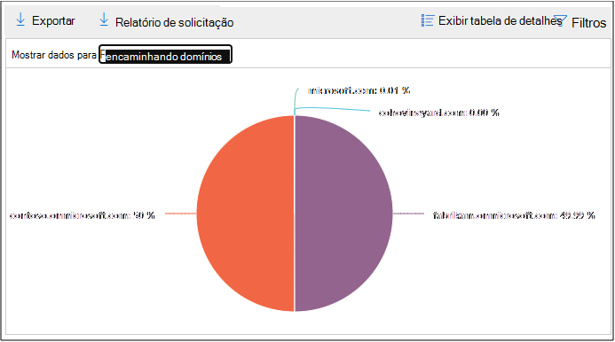

- **Mostrar dados para: encaminhadores**: os seguintes encaminhadores são mostrados:**Show data for: Forwarders**: The following forwarders are shown:

  - **Regra de transporte****Transport rule**
  - A caixa de correio que contém a regra de caixa de entrada de encaminhamento.The mailbox that contains the forwarding Inbox rule.

  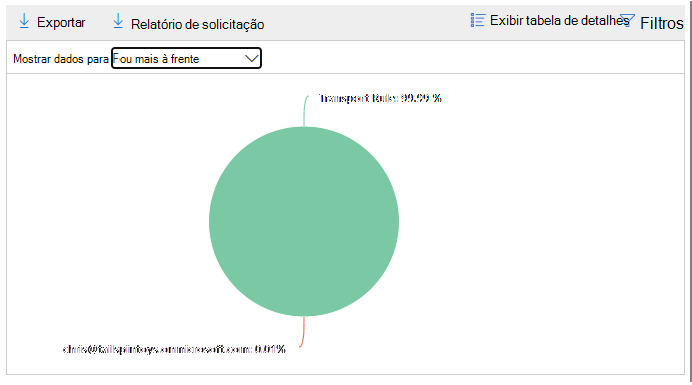

Se você clicar em **filtros** em um modo de exibição de relatório, poderá especificar um intervalo de datas com **data de início** e data de **término**.If you click **Filters** in a report view, you can specify a date range with **Start date** and **End date**.

### Exibição da tabela de detalhes para o relatório de encaminhamentoDetails table view for the Forwarding report

Se você clicar em **Exibir tabela de detalhes** em um modo de exibição de relatório, as seguintes informações serão exibidas:If you click **View details table** in a report view, the following information is shown:

- **Encaminhadores**: a **regra de transporte** de valor ou a caixa de correio que contém a regra de caixa de entrada de encaminhamento.**Forwarders**: The value **Transport rule** or the mailbox that contains the forwarding Inbox rule.
- **Tipo de encaminhamento**: a **regra de caixa de correio** de valor ou a **regra de transporte**.**Forwarding type**: The value **Mailbox rule** or **Transport rule**.
- **Nome do destinatário****Recipient name**
- **Domínio do destinatário****Recipient domain**
- **Detalhes**: Este é o valor de GUID da regra de fluxo de emails ou o valor RuleIdentity da regra de caixa de entrada.**Details**: This is the GUID value of the mail flow rule, or the RuleIdentity value of the Inbox rule.
- **Count****Count**
- **Primeira data de encaminhamento****First forward date**

Se você clicar em **filtros** em um modo de exibição de tabela detalhes, poderá especificar um intervalo de datas com **data de início** e data de **término**.If you click **Filters** in a details table view, you can specify a date range with **Start date** and **End date**.

Para voltar para o modo de exibição relatórios, clique em **Exibir relatório**.To go back to the reports view, click **View report**.

## Relatório de status do fluxoMailflow status report

O **relatório de status do fluxo** é semelhante ao [relatório de email enviado e recebido](#sent-and-received-email-report), com informações adicionais sobre o email permitido ou bloqueado na borda.The **Mailflow status report** is similar to the [Sent and received email report](#sent-and-received-email-report), with additional information about email allowed or blocked on the edge. Este é o único relatório que contém as informações de proteção de borda e mostra o quanto o email é bloqueado antes de ser permitido ao serviço para avaliação pelo Exchange Online Protection (EOP).This is the only report that contains edge protection information, and shows just how much email is blocked before being allowed into the service for evaluation by Exchange Online Protection (EOP). É importante entender que, se uma mensagem for enviada para cinco destinatários, contaremos como cinco mensagens diferentes e não uma mensagem.It's important to understand that if a message is sent to five recipients we count it as five different messages and not one message.
Para exibir o relatório, abra o [centro de conformidade & segurança](https://protection.office.com), vá **Reports** para \> **painel** relatórios e selecione **fluxo relatório de status**.To view the report, open the [Security & Compliance Center](https://protection.office.com), go to **Reports** \> **Dashboard** and select **Mailflow status report**. Para ir diretamente para o **relatório de status de fluxo de emails**, abra <https://protection.office.com/mailflowStatusReport> .To go directly to the **Mail flow status report**, open <https://protection.office.com/mailflowStatusReport>.

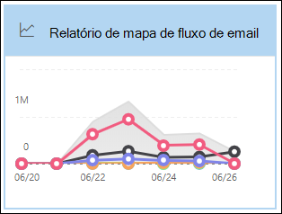

### Modo de exibição de tipo para o relatório de status fluxoType view for the Mailflow status report

Quando você abre o relatório, a guia **tipo** é selecionada por padrão.When you open the report, the **Type** tab is selected by default. Por padrão, este modo de exibição contém um gráfico e uma tabela de dados que é configurada com os seguintes filtros:By default, this view contains a chart and a data table that's configured with the following filters:

- **Data**: os últimos 7 dias.**Date**: The last 7 days.
- **Direção**:**Direction**:

  - **Entrada****Inbound**
  - **Saída****Outbound**
  - **Intra-org**: essa contagem é para mensagens dentro de um locatário, ou seja,**Intra-org**: this count is for messages within a tenant i.e o remetente abc@domain.com envia para o destinatário xyz@domain.com (contado separadamente de **entrada** e **saída**)sender abc@domain.com sends to recipient xyz@domain.com  (counted separately from **Inbound** and **Outbound**)

- **Tipo**:**Type**:

  - **Boa mensagem****Good mail**
  - **Malware****Malware**
  - **Spam****Spam**
  - **Proteção de borda****Edge protection**
  - **Mensagens de regra****Rule messages**
  - **Email de phishing****Phishing email**

O gráfico é organizado pelos valores de **tipo** .The chart is organized by the **Type** values.

Você pode alterar esses filtros clicando em **Filtrar** ou clicando em um valor na legenda do gráfico.You can change these filters by clicking **Filter** or by clicking a value in the chart legend.

A tabela de dados contém as seguintes informações:The data table contains the following information:

- **Direção****Direction**
- **Tipo****Type**
- **24 horas****24 hours**
- **3 dias****3 days**
- **7 dias****7 days**
- **15 dias****15 days**
- **30 dias****30 days**

Se você clicar em **escolher uma categoria para obter mais detalhes**, poderá selecionar os seguintes valores:If you click **Choose a category for more details**, you can select from the following values:

- **Email de phishing**: esta seleção leva você para o [relatório de status de proteção contra ameaças](view-email-security-reports.md#threat-protection-status-report).**Phishing email**: This selection takes you to the [Threat protection status report](view-email-security-reports.md#threat-protection-status-report).
- **Malware em email**: esta seleção leva você para o [relatório de status de proteção contra ameaças](view-email-security-reports.md#threat-protection-status-report).**Malware in email**: This selection takes you to the [Threat protection status report](view-email-security-reports.md#threat-protection-status-report).
- **Detecções de spam**: esta seleção leva você para o [relatório de detecções de spam](view-email-security-reports.md#spam-detections-report).**Spam detections**: This selection takes you to the [Spam Detections report](view-email-security-reports.md#spam-detections-report).
- **Bloqueio de spam bloqueado**: esta seleção leva você para o [relatório de detecções de spam](view-email-security-reports.md#spam-detections-report).**Edge blocked spam**: This selection takes you to the [Spam Detections report](view-email-security-reports.md#spam-detections-report).

**Exportar**:**Export**:

Para o modo de exibição de detalhes, você só pode exportar dados por um dia.For the detail view, you can only export data for one day. Portanto, se você quiser exportar dados por 7 dias, precisará de sete diferentes ações de exportação.So, if you want to export data for 7 days, you need to do 7 different export actions.

Cada arquivo. csv exportado está limitado a 150.000 linhas.Each exported .csv file is limited to 150,000 rows. Se os dados desse dia contiverem mais de 150.000 linhas, vários arquivos. csv serão criados.If the data for that day contains more than 150,000 rows, then multiple .csv files will be created.

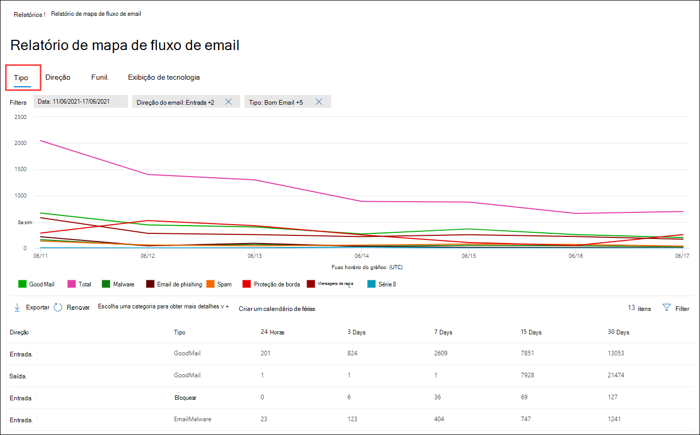

### Exibição de direção para o relatório de status do fluxoDirection view for the Mailflow status report

Se você clicar na guia **direção** , os mesmos filtros padrão do modo de exibição de **tipo** serão usados.If you click the **Direction** tab, the same default filters from the **Type** view are used.

O gráfico é organizado por valores de **direção** .The chart is organized by **Direction** values.

Você pode alterar esses filtros clicando em **Filtrar** ou clicando em um valor na legenda do gráfico.You can change these filters by clicking **Filter** or by clicking a value in the chart legend. Os mesmos filtros do **tipo** de exibição são usados.The same filters from the **Type** view are used.

A tabela de dados contém as mesmas informações do **tipo** de exibição.The data table contains same information from the **Type** view.

A **escolha uma categoria para obter detalhes sobre** as seleções e o comportamento disponíveis são os mesmos que o modo de exibição de **tipo** .The **Choose a category for more details** available selections and behavior are the same as the **Type** view.

**Exportar**:**Export**:

Para o modo de exibição de detalhes, você só pode exportar dados por um dia.For the detail view, you can only export data for one day. Portanto, se você quiser exportar dados por 7 dias, precisará de sete diferentes ações de exportação.So, if you want to export data for 7 days, you need to do 7 different export actions.

Cada arquivo. csv exportado está limitado a 150.000 linhas.Each exported .csv file is limited to 150,000 rows. Se os dados desse dia contiverem mais de 150.000 linhas, vários arquivos. csv serão criados.If the data for that day contains more than 150,000 rows, then multiple .csv files will be created.

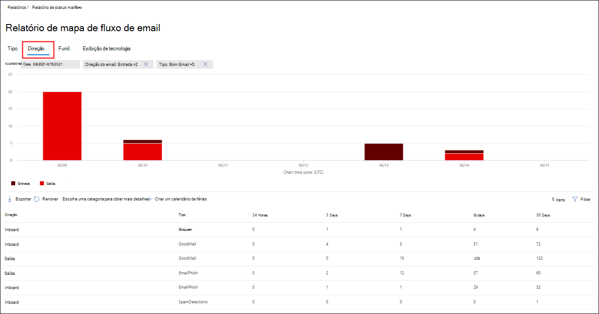

### Exibição de funil para o relatório de status fluxoFunnel view for the Mailflow status report

O modo de exibição do **funil** mostra como os recursos de proteção contra ameaças de email da Microsoft filtram os emails de entrada e de saída em sua organização.The **Funnel** view shows you how Microsoft's email threat protection features filter incoming and outgoing email in your organization. Ele fornece detalhes sobre a contagem total de emails e como os recursos de proteção contra ameaças configuradas, incluindo proteção de borda, Antimalware, anti-phishing, antispam e anti-falsificação, afetam essa contagem.It provides details on the total email count, and how the configured threat protection features, including edge protection, anti-malware, anti-phishing, anti-spam, and anti-spoofing affect this count.

Se você clicar na guia **funil** , por padrão, este modo de exibição contém um gráfico e uma tabela de dados que é configurada com os seguintes filtros:If you click the **Funnel** tab, by default, this view contains a chart and a data table that's configured with the following filters:

- **Data**: os últimos 7 dias.**Date**: The last 7 days.

- **Direção**:**Direction**:

  - **Entrada****Inbound**
  - **Saída****Outbound**
  - **Intra-org**: essa contagem é para mensagens enviadas dentro de um locatário; ou seja, o remetente abc@domain.com envia para o destinatário xyz@domain.com (contado separadamente de entrada e saída).**Intra-org**: This count is for messages sent within a tenant; i.e, sender abc@domain.com sends to recipient xyz@domain.com (counted separately from Inbound and Outbound).

O modo de exibição de agregação e o modo de exibição de tabela de dados permitem 90 dias de filtragem.The aggregate view and data table view allow for 90 days of filtering.

Se você clicar em **filtro**, poderá filtrar tanto o gráfico quanto a tabela de dados.If you click **Filter**, you can filter both the chart and the data table.

Este gráfico mostra a contagem de emails organizada por:This chart shows the email count organized by:

- **Email total****Total email**
- **Email após proteção de borda****Email after edge protection**
- **Email após anti-malware, reputação de arquivo, bloco de tipo de arquivo****Email after anti-malware, file reputation, file type block**
- **Email após anti-Phish, reputação da URL, representação da marca, antifalsificação****Email after anti-phish, URL reputation, brand impersonation, anti-spoof**
- **Email após anti-spam, filtragem de email em massa****Email after anti-spam, bulk mail filtering**
- **Email após representação de usuário e domínio**1**Email after user and domain impersonation**1
- **Email após arquivo e URL acionamento**1**Email after file and URL detonation**1
- **Email detectado como benigno após a proteção após a entrega (URL clique em proteção de tempo)****Email detected as benign after post-delivery protection (URL click time protection)**

1 somente o Office 365 ATP1 Office 365 ATP only

Para exibir o email filtrado por EOP ou ATP separadamente, clique no valor na legenda do gráfico.To view the email filtered by EOP or ATP separately, click on the value in the chart legend.

A tabela de dados contém as informações a seguir, mostradas em ordem decrescente de data:The data table contains the following information, shown in descending date order:

- **Date****Date**
- **Email total****Total email**
- **Proteção de borda****Edge protection**
- **Anti-malware, reputação de arquivo, bloco de tipo de arquivo****Anti-malware, file reputation, file type block**
- **Anti-Phish, reputação da URL, representação da marca, anti-falsificação****Anti-phish, URL reputation, Brand impersonation, anti-spoof**
- **Anti-spam, filtragem de email em massa****Anti-spam, bulk mail filtering**
- **Personificação de usuário e domínio (ATP)****User and domain impersonation (ATP)**
- **Arquivo e URL acionamento (ATP)****File and URL detonation (ATP)**
- **Proteção de post-entrega e ZAP (ATP) ou ZAP (EOP)****Post-delivery protection and ZAP (ATP), or ZAP (EOP)**

Se você selecionar uma linha na tabela de dados, uma divisão adicional das contagens de email será mostrada no submenu.If you select a row in the data table, a further breakdown of the email counts are shown in the flyout.

**Exportar**:**Export**:

Depois de clicar em **Exportar** em **Opções**, você pode selecionar um dos seguintes valores:After you click **Export** under **Options**, you can select one of the following values:

- **Resumo (com dados dos últimos 90 dias no máximo)****Summary (with data for last 90 days at most)**
- **Detalhes (com dados nos últimos 30 dias)****Details (with data for last 30 days at most)**

Em **Data**, escolha um intervalo e clique em **aplicar**.Under **Date**, choose a range, and then click **Apply**. Os dados dos filtros atuais serão exportados para um arquivo. csv.Data for the current filters will be exported to a .csv file.

Cada arquivo. csv exportado está limitado a 150.000 linhas.Each exported .csv file is limited to 150,000 rows. Se os dados contiverem mais de 150.000 linhas, vários arquivos. csv serão criados.If the data contains more than 150,000 rows, then multiple .csv files will be created.

 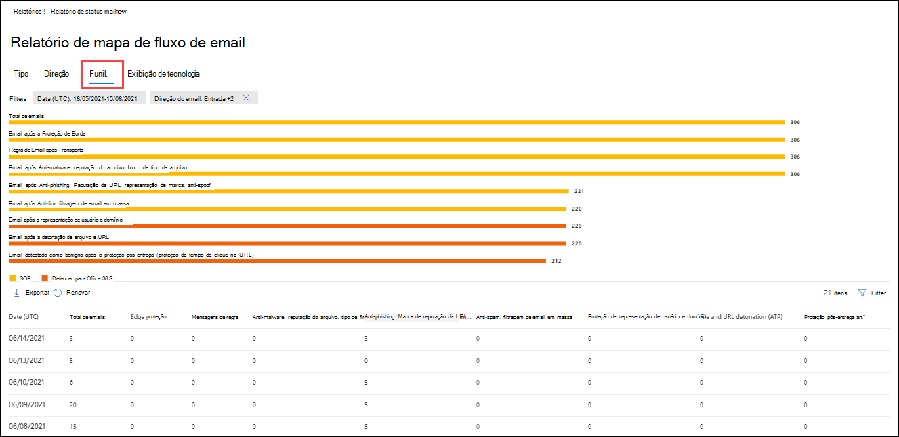

### Exibição de Tech para o relatório de status do fluxoTech view for the Mailflow status report

O **modo de exibição técnico** é semelhante ao modo de exibição do **funil** , fornecendo detalhes mais granulares para os recursos configurados de proteção contra ameaças.The **Tech view** is similar to the **Funnel** view, providing more granular details for the configured threat protections features. No gráfico, você pode ver como as mensagens são categorizadas em diferentes estágios de proteção contra ameaças.From the chart, you can see how messages are categorized at the different stages of threat protection.

Se você clicar na guia **Tech View** , por padrão, este modo de exibição contém um gráfico e uma tabela de dados que é configurada com os seguintes filtros:If you click the **Tech view** tab, by default, this view contains a chart and a data table that's configured with the following filters:

- **Data**: os últimos 7 dias.**Date**: The last 7 days.

- **Direção**:**Direction**:

  - **Entrada****Inbound**
  - **Saída****Outbound**
  - **Intra-org**: essa contagem é para mensagens dentro de um locatário, ou seja,**Intra-org**: this count is for messages within a tenant i.e o remetente abc@domain.com envia para o destinatário xyz@domain.com (contado separadamente de entrada e saída)sender abc@domain.com sends to recipient xyz@domain.com (counted separately from Inbound and Outbound)

O modo de exibição de agregação e o modo de exibição de tabela de dados permitem 90 dias de filtragem.The aggregate view and data table view allow for 90 days of filtering.

Se você clicar em **filtro**, poderá filtrar tanto o gráfico quanto a tabela de dados.If you click **Filter**, you can filter both the chart and the data table.

Este gráfico mostra as mensagens organizadas nas seguintes categorias:This chart shows messages organized into the following categories:

- **Email total****Total email**
- **Permitir borda, borda filtrada****Edge allow, edge filtered**
- **Não é malware, detecção de anexos seguros (ATP), detecção de mecanismo Antimalware, bloco de regras****Not malware, Safe attachments detection (ATP), Anti-malware engine detection, rule block**
- **Não Phish, falha DMARC, detecção de personificação, detecção de falsificação, detecção de phishing****Not phish, DMARC failure, impersonation detection, spoof detection, phish detection**
- **Nenhuma detecção com a URL acionamento, detecção de acionamento de URL (ATP)****No detection with URL detonation, URL detonation detection (ATP)**
- **Não spam, spam****Not spam, spam**
- **Email não mal-intencionado, detecção de links seguros (ATP), ZAP****Non-malicious email, safe links detection (ATP), ZAP**

Ao passar o mouse sobre uma categoria no gráfico, você pode ver o número de mensagens nessa categoria.When you hover over a category in the chart, you can see the number of messages in that category.

A tabela de dados contém as informações a seguir, mostradas em ordem decrescente de data:The data table contains the following information, shown in descending date order:

- **Date****Date**
- **Email total****Total email**
- **Borda filtrada****Edge filtered**
- **Mecanismo Antimalware, anexos seguros, regra filtrada****Anti-malware engine, safe attachments, rule filtered**
- **DMARC, representação, falsificação, phishing filtrado****DMARC, impersonation, spoof, phish filtered**
- **Detecção de URL acionamento****URL detonation detection**
- **Filtrado por antispam****Anti-spam filtered**
- **ZAP removido****ZAP removed**
- **Detecção por links seguros****Detection by safe links**

Se você selecionar uma linha na tabela de dados, uma divisão adicional das contagens de email será mostrada no submenu.If you select a row in the data table, a further breakdown of the email counts are shown in the flyout.

**Exportar**:**Export**:

Ao clicar em **Exportar**, em **Opções** , você pode selecionar um dos seguintes valores:On clicking **Export**, under **Options** you can select one of the following values:

- **Resumo (com dados dos últimos 90 dias no máximo)****Summary (with data for last 90 days at most)**
- **Detalhes (com dados nos últimos 30 dias)****Details (with data for last 30 days at most)**

Em **Data**, escolha um intervalo e clique em **aplicar**.Under **Date**, choose a range, and then click **Apply**. Os dados dos filtros atuais serão exportados para um arquivo. csv.Data for the current filters will be exported to a .csv file.

Cada arquivo. csv exportado está limitado a 150.000 linhas.Each exported .csv file is limited to 150,000 rows. Se os dados contiverem mais de 150.000 linhas, vários arquivos. csv serão criados.If the data contains more than 150,000 rows, then multiple .csv files will be created.

 

## Relatório de email enviado e recebidoSent and received email report

O relatório de **email enviado e recebido** é um relatório inteligente que mostra informações sobre emails de entrada e saída, incluindo detecções de spam, malware e email identificados como "bom".The **Sent and received email** report is a smart report that shows information about incoming and outgoing email, including spam detections, malware, and email identified as "good." A diferença entre este relatório e o [relatório de status do fluxo](#mailflow-status-report) é: este relatório não inclui dados sobre mensagens bloqueadas pela proteção de borda.The difference between this report and the [Mailflow status report](#mailflow-status-report) is: this report doesn't include data about messages blocked by edge protection.

O modo de exibição de agregação e o modo de exibição de detalhes do relatório permitem que 90 dias de filtragem.The aggregate view and the detail view of the report allow for 90 days of filtering.

Para exibir o relatório, abra o [centro de conformidade & segurança](https://protection.office.com), vá **Reports** para \> **painel** relatórios e selecione **email enviado e recebido**.To view the report, open the [Security & Compliance Center](https://protection.office.com), go to **Reports** \> **Dashboard** and select **Sent and received email**. Para ir diretamente para o relatório, abra <https://protection.office.com/reportv2?id=SentAndReceivedMailATP> .To go directly to the report, open <https://protection.office.com/reportv2?id=SentAndReceivedMailATP>.

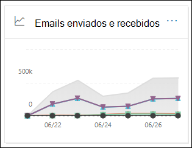

### Exibição de relatório para o relatório de email enviado e recebidoReport view for the Sent and received email report

Os gráficos a seguir estão disponíveis no modo de exibição de relatório:The following charts are available in the report view:

- **Divisão por: digite**: o gráfico mostra todas as categorias disponíveis:**Break down by: Type**: The chart shows all available categories:

  - **Total****Total**
  - **Boa mensagem****Good mail**
  - **Malware (anti-malware)** (EOP)**Malware (anti-malware)** (EOP)
  - **Detecções de spam****Spam detections**
  - **Mensagens de regra****Rule messages**
  - **Malware avançado** (Office 365 ATP)**Advanced malware** (Office 365 ATP)

  Ao passar o mouse sobre um dia (ponto de dados) no gráfico, você pode ver detalhes desse dia.When you hover over a day (data point) in the chart, you can see details for that day.

  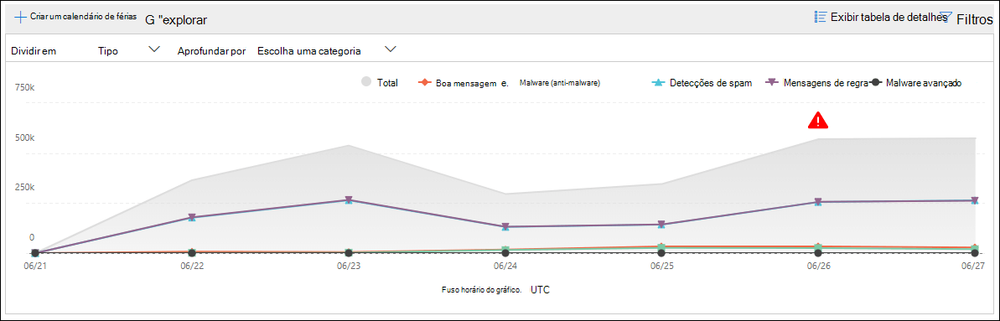

- **Divisão por: direção**: o gráfico mostra os dados **total**, de **entrada**e de **saída** .**Break down by: Direction**: The chart shows **Total**, **Inbound**, and **Outbound** data. Ao passar o mouse sobre um dia (ponto de dados) no gráfico, você pode ver detalhes desse dia.When you hover over a day (data point) in the chart, you can see details for that day.

  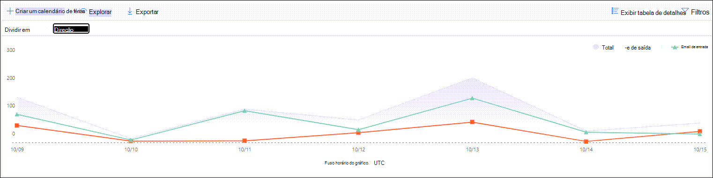

- **Aprofundar por** \> **Malware (Antimalware)**: esta seleção leva você para as [detecções de malware no relatório de email](view-email-security-reports.md#malware-detections-in-email-report).**Drill down by** \> **Malware (anti-malware)**: This selection takes you to the [Malware detections in email report](view-email-security-reports.md#malware-detections-in-email-report).

- **Aprofundar por** \> **Detecções de spam)**: esta seleção leva você para o [relatório de detecções de spam](view-email-security-reports.md#spam-detections-report).**Drill down by** \> **Spam detections)**: This selection takes you to the [Spam Detections report](view-email-security-reports.md#spam-detections-report).

Se você clicar em **filtros** em um modo de exibição de relatório, poderá modificar os resultados com os seguintes filtros:If you click **Filters** in a report view, you can modify the results with the following filters:

- **Data de início** e **data de término****Start date** and **End date**
- Valores de direçãoDirection values
- Valores de tipoType values

Para voltar para o modo de exibição de relatório, clique em **Exibir relatório**.To go back to the report view, click **View report**.

### Exibição da tabela de detalhes para o relatório de email enviado e recebidoDetails table view for the Sent and received email report

Se você clicar em **Exibir tabela de detalhes** na tela **dividir por: direção** ou **dividir em: direção** , as seguintes informações são mostradas:If you click **View details table** in the **Break down by: Direction** or **Break down by: Direction** view, the following information is shown:

- **Data (UTC)****Date (UTC)**
- **Tipo****Type**
- **Direção****Direction**
- **Contagem de mensagem****Message count**

Se você clicar em **filtros** em um modo de exibição de tabela de detalhes, poderá modificar os resultados com os seguintes filtros:If you click **Filters** in a details table view, you can modify the results with the following filters:

- **Data de início** e **data de término****Start date** and **End date**
- Valores de direçãoDirection values
- Valores de tipoType values

Para voltar para o modo de exibição de relatório, clique em **Exibir relatório**.To go back to the report view, click **View report**.

## Relatório de principais remetentes e destinatáriosTop senders and recipients report

O relatório de **remetentes e destinatários principais** é um gráfico de pizza mostrando seus principais remetentes e destinatários de email.The **Top senders and recipients** report is a pie chart showing your top email senders and recipients.

Para exibir o relatório, abra o [centro de conformidade & segurança](https://protection.office.com), vá **Reports** para \> **painel** relatórios e selecione **os principais remetentes e destinatários**.To view the report, open the [Security & Compliance Center](https://protection.office.com), go to **Reports** \> **Dashboard** and select **Top senders and recipients**. Para ir diretamente para o relatório, abra <https://protection.office.com/reportv2?id=TopSenderRecipientsATP> .To go directly to the report, open <https://protection.office.com/reportv2?id=TopSenderRecipientsATP>.

### Exibição de relatório para os principais remetentes e o relatório de destinatáriosReport view for the Top senders and recipient report

Os gráficos a seguir estão disponíveis no modo de exibição de relatório:The following charts are available in the report view:

- **Mostrar dados para os \> principais remetentes de email****Show data for \> Top mail senders**
- **Mostrar dados para \> destinatários de email principais****Show data for \> Top mail recipients**
- **Mostrar dados para \> os principais destinatários de spam****Show data for \> Top spam recipients**
- **Mostrar dados para \> Principais destinatários de malware** (EOP)**Show data for \> Top malware recipients** (EOP)
- **Mostrar dados para \> Principais destinatários de malware (ATP)** (Office 365 ATP)**Show data for \> Top malware recipients (ATP)** (Office 365 ATP)

A composição do gráfico de pizza é alterada com base nessas seleções.The composition of the pie chart changes based on these selections.

Ao passar o mouse sobre uma fatia no gráfico de pizza, você pode ver uma contagem de mensagens enviadas ou recebidas.When you hover over a wedge in the pie chart, you can see a count of messages sent or received.

Se você clicar em **filtros** em um modo de exibição de relatório, poderá especificar um intervalo de datas com **data de início** e data de **término**.If you click **Filters** in a report view, you can specify a date range with **Start date** and **End date**.

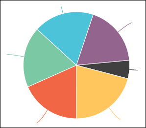

### Exibição da tabela de detalhes para os principais remetentes e o relatório de destinatáriosDetails table view for the Top senders and recipient report

Se você clicar em **Exibir tabela de detalhes**, as informações mostradas dependem do gráfico que você estava observando:If you click **View details table**, the information that's shown depends on the chart you were looking at:

- **Mostrar dados para os \> principais remetentes de email****Show data for \> Top mail senders**

  - **Principais remetentes de email****Top mail senders**
  - **Count****Count**

- **Mostrar dados para \> destinatários de email principais****Show data for \> Top mail recipients**

  - **Principais destinatários de email****Top mail recipients**
  - **Count****Count**

- **Mostrar dados para \> os principais destinatários de spam****Show data for \> Top spam recipients**

  - **Principais destinatários de spam****Top spam recipients**
  - **Count****Count**

- **Mostrar dados para \> Principais destinatários de malware** (EOP)**Show data for \> Top malware recipients** (EOP)

  - **Principais destinatários de malware****Top malware recipients**
  - **Count****Count**

- **Mostrar dados para \> Principais destinatários de malware (ATP)** (Office 365 ATP)**Show data for \> Top malware recipients (ATP)** (Office 365 ATP)

  - **Principais destinatários de malware (ATP)****Top malware recipients (ATP)**
  - **Count****Count**

Se você clicar em **filtros** em um modo de exibição de tabela detalhes, poderá especificar um intervalo de datas com **data de início** e data de **término**.If you click **Filters** in a details table view, you can specify a date range with **Start date** and **End date**.

Para voltar para o modo de exibição de relatório, clique em **Exibir relatório**.To go back to the report view, click **View report**.

## Quais permissões são necessárias para exibir esses relatórios?What permissions are needed to view these reports?

Para exibir e usar os relatórios, você precisa ser membro do grupo de função especificado no centro de conformidade e segurança & **e** no Exchange Online.To view and use the reports, you need to be a member of the specified role group in the Security & Compliance Center **and** in Exchange Online.

- No centro de conformidade & segurança, você precisa ser membro de um dos seguintes grupos de função:In the Security & Compliance Center, you need to be a member of one of the following role groups:

  – Gerenciamento de organização-administrador de segurança (você também pode fazer isso no [centro de administração do Azure Active Directory](https://aad.portal.azure.com) -leitor de segurança-Organization Management -Security Administrator (you can also do this in the [Azure Active Directory admin center](https://aad.portal.azure.com) -Security Reader

  Para saber mais, confira [Permissões no Centro de Conformidade de Segurança](https://docs.microsoft.com/microsoft-365/security/office-365-security/permissions-in-the-security-and-compliance-center).For more information, see [Permissions in the Security & Compliance Center](https://docs.microsoft.com/microsoft-365/security/office-365-security/permissions-in-the-security-and-compliance-center).

- No Exchange Online, você precisa ser membro de um dos grupos de função a seguir:In Exchange Online, you need to be a member of one of the following role groups:

  – Gerenciamento de organização – gerenciamento de organização somente de exibição-somente os destinatários do gerenciamento de conformidade-Organization Management -View-only Organization Management -View-Only Recipients -Compliance Management

Para obter mais informações, consulte [permissões no Exchange Online](https://docs.microsoft.com/Exchange/permissions-exo/permissions-exo) e [gerenciar grupos de função no Exchange Online](https://docs.microsoft.com/Exchange/permissions-exo/role-groups).For more information, see [Permissions in Exchange Online](https://docs.microsoft.com/Exchange/permissions-exo/permissions-exo) and [Manage role groups in Exchange Online](https://docs.microsoft.com/Exchange/permissions-exo/role-groups).

## Tópicos relacionadosRelated topics

[Relatórios inteligentes e insights no Centro de Conformidade e SegurançaSmart reports and insights in the Security & Compliance Center](reports-and-insights-in-security-and-compliance.md)

[Insights de fluxo de emails no Centro de Conformidade e SegurançaMail flow insights in the Security & Compliance Center](mail-flow-insights-v2.md)

[Exibir relatórios de segurança de email no centro de conformidade & segurançaView email security reports in the Security & Compliance Center](view-email-security-reports.md)

[Exibir relatórios para a proteção avançada contra ameaças do Office 365View reports for Office 365 Advanced Threat Protection](view-reports-for-atp.md)
