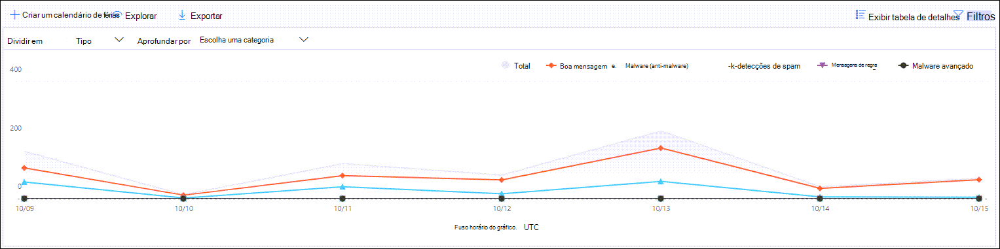

# Exibir relatórios de fluxo de emails no painel Relatórios no Centro de Conformidade e & Segurança

[!INCLUDE [Microsoft 365 Defender rebranding](../includes/microsoft-defender-for-office.md)]

**Aplica-se a**
- [Proteção do Exchange Online](exchange-online-protection-overview.md)
- [Plano 1 e plano 2 do Microsoft Defender para Office 365](office-365-atp.md)
- [Microsoft 365 Defender](../mtp/microsoft-threat-protection.md)

Além dos relatórios de fluxo de emails  que estão disponíveis no painel Fluxo de emails no Centro de Conformidade e Segurança, uma variedade de relatórios de fluxo de emails adicionais estão disponíveis no painel Relatórios para ajudá-lo & a monitorar sua organização do Microsoft 365.

Se você tiver as [permissões necessárias,](#what-permissions-are-needed-to-view-these-reports)poderá exibir esses relatórios no Centro de Conformidade & segurança [indo](https://protection.office.com) para o Painel **de** \> **Relatórios.** Para ir diretamente para o painel Relatórios, abra <https://protection.office.com/insightdashboard> .

## Relatório do conector

O **relatório conector** mostra a atividade de fluxo de emails nos conectores de entrada e de saída [configurados](https://docs.microsoft.com/Exchange/mail-flow-best-practices/use-connectors-to-configure-mail-flow/use-connectors-to-configure-mail-flow) para sua organização.

Para exibir o relatório, abra o [Centro de Conformidade & Segurança,](https://protection.office.com)vá para o Painel de Relatórios e selecione o relatório do  \>  **Conector.** Para ir diretamente para o relatório, abra <https://protection.office.com/reportv2?id=ConnectorReport> .

### Report view for the Connector report

Os gráficos a seguir estão disponíveis no visualização de relatório:

- **Exibir dados por: Fluxo de emails:** este gráfico mostra o número de mensagens de entrada e de saída organizadas por:

  - **Total**
  - **Da Internet sem um conector**
  - **Para a Internet sem um conector**
  - Um conector específico que você configurou.

  Para isolar os dados no gráfico, use show **data for** control to select one of these options or All **mail flow**.

  

- **Exibir dados por: uso de TLS:** este gráfico mostra a porcentagem de uso da versão TLS (Transport Layer Security) para o fluxo de emails.

  Para isolar os dados no gráfico, use Show **data for** control para selecionar uma das seguintes opções:

  - **Todo o fluxo de emails**
  - **Da Internet sem um conector**
  - **Para a Internet sem um conector**
  - Um conector específico que você configurou.

  

Se você clicar em **Filtros** em uma exibição de relatório, poderá especificar um intervalo de datas com data **de** início **e data de término.**

### Details table view for the Connector report

Se você clicar em **Exibir tabela de detalhes** em uma exibição de relatório, as seguintes informações serão mostradas:

- **Date**
- **Nome e direção do conector**
- **Tipo de conector**
- **TLS forçado?**: o valor **True** ou **False**.
- **Sem TLS** (porcentagem)
- **TLS 1.0** (porcentagem)
- **TLS 1.1** (porcentagem)
- **TLS 1.2** (porcentagem)
- **Volume**: o número de mensagens.

Se você clicar em **Filtros** em uma exibição de tabela de detalhes, poderá especificar um intervalo de datas com data de **início** **e data de término.**

Para voltar para a exibição de relatório, clique em **Exibir relatório**.

## Relatório de regras de transporte do Exchange

O **relatório de regras de transporte** do Exchange mostra o efeito das regras de fluxo de emails (também conhecidas como regras de transporte) em mensagens de entrada e saída em sua organização.

Para exibir o relatório, abra o [Centro de Conformidade & Segurança,](https://protection.office.com)vá para o Painel de Relatórios e selecione a regra de Transporte do  \>  **Exchange.** Para ir diretamente para o relatório, abra <https://protection.office.com/reportv2?id=ETRRuleReport> .

### Exibição de relatório para o relatório de regras de transporte do Exchange

Os gráficos a seguir estão disponíveis no visualização de relatório:

- **Exibir dados por: regras de transporte do** \> Exchange **Down by: Direction :** This chart shows the number of **Inbound** and **Outbound** messages that were affected by transport rules.

- **Exibir dados por: regras de transporte do** \> Exchange **Intervalo por: Gravidade:** Este gráfico mostra  o número de mensagens de gravidade alta e **média** e **de baixa** gravidade. Você pode definir o nível de severidade como uma ação na regra (**Auditar** esta regra com nível de severidade _ou SetAuditSeverity_). Para saber mais, confira [Ações de regra de fluxo de emails no Exchange Online.](https://docs.microsoft.com//Exchange/security-and-compliance/mail-flow-rules/mail-flow-rule-actions)

- **Exibir dados por: regras de transporte do Exchange** \> DLP **Intervalo por: Direção:** este gráfico  mostra o  número de mensagens de Entrada e Saída que foram afetadas pelas regras de transporte de prevenção contra perda de dados (DLP). Você pode refinar ainda mais o gráfico selecionando uma das seguintes opções:

  - **Mostrar dados para: Todas as regras de transporte de DLP**
  - **Mostrar dados para: usuários comprometidos**
  - **Mostrar dados para: Baixo volume de conteúdo detectado na Lei Patriot Act dos EUA**

- **Exibir dados por: regras de transporte do Exchange** \> DLP **Down by: Direction:** This view shows the number of **High severity** and **Medium severity**, and **Low severity** messages that were affected by DLP transport rules. Você pode refinar ainda mais o gráfico selecionando uma das seguintes opções:

  - **Mostrar dados para: Todas as regras de transporte de DLP**
  - **Mostrar dados para: usuários comprometidos**
  - **Mostrar dados para: Baixo volume de conteúdo detectado na Lei Patriot Act dos EUA**

Se você clicar **em Filtros** em uma exibição de relatório, poderá modificar os resultados com os seguintes filtros::

- **Data de início** e **data de término**
- Valores de direção
- Valores de severidade

### Visão de tabela de detalhes do relatório de regras de transporte do Exchange

Se você clicar **em Exibir tabela de** detalhes, as informações mostradas dependerão do gráfico que você estava olhando:

- **Exibir dados por: regras de Transporte do Exchange:**

  - **Date**
  - **Regra de transporte**
  - **Assunto**
  - **Endereço do remetente**.
  - **Endereço do destinatário**
  - **Severidade**
  - **Direção**

- **Exibir dados por: regras de transporte do Exchange DLP:**

  - **Date**
  - **Política de DLP**
  - **Regra de transporte**
  - **Assunto**
  - **Endereço do remetente**.
  - **Endereço do destinatário**
  - **Severidade**
  - **Direção**

Se você clicar em **Filtros** em uma exibição de tabela de detalhes, poderá modificar os resultados com os seguintes filtros:

- **Data de início** e **data de término**
- Valores de direção
- Valores de severidade

Para voltar para a exibição de relatório, clique em **Exibir relatório**.

## Relatório de encaminhamento

O **relatório de encaminhamento** mostra as mensagens encaminhadas automaticamente da sua organização para domínios externos das caixas de correio do Exchange Online. As mensagens encaminhadas podem representar um risco de segurança ou conformidade e podem indicar uma conta comprometida.

Para exibir o relatório, abra o [Centro de Conformidade &](https://protection.office.com)segurança, vá para o Painel de Relatórios e selecione o relatório de  \>  **encaminhamento.** Para ir diretamente para o relatório, abra <https://protection.office.com/reportv2?id=MailFlowForwarding> .

### Exibição de relatório para o relatório de encaminhamento

Os gráficos a seguir estão disponíveis na exibição de relatório:

- **Mostrar dados para: métodos de encaminhamento:** os seguintes métodos são mostrados:

  - **Regra de** transporte: também conhecida como [regras de fluxo de emails.](https://docs.microsoft.com/Exchange/security-and-compliance/mail-flow-rules/mail-flow-rules)
  - **Regra de caixa** de correio: também conhecida como [regras de Caixa de Entrada.](https://support.microsoft.com/office/c24f5dea-9465-4df4-ad17-a50704d66c59)

  

- **Mostrar dados para: Domínios de** encaminhamento: esta exibição mostra os domínios do destinatário que são os destinos para encaminhamento.

  

- **Mostrar dados para: Encaminhadores:** os seguintes encaminhadores são mostrados:

  - **Regra de transporte**
  - A caixa de correio que contém a regra de caixa de entrada de encaminhamento.

  

Se você clicar em **Filtros** em uma exibição de relatório, poderá especificar um intervalo de datas com data **de** início **e data de término.**

### Details table view for the Forwarding report

Se você clicar em **Exibir tabela de detalhes** em uma exibição de relatório, as seguintes informações serão mostradas:

- **Encaminhadores**: a regra **de transporte de** valor ou a caixa de correio que contém a regra de caixa de entrada de encaminhamento.
- **Tipo de encaminhamento: a** regra de **caixa de correio de** valor ou regra de **transporte**.
- **Nome do destinatário**
- **Domínio do destinatário**
- **Detalhes:** este é o valor de GUID da regra de fluxo de emails ou o valor ruleIdentity da regra de Caixa de Entrada.
- **Count**
- **Primeira data de encaminhamento**

Se você clicar em **Filtros** em uma exibição de tabela de detalhes, poderá especificar um intervalo de datas com data de **início** **e data de término.**

Para voltar para a exibição de relatórios, clique em **Exibir relatório.**

## Relatório de status do fluxo de mensagens

O **relatório de status do fluxo** de mensagens é semelhante ao relatório de emails enviados [e](#sent-and-received-email-report)recebidos, com informações adicionais sobre emails permitidos ou bloqueados na borda. Este é o único relatório que contém informações de proteção de borda e mostra quantos emails são bloqueados antes de serem permitidos no serviço para avaliação pelo Exchange Online Protection (EOP). É importante entender que, se uma mensagem for enviada a cinco destinatários, a contaremos como cinco mensagens diferentes e não como uma mensagem.
Para exibir o relatório, abra o [Centro de Conformidade &](https://protection.office.com)Segurança, vá para o Painel de Relatórios e selecione o relatório de status do fluxo de  \>  **mensagens.** Para ir diretamente para o relatório **de status de fluxo de emails,** abra <https://protection.office.com/mailflowStatusReport> .

### Type view for the Mailflow status report

Quando você abre o relatório, a **guia** Tipo é selecionada por padrão. Por padrão, esse modo de exibição contém um gráfico e uma tabela de dados configurados com os seguintes filtros:

- **Data:** os últimos 7 dias.
- **Direção:**

  - **Entrada**
  - **Saída**
  - **Dentro da organização:** essa contagem é para mensagens em um locatário, ou seja, sender abc@domain.com envia ao destinatário xyz@domain.com (contado separadamente de **Entrada** e **Saída**)

- **Tipo:**

  - **Email bom**
  - **Malware**
  - **Spam**
  - **Proteção de borda**
  - **Mensagens de regra**
  - **Email de phishing**

O gráfico é organizado pelos valores **Type.**

Você pode alterar esses filtros clicando em **Filtro** ou clicando em um valor na legenda do gráfico.

A tabela de dados contém as seguintes informações:

- **Direção**
- **Tipo**
- **24 horas**
- **3 dias**
- **7 dias**
- **15 dias**
- **30 dias**

Se você clicar **em Escolher uma categoria para obter mais** detalhes, poderá selecionar um dos seguintes valores:

- **Email de phishing:** essa seleção leva você ao relatório de [status de Proteção contra Ameaças.](view-email-security-reports.md#threat-protection-status-report)
- **Malware no email:** essa seleção leva você ao relatório de [status de Proteção contra Ameaças.](view-email-security-reports.md#threat-protection-status-report)
- **Detecções de** spam: essa seleção leva você ao relatório de [Detecções de Spam.](view-email-security-reports.md#spam-detections-report)
- **Spam bloqueado por borda:** essa seleção leva você ao relatório de [Detecções de Spam.](view-email-security-reports.md#spam-detections-report)

**Exportar:**

Para a exibição de detalhes, você só pode exportar dados para um dia. Portanto, se você quiser exportar dados por sete dias, precisará fazer 7 ações de exportação diferentes.

Cada arquivo .csv exportado é limitado a 150.000 linhas. Se os dados desse dia contiverem mais de 150.000 linhas, vários arquivos .csv serão criados.

### Exibição de direção para o relatório de status do fluxo de mensagens

Se você clicar na guia **Direção,** os mesmos filtros padrão do modo **de exibição** Tipo serão usados.

O gráfico é organizado por valores **de** direção.

Você pode alterar esses filtros clicando em **Filtro** ou clicando em um valor na legenda do gráfico. Os mesmos filtros do modo **de exibição** Tipo são usados.

A tabela de dados contém as mesmas informações do modo **de exibição** Tipo.

A **opção Escolher uma categoria para obter mais detalhes** sobre as seleções e o comportamento disponíveis são os mesmos que o modo de **exibição** Tipo.

**Exportar:**

Para a exibição de detalhes, você só pode exportar dados para um dia. Portanto, se você quiser exportar dados por sete dias, precisará fazer 7 ações de exportação diferentes.

Cada arquivo .csv exportado é limitado a 150.000 linhas. Se os dados desse dia contiverem mais de 150.000 linhas, vários arquivos .csv serão criados.

### Exibição de funil para o relatório de status do Fluxo de Mensagens

A **exibição** de funil mostra como os recursos de proteção contra ameaças de email da Microsoft filtram emails de entrada e de saída em sua organização. Ele fornece detalhes sobre a contagem total de emails e como os recursos de proteção contra ameaças configurados, incluindo proteção de borda, anti-malware, anti-phishing, anti-spam e anti-spoofing afetam essa contagem.

Se você clicar na guia **Funil,** por padrão, esse modo de exibição conterá um gráfico e uma tabela de dados configurada com os seguintes filtros:

- **Data:** os últimos 7 dias.

- **Direção:**

  - **Entrada**
  - **Saída**
  - **Dentro da organização:** essa contagem é para mensagens enviadas dentro de um locatário; Ou seja, o remetente abc@domain.com envia ao destinatário xyz@domain.com (contado separadamente da entrada e da saída).

A exibição agregada e a exibição da tabela de dados permitem 90 dias de filtragem.

Se você clicar **em Filtro,** poderá filtrar o gráfico e a tabela de dados.

Este gráfico mostra a contagem de emails organizada por:

- **Total de emails**
- **Email após proteção de borda**
- **Email após anti-malware, reputação do arquivo, bloco de tipo de arquivo**
- **Email após anti-phishing, reputação da URL, representação de marca, anti-spoof**
- **Email após anti-spam, filtragem de email em massa**
- **Email após a representação de usuário e domínio**1
- **Email após o arquivo e o a detonação de URL**1
- **Email detectado como benigno após a proteção pós-entrega (proteção de tempo de clique de URL)**

1 Defender para Office 365 somente

Para exibir o email filtrado pelo EOP ou pelo Defender para Office 365 separadamente, clique no valor na legenda do gráfico.

A tabela de dados contém as seguintes informações, mostradas em ordem decrescente:

- **Date**
- **Total de emails**
- **Proteção de borda**
- **Anti-malware, reputação do arquivo, bloco de tipo de arquivo:**
  - **Reputação do** arquivo: mensagens filtradas devido à identificação de um arquivo anexado por outros clientes da Microsoft.
  - **Bloqueio de tipo de** arquivo: Mensagens filtradas devido ao tipo de arquivo mal-intencionado identificado na mensagem.
- **Anti-phishing, reputação da URL, representação de marca, anti-spoof**:
  - **Reputação da URL:** mensagens filtradas devido à identificação da URL por outros clientes da Microsoft.
  - **Representação de marca:** mensagens filtradas devido à mensagem proveniente de uma marca conhecida que representa os senders.
  - **Anti-spoof:** Mensagens filtradas devido à mensagem que está tentando fazer a spoof de um domínio que o destinatário pertence, ou a um domínio que o remetente da mensagem não possui.
- **Anti-spam, filtragem de email em massa:**
  - **Filtragem de email em massa:** mensagens filtradas devido a uma tentativa de entregar emails em massa a seus destinatários.
- **Representação de usuário e domínio (Defender para Office 365)**:
  - **Representação de usuário:** mensagens filtradas devido a uma tentativa de representar um usuário (remetente da mensagem) definida nas configurações de proteção contra representação de uma política anti-phishing.
  - **Representação de domínio:** mensagens filtradas devido a uma tentativa de representar um domínio definido nas configurações de proteção contra representação de uma política anti-phishing.
- **Detonação de arquivo e URL (Defender para Office 365)**:
  - **Detonação de** arquivo: mensagens filtradas por uma política de Anexos Seguros.
  - **Detonação de URL:** mensagem filtrada por uma política de Links seguros.
- **Proteção pós-entrega e ZAP (ATP) ou ZAP (EOP)**: a ZAP indica a limpeza automática zero hora.

Se você selecionar uma linha na tabela de dados, uma divisão posterior das contagens de email será mostrada no flyout.

**Exportar:**

Depois de clicar **em Exportar** **em Opções,** você pode selecionar um dos seguintes valores:

- **Resumo (com dados dos últimos 90 dias no máximo)**
- **Detalhes (com dados dos últimos 30 dias no máximo)**

Em **Data,** escolha um intervalo e clique em **Aplicar.** Os dados dos filtros atuais serão exportados para um arquivo .csv.

Cada arquivo .csv exportado é limitado a 150.000 linhas. Se os dados contiverem mais de 150.000 linhas, vários arquivos .csv serão criados.

 

### Exibição técnica do relatório de status do Fluxo de Mensagens

O **modo de exibição** Técnico é semelhante **ao** modo de exibição funil, fornecendo detalhes mais granulares para os recursos configurados de proteções contra ameaças. No gráfico, você pode ver como as mensagens são categorizadas nos diferentes estágios da proteção contra ameaças.

Se você clicar na **guia Modo de** Exibição Técnico, por padrão, esse modo de exibição conterá um gráfico e uma tabela de dados configurada com os seguintes filtros:

- **Data:** os últimos 7 dias.

- **Direção:**

  - **Entrada**
  - **Saída**
  - **Dentro da organização:** essa contagem é para mensagens em um locatário, ou seja, remetente abc@domain.com envia ao destinatário xyz@domain.com (contado separadamente de Entrada e Saída)

A exibição agregada e a exibição da tabela de dados permitem 90 dias de filtragem.

Se você clicar **em Filtro,** poderá filtrar o gráfico e a tabela de dados.

Este gráfico mostra mensagens organizadas nas seguintes categorias:

- **Total de emails**
- **Permitir borda** e **borda filtrada**
- **Not malware**, **Safe Attachments detection**, \* **Anti-malware engine detection,** and **Rule messages**
- **Não phishing,** **falha do DMARC,** detecção **de representação,** detecção **de spoof** e detecção **de phishing**
- **Nenhuma detecção com a detonação de URL** e detecção **de detonação de URL**\*
- **Não é spam** e  **spam**
- **Email não mal-intencionado,** **detecção de Links seguros** e \* **ZAP**

\* Defender para Office 365

Ao passar o mouse sobre uma categoria no gráfico, você pode ver o número de mensagens nessa categoria.

A tabela de dados contém as seguintes informações, mostradas em ordem decrescente:

- **Date**
- **Total de emails**
- **Borda filtrada**
- **Mecanismo anti-malware, Anexos Seguros, regra filtrada:**
  - **Regra filtrada:** Mensagens filtradas devido a regras de fluxo de emails (também conhecidas como regras de transporte).
- **DMARC, representação, spoof, phish filtered**:
  - **DMARC:** Mensagens filtradas devido à falha da mensagem na verificação de autenticação do DMARC.
- **Detecção de detonação de URL**
- **Anti-spam filtrado**
- **ZAP removida**
- **Detecção por Links Seguros**

Se você selecionar uma linha na tabela de dados, uma divisão posterior das contagens de email será mostrada no flyout.

**Exportar:**

Ao clicar em **Exportar,** em **Opções,** você pode selecionar um dos seguintes valores:

- **Resumo (com dados dos últimos 90 dias no máximo)**
- **Detalhes (com dados dos últimos 30 dias no máximo)**

Em **Data,** escolha um intervalo e clique em **Aplicar.** Os dados dos filtros atuais serão exportados para um arquivo .csv.

Cada arquivo .csv exportado é limitado a 150.000 linhas. Se os dados contiverem mais de 150.000 linhas, vários arquivos .csv serão criados.

 

## Relatório de emails enviados e recebidos

O **relatório de emails** enviados e recebidos é um relatório inteligente que mostra informações sobre emails de entrada e saída, incluindo detecções de spam, malware e email identificados como "bons". A diferença entre esse relatório e o relatório de [status do Fluxo](#mailflow-status-report) de Mensagens é: esse relatório não inclui dados sobre mensagens bloqueadas pela proteção de borda. É importante entender que, se uma mensagem for enviada a cinco destinatários, a contaremos como uma mensagem.

A exibição agregada e a exibição detalhada do relatório permitem 90 dias de filtragem.

Para exibir o relatório, abra o [Centro de Conformidade &](https://protection.office.com)segurança, vá para o Painel de Relatórios e selecione Enviar e receber  \>  **emails.** Para ir diretamente para o relatório, abra <https://protection.office.com/reportv2?id=SentAndReceivedMailATP> .

### Exibição de relatório para o relatório de emails enviados e recebidos

Os gráficos a seguir estão disponíveis na exibição de relatório:

- **Quebrar por: Tipo: o** gráfico mostra todas as categorias disponíveis:

  - **Total**
  - **Email bom**
  - **Malware (anti-malware)** (EOP)
  - **Detecções de spam**
  - **Mensagens de regra**
  - **Malware avançado** (Microsoft Defender para Office 365)

  Ao passar o mouse sobre um dia (ponto de dados) no gráfico, você pode ver detalhes desse dia.

  

- **Quebra por: direção: o** gráfico mostra **total**, **dados** de entrada e **saída.** Ao passar o mouse sobre um dia (ponto de dados) no gráfico, você pode ver detalhes desse dia.

  

- **Faça drill down por** \> **Malware (anti-malware)**: essa seleção leva você para as detecções [de malware no relatório de email.](view-email-security-reports.md#malware-detections-in-email-report)

- **Faça drill down por** \> **Detecções de spam)**: essa seleção leva você ao relatório de [Detecções de Spam.](view-email-security-reports.md#spam-detections-report)

Se você clicar **em Filtros** em uma exibição de relatório, poderá modificar os resultados com os seguintes filtros:

- **Data de início** e **data de término**
- Valores de direção
- Valores de tipo

Para voltar para a exibição de relatório, clique em **Exibir relatório**.

### Exibição de tabela de detalhes para o relatório de emails enviados e recebidos

Se você clicar **em Exibir tabela de** detalhes no intervalo **por:** direção ou **quebra por:** exibição de direção, as seguintes informações são mostradas:

- **Data (UTC)**
- **Tipo**
- **Direção**
- **Contagem de mensagem**

Se você clicar em **Filtros** em uma exibição de tabela de detalhes, poderá modificar os resultados com os seguintes filtros:

- **Data de início** e **data de término**
- Valores de direção
- Valores de tipo

Para voltar para a exibição de relatório, clique em **Exibir relatório**.

## Relatório de principais destinatários e destinatários

O **relatório de principais destinatários e destinatários** é um gráfico de pizza que mostra seus principais destinatários e destinatários de email.

Para exibir o relatório, abra o [Centro de Conformidade &](https://protection.office.com)Segurança, vá para o Painel de Relatórios e selecione Os principais  \>  **destinatários e os destinatários.** Para ir diretamente para o relatório, abra <https://protection.office.com/reportv2?id=TopSenderRecipientsATP> .

### Report view for the Top senders and recipient report

Os gráficos a seguir estão disponíveis na exibição de relatório:

- **Mostrar dados para \> os principais envios de email**
- **Mostrar dados para \> os principais destinatários de email**
- **Mostrar dados para \> os principais destinatários de spam**
- **Mostrar dados para \> Principais destinatários de malware** (EOP)
- **Mostrar dados para \> os principais destinatários de malware (Defender para Office 365)**

A composição do gráfico de pizza muda com base nessas seleções.

Quando você passar o mouse sobre um insunte no gráfico de pizza, poderá ver uma contagem de mensagens enviadas ou recebidas.

Se você clicar em **Filtros** em uma exibição de relatório, poderá especificar um intervalo de datas com data **de** início **e data de término.**

### Details table view for the Top senders and recipient report

Se você clicar **em Exibir tabela de** detalhes, as informações mostradas dependerão do gráfico que você estava olhando:

- **Mostrar dados para \> os principais envios de email**

  - **Principais envios de email**
  - **Count**

- **Mostrar dados para \> os principais destinatários de email**

  - **Principais destinatários de email**
  - **Count**

- **Mostrar dados para \> os principais destinatários de spam**

  - **Principais destinatários de spam**
  - **Count**

- **Mostrar dados para \> Principais destinatários de malware** (EOP)

  - **Principais destinatários de malware**
  - **Count**

- **Mostrar dados para \> os principais destinatários de malware (Defender para Office 365)**

  - **Principais destinatários de malware (Defender para Office 365)**
  - **Count**

Se você clicar em **Filtros** em uma exibição de tabela de detalhes, poderá especificar um intervalo de datas com data de **início** **e data de término.**

Para voltar para a exibição de relatório, clique em **Exibir relatório**.

## Quais permissões são necessárias para exibir esses relatórios?

Para exibir e usar os relatórios descritos neste artigo &, você precisa ser membro de um dos seguintes grupos de função no Centro de Conformidade e Segurança:

- **Organization Management**
- **Administrador de Segurança**
- **Leitor de Segurança**
- **Leitor Global**

Para saber mais, confira [Permissões no Centro de Conformidade de Segurança](permissions-in-the-security-and-compliance-center.md).

> [!NOTE]
> Adicionar usuários à função correspondente do Azure Active Directory no Centro de administração do Microsoft 365 fornece aos usuários as permissões necessárias no Centro de Segurança e Conformidade _e_ permissões para outros recursos no Microsoft 365. Para obter mais informações, confira o artigo [Sobre funções de administrador](../../admin/add-users/about-admin-roles.md).

## Tópicos relacionados

[Relatórios inteligentes e insights no Centro de Conformidade e Segurança](reports-and-insights-in-security-and-compliance.md)

[Insights de fluxo de emails no Centro de Conformidade e Segurança](mail-flow-insights-v2.md)

[Exibir relatórios de segurança de email no Centro de Conformidade & segurança](view-email-security-reports.md)

[Exibir relatórios do Microsoft Defender para Office 365](view-reports-for-atp.md)
