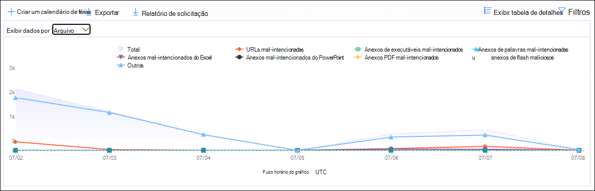

# Exibir relatórios do Defender para Office 365 no painel Relatórios no Centro de Conformidade & SegurançaView Defender for Office 365 reports in the Reports dashboard in the Security & Compliance Center

[!INCLUDE [Microsoft 365 Defender rebranding](../includes/microsoft-defender-for-office.md)]

**Aplica-se a****Applies to**
- [Plano 1 e plano 2 do Microsoft Defender para Office 365Microsoft Defender for Office 365 plan 1 and plan 2](office-365-atp.md)
- [Microsoft 365 DefenderMicrosoft 365 Defender](../mtp/microsoft-threat-protection.md)

As organizações do Microsoft Defender para Office 365 (por exemplo, assinaturas do Microsoft 365 E5 ou Microsoft Defender para Office 365 Plano 1 ou complementos do Microsoft Defender para Office 365 Plano 2) contêm uma variedade de relatórios relacionados à segurança.Microsoft Defender for Office 365 organizations (for example, Microsoft 365 E5 subscriptions or Microsoft Defender for Office 365 Plan 1 or Microsoft Defender for Office 365 Plan 2 add-ons) contain a variety of security-related reports. Se você tiver as [permissões necessárias](#what-permissions-are-needed-to-view-the-defender-for-office-365-reports)&, poderá exibir esses relatórios no Centro de Conformidade e Segurança indo para o Painel **de** \> **Relatórios.**If you have the [necessary permissions](#what-permissions-are-needed-to-view-the-defender-for-office-365-reports), you can view these reports in the Security & Compliance Center by going to **Reports** \> **Dashboard**. Para ir diretamente para o painel Relatórios, abra <https://protection.office.com/insightdashboard> .To go directly to the Reports dashboard, open <https://protection.office.com/insightdashboard>.

## Relatório de tipos de arquivo do Defender for Office 365Defender for Office 365 file types report

O relatório de tipos de arquivo do Defender para **Office 365** mostra os tipos de arquivos detectados como mal-intencionados pelos [Anexos Seguros.](atp-safe-attachments.md)The **Defender for Office 365 file types report** report shows you the type of files detected as malicious by [Safe Attachments](atp-safe-attachments.md).

 A exibição agregada do relatório permite 90 dias de filtragem, enquanto a exibição de detalhes só permite 10 dias de filtragem.The aggregate view of the report allows for 90 days of filtering, while the detail view only allows for 10 days of filtering.

Para exibir o relatório, abra o Centro de  [Conformidade e Segurança &,](https://protection.office.com)vá para o Painel de Relatórios e selecione tipos de arquivo do Defender para \>  **Office 365.**To view the report, open the [Security & Compliance Center](https://protection.office.com), go to **Reports** \> **Dashboard** and select **Defender for Office 365 file types**. Para ir diretamente para o relatório, abra <https://protection.office.com/reportv2?id=ATPFileReport> .To go directly to the report, open <https://protection.office.com/reportv2?id=ATPFileReport>.

> [!NOTE]
> As informações neste relatório também estão disponíveis no relatório de disposição de mensagens do [Defender para Office 365.](#defender-for-office-365-message-disposition-report)The information in this report is also available in the [Defender for Office 365 message disposition report](#defender-for-office-365-message-disposition-report).

### Report view for the Defender for Office 365 file types reportReport view for the Defender for Office 365 file types report

Os seguintes exibições estão disponíveis:The following views are available:

- **Exibir dados por: Arquivo**: O gráfico contém as seguintes informações:**View data by: File**: The chart contains the following information:

  - **Anexos mal-intencionados do Excel****Malicious Excel attachments**
  - **Anexos flash mal-intencionados****Malicious Flash attachments**
  - **Anexos de PDF mal-intencionados****Malicious PDF attachments**
  - **Anexos mal-intencionados do PowerPoint****Malicious PowerPoint attachments**
  - **URLs mal-intencionadas****Malicious URLs**
  - **Anexos do Word mal-intencionado****Malicious Word attachments**
  - **Anexos executáveis mal-intencionados****Malicious executable attachments**
  - **Outros****Others**

  Ao passar o mouse sobre um dia específico (ponto de dados), você pode ver a divisão de tipos de arquivos mal-intencionados que foram detectados por [Anexos](atp-safe-attachments.md) seguros e proteção [anti-malware no EOP.](anti-malware-protection.md)When you hover over a particular day (data point), you can see the breakdown of types of malicious files that were detected by [Safe Attachments](atp-safe-attachments.md) and [anti-malware protection in EOP](anti-malware-protection.md).

  

  Se você clicar **em Filtros,** poderá modificar o relatório com os seguintes filtros:If you click **Filters**, you can modify the report with the following filters:

  - **Data de início** e **data de término****Start date** and **End date**
  - Os mesmos valores de tipo de arquivo visíveis no gráfico.The same file type values that are visible in the chart.

- **Exibir dados por: Mensagem**: O gráfico contém as seguintes informações:**View data by: Message**: The chart contains the following information:

  - **Bloquear acesso****Block access**
  - **Mensagens substituídas****Messages replaced**
  - **Mensagens monitoradas****Messages monitored**
  - **Substituído pela Entrega Dinâmica de Email:** Para obter mais informações, consulte [Entrega Dinâmica em políticas de Anexos Seguros.](atp-safe-attachments.md#dynamic-delivery-in-safe-attachments-policies)**Replaced by Dynamic Email Delivery**: For more information, see [Dynamic Delivery in Safe Attachments policies](atp-safe-attachments.md#dynamic-delivery-in-safe-attachments-policies).

  

  Se você clicar **em Filtros,** poderá modificar o relatório com os seguintes filtros:If you click **Filters**, you can modify the report with the following filters:

  - **Data de início** e **data de término****Start date** and **End date**
  - Os mesmos valores de disposição de mensagem que estão disponíveis no gráfico e as mensagens **adicionais passaram valor.**The same message disposition values that are available in the chart, and the additional **Messages passed** value.

### Visão de tabela de detalhes do relatório de tipos de arquivo do Defender para Office 365Details table view for the Defender for Office 365 file types report

Se você clicar **em Exibir tabela** de detalhes, o relatório fornece uma exibição quase em tempo real de todos os cliques que ocorrem dentro da organização nos últimos 10 dias.If you click **View details table**, the report provides a near-real-time view of all clicks that happen within the organization for the last 10 days. As informações mostradas dependem do gráfico que você estava olhando:The information that's shown depends on the chart you were looking at:

- **Exibir dados por: Arquivo:****View data by: File**:

  - **Date****Date**
  - **Endereço do destinatário****Recipient address**
  - **Endereço do remetente**.**Sender address**
  - **ID da** mensagem: disponível no campo de header **Message-ID** no header da mensagem e deve ser exclusivo.**Message ID**: Available in the **Message-ID** header field in the message header and should be unique. Um valor de exemplo `<08f1e0f6806a47b4ac103961109ae6ef@server.domain>` é (observe os colchetes angulares).An example value is `<08f1e0f6806a47b4ac103961109ae6ef@server.domain>` (note the angle brackets).
  - **Arquivo****File**

  Se você clicar **em Filtros,** poderá modificar o relatório com os seguintes filtros:If you click **Filters**, you can modify the report with the following filters:

  - **Data de início** e **data de término****Start date** and **End date**
  - Os mesmos valores de tipo de arquivo visíveis no gráfico.The same file type values that are visible in the chart.

- **Exibir dados por: Mensagem:****View data by: Message**:

  - **Date****Date**
  - **Endereço do destinatário****Recipient address**
  - **Endereço do remetente**.**Sender address**
  - **ID da mensagem****Message ID**
  - **Arquivo****File**
  - **Assunto****Subject**

  Se você clicar **em Filtros,** poderá modificar os resultados com os seguintes filtros:If you click **Filters**, you can modify the results with the following filters:

  - **Data de início** e **data de término****Start date** and **End date**
  - Os mesmos valores de disposição de mensagem que estão disponíveis no gráfico e as mensagens **adicionais passaram valor.**The same message disposition values that are available in the chart, and the additional **Messages passed** value.

Para voltar à exibição de relatórios, clique em **Exibir relatório.**To get back to the reports view, click **View report**.

## Relatório de disposição de mensagens do Defender for Office 365Defender for Office 365 message disposition report

O **relatório de Disposição de Mensagem ATP** mostra as ações que foram tomadas para mensagens de email detectadas como tendo conteúdo mal-intencionado.The **ATP Message Disposition** report shows you the actions that were taken for email messages that were detected as having malicious content.

Para exibir o relatório, abra o Centro de  [Conformidade &](https://protection.office.com)Segurança, vá para o Painel de Relatórios e selecione Disposição de mensagem do Defender para \>  **Office 365.**To view the report, open the [Security & Compliance Center](https://protection.office.com), go to **Reports** \> **Dashboard** and select **Defender for Office 365 message disposition**. Para ir diretamente para o relatório, abra <https://protection.office.com/reportv2?id=ATPMessageReport> .To go directly to the report, open <https://protection.office.com/reportv2?id=ATPMessageReport>.

> [!NOTE]
> As informações neste relatório também estão disponíveis no relatório de tipos de arquivo do [Defender para Office 365.](#defender-for-office-365-file-types-report)The information in this report is also available in the [Defender for Office 365 file types report](#defender-for-office-365-file-types-report).

### Report view for the Defender for Office 365 message disposition reportReport view for the Defender for Office 365 message disposition report

Os seguintes exibições estão disponíveis:The following views are available:

- **Exibir dados por: Mensagem**: O gráfico contém as seguintes informações:**View data by: Message**: The chart contains the following information:

  - **Bloquear acesso****Block access**
  - **Mensagens substituídas****Messages replaced**
  - **Mensagens monitoradas****Messages monitored**
  - **Substituído pela Entrega Dinâmica de Email:** Para obter mais informações, consulte [Entrega Dinâmica em políticas de Anexos Seguros.](atp-safe-attachments.md#dynamic-delivery-in-safe-attachments-policies)**Replaced by Dynamic Email Delivery**: For more information, see [Dynamic Delivery in Safe Attachments policies](atp-safe-attachments.md#dynamic-delivery-in-safe-attachments-policies).

  

  Se você clicar **em Filtros,** poderá modificar o relatório com os seguintes filtros:If you click **Filters**, you can modify the report with the following filters:

  - **Data de início** e **data de término****Start date** and **End date**
  - Os mesmos valores de disposição de mensagem que estão disponíveis no gráfico e as mensagens **adicionais passaram valor.**The same message disposition values that are available in the chart, and the additional **Messages passed** value.

- **Exibir dados por: Arquivo**: O gráfico contém as seguintes informações:**View data by: File**: The chart contains the following information:

  - **Anexos mal-intencionados do Excel****Malicious Excel attachments**
  - **Anexos flash mal-intencionados****Malicious Flash attachments**
  - **Anexos de PDF mal-intencionados****Malicious PDF attachments**
  - **Anexos mal-intencionados do PowerPoint****Malicious PowerPoint attachments**
  - **URLs mal-intencionadas****Malicious URLs**
  - **Anexos do Word mal-intencionado****Malicious Word attachments**
  - **Anexos executáveis mal-intencionados****Malicious executable attachments**
  - **Outros****Others**

  Ao passar o mouse sobre um dia específico (ponto de dados), você pode ver a divisão de tipos de arquivos mal-intencionados que foram detectados por [Anexos](atp-safe-attachments.md) seguros e proteção [anti-malware no EOP.](anti-malware-protection.md)When you hover over a particular day (data point), you can see the breakdown of types of malicious files that were detected by [Safe Attachments](atp-safe-attachments.md) and [anti-malware protection in EOP](anti-malware-protection.md).

  

  Se você clicar **em Filtros,** poderá modificar o relatório com os seguintes filtros:If you click **Filters**, you can modify the report with the following filters:

  - **Data de início** e **data de término****Start date** and **End date**
  - Os mesmos valores de tipo de arquivo visíveis no gráfico.The same file type values that are visible in the chart.

### Details table view for the Defender for Office 365 message disposition reportDetails table view for the Defender for Office 365 message disposition report

Se você clicar **em Exibir tabela** de detalhes, o relatório fornece uma exibição quase em tempo real de todos os cliques que ocorrem dentro da organização nos últimos 10 dias.If you click **View details table**, the report provides a near-real-time view of all clicks that happen within the organization for the last 10 days. As informações mostradas dependem do gráfico que você estava olhando:The information that's shown depends on the chart you were looking at:

- **Exibir dados por: Mensagem:****View data by: Message**:

  - **Date****Date**
  - **Endereço do destinatário****Recipient address**
  - **Endereço do remetente**.**Sender address**
  - **ID da mensagem****Message ID**
  - **Arquivo****File**
  - **Assunto****Subject**

  Se você clicar **em Filtros,** poderá modificar os resultados com os seguintes filtros:If you click **Filters**, you can modify the results with the following filters:

  - **Data de início** e **data de término****Start date** and **End date**
  - Os mesmos valores de disposição de mensagem que estão disponíveis no gráfico e as mensagens **adicionais passaram valor.**The same message disposition values that are available in the chart, and the additional **Messages passed** value.

- **Exibir dados por: Arquivo:****View data by: File**:

  - **Date****Date**
  - **Endereço do destinatário****Recipient address**
  - **Endereço do remetente**.**Sender address**
  - **ID da mensagem****Message ID**
  - **Arquivo****File**

  Se você clicar **em Filtros,** poderá modificar o relatório com os seguintes filtros:If you click **Filters**, you can modify the report with the following filters:

  - **Data de início** e **data de término****Start date** and **End date**
  - Os mesmos valores de tipo de arquivo visíveis no gráfico.The same file type values that are visible in the chart.

Para voltar à exibição de relatórios, clique em **Exibir relatório.**To get back to the reports view, click **View report**.

## Relatório de latência de emailMail latency report

O **relatório de latência de email** mostra uma visão agregada da entrega de email e da latência de detonação experimentadas em sua organização.The **Mail latency report** shows you an aggregate view of the mail delivery and detonation latency experienced within your organization. Os tempos de entrega de email no serviço são afetados por vários fatores, e o tempo de entrega absoluto em segundos geralmente não é um bom indicador de sucesso ou problema.Mail delivery times in the service are affected by a number of factors, and the absolute delivery time in seconds is often not a good indicator of success or a problem. Um tempo de entrega lento em um dia pode ser considerado um tempo médio de entrega em outro dia ou vice-versa.A slow delivery time on one day might be considered an average delivery time on another day, or vice-versa. O **relatório de latência de email** tenta qualificar a entrega de mensagens com base em dados estatísticos sobre os tempos de entrega observados de outras mensagens:The **Mail latency report** tries to qualify message delivery based on statistical data about the observed delivery times of other messages:

- **Percentil 50:** este é o meio para tempos de entrega de mensagens.**50th percentile**: This is the middle for message delivery times. Você pode considerar esse valor como um tempo médio de entrega.You can consider this value as an average delivery time.
- **90º percentil:** indica uma alta latência para entrega de mensagens.**90th percentile**: This indicates a high latency for message delivery. Apenas 10% das mensagens demoraram mais do que esse valor para entregar.Only 10% of messages took longer than this value to deliver.
- **99º percentil:** indica a latência mais alta para entrega de mensagens.**99th percentile**: This indicates the highest latency for message delivery.

O lado do cliente e a latência da rede não estão incluídos.Client side and network latency are not included.

Para exibir o relatório, abra o [Centro de Conformidade &](https://protection.office.com)Segurança, vá para o Painel de Relatórios e selecione Relatório de  \>  **latência de email.**To view the report, open the [Security & Compliance Center](https://protection.office.com), go to **Reports** \> **Dashboard** and select **Mail latency report**. Para ir diretamente para o relatório, abra <https://protection.office.com/mailLatencyReport?viewid=P50> .To go directly to the report, open <https://protection.office.com/mailLatencyReport?viewid=P50>.

### Exibição de relatório para o relatório de latência de emailReport view for the Mail latency report

Quando você abre o relatório, a **guia 50 percentis** é selecionada por padrão.When you open the report, the **50th percentiles** tab is selected by default.

Por padrão, esse modo de exibição contém um gráfico configurado com os seguintes filtros:By default, this view contains a chart that's configured with the following filters:

- **Data**: os últimos 7 dias**Date**: The last 7 days
- **Exibição de Mensagem:****Message View**:
  - Mensagens acionadasDetonated messages

Este gráfico mostra mensagens organizadas nas seguintes categorias:This chart shows messages organized into the following categories:

- **Latência de entrega de email****Mail delivery latency**
- **Latência de detonação****Detonation latency**

Ao passar o mouse sobre uma categoria no gráfico, você pode ver um detalhamento da latência em cada categoria.When you hover over a category in the chart, you can see a breakdown of the latency in each category.

Se você clicar **em Filtrar** na exibição de relatório, poderá modificar os resultados com os seguintes filtros:If you click **Filter** in the report view, you can modify the results with the following filters:

- Todas as mensagensAll messages
- Mensagens que contêm anexos ou URLsMessages that contain attachments or URLs

Se você clicar na guia **90º percentil ou** na guia **de 99 percentis,** os mesmos filtros padrão do modo de exibição de **50** percentis serão usados.If you click the **90th percentiles** tab or the **99th percentiles** tab, the same default filters from the **50th percentiles** view are used.

### Details table view for the Mail latency reportDetails table view for the Mail latency report

As informações a seguir são mostradas na exibição de tabela de detalhes:The following information is shown in the details table view:

- **Date****Date**
- **Percentis****Percentiles**
- **Contagem de mensagem****Message count**
- **Latência geral****Overall latency**

O exemplo acima mostra que, em 14 de novembro, a latência média experimentada para todas as mensagens entregues e acionadas foi **de 108,033** segundos.The above shows that on November 14 the average latency experienced for all messages delivered and detonated was **108.033** seconds.

A tabela de detalhes contém as mesmas informações em cada guia.The details table contains the same information on each tab.

## Relatório de status de proteção contra ameaçasThreat protection status report

O relatório de **status** de proteção contra ameaças é uma exibição única que reúne informações sobre conteúdo mal-intencionado e emails mal-intencionados detectados e bloqueados pela Proteção do [Exchange Online](exchange-online-protection-overview.md) (EOP) e pelo Microsoft Defender para Office 365.The **Threat protection status** report is a single view that brings together information about malicious content and malicious email detected and blocked by [Exchange Online Protection](exchange-online-protection-overview.md) (EOP) and Microsoft Defender for Office 365. Para obter mais informações, consulte [o relatório de status de proteção contra ameaças.](view-email-security-reports.md#threat-protection-status-report)For more information, see [Threat protection status report](view-email-security-reports.md#threat-protection-status-report).

## Relatório de proteção contra ameaças de URLURL threat protection report

O **relatório de proteção contra ameaças de URL** fornece exibições de resumo e tendências para ameaças detectadas e ações tomadas em cliques de URL como parte de Links [seguros.](atp-safe-links.md)The **URL threat protection report** provides summary and trend views for threats detected and actions taken on URL clicks as part of [Safe Links](atp-safe-links.md). Este relatório não terá dados de clique de usuários onde a política de Links seguros aplicada tem a opção Não rastrear **cliques do** usuário selecionada.This report will not have click data from users where the Safe Links policy applied has the **Do not track user clicks** option selected.

Para exibir o relatório, abra o [Centro de Conformidade & segurança,](https://protection.office.com)vá para o Painel de Relatórios e selecione o relatório de proteção de  \>  **URL.**To view the report, open the [Security & Compliance Center](https://protection.office.com), go to **Reports** \> **Dashboard** and select **URL protection report**. Para ir diretamente para o relatório, abra <https://protection.office.com/reportv2?id=URLProtectionActionReport> .To go directly to the report, open <https://protection.office.com/reportv2?id=URLProtectionActionReport>.

> [!NOTE]
> Este é um relatório *de tendências de proteção,* o que significa que os dados representam tendências em um conjuntos de dados maior.This is a *protection trend report*, meaning data represents trends in a larger dataset. Como resultado, os dados no modo de exibição agregado não estão disponíveis em tempo real aqui, mas os dados no modo de exibição de tabela de detalhes estão, portanto, você pode ver uma pequena discrepância entre os dois modo de exibição.As a result, the data in the aggregate view is not available in real time here, but the data in the details table view is, so you may see a slight discrepancy between the two views.

### Exibição de relatório para o relatório de proteção contra ameaças de URLReport view for the URL threat protection report

O **relatório de proteção contra** ameaças de URL tem duas exibições agregadas que são atualizadas uma vez a cada quatro horas que mostram dados dos últimos 90 dias:The **URL threat protection** report has two aggregated views that are refreshed once every four hours that shows data for the last 90 days:

- **Ação de proteção de** clique de URL: mostra o número de cliques de URL pelos usuários na organização e os resultados do clique:**URL click protection action**: Shows the number of URL clicks by users in the organization and the results of the click:

  - **Bloqueado** (o usuário foi impedido de navegar para a URL)**Blocked** (the user was blocked from navigating to the URL)
  - **Bloqueado e clicado****Blocked and clicked through**
  - **Clicado durante a verificação****Clicked through during scan**

  Um clique indica que o usuário clicou na página de bloqueio para o site mal-intencionado (os administradores podem desabilitar o clique nas políticas de Links seguros).A click indicates that the user has clicked through the block page to the malicious website (admins can disable click through in Safe Links policies).

  Se você clicar **em Filtros,** poderá modificar o relatório com os seguintes filtros:If you click **Filters**, you can modify the report with the following filters:

  - **Data de início** e **data de término****Start date** and **End date**
  - As ações de proteção de clique disponíveis, além do valor **Permitido** (o usuário teve permissão para navegar até a URL).The available click protection actions, plus the value **Allowed** (the user was allowed to navigate to the URL).

  

- **URL clicada por aplicativo:** mostra o número de cliques de URL por aplicativos que suportam Links Seguros:**URL click by application**: Shows the number of URL clicks by applications that support Safe Links:

  - **Cliente de email****Email client**
  - **PowerPoint****PowerPoint**
  - **Word****Word**
  - **Excel****Excel**
  - **OneNote****OneNote**
  - **Visio****Visio**
  - **Teams****Teams**
  - **Outros****Other**

  Se você clicar **em Filtros,** poderá modificar o relatório com os seguintes filtros:If you click **Filters**, you can modify the report with the following filters:

  - **Data de início** e **data de término****Start date** and **End date**
  - Os aplicativos disponíveis.The available applications.

### Visão de tabela de detalhes para o relatório de proteção contra ameaças de URLDetails table view for the URL threat protection report

Se você clicar **em Exibir** tabela de detalhes, o relatório fornece uma exibição quase em tempo real de todos os cliques que ocorrem na organização nos últimos 7 dias com os seguintes detalhes:If you click **View details table**, the report provides a near-real-time view of all clicks that happen within the organization for the last 7 days with the following details:

- **Hora do clique****Click time**
- **Usuário****User**
- **URL****URL**
- **Ação****Action**
- **App****App**

Se você **clicar** em Filtros no modo de exibição de tabela de detalhes, poderá filtrar pelos mesmos critérios que o modo de exibição de relatório e também por **Domínios** ou **Destinatários separados** por vírgulas.If you click **Filters** in the details table view, you can filter by the same criteria as in the report view, and also by **Domains** or **Recipients** separated by commas.

> [!NOTE]
> O **filtro Domínios** refere-se ao domínio da URL listado nos resultados do relatório.The **Domains** filter refers to the URL domain listed in the report results. 

Para voltar à exibição de relatórios, clique em **Exibir relatório.**To get back to the reports view, click **View report**.

## Relatórios adicionais a exibirAdditional reports to view

Além dos relatórios descritos neste artigo, vários outros relatórios estão disponíveis, conforme descrito na tabela a seguir:In addition to the reports described in this article, several other reports are available, as described in the following table:

****

|RelatórioReport|TópicoTopic|
|---|---|
|**Explorer** (Microsoft Defender para Office 365 Plano 2) ou **detecções** em tempo real (Microsoft Defender para Office 365 Plano 1)**Explorer** (Microsoft Defender for Office 365 Plan 2) or **real-time detections** (Microsoft Defender for Office 365 Plan 1)|[Explorador de Ameaças (e detecções em tempo real)Threat Explorer (and real-time detections)](threat-explorer.md)|
|**Relatórios de segurança de** email, como o relatório de principais remetentes e destinatários, o relatório de email de Spoof e o relatório de detecções de spam.**Email security reports**, such as the Top senders and recipients report, the Spoof mail report, and the Spam detections report.|[Exibir relatórios de segurança de email no Centro de Conformidade & segurançaView email security reports in the Security & Compliance Center](view-email-security-reports.md)|
|**Relatórios de fluxo de** emails, como o relatório de encaminhamento, o relatório de status de fluxo de mensagens e o relatório de principais destinatários e de envios.**Mail flow reports**, such as the Forwarding report, the Mailflow status report, and the Top senders and recipients report.|[Exibir relatórios de fluxo de emails no Centro de Conformidade & segurançaView mail flow reports in the Security & Compliance Center](view-mail-flow-reports.md)|
|**Rastreamento de URL para Links Seguros** (somente PowerShell).**URL trace for Safe Links** (PowerShell only). A saída desse cmdlet mostra os resultados das ações de Links seguros nos últimos sete dias.The output of this cmdlet shows you the results of Safe Links actions over the past seven days.|[Get-UrlTraceGet-UrlTrace](https://docs.microsoft.com/powershell/module/exchange/get-urltrace)|
|**Resultados do tráfego de email para o EOP e o Microsoft Defender para Office 365** (somente PowerShell).**Mail traffic results for EOP and Microsoft Defender for Office 365** (PowerShell only). A saída desse cmdlet contém informações sobre Domínio, Data, Tipo de Evento, Direção, Ação e Contagem de Mensagens.The output of this cmdlet contains information about Domain, Date, Event Type, Direction, Action, and Message Count.|[Get-MailTrafficATPReportGet-MailTrafficATPReport](https://docs.microsoft.com/powershell/module/exchange/get-mailtrafficatpreport)|
|**Relatórios detalhados de email para detecções do EOP e do Defender para Office 365** (somente PowerShell).**Mail detail reports for EOP and Defender for Office 365 detections** (PowerShell only). A saída desse cmdlet contém detalhes sobre arquivos mal-intencionados ou URLs, tentativas de phishing, representação e outras possíveis ameaças em emails ou arquivos.The output of this cmdlet contains details about malicious files or URLs, phishing attempts, impersonation, and other potential threats in email or files.|[Get-MailDetailATPReportGet-MailDetailATPReport](https://docs.microsoft.com/powershell/module/exchange/get-maildetailatpreport)|
|

## Quais permissões são necessárias para exibir os relatórios do Defender para Office 365?What permissions are needed to view the Defender for Office 365 reports?

Para exibir e usar os relatórios descritos neste artigo &, você precisa ser membro de um dos seguintes grupos de função no Centro de Conformidade e Segurança:In order to view and use the reports described in this article, you need to be a member of one of the following role groups in the Security & Compliance Center:

- **Organization Management****Organization Management**
- **Administrador de Segurança****Security Administrator**
- **Leitor de Segurança****Security Reader**
- **Leitor Global****Global Reader**

Para saber mais, confira [Permissões no Centro de Conformidade de Segurança](permissions-in-the-security-and-compliance-center.md).For more information, see [Permissions in the Security & Compliance Center](permissions-in-the-security-and-compliance-center.md).

**Observação:** a adição de usuários à função do Azure Active Directory correspondente no Centro de administração do  Microsoft 365 oferece aos usuários as permissões necessárias no Centro de Conformidade e Segurança & e permissões para outros recursos no Microsoft 365.**Note**: Adding users to the corresponding Azure Active Directory role in the Microsoft 365 admin center gives users the required permissions in the Security & Compliance Center _and_ permissions for other features in Microsoft 365. Para obter mais informações, confira o artigo [Sobre funções de administrador](../../admin/add-users/about-admin-roles.md).For more information, see [About admin roles](../../admin/add-users/about-admin-roles.md).

## E se os relatórios não mostrarem dados?What if the reports aren't showing data?

Se você não estiver vendo dados nos relatórios do Defender para Office 365, verifique se suas políticas estão configuradas corretamente.If you are not seeing data in your Defender for Office 365 reports, double-check that your policies are set up correctly. Sua organização deve ter [políticas de Links](set-up-atp-safe-links-policies.md) seguros e políticas de Anexos seguros [definidas](set-up-atp-safe-attachments-policies.md) para que a proteção do Defender for Office 365 seja definida.Your organization must have [Safe Links policies](set-up-atp-safe-links-policies.md) and [Safe Attachments policies](set-up-atp-safe-attachments-policies.md) defined in order for Defender for Office 365 protection to be in place. Consulte também [Proteção anti-spam e anti-malware.](anti-spam-and-anti-malware-protection.md)Also see [Anti-spam and anti-malware protection](anti-spam-and-anti-malware-protection.md).

## Tópicos relacionadosRelated topics

[Relatórios inteligentes e insights no Centro de Conformidade e SegurançaSmart reports and insights in the Security & Compliance Center](reports-and-insights-in-security-and-compliance.md)

[Permissões de função (Azure Active DirectoryRole permissions (Azure Active Directory](https://docs.microsoft.com/azure/active-directory/users-groups-roles/directory-assign-admin-roles#role-permissions)
