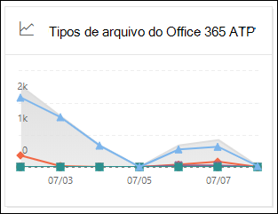

# Exibir relatórios do Defender para Office 365 no painel Relatórios no Centro de Conformidade & Segurança

[!INCLUDE [Microsoft 365 Defender rebranding](../includes/microsoft-defender-for-office.md)]

**Aplica-se a**
- [Plano 1 e plano 2 do Microsoft Defender para Office 365](office-365-atp.md)
- [Microsoft 365 Defender](../mtp/microsoft-threat-protection.md)

As organizações do Microsoft Defender para Office 365 (por exemplo, assinaturas do Microsoft 365 E5 ou Microsoft Defender para Office 365 Plano 1 ou complementos do Microsoft Defender para Office 365 Plano 2) contêm uma variedade de relatórios relacionados à segurança. Se você tiver as [permissões necessárias](#what-permissions-are-needed-to-view-the-defender-for-office-365-reports)&, poderá exibir esses relatórios no Centro de Conformidade e Segurança indo para o Painel **de** \> **Relatórios.** Para ir diretamente para o painel Relatórios, abra <https://protection.office.com/insightdashboard> .

## Relatório de tipos de arquivo do Defender for Office 365

O relatório de tipos de arquivo do Defender para **Office 365** mostra os tipos de arquivos detectados como mal-intencionados pelos [Anexos Seguros.](atp-safe-attachments.md)

 A exibição agregada do relatório permite 90 dias de filtragem, enquanto a exibição de detalhes só permite 10 dias de filtragem.

Para exibir o relatório, abra o Centro de  [Conformidade e Segurança &,](https://protection.office.com)vá para o Painel de Relatórios e selecione tipos de arquivo do Defender para \>  **Office 365.** Para ir diretamente para o relatório, abra <https://protection.office.com/reportv2?id=ATPFileReport> .

> [!NOTE]
> As informações neste relatório também estão disponíveis no relatório de disposição de mensagens do [Defender para Office 365.](#defender-for-office-365-message-disposition-report)

### Report view for the Defender for Office 365 file types report

Os seguintes exibições estão disponíveis:

- **Exibir dados por: Arquivo**: O gráfico contém as seguintes informações:

  - **Anexos mal-intencionados do Excel**
  - **Anexos flash mal-intencionados**
  - **Anexos de PDF mal-intencionados**
  - **Anexos mal-intencionados do PowerPoint**
  - **URLs mal-intencionadas**
  - **Anexos do Word mal-intencionado**
  - **Anexos executáveis mal-intencionados**
  - **Outros**

  Ao passar o mouse sobre um dia específico (ponto de dados), você pode ver a divisão de tipos de arquivos mal-intencionados que foram detectados por [Anexos](atp-safe-attachments.md) seguros e proteção [anti-malware no EOP.](anti-malware-protection.md)

  

  Se você clicar **em Filtros,** poderá modificar o relatório com os seguintes filtros:

  - **Data de início** e **data de término**
  - Os mesmos valores de tipo de arquivo visíveis no gráfico.

- **Exibir dados por: Mensagem**: O gráfico contém as seguintes informações:

  - **Bloquear acesso**
  - **Mensagens substituídas**
  - **Mensagens monitoradas**
  - **Substituído pela Entrega Dinâmica de Email:** Para obter mais informações, consulte [Entrega Dinâmica em políticas de Anexos Seguros.](atp-safe-attachments.md#dynamic-delivery-in-safe-attachments-policies)

  

  Se você clicar **em Filtros,** poderá modificar o relatório com os seguintes filtros:

  - **Data de início** e **data de término**
  - Os mesmos valores de disposição de mensagem que estão disponíveis no gráfico e as mensagens **adicionais passaram valor.**

### Visão de tabela de detalhes do relatório de tipos de arquivo do Defender para Office 365

Se você clicar **em Exibir tabela** de detalhes, o relatório fornece uma exibição quase em tempo real de todos os cliques que ocorrem dentro da organização nos últimos 10 dias. As informações mostradas dependem do gráfico que você estava olhando:

- **Exibir dados por: Arquivo:**

  - **Date**
  - **Endereço do destinatário**
  - **Endereço do remetente**.
  - **ID da** mensagem: disponível no campo de header **Message-ID** no header da mensagem e deve ser exclusivo. Um valor de exemplo `<08f1e0f6806a47b4ac103961109ae6ef@server.domain>` é (observe os colchetes angulares).
  - **Arquivo**

  Se você clicar **em Filtros,** poderá modificar o relatório com os seguintes filtros:

  - **Data de início** e **data de término**
  - Os mesmos valores de tipo de arquivo visíveis no gráfico.

- **Exibir dados por: Mensagem:**

  - **Date**
  - **Endereço do destinatário**
  - **Endereço do remetente**.
  - **ID da mensagem**
  - **Arquivo**
  - **Assunto**

  Se você clicar **em Filtros,** poderá modificar os resultados com os seguintes filtros:

  - **Data de início** e **data de término**
  - Os mesmos valores de disposição de mensagem que estão disponíveis no gráfico e as mensagens **adicionais passaram valor.**

Para voltar à exibição de relatórios, clique em **Exibir relatório.**

## Relatório de disposição de mensagens do Defender for Office 365

O **relatório de Disposição de Mensagem ATP** mostra as ações que foram tomadas para mensagens de email detectadas como tendo conteúdo mal-intencionado.

Para exibir o relatório, abra o Centro de  [Conformidade &](https://protection.office.com)Segurança, vá para o Painel de Relatórios e selecione Disposição de mensagem do Defender para \>  **Office 365.** Para ir diretamente para o relatório, abra <https://protection.office.com/reportv2?id=ATPMessageReport> .

> [!NOTE]
> As informações neste relatório também estão disponíveis no relatório de tipos de arquivo do [Defender para Office 365.](#defender-for-office-365-file-types-report)

### Report view for the Defender for Office 365 message disposition report

Os seguintes exibições estão disponíveis:

- **Exibir dados por: Mensagem**: O gráfico contém as seguintes informações:

  - **Bloquear acesso**
  - **Mensagens substituídas**
  - **Mensagens monitoradas**
  - **Substituído pela Entrega Dinâmica de Email:** Para obter mais informações, consulte [Entrega Dinâmica em políticas de Anexos Seguros.](atp-safe-attachments.md#dynamic-delivery-in-safe-attachments-policies)

  

  Se você clicar **em Filtros,** poderá modificar o relatório com os seguintes filtros:

  - **Data de início** e **data de término**
  - Os mesmos valores de disposição de mensagem que estão disponíveis no gráfico e as mensagens **adicionais passaram valor.**

- **Exibir dados por: Arquivo**: O gráfico contém as seguintes informações:

  - **Anexos mal-intencionados do Excel**
  - **Anexos flash mal-intencionados**
  - **Anexos de PDF mal-intencionados**
  - **Anexos mal-intencionados do PowerPoint**
  - **URLs mal-intencionadas**
  - **Anexos do Word mal-intencionado**
  - **Anexos executáveis mal-intencionados**
  - **Outros**

  Ao passar o mouse sobre um dia específico (ponto de dados), você pode ver a divisão de tipos de arquivos mal-intencionados que foram detectados por [Anexos](atp-safe-attachments.md) seguros e proteção [anti-malware no EOP.](anti-malware-protection.md)

  

  Se você clicar **em Filtros,** poderá modificar o relatório com os seguintes filtros:

  - **Data de início** e **data de término**
  - Os mesmos valores de tipo de arquivo visíveis no gráfico.

### Details table view for the Defender for Office 365 message disposition report

Se você clicar **em Exibir tabela** de detalhes, o relatório fornece uma exibição quase em tempo real de todos os cliques que ocorrem dentro da organização nos últimos 10 dias. As informações mostradas dependem do gráfico que você estava olhando:

- **Exibir dados por: Mensagem:**

  - **Date**
  - **Endereço do destinatário**
  - **Endereço do remetente**.
  - **ID da mensagem**
  - **Arquivo**
  - **Assunto**

  Se você clicar **em Filtros,** poderá modificar os resultados com os seguintes filtros:

  - **Data de início** e **data de término**
  - Os mesmos valores de disposição de mensagem que estão disponíveis no gráfico e as mensagens **adicionais passaram valor.**

- **Exibir dados por: Arquivo:**

  - **Date**
  - **Endereço do destinatário**
  - **Endereço do remetente**.
  - **ID da mensagem**
  - **Arquivo**

  Se você clicar **em Filtros,** poderá modificar o relatório com os seguintes filtros:

  - **Data de início** e **data de término**
  - Os mesmos valores de tipo de arquivo visíveis no gráfico.

Para voltar à exibição de relatórios, clique em **Exibir relatório.**

## Relatório de latência de email

O **relatório de latência de email** mostra uma visão agregada da entrega de email e da latência de detonação experimentadas em sua organização. Os tempos de entrega de email no serviço são afetados por vários fatores, e o tempo de entrega absoluto em segundos geralmente não é um bom indicador de sucesso ou problema. Um tempo de entrega lento em um dia pode ser considerado um tempo médio de entrega em outro dia ou vice-versa. O **relatório de latência de email** tenta qualificar a entrega de mensagens com base em dados estatísticos sobre os tempos de entrega observados de outras mensagens:

- **Percentil 50:** este é o meio para tempos de entrega de mensagens. Você pode considerar esse valor como um tempo médio de entrega.
- **90º percentil:** indica uma alta latência para entrega de mensagens. Apenas 10% das mensagens demoraram mais do que esse valor para entregar.
- **99º percentil:** indica a latência mais alta para entrega de mensagens.

O lado do cliente e a latência da rede não estão incluídos.

Para exibir o relatório, abra o [Centro de Conformidade &](https://protection.office.com)Segurança, vá para o Painel de Relatórios e selecione Relatório de  \>  **latência de email.** Para ir diretamente para o relatório, abra <https://protection.office.com/mailLatencyReport?viewid=P50> .

### Exibição de relatório para o relatório de latência de email

Quando você abre o relatório, a **guia 50 percentis** é selecionada por padrão.

Por padrão, esse modo de exibição contém um gráfico configurado com os seguintes filtros:

- **Data**: os últimos 7 dias
- **Exibição de Mensagem:**
  - Mensagens acionadas

Este gráfico mostra mensagens organizadas nas seguintes categorias:

- **Latência de entrega de email**
- **Latência de detonação**

Ao passar o mouse sobre uma categoria no gráfico, você pode ver um detalhamento da latência em cada categoria.

Se você clicar **em Filtrar** na exibição de relatório, poderá modificar os resultados com os seguintes filtros:

- Todas as mensagens
- Mensagens que contêm anexos ou URLs

Se você clicar na guia **90º percentil ou** na guia **de 99 percentis,** os mesmos filtros padrão do modo de exibição de **50** percentis serão usados.

### Details table view for the Mail latency report

As informações a seguir são mostradas na exibição de tabela de detalhes:

- **Date**
- **Percentis**
- **Contagem de mensagem**
- **Latência geral**

O exemplo acima mostra que, em 14 de novembro, a latência média experimentada para todas as mensagens entregues e acionadas foi **de 108,033** segundos.

A tabela de detalhes contém as mesmas informações em cada guia.

## Relatório de status de proteção contra ameaças

O relatório de **status** de proteção contra ameaças é uma exibição única que reúne informações sobre conteúdo mal-intencionado e emails mal-intencionados detectados e bloqueados pela Proteção do [Exchange Online](exchange-online-protection-overview.md) (EOP) e pelo Microsoft Defender para Office 365. Para obter mais informações, consulte [o relatório de status de proteção contra ameaças.](view-email-security-reports.md#threat-protection-status-report)

## Relatório de proteção contra ameaças de URL

O **relatório de proteção contra ameaças de URL** fornece exibições de resumo e tendências para ameaças detectadas e ações tomadas em cliques de URL como parte de Links [seguros.](atp-safe-links.md) Este relatório não terá dados de clique de usuários onde a política de Links seguros aplicada tem a opção Não rastrear **cliques do** usuário selecionada.

Para exibir o relatório, abra o [Centro de Conformidade & segurança,](https://protection.office.com)vá para o Painel de Relatórios e selecione o relatório de proteção de  \>  **URL.** Para ir diretamente para o relatório, abra <https://protection.office.com/reportv2?id=URLProtectionActionReport> .

> [!NOTE]
> Este é um relatório *de tendências de proteção,* o que significa que os dados representam tendências em um conjuntos de dados maior. Como resultado, os dados no modo de exibição agregado não estão disponíveis em tempo real aqui, mas os dados no modo de exibição de tabela de detalhes estão, portanto, você pode ver uma pequena discrepância entre os dois modo de exibição.

### Exibição de relatório para o relatório de proteção contra ameaças de URL

O **relatório de proteção contra** ameaças de URL tem duas exibições agregadas que são atualizadas uma vez a cada quatro horas que mostram dados dos últimos 90 dias:

- **Ação de proteção de** clique de URL: mostra o número de cliques de URL pelos usuários na organização e os resultados do clique:

  - **Bloqueado** (o usuário foi impedido de navegar para a URL)
  - **Bloqueado e clicado**
  - **Clicado durante a verificação**

  Um clique indica que o usuário clicou na página de bloqueio para o site mal-intencionado (os administradores podem desabilitar o clique nas políticas de Links seguros).

  Se você clicar **em Filtros,** poderá modificar o relatório com os seguintes filtros:

  - **Data de início** e **data de término**
  - As ações de proteção de clique disponíveis, além do valor **Permitido** (o usuário teve permissão para navegar até a URL).

  

- **URL clicada por aplicativo:** mostra o número de cliques de URL por aplicativos que suportam Links Seguros:

  - **Cliente de email**
  - **PowerPoint**
  - **Word**
  - **Excel**
  - **OneNote**
  - **Visio**
  - **Teams**
  - **Outros**

  Se você clicar **em Filtros,** poderá modificar o relatório com os seguintes filtros:

  - **Data de início** e **data de término**
  - Os aplicativos disponíveis.

### Visão de tabela de detalhes para o relatório de proteção contra ameaças de URL

Se você clicar **em Exibir** tabela de detalhes, o relatório fornece uma exibição quase em tempo real de todos os cliques que ocorrem na organização nos últimos 7 dias com os seguintes detalhes:

- **Hora do clique**
- **Usuário**
- **URL**
- **Ação**
- **App**

Se você **clicar** em Filtros no modo de exibição de tabela de detalhes, poderá filtrar pelos mesmos critérios que o modo de exibição de relatório e também por **Domínios** ou **Destinatários separados** por vírgulas.

> [!NOTE]
> O **filtro Domínios** refere-se ao domínio da URL listado nos resultados do relatório. 

Para voltar à exibição de relatórios, clique em **Exibir relatório.**

## Relatórios adicionais a exibir

Além dos relatórios descritos neste artigo, vários outros relatórios estão disponíveis, conforme descrito na tabela a seguir:

****

|Relatório|Tópico|
|---|---|
|**Explorer** (Microsoft Defender para Office 365 Plano 2) ou **detecções** em tempo real (Microsoft Defender para Office 365 Plano 1)|[Explorador de Ameaças (e detecções em tempo real)](threat-explorer.md)|
|**Relatórios de segurança de** email, como o relatório de principais remetentes e destinatários, o relatório de email de Spoof e o relatório de detecções de spam.|[Exibir relatórios de segurança de email no Centro de Conformidade & segurança](view-email-security-reports.md)|
|**Relatórios de fluxo de** emails, como o relatório de encaminhamento, o relatório de status de fluxo de mensagens e o relatório de principais destinatários e de envios.|[Exibir relatórios de fluxo de emails no Centro de Conformidade & segurança](view-mail-flow-reports.md)|
|**Rastreamento de URL para Links Seguros** (somente PowerShell). A saída desse cmdlet mostra os resultados das ações de Links seguros nos últimos sete dias.|[Get-UrlTrace](https://docs.microsoft.com/powershell/module/exchange/get-urltrace)|
|**Resultados do tráfego de email para o EOP e o Microsoft Defender para Office 365** (somente PowerShell). A saída desse cmdlet contém informações sobre Domínio, Data, Tipo de Evento, Direção, Ação e Contagem de Mensagens.|[Get-MailTrafficATPReport](https://docs.microsoft.com/powershell/module/exchange/get-mailtrafficatpreport)|
|**Relatórios detalhados de email para detecções do EOP e do Defender para Office 365** (somente PowerShell). A saída desse cmdlet contém detalhes sobre arquivos mal-intencionados ou URLs, tentativas de phishing, representação e outras possíveis ameaças em emails ou arquivos.|[Get-MailDetailATPReport](https://docs.microsoft.com/powershell/module/exchange/get-maildetailatpreport)|
|

## Quais permissões são necessárias para exibir os relatórios do Defender para Office 365?

Para exibir e usar os relatórios descritos neste artigo &, você precisa ser membro de um dos seguintes grupos de função no Centro de Conformidade e Segurança:

- **Organization Management**
- **Administrador de Segurança**
- **Leitor de Segurança**
- **Leitor Global**

Para saber mais, confira [Permissões no Centro de Conformidade de Segurança](permissions-in-the-security-and-compliance-center.md).

**Observação:** a adição de usuários à função do Azure Active Directory correspondente no Centro de administração do  Microsoft 365 oferece aos usuários as permissões necessárias no Centro de Conformidade e Segurança & e permissões para outros recursos no Microsoft 365. Para obter mais informações, confira o artigo [Sobre funções de administrador](../../admin/add-users/about-admin-roles.md).

## E se os relatórios não mostrarem dados?

Se você não estiver vendo dados nos relatórios do Defender para Office 365, verifique se suas políticas estão configuradas corretamente. Sua organização deve ter [políticas de Links](set-up-atp-safe-links-policies.md) seguros e políticas de Anexos seguros [definidas](set-up-atp-safe-attachments-policies.md) para que a proteção do Defender for Office 365 seja definida. Consulte também [Proteção anti-spam e anti-malware.](anti-spam-and-anti-malware-protection.md)

## Tópicos relacionados

[Relatórios inteligentes e insights no Centro de Conformidade e Segurança](reports-and-insights-in-security-and-compliance.md)

[Permissões de função (Azure Active Directory](https://docs.microsoft.com/azure/active-directory/users-groups-roles/directory-assign-admin-roles#role-permissions)
