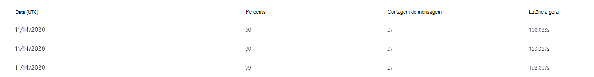

# Exibir relatórios do Microsoft defender para Office 365

[!INCLUDE [Microsoft 365 Defender rebranding](../includes/microsoft-defender-for-office.md)]

As organizações do Microsoft defender for Office 365 (por exemplo, assinaturas do Microsoft 365 E5 ou Microsoft defender para Office 365 plano 1 ou Microsoft defender para Office 365 plano 2) contêm uma variedade de relatórios relacionados à segurança. Se você tiver as [permissões necessárias](#what-permissions-are-needed-to-view-the-defender-for-office-365-reports), poderá exibir esses relatórios no centro de conformidade & de segurança acessando **Reports** o \> **painel** relatórios. Para ir diretamente para o painel relatórios, abra <https://protection.office.com/insightdashboard> .

## Relatório de tipos de arquivo do defender for Office 365

O relatório de **relatórios de tipos de arquivo do defender for Office 365** mostra o tipo de arquivos detectados como mal-intencionados por [anexos seguros](atp-safe-attachments.md).

 O modo de exibição de agregação do relatório permite 90 dias de filtragem, enquanto o modo de exibição de detalhes permite apenas 10 dias de filtragem.

Para exibir o relatório, abra o [centro de conformidade & segurança](https://protection.office.com), vá **Reports** para \> **painel** relatórios e selecione **defender para tipos de arquivo do Office 365**. Para ir diretamente para o relatório, abra <https://protection.office.com/reportv2?id=ATPFileReport> .

> [!NOTE]
> As informações neste relatório também estão disponíveis no relatório de [disposição de mensagens do defender for Office 365](#defender-for-office-365-message-disposition-report).

### Exibição de relatório para o relatório de tipos de arquivo do defender for Office 365

Os seguintes modos de exibição estão disponíveis:

- **Exibir dados por: arquivo**: o gráfico contém as seguintes informações:

  - **Anexos mal-intencionados do Excel**
  - **Anexos de flash mal-intencionados**
  - **Anexos PDF mal-intencionados**
  - **Anexos mal-intencionados do PowerPoint**
  - **URLs mal-intencionadas**
  - **Anexos de palavras maliciosas**
  - **Anexos executáveis maliciosos**
  - **Outros**

  Ao passar o mouse sobre um determinado dia (ponto de dados), você pode ver a divisão de tipos de arquivos mal-intencionados que foram detectados por [anexos seguros](atp-safe-attachments.md) e [proteção Antimalware no EOP](anti-malware-protection.md).

  

  Se você clicar em **filtros**, poderá modificar o relatório com os seguintes filtros:

  - **Data de início** e **data de término**
  - Os mesmos valores de tipo de arquivo que estão visíveis no gráfico.

- **Exibir dados por: Message**: o gráfico contém as seguintes informações:

  - **Bloquear acesso**
  - **Mensagens substituídas**
  - **Mensagens monitoradas**
  - **Substituído por entrega de emails dinâmicas**: para obter mais informações, consulte [entrega dinâmica em políticas de anexos seguros](atp-safe-attachments.md#dynamic-delivery-in-safe-attachments-policies).

  

  Se você clicar em **filtros**, poderá modificar o relatório com os seguintes filtros:

  - **Data de início** e **data de término**
  - Os mesmos valores de disposição de mensagem que estão disponíveis no gráfico e o valor de **mensagens adicionais passadas** .

### Exibição da tabela de detalhes para o relatório de tipos de arquivo do defender for Office 365

Se você clicar em **Exibir tabela de detalhes**, o relatório fornecerá uma visão quase em tempo real de todos os cliques que acontecerem na organização pelos últimos 10 dias. As informações mostradas dependem do gráfico que você estava observando:

- **Exibir dados por: arquivo**:

  - **Date**
  - **Endereço do destinatário**
  - **Endereço do remetente**.
  - **ID da mensagem**: disponível no campo de cabeçalho **Message-ID** no cabeçalho da mensagem e deve ser exclusivo. Um valor de exemplo é `<08f1e0f6806a47b4ac103961109ae6ef@server.domain>` (Observe os colchetes angulares).
  - **Arquivo**

  Se você clicar em **filtros**, poderá modificar o relatório com os seguintes filtros:

  - **Data de início** e **data de término**
  - Os mesmos valores de tipo de arquivo que estão visíveis no gráfico.

- **Exibir dados por: mensagem**:

  - **Date**
  - **Endereço do destinatário**
  - **Endereço do remetente**.
  - **ID da mensagem**
  - **Arquivo**
  - **Subject**

  Se você clicar em **filtros**, poderá modificar os resultados com os seguintes filtros:

  - **Data de início** e **data de término**
  - Os mesmos valores de disposição de mensagem que estão disponíveis no gráfico e o valor de **mensagens adicionais passadas** .

Para voltar para o modo de exibição relatórios, clique em **Exibir relatório**.

## Relatório de disposição de mensagens do defender for Office 365

O relatório de **disposição de mensagens ATP** mostra as ações que foram tomadas para mensagens de email que foram detectadas como tendo conteúdo mal-intencionado.

Para exibir o relatório, abra o [centro de conformidade & segurança](https://protection.office.com), vá **Reports** para \> **painel** relatórios e selecione **defender para Office 365 disposição de mensagem**. Para ir diretamente para o relatório, abra <https://protection.office.com/reportv2?id=ATPMessageReport> .

> [!NOTE]
> As informações neste relatório também estão disponíveis no relatório de [tipos de arquivo do defender for Office 365](#defender-for-office-365-file-types-report).

### Exibição de relatório para o relatório de disposição de mensagens do defender for Office 365

Os seguintes modos de exibição estão disponíveis:

- **Exibir dados por: Message**: o gráfico contém as seguintes informações:

  - **Bloquear acesso**
  - **Mensagens substituídas**
  - **Mensagens monitoradas**
  - **Substituído por entrega de emails dinâmicas**: para obter mais informações, consulte [entrega dinâmica em políticas de anexos seguros](atp-safe-attachments.md#dynamic-delivery-in-safe-attachments-policies).

  

  Se você clicar em **filtros**, poderá modificar o relatório com os seguintes filtros:

  - **Data de início** e **data de término**
  - Os mesmos valores de disposição de mensagem que estão disponíveis no gráfico e o valor de **mensagens adicionais passadas** .

- **Exibir dados por: arquivo**: o gráfico contém as seguintes informações:

  - **Anexos mal-intencionados do Excel**
  - **Anexos de flash mal-intencionados**
  - **Anexos PDF mal-intencionados**
  - **Anexos mal-intencionados do PowerPoint**
  - **URLs mal-intencionadas**
  - **Anexos de palavras maliciosas**
  - **Anexos executáveis maliciosos**
  - **Outros**

  Ao passar o mouse sobre um determinado dia (ponto de dados), você pode ver a divisão de tipos de arquivos mal-intencionados que foram detectados por [anexos seguros](atp-safe-attachments.md) e [proteção Antimalware no EOP](anti-malware-protection.md).

  

  Se você clicar em **filtros**, poderá modificar o relatório com os seguintes filtros:

  - **Data de início** e **data de término**
  - Os mesmos valores de tipo de arquivo que estão visíveis no gráfico.

### Exibição da tabela de detalhes do relatório de disposição de mensagens do defender for Office 365

Se você clicar em **Exibir tabela de detalhes**, o relatório fornecerá uma visão quase em tempo real de todos os cliques que acontecerem na organização pelos últimos 10 dias. As informações mostradas dependem do gráfico que você estava observando:

- **Exibir dados por: mensagem**:

  - **Date**
  - **Endereço do destinatário**
  - **Endereço do remetente**.
  - **ID da mensagem**
  - **Arquivo**
  - **Subject**

  Se você clicar em **filtros**, poderá modificar os resultados com os seguintes filtros:

  - **Data de início** e **data de término**
  - Os mesmos valores de disposição de mensagem que estão disponíveis no gráfico e o valor de **mensagens adicionais passadas** .

- **Exibir dados por: arquivo**:

  - **Date**
  - **Endereço do destinatário**
  - **Endereço do remetente**.
  - **ID da mensagem**
  - **Arquivo**

  Se você clicar em **filtros**, poderá modificar o relatório com os seguintes filtros:

  - **Data de início** e **data de término**
  - Os mesmos valores de tipo de arquivo que estão visíveis no gráfico.

Para voltar para o modo de exibição relatórios, clique em **Exibir relatório**.

## Relatório de latência de email

O **relatório de latência de email** mostra um modo de exibição de agregação da entrega de email e da latência de acionamento em sua organização. As horas de entrega de email no serviço são afetadas por vários fatores, e o tempo de entrega absoluto, em segundos, geralmente não é um bom indicador de sucesso ou de um problema. Um tempo de entrega lento em um dia pode ser considerado um tempo de entrega médio em outro dia ou vice-versa. O **relatório de latência de email** tenta qualificar a entrega de mensagens com base em dados estatísticos sobre as horas de entrega observadas de outras mensagens:

- **50 º percentil**: Este é o meio para tempos de entrega de mensagens. Você pode considerar esse valor como um tempo médio de entrega.
- **90th percentil**: indica uma alta latência para entrega de mensagens. Apenas 10% das mensagens demorou mais do que esse valor a ser entregue.
- **99th percentil**: indica a maior latência para entrega de mensagens.

A latência do lado do cliente e da rede não estão incluídas.

Para exibir o relatório, abra o [centro de conformidade & segurança](https://protection.office.com), vá **Reports** para \> **painel** relatórios e selecione relatório de **latência de email**. Para ir diretamente para o relatório, abra <https://protection.office.com/mailLatencyReport?viewid=P50> .

### Exibição de relatório para o relatório de latência de email

Quando você abre o relatório, a guia **50 º percentils** é selecionada por padrão.

Por padrão, este modo de exibição contém um gráfico que é configurado com os seguintes filtros:

- **Data**: os últimos 7 dias
- **Exibição de mensagem**:
  - Mensagens do destruído

Este gráfico mostra as mensagens organizadas nas seguintes categorias:

- **Latência de entrega de email**
- **Latência acionamento**

Ao passar o mouse sobre uma categoria no gráfico, você pode ver uma divisão da latência em cada categoria.

Se você clicar em **filtro** no modo de exibição relatório, poderá modificar os resultados com os seguintes filtros:

- Todas as mensagens
- Mensagens que contêm anexos ou URLs

Se você clicar na guia **90th percentils** ou na guia **99th percentil** , os mesmos filtros padrão do modo de exibição de **percentil do 50 º** são usados.

### Exibição da tabela de detalhes para o relatório de latência de email

As informações a seguir são mostradas no modo de exibição de tabela de detalhes:

- **Date**
- **Percentis**
- **Contagem de mensagem**
- **Latência geral**

O acima mostra que, em 14 de novembro, a latência média de todas as mensagens entregues e destruído foi de **108, 33** segundos.

A tabela detalhes contém as mesmas informações em cada guia.

## Relatório de status de proteção contra ameaças

O relatório de **status de proteção contra ameaças** é um modo de exibição único que reúne informações sobre conteúdo mal-intencionado e email mal-intencionado detectado e bloqueado pela [proteção do Exchange Online](exchange-online-protection-overview.md) (EOP) e pelo Microsoft defender para Office 365. Para obter mais informações, consulte [relatório de status de proteção contra ameaças](view-email-security-reports.md#threat-protection-status-report).

## Relatório de proteção contra ameaças de URL

O **relatório de proteção de ameaças de URL** fornece as exibições de resumo e tendência para ameaças detectadas e ações tomadas em cliques de URL como parte de [links seguros](atp-safe-links.md). Este relatório não terá clique em dados de usuários em que a política de links seguros aplicada tenha a opção **não rastrear os cliques do usuário** selecionada.

Para exibir o relatório, abra o [centro de conformidade & segurança](https://protection.office.com), vá **Reports** para \> **painel** relatórios e selecione relatório de **proteção de URL**. Para ir diretamente para o relatório, abra <https://protection.office.com/reportv2?id=URLProtectionActionReport> .

> [!NOTE]
> Este é um *relatório de tendências de proteção*, o que significa que os dados representam tendências em um conjunto de dados maior. Como resultado, os dados no modo de exibição de agregação não estão disponíveis em tempo real aqui, mas os dados no modo de exibição de tabela detalhes são, portanto, você pode ver uma pequena discrepância entre as duas exibições.

### Exibição de relatório para o relatório de proteção contra ameaças de URL

O relatório de **proteção contra ameaças de URL** tem duas exibições agregadas que são atualizadas uma vez a cada quatro horas que mostram dados dos últimos 90 dias:

- **URL clique em ação de proteção**: mostra o número de cliques de URL por usuários na organização e os resultados do clique:

  - **Bloqueado** (o usuário foi impedido de navegar para a URL)
  - **Bloqueado e clicado**
  - **Clicado durante a verificação**

  Um clique indica que o usuário clicou através da página de bloqueio para o site mal-intencionado (os administradores podem desabilitar o clique em políticas de links seguros).

  Se você clicar em **filtros**, poderá modificar o relatório com os seguintes filtros:

  - **Data de início** e **data de término**
  - O disponível clique em ações de proteção, mais o valor **permitido** (o usuário tem permissão para navegar até a URL).

  

- **URL clique por aplicativo**: mostra o número de cliques de URL por aplicativos que dão suporte a links seguros:

  - **Cliente de email**
  - **PowerPoint**
  - **Word**
  - **Excel**
  - **OneNote**
  - **Visio**
  - **Teams**
  - **Outros**

  Se você clicar em **filtros**, poderá modificar o relatório com os seguintes filtros:

  - **Data de início** e **data de término**
  - Os aplicativos disponíveis.

### Exibição da tabela de detalhes para o relatório de proteção contra ameaças de URL

Se você clicar em **Exibir tabela de detalhes**, o relatório fornecerá uma visão quase em tempo real de todos os cliques que acontecerem na organização pelos últimos 7 dias com os seguintes detalhes:

- **Horário de clique**
- **Usuário**
- **URL**
- **Ação**
- **App**

Se você clicar em **filtros** no modo de exibição tabela de detalhes, poderá filtrar pelos mesmos critérios do modo de exibição relatório e também por **domínios** ou **destinatários** separados por vírgulas.

Para voltar para o modo de exibição relatórios, clique em **Exibir relatório**.

## Relatórios adicionais para exibir

Além dos relatórios descritos neste tópico, vários outros relatórios estão disponíveis, conforme descrito na tabela a seguir:

****

|Relatório|Tópico|
|---|---|
|**Explorer** (Microsoft defender para Office 365 plano 2) ou **detecções em tempo real** (microsoft defender para Office 365 plano 1)|[Explorador de Ameaças (e detecções em tempo real)](threat-explorer.md)|
|**Relatórios de segurança de email**, como os principais remetentes e destinatários, o relatório de email de spoof e o relatório de detecções de spam.|[Exibir relatórios de segurança de email no centro de conformidade & segurança](view-email-security-reports.md)|
|**Relatórios de fluxo de email**, como o relatório de encaminhamento, o relatório de status do fluxo e o relatório de remetentes e destinatários principais.|[Exibir relatórios de fluxo de emails no centro de conformidade & segurança](view-mail-flow-reports.md)|
|**Rastreamento de URL para links seguros** (somente PowerShell). A saída deste cmdlet mostra os resultados das ações de links seguros nos últimos sete dias.|[Get-UrlTrace](https://docs.microsoft.com/powershell/module/exchange/get-urltrace)|
|**Resultados de tráfego de email para EOP e Microsoft defender para Office 365** (somente PowerShell). A saída desse cmdlet contém informações sobre o domínio, a data, o tipo de evento, a direção, a ação e a contagem de mensagens.|[Get-MailTrafficATPReport](https://docs.microsoft.com/powershell/module/exchange/get-mailtrafficatpreport)|
|**Relatórios de detalhes de email para detecções do EOP e do defender para Office 365** (somente PowerShell). A saída desse cmdlet contém detalhes sobre arquivos mal-intencionados ou URLs, tentativas de phishing, representação e outras ameaças potenciais em emails ou arquivos.|[Get-MailDetailATPReport](https://docs.microsoft.com/powershell/module/exchange/get-maildetailatpreport)|
|

## Quais permissões são necessárias para exibir os relatórios do defender for Office 365?

Para exibir e usar os relatórios descritos neste tópico, **você deve ter uma função apropriada atribuída para o centro de conformidade & segurança e o centro de administração do Exchange**.

- Para o centro de conformidade & segurança, você deve ter uma das seguintes funções atribuídas:

  - Gerenciamento de Organização
  - Administrador de segurança (pode ser atribuído no centro de administração do Azure Active Directory [https://aad.portal.azure.com](https://aad.portal.azure.com) )
  - Operador de segurança (pode ser atribuído no centro de administração do Azure Active Directory [https://aad.portal.azure.com](https://aad.portal.azure.com) )
  - Leitor de segurança

- Para o Exchange Online, você deve ter uma das seguintes funções atribuídas no centro de administração do Exchange ( [https://outlook.office365.com/ecp](https://outlook.office365.com/ecp) ) ou com cmdlets do PowerShell (Confira [Exchange Online PowerShell](https://docs.microsoft.com/powershell/exchange/exchange-online-powershell)):

  - Gerenciamento de Organização
  - Gerenciamento de Organização Somente para Exibição
  - Função de Destinatários Somente para Exibição
  - Gerenciamento de Conformidade

Para saber mais, confira os seguintes recursos:

- [Permissões no Centro de Segurança e Conformidade](permissions-in-the-security-and-compliance-center.md)

- [Permissões de recursos no Exchange Online](https://docs.microsoft.com/exchange/permissions-exo/feature-permissions)

## E se os relatórios não estiverem mostrando dados?

Se você não estiver vendo dados nos seus relatórios do defender for Office 365, verifique se as políticas estão configuradas corretamente. Sua organização deve ter [políticas de links seguros](set-up-atp-safe-links-policies.md) e [políticas de anexos seguros](set-up-atp-safe-attachments-policies.md) definidas para que a proteção do defender para Office 365 seja estabelecida. Consulte também [anti-spam and Anti-Malware Protection](anti-spam-and-anti-malware-protection.md).

## Tópicos relacionados

[Relatórios inteligentes e insights no Centro de Conformidade e Segurança](reports-and-insights-in-security-and-compliance.md)
  
[Permissões de função (Azure Active Directory](https://docs.microsoft.com/azure/active-directory/users-groups-roles/directory-assign-admin-roles#role-permissions)
