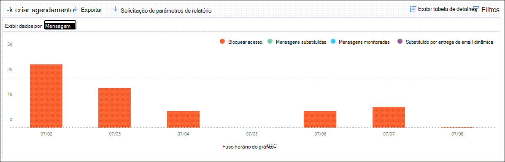
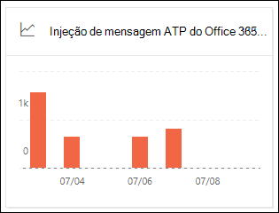
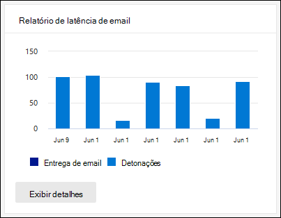

# Exibir relatórios do defender for Office 365 no painel relatórios no centro de conformidade & segurançaView Defender for Office 365 reports in the Reports dashboard in the Security & Compliance Center

[!INCLUDE [Microsoft 365 Defender rebranding](../includes/microsoft-defender-for-office.md)]

As organizações do Microsoft defender for Office 365 (por exemplo, assinaturas do Microsoft 365 E5 ou Microsoft defender para Office 365 plano 1 ou Microsoft defender para Office 365 plano 2) contêm uma variedade de relatórios relacionados à segurança.Microsoft Defender for Office 365 organizations (for example, Microsoft 365 E5 subscriptions or Microsoft Defender for Office 365 Plan 1 or Microsoft Defender for Office 365 Plan 2 add-ons) contain a variety of security-related reports. Se você tiver as [permissões necessárias](#what-permissions-are-needed-to-view-the-defender-for-office-365-reports), poderá exibir esses relatórios no centro de conformidade & de segurança acessando **Reports** o \> **painel** relatórios.If you have the [necessary permissions](#what-permissions-are-needed-to-view-the-defender-for-office-365-reports), you can view these reports in the Security & Compliance Center by going to **Reports** \> **Dashboard**. Para ir diretamente para o painel relatórios, abra <https://protection.office.com/insightdashboard> .To go directly to the Reports dashboard, open <https://protection.office.com/insightdashboard>.

## Relatório de tipos de arquivo do defender for Office 365Defender for Office 365 file types report

O relatório de **relatórios de tipos de arquivo do defender for Office 365** mostra o tipo de arquivos detectados como mal-intencionados por [anexos seguros](atp-safe-attachments.md).The **Defender for Office 365 file types report** report shows you the type of files detected as malicious by [Safe Attachments](atp-safe-attachments.md).

 O modo de exibição de agregação do relatório permite 90 dias de filtragem, enquanto o modo de exibição de detalhes permite apenas 10 dias de filtragem.The aggregate view of the report allows for 90 days of filtering, while the detail view only allows for 10 days of filtering.

Para exibir o relatório, abra o [centro de conformidade & segurança](https://protection.office.com), vá **Reports** para \> **painel** relatórios e selecione **defender para tipos de arquivo do Office 365**.To view the report, open the [Security & Compliance Center](https://protection.office.com), go to **Reports** \> **Dashboard** and select **Defender for Office 365 file types**. Para ir diretamente para o relatório, abra <https://protection.office.com/reportv2?id=ATPFileReport> .To go directly to the report, open <https://protection.office.com/reportv2?id=ATPFileReport>.

> [!NOTE]
> As informações neste relatório também estão disponíveis no relatório de [disposição de mensagens do defender for Office 365](#defender-for-office-365-message-disposition-report).The information in this report is also available in the [Defender for Office 365 message disposition report](#defender-for-office-365-message-disposition-report).

### Exibição de relatório para o relatório de tipos de arquivo do defender for Office 365Report view for the Defender for Office 365 file types report

Os seguintes modos de exibição estão disponíveis:The following views are available:

- **Exibir dados por: arquivo**: o gráfico contém as seguintes informações:**View data by: File**: The chart contains the following information:

  - **Anexos mal-intencionados do Excel****Malicious Excel attachments**
  - **Anexos de flash mal-intencionados****Malicious Flash attachments**
  - **Anexos PDF mal-intencionados****Malicious PDF attachments**
  - **Anexos mal-intencionados do PowerPoint****Malicious PowerPoint attachments**
  - **URLs mal-intencionadas****Malicious URLs**
  - **Anexos de palavras maliciosas****Malicious Word attachments**
  - **Anexos executáveis maliciosos****Malicious executable attachments**
  - **Outros****Others**

  Ao passar o mouse sobre um determinado dia (ponto de dados), você pode ver a divisão de tipos de arquivos mal-intencionados que foram detectados por [anexos seguros](atp-safe-attachments.md) e [proteção Antimalware no EOP](anti-malware-protection.md).When you hover over a particular day (data point), you can see the breakdown of types of malicious files that were detected by [Safe Attachments](atp-safe-attachments.md) and [anti-malware protection in EOP](anti-malware-protection.md).

  

  Se você clicar em **filtros**, poderá modificar o relatório com os seguintes filtros:If you click **Filters**, you can modify the report with the following filters:

  - **Data de início** e **data de término****Start date** and **End date**
  - Os mesmos valores de tipo de arquivo que estão visíveis no gráfico.The same file type values that are visible in the chart.

- **Exibir dados por: Message**: o gráfico contém as seguintes informações:**View data by: Message**: The chart contains the following information:

  - **Bloquear acesso****Block access**
  - **Mensagens substituídas****Messages replaced**
  - **Mensagens monitoradas****Messages monitored**
  - **Substituído por entrega de emails dinâmicas**: para obter mais informações, consulte [entrega dinâmica em políticas de anexos seguros](atp-safe-attachments.md#dynamic-delivery-in-safe-attachments-policies).**Replaced by Dynamic Email Delivery**: For more information, see [Dynamic Delivery in Safe Attachments policies](atp-safe-attachments.md#dynamic-delivery-in-safe-attachments-policies).

  

  Se você clicar em **filtros**, poderá modificar o relatório com os seguintes filtros:If you click **Filters**, you can modify the report with the following filters:

  - **Data de início** e **data de término****Start date** and **End date**
  - Os mesmos valores de disposição de mensagem que estão disponíveis no gráfico e o valor de **mensagens adicionais passadas** .The same message disposition values that are available in the chart, and the additional **Messages passed** value.

### Exibição da tabela de detalhes para o relatório de tipos de arquivo do defender for Office 365Details table view for the Defender for Office 365 file types report

Se você clicar em **Exibir tabela de detalhes**, o relatório fornecerá uma visão quase em tempo real de todos os cliques que acontecerem na organização pelos últimos 10 dias.If you click **View details table**, the report provides a near-real-time view of all clicks that happen within the organization for the last 10 days. As informações mostradas dependem do gráfico que você estava observando:The information that's shown depends on the chart you were looking at:

- **Exibir dados por: arquivo**:**View data by: File**:

  - **Date****Date**
  - **Endereço do destinatário****Recipient address**
  - **Endereço do remetente**.**Sender address**
  - **ID da mensagem**: disponível no campo de cabeçalho **Message-ID** no cabeçalho da mensagem e deve ser exclusivo.**Message ID**: Available in the **Message-ID** header field in the message header and should be unique. Um valor de exemplo é `<08f1e0f6806a47b4ac103961109ae6ef@server.domain>` (Observe os colchetes angulares).An example value is `<08f1e0f6806a47b4ac103961109ae6ef@server.domain>` (note the angle brackets).
  - **Arquivo****File**

  Se você clicar em **filtros**, poderá modificar o relatório com os seguintes filtros:If you click **Filters**, you can modify the report with the following filters:

  - **Data de início** e **data de término****Start date** and **End date**
  - Os mesmos valores de tipo de arquivo que estão visíveis no gráfico.The same file type values that are visible in the chart.

- **Exibir dados por: mensagem**:**View data by: Message**:

  - **Date****Date**
  - **Endereço do destinatário****Recipient address**
  - **Endereço do remetente**.**Sender address**
  - **ID da mensagem****Message ID**
  - **Arquivo****File**
  - **Subject****Subject**

  Se você clicar em **filtros**, poderá modificar os resultados com os seguintes filtros:If you click **Filters**, you can modify the results with the following filters:

  - **Data de início** e **data de término****Start date** and **End date**
  - Os mesmos valores de disposição de mensagem que estão disponíveis no gráfico e o valor de **mensagens adicionais passadas** .The same message disposition values that are available in the chart, and the additional **Messages passed** value.

Para voltar para o modo de exibição relatórios, clique em **Exibir relatório**.To get back to the reports view, click **View report**.

## Relatório de disposição de mensagens do defender for Office 365Defender for Office 365 message disposition report

O relatório de **disposição de mensagens ATP** mostra as ações que foram tomadas para mensagens de email que foram detectadas como tendo conteúdo mal-intencionado.The **ATP Message Disposition** report shows you the actions that were taken for email messages that were detected as having malicious content.

Para exibir o relatório, abra o [centro de conformidade & segurança](https://protection.office.com), vá **Reports** para \> **painel** relatórios e selecione **defender para Office 365 disposição de mensagem**.To view the report, open the [Security & Compliance Center](https://protection.office.com), go to **Reports** \> **Dashboard** and select **Defender for Office 365 message disposition**. Para ir diretamente para o relatório, abra <https://protection.office.com/reportv2?id=ATPMessageReport> .To go directly to the report, open <https://protection.office.com/reportv2?id=ATPMessageReport>.

> [!NOTE]
> As informações neste relatório também estão disponíveis no relatório de [tipos de arquivo do defender for Office 365](#defender-for-office-365-file-types-report).The information in this report is also available in the [Defender for Office 365 file types report](#defender-for-office-365-file-types-report).

### Exibição de relatório para o relatório de disposição de mensagens do defender for Office 365Report view for the Defender for Office 365 message disposition report

Os seguintes modos de exibição estão disponíveis:The following views are available:

- **Exibir dados por: Message**: o gráfico contém as seguintes informações:**View data by: Message**: The chart contains the following information:

  - **Bloquear acesso****Block access**
  - **Mensagens substituídas****Messages replaced**
  - **Mensagens monitoradas****Messages monitored**
  - **Substituído por entrega de emails dinâmicas**: para obter mais informações, consulte [entrega dinâmica em políticas de anexos seguros](atp-safe-attachments.md#dynamic-delivery-in-safe-attachments-policies).**Replaced by Dynamic Email Delivery**: For more information, see [Dynamic Delivery in Safe Attachments policies](atp-safe-attachments.md#dynamic-delivery-in-safe-attachments-policies).

  

  Se você clicar em **filtros**, poderá modificar o relatório com os seguintes filtros:If you click **Filters**, you can modify the report with the following filters:

  - **Data de início** e **data de término****Start date** and **End date**
  - Os mesmos valores de disposição de mensagem que estão disponíveis no gráfico e o valor de **mensagens adicionais passadas** .The same message disposition values that are available in the chart, and the additional **Messages passed** value.

- **Exibir dados por: arquivo**: o gráfico contém as seguintes informações:**View data by: File**: The chart contains the following information:

  - **Anexos mal-intencionados do Excel****Malicious Excel attachments**
  - **Anexos de flash mal-intencionados****Malicious Flash attachments**
  - **Anexos PDF mal-intencionados****Malicious PDF attachments**
  - **Anexos mal-intencionados do PowerPoint****Malicious PowerPoint attachments**
  - **URLs mal-intencionadas****Malicious URLs**
  - **Anexos de palavras maliciosas****Malicious Word attachments**
  - **Anexos executáveis maliciosos****Malicious executable attachments**
  - **Outros****Others**

  Ao passar o mouse sobre um determinado dia (ponto de dados), você pode ver a divisão de tipos de arquivos mal-intencionados que foram detectados por [anexos seguros](atp-safe-attachments.md) e [proteção Antimalware no EOP](anti-malware-protection.md).When you hover over a particular day (data point), you can see the breakdown of types of malicious files that were detected by [Safe Attachments](atp-safe-attachments.md) and [anti-malware protection in EOP](anti-malware-protection.md).

  

  Se você clicar em **filtros**, poderá modificar o relatório com os seguintes filtros:If you click **Filters**, you can modify the report with the following filters:

  - **Data de início** e **data de término****Start date** and **End date**
  - Os mesmos valores de tipo de arquivo que estão visíveis no gráfico.The same file type values that are visible in the chart.

### Exibição da tabela de detalhes do relatório de disposição de mensagens do defender for Office 365Details table view for the Defender for Office 365 message disposition report

Se você clicar em **Exibir tabela de detalhes**, o relatório fornecerá uma visão quase em tempo real de todos os cliques que acontecerem na organização pelos últimos 10 dias.If you click **View details table**, the report provides a near-real-time view of all clicks that happen within the organization for the last 10 days. As informações mostradas dependem do gráfico que você estava observando:The information that's shown depends on the chart you were looking at:

- **Exibir dados por: mensagem**:**View data by: Message**:

  - **Date****Date**
  - **Endereço do destinatário****Recipient address**
  - **Endereço do remetente**.**Sender address**
  - **ID da mensagem****Message ID**
  - **Arquivo****File**
  - **Subject****Subject**

  Se você clicar em **filtros**, poderá modificar os resultados com os seguintes filtros:If you click **Filters**, you can modify the results with the following filters:

  - **Data de início** e **data de término****Start date** and **End date**
  - Os mesmos valores de disposição de mensagem que estão disponíveis no gráfico e o valor de **mensagens adicionais passadas** .The same message disposition values that are available in the chart, and the additional **Messages passed** value.

- **Exibir dados por: arquivo**:**View data by: File**:

  - **Date****Date**
  - **Endereço do destinatário****Recipient address**
  - **Endereço do remetente**.**Sender address**
  - **ID da mensagem****Message ID**
  - **Arquivo****File**

  Se você clicar em **filtros**, poderá modificar o relatório com os seguintes filtros:If you click **Filters**, you can modify the report with the following filters:

  - **Data de início** e **data de término****Start date** and **End date**
  - Os mesmos valores de tipo de arquivo que estão visíveis no gráfico.The same file type values that are visible in the chart.

Para voltar para o modo de exibição relatórios, clique em **Exibir relatório**.To get back to the reports view, click **View report**.

## Relatório de latência de emailMail latency report

O **relatório de latência de email** mostra um modo de exibição de agregação da entrega de email e da latência de acionamento em sua organização.The **Mail latency report** shows you an aggregate view of the mail delivery and detonation latency experienced within your organization. As horas de entrega de email no serviço são afetadas por vários fatores, e o tempo de entrega absoluto, em segundos, geralmente não é um bom indicador de sucesso ou de um problema.Mail delivery times in the service are affected by a number of factors, and the absolute delivery time in seconds is often not a good indicator of success or a problem. Um tempo de entrega lento em um dia pode ser considerado um tempo de entrega médio em outro dia ou vice-versa.A slow delivery time on one day might be considered an average delivery time on another day, or vice-versa. O **relatório de latência de email** tenta qualificar a entrega de mensagens com base em dados estatísticos sobre as horas de entrega observadas de outras mensagens:The **Mail latency report** tries to qualify message delivery based on statistical data about the observed delivery times of other messages:

- **50 º percentil**: Este é o meio para tempos de entrega de mensagens.**50th percentile**: This is the middle for message delivery times. Você pode considerar esse valor como um tempo médio de entrega.You can consider this value as an average delivery time.
- **90th percentil**: indica uma alta latência para entrega de mensagens.**90th percentile**: This indicates a high latency for message delivery. Apenas 10% das mensagens demorou mais do que esse valor a ser entregue.Only 10% of messages took longer than this value to deliver.
- **99th percentil**: indica a maior latência para entrega de mensagens.**99th percentile**: This indicates the highest latency for message delivery.

A latência do lado do cliente e da rede não estão incluídas.Client side and network latency are not included.

Para exibir o relatório, abra o [centro de conformidade & segurança](https://protection.office.com), vá **Reports** para \> **painel** relatórios e selecione relatório de **latência de email**.To view the report, open the [Security & Compliance Center](https://protection.office.com), go to **Reports** \> **Dashboard** and select **Mail latency report**. Para ir diretamente para o relatório, abra <https://protection.office.com/mailLatencyReport?viewid=P50> .To go directly to the report, open <https://protection.office.com/mailLatencyReport?viewid=P50>.

### Exibição de relatório para o relatório de latência de emailReport view for the Mail latency report

Quando você abre o relatório, a guia **50 º percentils** é selecionada por padrão.When you open the report, the **50th percentiles** tab is selected by default.

Por padrão, este modo de exibição contém um gráfico que é configurado com os seguintes filtros:By default, this view contains a chart that's configured with the following filters:

- **Data**: os últimos 7 dias**Date**: The last 7 days
- **Exibição de mensagem**:**Message View**:
  - Mensagens do destruídoDetonated messages

Este gráfico mostra as mensagens organizadas nas seguintes categorias:This chart shows messages organized into the following categories:

- **Latência de entrega de email****Mail delivery latency**
- **Latência acionamento****Detonation latency**

Ao passar o mouse sobre uma categoria no gráfico, você pode ver uma divisão da latência em cada categoria.When you hover over a category in the chart, you can see a breakdown of the latency in each category.

Se você clicar em **filtro** no modo de exibição relatório, poderá modificar os resultados com os seguintes filtros:If you click **Filter** in the report view, you can modify the results with the following filters:

- Todas as mensagensAll messages
- Mensagens que contêm anexos ou URLsMessages that contain attachments or URLs

Se você clicar na guia **90th percentils** ou na guia **99th percentil** , os mesmos filtros padrão do modo de exibição de **percentil do 50 º** são usados.If you click the **90th percentiles** tab or the **99th percentiles** tab, the same default filters from the **50th percentiles** view are used.

### Exibição da tabela de detalhes para o relatório de latência de emailDetails table view for the Mail latency report

As informações a seguir são mostradas no modo de exibição de tabela de detalhes:The following information is shown in the details table view:

- **Date****Date**
- **Percentis****Percentiles**
- **Contagem de mensagem****Message count**
- **Latência geral****Overall latency**

O acima mostra que, em 14 de novembro, a latência média de todas as mensagens entregues e destruído foi de **108, 33** segundos.The above shows that on November 14 the average latency experienced for all messages delivered and detonated was **108.033** seconds.

A tabela detalhes contém as mesmas informações em cada guia.The details table contains the same information on each tab.

## Relatório de status de proteção contra ameaçasThreat protection status report

O relatório de **status de proteção contra ameaças** é um modo de exibição único que reúne informações sobre conteúdo mal-intencionado e email mal-intencionado detectado e bloqueado pela [proteção do Exchange Online](exchange-online-protection-overview.md) (EOP) e pelo Microsoft defender para Office 365.The **Threat protection status** report is a single view that brings together information about malicious content and malicious email detected and blocked by [Exchange Online Protection](exchange-online-protection-overview.md) (EOP) and Microsoft Defender for Office 365. Para obter mais informações, consulte [relatório de status de proteção contra ameaças](view-email-security-reports.md#threat-protection-status-report).For more information, see [Threat protection status report](view-email-security-reports.md#threat-protection-status-report).

## Relatório de proteção contra ameaças de URLURL threat protection report

O **relatório de proteção de ameaças de URL** fornece as exibições de resumo e tendência para ameaças detectadas e ações tomadas em cliques de URL como parte de [links seguros](atp-safe-links.md).The **URL threat protection report** provides summary and trend views for threats detected and actions taken on URL clicks as part of [Safe Links](atp-safe-links.md). Este relatório não terá clique em dados de usuários em que a política de links seguros aplicada tenha a opção **não rastrear os cliques do usuário** selecionada.This report will not have click data from users where the Safe Links policy applied has the **Do not track user clicks** option selected.

Para exibir o relatório, abra o [centro de conformidade & segurança](https://protection.office.com), vá **Reports** para \> **painel** relatórios e selecione relatório de **proteção de URL**.To view the report, open the [Security & Compliance Center](https://protection.office.com), go to **Reports** \> **Dashboard** and select **URL protection report**. Para ir diretamente para o relatório, abra <https://protection.office.com/reportv2?id=URLProtectionActionReport> .To go directly to the report, open <https://protection.office.com/reportv2?id=URLProtectionActionReport>.

> [!NOTE]
> Este é um *relatório de tendências de proteção*, o que significa que os dados representam tendências em um conjunto de dados maior.This is a *protection trend report*, meaning data represents trends in a larger dataset. Como resultado, os dados no modo de exibição de agregação não estão disponíveis em tempo real aqui, mas os dados no modo de exibição de tabela detalhes são, portanto, você pode ver uma pequena discrepância entre as duas exibições.As a result, the data in the aggregate view is not available in real time here, but the data in the details table view is, so you may see a slight discrepancy between the two views.

### Exibição de relatório para o relatório de proteção contra ameaças de URLReport view for the URL threat protection report

O relatório de **proteção contra ameaças de URL** tem duas exibições agregadas que são atualizadas uma vez a cada quatro horas que mostram dados dos últimos 90 dias:The **URL threat protection** report has two aggregated views that are refreshed once every four hours that shows data for the last 90 days:

- **URL clique em ação de proteção**: mostra o número de cliques de URL por usuários na organização e os resultados do clique:**URL click protection action**: Shows the number of URL clicks by users in the organization and the results of the click:

  - **Bloqueado** (o usuário foi impedido de navegar para a URL)**Blocked** (the user was blocked from navigating to the URL)
  - **Bloqueado e clicado****Blocked and clicked through**
  - **Clicado durante a verificação****Clicked through during scan**

  Um clique indica que o usuário clicou através da página de bloqueio para o site mal-intencionado (os administradores podem desabilitar o clique em políticas de links seguros).A click indicates that the user has clicked through the block page to the malicious website (admins can disable click through in Safe Links policies).

  Se você clicar em **filtros**, poderá modificar o relatório com os seguintes filtros:If you click **Filters**, you can modify the report with the following filters:

  - **Data de início** e **data de término****Start date** and **End date**
  - O disponível clique em ações de proteção, mais o valor **permitido** (o usuário tem permissão para navegar até a URL).The available click protection actions, plus the value **Allowed** (the user was allowed to navigate to the URL).

  

- **URL clique por aplicativo**: mostra o número de cliques de URL por aplicativos que dão suporte a links seguros:**URL click by application**: Shows the number of URL clicks by applications that support Safe Links:

  - **Cliente de email****Email client**
  - **PowerPoint****PowerPoint**
  - **Word****Word**
  - **Excel****Excel**
  - **OneNote****OneNote**
  - **Visio****Visio**
  - **Teams****Teams**
  - **Outros****Other**

  Se você clicar em **filtros**, poderá modificar o relatório com os seguintes filtros:If you click **Filters**, you can modify the report with the following filters:

  - **Data de início** e **data de término****Start date** and **End date**
  - Os aplicativos disponíveis.The available applications.

### Exibição da tabela de detalhes para o relatório de proteção contra ameaças de URLDetails table view for the URL threat protection report

Se você clicar em **Exibir tabela de detalhes**, o relatório fornecerá uma visão quase em tempo real de todos os cliques que acontecerem na organização pelos últimos 7 dias com os seguintes detalhes:If you click **View details table**, the report provides a near-real-time view of all clicks that happen within the organization for the last 7 days with the following details:

- **Horário de clique****Click time**
- **Usuário****User**
- **URL****URL**
- **Ação****Action**
- **App****App**

Se você clicar em **filtros** no modo de exibição tabela de detalhes, poderá filtrar pelos mesmos critérios do modo de exibição relatório e também por **domínios** ou **destinatários** separados por vírgulas.If you click **Filters** in the details table view, you can filter by the same criteria as in the report view, and also by **Domains** or **Recipients** separated by commas.

Para voltar para o modo de exibição relatórios, clique em **Exibir relatório**.To get back to the reports view, click **View report**.

## Relatórios adicionais para exibirAdditional reports to view

Além dos relatórios descritos neste tópico, vários outros relatórios estão disponíveis, conforme descrito na tabela a seguir:In addition to the reports described in this topic, several other reports are available, as described in the following table:

****

|RelatórioReport|TópicoTopic|
|---|---|
|**Explorer** (Microsoft defender para Office 365 plano 2) ou **detecções em tempo real** (microsoft defender para Office 365 plano 1)**Explorer** (Microsoft Defender for Office 365 Plan 2) or **real-time detections** (Microsoft Defender for Office 365 Plan 1)|[Explorador de Ameaças (e detecções em tempo real)Threat Explorer (and real-time detections)](threat-explorer.md)|
|**Relatórios de segurança de email**, como os principais remetentes e destinatários, o relatório de email de spoof e o relatório de detecções de spam.**Email security reports**, such as the Top senders and recipients report, the Spoof mail report, and the Spam detections report.|[Exibir relatórios de segurança de email no centro de conformidade & segurançaView email security reports in the Security & Compliance Center](view-email-security-reports.md)|
|**Relatórios de fluxo de email**, como o relatório de encaminhamento, o relatório de status do fluxo e o relatório de remetentes e destinatários principais.**Mail flow reports**, such as the Forwarding report, the Mailflow status report, and the Top senders and recipients report.|[Exibir relatórios de fluxo de emails no centro de conformidade & segurançaView mail flow reports in the Security & Compliance Center](view-mail-flow-reports.md)|
|**Rastreamento de URL para links seguros** (somente PowerShell).**URL trace for Safe Links** (PowerShell only). A saída deste cmdlet mostra os resultados das ações de links seguros nos últimos sete dias.The output of this cmdlet shows you the results of Safe Links actions over the past seven days.|[Get-UrlTraceGet-UrlTrace](https://docs.microsoft.com/powershell/module/exchange/get-urltrace)|
|**Resultados de tráfego de email para EOP e Microsoft defender para Office 365** (somente PowerShell).**Mail traffic results for EOP and Microsoft Defender for Office 365** (PowerShell only). A saída desse cmdlet contém informações sobre o domínio, a data, o tipo de evento, a direção, a ação e a contagem de mensagens.The output of this cmdlet contains information about Domain, Date, Event Type, Direction, Action, and Message Count.|[Get-MailTrafficATPReportGet-MailTrafficATPReport](https://docs.microsoft.com/powershell/module/exchange/get-mailtrafficatpreport)|
|**Relatórios de detalhes de email para detecções do EOP e do defender para Office 365** (somente PowerShell).**Mail detail reports for EOP and Defender for Office 365 detections** (PowerShell only). A saída desse cmdlet contém detalhes sobre arquivos mal-intencionados ou URLs, tentativas de phishing, representação e outras ameaças potenciais em emails ou arquivos.The output of this cmdlet contains details about malicious files or URLs, phishing attempts, impersonation, and other potential threats in email or files.|[Get-MailDetailATPReportGet-MailDetailATPReport](https://docs.microsoft.com/powershell/module/exchange/get-maildetailatpreport)|
|

## Quais permissões são necessárias para exibir os relatórios do defender for Office 365?What permissions are needed to view the Defender for Office 365 reports?

Para exibir e usar os relatórios descritos neste tópico, você precisa ser membro de um dos seguintes grupos de função no centro de conformidade de & de segurança:In order to view and use the reports described in this topic, you need to be a member of one of the following role groups in the Security & Compliance Center:

- **Organization Management****Organization Management**
- **Administrador de segurança****Security Administrator**
- **Leitor de segurança****Security Reader**
- **Leitor global****Global Reader**

Para saber mais, confira [Permissões no Centro de Conformidade de Segurança](permissions-in-the-security-and-compliance-center.md).For more information, see [Permissions in the Security & Compliance Center](permissions-in-the-security-and-compliance-center.md).

**Observação**: a adição de usuários à função do Azure Active Directory correspondente no centro de administração do Microsoft 365 fornece aos usuários as permissões necessárias no centro de conformidade _e_ segurança & para outros recursos no Microsoft 365.**Note**: Adding users to the corresponding Azure Active Directory role in the Microsoft 365 admin center gives users the required permissions in the Security & Compliance Center _and_ permissions for other features in Microsoft 365. Para obter mais informações, confira [Sobre funções de administrador](https://docs.microsoft.com/microsoft-365/admin/add-users/about-admin-roles).For more information, see [About admin roles](https://docs.microsoft.com/microsoft-365/admin/add-users/about-admin-roles).

## E se os relatórios não estiverem mostrando dados?What if the reports aren't showing data?

Se você não estiver vendo dados nos seus relatórios do defender for Office 365, verifique se as políticas estão configuradas corretamente.If you are not seeing data in your Defender for Office 365 reports, double-check that your policies are set up correctly. Sua organização deve ter [políticas de links seguros](set-up-atp-safe-links-policies.md) e [políticas de anexos seguros](set-up-atp-safe-attachments-policies.md) definidas para que a proteção do defender para Office 365 seja estabelecida.Your organization must have [Safe Links policies](set-up-atp-safe-links-policies.md) and [Safe Attachments policies](set-up-atp-safe-attachments-policies.md) defined in order for Defender for Office 365 protection to be in place. Consulte também [anti-spam and Anti-Malware Protection](anti-spam-and-anti-malware-protection.md).Also see [Anti-spam and anti-malware protection](anti-spam-and-anti-malware-protection.md).

## Tópicos relacionadosRelated topics

[Relatórios inteligentes e insights no Centro de Conformidade e SegurançaSmart reports and insights in the Security & Compliance Center](reports-and-insights-in-security-and-compliance.md)
  
[Permissões de função (Azure Active DirectoryRole permissions (Azure Active Directory](https://docs.microsoft.com/azure/active-directory/users-groups-roles/directory-assign-admin-roles#role-permissions)
