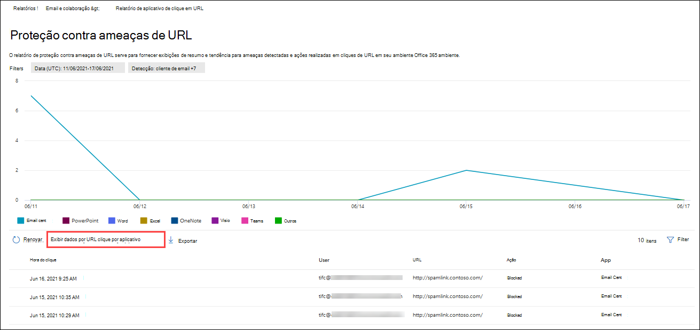

# Exibir o Defender Office 365 relatórios no portal Microsoft 365 Defender

[!INCLUDE [Microsoft 365 Defender rebranding](../includes/microsoft-defender-for-office.md)]

**Aplica-se a**
- [Plano 1 e plano 2 do Microsoft Defender para Office 365](defender-for-office-365.md)
- [Microsoft 365 Defender](../defender/microsoft-365-defender.md)

O Microsoft Defender para organizações Office 365 (por exemplo, assinaturas do Microsoft 365 E5 ou o Microsoft Defender para o Plano 1 do Office 365 ou o Microsoft Defender para complementos do Plano 2 do Office 365) contém uma variedade de relatórios relacionados à segurança. Se você tiver as permissões [necessárias,](#what-permissions-are-needed-to-view-the-defender-for-office-365-reports)poderá exibir esses relatórios no  portal Microsoft 365 Defender indo para Relatórios \> **Email & colaboração** Email & relatórios de \> **colaboração**. Para ir diretamente para a página Relatórios de **colaboração & email,** abra <https://security.microsoft.com/emailandcollabreport> .

> [!NOTE]
>
> Relatórios de segurança de email que não exigem o Defender para Office 365 são descritos em Exibir relatórios de segurança de [email no portal Microsoft 365 Defender .](view-email-security-reports.md)
>
> Os relatórios relacionados ao fluxo de emails agora estão no centro de administração Exchange (EAC). Para obter mais informações sobre esses relatórios, consulte [Mail flow reports in the new Exchange admin center](/exchange/monitoring/mail-flow-reports/mail-flow-reports).

## Cofre Relatório de tipos de arquivo anexos

> [!NOTE]
> O Cofre de tipos de arquivo **Attachments** eventualmente desaparecerá. As mesmas informações estão disponíveis no relatório de [status de proteção contra ameaças.](#threat-protection-status-report)

## Cofre Relatório de disposição de mensagens de anexos

> [!NOTE]
> O Cofre de disposição da mensagem **Attachments** eventualmente desaparecerá. As mesmas informações estão disponíveis no relatório de [status de proteção contra ameaças.](#threat-protection-status-report)

## Relatório de latência de email

O **relatório de latência de email** mostra uma exibição agregada da entrega de email e da latência de detonação experimentadas em sua organização. Os tempos de entrega de email no serviço são afetados por vários fatores, e o tempo de entrega absoluto em segundos geralmente não é um bom indicador de sucesso ou um problema. Um tempo de entrega lento em um dia pode ser considerado um tempo médio de entrega em outro dia ou vice-versa. Isso tenta qualificar a entrega de mensagens com base em dados estatísticos sobre os tempos de entrega observados de outras mensagens.

O lado do cliente e a latência de rede não estão incluídos.

Para exibir o relatório, abra o [portal Microsoft 365 Defender ,](https://security.microsoft.com)acesse **Relatórios** Email \> **& colaboração** Email & relatórios de \> **colaboração**. Na página **Relatórios de colaboração &** email, encontre Relatório de **latência** de email e clique em **Exibir detalhes**. Para ir diretamente para o relatório, abra <https://security.microsoft.com/mailLatencyReport> .

Na página **Relatório de latência** de email, as seguintes guias estão disponíveis na página Relatório de **latência de** email:

- **Percentil 50**: Este é o meio para os tempos de entrega da mensagem. Você pode considerar esse valor como um tempo médio de entrega. Essa guia é selecionada por padrão.
- **Percentil 90**: Isso indica uma alta latência para entrega de mensagens. Apenas 10% das mensagens demoraram mais do que esse valor para ser entregue.
- **Percentil 99**: Isso indica a latência mais alta para entrega de mensagens.

Independentemente da guia selecionada, o gráfico mostra mensagens organizadas nas seguintes categorias:

- **Latência de entrega de email**
- **Detonações**

Ao passar o mouse sobre uma categoria no gráfico, você pode ver uma divisão da latência em cada categoria.

Se você clicar **em Filtrar**, você poderá filtrar o gráfico e a tabela de detalhes pelos seguintes valores:

- **Data (UTC)**: Data **de início** **e data de término**
- **Exibição de** mensagem : um dos seguintes valores:
  - **Todas as mensagens**
  - **Mensagens que contêm anexos ou URLs**
  - **Mensagens detonadas**

Quando terminar de configurar os filtros, clique em **Aplicar,** **Cancelar** ou **Limpar filtros**.

Na tabela de detalhes abaixo do gráfico, as seguintes informações estão disponíveis:

- **Data (UTC)**
- **Percentis**: **50**, **90** ou **99**
- **Contagem de mensagem**
- **Latência geral**

## Relatório de status de proteção contra ameaças

O relatório de **status** de proteção contra ameaças é uma exibição única que reúne informações sobre conteúdo mal-intencionado e emails mal-intencionados detectados e bloqueados pelo [Proteção do Exchange Online](exchange-online-protection-overview.md) (EOP) e o Microsoft Defender para Office 365. Para obter mais informações, consulte [Relatório de status de proteção contra ameaças.](view-email-security-reports.md#threat-protection-status-report)

## Relatório de proteção contra ameaças de URL

O **relatório de proteção contra** ameaças de URL fornece exibições de resumo e tendência para ameaças detectadas e ações realizadas em cliques de URL como parte Cofre [Links](safe-links.md). Este relatório não terá os dados de clique de usuários nos quais a política de links Cofre aplicada tem a opção Não rastrear **cliques do** usuário selecionada.

Para exibir o relatório, abra o [portal Microsoft 365 Defender ,](https://security.microsoft.com)acesse **Relatórios** Email \> **& colaboração** Email & relatórios de \> **colaboração**. Na página **Relatórios de colaboração de &** email, encontre a página de proteção de **URL** e clique em **Exibir detalhes**. Para ir diretamente para o relatório, abra <https://security.microsoft.com/reports/URLProtectionActionReport> .

Os exibições disponíveis na página de relatório de proteção contra ameaças de **URL** são descritos nas seções a seguir.

> [!NOTE]
> Este é um relatório *de tendência de proteção*, o que significa que os dados representam tendências em um conjuntos de dados maior. Como resultado, os dados nos gráficos não estão disponíveis em tempo real aqui, mas os dados na tabela de detalhes são, portanto, você pode ver uma pequena discrepância entre os dois. Os gráficos são atualizados uma vez a cada quatro horas e contêm dados dos últimos 90 dias.

### Exibir dados por ação de proteção de clique em URL

O **view data by URL click protection action** view shows the number of URL clicks by users in the organization and the results of the click:

- **Permitido**: o usuário teve permissão para navegar até a URL.
- **Bloqueado**: o usuário foi impedido de navegar para a URL.
- **Bloqueado e clicado por**: O usuário optou por continuar navegando para a URL.
- **Clicado durante a verificação**: o usuário clicou no link antes de a verificação ser concluída.

Um clique indica que o usuário clicou na página de bloqueio para o site mal-intencionado (os administradores podem desabilitar o clique em Cofre Políticas de Links).

Se você clicar em **Filtros,** poderá modificar o relatório e a tabela de detalhes selecionando um ou mais dos seguintes valores no sobremenu que aparece:

- **Data (UTC)**: Data **de início** **e data de término**
- **Detecção**:
  - **Permitido**
  - **Bloqueado**
  - **Bloqueado e clicado por meio**
  - **Clicado durante a verificação**
- **Domínios**: os domínios de URL listados nos resultados do relatório.
- **Destinatários**

Quando terminar de configurar os filtros, clique em **Aplicar,** **Cancelar** ou **Limpar filtros**.

A tabela de detalhes abaixo do gráfico fornece a seguinte exibição quase em tempo real de todos os cliques que aconteceram na organização nos últimos 7 dias:

- **Clique em hora**
- **Usuário**
- **URL**
- **Action**
- **Aplicativo**

### Exibir dados por URL clique por aplicativo

O **view data by URL click by application** view shows the number of URL clicks by apps that support Cofre Links:

- **Cliente de email**
- **PowerPoint**
- **Word**
- **Excel**
- **OneNote**
- **Visio**
- **Teams**
- **Outros**

Se você clicar em **Filtros,** poderá modificar o relatório e a tabela de detalhes selecionando um ou mais dos seguintes valores no sobremenu que aparece:

- **Data (UTC)**: Data **de início** **e data de término**
- **Detecção**: Aplicativos disponíveis no gráfico.
- **Domínios**: os domínios de URL listados nos resultados do relatório.
- **Destinatários**

Quando terminar de configurar os filtros, clique em **Aplicar,** **Cancelar** ou **Limpar filtros**.

A tabela de detalhes abaixo do gráfico fornece a seguinte exibição quase em tempo real de todos os cliques que aconteceram na organização nos últimos 7 dias:

- **Clique em hora**
- **Usuário**
- **URL**
- **Action**
- **Aplicativo**

## Relatórios adicionais para exibição

Além dos relatórios descritos neste artigo, vários outros relatórios estão disponíveis, conforme descrito na tabela a seguir:

 

****

|Relatório|Tópico|
|---|---|
|**Explorer** (Microsoft Defender para Office 365 Plano 2) ou detecções em tempo **real** (Microsoft Defender para Office 365 Plano 1)|[Explorador de Ameaças (e detecções em tempo real)](threat-explorer.md)|
|**Relatórios de segurança de** email , como o relatório principais remetentes e destinatários, o relatório de email Spoof e o relatório de detecções de spam.|[Exibir relatórios de segurança de email no portal Microsoft 365 Defender email](view-email-security-reports.md)|
|**Relatórios de fluxo de** emails , como o relatório de encaminhamento, o relatório de status de fluxo de emails e o relatório de principais destinatários e destinatários.|[Relatórios de fluxo de emails no novo Exchange de administração](/exchange/monitoring/mail-flow-reports/mail-flow-reports)|
|**Rastreamento de URL para Cofre Links** (somente PowerShell). A saída deste cmdlet mostra os resultados das ações Cofre Links nos últimos sete dias.|[Get-UrlTrace](/powershell/module/exchange/get-urltrace)|
|**Resultados do tráfego de email para o EOP e o Microsoft Defender para Office 365** (somente o PowerShell). A saída deste cmdlet contém informações sobre Domínio, Data, Tipo de Evento, Direção, Ação e Contagem de Mensagens.|[Get-MailTrafficATPReport](/powershell/module/exchange/get-mailtrafficatpreport)|
|**Relatórios de detalhes de email do EOP e do Defender para Office 365 detecções** (somente do PowerShell). A saída deste cmdlet contém detalhes sobre arquivos mal-intencionados ou URLs, tentativas de phishing, representação e outras possíveis ameaças em emails ou arquivos.|[Get-MailDetailATPReport](/powershell/module/exchange/get-maildetailatpreport)|
|

## Quais permissões são necessárias para exibir o Defender para Office 365 relatórios?

Para exibir e usar os relatórios descritos neste artigo, você precisa ser membro de um dos seguintes grupos de função no portal Microsoft 365 Defender:

- **Organization Management**
- **Administrador de Segurança**
- **Leitor de Segurança**
- **Leitor Global**

Para obter mais informações, veja [Permissões no portal do Microsoft 365 Defender](permissions-microsoft-365-security-center.md).

**Observação**: adicionar usuários à função Azure Active Directory correspondente no Centro de administração do Microsoft 365 fornece aos usuários as permissões necessárias no _portal_ Microsoft 365 Defender e permissões para outros recursos no Microsoft 365. Para obter mais informações, confira [Sobre funções de administrador](../../admin/add-users/about-admin-roles.md).

## E se os relatórios não mostrarem dados?

Se você não estiver vendo dados em seus relatórios do Defender Office 365, verifique se suas políticas estão configuradas corretamente. Sua organização deve ter Cofre políticas de [Links](set-up-safe-links-policies.md) e Cofre [De anexos definidas](set-up-safe-attachments-policies.md) para que o Defender Office 365 proteção seja in-locar. Consulte também [Proteção anti-spam e anti-malware.](anti-spam-and-anti-malware-protection.md)

## Tópicos relacionados

[Relatórios inteligentes e percepções no portal Microsoft 365 Defender portal](reports-and-insights-in-security-and-compliance.md)

[Permissões de função (Azure Active Directory](/azure/active-directory/users-groups-roles/directory-assign-admin-roles#role-permissions)
