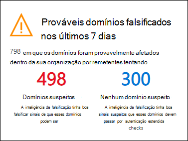
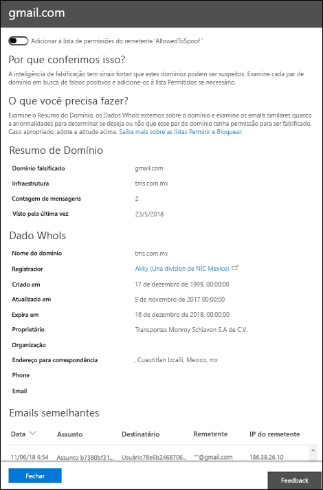

# Passo a passo - Visão de inteligência de spoof no Microsoft Defender para Office 365Walkthrough - Spoof intelligence insight in Microsoft Defender for Office 365

[!INCLUDE [Microsoft 365 Defender rebranding](../includes/microsoft-defender-for-office.md)]

**Aplica-se a****Applies to**
- [Plano 1 e plano 2 do Microsoft Defender para Office 365Microsoft Defender for Office 365 plan 1 and plan 2](office-365-atp.md)
- [Microsoft 365 DefenderMicrosoft 365 Defender](../mtp/microsoft-threat-protection.md)

Nas organizações do Microsoft 365 com o Defender para Office 365, você pode usar o insight de inteligência Spoof para determinar rapidamente quais envios externos estão enviando emails não autenticados (mensagens de domínios que não passam verificações SPF, DKIM ou DMARC).In Microsoft 365 organizations with Defender for Office 365, you can use the Spoof intelligence insight to quickly determine which external senders are legitimately sending you unauthenticated email (messages from domains that don't pass SPF, DKIM, or DMARC checks).

Ao permitir que os envios externos conhecidos enviem mensagens falsas de locais conhecidos, você pode reduzir falsos positivos (bons emails marcados como ruins).By allowing known external senders to send spoofed messages from known locations, you can reduce false positives (good email marked as bad). Monitorando os envios permitidos, você fornece uma camada adicional de segurança para impedir que mensagens não seguras chegam à sua organização.By monitoring the allowed spoofed senders, you provide an additional layer of security to prevent unsafe messages from arriving in your organization.

Para obter mais informações sobre relatórios e insights, consulte Relatórios e insights no Centro de Conformidade & [Segurança.](reports-and-insights-in-security-and-compliance.md)For more information about reports and insights, see [Reports and insights in the Security & Compliance Center](reports-and-insights-in-security-and-compliance.md).

Este passo a passo é um dos vários para o Centro de Conformidade & Segurança.This walkthrough is one of several for the Security & Compliance Center. Para saber mais sobre como navegar relatórios e insights, consulte os passo a passo na seção [Tópicos relacionados.](#related-topics)To about navigating reports and insights, see the walkthroughs in the [Related topics](#related-topics) section.

> [!NOTE]
> O insight de inteligência de spoof mostra dados dos últimos 7 dias.The spoof intelligence insight shows data from the last 7 days. A política de inteligência de [spoof](learn-about-spoof-intelligence.md) e o cmdlet [Get-PhishFilterPolicy](https://docs.microsoft.com/powershell/module/exchange/get-phishfilterpolicy) correspondente no PowerShell do Exchange Online mostram dados dos últimos 30 dias.The [spoof intelligence policy](learn-about-spoof-intelligence.md) and the corresponding [Get-PhishFilterPolicy](https://docs.microsoft.com/powershell/module/exchange/get-phishfilterpolicy) cmdlet in Exchange Online PowerShell shows data from the last 30 days. O [Get-SpoofMailReport](https://docs.microsoft.com/powershell/module/exchange/get-spoofmailreport) mostra dados por até 90 dias.The [Get-SpoofMailReport](https://docs.microsoft.com/powershell/module/exchange/get-spoofmailreport) shows data for up to 90 days.

## O que você precisa saber antes de começar?What do you need to know before you begin?

- Abra o Centro de Conformidade e Segurança em <https://protection.office.com/>.You open the Security & Compliance Center at <https://protection.office.com/>. Para ir diretamente para a página **Painel de segurança,** use <https://protection.office.com/searchandinvestigation/dashboard> .To go directly to the **Security dashboard** page, use <https://protection.office.com/searchandinvestigation/dashboard>.

  Você pode exibir a visão de inteligência Spoof de mais de um painel no Centro de Conformidade & Segurança.You can view the Spoof intelligence insight from more than one dashboard in the Security & Compliance Center. Independentemente de qual painel você esteja olhando, o insight fornece os mesmos detalhes e permite que você faça rapidamente as mesmas tarefas.Regardless of which dashboard you're looking at, the insight provides the same details and allows you to quickly do the same tasks.

- Você precisa de permissões no Centro de Conformidade e Segurança antes de poder realizar os procedimentos deste artigo:You need to be assigned permissions in the Security & Compliance Center before you can do the procedures in this article:
  - **Organization Management****Organization Management**
  - **Administrador de Segurança****Security Administrator**
  - **Leitor de Segurança****Security Reader**
  - **Leitor Global****Global Reader**

  Para saber mais, confira [Permissões no Centro de Conformidade de Segurança](permissions-in-the-security-and-compliance-center.md).For more information, see [Permissions in the Security & Compliance Center](permissions-in-the-security-and-compliance-center.md).

  **Observação**: a adição de usuários à função correspondente do Azure Active Directory no Centro de administração do  Microsoft 365 fornece aos usuários as permissões necessárias no Centro de Conformidade & Segurança e permissões para outros recursos no Microsoft 365.**Note**: Adding users to the corresponding Azure Active Directory role in the Microsoft 365 admin center gives users the required permissions in the Security & Compliance Center _and_ permissions for other features in Microsoft 365. Para obter mais informações, confira o artigo [Sobre funções de administrador](../../admin/add-users/about-admin-roles.md).For more information, see [About admin roles](../../admin/add-users/about-admin-roles.md).

- Você habilita e desabilita a inteligência de spoof em políticas anti-phishing no Microsoft Defender para Office 365.You enable and disable spoof intelligence in anti-phishing policies in Microsoft Defender for Office 365. A inteligência de spoof está habilitada por padrão.Spoof intelligence is enabled by default. Para obter mais informações, consulte [Configure anti-phishing policies in Microsoft Defender for Office 365](configure-atp-anti-phishing-policies.md).For more information, see [Configure anti-phishing policies in Microsoft Defender for Office 365](configure-atp-anti-phishing-policies.md).

- Para usar a inteligência falsa para monitorar e gerenciar os envios que estão enviando mensagens não autenticadas, consulte [Configure spoof intelligence in Microsoft 365](learn-about-spoof-intelligence.md).To use spoof intelligence to monitor and manage senders who are sending you unauthenticated messages, see [Configure spoof intelligence in Microsoft 365](learn-about-spoof-intelligence.md).

## Abra o insight de inteligência de spoof no Centro de Conformidade & SegurançaOpen the spoof intelligence insight in the Security & Compliance Center

1. No Centro de Conformidade & segurança, vá para **Painel de Gerenciamento de** \> **Ameaças.**In the Security & Compliance Center, go to **Threat Management** \> **Dashboard.**

2. Na linha **Insights,** procure um dos seguintes itens:In the **Insights** row, look for one of the following items:

   - **Domínios provavelmente desfalsados** nos últimos sete dias : Essa visão indica que a inteligência de spoof está habilitada (ela está habilitada por padrão).**Likely spoofed domains over the past seven days**: This insight indicates that spoof intelligence is enabled (it's enabled by default).
   - **Habilitar** a Proteção contra Spoof : essa visão indica que a inteligência de spoof está desabilitada e clicar no insight permite que você habilita a inteligência de spoof.**Enable Spoof Protection**: This insight indicates that spoof intelligence is disabled, and clicking on the insight allows you to enable spoof intelligence.

3. O insight no painel mostra informações como esta:The insight on the dashboard shows you information like this:

   

   Esse insight tem dois modos:This insight has two modes:

   - **Modo de** visão : se a inteligência falsa estiver habilitada, a visão mostra quantas mensagens foram impactadas por nossos recursos de inteligência falsa nos últimos sete dias.**Insight mode**: If spoof intelligence is enabled, the insight shows you how many messages were impacted by our spoof intelligence capabilities over the past seven days.
   - **E se o modo**: se a inteligência falsa estiver  desabilitada, a visão mostra quantas mensagens teriam sido impactadas por nossos recursos de inteligência falsas nos últimos sete dias.**What if mode**: If spoof intelligence is disabled, then the insight shows you how many messages *would* have been impacted by our spoof intelligence capabilities over the past seven days.

   De qualquer forma, os domínios despojados exibidos no insight são separados em duas **categorias: domínios** suspeitos e domínios não **suspeitos.**Either way, the spoofed domains displayed in the insight are separated into two categories: **Suspicious domains** and **Non-suspicious domains**.

   - **Domínios suspeitos** incluem:**Suspicious domains** include:

     - Spoof de alta confiança: com base nos padrões de envio históricos e na pontuação de reputação dos domínios, estamos altamente confiantes de que os domínios são falsas, e as mensagens desses domínios são mais propensas a serem mal-intencionadas.High-confidence spoof: Based on the historical sending patterns and the reputation score of the domains, we're highly confident that the domains are spoofing, and messages from these domains are more likely to be malicious.

     - Spoof de confiança moderada: com base nos padrões de envio históricos e na pontuação de reputação dos domínios, estamos moderadamente confiantes de que os domínios são falsas e que as mensagens enviadas desses domínios são legítimas.Moderate confidence spoof: Based on historical sending patterns and the reputation score of the domains, we're moderately confident that the domains are spoofing, and that messages sent from these domains are legitimate. Falsos positivos são mais prováveis nessa categoria do que falsos falsos.False positives are more likely in this category than high-confidence spoof.

   **Domínios não suspeitos**: O domínio com falha na autenticação de email explícito verifica [SPF,](how-office-365-uses-spf-to-prevent-spoofing.md) [DKIM](use-dkim-to-validate-outbound-email.md)e [DMARC](use-dmarc-to-validate-email.md)).**Non-suspicious domains**: The domain failed explicit email authentication checks [SPF](how-office-365-uses-spf-to-prevent-spoofing.md), [DKIM](use-dkim-to-validate-outbound-email.md), and [DMARC](use-dmarc-to-validate-email.md)). No entanto, o domínio passou nossas verificações implícitas de autenticação de email ([autenticação composta](email-validation-and-authentication.md#composite-authentication)).However, the domain passed our implicit email authentication checks ([composite authentication](email-validation-and-authentication.md#composite-authentication)). Como resultado, nenhuma ação anti-spoofing foi tomada na mensagem.As a result, no anti-spoofing action was taken on the message.

### Exibir informações detalhadas sobre domínios suspeitos do insight de inteligência de SpoofView detailed information about suspicious domains from the Spoof intelligence insight

1. No insight de inteligência de spoof, clique em **Domínios** suspeitos ou **domínios** não suspeitos para ir para a página de informações de **inteligência de Spoof.**On the Spoof intelligence insight, click **Suspicious domains** or **Non-suspicious domains** to go to the **Spoof intelligence insight** page. A página de informações **do Spoof Intelligence** contém as seguintes informações:The **Spoof Intelligence insight** page contains the following information:

   - **Domínio spoofed**: O domínio do usuário que é exibido na caixa **De** em clientes de email.**Spoofed domain**: The domain of the spoofed user that's displayed in the **From** box in email clients. Esse endereço também é conhecido como `5322.From` endereço.This address is also known as the `5322.From` address.
   - **Infraestrutura**: Também conhecida como infraestrutura _de envio._**Infrastructure**: Also known as the _sending infrastructure_. O domínio encontrado em um registro DNS reverso (registro PTR) do endereço IP do servidor de email de origem.The domain found in a reverse DNS lookup (PTR record) of the source email server's IP address. Se o endereço IP de origem não tiver registro PTR, a infraestrutura de envio será identificada como \<source IP\> /24 (por exemplo, 192.168.100.100/24).If the source IP address has no PTR record, then the sending infrastructure is identified as \<source IP\>/24 (for example, 192.168.100.100/24).
   - **Contagem de** mensagens : o número de mensagens da infraestrutura de envio para sua organização que contêm o domínio empoeirado especificado nos últimos 7 dias.**Message count**: The number of messages from the sending infrastructure to your organization that contain the specified spoofed domain within the last 7 days.
   - **Last seen**: The last date when a message was received from the sending infrastructure that contains the spoofed domain.**Last seen**: The last date when a message was received from the sending infrastructure that contains the spoofed domain.
   - **Tipo de spoof**: esse valor é **Externo**.**Spoof type**: This value is **External**.
   - **Permitido a spoof?**: Os valores que você vê aqui são:**Allowed to spoof?**: The values that you see here are:
     - **Sim**: As mensagens da combinação do domínio do usuário falsa e da infraestrutura de envio são permitidas e não tratadas como emails falsas.**Yes**: Messages from the combination of spoofed user's domain and sending infrastructure are allowed and not treated as spoofed email.
     - **Não**: As mensagens da combinação do domínio do usuário falsa e da infraestrutura de envio são marcadas como falsas.**No**: Messages from the combination of spoofed user's domain and sending infrastructure are marked as spoofed. A ação é controlada pela política anti-phishing padrão ou políticas anti-phishing personalizadas (o valor padrão é Mover mensagem para a pasta **Lixo Eletrônico**).The action is controlled by the default anti-phishing policy or custom anti-phishing policies (the default value is **Move message to Junk Email folder**).

     Para obter mais informações, consulte [Configure anti-phishing policies in Microsoft Defender for Office 365](configure-atp-anti-phishing-policies.md).For more information, see [Configure anti-phishing policies in Microsoft Defender for Office 365](configure-atp-anti-phishing-policies.md).

2. Selecione um item na lista para exibir detalhes sobre o par de infraestrutura de envio/domínio em um sobremenu.Select an item in the list to view details about the domain/sending infrastructure pair in a flyout. As informações incluem:The information includes:
   - Por que pegamos isso.Why we caught this.
   - O que você precisa fazer.What you need to do.
   - Um resumo de domínio.A domain summary.
   - WhoIs dados sobre o remetente.WhoIs data about the sender.
   - Mensagens semelhantes que vimos em seu locatário do mesmo remetente.Similar messages we have seen in your tenant from the same sender.

   A partir daqui, você também pode optar por adicionar ou remover o par de infraestrutura de envio/domínio da lista de permissão Permitido para **spoof** remetente.From here, you can also choose to add or remove the domain/sending infrastructure pair from the **Allowed to spoof** sender allow list. Basta definir a alternância de acordo.Simply set the toggle accordingly.

   

### Adicionar um domínio à lista Permitido para spoofAdding a domain to the Allowed to spoof list

A adição de um domínio à lista Permitido para despocar a partir do  insight de inteligência de spoof permite apenas a combinação do domínio e da infraestrutura de envio.Adding a domain to the Allowed to spoof list from the spoof intelligence insight only allows the combination of the spoofed domain *and* the sending infrastructure. Ele não permite emails do domínio spoofed de qualquer origem, nem permite emails da infraestrutura de envio para qualquer domínio.It does not allow email from the spoofed domain from any source, nor does it allow email from the sending infrastructure for any domain.

Por exemplo, você permite que o domínio a seguir para a lista Permitido para spoof:For example, you allow the following domain to the Allowed to spoof list:

- **Domínio**: gmail.com**Domain**: gmail.com
- **Infraestrutura**: tms.mx.com**Infrastructure**: tms.mx.com

Somente emails desse par de infraestrutura de envio/domínio terão permissão para fazer a spoof.Only email from that domain/sending infrastructure pair will be allowed to spoof. Outros senders que tentam gmail.com não são permitidos.Other senders attempting to spoof gmail.com aren't allowed. As mensagens em outros domínios tms.mx.com são verificadas por inteligência falsa.Messages in other domains from tms.mx.com are checked by spoof intelligence.

## Tópicos relacionadosRelated topics

[Proteção anti-spoofing no Microsoft 365Anti-spoofing protection in Microsoft 365](anti-spoofing-protection.md)
