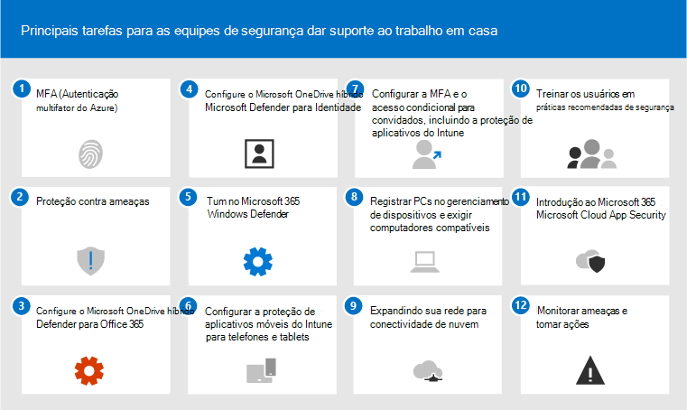
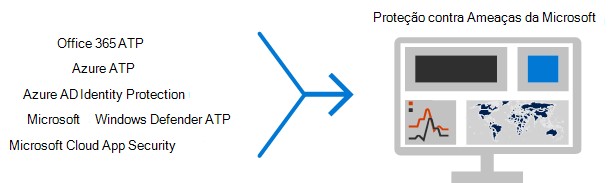

# Principais 12 tarefas para equipes de segurança para dar suporte ao trabalho em casa

Se você for como a [Microsoft](https://www.microsoft.com/microsoft-365/blog/2020/03/10/staying-productive-while-working-remotely-with-microsoft-teams/) e, de repente, estiver dando suporte a uma força de trabalho baseada principalmente em casa, queremos ajudá-lo a garantir que sua organização está funcionando com a maior segurança possível. Este artigo prioriza tarefas para ajudar as equipes de segurança a implementar os recursos de segurança mais importantes o mais rápido possível.

Se você for uma organização de pequeno ou médio porte usando um dos planos de negócios da Microsoft, consulte estes recursos em vez disso:

- [Top 10 maneiras de proteger o Office 365 e o Microsoft 365 para planos de negócios](../admin/security-and-compliance/secure-your-business-data.md)
- [Microsoft 365 for Campaigns](../campaigns/index.md) (inclui uma configuração de segurança recomendada para o Microsoft 365 Business)

Para clientes que usam nossos planos corporativos, a Microsoft recomenda que você conclua as tarefas listadas na tabela a seguir que se aplicam ao seu plano de serviço. Se, em vez de comprar um plano empresarial do Microsoft 365, você estiver combinando assinaturas, observe o seguinte:

- O Microsoft 365 E3 inclui o Enterprise Mobility + Security (EMS) E3 e o Azure AD P1
- O Microsoft 365 E5 inclui o EMS E5 e o Azure AD P2

****

|Etapa|Tarefa|Todos os planos do Office 365 Enterprise|Microsoft 365 E3|Microsoft 365 E5|
|---|---|---|---|---|
|1|[Habilitar a MFA (Autenticação Multifabilitar) do Azure AD](#1-enable-azure-ad-multi-factor-authentication-mfa)||||
|2|[Proteção contra ameaças](#2-protect-against-threats)||||
|3|[Configurar o Microsoft Defender para Office 365](#3-configure-microsoft-defender-for-office-365)||||
|4 |[Configurar o Microsoft Defender para Identidade](#4-configure-microsoft-defender-for-identity)||||
|5 |[Ativar o Microsoft 365 Defender](#5-turn-on-microsoft-365-defender)||||
|6 |[Configurar a proteção de aplicativos móveis do Intune para telefones e tablets](#6-configure-intune-mobile-app-protection-for-phones-and-tablets)||||
|7 |[Configurar o MFA e o acesso condicional para convidados, incluindo a proteção de aplicativos do Intune](#7-configure-mfa-and-conditional-access-for-guests-including-intune-mobile-app-protection)||||
|8 |[Registrar PCs no gerenciamento de dispositivos e exigir PCs compatíveis](#8-enroll-pcs-into-device-management-and-require-compliant-pcs)||||
|9 |[Otimizar sua rede para conectividade na nuvem](#9-optimize-your-network-for-cloud-connectivity)||||
|10 |[Treinar usuários](#10-train-users)||||
|11|[Introdução ao Microsoft Cloud App Security](#11-get-started-with-microsoft-cloud-app-security)||||
|12 |[Monitorar ameaças e tomar medidas](#12-monitor-for-threats-and-take-action)||||
|

Antes de começar, verifique sua Pontuação Segura do [Microsoft 365](./defender/microsoft-secure-score.md) no centro de segurança do Microsoft 365. Em um painel centralizado, você pode monitorar e melhorar a segurança de suas identidades, dados, aplicativos, dispositivos e infraestrutura do Microsoft 365. Você recebe pontos para configurar recursos de segurança recomendados, executar tarefas relacionadas à segurança (como exibir relatórios) ou endereçamento de recomendações com um aplicativo ou software de terceiros. As tarefas recomendadas neste artigo aumentarão sua pontuação.

## 1: Habilitar a autenticação multifatória do Azure AD (MFA)

A melhor coisa que você pode fazer para melhorar a segurança dos funcionários que trabalham em casa é ativar o MFA. Se você ainda não tiver processos em andamento, trate-o como piloto de emergência e certifique-se de ter pessoas de suporte prontas para ajudar os funcionários que ficam emperrados. Como você provavelmente não pode distribuir dispositivos de segurança de hardware, use a biometria do Windows Hello e aplicativos de autenticação de smartphone, como o Microsoft Authenticator.

Normalmente, a Microsoft recomenda que você dê aos usuários 14 dias para registrar seus dispositivos para Autenticação Multifatória antes de exigir mFA. No entanto, se sua força de trabalho estiver funcionando de forma repentina em casa, vá em frente e exigir a MFA como uma prioridade de segurança e esteja preparado para ajudar os usuários que precisam dela.

A aplicação dessas políticas levará apenas alguns minutos, mas esteja preparado para dar suporte aos usuários nos próximos dias.

****

|Planejar|Recomendação|
|---|---|
|Planos do Microsoft 365 (sem o Azure AD P1 ou P2)|[Habilitar os padrões de segurança no Microsoft Azure Active Directory](/azure/active-directory/fundamentals/concept-fundamentals-security-defaults). Os padrões de segurança no Microsoft Azure Active Directory incluem a MFA para usuários e administradores.|
|Microsoft 365 E3 (com o Azure AD P1)|Use [políticas de Acesso Condicional Comuns](/azure/active-directory/conditional-access/concept-conditional-access-policy-common) para configurar as seguintes políticas:  - [Exigir MFA para administradores](/azure/active-directory/conditional-access/howto-conditional-access-policy-admin-mfa)  - [Exigir MFA para todos os usuários](/azure/active-directory/conditional-access/howto-conditional-access-policy-all-users-mfa)   - [Bloquear autenticação herdada](/azure/active-directory/conditional-access/howto-conditional-access-policy-block-legacy)|
|Microsoft 365 E5 (com o Azure AD P2)|Aproveitando a Azure Active Directory Identity Protection, comece a implementar o [conjunto recomendado de acesso condicional e políticas relacionadas](./defender-365-security/identity-access-policies.md) da Microsoft, criando estas duas políticas:  - [Exigir MFA quando o risco de entrada for médio ou alto](./defender-365-security/identity-access-policies.md#require-mfa-based-on-sign-in-risk)  - [Bloquear clientes sem suporte para a autenticação moderna](./defender-365-security/identity-access-policies.md#block-clients-that-dont-support-multi-factor) - [Usuários de alto risco devem alterar a senha](./defender-365-security/identity-access-policies.md#high-risk-users-must-change-password)|
|

## 2: Proteger contra ameaças

Todos os planos do Microsoft 365 incluem uma variedade de recursos de proteção contra ameaças. O aumento da proteção para esses recursos leva apenas alguns minutos.

- Proteção antimalware
- Proteção contra URLs mal-intencionadas e arquivos
- Proteção anti-phishing
- Proteção antispam

Consulte [Proteger contra ameaças no Office 365](defender-365-security/protect-against-threats.md) para obter orientações que você pode usar como ponto de partida.

## 3: Configurar o Microsoft Defender para Office 365

O Microsoft Defender para Office 365, incluído no Microsoft 365 E5 e no Office 365 E5, protege sua organização contra ameaças mal-intencionadas colocadas por mensagens de email, links (URLs) e ferramentas de colaboração. Isso pode levar várias horas para ser configurada.

Microsoft Defender para Office 365:

- Protege sua organização contra ameaças de email desconhecidas em tempo real usando sistemas inteligentes que inspecionam anexos e links para conteúdo mal-intencionado. Esses sistemas automatizados incluem uma plataforma de detonação robusta, heurística e modelos de aprendizado de máquina.
- Protege sua organização quando os usuários colaboram e compartilham arquivos, identificando e bloqueando arquivos mal-intencionados em sites de equipe e bibliotecas de documentos.
- Aplica modelos de aprendizado de máquina e algoritmos avançados de detecção de representação para evitar ataques de phishing.

Para uma visão geral, incluindo um resumo de planos, consulte [Defender for Office 365](./defender-365-security/defender-for-office-365.md).

O Administrador Global pode configurar essas proteções:

- [Configurar políticas de Links Seguros](defender-365-security/set-up-safe-links-policies.md)
- [Configurar configurações globais para Links Seguros](defender-365-security/configure-global-settings-for-safe-links.md)
- [Configurar políticas de Anexos Seguros](defender-365-security/set-up-safe-attachments-policies.md)

Você precisará trabalhar com o administrador do Exchange Online e o administrador do SharePoint Online para configurar o Defender para o Office 365 para essas cargas de trabalho:

- [ATP para SharePoint, OneDrive e Microsoft Teams](defender-365-security/mdo-for-spo-odb-and-teams.md)

## 4: Configurar o Microsoft Defender para Identidade

O [Microsoft Defender para Identidade](/azure-advanced-threat-protection/what-is-atp) é uma solução de segurança baseada em nuvem que aproveita os sinais do Active Directory local para identificar, detectar e investigar ameaças avançadas, identidades comprometidas e ações internas mal-intencionadas direcionadas à sua organização. Concentre-se nisso em seguida porque protege sua infraestrutura na nuvem e no momento, não tem dependências ou pré-requisitos e pode fornecer benefícios imediatos.

- Consulte [Microsoft Defender for Identity Quickstarts](/azure-advanced-threat-protection/install-atp-step1) para obter a instalação rapidamente
- Assista [ao vídeo: Introdução ao Microsoft Defender para Identidade](https://www.youtube.com/watch?reload=9&v=EGY2m8yU_KE)
- Analisar as [três fases da implantação do Microsoft Defender para Identidade](/azure-advanced-threat-protection/what-is-atp#whats-next)

## 5: Ativar o Microsoft 365 Defender

Agora que você tem o Microsoft Defender para Office 365 e o Microsoft Defender para Identidade configurados, você pode exibir os sinais combinados desses recursos em um painel. O [Microsoft 365 Defender](./defender/microsoft-365-defender.md) reúne alertas, incidentes, investigação e resposta automatizadas e busca avançada entre cargas de trabalho (Microsoft Defender para Identidade, Defender para Office 365, Microsoft Defender para Ponto de Extremidade e Microsoft Cloud App Security) em um único painel no [security.microsoft.com](https://security.microsoft.com).

Depois de configurar um ou mais de seus serviços do Defender para Office 365, a turn on MTP. Novos recursos são adicionados continuamente ao MTP; considere optar por receber recursos de visualização.

- [Saiba mais sobre MTP](./defender/microsoft-365-defender.md)
- [Ativar o MTP](./defender/m365d-enable.md)
- [Optar por recursos de visualização](./defender/preview.md)

## 6: Configurar a proteção de aplicativo móvel do Intune para telefones e tablets

O Microsoft Intune Mobile Application Management (MAM) permite gerenciar e proteger os dados da sua organização em telefones e tablets sem gerenciar esses dispositivos. Veja como funciona:

- Você cria uma Política de Proteção de Aplicativo (APP) que determina quais aplicativos em um dispositivo são gerenciados e quais comportamentos são permitidos (como impedir que dados de um aplicativo gerenciado sejam copiados para um aplicativo não gerenciado). Você cria uma política para cada plataforma (iOS, Android).
- Depois de criar as políticas de proteção de aplicativos, você as impõe criando uma regra de acesso condicional no Azure AD para exigir aplicativos aprovados e proteção de dados do APP.

As políticas de proteção de APLICATIVO incluem muitas configurações. Felizmente, você não precisa aprender sobre todas as configurações e avaliar as opções. A Microsoft facilita a aplicação de uma configuração de configurações recomendando pontos de partida. A [estrutura de proteção de dados usando](/mem/intune/apps/app-protection-framework) políticas de proteção de aplicativo inclui três níveis que você pode escolher.

Melhor ainda, a Microsoft coordena essa estrutura de proteção de aplicativos com um conjunto de acesso condicional e políticas relacionadas que recomendamos que todas as organizações usem como ponto de partida. Se você implementou o MFA usando as diretrizes neste artigo, você está no meio do caminho!

Para configurar a proteção de aplicativo móvel, use as diretrizes em Políticas comuns de [identidade e acesso a dispositivos:](./defender-365-security/identity-access-policies.md)

 1. Use as [diretrizes Aplicar políticas de proteção](./defender-365-security/identity-access-policies.md#apply-app-data-protection-policies) de dados do APP para criar políticas para iOS e Android. O nível 2 (proteção de dados aprimorada) é recomendado para proteção de linha de base.
 2. Crie uma regra de acesso condicional para [Exigir aplicativos aprovados e proteção app](./defender-365-security/identity-access-policies.md#require-approved-apps-and-app-protection).

## 7: Configurar o MFA e o acesso condicional para convidados, incluindo a proteção de aplicativo móvel do Intune

Em seguida, vamos garantir que você possa continuar a colaborar e trabalhar com convidados. Se você estiver usando o plano do Microsoft 365 E3 e tiver implementado o MFA para todos os usuários, você será definido.

Se você estiver usando o plano do Microsoft 365 E5 e estiver aproveitando a Proteção de Identidade do Azure para MFA baseado em risco, precisará fazer alguns ajustes (porque a proteção de Identidade do Azure AD não se estende aos convidados):

- Crie uma nova regra de acesso condicional para exigir MFA sempre para convidados e usuários externos.
- Atualize a regra de acesso condicional MFA baseada em risco para excluir convidados e usuários externos.

Use as diretrizes em Atualizar as políticas comuns para permitir e proteger o acesso de convidados e externos para entender como o acesso de convidados funciona com o Azure AD e atualizar as políticas afetadas. 

As políticas de proteção de aplicativo móvel do Intune criadas, juntamente com a regra de acesso condicional para exigir aplicativos aprovados e proteção de APLICATIVO, se aplicam às contas de convidados e ajudarão a proteger os dados da sua organização.

> [!NOTE]
> Se você já registrou PCs no gerenciamento de dispositivos para exigir PCs compatíveis, também precisará excluir as contas de convidado da regra de acesso condicional que impõe a conformidade do dispositivo.

## 8: Registrar PCs no gerenciamento de dispositivos e exigir PCs compatíveis

Há vários métodos para registrar os dispositivos de sua força de trabalho. Cada método depende da propriedade (pessoal ou corporativa) do dispositivo, do tipo de dispositivo (iOS, Windows, Android) e dos requisitos de gerenciamento (redefinições, afinidade, bloqueio). Isso pode levar um pouco de tempo para ser resolvido. Consulte: [Registrar dispositivos no Microsoft Intune](/mem/intune/enrollment/).

A maneira mais rápida de começar é configurar o [registro automático para dispositivos Windows 10.](/mem/intune/enrollment/quickstart-setup-auto-enrollment)

Você também pode tirar proveito desses tutoriais:

- [Usar o Autopilot para registrar dispositivos Windows no Intune](/mem/intune/enrollment/tutorial-use-autopilot-enroll-devices)
- [Use os recursos de Registro de Dispositivo Corporativo da Apple no Apple Business Manager (ABM) para registrar dispositivos iOS/iPadOS no Intune](/mem/intune/enrollment/tutorial-use-device-enrollment-program-enroll-ios)

Depois de registrar dispositivos, use as diretrizes em Políticas comuns de [acesso](./defender-365-security/identity-access-policies.md) a dispositivos e identidade para criar essas políticas:

- [Definir políticas de conformidade de dispositivo](./defender-365-security/identity-access-policies.md#define-device-compliance-policies) — As configurações recomendadas para o Windows 10 incluem a necessidade de proteção antivírus. Se você tiver o Microsoft 365 E5, use o Microsoft Defender para Endpoint para monitorar a saúde dos dispositivos dos funcionários. Certifique-se de que as políticas de conformidade para outros sistemas operacionais incluem proteção antivírus e software de proteção de ponto de extremidade.
- [Exigir PCs compatíveis](./defender-365-security/identity-access-policies.md#require-compliant-pcs-but-not-compliant-phones-and-tablets) — essa é a regra de acesso condicional no Azure AD que impõe as políticas de conformidade do dispositivo.

Somente uma organização pode gerenciar um dispositivo, portanto, certifique-se de excluir as contas de convidado da regra de acesso condicional no Azure AD. Se você não excluir usuários convidados e externos de políticas que exigem conformidade com o dispositivo, essas políticas bloquearão esses usuários. Para obter mais informações, consulte [Atualizando as políticas comuns para permitir e proteger o acesso de convidados e externos.](./defender-365-security/identity-access-policies-guest-access.md)

## 9: Otimizar sua rede para conectividade na nuvem

Se você estiver habilitando rapidamente a maioria dos funcionários a trabalhar de casa, essa mudança repentina de padrões de conectividade pode ter um impacto significativo na infraestrutura de rede corporativa. Muitas redes foram dimensionada e projetadas antes da adoção dos serviços de nuvem. Em muitos casos, as redes são tolerantes a funcionários remotos, mas não foram projetadas para serem usadas remotamente por todos os usuários simultaneamente.

Elementos de rede, como concentradores VPN, equipamentos de saída de rede central (como proxies e dispositivos de prevenção contra perda de dados), largura de banda central da Internet, circuitos MPLS backhaul, funcionalidade NAT e assim por diante são colocados sob enorme pressão devido à carga de toda a empresa que os usa. O resultado final é baixo desempenho e produtividade, juntamente com uma experiência de usuário ruim para usuários que estão se adaptando ao trabalho de casa.

Algumas das proteções que tradicionalmente são fornecidas pelo roteamento de tráfego por meio de uma rede corporativa são fornecidas pelos aplicativos de nuvem que seus usuários estão acessando. Se você chegou a esta etapa neste artigo, implementou um conjunto de controles sofisticados de segurança na nuvem para serviços e dados do Microsoft 365. Com esses controles no local, você pode estar pronto para rotear o tráfego de usuários remotos diretamente para o Office 365. Se você ainda precisar de um link VPN para acesso a outros aplicativos, poderá melhorar muito o desempenho e a experiência do usuário implementando o túnel dividido. Depois que você alcançar um acordo em sua organização, isso pode ser feito em um dia por uma equipe de rede bem coordenada.

Confira esses recursos em Documentos para obter mais informações:

- [Visão geral: otimizar a conectividade para usuários remotos usando o túnel dividido de VPN](/Office365/Enterprise/office-365-vpn-split-tunnel)
- [Implementando o tunelamento dividido de VPN para Office 365](/Office365/Enterprise/office-365-vpn-implement-split-tunnel)

Artigos de blog recentes sobre este tópico:

- [Como otimizar rapidamente o tráfego para funcionários remotos & reduzir a carga em sua infraestrutura](https://techcommunity.microsoft.com/t5/office-365-blog/how-to-quickly-optimize-office-365-traffic-for-remote-staff-amp/ba-p/1214571#)
- [Maneiras alternativas para profissionais de segurança e TI alcançarem controles de segurança modernos nos cenários de trabalho remoto exclusivos de hoje](https://www.microsoft.com/security/blog/2020/03/26/alternative-security-professionals-it-achieve-modern-security-controls-todays-unique-remote-work-scenarios/)

## 10: Treinar usuários

Os usuários de treinamento podem salvar seus usuários e a equipe de operações de segurança por muito tempo e frustração. Os usuários experientes têm menos probabilidade de abrir anexos ou clicar em links em mensagens de email questionáveis, e é mais provável que eles evitem sites suspeitos.

O Manual de Campanha de [Segurança](https://go.microsoft.com/fwlink/?linkid=2015598&amp;clcid=0x409) Cibernética da Escola De Harvard Kennedy fornece excelentes diretrizes sobre como estabelecer uma forte cultura de reconhecimento de segurança em sua organização, incluindo treinamento para que os usuários identifiquem ataques de phishing.

O Microsoft 365 fornece os seguintes recursos para ajudar a informar os usuários em sua organização:

****

|Conceito|Recursos|
|---|---|
|Microsoft 365|[Caminhos de aprendizado personalizáveis](/office365/customlearning/) 
Esses recursos podem ajudá-lo a montar o treinamento para usuários finais em sua organização|
|Segurança do Microsoft 365|[Módulo de aprendizagem: proteja sua organização com segurança interna e inteligente do Microsoft 365](/learn/modules/security-with-microsoft-365) 
Este módulo permite descrever como os recursos de segurança do Microsoft 365 funcionam em conjunto e articular os benefícios desses recursos de segurança.|
|Autenticação multifator|[Verificação em duas etapas: Qual é a página de verificação adicional?](/azure/active-directory/user-help/multi-factor-authentication-end-user-first-time) 
Este artigo ajuda os usuários finais a entender o que é a autenticação multifatar e por que ela está sendo usada em sua organização.|
|

Além dessas orientações, a Microsoft recomenda que seus usuários tomem as ações descritas neste artigo: Proteger sua conta e dispositivos [contra hackers e malware.](https://support.office.com/article/066d6216-a56b-4f90-9af3-b3a1e9a327d6.aspx) Essas ações incluem:

- Usando senhas fortes
- Protegendo dispositivos
- Habilitando recursos de segurança em computadores Com Windows 10 e Mac (para dispositivos não operacionais)

A Microsoft também recomenda que os usuários protejam suas contas de email pessoais, seguindo as ações recomendadas nos seguintes artigos:

- [Ajudar a proteger sua conta Outlook.com email](https://support.microsoft.com/office/a4f20fc5-4307-4ece-8231-6d4d4bd8a9ba)

- [Proteger sua conta do Gmail com verificação em duas etapas](https://go.microsoft.com/fwlink/p/?linkid=2015688)

## 11: Começar com o Microsoft Cloud App Security

[O Microsoft Cloud App Security](/cloud-app-security) fornece visibilidade avançada, controle sobre a viagem de dados e análises sofisticadas para identificar e combater ameaças cibernéticas em todos os seus serviços de nuvem. Depois que você começa com o Cloud App Security, as políticas de detecção de anomalias são habilitadas automaticamente, mas o Cloud App Security tem um período de aprendizado inicial de sete dias durante o qual nem todos os alertas de detecção de anomalias são gerados.

Começar com o Cloud App Security agora. Mais tarde, você pode configurar controles e monitoramento mais sofisticados.

- [Início rápido: começar com o Cloud App Security](/cloud-app-security/getting-started-with-cloud-app-security)
- [Obter análise comportamental instantânea e detecção de anomalias](/cloud-app-security/anomaly-detection-policy)
- [Saiba mais sobre o Microsoft Cloud App Security](/cloud-app-security/what-is-cloud-app-security)
- [Revisar novos recursos e recursos](/cloud-app-security/release-notes)
- [Consulte instruções básicas de instalação](/cloud-app-security/general-setup)

## 12: Monitorar ameaças e tomar medidas

O Microsoft 365 inclui várias maneiras de monitorar o status e tomar as ações apropriadas. Seu melhor ponto de partida é o Centro de segurança do Microsoft 365 ( ), onde você pode exibir a Pontuação Segura da Microsoft da sua organização e quaisquer alertas ou entidades que exigem sua [https://security.microsoft.com](https://security.microsoft.com) atenção. 

- [Começar com o centro de segurança do Microsoft 365](./defender/overview-security-center.md)
- [Monitorar e exibir relatórios](./defender/overview-security-center.md)
- [Consulte os portais de segurança no Microsoft 365](./defender/portals.md)

## Próximas etapas

Parabéns! Você implementou rapidamente algumas das proteções de segurança mais importantes e sua organização é muito mais segura. Agora você está pronto para ir ainda mais longe com recursos de proteção contra ameaças (incluindo o Microsoft Defender para Ponto de Extremidade), recursos de classificação de dados e proteção e proteção de contas administrativas. Para um conjunto mais profundo e metodo de recomendações de segurança para o Microsoft 365, consulte [Microsoft 365 Security for Business Decision Makers (BDMs)](Microsoft-365-security-for-bdm.md).

Visite também o novo centro de segurança da Microsoft [docs.microsoft.com/security](/security).