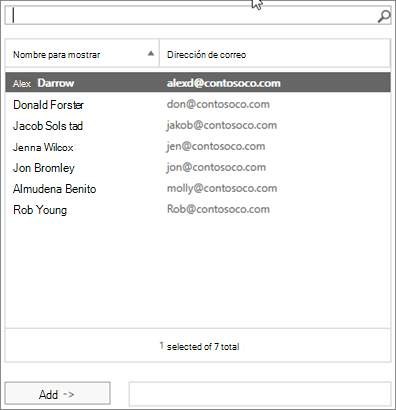

# Permitir que os membros enviem como ou enviem em nome de um grupo

Um membro de um grupo do Microsoft 365 que tenha recebido as permissões **Enviar como** ou **enviar em nome** de pode enviar emails como o grupo ou em nome do grupo. Este artigo explica como um administrador pode definir essas permissões.
  
Por exemplo, se Megan Bowen fizer parte do grupo **Training** Microsoft 365, e tiver permissões **Send** as no grupo, se ele enviar um email como o grupo, será parecido com o grupo de **treinamento** enviado por email. 
  
A permissão **enviar em nome** de permite que um usuário envie um email em nome de um grupo do Microsoft 365. Por exemplo, se Alex Wilber é parte do grupo **marketing** da Microsoft 365 e tem permissões **de enviar em nome** de e envia um email como grupo, o email parece que foi enviado por **Alex Wilber em nome de marketing**.

> [!IMPORTANT]
> Você pode configurar **Enviar como** ou **enviar em nome** de um determinado usuário, mas não ambos. Se você configurar ambos, o padrão será **Enviar como**.

> [!TIP]
> Consulte [Enviar email de ou em nome de um grupo do Microsoft 365](https://support.microsoft.com/office/0f4964af-aec6-484b-a65c-0434df8cdb6b) para saber como usar o Outlook e o Outlook na Web para enviar emails de um grupo.
    
## Permitir que os membros enviem email como um grupo

Esta seção explica como permitir que os usuários enviem emails como um grupo no [centro de administração do Exchange](https://go.microsoft.com/fwlink/p/?linkid=2059104) (Eat) no Exchange Online.
  
1. No <a href="https://go.microsoft.com/fwlink/p/?linkid=2059104" target="_blank">centro de administração do Exchange</a>, vá para grupos de **destinatários** \> **Groups**.
    
2. Selecione **Editar**  no grupo para o qual você deseja permitir que os usuários enviem.   
    
3. Selecione **delegação de grupo**.
    
4. Na seção **Enviar como** , selecione o **+** sinal para adicionar os usuários que você deseja enviar como o grupo. 
    
    
  
5. Digite para pesquisar ou selecionar um usuário da lista. Selecione **OK** e **salvar**.
    
    
  
## Permitir que os membros enviem email em nome de um grupo

Esta seção explica como permitir que os usuários enviem emails em nome de um grupo no centro de administração do Exchange (Eat) no Exchange Online.
  
1. No <a href="https://go.microsoft.com/fwlink/p/?linkid=2059104" target="_blank">centro de administração do Exchange</a>, vá para grupos de **destinatários** \> **Groups**.
    
2. Selecione **Editar**  no grupo para o qual você deseja permitir que os usuários enviem. 
    
3. Selecione **delegação de grupo**.
    
4. Na seção enviar em nome de, selecione o **+** sinal para adicionar os usuários que você deseja enviar como o grupo. 
    
    
  
5. Digite para pesquisar ou selecionar um usuário da lista. Selecione **OK** e **salvar**.
    
    

## Artigos relacionados

[Saiba mais sobre os grupos do Microsoft 365](https://support.microsoft.com/office/b565caa1-5c40-40ef-9915-60fdb2d97fa2)

[Add-RecipientPermission](https://go.microsoft.com/fwlink/p/?LinkId=723960)

[Conjunto-unificado](https://go.microsoft.com/fwlink/p/?LinkId=616189)
