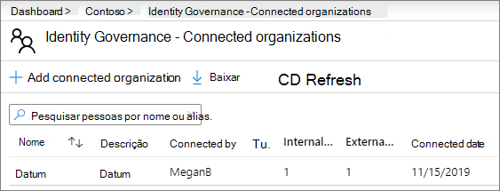
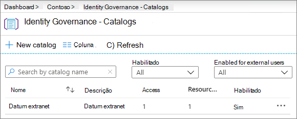
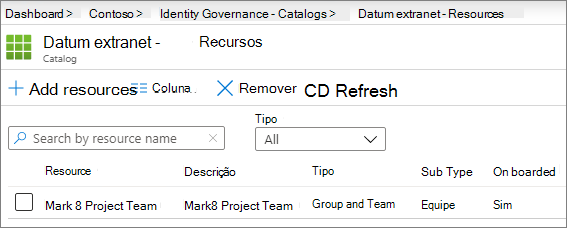
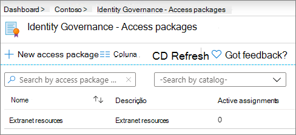
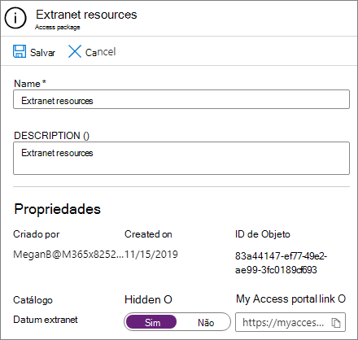
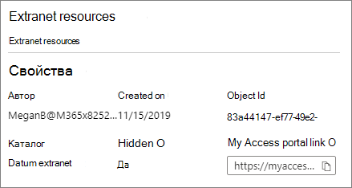

# Crie uma extranet B2B com convidados gerenciados

Você pode usar o [Gerenciamento de direitos do Azure Active Directory](https://docs.microsoft.com/azure/active-directory/governance/entitlement-management-overview) para criar uma extranet B2B para colaborar com uma organização parceira que usa o Azure Active Directory. Isso permite que os usuários se autoregistrem no site da extranet ou na equipe e recebam acesso por meio de um fluxo de trabalho de aprovação.

Com esse método de compartilhamento de recursos para colaboração, a organização de parceiros pode ajudar a manter e aprovar os usuários convidados em suas finalidades, reduzindo a carga no departamento de ti e permitindo que eles sejam mais familiarizados com o contrato de colaboração para gerenciar o acesso do usuário.

Este artigo percorre as etapas para criar um pacote de recursos (neste caso, um site ou uma equipe) que você pode compartilhar com uma organização de parceiro por meio de um modelo de registro de acesso de autoatendimento. 

Antes de começar, crie o site ou a equipe que você deseja compartilhar com a organização do parceiro e habilite-o para o compartilhamento de convidados. Consulte [colaborar com convidados em um site](collaborate-in-site.md) ou [colaborar com convidados em uma equipe](collaborate-as-team.md) para obter mais informações. Recomendamos também que você revise [criar um ambiente de compartilhamento de convidados seguro](create-secure-guest-sharing-environment.md) para obter informações sobre os recursos de segurança e conformidade que você pode usar para ajudar a manter suas políticas de governança ao colaborar com convidados.

## Demonstração de vídeo

Este vídeo demonstra os procedimentos abordados neste artigo.

> [!VIDEO https://www.microsoft.com/videoplayer/embed/RE4wKUj?autoplay=false]

## Conectar a organização de parceiro

Para convidar convidados de uma organização de parceiro, você precisa adicionar o domínio do parceiro como uma organização conectada no Azure Active Directory.

Para adicionar uma organização conectada
1. No [Azure Active Directory](https://aad.portal.azure.com), clique em **governança de identidade**.
2. Clique em **organizações conectadas**.
4. Clique em **Adicionar organização conectada**.
5. Digite um nome e uma descrição para a organização e clique em **Avançar: diretório + domínio**.
6. Clique em **Adicionar diretório + domínio**.
7. Digite o domínio da organização que você deseja conectar e clique em **Adicionar**.
8. Clique em **conectar**e, em seguida, clique em **Avançar: patrocinadores**.
9. Adicione pessoas da sua organização ou da organização à qual você está se conectando para quem deseja aprovar o acesso para usuários convidados.
10. Clique em **Avançar: revisar + criar**.
11. Revise as configurações escolhidas e clique em **criar**.

    

## Escolha os recursos para compartilhar

A primeira etapa na seleção de recursos para compartilhar com uma organização parceira é criar um catálogo para contê-los.

Para criar um catálogo
1. No [Azure Active Directory](https://aad.portal.azure.com), clique em **governança de identidade**.
2. Clique em **catálogos**.
3. Clique em **novo catálogo**.
4. Digite um nome e uma descrição para o catálogo e verifique se **habilitado** e **habilitado para usuários externos** estão definidos como **Sim**.
5. Clique em **Criar**.

   

Depois que o catálogo tiver sido criado, adicione o site do SharePoint ou a equipe que você deseja compartilhar com a organização do parceiro.

Para adicionar recursos a um catálogo
1. No Azure AD Identity Governance, clique em **catálogos**e, em seguida, clique no catálogo onde você deseja adicionar recursos.
2. Clique em **recursos** e em **Adicionar recursos**.
3. Selecione as equipes ou os sites do SharePoint que você deseja incluir na extranet e clique em **Adicionar**.

   

Depois de definir os recursos que você deseja compartilhar, a próxima etapa é criar um pacote de acesso, que define o tipo de acesso que os usuários parceiros recebem e o processo de aprovação para novos usuários parceiros que solicitarem o acesso.

Para criar um pacote de acesso
1. No Azure AD Identity Governance, clique em **catálogos**e, em seguida, clique no catálogo onde você deseja criar um pacote do Access.
2. Clique em **pacotes do Access**e, em seguida, clique em **novo pacote do Access**.
3. Digite um nome e uma descrição para o pacote do Access e, em seguida, clique em **Avançar: funções de recurso**.
4. Escolha os recursos do catálogo que você deseja usar para a extranet.
5. Para cada recurso, na coluna **função** , escolha a função de usuário que você deseja conceder aos usuários convidados que usam a extranet.
6. Clique em **Avançar: solicitações**.
7. Em **usuários que podem solicitar acesso**, escolha **os usuários que não estão no diretório**.
8. Certifique-se de que a opção **específico organizações conectadas** esteja selecionada e clique em **adicionar diretórios**.
9. Escolha a organização conectada que você adicionou anteriormente e clique em **selecionar**
10. Em **aprovação**, escolha **Sim** para **exigir aprovação**.
11. Em **primeiro aprovador**, escolha um dos patrocinadores que você adicionou anteriormente ou escolha um usuário específico.
12. Clique em **Adicionar fallback** e selecione um Aprovador de fallback.
13. Em **habilitar**, escolha **Sim**.
14. Clique em **Avançar: ciclo de vida**.
15. Escolha as configurações de análise de validade e acesso que você deseja usar e clique em **Avançar: revisar + criar**.
16. Revise suas configurações e clique em **criar**.

    

Se você estiver fazendo parcerias com uma organização de grande porte, talvez queira ocultar o pacote de acesso. Se o pacote estiver oculto, os usuários na organização do parceiro não verão o pacote no meu portal do *meu acesso* . Em vez disso, eles devem receber um link direto para inscrever-se no pacote. Ocultar o pacote do Access pode reduzir o número de solicitações de acesso inadequadas e também pode ajudar a manter os pacotes de acesso disponíveis organizados no portal da organização do parceiro.

Para definir um pacote do Access para oculto
1. No Azure AD Identity Governance, clique em **pacotes do Access**e, em seguida, clique em seu pacote do Access.
2. Na página **visão geral** , clique em **Editar**.
3. Em **Propriedades**, escolha **Sim** para **oculto**e clique em **salvar**.

   

## Convidar usuários parceiros

Se você definir o pacote do Access para oculto, precisará enviar um link direto para a organização do parceiro para que eles possam solicitar acesso ao seu site ou equipe.

Para localizar o link do portal de acesso
1. No Azure AD Identity Governance, clique em **pacotes do Access**e, em seguida, clique em seu pacote do Access.
2. Na página **visão geral** , clique em **copiar para** o link da área de transferência para o **link meu portal de acesso**.

   

Depois de copiar o link, você poderá compartilhá-lo com seu contato na organização parceira e ele poderá enviá-lo aos usuários em sua equipe de colaboração.

## Confira também

[Criar um ambiente de compartilhamento de convidados seguro](create-secure-guest-sharing-environment.md)

