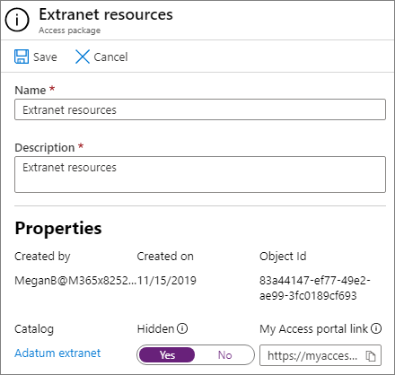

# Crie uma extranet B2B com convidados gerenciadosCreate a B2B extranet with managed guests

Você pode usar o [Gerenciamento de direitos do Azure Active Directory](https://docs.microsoft.com/azure/active-directory/governance/entitlement-management-overview) para criar uma extranet B2B para colaborar com uma organização parceira que usa o Azure Active Directory.You can use [Azure Active Directory Entitlement Management](https://docs.microsoft.com/azure/active-directory/governance/entitlement-management-overview) to create a B2B extranet to collaborate with a partner organization that uses Azure Active Directory. Isso permite que os usuários se autoregistrem no site da extranet ou na equipe e recebam acesso por meio de um fluxo de trabalho de aprovação.This allows users to self-enroll in the extranet site or team and receive access via an approval workflow.

Com esse método de compartilhamento de recursos para colaboração, a organização de parceiros pode ajudar a manter e aprovar os usuários convidados em suas finalidades, reduzindo a carga no departamento de ti e permitindo que eles sejam mais familiarizados com o contrato de colaboração para gerenciar o acesso do usuário.With this method of sharing resources for collaboration, the partner organization can help maintain and approve the guest users on their end, reducing the burden on your IT department and allowing those most familiar with the collaboration agreement to manage user access.

Este artigo percorre as etapas para criar um pacote de recursos (neste caso, um site ou uma equipe) que você pode compartilhar com uma organização de parceiro por meio de um modelo de registro de acesso de autoatendimento.This article walks through the steps to create a package of resources (in this case, a site or team) that you can share with a partner organization through a self-service access registration model. 

Antes de começar, crie o site ou a equipe que você deseja compartilhar com a organização do parceiro e habilite-o para o compartilhamento de convidados.Before you begin, create the site or team that you want to share with the partner organization and enable it for guest sharing. Consulte [colaborar com convidados em um site](collaborate-in-site.md) ou [colaborar com convidados em uma equipe](collaborate-as-team.md) para obter mais informações.See [Collaborate with guests in a site](collaborate-in-site.md) or [Collaborate with guests in a team](collaborate-as-team.md) for more information. Recomendamos também que você revise [criar um ambiente de compartilhamento de convidados seguro](create-secure-guest-sharing-environment.md) para obter informações sobre os recursos de segurança e conformidade que você pode usar para ajudar a manter suas políticas de governança ao colaborar com convidados.We also recommend that you review [Create a secure guest sharing environment](create-secure-guest-sharing-environment.md) for information about security and compliance features that you can use to help maintain your governance policies when collaborating with guests.

## Conectar a organização de parceiroConnect the partner organization

Para convidar convidados de uma organização de parceiro, você precisa adicionar o domínio do parceiro como uma organização conectada no Active Directory do Azure.In order to invite guests from a partner organization, you need to add the the partner's domain as a connected organization in Azure Active Directory.

Para adicionar uma organização conectadaTo add a connected organization
1. No [Azure Active Directory](https://aad.portal.azure.com), clique em **governança de identidade**.In [Azure Active Directory](https://aad.portal.azure.com), click **Identity Governance**.
2. Clique em **organizações conectadas**.Click **Connected organizations**.
4. Clique em **Adicionar organização conectada**.Click **Add connected organization**.
5. Digite um nome e uma descrição para a organização e clique em **Avançar: diretório + domínio**.Type a name and description for the organization, and then click **Next: Directory + domain**.
6. Clique em **Adicionar diretório + domínio**.Click **Add directory + domain**.
7. Digite o domínio da organização que você deseja conectar e clique em **Adicionar**.Type the domain for the organization that you want to connect, and then click **Add**.
8. Clique em **conectar**e, em seguida, clique em **Avançar: patrocinadores**.Click **Connect**, and then click **Next: Sponsors**.
9. Adicione pessoas da sua organização ou da organização à qual você está se conectando para quem deseja aprovar o acesso para usuários convidados.Add people from your organization or the organization that you're connecting to who you want to approve access for guest users.
10. Clique em **Avançar: revisar + criar**.Click **Next: Review + Create**.
11. Revise as configurações escolhidas e clique em **criar**.Review the settings that you've chosen and then click **Create**.

    

## Escolha os recursos para compartilharChoose the resources to share

A primeira etapa na seleção de recursos para compartilhar com uma organização parceira é criar um catálogo para contê-los.The first step in selecting resources to share with a partner organization is to create a catalog to contain them.

Para criar um catálogoTo create a catalog
1. No [Azure Active Directory](https://aad.portal.azure.com), clique em **governança de identidade**.In [Azure Active Directory](https://aad.portal.azure.com), click **Identity Governance**.
2. Clique em **catálogos**.Click **Catalogs**.
3. Clique em **novo catálogo**.Click **New catalog**.
4. Digite um nome e uma descrição para o catálogo e verifique se **habilitado** e **habilitado para usuários externos** estão definidos como **Sim**.Type a name and description for the catalog and ensure that **Enabled** and **Enabled for external users** are both set to **Yes**.
5. Clique em **Criar**.Click **Create**.

   

Depois que o catálogo tiver sido criado, adicione o site do SharePoint ou a equipe que você deseja compartilhar com a organização do parceiro.Once the catalog has been created, you add the SharePoint site or team that you want to share with the partner organization.

Para adicionar recursos a um catálogoTo add resources to a catalog
1. No Azure AD Identity Governance, clique em **catálogos**e, em seguida, clique no catálogo onde você deseja adicionar recursos.In Azure AD Identity Governance, click **Catalogs**, and then click the catalog where you want to add resources.
2. Clique em **recursos** e em **Adicionar recursos**.Click **Resources** and then click **Add resources**.
3. Selecione as equipes ou os sites do SharePoint que você deseja incluir na extranet e clique em **Adicionar**.Select the teams or SharePoint sites that you want to include in your extranet, and then click **Add**.

   

Depois de definir os recursos que você deseja compartilhar, a próxima etapa é criar um pacote de acesso, que define o tipo de acesso que os usuários parceiros recebem e o processo de aprovação para novos usuários parceiros que solicitarem o acesso.Once you've defined the resources that you want to share, the next step is to create an access package, which defines the type of access that partner users are granted and the approval process for new partner users requesting access.

Para criar um pacote de acessoTo create an access package
1. No Azure AD Identity Governance, clique em **catálogos**e, em seguida, clique no catálogo onde você deseja criar um pacote do Access.In Azure AD Identity Governance, click **Catalogs**, and then click the catalog where you want to create an access package.
2. Clique em **pacotes do Access**e, em seguida, clique em **novo pacote do Access**.Click **Access packages**, and then click **New access package**.
3. Digite um nome e uma descrição para o pacote do Access e, em seguida, clique em **Avançar: funções de recurso**.Type a name and description for the access package, and then click **Next: Resource roles**.
4. Escolha os recursos do catálogo que você deseja usar para a extranet.Choose the resources from the catalog that you want to use for your extranet.
5. Para cada recurso, na coluna **função** , escolha a função de usuário que você deseja conceder aos usuários convidados que usam a extranet.For each resource, in the **Role** column, choose the user role you want to grant to the guest users who use the extranet.
6. Clique em **Avançar: solicitações**.Click **Next: Requests**.
7. Em **usuários que podem solicitar acesso**, escolha **os usuários que não estão no diretório**.Under **Users who can request access**, choose **For users not in your directory**.
8. Certifique-se de que a opção **específico organizações conectadas** esteja selecionada e clique em **adicionar diretórios**.Ensure that the **Specific connected organizations** option is selected, and then click **Add directories**.
9. Escolha a organização conectada que você adicionou anteriormente e clique em **selecionar**Choose the connected organization that you add earlier, and then click **Select**
10. Em **aprovação**, escolha **Sim** para **exigir aprovação**.Under **Approval**, choose **Yes** for **Require approval**.
11. Em **primeiro aprovador**, escolha um dos patrocinadores que você adicionou anteriormente ou escolha um usuário específico.Under **First approver**, choose one of the sponsors that you added earlier or choose a specific user.
12. Clique em **Adicionar fallback** e selecione um Aprovador de fallback.Click **Add fallback** and select a fallback approver.
13. Em **habilitar**, escolha **Sim**.Under **Enable**, choose **Yes**.
14. Clique em **Avançar: ciclo de vida**.Click **Next: Lifecycle**.
15. Escolha as configurações de análise de validade e acesso que você deseja usar e clique em **Avançar: revisar + criar**.Choose the expiration and access review settings that you want to use, and then click **Next: Review + Create**.
16. Revise suas configurações e clique em **criar**.Review your settings, and then click **Create**.

    

Se você estiver fazendo parcerias com uma organização de grande porte, talvez queira ocultar o pacote de acesso.If you're partnering with a large organization, you may want to hide the access package. Se o pacote estiver oculto, os usuários na organização do parceiro não verão o pacote no meu portal do *meu acesso* .If the package is hidden, then users in the partner organization will not see the package on their *My Access* portal. Em vez disso, eles devem receber um link direto para inscrever-se no pacote.Instead, they must be sent a direct link to sign up for the package. Ocultar o pacote do Access pode reduzir o número de solicitações de acesso inadequadas e também pode ajudar a manter os pacotes de acesso disponíveis organizados no portal da organização do parceiro.Hiding the access package can reduce the number of inappropriate access requests and can also help keep available access packages organized in the partner organization's portal.

Para definir um pacote do Access para ocultoTo set an access package to hidden
1. No Azure AD Identity Governance, clique em **pacotes do Access**e, em seguida, clique em seu pacote do Access.In Azure AD Identity Governance, click **Access packages**, and then click your access package.
2. Na página **visão geral** , clique em **Editar**.On the **Overview** page, click **Edit**.
3. Em **Propriedades**, escolha **Sim** para **oculto**e clique em **salvar**.Under **Properties**, choose **Yes** for **Hidden**, and then click **Save**.

   

## Convidar usuários parceirosInvite partner users

Se você definir o pacote do Access para oculto, precisará enviar um link direto para a organização do parceiro para que eles possam solicitar acesso ao seu site ou equipe.If you set the access package to hidden, you need to send a direct link to the partner organization so that they can request access to your site or team.

Para localizar o link do portal de acessoTo find the access portal link
1. No Azure AD Identity Governance, clique em **pacotes do Access**e, em seguida, clique em seu pacote do Access.In Azure AD Identity Governance, click **Access packages**, and then click your access package.
2. Na página **visão geral** , clique em **copiar para** o link da área de transferência para o **link meu portal de acesso**.On the **Overview** page, click **Copy to clipboard** link for the **My Access portal link**.

   

Depois de copiar o link, você poderá compartilhá-lo com seu contato na organização parceira e ele poderá enviá-lo aos usuários em sua equipe de colaboração.Once you have copied the link, you can share it with your contact at the partner organization and they can send it to the users on their collaboration team.

## Confira tambémSee Also

[Criar um ambiente seguro de compartilhamento para convidadosCreate a secure guest sharing environment](create-secure-guest-sharing-environment.md)

