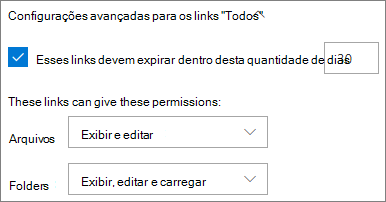
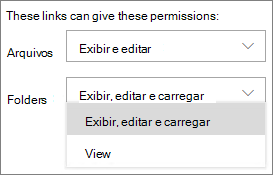
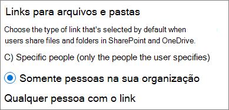
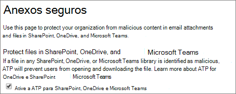
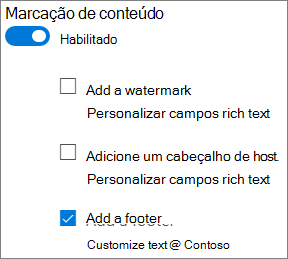

# Práticas recomendadas para compartilhar arquivos e pastas com usuários não autenticados

O compartilhamento não autenticado (links de *Qualquer pessoa*) pode ser conveniente e útil em vários cenários. *Qualquer pessoa* a maneira mais fácil de compartilhar é usando links: as pessoas podem abrir o link sem autenticação e podem repassar para outras pessoas.

Geralmente nem todo conteúdo de uma organização é apropriado para o compartilhamento não autenticado. Este artigo aborda as opções disponíveis para ajudá-lo a criar um ambiente no qual os usuários podem compartilhar arquivos e pastas não autenticados, mas com proteções para ajudar a proteger o conteúdo da sua organização.

> [!NOTE]
> Para que o compartilhamento não autenticado funcione, habilite-o para a sua organização e para a equipe ou site individual que irão usá-lo. Confira [Colaborar com pessoas de fora da sua organização](collaborate-with-people-outside-your-organization.md) para ver o cenário que você deseja habilitar.

## Definir uma data de vencimento para links de Qualquer pessoa

Os arquivos geralmente são armazenados em sites, grupos e equipes por longos períodos de tempo. Às vezes existem políticas de retenção de dados que exigem a retenção dos arquivos por anos. Se esses arquivos forem compartilhados com pessoal não autorizado, é possível que ocorra algum acesso inesperado ou alterações nos arquivos futuramente. Para reduzir essa possibilidade, você pode configurar um tempo de expiração para os links de *Qualquer pessoa*.

Quando o link de *Qualquer pessoa* expira, não pode mais ser usado para acessar o conteúdo.

Para definir uma data de vencimento para links de Qualquer pessoa
1. Abra o Centro de administração do SharePoint Online.
2. Na barra de navegação esquerda, clique em **Compartilhamento**.
3. Em **Escolha as opções de expiração e permissões para todos os links**, marque a caixa de seleção **Estes links devem expirar dentro de vários dias**. 
   
4. Digite o número de dias na caixa e clique em **Salvar**.

Observe que, depois que um link de *Qualquer pessoa* expira, é possível compartilhar novamente o arquivo ou pasta com um novo link de *Qualquer pessoa*.

Você pode definir a expiração de *Qualquer* link para um site específico ou para o OneDrive usando [Set-SPOSite](https://docs.microsoft.com/powershell/module/sharepoint-online/set-sposite).

## Definir permissões de link

Por padrão, os links *Qualquer pessoa* de um arquivo permitem que as pessoas editem esse arquivo e os links de *Qualquer pessoa* para uma pasta permitem que as pessoas editem e visualizem arquivos, e carreguem novos arquivos para a pasta. Você pode alterar essas permissões para arquivos e pastas, independentemente de serem somente leitura.

Caso queira permitir o compartilhamento não autenticado, mas esteja preocupado com a possibilidade de que usuários não autenticados modifiquem o conteúdo da sua organização, considere definir as permissões de arquivos e pastas como **Exibir**.

Definir permissões para links de Qualquer pessoa
1. Abra o Centro de administração do SharePoint Online.
2. Na barra de navegação esquerda, clique em **Compartilhamento**.
3. Em **Configurações avançadas para links de "Qualquer pessoa"**, selecione as permissões dos arquivos e pastas que você deseja usar. 
   

Com os links de *Qualquer pessoa* definidos como **Exibir**, os usuários ainda podem compartilhar arquivos e pastas com convidados e conceder permissões de edição usando os links para *Pessoas específicas*. Esses links exigem que as pessoas de fora da sua organização se autentiquem como convidados, você pode controlar e auditar as atividades dos convidados em arquivos e pastas compartilhadas por esses links.

## Definir o tipo de link padrão para funcionar apenas para pessoas em sua organização

Quando o compartilhamento *Qualquer pessoa* está habilitado para a sua organização, o link de compartilhamento padrão costuma ser definido como **Qualquer pessoa**. Embora isso possa ser conveniente para os usuários, poderá aumentar o risco de compartilhamento não autenticado e sem intenção. Se um usuário se esquecer de alterar o tipo de link ao compartilhar um documento confidencial, poderá criar acidentalmente um link de compartilhamento que não exige autenticação.

Você pode atenuar esse risco alterando a configuração de link padrão de um determinado link para que só funcione para pessoas da sua organização. Os usuários que queiram compartilhar com pessoas não autenticadas teriam que selecionar especificamente essa opção.

Para definir o link padrão de compartilhamento de arquivos e pastas
1. No centro de administração do SharePoint, na navegação à esquerda, clique em **Compartilhamento**.
2. Em **Links de arquivos e pastas**, selecione **Somente as pessoas da sua organização**. 
   
3. Clique em **Salvar**

## Proteção contra arquivos mal-intencionados

Ao permitir que os usuários anônimos carreguem arquivos, você aumenta o risco de que alguém carregue um arquivo mal-intencionado. No Microsoft 365, é possível usar o recurso *anexos seguros* na Proteção Avançada contra Ameaças para verificar automaticamente os arquivos carregados e colocar em quarentena os arquivos que não sejam seguros.

Para ativar os anexos seguros
1. Abra o centro de administração da [Segurança da Microsoft 365](https://security.microsoft.com).
2. Na barra de navegação esquerda, clique em **Políticas**.
3. Em **Proteção contra ameaças**, clique em **Anexos Seguros da ATP (Office 365)**.
4. Marque a caixa de seleção **Ativar a ATP para SharePoint, OneDrive e Microsoft Teams** e clique em **Salvar**. 
   

## Adicionar informações de direitos autorais aos seus arquivos

Se você usa rótulos de confidencialidade no Centro de administração de conformidade da Microsoft 365, é possível configurar seus rótulos para adicionar automaticamente uma marca d'água, um cabeçalho ou rodapé aos documentos do Office da sua organização. Dessa forma, você pode verificar se os arquivos compartilhados contêm direitos autorais ou outras informações de propriedade.

Para adicionar um rodapé a um arquivo rotulado
1. Abra o [centro de conformidade do Microsoft 365](https://compliance.microsoft.com).
2. Na barra de navegação à esquerda, em **Classificação**, clique em **Rótulos de confidencialidade**.
3. Clique no rótulo ao qual você deseja adicionar um rodapé e clique em **Editar rótulo**.
4. Clique na guia **Marcação de conteúdo** para **Ativar** a marcação de conteúdo.
5. Marque a caixa de seleção da seção que você deseja adicionar e clique em **Personalizar texto**.
6. Digite o texto a adicionar aos seus documentos, selecione as opções de texto desejadas e clique em **Salvar**. 
   
7. Clique em **Salvar** e em **Fechar**.

Com a marcação de conteúdo habilitada para o rótulo, o texto que você especificou será adicionado aos documentos do Office quando um usuário aplicar esse rótulo.

## Confira também

[Visão geral de rótulos de confidencialidade](https://docs.microsoft.com/Office365/SecurityCompliance/sensitivity-labels)

[Limitar a exposição acidental dos arquivos ao compartilhar com convidados](share-limit-accidental-exposure.md)

[Criar um ambiente seguro de compartilhamento para convidados](create-secure-guest-sharing-environment.md)
