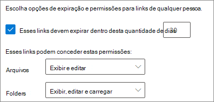

# Práticas recomendadas para compartilhar arquivos e pastas com usuários não autenticadosBest practices for sharing files and folders with unauthenticated users

O compartilhamento não autenticado (links de *Qualquer pessoa* ) pode ser conveniente e útil em vários cenários.Unauthenticated sharing ( *Anyone* links) can be convenient and is useful in various scenarios. *Qualquer pessoa* a maneira mais fácil de compartilhar é usando links: as pessoas podem abrir o link sem autenticação e podem repassar para outras pessoas.*Anyone* links are the easiest way to share: people can open the link without authentication and are free to pass it on to others.

Geralmente nem todo conteúdo de uma organização é apropriado para o compartilhamento não autenticado.Usually, not all content in an organization is appropriate for unauthenticated sharing. Este artigo aborda as opções disponíveis para ajudá-lo a criar um ambiente no qual os usuários podem compartilhar arquivos e pastas não autenticados, mas com proteções para ajudar a proteger o conteúdo da sua organização.This article covers the options available to help you create an environment where your users can use unauthenticated sharing of files and folders, but where there are safeguards in place to help protect your organization's content.

> [!NOTE]
> Para que o compartilhamento não autenticado funcione, habilite-o para a sua organização e para a equipe ou site individual que irão usá-lo.For unauthenticated sharing to work, you must enable it for your organization and for the individual site or team that you'll be using. Confira [Colaborar com pessoas de fora da sua organização](collaborate-with-people-outside-your-organization.md) para ver o cenário que você deseja habilitar.See [Collaborating with people outside your organization](collaborate-with-people-outside-your-organization.md) for the scenario that you want to enable.

## Definir uma data de vencimento para links de Qualquer pessoaSet an expiration date for Anyone links

Os arquivos geralmente são armazenados em sites, grupos e equipes por longos períodos de tempo.Files are often stored in sites, groups, and teams for long periods of time. Às vezes existem políticas de retenção de dados que exigem a retenção dos arquivos por anos.Occasionally there are data retention policies that require files to be retained for years. Se esses arquivos forem compartilhados com pessoal não autorizado, é possível que ocorra algum acesso inesperado ou alterações nos arquivos futuramente.If such files are shared with unauthenticated people, this could lead to unexpected access and changes to files in the future. Para reduzir essa possibilidade, você pode configurar um tempo de expiração para os links de *Qualquer pessoa*.To mitigate this possibility, you can configure an expiration time for *Anyone* links.

Quando o link de *Qualquer pessoa* expira, não pode mais ser usado para acessar o conteúdo.Once an *Anyone* link expires, it can no longer be used to access content.

Para definir uma data de validade para links de Qualquer Pessoa em toda a organizaçãoTo set an expiration date for Anyone links across the organization

1. Abra o [Centro de administração do SharePoint](https://admin.microsoft.com/sharepoint).Open the [SharePoint admin center](https://admin.microsoft.com/sharepoint).
2. Na barra de navegação esquerda, clique em **Compartilhamento**.In the left navigation, click **Sharing**.
3. Em **Escolha as opções de expiração e permissões para todos os links** , marque a caixa de seleção **Estes links devem expirar dentro de vários dias**.Under **Choose expiration and permissions options for Anyone links** , select the **These links must expire within this many days** check box. 
   
4. Digite o número de dias na caixa e clique em **Salvar**.Type a number of days in the box, and then click **Save**.

Para definir uma data de validade para links de Qualquer Pessoa em um site específicoTo set an expiration date for Anyone links on a specific site

1. Abra o [Centro de administração do SharePoint](https://admin.microsoft.com/sharepoint).Open the [SharePoint admin center](https://admin.microsoft.com/sharepoint).
2. No painel de navegação esquerdo, expanda **Sites** e clique em **Sites ativos**.In the left navigation, expand **Sites** , and then click **Active sites**.
3. Selecione o site que deseja alterar e clique em **Compartilhamento**.Select the site you want to change, and then click **Sharing**.
4. Em **Configurações avançadas para links de Qualquer Pessoa** , em **Vencimento de links de Qualquer pessoa** , desmarque a caixa de seleção **Igual à configuração de nível da organização**.Under **Advanced settings for Anyone links** , under **Expiration of Anyone links** , clear the **Same as organization-level setting** check box. 
   
5. Selecione a opção **Estes links devem expirar dentro deste número de dias** e digite um número de dias na caixa.Select the **These links must expire within this many days** option, and type a number of days in the box.
6. Clique em **Salvar**.Click **Save**.

Observe que, quando um link de *Qualquer pessoa* expira, o arquivo ou pasta pode ser compartilhado novamente com um novo link de *Qualquer Pessoa*.Note that once an *Anyone* link expires, the file or folder can be re-shared with a new *Anyone* link.

Você pode definir a validade do link de *Qualquer Pessoa* para um OneDrive específico usando [Definir SPOSite](https://docs.microsoft.com/powershell/module/sharepoint-online/set-sposite).You can set *Anyone* link expiration for a specific OneDrive by using [Set-SPOSite](https://docs.microsoft.com/powershell/module/sharepoint-online/set-sposite).

## Definir permissões de linkSet link permissions

Por padrão, os links *Qualquer pessoa* de um arquivo permitem que as pessoas editem esse arquivo e os links de *Qualquer pessoa* para uma pasta permitem que as pessoas editem e visualizem arquivos, e carreguem novos arquivos para a pasta.By default, *Anyone* links for a file allow people to edit the file, and *Anyone* links for a folder allow people to edit and view files, and upload new files to the folder. Você pode alterar essas permissões para arquivos e pastas, independentemente de serem somente leitura.You can change these permissions for files and for folders independently to view-only.

Caso queira permitir o compartilhamento não autenticado, mas esteja preocupado com a possibilidade de que usuários não autenticados modifiquem o conteúdo da sua organização, considere definir as permissões de arquivos e pastas como **Exibir**.If you want to allow unauthenticated sharing, but are concerned about unauthenticated people modifying your organization's content, consider setting the file and folder permissions to **View**.

Para definir permissões para links de Qualquer Pessoa em toda a organizaçãoTo set permissions for Anyone links across the organization

1. Abra o [Centro de administração do SharePoint](https://admin.microsoft.com/sharepoint).Open the [SharePoint admin center](https://admin.microsoft.com/sharepoint).
2. Na barra de navegação esquerda, clique em **Compartilhamento**.In the left navigation, click **Sharing**.
3. Em **Configurações avançadas para links de "Qualquer pessoa"** , selecione as permissões dos arquivos e pastas que você deseja usar.Under **Advanced settings for "Anyone" links** , select the file and folder permissions that you want to use. 
   

Com os links de *Qualquer pessoa* definidos como **Exibir** , os usuários ainda podem compartilhar arquivos e pastas com convidados e conceder permissões de edição usando os links para *Pessoas específicas*.With *Anyone* links set to **View** , users can still share files and folders with guests and give them edit permissions by using *Specific people* links. Esses links exigem que as pessoas de fora da sua organização se autentiquem como convidados, você pode controlar e auditar as atividades dos convidados em arquivos e pastas compartilhadas por esses links.These links require people outside your organization to authenticate as guests, and you can track and audit guest activity on files and folders shared with these links.

## Definir o tipo de link padrão para funcionar apenas para pessoas em sua organizaçãoSet default link type to only work for people in your organization

Quando o compartilhamento *Qualquer pessoa* está habilitado para a sua organização, o link de compartilhamento padrão costuma ser definido como **Qualquer pessoa**.When *Anyone* sharing is enabled for your organization, the default sharing link is normally set to **Anyone**. Embora isso possa ser conveniente para os usuários, poderá aumentar o risco de compartilhamento não autenticado e sem intenção.While this can be convenient for users, it can increase the risk of unintentional unauthenticated sharing. Se um usuário se esquecer de alterar o tipo de link ao compartilhar um documento confidencial, poderá criar acidentalmente um link de compartilhamento que não exige autenticação.If a user forgets to change the link type while sharing a sensitive document, they might accidentally create a sharing link that doesn't require authentication.

Você pode atenuar esse risco alterando a configuração de link padrão de um determinado link para que só funcione para pessoas da sua organização.You can mitigate this risk by changing the default link setting to a link that only works for people inside your organization. Os usuários que queiram compartilhar com pessoas não autenticadas teriam que selecionar especificamente essa opção.Users who want to share with unauthenticated people would then have to specifically select that option.

Para definir o link padrão de compartilhamento de arquivos e pastas para a organizaçãoTo set the default file and folder sharing link for the organization
1. Abra o [Centro de administração do SharePoint](https://admin.microsoft.com/sharepoint).Open the [SharePoint admin center](https://admin.microsoft.com/sharepoint).
2. No painel de navegação esquerdo, clique em **Compartilhamento**.In the left navigation, click **Sharing**.
3. Em **Links de arquivo e pasta** , selecione **Somente pessoas em sua organização**.Under **File and folder links** , select **Only people in your organization**.

   

4. Clique em **Salvar**Click **Save**

Para definir o link padrão de compartilhamento de arquivos e pastas para um site específicoTo set the default file and folder sharing link for a specific site
1. Abra o [Centro de administração do SharePoint](https://admin.microsoft.com/sharepoint).Open the [SharePoint admin center](https://admin.microsoft.com/sharepoint).
2. No painel de navegação esquerdo, expanda **Sites** e clique em **Sites ativos**.In the left navigation, expand **Sites** , and then click **Active sites**.
3. Selecione o site que deseja alterar e clique em **Compartilhamento**.Select the site you want to change, and then click **Sharing**.
4. Em **Tipo de link de compartilhamento padrão** ,  desmarque a caixa de seleção **Igual à configuração no nível da organização**.Under **Default sharing link type** ,  clear the **Same as organization-level setting** check box.

   

5. Selecione a opção **Somente pessoas em sua organização** e clique em **Salvar**.Select the **Only people in your organization** option and click **Save**.

## Impedir o compartilhamento não autenticado de conteúdo confidencialPrevent unauthenticated sharing of sensitive content

Você pode usar a [prevenção contra perda de dados (DLP)](https://docs.microsoft.com/microsoft-365/compliance/data-loss-prevention-policies) para impedir o compartilhamento não autenticado de conteúdo confidencial.You can use [data loss prevention (DLP)](https://docs.microsoft.com/microsoft-365/compliance/data-loss-prevention-policies) to prevent unauthenticated sharing of sensitive content. A prevenção contra perda de dados pode agir com base no rótulo de confidencialidade de um arquivo, rótulo de retenção ou informações confidenciais no próprio arquivo.Data loss prevention can take action based on a file's sensitivity label, retention label, or sensitive information in the file itself.

Para criar uma regra DLPTo create a DLP rule
1. No centro de administração de conformidade do Microsoft 365, vá até a [página de prevenção contra perda de dados](https://compliance.microsoft.com/datalossprevention).In the Microsoft 365 compliance admin center, go to the [Data loss prevention page](https://compliance.microsoft.com/datalossprevention).
2. Clique em **Criar política**.Click **Create policy**.
3. Escolha **Personalizado** e clique em **Avançar**.Choose **Custom** and click **Next**.
4. Digite um nome para a política e clique em **Avançar**.Type a name for the policy and click **Next**.
5. Na página **Locais para aplicar a política** , desative todas as configurações, exceto **sites do Microsoft Office SharePoint Online** e **contas do OneDrive** e clique em **Avançar**.On the **Locations to apply the policy** page turn off all settings except **SharePoint sites** and **OneDrive accounts** , and then click **Next**.
6. Na página **Definir configurações de política** , clique em **Avançar**.On the **Define policy settings** page, click **Next**.
7. Na página **Personalizar regras DLP avançadas** , clique em **Criar regra** e digite um nome para a regra.On the **Customize advanced DLP rules** page, click **Create rule** and type a name for the rule.
8. Em **Condições** , clique em **Adicionar condição** e escolha **O conteúdo contém**.Under **Conditions** , click **Add condition** , and choose **Content contains**.
9. Clique em **Adicionar** e escolha o tipo de informação para a qual deseja impedir o compartilhamento não autenticado.Click **Add** and choose the type of information for which you want to prevent unauthenticated sharing.

   

10. Em **Ações** , clique em **Adicionar uma ação** e escolha **Restringir o acesso ou criptografar o conteúdo em locais do Microsoft 365**.Under **Actions** click **Add an action** and choose **Restrict access or encrypt the content in Microsoft 365 locations**.
11. Marque a caixa de seleção **Restringir o acesso ou criptografar o conteúdo em locais do Microsoft 365** e escolha **Somente as pessoas que tiveram acesso ao conteúdo por meio das opções "Qualquer pessoa com o link"**.Select the **Restrict access or encrypt the content in Microsoft 365 locations** check box and then choose the **Only people who were given access to the content through the "Anyone withe the link" options** option.

      

12. Clique em **Salvar** e em **Avançar**.Click **Save** and then click **Next**.
13. Escolha suas opções de teste e clique em **Avançar**.Choose your test options and click **Next**.
14. Clique em **Enviar** e, a seguir, clique em **Concluído**.Click **Submit** , and then click **Done**.

## Proteção contra arquivos mal-intencionadosProtect against malicious files

Ao permitir que os usuários anônimos carreguem arquivos, você aumenta o risco de que alguém carregue um arquivo mal-intencionado.When you allow anonymous users to upload files, you're at an increased risk of someone uploading a malicious file. No Microsoft 365, você pode usar o recurso *Anexos Seguros* no Defender para Office 365 para examinar automaticamente os arquivos carregados e os arquivos de quarentena considerados inseguros.In Microsoft 365, you can use the *Safe Attachments* feature in Defender for Office 365 to automatically scan uploaded files and quarantine files that are found to be unsafe.

Para ativar anexos segurosTo turn on safe attachments
1. Abra a [página Anexos Seguros ATP](https://protection.office.com/safeattachmentv2) no centro de administração de segurança e conformidade.Open the [ATP Safe Attachments page](https://protection.office.com/safeattachmentv2) in the Security and Compliance admin center.
2. Clique em **Configurações globais**.Click **Global settings**.
3. Ligue o ATP para SharePoint, OneDrive e Microsoft Teams.Turn on ATP for SharePoint, OneDrive, and Microsoft Teams.

   

4. Opcionalmente, ative também Documentos Seguros e clique em **Salvar**Optionally turn on Safe Documents as well, and then click **Save**

Consulte [ATP para SharePoint, OneDrive e Microsoft Teams](https://docs.microsoft.com/microsoft-365/security/office-365-security/atp-for-spo-odb-and-teams) e [Ativar o ATP para SharePoint, OneDrive e Microsoft Teams](https://docs.microsoft.com/microsoft-365/security/office-365-security/turn-on-atp-for-spo-odb-and-teams) para obter orientações adicionais.See [ATP for SharePoint, OneDrive, and Microsoft Teams](https://docs.microsoft.com/microsoft-365/security/office-365-security/atp-for-spo-odb-and-teams) and [Turn on ATP for SharePoint, OneDrive, and Microsoft Teams](https://docs.microsoft.com/microsoft-365/security/office-365-security/turn-on-atp-for-spo-odb-and-teams) for additional guidance.

## Adicionar informações de direitos autorais aos seus arquivosAdd copyright information to your files

Se você usa rótulos de confidencialidade no Centro de administração de conformidade da Microsoft 365, é possível configurar seus rótulos para adicionar automaticamente uma marca d'água, um cabeçalho ou rodapé aos documentos do Office da sua organização.If you use sensitivity labels in the Microsoft 365 Compliance admin center, you can configure your labels to add a watermark or a header or footer automatically to your organization's Office documents. Dessa forma, você pode verificar se os arquivos compartilhados contêm direitos autorais ou outras informações de propriedade.In this way, you can make sure that shared files contain copyright or other ownership information.

Para adicionar um rodapé a um arquivo rotuladoTo add a footer to a labeled file

1. Abra o [centro de conformidade do Microsoft 365](https://compliance.microsoft.com).Open the [Microsoft 365 compliance admin center](https://compliance.microsoft.com).
2. No painel de navegação esquerdo, em **Soluções** , clique em **Proteção de informações**.In the left navigation, under **Solutions** , click **Information protection**.
3. Clique no rótulo ao qual deseja adicionar um rodapé e, a seguir, clique em **Editar rótulo**.Click the label that you want to have add a footer, and then click **Edit label**.
4. Clique em **Avançar** para chegar à guia **Marcação de conteúdo** e ative a marcação de conteúdo **Ativado**.Click **Next** to reach the **Content marking** tab, and then turn **On** content marking.
5. Marque a caixa de seleção da seção que você deseja adicionar e clique em **Personalizar texto**.Select the check box for the type of text you want to add, and then click **Customize text**.
6. Digite o texto a adicionar aos seus documentos, selecione as opções de texto desejadas e clique em **Salvar**.Type the text that you want added to your documents, select the text options that you want, and then click **Save**. 
   
7. Clique em **Avançar** para chegar ao final do assistente e clique em **Salvar rótulo**.Click **Next** to reach the end of the wizard, and then click **Save label**.

Com a marcação de conteúdo habilitada para o rótulo, o texto que você especificou será adicionado aos documentos do Office quando um usuário aplicar esse rótulo.With content marking enabled for the label, the text you specified will be added to Office documents when a user applies that label.

## Confira tambémSee Also

[Visão geral de rótulos de confidencialidadeOverview of sensitivity labels](https://docs.microsoft.com/Office365/SecurityCompliance/sensitivity-labels)

[Limitar a exposição acidental dos arquivos ao compartilhar com convidadosLimit accidental exposure to files when sharing with guests](share-limit-accidental-exposure.md)

[Criar um ambiente seguro de compartilhamento para convidadosCreate a secure guest sharing environment](create-secure-guest-sharing-environment.md)
