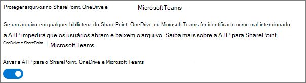

# Práticas recomendadas para compartilhar arquivos e pastas com usuários não autenticados

O compartilhamento não autenticado (links de *Qualquer pessoa*) pode ser conveniente e útil em vários cenários. *Qualquer pessoa* a maneira mais fácil de compartilhar é usando links: as pessoas podem abrir o link sem autenticação e podem repassar para outras pessoas.

Geralmente nem todo conteúdo de uma organização é apropriado para o compartilhamento não autenticado. Este artigo aborda as opções disponíveis para ajudá-lo a criar um ambiente no qual os usuários podem compartilhar arquivos e pastas não autenticados, mas com proteções para ajudar a proteger o conteúdo da sua organização.

> [!NOTE]
> Para que o compartilhamento não autenticado funcione, habilite-o para a sua organização e para a equipe ou site individual que irão usá-lo. Confira [Colaborar com pessoas de fora da sua organização](collaborate-with-people-outside-your-organization.md) para ver o cenário que você deseja habilitar.

## Definir uma data de vencimento para links de Qualquer pessoa

Os arquivos geralmente são armazenados em sites, grupos e equipes por longos períodos de tempo. Às vezes existem políticas de retenção de dados que exigem a retenção dos arquivos por anos. Se esses arquivos forem compartilhados com pessoal não autorizado, é possível que ocorra algum acesso inesperado ou alterações nos arquivos futuramente. Para reduzir essa possibilidade, você pode configurar um tempo de expiração para os links de *Qualquer pessoa*.

Quando o link de *Qualquer pessoa* expira, não pode mais ser usado para acessar o conteúdo.

Para definir uma data de validade para links de Qualquer Pessoa em toda a organização

1. Abra o [Centro de administração do SharePoint](https://admin.microsoft.com/sharepoint).
2. Na barra de navegação esquerda, clique em **Compartilhamento**.
3. Em **Escolha as opções de expiração e permissões para todos os links**, marque a caixa de seleção **Estes links devem expirar dentro de vários dias**. 
   
4. Digite o número de dias na caixa e clique em **Salvar**.

Para definir uma data de validade para links de Qualquer Pessoa em um site específico

1. Abra o [Centro de administração do SharePoint](https://admin.microsoft.com/sharepoint).
2. No painel de navegação esquerdo, expanda **Sites** e clique em **Sites ativos**.
3. Selecione o site que deseja alterar e clique em **Compartilhamento**.
4. Em **Configurações avançadas para links de Qualquer Pessoa**, em **Vencimento de links de Qualquer pessoa**, desmarque a caixa de seleção **Igual à configuração de nível da organização**. 
   
5. Selecione a opção **Estes links devem expirar dentro deste número de dias** e digite um número de dias na caixa.
6. Clique em **Salvar**.

Observe que, quando um link de *Qualquer pessoa* expira, o arquivo ou pasta pode ser compartilhado novamente com um novo link de *Qualquer Pessoa*.

Você pode definir a validade do link de *Qualquer Pessoa* para um OneDrive específico usando [Definir SPOSite](/powershell/module/sharepoint-online/set-sposite).

## Definir permissões de link

Por padrão, os links *Qualquer pessoa* de um arquivo permitem que as pessoas editem esse arquivo e os links de *Qualquer pessoa* para uma pasta permitem que as pessoas editem e visualizem arquivos, e carreguem novos arquivos para a pasta. Você pode alterar essas permissões para arquivos e pastas, independentemente de serem somente leitura.

Caso queira permitir o compartilhamento não autenticado, mas esteja preocupado com a possibilidade de que usuários não autenticados modifiquem o conteúdo da sua organização, considere definir as permissões de arquivos e pastas como **Exibir**.

Para definir permissões para links de Qualquer Pessoa em toda a organização

1. Abra o [Centro de administração do SharePoint](https://admin.microsoft.com/sharepoint).
2. Na barra de navegação esquerda, clique em **Compartilhamento**.
3. Em **Configurações avançadas para links de "Qualquer pessoa"**, selecione as permissões dos arquivos e pastas que você deseja usar. 
   

Com os links de *Qualquer pessoa* definidos como **Exibir**, os usuários ainda podem compartilhar arquivos e pastas com convidados e conceder permissões de edição usando os links para *Pessoas específicas*. Esses links exigem que as pessoas de fora da sua organização se autentiquem como convidados, você pode controlar e auditar as atividades dos convidados em arquivos e pastas compartilhadas por esses links.

## Definir o tipo de link padrão para funcionar apenas para pessoas em sua organização

Quando o compartilhamento *Qualquer pessoa* está habilitado para a sua organização, o link de compartilhamento padrão costuma ser definido como **Qualquer pessoa**. Embora isso possa ser conveniente para os usuários, poderá aumentar o risco de compartilhamento não autenticado e sem intenção. Se um usuário se esquecer de alterar o tipo de link ao compartilhar um documento confidencial, poderá criar acidentalmente um link de compartilhamento que não exige autenticação.

Você pode atenuar esse risco alterando a configuração de link padrão de um determinado link para que só funcione para pessoas da sua organização. Os usuários que queiram compartilhar com pessoas não autenticadas teriam que selecionar especificamente essa opção.

Para definir o link padrão de compartilhamento de arquivos e pastas para a organização
1. Abra o [Centro de administração do SharePoint](https://admin.microsoft.com/sharepoint).
2. No painel de navegação esquerdo, clique em **Compartilhamento**.
3. Em **Links de arquivo e pasta**, selecione **Somente pessoas em sua organização**.

   

4. Clique em **Salvar**

Para definir o link padrão de compartilhamento de arquivos e pastas para um site específico
1. Abra o [Centro de administração do SharePoint](https://admin.microsoft.com/sharepoint).
2. No painel de navegação esquerdo, expanda **Sites** e clique em **Sites ativos**.
3. Selecione o site que deseja alterar e clique em **Compartilhamento**.
4. Em **Tipo de link de compartilhamento padrão**,  desmarque a caixa de seleção **Igual à configuração no nível da organização**.

   

5. Selecione a opção **Somente pessoas em sua organização** e clique em **Salvar**.

## Impedir o compartilhamento não autenticado de conteúdo confidencial

Você pode usar a [prevenção contra perda de dados (DLP)](../compliance/data-loss-prevention-policies.md) para impedir o compartilhamento não autenticado de conteúdo confidencial. A prevenção contra perda de dados pode agir com base no rótulo de confidencialidade de um arquivo, rótulo de retenção ou informações confidenciais no próprio arquivo.

Para criar uma regra DLP
1. No centro de administração de conformidade do Microsoft 365, vá até a [página de prevenção contra perda de dados](https://compliance.microsoft.com/datalossprevention).
2. Clique em **Criar política**.
3. Escolha **Personalizado** e clique em **Avançar**.
4. Digite um nome para a política e clique em **Avançar**.
5. Na página **Locais para aplicar a política**, desative todas as configurações, exceto **sites do Microsoft Office SharePoint Online** e **contas do OneDrive** e clique em **Avançar**.
6. Na página **Definir configurações de política**, clique em **Avançar**.
7. Na página **Personalizar regras DLP avançadas**, clique em **Criar regra** e digite um nome para a regra.
8. Em **Condições**, clique em **Adicionar condição** e escolha **Conteúdo contém**.
9. Clique em **Adicionar** e escolha o tipo de informação para a qual deseja impedir o compartilhamento não autenticado.

   

10. Em **Ações**, clique em **Adicionar uma ação** e escolha **Restringir o acesso ou criptografar o conteúdo em locais do Microsoft 365**.
11. Marque a caixa de seleção **Restringir o acesso ou criptografar o conteúdo em locais do Microsoft 365** e escolha **Somente as pessoas que tiveram acesso ao conteúdo por meio das opções "Qualquer pessoa com o link"**.

      

12. Clique em **Salvar** e em **Avançar**.
13. Escolha suas opções de teste e clique em **Avançar**.
14. Clique em **Enviar** e, em seguida, clique em **Concluído**.

## Proteção contra arquivos mal-intencionados

Ao permitir que os usuários anônimos carreguem arquivos, você aumenta o risco de que alguém carregue um arquivo mal-intencionado. No Microsoft 365, você pode usar o recurso *Anexos Seguros* no Defender para Office 365 para examinar automaticamente os arquivos carregados e os arquivos de quarentena considerados inseguros.

Para ativar anexos seguros
1. Abra a [página Anexos Seguros ATP](https://protection.office.com/safeattachmentv2) no centro de administração de segurança e conformidade.
2. Clique em **Configurações globais**.
3. Ligue o ATP para SharePoint, OneDrive e Microsoft Teams.

   

4. Opcionalmente, ative também Documentos Seguros e clique em **Salvar**

Consulte [ATP para SharePoint, OneDrive e Microsoft Teams](../security/defender-365-security/mdo-for-spo-odb-and-teams.md) e [Ativar o ATP para SharePoint, OneDrive e Microsoft Teams](../security/defender-365-security/turn-on-mdo-for-spo-odb-and-teams.md) para obter orientações adicionais.

## Adicionar informações de direitos autorais aos seus arquivos

Se você usa rótulos de confidencialidade no Centro de administração de conformidade da Microsoft 365, é possível configurar seus rótulos para adicionar automaticamente uma marca d'água, um cabeçalho ou rodapé aos documentos do Office da sua organização. Dessa forma, você pode verificar se os arquivos compartilhados contêm direitos autorais ou outras informações de propriedade.

Para adicionar um rodapé a um arquivo rotulado

1. Abra o [centro de conformidade do Microsoft 365](https://compliance.microsoft.com).
2. No painel de navegação esquerdo, em **Soluções**, clique em **Proteção de informações**.
3. Clique no rótulo ao qual deseja adicionar um rodapé e, a seguir, clique em **Editar rótulo**.
4. Clique em **Avançar** para chegar à guia **Marcação de conteúdo** e ative a marcação de conteúdo **Ativado**.
5. Marque a caixa de seleção da seção que você deseja adicionar e clique em **Personalizar texto**.
6. Digite o texto a adicionar aos seus documentos, selecione as opções de texto desejadas e clique em **Salvar**. 
   
7. Clique em **Avançar** para chegar ao final do assistente e clique em **Salvar rótulo**.

Com a marcação de conteúdo habilitada para o rótulo, o texto que você especificou será adicionado aos documentos do Office quando um usuário aplicar esse rótulo.

## Confira também

[Visão geral de rótulos de confidencialidade](/Office365/SecurityCompliance/sensitivity-labels)

[Limitar a exposição acidental dos arquivos ao compartilhar com convidados](share-limit-accidental-exposure.md)

[Criar um ambiente de compartilhamento de convidados seguro](create-secure-guest-sharing-environment.md)