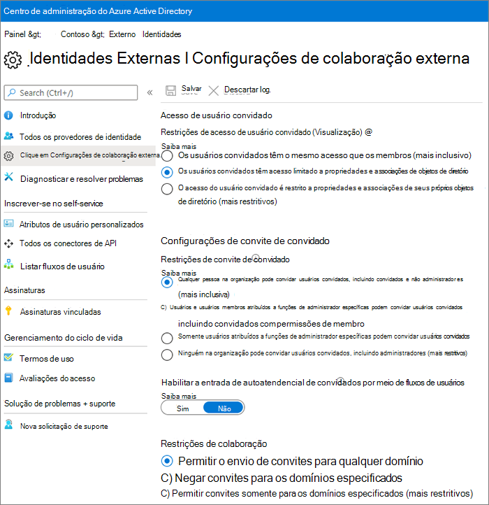
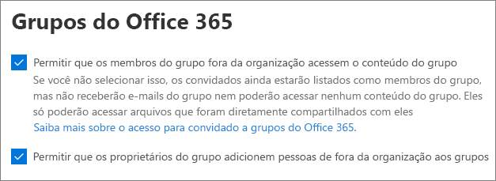
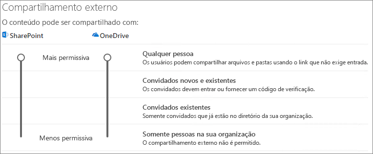
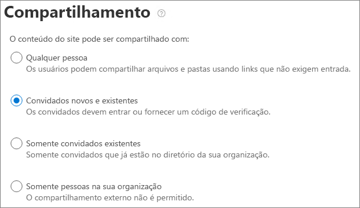

# Colaborar com convidados em um site

Se você precisar colaborar com convidados entre documentos, dados e listas, poderá usar um site do SharePoint. Os sites modernos do SharePoint estão conectados a grupos do Microsoft 365 e podem gerenciar a associação do site e fornecer ferramentas de colaboração adicionais, como uma caixa de correio e um calendário compartilhados.

Neste artigo, veremos as etapas de configuração do Microsoft 365 necessárias para configurar um site do SharePoint para colaboração com convidados.

## Demonstração de vídeo

Este vídeo mostra as etapas de configuração descritas neste documento. 

> [!VIDEO https://www.microsoft.com/videoplayer/embed/RE44Llg?autoplay=false]

## Configurações de relações organizacionais do Azure

O compartilhamento no Microsoft 365 é regido no seu nível mais alto pelas configurações de relações organizacionais no Azure Active Directory. Se o compartilhamento de convidados estiver desabilitado ou restrito no Azure AD, isso substituirá as configurações de compartilhamento que você configurar no Microsoft 365.

Verifique as configurações de relações organizacionais para garantir que o compartilhamento com convidados não seja bloqueado.

Para definir as configurações de relação organizacional

1. Faça logon no Microsoft Azure em [https://portal.azure.com](https://portal.azure.com).
2. Na navegação à esquerda, clique em **Azure Active Directory**.
3. No painel **visão geral** , clique em **relações organizacionais**.
4. No painel **relações organizacionais** , clique em **configurações**.
5. Certifique-se de que **Administradores e usuários na função de convite de convidado podem convidar** e **os membros podem convidar** estão definidos como **Sim**.
6. Caso tenha feito alterações, clique em **Salvar**.

Observe as configurações na seção **restrições de colaboração** . Certifique-se de que os domínios dos convidados com os quais você deseja colaborar não estão bloqueados.

## Configurações de convidado de grupos do Microsoft 365

Os sites modernos do SharePoint usam os grupos do Microsoft 365 para controlar o acesso ao site. As configurações de convidado do Microsoft 365 groups devem ser ativadas para que o acesso de convidados nos sites do SharePoint funcione.

Para definir as configurações de convidados de grupos do Microsoft 365

1. No centro de administração do Microsoft 365, no painel de navegação à esquerda, expanda **configurações**.
2. Clique em **serviços & suplementos**.
3. Na lista, clique em **Microsoft 365 grupos**.
4. Certifique-se de que o **grupo permitir Membros fora do seu conteúdo de grupo de acesso à organização** e **que os proprietários do grupo adicionem pessoas fora da sua organização a grupos de** seleção.
5. Se você tiver feito alterações, clique em **salvar alterações**.

## Configurações de compartilhamento de nível da organização do SharePoint

Para que os convidados tenham acesso aos sites do SharePoint, as configurações de compartilhamento no nível da organização do SharePoint devem permitir o compartilhamento com convidados.

As configurações de nível de organização determinam quais configurações estão disponíveis para sites individuais. As configurações do site não podem ser mais permissivas do que as configurações no nível da organização.

Se você quiser permitir o compartilhamento de arquivos e pastas não autenticados, escolha **qualquer pessoa**. Se você quiser garantir que todas as pessoas de fora da sua organização tenham que se autenticar, escolha **novos e existentes convidados**. Escolha a configuração mais permissiva que será necessária para qualquer site em sua organização.

Para definir as configurações de compartilhamento de nível da organização do SharePoint

1. No centro de administração do Microsoft 365, na navegação à esquerda, em **centros de administração**, clique em **SharePoint**.
2. No centro de administração do SharePoint, na navegação à esquerda, clique em **Compartilhamento**.
3. Verifique se o compartilhamento externo do SharePoint está definido como **qualquer pessoa** ou **novo convidado existente**.
4. Caso tenha feito alterações, clique em **Salvar**.

## Criar um site

A próxima etapa é criar o site que você planeja usar para colaborar com convidados.

Para criar um site
1. No centro de administração do SharePoint, em **sites**, clique **sites ativos**.
2. Clique em **Criar**.
3. Clique em **site de equipe**.
4. Digite um nome de site e insira um nome para o proprietário do grupo (proprietário do site).
5. Em **Configurações avançadas**, escolha se você deseja que este seja um site público ou privado.
6. Clique em **Avançar**.
7. Clique em **Concluir**.

Vamos convidar os usuários mais tarde. Em seguida, é importante verificar as configurações de compartilhamento no nível do site para este site.

## Configurações de compartilhamento no nível do site do SharePoint

Verifique as configurações de compartilhamento no nível do site para garantir que elas permitam o tipo de acesso que você deseja para este site. Por exemplo, se você definir as configurações de nível de organização como **qualquer pessoa**, mas quiser que todos os convidados autentiquem esse site, verifique se as configurações de compartilhamento no nível do site estão definidas para **convidados novos e existentes**.

Observe que o site não pode ser compartilhado com pessoas não autenticadas (configuração de**qualquer pessoa** ), mas arquivos e pastas individuais podem.

Para definir configurações de compartilhamento no nível do site
1. No centro de administração do SharePoint, na navegação à esquerda, expanda a opção **Sites** e clique em **Sites ativos**.
2. Selecione o site que você acabou de criar.
3. Na faixa de opções, clique em **Compartilhamento**.
4. Verifique se o compartilhamento está definido como **qualquer pessoa** ou **convidado novo e existente**.
5. Caso tenha feito alterações, clique em **Salvar**.

## Convidar usuários

As configurações de compartilhamento de convidados agora estão configuradas para que você possa começar a adicionar usuários internos e convidados ao seu site. O acesso ao site é controlado através do grupo associado da Microsoft 365, portanto, vamos adicionar usuários lá.

Para convidar usuários internos para um grupo
1. Navegue até o site em que você deseja adicionar usuários.
2. Clique em **Membros** no canto superior direito.
3. Clique em **Adicionar membros**.
4. Digite os nomes ou endereços de email dos usuários que você deseja convidar para o site e clique em **salvar**.

Os usuários convidados não podem ser adicionados do site. Você precisa adicioná-los usando o Outlook na Web.

Para convidar convidados para um grupo
1. No Outlook na Web, em **grupos**, clique no grupo em que você deseja adicionar membros.
2. Abra o cartão de visita do grupo e, em **mais opções** (...), clique em **adicionar membros**.
3. Digite os endereços de email dos convidados que você deseja convidar e clique em **Adicionar**.
4. Clique em **Fechar**.

## Confira também

[Práticas recomendadas para compartilhar arquivos e pastas com usuários não autenticados](best-practices-anonymous-sharing.md)

[Limitar a exposição acidental dos arquivos ao compartilhar com convidados](share-limit-accidental-exposure.md)

[Criar um ambiente de compartilhamento de convidados seguro](create-secure-guest-sharing-environment.md)

[Crie uma extranet B2B com convidados gerenciados](b2b-extranet.md)

