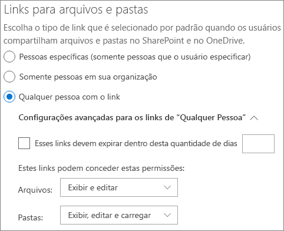

# Colaborar com convidados em um documento

Se precisar colaborar com pessoas de fora da sua organização em documentos no SharePoint ou no OneDrive, você pode enviar um link de compartilhamento para o documento. Neste artigo, vamos ver as etapas de configuração do Microsoft 365 necessárias para configurar links de compartilhamento para o SharePoint e o OneDrive para as necessidades da sua organização.

## Demonstração de vídeo

Este vídeo mostra as etapas de configuração descritas neste documento. 

> [!VIDEO https://www.microsoft.com/videoplayer/embed/RE450Vt?autoplay=false]

## Configurações de colaboração externa do Azure

O compartilhamento no Microsoft 365 é regido em seu nível mais alto pelas configurações de colaboração [externa B2B no Azure Active Directory.](https://docs.microsoft.com/azure/active-directory/external-identities/delegate-invitations) Se o compartilhamento de convidados estiver desabilitado ou restrito no Azure AD, essa configuração substituirá as configurações de compartilhamento que você definir no Microsoft 365.

Verifique as configurações de colaboração externa B2B para garantir que o compartilhamento com convidados não seja bloqueado.

Para definir configurações de colaboração externa

1. Entre no Azure Active Directory em [https://aad.portal.azure.com](https://aad.portal.azure.com) .
2. No painel de navegação esquerdo, clique no **Azure Active Directory.**
3. Clique **em Identidades externas.**
4. Na tela **De início,** no painel de navegação esquerdo, clique em **Configurações de colaboração externa.**
5. Certifique-se de que os administradores e usuários na função de convidado convidado possam convidar e que os membros **possam** convidar estão **definidos** como **Sim.**
6. Caso tenha feito alterações, clique em **Salvar**.

Observe as configurações na seção **Restrições de** colaboração. Certifique-se de que os domínios dos convidados com os que você deseja colaborar não sejam bloqueados.

Se você trabalha com convidados de várias organizações, talvez queira restringir sua capacidade de acessar dados de diretório. Isso impedirá que eles veja quem mais é um convidado no diretório. Para fazer isso, sob restrições de acesso de usuário **convidado,** selecione **Usuários** convidados têm acesso limitado a propriedades e associação de configurações de objetos de diretório ou acesso de usuário convidado é restrito a propriedades e associações de seus próprios objetos de **diretório.**

## Configurações de compartilhamento no nível da organização do SharePoint

Para que pessoas de fora da sua organização tenham acesso a um documento no SharePoint ou no OneDrive, as configurações de compartilhamento no nível da organização do SharePoint e do OneDrive devem permitir o compartilhamento com pessoas de fora da sua organização.

As configurações no nível da organização do SharePoint determinam as configurações que estarão disponíveis para sites individuais do SharePoint. As configurações de site não podem ser mais permissivas do que as configurações no nível da organização. A configuração no nível da organização do OneDrive determina o nível de compartilhamento que estará disponível nas bibliotecas do OneDrive dos usuários.

Para o SharePoint e o OneDrive, se você quiser permitir o compartilhamento de arquivos e pastas não autenticados, escolha **Qualquer Pessoa.** Se você quiser garantir que pessoas de fora da sua organização tenham que se autenticar, escolha convidados **novos e existentes.** *Os* links de qualquer pessoa são a maneira mais fácil de compartilhar: as pessoas de fora da sua organização podem abrir o link sem autenticação e podem passá-lo para outras pessoas.

Para o SharePoint, escolha a configuração mais permissiva que será necessária para qualquer site em sua organização.

Para definir as configurações de compartilhamento no nível da organização do SharePoint

1. No centro de administração do Microsoft 365, no painel de navegação esquerdo, em **Centros** de administração, clique **em SharePoint**.
2. No centro de administração do SharePoint, no painel de navegação esquerdo, em **Políticas,** clique em **Compartilhamento.**
3. Certifique-se de que o compartilhamento externo para o SharePoint ou OneDrive está definido **como Qualquer pessoa** ou convidados novos e **existentes.** (Observe que a configuração do OneDrive não pode ser mais permissiva do que a configuração do SharePoint.)
4. Caso tenha feito alterações, clique em **Salvar**.

## Configurações de link padrão no nível da organização do SharePoint

As configurações padrão de link de arquivo e pasta determinam a opção de link que será mostrada aos usuários por padrão quando eles compartilharem um arquivo ou pasta. Os usuários podem alterar o tipo de link para uma das outras opções antes de compartilhar, se desejado.

Lembre-se de que essa configuração afeta os sites do SharePoint em sua organização, bem como o OneDrive.

Escolha um link de qualquer um dos seguintes tipos, que é selecionado por padrão quando os usuários compartilham arquivos e pastas:

- **Qualquer pessoa com o link** - Escolha essa opção se você espera fazer muitos compartilhamentos de arquivos e pastas não autenticados. Se você quiser permitir links *para* Qualquer pessoa, mas estiver preocupado com o compartilhamento acidental não autenticado, considere uma das outras opções como padrão. Esse tipo de link só estará disponível se você tiver habilitado o compartilhamento **de Qualquer** pessoa.
- **Somente pessoas em sua organização** - Escolha essa opção se você espera que a maioria dos compartilhamentos de arquivos e pastas seja com pessoas dentro da sua organização.
- **Pessoas específicas** - Considere essa opção se você espera fazer muito compartilhamento de arquivos e pastas com convidados. Esse tipo de link funciona com convidados e exige que eles se autententem.
 

Para definir as configurações de link padrão no nível da organização do SharePoint e do OneDrive

1. Navegue até a página Compartilhamento no centro de administração do SharePoint.
2. Em **Links de arquivo e pasta,** selecione o link de compartilhamento padrão que você deseja usar.
3. Caso tenha feito alterações, clique em **Salvar**.

Para definir a permissão para o link de compartilhamento, em Escolha a permissão selecionada por **padrão para links de compartilhamento.**

1. Selecione **Exibir** se não quiser que usuários não autenticados façam alterações nos arquivos e pastas.
2. Selecione **Editar** se quiser permitir que usuários não autenticados façam alterações nos arquivos e pastas.

Observe que as duas opções de pré-missionamento acima podem ser aplicadas não apenas para convidados/usuários externos, mas também para usuários internos. A opção de permissão escolhida é determinada por autoconscrição.

Para definir permissões para links que permitem o compartilhamento com qualquer pessoa

1. Sob **esses links, é possível dar estas permissões:** sub-painel, 
    1. Na lista **drop-down** De arquivos, 
        - Selecione **Exibir e editar** se quiser permitir que usuários não autenticados façam alterações nos arquivos.
        - Selecione **Exibir** se não quiser que usuários não autenticados façam alterações nos arquivos.
    2. Na lista **drop-down Folders,**
        - Selecione **Exibir, editar e carregar** se quiser permitir que usuários não autenticados façam alterações nas pastas.
        - Selecione **Exibir** se não quiser que usuários não autenticados façam alterações nas pastas.

## Configurações de compartilhamento no nível do site do SharePoint

Se você estiver compartilhando arquivos e pastas que estão em um site do SharePoint, também precisará verificar as configurações de compartilhamento no nível do site para esse site.

Para definir configurações de compartilhamento no nível do site

1. No centro de administração do SharePoint, no painel de navegação esquerdo, **expanda Sites** e clique em **Sites ativos.**
2. Selecione o site no qual você deseja compartilhar arquivos e pastas com convidados.
3. Role a tela para a direita através da linha (na qual o site selecionado está presente) e clique em qualquer lugar na **coluna de compartilhamento** externo.
4. Na página que aparece, clique na **guia** Políticas.
5. No painel **de compartilhamento** externo, clique em **Editar**.
6. Certifique-se de que o compartilhamento está definido **como Qualquer** pessoa ou convidados novos **e existentes.**
7. Caso tenha feito alterações, clique em **Salvar**.

## Convidar usuários

As configurações de compartilhamento de convidados agora estão configuradas; para que os usuários agora possam compartilhar arquivos e pastas com pessoas de fora da sua organização. Confira [Compartilhar arquivos e pastas do OneDrive e](https://support.office.com/article/9fcc2f7d-de0c-4cec-93b0-a82024800c07) arquivos ou pastas do [SharePoint](https://support.office.com/article/1fe37332-0f9a-4719-970e-d2578da4941c) para saber mais.

## Confira também

[Práticas recomendadas para compartilhar arquivos e pastas com usuários não autenticados](best-practices-anonymous-sharing.md)

[Limitar a exposição acidental dos arquivos ao compartilhar com convidados](share-limit-accidental-exposure.md)

[Integração do SharePoint e OneDrive com o Azure AD B2B](https://docs.microsoft.com/sharepoint/sharepoint-azureb2b-integration-preview)
