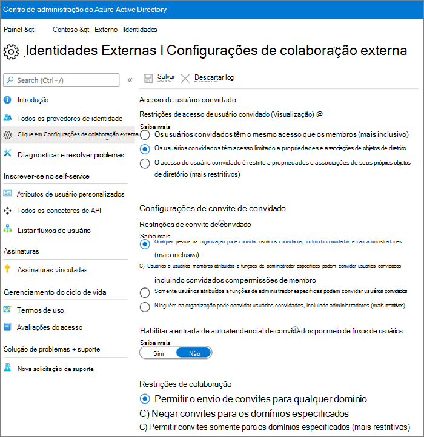
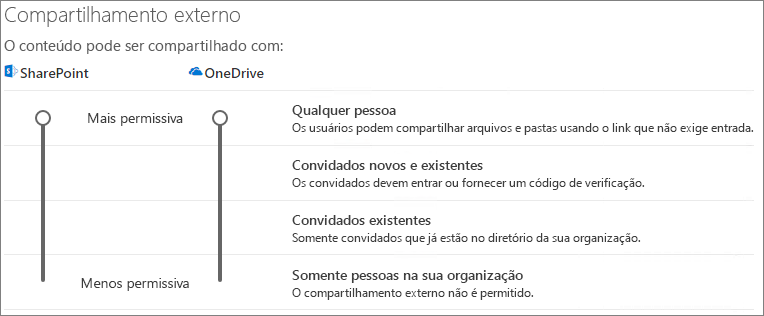

# Colaborar com convidados em um documentoCollaborate with guests on a document

Se você precisar colaborar com pessoas de fora da sua organização em documentos do SharePoint ou do OneDrive, você pode enviar um link de compartilhamento para o documento.If you need to collaborate with people outside your organization on documents in SharePoint or OneDrive, you can send them a sharing link to the document. Neste artigo, veremos as etapas de configuração do Microsoft 365 necessárias para configurar links de compartilhamento para o SharePoint e o OneDrive para as necessidades da sua organização.In this article, we'll walk through the Microsoft 365 configuration steps necessary to set up sharing links for SharePoint and OneDrive for the needs of your organization.

## Demonstração de vídeoVideo demonstration

Este vídeo mostra as etapas de configuração descritas neste documento.This video shows the configuration steps described in this document. 

> [!VIDEO https://www.microsoft.com/videoplayer/embed/RE450Vt?autoplay=false]

## Configurações de relações organizacionais do AzureAzure Organizational relationships settings

O compartilhamento no Microsoft 365 é regido no seu nível mais alto pelas configurações de relações organizacionais no Azure Active Directory.Sharing in Microsoft 365 is governed at its highest level by the organizational relationships settings in Azure Active Directory. Se o compartilhamento de convidados estiver desabilitado ou restrito no Azure AD, isso substituirá as configurações de compartilhamento que você configurar no Microsoft 365.If guest sharing is disabled or restricted in Azure AD, this will override any sharing settings that you configure in Microsoft 365.

Verifique as configurações de relações organizacionais para garantir que o compartilhamento com convidados não seja bloqueado.Check the organizational relationships settings to ensure that sharing with guests is not blocked.

Para definir as configurações de relação organizacionalTo set organizational relationship settings

1. Faça logon no Microsoft Azure em [https://portal.azure.com](https://portal.azure.com).Log in to Microsoft Azure at [https://portal.azure.com](https://portal.azure.com).
2. Na navegação à esquerda, clique em **Azure Active Directory**.In the left navigation, click **Azure Active Directory**.
3. No painel **visão geral** , clique em **relações organizacionais**.In the **Overview** pane, click **Organizational relationships**.
4. No painel **relações organizacionais** , clique em **configurações**.In the **Organizational relationships** pane, click **Settings**.
5. Certifique-se de que **Administradores e usuários na função de convite de convidado podem convidar** e **os membros podem convidar** estão definidos como **Sim**.Ensure that **Admins and users in the guest inviter role can invite** and **Members can invite** are both set to **Yes**.
6. Caso tenha feito alterações, clique em **Salvar**.If you made changes, click **Save**.

Observe as configurações na seção **restrições de colaboração** .Note the settings in the **Collaboration restrictions** section. Certifique-se de que os domínios dos convidados com os quais você deseja colaborar não estão bloqueados.Make sure that the domains of the guests that you want to collaborate with aren't blocked.

## Configurações de compartilhamento de nível da organização do SharePointSharePoint organization level sharing settings

Para que as pessoas de fora da sua organização tenham acesso a um documento no SharePoint ou no OneDrive, as configurações de compartilhamento no nível da organização do SharePoint e do OneDrive devem permitir o compartilhamento com pessoas de fora da sua organização.In order for people outside your organization to have access to a document in SharePoint or OneDrive, the SharePoint and OneDrive organization-level sharing settings must allow for sharing with people outside your organization.

As configurações de nível de organização para o SharePoint determinam as configurações disponíveis para sites individuais do SharePoint.The organization-level settings for SharePoint determine what settings are available for individual SharePoint sites. As configurações do site não podem ser mais permissivas do que as configurações no nível da organização.Site settings cannot be more permissive than the organization-level settings. A configuração de nível de organização para o OneDrive determina o nível de compartilhamento disponível nas bibliotecas do OneDrive dos usuários.The organization-level setting for OneDrive determines what level of sharing is available in users' OneDrive libraries.

Para o SharePoint e o OneDrive, se você quiser permitir compartilhamento de arquivos e pastas não autenticados, escolha **qualquer pessoa**.For SharePoint and OneDrive, if you want to allow unauthenticated file and folder sharing, choose **Anyone**. Se você quiser garantir que as pessoas de fora da sua organização tenham que se autenticar, escolha **novos e existentes convidados**.If you want to ensure that people outside your organization have to authenticate, choose **New and existing guests**. Os links de *qualquer pessoa* são a maneira mais fácil de compartilhar: as pessoas de fora da sua organização podem abrir o link sem autenticação e ficar livres para passá-lo para outros.*Anyone* links are the easiest way to share: people outside your organization can open the link without authentication and are free to pass it on to others.

Para o SharePoint, escolha a configuração mais permissiva que será necessária para qualquer site em sua organização.For SharePoint, choose the most permissive setting that will be needed by any site in your organization.

Para definir as configurações de compartilhamento de nível da organização do SharePointTo set SharePoint organization level sharing settings

1. No centro de administração do Microsoft 365, na navegação à esquerda, em **centros de administração**, clique em **SharePoint**.In the Microsoft 365 admin center, in the left navigation, under **Admin centers**, click **SharePoint**.
2. No centro de administração do SharePoint, na navegação à esquerda, clique em **Compartilhamento**.In the SharePoint admin center, in the left navigation, click **Sharing**.
3. Certifique-se de que o compartilhamento externo do SharePoint ou do OneDrive está definido como **qualquer pessoa** ou **convidado novo e existente**.Ensure that external sharing for SharePoint or OneDrive is set to **Anyone** or **New and existing guests**. (Observe que a configuração do OneDrive não pode ser mais permissiva do que a configuração do SharePoint.)(Note that the OneDrive setting cannot be more permissive than the SharePoint setting.)
4. Caso tenha feito alterações, clique em **Salvar**.If you made changes, click **Save**.

## Configurações de link padrão de nível de organização do SharePointSharePoint organization level default link settings

As configurações padrão de link de arquivo e pasta determinam qual opção de link é mostrada para o usuário por padrão ao compartilhar um arquivo ou uma pasta.The default file and folder link settings determine which link option is shown to the user by default when they share a file or folder. Os usuários podem alterar o tipo de link para uma das outras opções antes de compartilhar, se desejado.Users can change the link type to one of the other options before sharing if desired.

Tenha em mente que essa configuração afeta os sites do SharePoint em sua organização, bem como o OneDrive.Keep in mind that this setting affects SharePoint sites in your organization, as well as OneDrive.

Escolha o tipo de link selecionado por padrão quando os usuários compartilham arquivos e pastas:Choose the type of link that's selected by default when users share files and folders:

- **Qualquer pessoa com o link** -escolha essa opção se você quiser fazer muito do compartilhamento de arquivos e pastas não autenticados.**Anyone with the link** - Choose this option if you expect to do a lot of unauthenticated file and folder sharing. Se você quiser permitir links de *qualquer pessoa* , mas estiver preocupado com o compartilhamento acidental não autenticado, considere uma das outras opções como padrão.If you want to allow *Anyone* links but are concerned about accidental unauthenticated sharing, consider one of the other options as the default. Esse tipo de link só estará disponível se você tiver habilitado o compartilhamento de **qualquer pessoa** .This link type is only available if you've enabled **Anyone** sharing.
- **Somente as pessoas da sua organização** -escolha esta opção se você espera que a maioria dos compartilhamento de arquivos e pastas seja com pessoas dentro da sua organização.**Only people in your organization** - Choose this option if you expect most file and folder sharing to be with people inside your organization.
- **Pessoas específicas** -considere essa opção se você espera que um grande volume de compartilhamento de arquivos e pastas com convidados.**Specific people** - Consider this option if you expect to do a lot of file and folder sharing with guests. Esse tipo de link funciona com convidados e exige a autenticação.This type of link works with guests and requires them to authenticate.
 

Para definir as configurações de link padrão de nível de organização do OneDrive e SharePointTo set the SharePoint and OneDrive organization level default link settings

1. Navegue até a página de compartilhamento no centro de administração do SharePoint.Navigate to the Sharing page in the SharePoint admin center.
2. Em **links de arquivo e pasta**, selecione o link de compartilhamento padrão que você deseja usar.Under **File and folder links**, select the default sharing link that you want to use.
3. Caso tenha feito alterações, clique em **Salvar**.If you made changes, click **Save**.

## Configurações de compartilhamento no nível do site do SharePointSharePoint site level sharing settings

Se você estiver compartilhando arquivos e fodlers que estão em um site do SharePoint, também precisará verificar as configurações de compartilhamento no nível do site para esse site.If you're sharing files and fodlers that are in a SharePoint site, you also need to check the site-level sharing settings for that site.

Para definir configurações de compartilhamento no nível do siteTo set site-level sharing settings
1. No centro de administração do SharePoint, na navegação à esquerda, expanda a opção **Sites** e clique em **Sites ativos**.In the SharePoint admin center, in the left navigation, expand **Sites** and click **Active sites**.
2. Selecione o site que você acabou de criar.Select the site that you just created.
3. Na faixa de opções, clique em **Compartilhamento**.In the ribbon, click **Sharing**.
4. Verifique se o compartilhamento está definido como **qualquer pessoa** ou **convidado novo e existente**.Ensure that sharing is set to **Anyone** or **New and existing guests**.
5. Caso tenha feito alterações, clique em **Salvar**.If you made changes, click **Save**.

## Convidar usuáriosInvite users

As configurações de compartilhamento de convidados agora estão configuradas, portanto, os usuários agora podem compartilhar arquivos e pastas com pessoas de fora da sua organização.Guest sharing settings are now configured, so users can now share files and folders with people outside your organization. Consulte [compartilhar arquivos e pastas do onedrive](https://support.office.com/article/9fcc2f7d-de0c-4cec-93b0-a82024800c07) e [compartilhar arquivos ou pastas do SharePoint](https://support.office.com/article/1fe37332-0f9a-4719-970e-d2578da4941c) para obter mais informações.See [Share OneDrive files and folders](https://support.office.com/article/9fcc2f7d-de0c-4cec-93b0-a82024800c07) and [Share SharePoint files or folders](https://support.office.com/article/1fe37332-0f9a-4719-970e-d2578da4941c) for more information.

## Confira tambémSee Also

[Práticas recomendadas para compartilhar arquivos e pastas com usuários não autenticadosBest practices for sharing files and folders with unauthenticated users](best-practices-anonymous-sharing.md)

[Limitar a exposição acidental dos arquivos ao compartilhar com convidadosLimit accidental exposure to files when sharing with guests](share-limit-accidental-exposure.md)