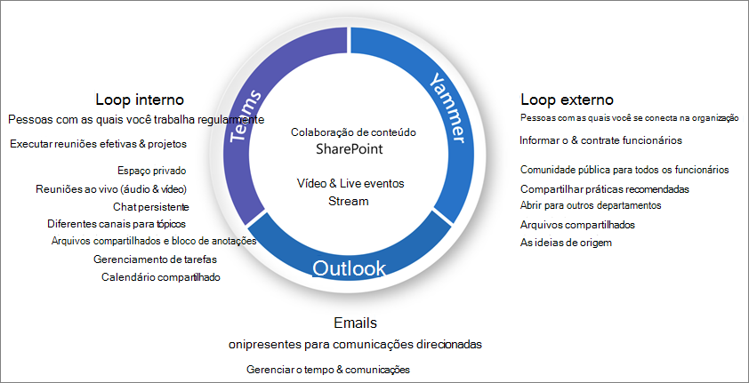

# O que é governança de colaboração?

A governança de colaboração é o modo como você gerencia o acesso dos usuários aos recursos, a conformidade com seus padrões de negócios e garante a segurança dos dados.

Hoje, as organizações estão usando um conjunto de ferramentas diversificado. Há a equipe de desenvolvedores usando o chat de equipe, os executivos que enviam emails e toda a organização que se conecta através da empresa social. Várias ferramentas de colaboração estão sendo usadas porque cada grupo é exclusivo e tem suas próprias necessidades funcionais e estilo de trabalho. Algumas usarão apenas emails, enquanto outros moram principalmente no chat. 

Se os usuários acharem que as ferramentas fornecidas não atendem às suas necessidades, elas provavelmente baixarão seus aplicativos de consumidor favorito que dão suporte aos seus cenários. Embora esse processo permita que os usuários sejam iniciados rapidamente, ele leva a uma experiência de usuário frustrante em toda a organização com vários logins, compartilhamento de dificuldade e sem um local para exibir conteúdo. Esse conceito é conhecido como "Shadow IT" e representa um risco significativo para as organizações. Ele reduz a capacidade de gerenciar de forma uniforme o acesso do usuário, garantir a segurança e as necessidades de conformidade do serviço.

Serviços como o Microsoft 365 Groups, Teams e Yammer capacitam os usuários e reduzem o risco de sombreamento de ti, fornecendo as ferramentas necessárias para colaborar. O Microsoft 365 tem um conjunto avançado de ferramentas para implementar qualquer recurso de governança que sua organização possa exigir. 

Esta série de artigos ajudará você a entender como as configurações de grupos, equipes e SharePoint interagem, quais recursos de governança estão disponíveis e como criar e implementar um plano de governança para os recursos de colaboração no Microsoft 365.

## O que são grupos do Microsoft 365?

Os grupos do Microsoft 365 permitem que você escolha um conjunto de pessoas com as quais você deseja colaborar e configure facilmente uma coleção de recursos para que as pessoas compartilhem. A adição de membros ao grupo concede automaticamente as permissões necessárias a todos os ativos fornecidos pelo grupo. As duas equipes e o Yammer usam os grupos do Microsoft 365 para gerenciar sua associação.

Os grupos do Microsoft 365 incluem um pacote de recursos vinculados que os usuários podem usar para comunicação e colaboração. Os grupos sempre incluem um site do SharePoint, planejador, um espaço de trabalho do Power BI, uma caixa de correio e um calendário e Stream. Dependendo de como você cria o grupo, você pode opcionalmente adicionar outros serviços, como o Teams, o Yammer e o Project.

|Recurso|Descrição|
|:------|:----------|
|[Calendar](https://support.office.com/article/schedule-a-meeting-on-a-group-calendar-in-outlook-0cf1ad68-1034-4306-b367-d75e9818376a)|Para o agendamento de eventos relacionados ao grupo|
|[Caixa de Entrada](https://support.office.com/article/have-a-group-conversation-in-outlook-a0482e24-a769-4e39-a5ba-a7c56e828b22)|Para conversas por email entre membros do grupo. Esta caixa de entrada tem um endereço de email e pode ser definida para aceitar mensagens de pessoas de fora do grupo e até mesmo fora da organização, muito parecida com uma lista de distribuição tradicional.|
|[Bloco de anotações do OneNote](https://support.office.com/article/get-started-with-onenote-e768fafa-8f9b-4eac-8600-65aa10b2fe97)|Para coletar ideias, pesquisa e informações|
|[Planner](https://support.office.com/article/microsoft-planner-help-4a9a13c6-3adf-4a60-a6fc-15c0b15e16fc)|Para atribuir e gerenciar tarefas de projeto entre seus membros do grupo|
|[Espaço de trabalho do Power BI](https://docs.microsoft.com/power-bi/collaborate-share/service-new-workspaces)|Um espaço de colaboração de dados com painéis e relatórios|
|[Projeto e roteiro](https://support.microsoft.com/project)|Ferramentas de gerenciamento de projetos baseados na Web|
|[Site de equipe do SharePoint](https://support.office.com/article/what-is-a-sharepoint-team-site-75545757-36c3-46a7-beed-0aaa74f0401e)|Um repositório central para informações, links e conteúdo relacionados ao seu grupo|
|[Stream](https://support.microsoft.com/microsoft-stream)|Um serviço de streaming de vídeo|
|[Teams](https://support.microsoft.com/teams)|Um espaço de trabalho baseado em chat no Microsoft 365|
|[Grupo do Yammer](https://support.office.com/article/Learn-about-Office-365-groups-b565caa1-5c40-40ef-9915-60fdb2d97fa2)|Um local comum para ter conversas e compartilhar informações|

Os grupos do Microsoft 365 incluem uma variedade de controles de governança, incluindo uma política de expiração, convenções de nomenclatura e uma política de palavras bloqueadas, para ajudá-lo a gerenciar grupos na sua organização. Como os grupos controlam a associação e o acesso a esse pacote de recursos, o gerenciamento de grupos é uma parte fundamental da colaboração de controle no Microsoft 365.

## Definir uma estratégia de colaboração para sua organização

Há vários lugares para colaborar e ter conversas no Microsoft 365. Entender onde os usuários podem iniciar as conversas podem ajudá-lo a definir uma estratégia de comunicação.

Há três métodos de comunicação principais suportados pelo Microsoft 365:

- Outlook: colaboração por email com um grupo compartilhado caixa de entrada e calendário
- Microsoft Teams: um espaço de trabalho com base em chat persistente onde você pode ter conversas informais, em tempo real, em torno de vários tópicos, organizados por subgrupos específicos
- Yammer: experiência social corporativa para colaboração

- Teams: espaço de trabalho baseado em chat (colaboração de alta velocidade) – loop interno
  - Projetado para colaboração com as pessoas que seus usuários trabalham com todos os dias
  - Coloca informações ao alcance dos usuários em uma única experiência
  - Adicionar guias, conectores e bots
  - Chat ao vivo, conferência de áudio/vídeo, reuniões gravadas

- Yammer: conectar-se ao org (Enterprise social) – loop externo
  - Comunidades de grupos de pessoas de prática, que compartilham um interesse ou conhecimento comum, mas não estão necessariamente trabalhando juntas em uma base diária
  - Conexão de liderança, comunidades de aprendizagem, comunidades baseadas em função

- Caixa de correio e calendário (colaboração baseada em email)
  - Usado para comunicação direcionada com um grupo de pessoas
  - Calendário compartilhado para reuniões com outros membros do grupo
 
Ao determinar como você deseja usar os recursos de colaboração no Microsoft 365, considere esses métodos de comunicação e que os usuários provavelmente usarão em diferentes cenários.

> [!NOTE]
> Quando um novo grupo do Office 365 é criado por meio do Yammer ou do Teams, o grupo não fica visível no Outlook ou no catálogo de endereços porque a comunicação principal entre esses usuários ocorre em seus respectivos clientes. Os grupos do Yammer não podem ser conectados ao Teams.

## Práticas recomendadas

Ao iniciar seu processo de planejamento de governança, mantenha estas práticas recomendadas em mente:

- **Fale com seus usuários** – identifique seus maiores usuários dos recursos de colaboração e atenda com eles para compreender os principais requisitos de negócios e cenários de uso de casos.

- **Equilibre riscos e benefícios** -revise suas necessidades comerciais, normativas, legais e de conformidade e planeje uma solução que Otimize para todos os resultados.

- **Adaptação a diferentes organizações e diferentes tipos de conteúdo e cenários** -considere as diferentes necessidades para diferentes grupos ou departamentos e diferentes tipos de conteúdo, como conteúdo de intranet versus conteúdo do onedrive de um usuário.

- **Alinhar-se às prioridades** de negócios-as metas de negócios ajudarão você a definir quanto tempo e energia você precisará investir em governança.

- **Incorporar decisões de governança diretamente nas soluções que você cria** -muitas decisões de governança podem ser implementadas ativando ou desativando recursos no Microsoft 365.

- **Reforce com** soluções de adaptação de treinamento, como os cursos de [aprendizado da Microsoft 365](https://docs.microsoft.com/office365/customlearning) , para garantir que suas expectativas específicas da organização sejam reforçadas com o treinamento fornecido pela Microsoft.

- **Ter uma estratégia para comunicar políticas e diretrizes de governança em sua organização** -crie um centro de adoção do Microsoft 365 em um site de comunicação do SharePoint para comunicar políticas e procedimentos.

- **Definir funções e responsabilidades** -identifique sua equipe de controle principal e trabalhe com as principais decisões de governança sobre o provisionamento e o acesso externo e, em seguida, trabalhe com as decisões restantes.

- **Revisite suas decisões como negócios e alterações tecnológicas** – atendam periodicamente para analisar novos recursos e novas expectativas de negócios.

Para ver mais detalhadamente essas práticas, leia [criar seu plano de governança de colaboração](collaboration-governance-first.md).

## Impacto do usuário final e gerenciamento de alterações

Como os grupos e as equipes podem ser criados de várias maneiras, recomendamos treinar os usuários para usar o método que atenda à sua organização da melhor maneira possível:

- Se sua organização fizer a maior parte de sua comunicação usando email, instrua os usuários a criarem grupos no Outlook.
- Se sua organização usa muito o SharePoint ou está migrando do SharePoint local, instrua seus usuários a criarem sites de equipe do SharePoint para colaboração.
- Se sua organização tiver implantado o Microsoft Teams, instrua seus usuários a criarem uma equipe quando precisarem de um espaço de colaboração.

Isso ajuda a evitar confusão se os usuários não estiverem familiarizados com o modo como os grupos se relacionam com seus serviços relacionados. Para obter mais informações sobre como falar com seus usuários sobre grupos, confira [explicar os grupos da Microsoft 365 aos seus usuários](../admin/create-groups/explain-groups-knowledge-worker.md).

## Principais recursos de governança e requisitos de licenciamento

Recursos de governança para colaboração no Microsoft 365 incluem recursos no Microsoft 365, Teams, SharePoint e Azure Active Directory.

| Capcidade ou recurso | Descrição | Licenças |
|:----------------------|:------------|:----------|
|Compartilhamento de equipe e site|Controlar se equipes, grupos e sites podem ser compartilhados com pessoas de fora da sua organização.|Microsoft 365 E5 ou E3|
|Permissão/bloqueio de domínio|Restringir o compartilhamento com pessoas de fora da sua organização para pessoas de domínios específicos.|Microsoft 365 E5 ou E3|
|Criação de site de autoatendimento|Permitir ou impedir que os usuários criem seus próprios sites do SharePoint.|Microsoft 365 E5 ou E3|
|Compartilhamento de arquivos e sites restritos|Restringir o compartilhamento de sites, arquivos e pastas aos membros de um grupo de segurança específico.|Microsoft 365 E5 ou E3|
|Criação de grupo restrito|Restringir a criação de equipes e grupos aos membros de um grupo de segurança específico.|Microsoft 365 E5 ou E3 com licenças do Azure AD Premium ou do Azure AD Basic EDU|
|Política de nomeação de grupo|Impor prefixos ou sufixos em nomes de grupo e equipe.|Microsoft 365 E5 ou E3 com licenças do Azure AD Premium ou do Azure AD Basic EDU|
|Política de expiração de grupo|Definir que os grupos e as equipes inativos expirem e sejam excluídos após um período de tempo especificado.|Microsoft 365 E5 ou E3 com licenças Premium do Azure AD|
|Acesso de visitantes por grupo|Permitir ou impedir o compartilhamento de equipe e grupo com pessoas de fora da organização por grupo.|Microsoft 365 E5 ou E3|

## Passo a passo de planejamento de governança de colaboração

Siga estas etapas básicas para criar seu plano de governança:

1. Considere as principais metas e processos de negócios- [crie seu plano de governança](collaboration-governance-first.md) para atender às necessidades de sua empresa.
2. Entender as configurações em serviços- [as configurações nos grupos e no SharePoint](groups-sharepoint-governance.md) interagem entre si, como [as configurações em grupos, SharePoint e Teams](groups-sharepoint-teams-governance.md) e [outros serviços](groups-services-interactions.md). Certifique-se de entender essas interações conforme você planeja sua estratégia de governança.
3. Plan to manage user Access-plan [o nível de acesso que você deseja conceder aos usuários em grupos, SharePoint e equipes](groups-teams-access-governance.md).
4. Plano para gerenciar as configurações de conformidade – revise as [Opções de conformidade disponíveis para o Microsoft 365 grupos, equipes e colaboração do SharePoint](groups-teams-compliance-governance.md).
5. Planejar o gerenciamento de comunicações – revise as [Opções de governança de comunicações disponíveis para cenários de colaboração](groups-teams-communication-governance.md).
6. Planejar a organização e a governança do ciclo de vida-escolha [as políticas que você deseja usar para a criação de equipes e de grupo, nomeação, expiração e arquivamento](plan-organization-lifecycle-governance.md). Além disso, entenda o [fim das opções de ciclo de vida de grupos, equipes e Yammer](end-life-cycle-groups-teams-sites-yammer.md)

## Treinamento para administradores

Esses módulos de treinamento do Microsoft Learn podem ajudá-lo a aprender os recursos de colaboração no Teams e no SharePoint.

#### Teams

|ValuePak|Gerenciar a colaboração em equipe com o Microsoft Teams|
|:---|:---|
||Gerenciar a colaboração em equipe com o Microsoft Teams apresenta os recursos e funções do Microsoft Teams, o ponto central para colaboração em equipe no Microsoft 365. Você aprenderá como usar o Teams para facilitar o trabalho em equipe e a comunicação em sua organização, tanto localmente quanto remoto, em uma ampla variedade de dispositivos — de desktops a tablets e telefones, aproveitando as vantagens de todas as funcionalidades avançadas dos aplicativos do Office 365. Você compreenderá como o Teams oferece um ambiente abrangente e flexível para colaboração entre aplicativos e dispositivos. Este caminho de aprendizagem ajuda você a se preparar para a certificação  Microsoft 365 Certified: Administrador Associado do Teams.  2 h e 16 módulos de caminho de aprendizado|

> [!div class="nextstepaction"]
> [Iniciar >](https://docs.microsoft.com/learn/modules/m365-teams-collab-prepare-deployment/introduction/)

#### SharePoint

|ValuePak|Colaborar com o SharePoint no Microsoft 365|
|:---|:---|
||O gerenciamento de conteúdo compartilhado com o Microsoft SharePoint apresenta os recursos e funcionalidades do SharePoint e como ele funciona com o Microsoft 365. Você aprenderá sobre os diferentes tipos de sites do SharePoint, inclusive sites agrupadores, além de proteção de informações, relatórios e monitoramento. Você também aprenderá a usar o compartilhamento de pastas e arquivos do SharePoint para otimizar a colaboração, como compartilhar arquivos externamente e como gerenciar sites do SharePoint no centro de administração do SharePoint. Este caminho de aprendizagem pode ajudar você a se preparar para a certificação Microsoft 365 Certified: Administrador de Trabalho em Equipe.  1 hr 14 min-caminho de aprendizado-4 módulos|

> [!div class="nextstepaction"]
> [Iniciar >](https://docs.microsoft.com/learn/modules/m365-teams-sharepoint-plan-sharepoint/introduction/)

## Treinamento para usuários finais

Esses módulos de treinamento podem ajudar os usuários a usar o Teams, grupos e o SharePoint para colaboração no Microsoft 365.

|Teams|SharePoint|
|:---|:---|
| **[Configurar e personalizar sua equipe](https://support.microsoft.com/office/702a2977-e662-4038-bef5-bdf8ee47b17b)**| **[Compartilhar e sincronizar](https://support.microsoft.com/office/98cb2ff2-c27e-42ea-b055-c2d895f8a5de)**|
| **[Carregar e localizar arquivos](https://support.microsoft.com/office/57b669db-678e-424e-b0a0-15d19215cb12)**||
| **[Colaborar em equipes e canais](https://support.microsoft.com/office/c3d63c10-77d5-4204-a566-53ddcf723b46)**|||

## Ilustrações

Essas ilustrações ajudarão você a entender como os grupos e as equipes interagem com outros serviços no Microsoft 365 e quais recursos de governança e conformidade estão disponíveis para ajudá-lo a gerenciar esses serviços em sua organização.

### Grupos no Microsoft 365 para arquitetos de TI
O que os arquitetos de TI precisam saber sobre os grupos no Microsoft 365

|**Item**|**Descrição**|
|:-----|:-----|
|   [PDF](https://github.com/MicrosoftDocs/microsoft-365-docs/raw/public/microsoft-365/downloads/msft-m365-groups.pdf) \| [Visio](https://github.com/MicrosoftDocs/OfficeDocs-Enterprise/raw/live/Enterprise/downloads/msft-m365-groups.vsdx)   Atualizado em junho de 2019|Essas ilustrações detalham os diferentes tipos de grupos, como eles são criados e gerenciados e algumas recomendações de governança.|

### Microsoft Teams e serviços de produtividade relacionados no Microsoft 365 para arquitetos de TI
A arquitetura lógica dos serviços de produtividade no Microsoft 365, liderada pelo Microsoft Teams.

|**Item**|**Descrição**|
|:-----|:-----|
|   [PDF](https://github.com/MicrosoftDocs/microsoft-365-docs/raw/public/microsoft-365/downloads/msft-m365-teams-logical-architecture.pdf) \| [Visio](https://github.com/MicrosoftDocs/OfficeDocs-Enterprise/raw/live/Enterprise/downloads/msft-m365-teams-logical-architecture.vsdx)   Atualizado em abril de 2019   |A Microsoft fornece um conjunto de serviços de produtividade que trabalham juntos para fornecer experiências de colaboração com recursos de governança de dados, segurança e conformidade.    Esta série de ilustrações oferece uma visão da arquitetura lógica dos serviços de produtividade para arquitetos empresariais, liderada pelo Microsoft Teams.|

### Recursos de conformidade e proteção de informações da Microsoft 365

O Microsoft 365 inclui um amplo conjunto de recursos de conformidade e proteção de informações. Juntamente com as ferramentas de produtividade da Microsoft, esses recursos foram projetados para ajudar as organizações a colaborar em tempo real, enquanto estão de acordo com as rigorosas estruturas de conformidade normativa. 

Este conjunto de ilustrações usa um dos setores mais regulamentados, serviços financeiros, para demonstrar como esses recursos podem ser aplicados para atender aos requisitos normativos comuns. Sinta-se à vontade para adaptar essas ilustrações para seu próprio uso. 

| Item | Descrição |
|:-----|:-----|
|   Inglês: [Baixar como PDF](https://download.microsoft.com/download/3/a/6/3a6ab1a3-feb0-4ee2-8e77-62415a772e53/m365-compliance-illustrations.pdf)  \| [Baixar como Visio](https://download.microsoft.com/download/3/a/6/3a6ab1a3-feb0-4ee2-8e77-62415a772e53/m365-compliance-illustrations.vsdx)   Japonês: [Baixar como PDF](https://download.microsoft.com/download/6/f/1/6f1a7d0e-dd8e-442e-b073-8e94327ae4f8/m365-compliance-illustrations.pdf)  \| [Baixar como Visio](https://download.microsoft.com/download/6/f/1/6f1a7d0e-dd8e-442e-b073-8e94327ae4f8/m365-compliance-illustrations.vsdx)   Atualizado em novembro de 2020|Contém: <ul><li>  Proteção de informações e prevenção contra perda de dados da Microsoft</li><li>Políticas de retenção e rótulos de retenção </li><li>Barreiras de informações</li><li>Conformidade em comunicações</li><li>Gerenciamento de riscos internos.</li><li>Inclusão de dados de terceiros</li>|

## Sessões de conferência

Assista a estas sessões de conferência para saber mais sobre governança para o Microsoft 365 grupos e equipes.

**Conceitos básicos**

Saiba mais sobre os conceitos básicos e as novas inovações nos grupos do Microsoft 365, incluindo gerenciamento e governança em escala, práticas recomendadas para a condução de uso e adoção e autoatendimento.

- [Abraçar os grupos do Microsoft 365](https://www.youtube.com/watch?v=dAamBF1gb7M)

**Governança**

Saiba como configurar seu ciclo de vida de expiração de grupos, políticas de nomeação, rótulos de classificação, colaboração com convidados externos e gerenciar permissões de criação de grupo.

- [Transformar a colaboração e combater a sombra com grupos do Office 365](https://www.youtube.com/watch?v=Bhf_bKx3lAg)

**Exemplo de cliente**

Veja um exemplo de bastidores de como o Microsoft 365 Groups, SharePoint, Teams e Yammer trabalham em conjunto para fornecer uma plataforma de colaboração global.

- [Encontrando seu ponto central de colaboração com os grupos do Office 365, SharePoint, Teams e Yammer](https://www.youtube.com/watch?v=Rx9eVwqXeQk)
