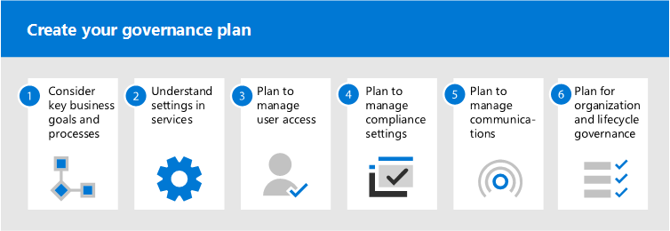

# O que é governança de colaboração?

A governança de colaboração é como você gerencia o acesso dos usuários aos recursos, a conformidade com os padrões de negócios e garante a segurança dos seus dados.

Atualmente, as organizações estão usando um conjunto de ferramentas diversificado. Há a equipe de desenvolvedores usando o chat em equipe, os executivos enviando emails e toda a organização se conectando por redes sociais empresariais. Várias ferramentas de colaboração estão em uso porque cada grupo é exclusivo e tem suas próprias necessidades funcionais e estilo de trabalho. Alguns usarão apenas o email, enquanto outros irão residir principalmente no chat. 

Se os usuários sentem que as ferramentas fornecidas por IT não se encaixam em suas necessidades, eles provavelmente baixarão seu aplicativo de consumidor favorito que dá suporte a seus cenários. Embora esse processo permita aos usuários começar rapidamente, ele leva a uma experiência de usuário frustrante em toda a organização com vários logons, dificuldade de compartilhamento e nenhum local único para exibir o conteúdo. Esse conceito é conhecido como "Shadow IT" e representa um risco significativo para as organizações. Ele reduz a capacidade de gerenciar uniformemente o acesso do usuário, garantir a segurança e as necessidades de conformidade do serviço.

Serviços como grupos do Microsoft 365, Teams e Yammer capacitam os usuários e reduz o risco de sombra de TI, fornecendo as ferramentas necessárias para colaborar. O Microsoft 365 tem um conjunto rico de ferramentas para implementar quaisquer recursos de governança que sua organização possa exigir. 

Esta série de artigos ajudará você a entender como grupos, equipes e configurações do SharePoint interagem, quais recursos de governança estão disponíveis e como criar e implementar um plano de governança para os recursos de colaboração no Microsoft 365.

## O que são grupos do Microsoft 365?

Os grupos do Microsoft 365 permitem escolher um conjunto de pessoas com quem você deseja colaborar e configurar facilmente um conjunto de recursos para essas pessoas compartilharem. A adição de membros ao grupo concede automaticamente as permissões necessárias a todos os ativos fornecidos pelo grupo. O Teams e o Yammer usam grupos do Microsoft 365 para gerenciar sua associação.

Os grupos do Microsoft 365 incluem um pacote de recursos vinculados que os usuários podem usar para comunicação e colaboração. Os grupos sempre incluem um site do SharePoint, o Planner, um espaço de trabalho do Power BI, uma caixa de correio e um calendário e o Stream. Dependendo de como você cria o grupo, opcionalmente, você pode adicionar outros serviços, como Teams, Yammer e Project.

|Recurso|Descrição|
|:------|:----------|
|[Calendar](https://support.office.com/article/schedule-a-meeting-on-a-group-calendar-in-outlook-0cf1ad68-1034-4306-b367-d75e9818376a)|Para agendar eventos relacionados ao grupo|
|[Caixa de Entrada](https://support.office.com/article/have-a-group-conversation-in-outlook-a0482e24-a769-4e39-a5ba-a7c56e828b22)|Para conversas de email entre membros do grupo. Essa caixa de entrada tem um endereço de email e pode ser definida para aceitar mensagens de pessoas de fora do grupo e até mesmo de fora da sua organização, de forma muito parecido com uma lista de distribuição tradicional.|
|[Bloco de anotações do OneNote](https://support.office.com/article/get-started-with-onenote-e768fafa-8f9b-4eac-8600-65aa10b2fe97)|Para coletar ideias, pesquisas e informações|
|[Planner](https://support.office.com/article/microsoft-planner-help-4a9a13c6-3adf-4a60-a6fc-15c0b15e16fc)|Para atribuir e gerenciar tarefas de projeto entre os membros do grupo|
|[Espaço de Trabalho do Power BI](https://docs.microsoft.com/power-bi/collaborate-share/service-new-workspaces)|Um espaço de colaboração de dados com painéis e relatórios|
|[Project e Roadmap](https://support.microsoft.com/project)|Ferramentas de gerenciamento de projetos baseadas na Web|
|[Site de equipe do SharePoint](https://support.office.com/article/what-is-a-sharepoint-team-site-75545757-36c3-46a7-beed-0aaa74f0401e)|Um repositório central para informações, links e conteúdo relacionado ao seu grupo|
|[Stream](https://support.microsoft.com/microsoft-stream)|Um serviço de streaming de vídeo|
|[Teams](https://support.microsoft.com/teams)|Um espaço de trabalho baseado em chat no Microsoft 365|
|[Grupo do Yammer](https://support.office.com/article/Learn-about-Office-365-groups-b565caa1-5c40-40ef-9915-60fdb2d97fa2)|Um lugar comum para ter conversas e compartilhar informações|

Os Grupos do Microsoft 365 incluem uma variedade de controles de governança, incluindo uma política de expiração, convenções de nomeação e uma política de palavras bloqueadas, para ajudá-lo a gerenciar grupos em sua organização. Como os grupos controlam a associação e o acesso a esse pacote de recursos, o gerenciamento de grupos é uma parte fundamental da colaboração de governança no Microsoft 365.

## Definir uma estratégia de colaboração para sua organização

Há vários lugares para colaborar e conversar no Microsoft 365. Entender onde os usuários podem iniciar conversas pode ajudá-lo a definir uma estratégia de comunicação.

Há três métodos de comunicação principais com suporte do Microsoft 365:

- Outlook: colaboração por email com uma caixa de entrada de grupo compartilhada e calendário
- Microsoft Teams: um espaço de trabalho baseado em chat persistente onde você pode ter conversas informais e em tempo real em torno de vários tópicos, organizados por sub-grupos específicos
- Yammer: experiência social corporativa para colaboração

- Teams: espaço de trabalho baseado em chat (colaboração de alta velocidade) – loop interno
  - Criado para colaboração com as pessoas com quem seus usuários trabalham todos os dias
  - Coloca as informações ao alcance dos usuários em uma única experiência
  - Adicionar guias, conectores e bots
  - Bate-papo ao vivo, conferência de áudio/vídeo, reuniões gravadas

- Yammer: conectar-se em toda a organização (social empresarial) – loop externo
  - Comunidades de prática - grupos multifuncionais de pessoas que compartilham um interesse ou experiência comum, mas não estão necessariamente trabalhando juntos diariamente
  - Conexão de liderança, comunidades de aprendizagem, comunidades baseadas em função

- Caixa de correio e calendário (colaboração baseada em email)
  - Usado para comunicação direcionada com um grupo de pessoas
  - Calendário compartilhado para reuniões com outros membros do grupo
 
Ao determinar como você deseja usar os recursos de colaboração no Microsoft 365, considere esses métodos de comunicação e quais seus usuários provavelmente usarão em diferentes cenários.

> [!NOTE]
> Quando um novo Grupo do Office 365 é criado por meio do Yammer ou do Teams, o grupo não fica visível no Outlook ou no address book porque a comunicação principal entre esses usuários acontece em seus respectivos clientes. Os grupos do Yammer não podem ser conectados ao Teams.

## Práticas recomendadas

Ao iniciar o processo de planejamento de governança, tenha estas práticas recomendadas em mente:

- **Converse com seus usuários** - identifique seus maiores usuários de recursos de colaboração e conheça-os para entender seus principais requisitos de negócios e cenários de caso de uso.

- **Equilibre riscos e benefícios** - revise suas necessidades comerciais, regulatórias, legais e de conformidade e planeje uma solução que otimize para todos os resultados.

- Adapte-se a diferentes organizações e diferentes tipos de conteúdo e **cenários-** considere as diferentes necessidades de diferentes grupos ou departamentos e diferentes tipos de conteúdo, como conteúdo de intranet e conteúdo do OneDrive de um usuário.

- **Alinhar-se às prioridades de** negócios – as metas de negócios ajudarão você a definir quanto tempo e energia você precisa para investir em governança.

- **Incorporar decisões de governança diretamente** nas soluções que você criar - muitas decisões de governança podem ser implementadas ao ligar ou desligar recursos no Microsoft 365.

- **Reforçar com treinamento** - adapte soluções como os caminhos de aprendizado do [Microsoft 365](https://docs.microsoft.com/office365/customlearning) para garantir que as expectativas específicas da sua organização sejam reforçadas com o treinamento fornecido pela Microsoft.

- **Tenha uma estratégia para** comunicar políticas e diretrizes de governança em sua organização: crie um Centro de Adoção do Microsoft 365 em um site de comunicação do SharePoint para comunicar políticas e procedimentos.

- **Defina** funções e responsabilidades - identifique sua equipe principal de governança e trabalhe com as principais decisões de governança sobre provisionamento e nomeação e acesso externo primeiro e, em seguida, trabalhe com as decisões restantes.

- **Revisite suas decisões à medida que os negócios e a tecnologia mudarem:** reunir-se periodicamente para revisar os novos recursos e as novas expectativas dos negócios.

Para ver mais de perto essas práticas, leia [Criar seu plano de governança de colaboração.](collaboration-governance-first.md)

## Gerenciamento de alterações e impacto do usuário final

Como grupos e equipes podem ser criados de várias maneiras, recomendamos treinar seus usuários para usar o método que se ajuste melhor à sua organização:

- Se a sua organização faz a maior parte da comunicação usando email, instrua os usuários a criar grupos no Outlook.
- Se sua organização usa intensamente o SharePoint ou está migrando do SharePoint local, instrua seus usuários a criar sites de equipe do SharePoint para colaboração.
- Se sua organização implantou o Teams, instrua os usuários a criar uma equipe quando eles precisam de um espaço de colaboração.

Isso ajuda a evitar confusão se os usuários não estão familiarizados com a forma como os grupos se relacionam com seus serviços relacionados. Para obter mais informações sobre como falar com seus usuários sobre grupos, consulte Explicando os Grupos do [Microsoft 365 para seus usuários.](../admin/create-groups/explain-groups-knowledge-worker.md)

## Principais recursos de governança e requisitos de licenciamento

Os recursos de governança para colaboração no Microsoft 365 incluem recursos no Microsoft 365, Teams, SharePoint e Azure Active Directory.

| Capcidade ou recurso | Descrição | Licenças |
|:----------------------|:------------|:----------|
|Compartilhamento de equipes e sites|Controlar se equipes, grupos e sites podem ser compartilhados com pessoas de fora da sua organização.|Microsoft 365 E5 ou E3|
|Domínio permitir/bloquear|Restringir o compartilhamento com pessoas de fora da sua organização para pessoas de domínios específicos.|Microsoft 365 E5 ou E3|
|Criação de site de autoatendimento|Permitir ou impedir que os usuários criarem seus próprios sites do SharePoint.|Microsoft 365 E5 ou E3|
|Compartilhamento restrito de sites e arquivos|Restrinja o compartilhamento de sites, arquivos e pastas aos membros de um grupo de segurança específico.|Microsoft 365 E5 ou E3|
|Criação de grupo restrito|Restringir a criação de equipes e grupos aos membros de um grupo de segurança específico.|Licenças do Microsoft 365 E5 ou E3 com Azure AD Premium ou Azure AD Basic EDU|
|Política de nomeação de grupo|Impor prefixos ou sufixos em nomes de grupo e equipe.|Licenças do Microsoft 365 E5 ou E3 com Azure AD Premium ou Azure AD Basic EDU|
|Política de expiração de grupo|Definir grupos e equipes inativas para expirar e ser excluídos após um período de tempo especificado.|Microsoft 365 E5 ou E3 com licenças do Azure AD Premium|
|Acesso de visitantes por grupo|Permitir ou impedir o compartilhamento de equipes e grupos com pessoas de fora da sua organização por grupo.|Microsoft 365 E5 ou E3|

## Planejamento de governança de colaboração passo a passo

Siga estas etapas básicas para criar seu plano de governança:

1. Considere as principais metas e processos de negócios: [crie seu plano de governança](collaboration-governance-first.md) para atender às necessidades da sua empresa.
2. Entenda as configurações nos serviços : configurações em grupos e [o SharePoint](groups-sharepoint-governance.md) interagem entre si, assim como as configurações em [grupos, SharePoint e Teams](groups-sharepoint-teams-governance.md) e outros [serviços.](groups-services-interactions.md) Certifique-se de entender essas interações ao planejar sua estratégia de governança.
3. Planeje gerenciar o acesso do usuário - planeje o nível de acesso que você deseja conceder aos usuários em [grupos, SharePoint e Teams.](groups-teams-access-governance.md)
4. Planeje gerenciar as configurações de conformidade - revise as opções de conformidade disponíveis para grupos [do Microsoft 365, Teams e colaboração do SharePoint.](groups-teams-compliance-governance.md)
5. Planejar o gerenciamento de comunicações - revise as opções de [governança de comunicações disponíveis para cenários de colaboração.](groups-teams-communication-governance.md)
6. Planejar a governança da organização e do ciclo de vida - escolha as políticas que você deseja usar para criação, nomeação, expiração e arquivamento de grupos e [equipes.](plan-organization-lifecycle-governance.md) Além disso, entenda as opções [de fim do ciclo de vida para grupos, equipes e Yammer](end-life-cycle-groups-teams-sites-yammer.md)

## Treinamento para administradores

Esses módulos de treinamento do Microsoft Learn podem ajudá-lo a aprender sobre os recursos de colaboração no Teams e no SharePoint.

#### Teams

|Treinamento:|Gerenciar a colaboração em equipe com o Microsoft Teams|
|:---|:---|
||Gerenciar a colaboração em equipe com o Microsoft Teams apresenta os recursos e funções do Microsoft Teams, o ponto central para colaboração em equipe no Microsoft 365. Você aprenderá como usar o Teams para facilitar o trabalho em equipe e a comunicação em sua organização, tanto localmente quanto remoto, em uma ampla variedade de dispositivos — de desktops a tablets e telefones, aproveitando as vantagens de todas as funcionalidades avançadas dos aplicativos do Office 365. Você compreenderá como o Teams oferece um ambiente abrangente e flexível para colaboração entre aplicativos e dispositivos. Este caminho de aprendizagem ajuda você a se preparar para a certificação  Microsoft 365 Certified: Administrador Associado do Teams.  2 h 17 min - Caminho de Aprendizagem - 5 Módulos|

> [!div class="nextstepaction"]
> [Iniciar >](https://docs.microsoft.com/learn/modules/m365-teams-collab-prepare-deployment/introduction/)

#### SharePoint

|Treinamento:|Colaborar com o SharePoint no Microsoft 365|
|:---|:---|
||O gerenciamento de conteúdo compartilhado com o Microsoft SharePoint apresenta os recursos e funcionalidades do SharePoint e como ele funciona com o Microsoft 365. Você aprenderá sobre os diferentes tipos de sites do SharePoint, inclusive sites agrupadores, além de proteção de informações, relatórios e monitoramento. Você também aprenderá a usar o compartilhamento de pastas e arquivos do SharePoint para otimizar a colaboração, como compartilhar arquivos externamente e como gerenciar sites do SharePoint no centro de administração do SharePoint. Este caminho de aprendizagem pode ajudar você a se preparar para a certificação Microsoft 365 Certified: Administrador de Trabalho em Equipe.  1 h 14 min - Caminho de Aprendizagem - 4 Módulos|

> [!div class="nextstepaction"]
> [Iniciar >](https://docs.microsoft.com/learn/modules/m365-teams-sharepoint-plan-sharepoint/introduction/)

## Treinamento para usuários finais

Esses módulos de treinamento podem ajudar os usuários a usar o Teams, grupos e o SharePoint para colaboração no Microsoft 365.

|Teams|SharePoint|
|:---|:---|
| **[Configurar e personalizar sua equipe](https://support.microsoft.com/office/702a2977-e662-4038-bef5-bdf8ee47b17b)**| **[Compartilhar e sincronizar](https://support.microsoft.com/office/98cb2ff2-c27e-42ea-b055-c2d895f8a5de)**|
| **[Carregar e encontrar arquivos](https://support.microsoft.com/office/57b669db-678e-424e-b0a0-15d19215cb12)**||
| **[Colaborar em equipes e canais](https://support.microsoft.com/office/c3d63c10-77d5-4204-a566-53ddcf723b46)**|||

## Ilustrações

Essas ilustrações ajudarão você a entender como grupos e equipes interagem com outros serviços no Microsoft 365 e quais recursos de governança e conformidade estão disponíveis para ajudá-lo a gerenciar esses serviços em sua organização.

### Grupos no Microsoft 365 para arquitetos de TI
O que os arquitetos de TI precisam saber sobre os grupos no Microsoft 365

|**Item**|**Descrição**|
|:-----|:-----|
|   [PDF](https://github.com/MicrosoftDocs/microsoft-365-docs/raw/public/microsoft-365/downloads/msft-m365-groups.pdf) \| [Visio](https://github.com/MicrosoftDocs/OfficeDocs-Enterprise/raw/live/Enterprise/downloads/msft-m365-groups.vsdx)   Atualizado em junho de 2019|Essas ilustrações detalham os diferentes tipos de grupos, como eles são criados e gerenciados e algumas recomendações de governança.|

### Microsoft Teams e serviços de produtividade relacionados no Microsoft 365 para arquitetos de TI
A arquitetura lógica dos serviços de produtividade no Microsoft 365, liderada pelo Microsoft Teams.

|**Item**|**Descrição**|
|:-----|:-----|
|   [PDF](https://github.com/MicrosoftDocs/microsoft-365-docs/raw/public/microsoft-365/downloads/msft-m365-teams-logical-architecture.pdf) \| [Visio](https://github.com/MicrosoftDocs/OfficeDocs-Enterprise/raw/live/Enterprise/downloads/msft-m365-teams-logical-architecture.vsdx)   Atualizado em abril de 2019   |A Microsoft fornece um conjunto de serviços de produtividade que trabalham juntos para fornecer experiências de colaboração com recursos de governança de dados, segurança e conformidade.    Esta série de ilustrações oferece uma visão da arquitetura lógica dos serviços de produtividade para arquitetos empresariais, liderada pelo Microsoft Teams.|

### Recursos de conformidade e proteção de informações do Microsoft 365

O Microsoft 365 inclui um amplo conjunto de recursos de conformidade e proteção de informações. Juntamente com as ferramentas de produtividade da Microsoft, esses recursos foram projetados para ajudar as organizações a colaborarem em tempo real enquanto aderem a estruturas de conformidade regulatória rigorosas. 

Esse conjunto de ilustrações usa um dos setores mais regulamentados, serviços financeiros, para demonstrar como esses recursos podem ser aplicados para atender aos requisitos regulatórios comuns. Sinta-se à vontade para adaptar essas ilustrações para seu próprio uso. 

| Item | Descrição |
|:-----|:-----|
|   Inglês: [Baixar como PDF](https://download.microsoft.com/download/3/a/6/3a6ab1a3-feb0-4ee2-8e77-62415a772e53/m365-compliance-illustrations.pdf)  \| [Baixar como Visio](https://download.microsoft.com/download/3/a/6/3a6ab1a3-feb0-4ee2-8e77-62415a772e53/m365-compliance-illustrations.vsdx)   Japonês: [Baixar como PDF](https://download.microsoft.com/download/6/f/1/6f1a7d0e-dd8e-442e-b073-8e94327ae4f8/m365-compliance-illustrations.pdf)  \| [Baixar como Visio](https://download.microsoft.com/download/6/f/1/6f1a7d0e-dd8e-442e-b073-8e94327ae4f8/m365-compliance-illustrations.vsdx)   Atualizado em novembro de 2020|Contém: <ul><li>  Proteção de informações e prevenção contra perda de dados da Microsoft</li><li>Políticas de retenção e rótulos de retenção </li><li>Barreiras de informações</li><li>Conformidade em comunicações</li><li>Gerenciamento de riscos internos.</li><li>Inclusão de dados de terceiros</li>|

## Sessões de conferência

Assista a essas sessões de conferência para saber mais sobre governança para Grupos e Equipes do Microsoft 365.

**Fundamentos**

Conheça os conceitos básicos e as novas inovações dos Grupos do Microsoft 365, incluindo gerenciamento e governança em escala, práticas recomendadas para impulsionar o uso e a adoção e o autoatendínio.

- [Adoção dos Grupos do Microsoft 365](https://www.youtube.com/watch?v=dAamBF1gb7M)

**Governança**

Saiba como configurar o ciclo de vida de expiração dos grupos, as políticas de nomeação, os rótulos de classificação, a colaboração com convidados externos e gerenciar as permissões de criação de grupos.

- [Transformar a colaboração e a sombra de IT com grupos do Office 365](https://www.youtube.com/watch?v=Bhf_bKx3lAg)

**Exemplo de cliente**

Veja um exemplo em segundo plano de como os Grupos do Microsoft 365, o SharePoint, o Teams e o Yammer trabalham juntos para fornecer uma plataforma de colaboração global.

- [Encontrar seu ponto de colaboração com grupos do Office 365, SharePoint, Teams e Yammer](https://www.youtube.com/watch?v=Rx9eVwqXeQk)
