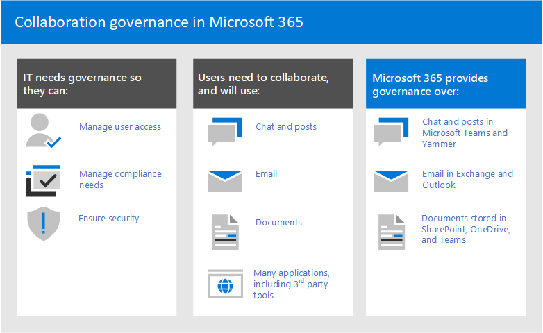

# O que é governança de colaboração?What is collaboration governance?

A governança de colaboração é como você gerencia o acesso dos usuários aos recursos, a conformidade com os padrões de negócios e garante a segurança dos seus dados.Collaboration governance is how you manage users' access to resources, compliance with your business standards, and ensure the security of your data.

As organizações de hoje estão usando um conjunto de ferramentas diversificado.Organizations today are using a diverse tool set. Há a equipe de desenvolvedores usando o chat de equipe, os executivos enviando emails e toda a organização se conectando ao social da empresa.There's the team of developers using team chat, the executives sending email, and the entire organization connecting over enterprise social. Várias ferramentas de colaboração estão em uso porque cada grupo é exclusivo e tem suas próprias necessidades funcionais e estilo de trabalho.Multiple collaboration tools are in use because every group is unique and has their own functional needs and work style. Alguns usarão apenas emails enquanto outros irão morar principalmente no chat.Some will use only email while others will live primarily in chat. 

Se os usuários sentirem que as ferramentas fornecidas por IT não se ajustam às suas necessidades, provavelmente baixarão seu aplicativo de consumidor favorito que oferece suporte a seus cenários.If users feel the IT-provided tools do not fit their needs, they will likely download their favorite consumer app which supports their scenarios. Embora esse processo permita aos usuários começar rapidamente, ele leva a uma experiência de usuário frustrante em toda a organização com vários logons, compartilhamento de dificuldade e nenhum único local para exibir conteúdo.Although this process allows users to get started quickly, it leads to a frustrating user experience across the organization with multiple logins, difficulty sharing, and no single place to view content. Esse conceito é conhecido como "SHADOW IT" e representa um risco significativo para as organizações.This concept is referred to as “Shadow IT” and poses a significant risk to organizations. Ele reduz a capacidade de gerenciar uniformemente o acesso do usuário, garantir a segurança e as necessidades de conformidade do serviço.It reduces the ability to uniformly manage user access, ensure security, and service compliance needs.

Serviços como grupos de Microsoft 365, Teams e Yammer capacitam os usuários e reduz o risco de sombra de IT fornecendo as ferramentas necessárias para colaborar.Services such as Microsoft 365 groups, Teams, and Yammer empower users and reduces the risk of shadow IT by providing the tools needed to collaborate. Microsoft 365 tem um conjunto rico de ferramentas para implementar todos os recursos de governança que sua organização possa exigir.Microsoft 365 has a rich set of tools to implement any governance capabilities your organization might require. 

Esta série de artigos ajudará você a entender como grupos, equipes e configurações SharePoint interagem, quais recursos de governança estão disponíveis e como criar e implementar um plano de governança para os recursos de colaboração no Microsoft 365.This series of articles will help you understand how groups, teams, and SharePoint settings interact, what governance capabilities are available, and how to create and implement a governance plan for the collaboration features in Microsoft 365.

### Configurar a colaboração segura com Microsoft 365Setting up secure collaboration with Microsoft 365

Há muitas opções para implantar Microsoft 365 Grupos e Teams para colaboração segura em sua organização.There are many options for deploying Microsoft 365 Groups and Teams for secure collaboration in your organization. Recomendamos que você use esse conteúdo de governança juntamente com Configurar a colaboração segura com o [Microsoft 365](setup-secure-collaboration-with-teams.md) e seus artigos associados para criar a melhor solução de colaboração para sua organização.We recommend you use this governance content alongside [Set up secure collaboration with Microsoft 365](setup-secure-collaboration-with-teams.md) and its associated articles to create the best collaboration solution for your organization.

### Residência de dadosData residency

Se sua organização for multi-nacional e você tiver requisitos de residência de dados para diferentes regiões geográficas, inclua Microsoft 365 [Multigeograf](/microsoft-365/enterprise/microsoft-365-multi-geo) como parte do seu plano de governança de colaboração.If your organization is multi-national and you have data residency requirements for different geographies, include [Microsoft 365 Multi-Geo](/microsoft-365/enterprise/microsoft-365-multi-geo) as part of your collaboration governance plan.

## Por Microsoft 365 grupos são importantesWhy Microsoft 365 groups are important

Microsoft 365 grupos permite que você escolha um conjunto de pessoas com as quais deseja colaborar e facilmente configurar uma coleção de recursos para essas pessoas compartilharem.Microsoft 365 groups lets you choose a set of people with whom you wish to collaborate, and easily set up a collection of resources for those people to share. A adição de membros ao grupo concede automaticamente as permissões necessárias a todos os ativos fornecidos pelo grupo.Adding members to the group automatically grants the needed permissions to all assets provided by the group. Os Teams e Yammer usam Microsoft 365 para gerenciar sua associação.Both Teams and Yammer use Microsoft 365 groups to manage their membership.

Microsoft 365 grupos incluem um pacote de recursos vinculados que os usuários podem usar para comunicação e colaboração.Microsoft 365 groups include a suite of linked resources that users can use for communication and collaboration. Os grupos sempre incluem um site SharePoint, o Planner, um Power BI de trabalho, uma caixa de correio e um calendário e Stream.Groups always include a SharePoint site, Planner, a Power BI workspace, a mailbox and calendar, and Stream. Dependendo de como você cria o grupo, você pode, opcionalmente, adicionar outros serviços, como Teams, Yammer e Project.Depending on how you create the group, you can optionally add other services such as Teams, Yammer, and Project.

|RecursoResource|DescriçãoDescription|
|:------|:----------|
|[CalendarCalendar](https://support.office.com/article/schedule-a-meeting-on-a-group-calendar-in-outlook-0cf1ad68-1034-4306-b367-d75e9818376a)|Para agendar eventos relacionados ao grupoFor scheduling events related to the group|
|[Caixa de EntradaInbox](https://support.office.com/article/have-a-group-conversation-in-outlook-a0482e24-a769-4e39-a5ba-a7c56e828b22)|Para conversas por email entre membros do grupo.For email conversations between group members. Essa caixa de entrada tem um endereço de email e pode ser definida para aceitar mensagens de pessoas de fora do grupo e até fora da sua organização, bem como uma lista de distribuição tradicional.This inbox has an email address and can be set to accept messages from people outside the group and even outside your organization, much like a traditional distribution list.|
|[Bloco de anotações do OneNoteOneNote notebook](https://support.office.com/article/get-started-with-onenote-e768fafa-8f9b-4eac-8600-65aa10b2fe97)|Para reunir ideias, pesquisas e informaçõesFor gathering ideas, research, and information|
|[PlanejadorPlanner](https://support.office.com/article/microsoft-planner-help-4a9a13c6-3adf-4a60-a6fc-15c0b15e16fc)|Para atribuir e gerenciar tarefas de projeto entre os membros do grupoFor assigning and managing project tasks among your group members|
|[Power BI Espaço de trabalhoPower BI Workspace](/power-bi/collaborate-share/service-new-workspaces)|Um espaço de colaboração de dados com painéis e relatóriosA data collaboration space with dashboards and reports|
|[Project e RoteiroProject and Roadmap](https://support.microsoft.com/project)|Ferramentas de gerenciamento de projetos baseadas na WebWeb-based project management tools|
|[Site de equipe do SharePointSharePoint team site](https://support.office.com/article/what-is-a-sharepoint-team-site-75545757-36c3-46a7-beed-0aaa74f0401e)|Um repositório central para informações, links e conteúdo relacionado ao seu grupoA central repository for information, links and content relating to your group|
|[StreamStream](https://support.microsoft.com/microsoft-stream)|Um serviço de streaming de vídeoA video streaming service|
|[TeamsTeams](https://support.microsoft.com/teams)|Um espaço de trabalho baseado em chat no Microsoft 365A chat-based workspace in Microsoft 365|
|[Yammer grupoYammer group](https://support.office.com/article/Learn-about-Office-365-groups-b565caa1-5c40-40ef-9915-60fdb2d97fa2)|Um lugar comum para ter conversas e compartilhar informaçõesA common place to have conversations and share information|

Microsoft 365 Os grupos incluem uma variedade de controles de governança, incluindo uma política de expiração, convenções de nomenis e uma política de palavras bloqueadas, para ajudá-lo a gerenciar grupos em sua organização.Microsoft 365 Groups includes a variety of governance controls, including an expiration policy, naming conventions, and a blocked words policy, to help you manage groups in your organization. Como os grupos controlam a associação e o acesso a esse pacote de recursos, o gerenciamento de grupos é uma parte fundamental do controle da colaboração no Microsoft 365.Because groups control membership and access to this suite of resources, managing groups is a key part of governing collaboration in Microsoft 365.

## Definir uma estratégia de colaboração para sua organizaçãoDefine a collaboration strategy for your organization

Há vários locais para colaborar e ter conversas dentro Microsoft 365.There are multiple places to collaborate and have conversations within Microsoft 365. Entender onde os usuários podem iniciar conversas pode ajudá-lo a definir uma estratégia para comunicação.Understanding where users can start conversations can help you define a strategy for communication.

Há três métodos de comunicação principais suportados por Microsoft 365:There are three main communication methods supported by Microsoft 365:

- Outlook: colaboração por email com uma caixa de entrada de grupo compartilhada e calendárioOutlook: collaboration through email with a shared group inbox and calendar
- Microsoft Teams: um espaço de trabalho baseado em chat persistente onde você pode ter conversas informais, em tempo real, em torno de uma variedade de tópicos, organizadas por sub-grupos específicosMicrosoft Teams: a persistent-chat-based workspace where you can have informal, real-time, conversations around a variety of topics, organized by specific sub-groups
- Yammer: experiência social corporativa para colaboraçãoYammer: enterprise social experience for collaboration

- Teams: espaço de trabalho baseado em chat (colaboração de alta velocidade) – loop internoTeams: chat-based workspace (high velocity collaboration) – inner loop
  - Criado para colaboração com as pessoas com as que seus usuários trabalham todos os diasBuilt for collaboration with the people your users work with every day
  - Coloca informações na ponta dos dedos dos usuários em uma única experiênciaPuts information at the fingertips of users in a single experience
  - Adicionar guias, conectores e botsAdd tabs, connectors and bots
  - Chat ao vivo, conferência de áudio/vídeo, reuniões gravadasLive chat, audio/video conferencing, recorded meetings

- Yammer: conectar-se entre a organização (social da empresa) – loop externoYammer: connect across the org (enterprise social) – outer loop
  - Comunidades de prática - grupos multifuncionais de pessoas que compartilham um interesse comum ou experiência, mas não estão necessariamente trabalhando juntos no dia a diaCommunities of practice - Cross-functional groups of people who share a common interest or expertise but are not necessarily working together on a day-to-day basis
  - Conexão de liderança, comunidades de aprendizagem, comunidades baseadas em funçãoLeadership connection, learning communities, role-based communities

- Caixa de correio e calendário (colaboração baseada em email)Mailbox and calendar (email-based collaboration)
  - Usado para comunicação direcionada com um grupo de pessoasUsed for targeted communication with a group of people
  - Calendário compartilhado para reuniões com outros membros do grupoShared calendar for meetings with other group members
 
Ao determinar como você deseja usar recursos de colaboração no Microsoft 365, considere esses métodos de comunicação e quais seus usuários provavelmente usarão em cenários diferentes.As you determine how you want to use collaboration features in Microsoft 365, consider these methods of communication and which your users are likely to use in different scenarios.

> [!NOTE]
> Quando um novo Office 365 Group é criado por meio de Yammer ou Teams, o grupo não fica visível no Outlook ou no livro de endereços porque a comunicação primária entre esses usuários acontece em seus respectivos clientes.When a new Office 365 Group is created via Yammer or Teams, the group isn't visible in Outlook or the address book because the primary communication between those users happens in their respective clients. Yammer grupos não podem ser conectados a Teams.Yammer groups cannot be connected to Teams.

## Práticas recomendadasBest practices

Ao iniciar seu processo de planejamento de governança, tenha estas práticas recomendadas em mente:As you start your governance planning process, keep these best practices in mind:

- **Converse com seus usuários** - identifique seus maiores usuários de recursos de colaboração e se encontre com eles para entender seus principais requisitos de negócios e usar cenários de caso.**Talk to your users** - identify your biggest users of collaboration features and meet with them to understand their core business requirements and use case scenarios.

- **Balancear riscos e benefícios** - revise suas necessidades comerciais, regulatórias, legais e de conformidade e planeje uma solução otimizada para todos os resultados.**Balance risks and benefits** - review your business, regulatory, legal, and compliance needs and plan a solution that optimizes for all outcomes.

- **Adapte-se** a diferentes organizações e diferentes tipos de conteúdo e cenários - considere as diferentes necessidades para diferentes grupos ou departamentos e diferentes tipos de conteúdo, como conteúdo intranet versus conteúdo OneDrive do usuário.**Adapt to different organizations and different types of content and scenarios** - consider the different needs for different groups or departments and different types of content such as intranet content versus a user's OneDrive content.

- **Alinhar-se às prioridades** de negócios - as metas de negócios ajudarão você a definir quanto tempo e energia você precisa para investir em governança.**Align to business priorities** - business goals will help you define how much time and energy you need to invest in governance.

- **Incorporar decisões de governança diretamente** nas soluções que você cria - muitas decisões de governança podem ser implementadas ao ligar ou desligar recursos em Microsoft 365.**Embed governance decisions directly in the solutions you create** - many governance decisions can be implemented by turning on or off features in Microsoft 365.

- **Use uma abordagem em fases** - Role os recursos de colaboração para um pequeno grupo de usuários primeiro.**Use a phased approach** - Roll collaboration features out to a small group of users first. Receba comentários deles, assista a tíquetes de help desk e atualize as configurações ou processos necessários antes de prosseguir para um grupo maior.Get feedback from them, watch for help desk tickets, and update any needed settings or processes before proceeding to a larger group.

- **Reforçar com treinamento** - adapte soluções como Microsoft 365 de aprendizado para garantir que suas expectativas [específicas](/office365/customlearning) da organização sejam reforçadas com o treinamento fornecido pela Microsoft.**Reinforce with training** - adapt solutions such as [Microsoft 365 learning pathways](/office365/customlearning) to ensure that your organization-specific expectations are reinforced with Microsoft-provided training.

- **Tenha uma estratégia para** comunicar políticas e diretrizes de governança em sua organização - crie um Centro de Adoção Microsoft 365 em um site de comunicação SharePoint para comunicar políticas e procedimentos.**Have a strategy for communicating governance policies and guidelines in your organization** - create a Microsoft 365 Adoption Center in a SharePoint communication site to communicate policies and procedures.

- **Definir funções e responsabilidades** - identificar sua equipe principal de governança e trabalhar por meio de decisões de governança principais sobre provisionamento e nomenisagem e acesso externo primeiro e, em seguida, trabalhar pelas decisões restantes.**Define roles and responsibilities** - identify your governance core team and work through key governance decisions about provisioning and naming and external access first, and then work through the remaining decisions.

- **Revisite suas decisões conforme as mudanças comerciais e tecnológicas** - reunir-se periodicamente para revisar novos recursos e novas expectativas de negócios.**Revisit your decisions as business and technology changes** - meet periodically to review new capabilities and new business expectations.

Para ver mais de perto essas práticas, leia [Criar seu plano de governança de colaboração.](collaboration-governance-first.md)For a closer look at these practices, read [Create your collaboration governance plan](collaboration-governance-first.md).

## Gerenciamento de alterações e impacto do usuário finalEnd user impact and change management

Como grupos e equipes podem ser criados de várias maneiras, recomendamos treinar seus usuários para usar o método que se ajuste melhor à sua organização:Because groups and teams can be created in several ways, we recommend training your users to use the method that fits your organization the best:

- Se a sua organização fizer a maior parte da comunicação usando email, instrua os usuários a criar grupos Outlook.If your organization does most of its communication using email, instruct your users to create groups in Outlook.
- Se sua organização usa muito SharePoint ou está migrando do SharePoint local, instrua os usuários a criarem sites SharePoint equipe para colaboração.If your organization heavily uses SharePoint or is migrating from SharePoint on-premises, instruct your users to create SharePoint team sites for collaboration.
- Se sua organização tiver implantado Teams, instrua os usuários a criar uma equipe quando precisam de um espaço de colaboração.If your organization has deployed Teams, instruct your users to create a team when they need need a collaboration space.

Isso ajuda a evitar confusão se os usuários não estão familiarizados com a forma como os grupos se relacionam com seus serviços relacionados.This helps avoid confusion if users are unfamiliar with how groups relate to their related services. Para obter mais informações sobre como falar com seus usuários sobre grupos, consulte [Explicando Microsoft 365 grupos para seus usuários.](../admin/create-groups/explain-groups-knowledge-worker.md)For more information about how to talk to your users about groups, see [Explaining Microsoft 365 Groups to your users](../admin/create-groups/explain-groups-knowledge-worker.md).

## Principais recursos de governança e requisitos de licenciamentoKey governance capabilities and licensing requirements

Os recursos de governança para colaboração no Microsoft 365 incluem recursos em Microsoft 365, Teams, SharePoint e Azure Active Directory.Governance capabilities for collaboration in Microsoft 365 include features in Microsoft 365, Teams, SharePoint, and Azure Active Directory.

| Capcidade ou recursoCapability or feature | DescriçãoDescription | LicençasLicensing |
|:----------------------|:------------|:----------|
|Compartilhamento de equipe e siteTeam and site sharing|Controlar se equipes, grupos e sites podem ser compartilhados com pessoas fora da sua organização.Control if teams, groups, and sites can be shared with people outside your organization.|Microsoft 365 E5 ou E3Microsoft 365 E5 or E3|
|Domínio allow/blockDomain allow/block|Restringir o compartilhamento com pessoas de fora da sua organização a pessoas de domínios específicos.Restrict sharing with people outside your organization to people from specific domains.|Microsoft 365 E5 ou E3Microsoft 365 E5 or E3|
|Criação de site de autoatendimentoSelf-service site creation|Permitir ou impedir que os usuários criam seus próprios SharePoint sites.Allow or prevent users from creating their own SharePoint sites.|Microsoft 365 E5 ou E3Microsoft 365 E5 or E3|
|Compartilhamento de arquivos e sites restritosRestricted site and file sharing|Restringir o compartilhamento de sites, arquivos e pastas a membros de um grupo de segurança específico.Restrict site, file, and folder sharing to members of a specific security group.|Microsoft 365 E5 ou E3Microsoft 365 E5 or E3|
|Criação de grupo restritoRestricted group creation|Restringir a criação de equipe e grupo a membros de um grupo de segurança específico.Restrict team and group creation to members of a specific security group.|Microsoft 365 E5 ou E3 com licenças do Azure AD Premium ou do Azure AD Basic EDUMicrosoft 365 E5 or E3 with Azure AD Premium or Azure AD Basic EDU licenses|
|Política de nomenis de grupoGroup naming policy|Impor prefixos ou sufixos em nomes de grupo e equipe.Enforce prefixes or suffixes on group and team names.|Microsoft 365 E5 ou E3 com licenças do Azure AD Premium ou do Azure AD Basic EDUMicrosoft 365 E5 or E3 with Azure AD Premium or Azure AD Basic EDU licenses|
|Política de expiração de grupoGroup expiration policy|Definir grupos e equipes inativas para expirar e serem excluídos após um período especificado.Set inactive groups and teams to expire and be deleted after a specified period of time.|Microsoft 365 E5 ou E3 com licenças Premium Azure ADMicrosoft 365 E5 or E3 with Azure AD Premium licenses|
|Acesso de visitantes por grupoPer-group guest access|Permitir ou impedir o compartilhamento de equipe e grupo com pessoas de fora da sua organização por grupo.Allow or prevent team and group sharing with people outside your organization on a per-group basis.|Microsoft 365 E5 ou E3Microsoft 365 E5 or E3|

## Planejamento de governança de colaboração passo a passoCollaboration governance planning step-by-step

Siga estas etapas básicas para criar seu plano de governança:Follow these basic steps to create your governance plan:

1. Considere as principais metas de negócios e processos - [crie seu plano de governança](collaboration-governance-first.md) para atender às necessidades da sua empresa.Consider key business goals and processes - [create your governance plan](collaboration-governance-first.md) to meet the needs of your business.
2. Entenda as configurações nos serviços [-](groups-sharepoint-governance.md) configurações em grupos e SharePoint interagem entre si, bem como configurações em [grupos,](groups-sharepoint-teams-governance.md) SharePoint e Teams e outros [serviços](groups-services-interactions.md).Understand settings in services - [settings in groups and SharePoint](groups-sharepoint-governance.md) interact with each other, as do [settings in groups, SharePoint and Teams](groups-sharepoint-teams-governance.md) and [other services](groups-services-interactions.md). Certifique-se de entender essas interações ao planejar sua estratégia de governança.Be sure to understand these interactions as you plan your governance strategy.
3. Planeje gerenciar o acesso do usuário - planeje o nível de acesso que você deseja conceder aos usuários em [grupos,](groups-teams-access-governance.md)SharePoint e Teams .Plan to manage user access - plan [the level of access you want to grant users in groups, SharePoint, and Teams](groups-teams-access-governance.md).
4. Planejar o gerenciamento de configurações de conformidade - revise as opções de conformidade disponíveis para Microsoft 365 [grupos,](groups-teams-compliance-governance.md)Teams e SharePoint colaboração .Plan to manage compliance settings - review the available [compliance options for Microsoft 365 groups, Teams, and SharePoint collaboration](groups-teams-compliance-governance.md).
5. Planejar o gerenciamento de comunicações - revise as opções de governança de [comunicações disponíveis para cenários de colaboração.](groups-teams-communication-governance.md)Plan to manage communications - review the available [communications governance options for collaboration scenarios](groups-teams-communication-governance.md).
6. Planejar a governança da organização e do ciclo de vida - escolha as políticas que você deseja usar para criação de grupo e [equipe, nomeação,](plan-organization-lifecycle-governance.md)expiração e arquivamento.Plan for organization and lifecycle governance - choose [the policies you want to use for group and team creation, naming, expiration, and archiving](plan-organization-lifecycle-governance.md). Além disso, entenda o [fim das opções de ciclo de vida para grupos, equipes e Yammer](end-life-cycle-groups-teams-sites-yammer.md)Also, understand the [end of lifecycle options for groups, teams, and Yammer](end-life-cycle-groups-teams-sites-yammer.md)

## Treinamento para administradoresTraining for administrators

Esses módulos de treinamento do Microsoft Learn podem ajudá-lo a aprender os recursos de governança no Microsoft 365.These training modules from Microsoft Learn can help you learn the governance features in Microsoft 365.

#### Proteção de informaçõesInformation protection

|Treinamento:Training:|Gerenciar proteção e governança de informaçõesManage information protection and governance|
|:---|:---|
||A quantidade de dados gerados hoje está crescendo mais rápido do que nunca, os funcionários querem ter o trabalho feito em todos os lugares e o cenário regulatório está mudando constantemente.The amount of data being generated today is growing faster than ever, employees want to get work done everywhere, and the regulatory landscape is constantly changing. As soluções da Microsoft para proteção de informações e governança ajudam as organizações a atingirem o equilíbrio certo entre manter seus dados protegidos e seu pessoal produtivo.Microsoft's solutions for information protection and governance help organizations achieve the right balance between keeping their data protected and their people productive. Este caminho de aprendizagem pode ajudar você a se preparar para as certificações Microsoft 365 Certified: Administrador de Segurança Associado e Microsoft 365 Certified: Especialista em Administração Corporativa.This learning path can help you prepare for the Microsoft 365 Certified: Security Administrator Associate and Microsoft 365 Certified: Enterprise Administration Expert certifications.  5 hr 13 min - Caminho de Aprendizagem - 7 Módulos5 hr 13 min - Learning Path - 7 Modules|

> [!div class="nextstepaction"]
> [Iniciar >Start >](/learn/modules/m365-compliance-information-governance/introduction/)

  

|Treinamento:Training:|Proteja as informações da empresa com o Microsoft 365Protect enterprise information with Microsoft 365|
|:---|:---|
||Garantir a proteção e a segurança das informações da sua organização está mais difícil que nunca.Protecting and securing your organization's information is more challenging than ever. O caminho de aprendizagem Proteger informações corporativas com o Microsoft 365 descreve como proteger as informações confidenciais contra compartilhamento excessivo acidental ou uso impróprio, como descobrir e classificar dados, como protegê-los com rótulos de confidencialidade e como monitorar e analisar suas informações confidenciais para proteger contra a perda.The Protect enterprise information with Microsoft 365 learning path discusses how to protect your sensitive information from accidental oversharing or misuse, how to discover and classify data, how to protect it with sensitivity labels, and how to both monitor and analyze your sensitive information to protect against its loss. Esse caminho de aprendizado pode ajudá-lo a se preparar para o Microsoft 365 Certificado: Associado do Administrador de Segurança e certificado Microsoft 365 Certificado: Enterprise Certificações de Especialista em Administração..This learning path can help you prepare for the Microsoft 365 Certified: Security Administrator Associate and Microsoft 365 Certified: Enterprise Administration Expert certifications..  1 hr - Caminho de Aprendizagem - 5 Módulos1 hr - Learning Path - 5 Modules|

> [!div class="nextstepaction"]
> [Iniciar >Start >](/learn/modules/m365-security-info-overview/introduction/)

#### Segurança e conformidadeSecurity and compliance

|Treinamento:Training:|Demonstrar conhecimento fundamental das funcionalidades de segurança e conformidade do Microsoft 365Demonstrate fundamental knowledge of Microsoft 365 security and compliance capabilities|
|:---|:---|
||Saiba mais sobre as áreas de soluções de segurança e conformidade do Microsoft 365 e os recursos disponíveis para ajudar as empresas a proteger sua empresa e atender aos requisitos regulamentadores.Learn about the Microsoft 365 security and compliance solutions areas and the capabilities available to help enterprises secure their enterprise and meet regulatory requirements. Se você não estiver familiarizado com conceitos básicos de computação em nuvem, recomendamos que você leve Conceitos de Nuvem [- Princípios da computação em nuvem.](/learn/modules/principles-cloud-computing/index)If you're unfamiliar with basic cloud computing concepts, we recommend you take [Cloud Concepts - Principles of cloud computing](/learn/modules/principles-cloud-computing/index).  3 hr 11 min - Caminho de Aprendizagem - 8 Módulos3 hr 11 min - Learning Path - 8 Modules|

> [!div class="nextstepaction"]
> [Iniciar >Start >](/learn/modules/what-is-m365/1-introduction/)

## IlustraçõesIllustrations

Essas ilustrações ajudarão você a entender como grupos e equipes interagem com outros serviços no Microsoft 365 e quais recursos de governança e conformidade estão disponíveis para ajudá-lo a gerenciar esses serviços em sua organização.These illustrations will help you understand how groups and teams interact with other services in Microsoft 365 and what governance and compliance features are available to help you manage these services in your organization.

### Grupos no Microsoft 365 para arquitetos de TIGroups in Microsoft 365 for IT Architects
O que os arquitetos de TI precisam saber sobre os grupos no Microsoft 365What IT architects need to know about groups in Microsoft 365

|**Item****Item**|**Descrição****Description**|
|:-----|:-----|
|   [PDF](https://github.com/MicrosoftDocs/microsoft-365-docs/raw/public/microsoft-365/downloads/msft-m365-groups.pdf) \| [Visio](https://github.com/MicrosoftDocs/OfficeDocs-Enterprise/raw/live/Enterprise/downloads/msft-m365-groups.vsdx)[PDF](https://github.com/MicrosoftDocs/microsoft-365-docs/raw/public/microsoft-365/downloads/msft-m365-groups.pdf) \| [Visio](https://github.com/MicrosoftDocs/OfficeDocs-Enterprise/raw/live/Enterprise/downloads/msft-m365-groups.vsdx)   Atualizado em junho de 2019Updated June 2019|Essas ilustrações detalham os diferentes tipos de grupos, como eles são criados e gerenciados e algumas recomendações de governança.These illustrations detail the different types of groups, how these are created and managed, and a few governance recommendations.|

### Microsoft Teams e serviços de produtividade relacionados no Microsoft 365 para arquitetos de TIMicrosoft Teams and related productivity services in Microsoft 365 for IT architects
A arquitetura lógica dos serviços de produtividade no Microsoft 365, liderada pelo Microsoft Teams.The logical architecture of productivity services in Microsoft 365, leading with Microsoft Teams.

|**Item****Item**|**Descrição****Description**|
|:-----|:-----|
|   [PDF](https://github.com/MicrosoftDocs/microsoft-365-docs/raw/public/microsoft-365/downloads/msft-m365-teams-logical-architecture.pdf) \| [Visio](https://github.com/MicrosoftDocs/OfficeDocs-Enterprise/raw/live/Enterprise/downloads/msft-m365-teams-logical-architecture.vsdx)[PDF](https://github.com/MicrosoftDocs/microsoft-365-docs/raw/public/microsoft-365/downloads/msft-m365-teams-logical-architecture.pdf) \| [Visio](https://github.com/MicrosoftDocs/OfficeDocs-Enterprise/raw/live/Enterprise/downloads/msft-m365-teams-logical-architecture.vsdx)   Atualizado em abril de 2019Updated April 2019   |A Microsoft fornece um conjunto de serviços de produtividade que trabalham juntos para fornecer experiências de colaboração com recursos de governança de dados, segurança e conformidade.Microsoft provides a suite of productivity services that work together to provide collaboration experiences with data governance, security, and compliance capabilities.    Esta série de ilustrações oferece uma visão da arquitetura lógica dos serviços de produtividade para arquitetos empresariais, liderada pelo Microsoft Teams.This series of illustrations provides a view into the logical architecture of productivity services for enterprise architects, leading with Microsoft Teams.|

### Microsoft 365 proteção de informações e recursos de conformidadeMicrosoft 365 information protection and compliance capabilities

Microsoft 365 inclui um amplo conjunto de recursos de proteção e conformidade de informações.Microsoft 365 includes a broad set of information protection and compliance capabilities. Juntamente com as ferramentas de produtividade da Microsoft, esses recursos foram projetados para ajudar as organizações a colaborarem em tempo real enquanto aderem a estruturas de conformidade regulamentar rigorosas.Together with Microsoft’s productivity tools, these capabilities are designed to help organizations collaborate in real time while adhering to stringent regulatory compliance frameworks. 

Esse conjunto de ilustrações usa um dos setores mais regulamentados, serviços financeiros, para demonstrar como esses recursos podem ser aplicados para atender aos requisitos regulatórios comuns.This set of illustrations uses one of the most regulated industries, financial services, to demonstrate how these capabilities can be applied to address common regulatory requirements. Sinta-se à vontade para adaptar essas ilustrações para seu próprio uso.Feel free to adapt these illustrations for your own use. 

| ItemItem | DescriçãoDescription |
|:-----|:-----|
|   Inglês: [Baixar como PDF](https://download.microsoft.com/download/3/a/6/3a6ab1a3-feb0-4ee2-8e77-62415a772e53/m365-compliance-illustrations.pdf)  \| [Baixar como Visio](https://download.microsoft.com/download/3/a/6/3a6ab1a3-feb0-4ee2-8e77-62415a772e53/m365-compliance-illustrations.vsdx)English: [Download as a PDF](https://download.microsoft.com/download/3/a/6/3a6ab1a3-feb0-4ee2-8e77-62415a772e53/m365-compliance-illustrations.pdf)  \| [Download as a Visio](https://download.microsoft.com/download/3/a/6/3a6ab1a3-feb0-4ee2-8e77-62415a772e53/m365-compliance-illustrations.vsdx)   Japonês: [Baixar como PDF](https://download.microsoft.com/download/6/f/1/6f1a7d0e-dd8e-442e-b073-8e94327ae4f8/m365-compliance-illustrations.pdf)  \| [Baixar como Visio](https://download.microsoft.com/download/6/f/1/6f1a7d0e-dd8e-442e-b073-8e94327ae4f8/m365-compliance-illustrations.vsdx)Japanese: [Download as a PDF](https://download.microsoft.com/download/6/f/1/6f1a7d0e-dd8e-442e-b073-8e94327ae4f8/m365-compliance-illustrations.pdf)  \| [Download as a Visio](https://download.microsoft.com/download/6/f/1/6f1a7d0e-dd8e-442e-b073-8e94327ae4f8/m365-compliance-illustrations.vsdx)   Atualizado em novembro de 2020Updated November 2020|Contém:Includes: <ul><li>  Proteção de informações e prevenção contra perda de dados da MicrosoftMicrosoft information protection and data loss prevention</li><li>Políticas de retenção e rótulos de retençãoRetention policies and retention labels </li><li>Barreiras de informaçõesInformation barriers</li><li>Conformidade em comunicaçõesCommunication compliance</li><li>Gerenciamento de riscos internos.Insider risk</li><li>Inclusão de dados de terceirosThird-party data ingestion</li>|

## Sessões de conferênciaConference sessions

Assista a essas sessões de conferência para saber mais sobre governança para Microsoft 365 Grupos e Teams.Watch these conference sessions to learn more about governance for Microsoft 365 Groups and Teams.

**Fundamentos****Fundamentals**

Saiba os fundamentos e as novas inovações em Microsoft 365 Grupos, incluindo gerenciamento e governança em escala, práticas recomendadas para impulsionar o uso e adoção e o autoatendência.Learn the fundamentals and new innovations in Microsoft 365 Groups, including management and governance at scale, best practices for driving usage and adoption, and self-service.

- [Abraçar Microsoft 365 gruposEmbrace Microsoft 365 Groups](https://www.youtube.com/watch?v=dAamBF1gb7M)

**Governança****Governance**

Saiba como configurar o ciclo de vida de expiração dos grupos, nomear políticas, rótulos de classificação, colaboração com convidados externos e gerenciar permissões de criação de grupo.Learn how to set up your groups expiry lifecycle, naming policies, classification labels, collaboration with external guests, and manage group creation permissions.

- [Transformar a colaboração e a EQUIPE de sombra de combate com Office 365 gruposTransform collaboration and fight shadow IT with Office 365 groups](https://www.youtube.com/watch?v=Bhf_bKx3lAg)

**Exemplo de cliente****Customer example**

Consulte um exemplo de bastidores de como Microsoft 365 grupos, SharePoint, Teams e Yammer trabalham juntos para fornecer uma plataforma de colaboração global.See a behind-the-scenes example of how Microsoft 365 Groups, SharePoint, Teams, and Yammer work together to provide a global collaboration platform.

- [Encontrar seu ponto de Office 365 colaboração com grupos, SharePoint, Teams e YammerFinding your collaboration sweet spot with Office 365 Groups, SharePoint, Teams, and Yammer](https://www.youtube.com/watch?v=Rx9eVwqXeQk)

## Confira tambémSee also

[Documentação do Centro de segurança do Microsoft 365Microsoft 365 security documentation](../security/index.yml)

[Documentação de conformidade do Microsoft 365Microsoft 365 compliance documentation](../compliance/index.yml)