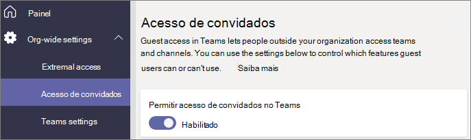

# Configurar equipes com proteção de linha de base

Neste artigo, veremos como implantar equipes com um nível de linha de base de proteção. Esse nível permite aos usuários uma grande variedade de opções de colaboração, melhorando o gerenciamento de permissões e fornecendo proteção básica contra o compartilhamento em excesso. As proteções recomendadas para esse nível incluem políticas de acesso a dispositivos e identidades e proteção contra malware. Além disso, você pode aplicar políticas de acesso condicional e proteções contra perda de dados, conforme necessário.

## Proteções iniciais

Como primeira etapa, recomendamos que você configure as políticas básicas de acesso a dispositivos e identidade. Para saber mais, confira [Recomendações de política para proteger conversas, grupos e arquivos no Teams](../security/office-365-security/teams-access-policies.md).

Também recomendamos ativar os recursos básicos do Defender para Office 365 para proteção contra malware em documentos, anexos e links. Recomendamos ativar cada uma das opções na tabela a seguir.

|Opção|Informações|
|:------|:-----------|
|Anexos seguros para SPO, Microsoft OneDrive e Microsoft Teams|[Anexos Seguros](../security/office-365-security/atp-safe-attachments.md) [Defender para Office 365 - Microsoft Office SharePoint Online, Microsoft OneDrive e Microsoft Teams](../security/office-365-security/atp-for-spo-odb-and-teams.md)|
|Documentos Seguros|[Documentos Seguros no Microsoft Defender para Office 365](../security/office-365-security/safe-docs.md)|
|Links Seguros para o Microsoft Teams|[Links seguros do Office 365 no Teams](../security/office-365-security/atp-safe-links.md#safe-links-settings-for-microsoft-teamssafe-links-settings-for-microsoft-teams) [Links Seguros](../security/office-365-security/atp-safe-links.md)|

## Compartilhamento de convidados no Teams

Em cada uma das camadas, temos a opção de compartilhar com pessoas de fora da sua organização. Para as camadas confidenciais e altamente confidenciais, temos a opção de desativar o compartilhamento de convidados no nível da equipe usando rótulos de confidencialidade. No entanto, a configuração de compartilhamento de convidados no nível da organização deve estar habilitada para que o compartilhamento de convidados funcione no Teams.

Para definir as configurações de acesso de convidado do Teams

1. Entre no Centro de administração do Microsoft 365 em [https://admin.microsoft.com](https://admin.microsoft.com).
2. Na barra de navegação esquerda, clique em **Mostrar tudo**.
3. Em **Centros de administração**, clique em **Teams**.
4. No Centro de administração do Teams, na navegação à esquerda, expanda **Configurações para toda a organização** e clique em **Acesso de convidado**.
5. Certifique-se de que **Permitir acesso de convidado no Teams** esteja definido como **Ativado**.
6. Faça as alterações desejadas nas configurações de convidado adicionais e clique em **Salvar**.

> [!NOTE]
> Depois de habilitá-la, pode levar até 24 horas para que a configuração de convidado do Teams se torne ativa.

O compartilhamento de convidados é habilitado por padrão para grupos do Office 365 e SharePoint, no entanto, se você alterou anteriormente qualquer uma das configurações de compartilhamento de convidados da sua organização, recomendamos que examine [Colaborar com convidados em uma equipe](./collaborate-as-team.md) para garantir que o compartilhamento de convidados esteja disponível no Teams.

## Compartilhamento de sites e arquivos

Para reduzir o risco de compartilhar acidentalmente arquivos ou pastas com pessoas de fora da sua organização, recomendamos alterar o link de compartilhamento padrão no SharePoint para *Somente as pessoas da sua organização*. (Se os usuários precisarem compartilhar externamente e você tiver habilitado o compartilhamento de convidados, eles ainda poderão alterar o tipo de link quando compartilharem.)

Para alterar o link de compartilhamento padrão
1. Abra o [Centro de Administração do SharePoint](https://admin.microsoft.com/sharepoint).
2. Em **Políticas**, clique em **Compartilhamento**.
3. Em **Links de arquivos e pastas**, selecione **Somente as pessoas da sua organização**.
4. Clique em **Salvar**.

Para obter a melhor experiência de compartilhamento de convidados, recomendamos também que você habilite a [Integração do SharePoint e do OneDrive com o B2B do Azure AD](/sharepoint/sharepoint-azureb2b-integration-preview).

## Criar uma equipe

A configuração adicional para o nível de linha de base de proteção foi realizada no site do SharePoint associado a uma equipe. [Crie uma equipe pública ou privada](https://support.office.com/article/174adf5f-846b-4780-b765-de1a0a737e2b) antes de prosseguir para a próxima seção.

## Configurações de compartilhamento de site

Por padrão, os membros de um site do SharePoint podem convidar outras pessoas para o site. Quando um site faz parte de uma equipe, os membros da equipe são incluídos como membros do site. No entanto, as pessoas adicionadas diretamente ao site não têm acesso ao restante da equipe. Por esse motivo, recomendamos o gerenciamento de permissões exclusivamente por meio da equipe.

Para ajudar com o gerenciamento de permissões, recomendamos configurar o site associado para permitir que somente os proprietários compartilhem o site por si só. Isso simplifica o gerenciamento de permissões e ajuda a impedir o acesso de pessoas sem o conhecimento do proprietário da equipe. Faça isso para cada equipe que precise da proteção da linha de base.

Para atualizar as configurações de compartilhamento de site
1. Na barra de ferramentas da equipe, clique em **Arquivos**.
2. Clique em **Abrir no SharePoint**.
3. Na barra de ferramentas do site do SharePoint, clique no ícone de configurações e, em seguida, clique em **Permissões do site**.
4. No painel **Permissões do site**, em **Compartilhamento do site**, clique em **Alterar como os membros podem compartilhar**.
5. Em **Compartilhar permissões**, escolha **Proprietários e membros do site e pessoas com permissões de edição podem compartilhar arquivos e pastas, mas apenas os proprietários do site podem compartilhar o site** e, em seguida, clique em **Salvar**.

## Proteções adicionais

O Microsoft 365 oferece métodos adicionais para proteger seu conteúdo. Considere se as seguintes opções ajudariam a melhorar a segurança da sua organização.

- Faça com que os convidados concordem com os [termos de uso](/azure/active-directory/conditional-access/terms-of-use).
- Configurar uma [política de tempo limite de sessão](/azure/active-directory/conditional-access/howto-conditional-access-session-lifetime) para convidados.
- Criar [tipos de informações confidenciais](../compliance/sensitive-information-type-learn-about.md) e usar a [proteção contra perda de dados](../compliance/data-loss-prevention-policies.md) para definir políticas de acesso a informações confidenciais.

## Confira também

[Gerenciar políticas de reunião no Teams](/microsoftteams/meeting-policies-in-teams)

[Introdução ao gerenciamento de riscos internos](../compliance/insider-risk-management-configure.md)