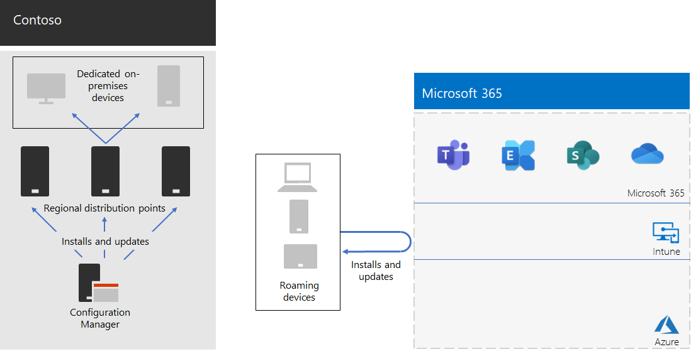

# Resposta e suporte do COVID-19 da Contoso para uma força de obra híbrida

A contoso sempre tinha suportado seus funcionários remotos, que acessaram recursos locais por meio de um servidor VPN central na sede de Paris. A contoso emitiu todos os funcionários remotos para um laptop gerenciado. Os funcionários locais tinham uma mistura de computadores desktop e laptops.

## Resposta da Contoso para o COVID-19

Com o OnSet do COVID-19 Pandemic, de repente, todos os funcionários essenciais eram funcionários remotos. A contoso respondeu pela mudança de sua força de trabalho para trabalhar de casa e conduzir suas atividades principais por meio de acesso remoto a recursos locais e online usando os serviços de nuvem da Microsoft 365.

A Contoso tinha servidores VPN de acesso remoto no escritório da sede de Paris para dar suporte aos 25% de sua força de equipe já remota, mas rapidamente movidos para aumentar a capacidade de acesso remoto da ti para suportar 90% de sua força de vida. A contoso implantou servidores VPN de acesso remoto em cada escritório de satélite para que os funcionários remotos usem um ponto de entrada de região de fechamento regional para acesso à intranet da contoso.

A contoso também atualizou a configuração de clientes VPN instalados em laptops, tablets e Smart Phones para o tunelamento dividido, de forma que o tráfego para o conjunto de otimização de pontos de extremidade do Office 365 ignorou a conexão VPN e tenha sido enviado diretamente pela Internet. Para obter mais informações, consulte [otimizar a conectividade do Office 365 para usuários remotos usando o túnel dividido VPN](../enterprise/microsoft-365-vpn-split-tunnel.md).

Aqui está a configuração resultante com dispositivos VPN instalados na sede de Paris e em cada um dos escritórios satélites. 

Um trabalhador remoto com o cliente VPN instalado usa o DNS para localizar o Office de região mais próximo e se conecta ao dispositivo VPN instalado lá. Com o tunelamento dividido, o tráfego para a Microsoft 365 otimizar os pontos de extremidade é enviado diretamente para o local da rede do Microsoft 365 em região mais próximo. Todo o outro tráfego é enviado pela conexão VPN ao dispositivo VPN.

## Suporte da Contoso para uma força de obra híbrida dinâmica

Depois que as alterações iniciais foram feitas para dar suporte à maioria dos funcionários remotos durante bloqueios regionais, a contoso fez alterações de infraestrutura para dar suporte a uma força de trabalho híbrida na qual um trabalhador poderia ser:

- Sempre remoto.
- Sempre no local.
- Uma combinação de remoto e local.

Os recursos de identidade, segurança e conformidade do Microsoft 365 foram projetados para nenhuma confiança e para funcionar independentemente do local do usuário e do dispositivo. Para obter mais informações, consulte [zero Trust](https://www.microsoft.com/security/business/zero-trust).

No entanto, gerenciar novas instalações e atualizações de software depende do local do dispositivo porque o software a ser instalado pode ser proveniente de uma fonte de Internet ou local. Os arquitetos de ti da Contoso projetaram sua nova infraestrutura de instalações e atualizações com base no local do dispositivo, em vez do trabalhador.

Eles designam dois tipos de dispositivos: dedicados local e roaming.

### Dedicado no local

Um dispositivo local dedicado é um computador desktop ou servidor que nunca deixa a intranet da Contoso e não tem um cliente VPN instalado. Esses dispositivos locais continuam a usar o Microsoft Endpoint Configuration Manager e seus pontos de distribuição para instalar e atualizar o Windows 10, o Microsoft 365 aplicativos para empresas e o navegador de borda.

### Roaming

Um dispositivo móvel pode sair da intranet contoso e inclui laptops emitidos para muitos funcionários do Office e todos os funcionários remotos e outros dispositivos de propriedade da organização, como Smart Phones e tablets com o cliente VPN da Contoso instalado. 

Como esses dispositivos podem ser conectados à Internet a qualquer momento, eles usam o Intune ou outros serviços baseados em nuvem para instalar e atualizar o Windows 10, o Microsoft 365 aplicativos para empresas e o Edge. Eles não usam os pontos de distribuição existentes do Gerenciador de configuração no local.

Isso significa que algumas das instalações e atualizações do dispositivo de roaming serão realizadas pela Internet enquanto elas estiverem no local e conectadas à intranet. Mas os arquitetos de ti da Contoso decidiram que a simplicidade da configuração era mais importante do que a otimização da largura de banda da intranet para a Internet, especialmente quando os funcionários remotos raramente estão conectados à intranet.

Esta é a infraestrutura resultante.

O comportamento de instalação e atualização é determinado ao tornar as contas de computador de dispositivos um membro de um destes grupos:

- OnPremDevices

  O cliente do Gerenciador de configurações do dispositivo usa pontos de distribuição para instalar e atualizar.

- RoamingDevices

  O Intune e outras configurações no dispositivo especificam o uso da rede Microsoft 365 para instalações e atualizações.

## Novo processo de integração

Para um novo dispositivo local dedicado emitido para um novo trabalhador ou para um novo servidor em um datacenter, quando o trabalhador entra, o cliente do Gerenciador de configurações com base na associação do dispositivo no grupo OnPremDevices baixa e instala as atualizações mais recentes para o Windows 10, o Microsoft 365 aplicativos para empresas e a borda de pontos de distribuição do Gerenciador de configuração local. Quando concluído, o dispositivo local dedicado estará pronto para uso e usará esses pontos de distribuição para atualizações contínuas.

Para um novo dispositivo remoto emitido para um novo trabalhador, quando o trabalhador entra, o dispositivo, com base em sua associação no grupo RoamingDevices, contata o serviço de nuvem do Intune e outros serviços e baixa e instala as atualizações mais recentes para o Windows 10, o Microsoft 365 aplicativos para empresas e o Edge. Quando concluído, o dispositivo remoto estará pronto para uso e usará o cliente VPN instalado para acessar os recursos locais e a rede do Microsoft 365 para atualizações contínuas.

## Próxima etapa

[Capacite os funcionários remotos](empower-people-to-work-remotely.md) em sua organização.
