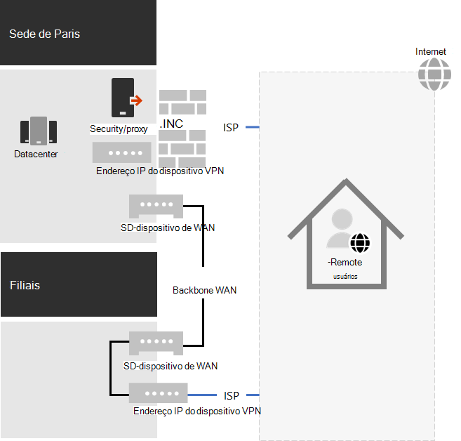
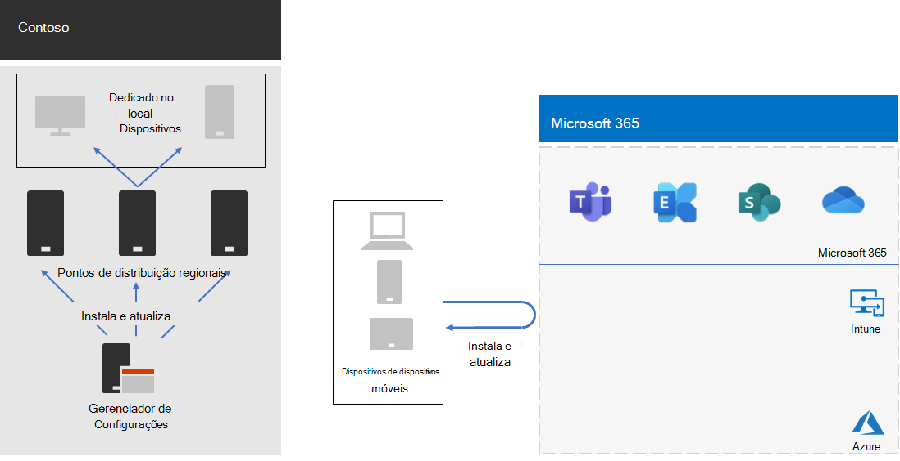

# Resposta e suporte do COVID-19 da Contoso para trabalho remoto e localContoso's COVID-19 response and support for remote and onsite work

A Contoso sempre apoiou seus funcionários remotos, que acessam recursos locais por meio de um servidor VPN central na sede de Paris.Contoso had always supported its remote workers, who accessed on-premises resources through a central VPN server in the Paris headquarters. A Contoso emitiu a todos os funcionários remotos um laptop gerenciado.Contoso had issued all remote workers a managed laptop. Os funcionários locais tinham uma mistura de computadores desktop e laptops.On-premises workers had a mixture of desktop computers and laptops.

## Resposta da Contoso ao COVID-19Contoso’s response to COVID-19

Com o início da pandemia do COVID-19, de repente, todos os trabalhadores essenciais eram trabalhadores remotos.With the onset of the COVID-19 pandemic, suddenly all but essential workers were remote workers. A Contoso respondeu mudando sua força de trabalho para trabalhar de casa e conduzir suas principais atividades por meio do acesso remoto a recursos locais e online usando serviços Microsoft 365 nuvem.Contoso responded by shifting its workforce to work from home and conduct its primary activities through remote access to on-premises resources and online using Microsoft 365 cloud services.

A Contoso tinha servidores VPN de acesso remoto no escritório da sede de Paris para dar suporte a 25% de sua força de trabalho já remota, mas foi rapidamente movida para ampliar sua capacidade de acesso remoto para dar suporte a 90% de sua força de trabalho.Contoso had remote access VPN servers in the Paris headquarters office to support the 25% of its already remote workforce, but quickly moved to scale up it's remote access capacity to support 90% of its workforce. A Contoso implantou servidores VPN de acesso remoto em cada escritório via satélite para que os funcionários remotos utilizasse um ponto de entrada de fechamento regional para acessar a intranet da Contoso.Contoso deployed remote access VPN servers in each satellite office so that remote workers would use a regionally close entry point for access to the Contoso intranet.

A Contoso também atualizou a configuração de clientes VPN instalados em laptops, tablets e smartphones para túnel dividido para que o tráfego para o conjunto otimizado de pontos de extremidade Office 365 ignorava a conexão VPN e era enviado diretamente pela Internet.Contoso also updated the configuration of VPN clients installed on laptops, tablets, and smart phones for split tunneling so that traffic for the Optimize set of Office 365 endpoints bypassed the VPN connection and was sent directly over the internet. Para obter mais informações, consulte [Optimize Office 365 connectivity for remote users using VPN split tunneling](../enterprise/microsoft-365-vpn-split-tunnel.md).For more information, see [Optimize Office 365 connectivity for remote users using VPN split tunneling](../enterprise/microsoft-365-vpn-split-tunnel.md).

Aqui está a configuração resultante com dispositivos VPN instalados na sede de Paris e em cada um dos escritórios de satélite.Here is the resulting configuration with VPN devices installed in the Paris headquarters and each of the satellite offices. 

Um trabalhador remoto com o cliente VPN instalado usa o DNS para encontrar o escritório regionalmente mais próximo e se conecta ao dispositivo VPN instalado lá.A remote worker with the installed VPN client uses DNS to find the regionally closest office and connects to the VPN device installed there. Com o túnel dividido, o tráfego para Microsoft 365 pontos de extremidade Otimizados é enviado diretamente para o local de rede regionalmente mais próximo Microsoft 365 rede.With split tunneling, traffic to Microsoft 365 Optimize endpoints gets sent directly to the regionally closest Microsoft 365 network location. Todos os outros tráfegos são enviados pela conexão VPN ao dispositivo VPN.All other traffic gets sent over the VPN connection to the VPN device.

## Suporte da Contoso para trabalho remoto e localContoso’s support for remote and onsite work

Depois que as alterações iniciais foram feitas para dar suporte principalmente a funcionários remotos durante bloqueios regionais, a Contoso fez alterações de infraestrutura para dar suporte ao trabalho remoto e local no qual um trabalhador poderia estar:After the initial changes were made to support mostly remote workers during regional lockdowns, Contoso made infrastructure changes to support remote and onsite work in which a worker could be:

- Sempre remoto.Always remote.
- Sempre no local.Always onsite.
- Uma combinação de local e remoto.A combination of onsite and remote.

Microsoft 365 de identidade, segurança e conformidade foram projetados para a Confiança Zero e para funcionar independentemente da localização do usuário e do dispositivo.Microsoft 365 identity, security, and compliance features are designed for Zero Trust and to work regardless of the location of the user and their device. Para obter mais informações, consulte [Zero Trust](https://www.microsoft.com/security/business/zero-trust).For more information, see [Zero Trust](https://www.microsoft.com/security/business/zero-trust).

No entanto, o gerenciamento de novas instalações e atualizações de software depende do local do dispositivo, pois o software a ser instalado pode vir de uma fonte local ou de internet.However, managing new installs and updates of software is dependent on the location of the device because the software to install could come from an on-premises or an internet source. Os arquitetos de TI da Contoso projetaram sua nova infraestrutura de instalação e atualizações com base no local do dispositivo, em vez do trabalhador.Contoso IT architects designed their new installs and updates infrastructure based on the location of the device, rather than the worker.

Eles designam dois tipos de dispositivos: local dedicado e roaming.They designated two types of devices: dedicated on-premises and roaming.

### Local dedicadoDedicated on-premises

Um dispositivo local dedicado é um computador desktop ou servidor que nunca sai da intranet da Contoso e não tem um cliente VPN instalado.A dedicated on-premises device is a desktop or server computer that never leaves the Contoso intranet and does not have a VPN client installed. Esses dispositivos locais continuam a usar o Microsoft Endpoint Configuration Manager e seus pontos de distribuição para instalações e atualizações de Windows 10, Microsoft 365 Apps para Grandes Empresas e o navegador de Borda.These on-premises devices continue to use Microsoft Endpoint Configuration Manager and its distribution points for installs and updates of Windows 10, Microsoft 365 Apps for enterprise, and the Edge browser.

### RoamingRoaming

Um dispositivo móvel pode sair da intranet da Contoso e inclui laptops emitidos para muitos funcionários do escritório e todos os funcionários remotos e outros dispositivos de propriedade da organização, como smartphones e tablets com o cliente VPN da Contoso instalado.A roaming device can leave the Contoso intranet and includes laptops issued to many office workers and all remote workers and other organization-owned devices such as smart phones and tablets with the Contoso VPN client installed. 

Como esses dispositivos podem ser conectados à Internet a qualquer momento, eles usam o Intune ou outros serviços baseados em nuvem para instalar e atualizar o Windows 10, o Microsoft 365 Apps para Grandes Empresas e o Edge.Because these devices can be connected to the Internet at any given time, they use Intune or other cloud-based services for installs and updates of Windows 10, Microsoft 365 Apps for enterprise, and Edge. Eles não usam os pontos de distribuição do Configuration Manager local existentes.They do not use the existing on-premises Configuration Manager distribution points.

Isso significa que algumas das instalações e atualizações do dispositivo móvel serão feitas pela Internet enquanto eles estão no local e conectados à intranet.This means some of the installs and updates for roaming device will be done over the internet while they are on-premises and connected to the intranet. Mas os arquitetos de TI da Contoso decidiram que a simplicidade da configuração era mais importante do que a otimização da largura de banda da intranet para a Internet, especialmente quando a maioria dos funcionários remotos raramente está conectada à intranet.But Contoso IT architects decided that simplicity of configuration was more important than optimization of intranet bandwidth to the internet, especially when most remote workers are seldom connected to the intranet.

Aqui está a infraestrutura resultante.Here is the resulting infrastructure.

O comportamento de instalação e atualização é determinado tornando as contas do computador dos dispositivos um membro de um desses grupos:Install and update behavior is determined by making the computer accounts of devices a member of one of these groups:

- OnPremDevicesOnPremDevices

  O cliente do Configuration Manager no dispositivo usa pontos de distribuição para instalar e atualizar.The Configuration Manager client on the device uses distribution points for installs and updates.

- RoamingDevicesRoamingDevices

  O Intune e outras configurações no dispositivo especificam o uso da rede Microsoft 365 para instalar e atualizar.Intune and other settings on the device specify the use of the Microsoft 365 network for installs and updates.

## Novo processo de integraçãoNew onboarding process

Para um novo dispositivo local dedicado emitido para um novo funcionário ou para um novo servidor em um datacenter, quando o trabalhador entrar, o cliente do Configuration Manager com base na associação do dispositivo no grupo OnPremDevices baixa e instala as atualizações mais recentes para Windows 10, Microsoft 365 Apps para Grandes Empresas e Edge dos pontos de distribuição do Configuration Manager local.For a new dedicated on-premises device issued to a new worker or for a new server in a datacenter, when the worker signs in, the Configuration Manager client based on the device's membership in the OnPremDevices group downloads and installs the latest updates for Windows 10, Microsoft 365 Apps for enterprise, and Edge from on-premises Configuration Manager distribution points. Quando concluído, o dispositivo local dedicado estará pronto para uso e usará esses pontos de distribuição para atualizações contínuas.When complete, the dedicated on-premises device is ready for use and uses these distribution points for ongoing updates.

Para um novo dispositivo remoto emitido para um novo trabalhador, quando o trabalhador entrar, o dispositivo, com base em sua associação ao grupo RoamingDevices, contata o serviço de nuvem do Intune e outros serviços e baixa e instala as atualizações mais recentes para Windows 10, Microsoft 365 Apps para Grandes Empresas e Edge.For a new remote device issued to a new worker, when the worker signs in, the device, based on its membership in the RoamingDevices group, contacts the Intune cloud service and other services and downloads and installs the latest updates for Windows 10, Microsoft 365 Apps for enterprise, and Edge. Quando concluído, o dispositivo remoto estará pronto para uso e usará o cliente VPN instalado para acesso aos recursos locais e à rede Microsoft 365 para atualizações contínuas.When complete, the remote device is ready for use and uses the installed VPN client for access to on-premises resources and the Microsoft 365 network for ongoing updates.

## Próxima etapaNext step

[Configurar sua infraestrutura para trabalho remoto](empower-people-to-work-remotely.md) em sua organização.[Set up your infrastructure for remote work](empower-people-to-work-remotely.md) in your organization.
