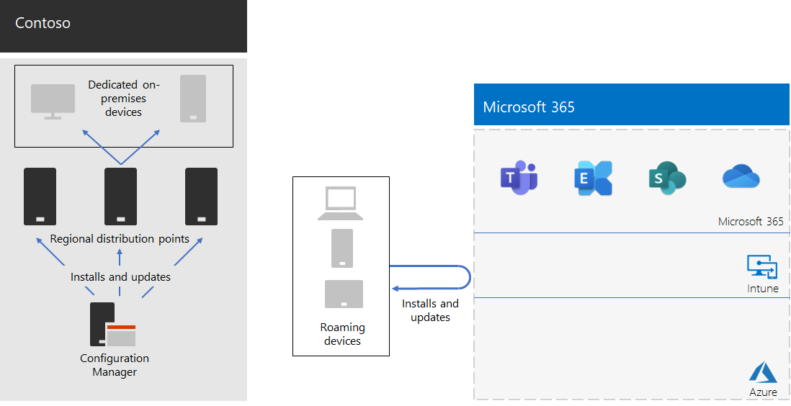

# Resposta e suporte do COVID-19 da Contoso para trabalho remoto e local

A Contoso sempre apoiou seus funcionários remotos, que acessam recursos locais por meio de um servidor VPN central na sede de Paris. A Contoso emitiu a todos os funcionários remotos um laptop gerenciado. Os funcionários locais tinham uma mistura de computadores desktop e laptops.

## Resposta da Contoso ao COVID-19

Com o início da pandemia do COVID-19, de repente, todos os trabalhadores essenciais eram trabalhadores remotos. A Contoso respondeu mudando sua força de trabalho para trabalhar de casa e conduzir suas atividades principais por meio do acesso remoto a recursos locais e online usando serviços de nuvem do Microsoft 365.

A Contoso tinha servidores VPN de acesso remoto no escritório da sede de Paris para dar suporte a 25% de sua força de trabalho já remota, mas foi rapidamente movida para ampliar sua capacidade de acesso remoto para dar suporte a 90% de sua força de trabalho. A Contoso implantou servidores VPN de acesso remoto em cada escritório via satélite para que os funcionários remotos utilizasse um ponto de entrada de fechamento regional para acessar a intranet da Contoso.

A Contoso também atualizou a configuração de clientes VPN instalados em laptops, tablets e smartphones para túnel dividido para que o tráfego para o conjunto otimizado de pontos de extremidade do Office 365 ignorava a conexão VPN e era enviado diretamente pela Internet. Para obter mais informações, consulte [Optimize Office 365 connectivity for remote users using VPN split tunneling](../enterprise/microsoft-365-vpn-split-tunnel.md).

Aqui está a configuração resultante com dispositivos VPN instalados na sede de Paris e em cada um dos escritórios de satélite. 

Um trabalhador remoto com o cliente VPN instalado usa o DNS para encontrar o escritório regionalmente mais próximo e se conecta ao dispositivo VPN instalado lá. Com o túnel dividido, o tráfego para os pontos de extremidade do Microsoft 365 Optimize é enviado diretamente para o local de rede do Microsoft 365 regionalmente mais próximo. Todos os outros tráfegos são enviados pela conexão VPN ao dispositivo VPN.

## Suporte da Contoso para trabalho remoto e local

Depois que as alterações iniciais foram feitas para dar suporte principalmente a funcionários remotos durante bloqueios regionais, a Contoso fez alterações de infraestrutura para dar suporte ao trabalho remoto e local no qual um trabalhador poderia estar:

- Sempre remoto.
- Sempre no local.
- Uma combinação de local e remoto.

Os recursos de identidade, segurança e conformidade do Microsoft 365 são projetados para a Confiança Zero e funcionam independentemente da localização do usuário e do dispositivo. Para obter mais informações, consulte [Zero Trust](https://www.microsoft.com/security/business/zero-trust).

No entanto, o gerenciamento de novas instalações e atualizações de software depende do local do dispositivo, pois o software a ser instalado pode vir de uma fonte local ou de internet. Os arquitetos de TI da Contoso projetaram sua nova infraestrutura de instalação e atualizações com base no local do dispositivo, em vez do trabalhador.

Eles designam dois tipos de dispositivos: local dedicado e roaming.

### Local dedicado

Um dispositivo local dedicado é um computador desktop ou servidor que nunca sai da intranet da Contoso e não tem um cliente VPN instalado. Esses dispositivos locais continuam a usar o Microsoft Endpoint Configuration Manager e seus pontos de distribuição para instalações e atualizações do Windows 10, do Microsoft 365 Apps para empresas e do navegador de Borda.

### Roaming

Um dispositivo móvel pode sair da intranet da Contoso e inclui laptops emitidos para muitos funcionários do escritório e todos os funcionários remotos e outros dispositivos de propriedade da organização, como smartphones e tablets com o cliente VPN da Contoso instalado. 

Como esses dispositivos podem ser conectados à Internet a qualquer momento, eles usam o Intune ou outros serviços baseados em nuvem para instalar e atualizar o Windows 10, o Microsoft 365 Apps para empresas e o Edge. Eles não usam os pontos de distribuição do Configuration Manager local existentes.

Isso significa que algumas das instalações e atualizações do dispositivo móvel serão feitas pela Internet enquanto eles estão no local e conectados à intranet. Mas os arquitetos de TI da Contoso decidiram que a simplicidade da configuração era mais importante do que a otimização da largura de banda da intranet para a Internet, especialmente quando a maioria dos funcionários remotos raramente está conectada à intranet.

Aqui está a infraestrutura resultante.

O comportamento de instalação e atualização é determinado tornando as contas do computador dos dispositivos um membro de um desses grupos:

- OnPremDevices

  O cliente do Configuration Manager no dispositivo usa pontos de distribuição para instalar e atualizar.

- RoamingDevices

  O Intune e outras configurações no dispositivo especificam o uso da rede do Microsoft 365 para instalar e atualizar.

## Novo processo de integração

Para um novo dispositivo local dedicado emitido para um novo funcionário ou para um novo servidor em um datacenter, quando o trabalhador entrar, o cliente do Configuration Manager com base na associação do dispositivo no grupo OnPremDevices baixa e instala as atualizações mais recentes para Windows 10, Microsoft 365 Apps for enterprise e Edge de pontos de distribuição do Configuration Manager local. Quando concluído, o dispositivo local dedicado estará pronto para uso e usará esses pontos de distribuição para atualizações contínuas.

Para um novo dispositivo remoto emitido para um novo trabalhador, quando o trabalhador entrar, o dispositivo, com base em sua associação ao grupo RoamingDevices, contata o serviço de nuvem do Intune e outros serviços e baixa e instala as atualizações mais recentes para Windows 10, Microsoft 365 Apps para empresas e Edge. Quando concluído, o dispositivo remoto estará pronto para uso e usará o cliente VPN instalado para acesso aos recursos locais e à rede do Microsoft 365 para atualizações contínuas.

## Próxima etapa

[Capacitar os funcionários remotos](empower-people-to-work-remotely.md) em sua organização.
