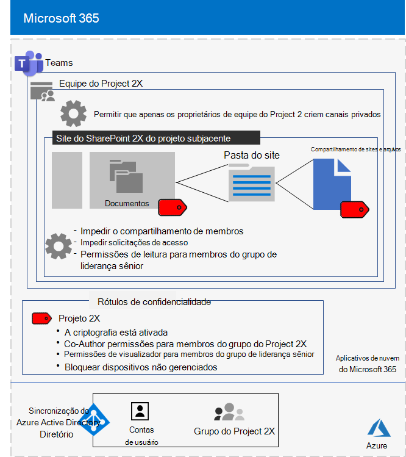

# Equipe isolada para um projeto secreto da Contoso CorporationIsolated team for a top-secret project of the Contoso Corporation

Após um executivo externo, o CEO da Contoso solicitou o desenvolvimento de um novo pacote de produtos e serviços que poderia duplicar os lucros da Contoso nos próximos cinco anos.After an executive offsite, Contoso’s CEO ordered the development of a new suite of products and services that could double Contoso’s profits in the next five years. O projeto secreto para desenvolver o plano comercial, de engenharia e de mercado foi denominado **Projeto 2X** e a equipe principal em toda a empresa foi recrutada.The top-secret project to develop the business, engineering, and market plan was named **Project 2X** and key staff across the company were recruited. 

Os cronogramas de pesquisa e desenvolvimento estavam rígidos, o que significa que a colaboração precisava ser eficiente e fornecer reuniões seguras, conversas contínuas e armazenamento de arquivos.The timelines for research and development were tight, which meant that collaboration had to be efficient and provide for secure meetings, ongoing conversations, and file storage.

Os produtos resultantes do Project 2X foram planos de negócios, especificações de produto e engenharia e materiais de marketing e agendamentos na forma de arquivos do Word, Excel e PowerPoint.The resulting deliverables for Project 2X were business plans, product and engineering specifications, and marketing materials and schedules in the form of Word, Excel, and PowerPoint files. 

Devido à sua natureza sensível, o acesso a esses arquivos foi:Due to their sensitive nature, access to these files were:

- Restrito aos membros da equipe do Project 2X e à liderança sênior.Restricted to Project 2X team members and senior leadership.
- Criptografado e protegido com permissões para permitir o acesso apenas aos membros da equipe do Project 2X e à liderança sênior, mesmo se os arquivos foram distribuídos fora de suas pastas protegidas.Encrypted and protected with permissions to allow access only to Project 2X team members and senior leadership, even if the files were distributed outside of their secured folders.

A equipe de IT da Contoso usou [uma equipe com isolamento de](secure-teams-security-isolation.md) segurança para o Project 2X e estas etapas.Contoso IT staff used a [team with security isolation](secure-teams-security-isolation.md) for Project 2X and these steps.

## Etapa 1: Criar uma equipe privadaStep 1: Created a private team

Primeiro, para proteger o acesso ao site subjacente do SharePoint para a equipe, os administradores de IT da Contoso configuraram as políticas de acesso recomendadas [do SharePoint.](../security/office-365-security/sharepoint-file-access-policies.md)First, to protect access to the underlying SharePoint site for the team, Contoso IT administrators configured the [recommended SharePoint access policies](../security/office-365-security/sharepoint-file-access-policies.md).

Em seguida, um administrador de IT da Contoso criou uma nova equipe privada chamada Project 2X e adicionou as contas de usuário da equipe do Project 2X como membros.Next, a Contoso IT administrator created a new private team named Project 2X and added the user accounts of Project 2X staff as members. Eles também configuraram a equipe para que apenas os proprietários da equipe do Project 2X possam criar canais privados.They also configured the team so that only Project 2X team owners can create private channels.

Para obter os detalhes da configuração, [consulte Criar uma equipe privada.](secure-teams-security-isolation.md#create-a-private-team)For the configuration details, see [Create a private team](secure-teams-security-isolation.md#create-a-private-team).

## Etapa 2: Criou um rótulo de sensibilidade para a equipe do Project 2XStep 2: Created a sensitivity label for the Project 2X team

Os administradores da Contoso criaram um novo rótulo de sensibilidade chamado **Project 2X** que:Contoso admins created a new sensitivity label named **Project 2X** that:

- Criptografia habilitada.Enabled encryption.
- Permissões Co-Author permissões para o grupo do Microsoft 2X do Project 365.Allowed Co-Author permissions for the Project 2X Microsoft 365 group.
- Permissões de Visualizador Permitidas para o grupo liderança sênior.Allowed Viewer permissions for the Senior Leadership group.
- Acesso bloqueado a dispositivos não autorizados.Blocked access to unmanaged devices.

Os arquivos na **seção Documentos** do site subjacente do SharePoint do Project 2X foram protegidos por:Files in the **Documents** section of the underlying Project 2X SharePoint site were protected by:

- As permissões de site, que só permitem permissões completas a membros do grupo Do Project 2X microsoft 365 e permissões de leitura para o grupo de Liderança Sênior.The site permissions, which only allow full permissions to members of the Project 2X Microsoft 365 group and read permissions to the Senior Leadership group.
- O rótulo de confidencialidade do Project 2X, com criptografia e permissões que viajam com o arquivo se ele for movido ou copiado do site.The Project 2X sensitivity label, with encryption and permissions that travel with the file if it is moved or copied from the site.

Para obter os detalhes de configuração, [consulte Criar um rótulo de sensibilidade.](secure-teams-security-isolation.md#create-a-sensitivity-label)For the configuration details, see [Create a sensitivity label](secure-teams-security-isolation.md#create-a-sensitivity-label).

## Etapa 3: Configurar o site subjacente do SharePointStep 3: Configured the underlying SharePoint site

Primeiro, para proteger o acesso ao site subjacente do SharePoint para a equipe, os administradores de IT da Contoso configuraram as políticas de acesso recomendadas [do SharePoint.](../security/office-365-security/sharepoint-file-access-policies.md)First, to protect access to the underlying SharePoint site for the team, Contoso IT administrators configured the [recommended SharePoint access policies](../security/office-365-security/sharepoint-file-access-policies.md).

Em seguida, eles definiram configurações de permissão adicionais para o site:Next, they configured additional permission settings for the site:

- Para impedir que os membros do grupo do Project 2X compartilhem acesso ao site.To prevent Project 2X group members from sharing access to the site. Para obter os detalhes de configuração, [confira As configurações do SharePoint para uma equipe com isolamento de segurança.](secure-teams-security-isolation.md#sharepoint-settings)For the configuration details, see [SharePoint settings for a team with security isolation](secure-teams-security-isolation.md#sharepoint-settings).
- Para permissões de leitura para o grupo liderança sênior.For Read permissions for the Senior Leadership group.

Em seguida, eles definiram configurações de permissão adicionais para o site para impedir que os membros do grupo do Project 2X compartilhem acesso ao site.Next, they configured additional permission settings for the site to prevent Project 2X group members from sharing access to the site. 

Como canais privados para o Project 2X foram criados, o proprietário do grupo desabilitou o compartilhamento de convidados e definiu o link de compartilhamento padrão para o **valor de pessoas** específicas.As private channels for the Project 2X were created, the group owner disabled guest sharing and set the default sharing link to the **Specific people** value.

Esta é a configuração resultante da equipe do Project 2X com isolamento de segurança.Here is the resulting configuration of the Project 2X team with security isolation.

 ## Etapa 4: Membros treinados da equipe do Project 2XStep 4: Trained Project 2X team members

A equipe de segurança da Contoso treinamentou os membros da equipe do Project 2X em um curso obrigatório que os pesquisa:Contoso security staff trained the Project 2X team members in a mandatory course that stepped them through:

- Como acessar a nova equipe do Project 2X, usar reuniões e chats e como colaborar em arquivos da equipe.How to access the new Project 2X team, use meetings and chats, and how to collaborate on team files.
- Como criar novos arquivos na equipe e carregar novos arquivos criados localmente.How to create new files in the team and upload new files created locally.
- Como rotular arquivos com o rótulo de sensibilidade do Project 2X.How to label files with the Project 2X sensitivity label.
- Uma demonstração de como o rótulo do Project 2X protege um arquivo mesmo quando ele sai da equipe.A demonstration of how the Project 2X  label protects a file even when it leaves the team.

O resultado final foi um ambiente seguro no qual os membros da equipe do Project 2X colaboraram em um ambiente seguro para chats, reuniões e arquivos.The end result was a secure environment in which Project 2X team members collaborated in a secure environment for chats, meetings, and files.

Aqui está um exemplo de um arquivo armazenado no site do Project 2X subjacente com o rótulo de confidencialidade do Project 2X atribuído.Here is an example of a file stored in the underlying Project 2X site with the Project 2X sensitivity label assigned.

Em alguns casos, os membros da equipe do Project 2X baixaram arquivos protegidos pelo rótulo do Project 2X em uma unidade local para trabalho offline.In a couple of instances, Project 2X team members downloaded files protected by the Project 2X label to a local drive for offline work. 

No entanto, depois de serem solicitados a solicitar credenciais ao abri-las, eles percebidoam seu erro e as excluíram.However, after being prompted for credentials when opening them, they realized their mistake and deleted them.

Devido ao ambiente de colaboração do Teams e aos recursos de segurança do Microsoft 365, os detalhes do Project 2X foram mantidos em segredo durante o projeto.Because of the collaboration environment of Teams and the security features of Microsoft 365, the details of Project 2X were kept secret for the duration of the project. A Contoso anunciaram seus planos e está em processo de implantação dos novos produtos e serviços para a satisfação de seus clientes e investidores e o chagrin de seus concorrentes.Contoso announced its plans and is in the process of rolling out the new products and services to the delight of its customers and investors and the chagrin of its competitors.

## Próxima etapaNext step

[Implante uma equipe com isolamento de segurança](secure-teams-security-isolation.md) em sua organização.[Deploy a team with security isolation](secure-teams-security-isolation.md) in your organization.

