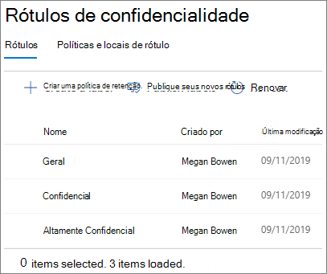
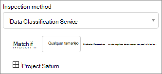
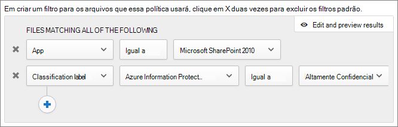

# Criar um ambiente de compartilhamento de convidados seguro

Neste artigo, abordaremos várias opções para criar um ambiente de compartilhamento de convidados seguro no Microsoft 365. Este é um cenário de exemplo para dar uma ideia das opções disponíveis. Você pode usar esses procedimentos em diferentes combinações para atender às necessidades de segurança e conformidade da sua organização. No final deste artigo, vamos abordar um caso de teste para ver como algumas dessas opções funcionam juntas.

Esse cenário inclui:

- Configurar a autenticação multifator para os convidados.
- Configurar os termos de uso para os convidados.
- Configurar revisões trimestrais de acesso dos convidados para verificar periodicamente se eles continuam precisando de permissões para equipes e sites.
- Restringir convidados a acesso somente Web para dispositivos não gerenciados.
- Configurar uma política de tempo limite de sessão para garantir que os convidados autentiquem diariamente.
- Criar e publicar rótulos de sensibilidade para classificar o conteúdo.
- Criar um tipo de informação confidencial para um projeto altamente confidencial.
- Atribuir um rótulo *altamente confidencial* a documentos que contenham o tipo de informação confidencial.
- Remover automaticamente o acesso de convidados de arquivos rotulados como *altamente confidenciais*.

Algumas das opções discutidas neste artigo exigem que os convidados tenham uma conta do Azure Active Directory. Para garantir que os convidados sejam incluídos no diretório ao compartilhar arquivos e pastas com eles, use a [integração do SharePoint e do OneDrive com a Visualização B2B do Azure AD](https://docs.microsoft.com/sharepoint/sharepoint-azureb2b-integration-preview).

Observe que não vamos discutir a habilitação das configurações de compartilhamento de convidados neste artigo. Confira [Colaborar com pessoas de fora da sua organização](collaborate-with-people-outside-your-organization.md) para obter detalhes sobre como habilitar o compartilhamento de convidados para diferentes cenários.

## Configurar a autenticação multifator para convidados

A autenticação multifator reduz significativamente as chances de uma conta ser comprometida. Como os usuários convidados podem estar usando contas de email pessoal que não seguem políticas de governança ou práticas recomendadas, é especialmente importante exigir a autenticação multifator para convidados. Se um nome e senha de um usuário convidado forem roubados, exigir um segundo fator de autenticação reduz significativamente as chances de que partes desconhecidas obtenham acesso aos seus sites e arquivos.

Neste exemplo, configuraremos a autenticação multifator para convidados usando uma política de acesso condicional do Azure Active Directory.

Configurar a autenticação multifator para convidados
1. No Microsoft Azure, pesquise *Acesso Condicional*.
2. Na folha **Acesso condicional – Políticas**, clique em **Nova Política**.
3. No campo **Nome**, digite *MFA de Convidado*.
4. Em **Atribuições**, clique em **Usuários e grupos**.
5. Na lâmina **Usuários e grupos**, selecione **Selecionar usuários e grupos**, marque a caixa de seleção **Todos os convidados e usuários externos**.
6. Em **Atribuições**, clique em **Aplicativos de nuvem ou ações**.
7. Na lâmina **Aplicativos de nuvem ou ações**, selecione **Todos os aplicativos de nuvem** na guia **Incluir**.
8. Em **Controles de acesso**, clique em **Conceder**.
9. Na folha **Conceder**, marque a caixa de seleção **Exigir autenticação multifator**, e, em seguida, clique em **Selecionar**.
10. Na folha **Novo**, em **Habilitar política**, clique em **Ativar** e, em seguida, clique em **Criar**.

Agora, o convidado será solicitado a se inscrever na autenticação multifator para que possam acessar conteúdo, sites ou equipes compartilhados.

### Mais informações

[Planejando uma implantação da Autenticação Multifator do Azure baseada em nuvem](https://docs.microsoft.com/azure/active-directory/authentication/howto-mfa-getstarted).

## Configurar os termos de uso para os convidados

Frequentemente, usuários convidados podem não ter assinado acordos de confidencialidade ou outros acordos legais com sua organização. Você pode exigir que os convidados concordem com os termos de uso antes de acessar os arquivos que são compartilhados com eles. Os termos de uso podem ser exibidos na primeira vez que tentam acessar um site ou arquivo compartilhado.

Para criar os termos de uso, primeiro é necessário criar um documento no Word ou em outro programa de criação e, em seguida, salvá-lo como um arquivo .pdf. Esse arquivo pode ser carregado no Azure AD.

Para criar os termos de uso do Azure AD
1. Entre no Azure como Administrador Global, Administrador de Segurança ou Administrador de Acesso Condicional.
2. Navegue até [Termos de uso](https://aka.ms/catou).
3. Clique em **Novos termos**. 
   
4. Nas caixas **Nome** e **Exibir nome** boxes, digite *Termos de Uso do Convidado*.
6. Em **Documento Termos de uso**, navegue até o arquivo PDF que você criou e selecione-o.
7. Selecione o idioma para o documento de termos de uso.
8. Definir **Exigir que os usuários expandam os Termos de uso**, como **Ativado**.
9. Em **Acesso Condicional**, na lista **Impor com o modelo de política de Acesso Condicional**, escolha **Criar política de acesso condicional mais tarde**.
10. Clique em **Criar**.

Depois de criar os termos de uso, a próxima etapa é criar uma política de acesso condicional que exibe os termos de uso para os usuários convidados.

Para criar uma política de acesso condicional:
1. No Microsoft Azure, pesquise *Acesso Condicional*.
2. Na folha **Acesso condicional – Políticas**, clique em **Nova Política**.
3. Na caixa **Nome**, digite *Política de termos de uso do usuário convidado*.
4. Em **Atribuições**, clique em **Usuários e grupos**.
5. Na folha **Usuários e Grupos**, selecione **Selecionar usuários e grupos**, clique na caixa de seleção **Todos os usuários e convidados externos** e, em seguida, clique em **Concluído**.
6. Em **tarefas**, clique em **Aplicativos de nuvem ou ações**.
7. Na guia**Incluir**, selecione**Selecionar aplicativos** e, em seguida, clique em **Selecionar**.
8. Na folha **Selecionar**, selecione **Microsoft Teams**, **Office 365 SharePoint Online** e **Outlook Groups** e, em seguida, clique em **Selecionar**.
9. Na folha **Aplicativos de nuvem ou ações**, clique em **Concluído**.
10. Em **Controles de acesso**, clique em **	Conceder**.
11. Na folha **Conceder**, selecione **Temos de uso de convidado**e, em seguida, clique em **Selecionar**.
12. Na folha **Novo**, em **Habilitar política**, clique em **Ativar** e, em seguida, clique em **Criar**.

Agora, na primeira vez que um usuário convidado tentar acessar o conteúdo ou uma equipe ou um site em sua organização, será necessário aceitar os termos de uso.

### Mais informações
[Termos de uso do Azure Active Directory](https://docs.microsoft.com/azure/active-directory/conditional-access/terms-of-use)

## Acesso de convidado com revisões de acesso

Com as revisões de acesso no Azure AD, você pode automatizar uma revisão periódica do acesso do usuário a várias equipes e grupos. Requerer uma revisão do acesso dos convidados, pode ajudar a garantir que os usuários convidados não mantenham o acesso às informações confidenciais de sua organização por mais tempo do que o necessário.

As revisões de acesso podem ser organizadas em programas. Um programa é um agrupamento de revisões similares de acesso, que podem ser usadas para organizar revisões de acesso para fins de auditoria e relatórios.

Neste exemplo, criaremos um programa para as revisões de acesso de convidado.

Para criar um programa
1. Entre no portal do Azure e abra a página [Governança de Identidade](https://portal.azure.com/#blade/Microsoft_AAD_ERM/DashboardBlade).
2. No menu à esquerda, clique em **Programas**.
3. Clique em **Novo Programa**.
4. Na caixa **Nome**, digite *Programa de revisão de acesso de convidado*.
5. Na caixa **Descrição**, digite *Programa para as revisões de acesso de convidado*.
6. Clique em **Criar**.

Depois de criar o programa, pode-se criar uma revisão de acesso de convidado e associá-la com o programa.

Configurar uma revisão de acesso de usuário convidado
1. Na página [Governança de Identidade](https://portal.azure.com/#blade/Microsoft_AAD_ERM/DashboardBlade), no menu à esquerda, clique em **Revisões de acesso**.
2. Clique em **Novas revisões de acesso**. 
   
3. Na caixa **Nome**, digite *Revisão trimestral de acesso de convidado*.
4. Por **Frequência**, escolha **Trimestral**.
5. Para **Fim**, escolha **Nunca.**
6. Em **Escopo**, escolha **Somente usuários convidados**.
7. Clique em **Grupo**, selecione os grupos que você deseja incluir na revisão de acesso e, em seguida, clique em **Selecionar**.
8. Em **Programas**, clique em**Vincular ao programa**.
9. Na folha **Selecionar um programa**, escolha **Programa de revisão de acesso de convidado**
10. Clique em **Iniciar**.

Uma revisão de acesso separada é criada para cada grupo que você especificar. Para os proprietários de grupo de cada grupo serão enviados emails trimestrais para aprovar ou negar o acesso de convidado aos grupos.

É importante observar que os convidados podem ter acesso a equipes ou grupos, ou a arquivos e pastas individuais. Quando o acesso a arquivos e pastas é fornecido, os convidados não podem ser adicionados a qualquer grupo específico. Se você quiser fazer revisões de acesso em usuários convidados que não pertencem a uma equipe ou grupo, é possível criar um grupo dinâmico no Azure AD que contenha todos os convidados e, em seguida, criar uma revisão de acesso para esse grupo.

### Mais informações
[Gerenciar o acesso de convidado com revisões de acesso do Azure AD](https://docs.microsoft.com/azure/active-directory/governance/manage-guest-access-with-access-reviews)

[Criar uma revisão de acesso de grupos ou aplicativos nas revisões de acesso do Azure AD](https://docs.microsoft.com/azure/active-directory/governance/create-access-review)

## Configurar o acesso somente da Web para usuários convidados

É possível reduzir sua superfície de ataque e facilitar a administração exigindo que os usuários convidados acessem suas equipes, sites e arquivos usando apenas um navegador da Web. Isso é feito com uma política de acesso condicional do Azure AD.

Para restringir os convidados para o acesso apenas Web
1. No Microsoft Azure, pesquise *Acesso Condicional*.
2. Na folha **Acesso condicional – Políticas**, clique em **Nova Política**.
3. Na caixa **Nome**, digite *Navegador de acesso do usuário convidado*.
4. Em **Atribuições**, clique em **Usuários e grupos**.
5. Na folha **Usuários e Grupos**, selecione **Selecionar usuários e grupos**, clique na caixa de seleção **Todos os usuários e convidados externos** e, em seguida, clique em **Concluído**.
6. Em **tarefas**, clique em **Aplicativos de nuvem ou ações**.
7. Na guia**Incluir**, selecione**Selecionar aplicativos** e, em seguida, clique em **Selecionar**.
8. Na folha **Selecionar**, selecione **Microsoft Teams**, **Office 365 SharePoint Online** e **Outlook Groups** e, em seguida, clique em **Selecionar**.
9. Na folha **Aplicativos de nuvem ou ações**, clique em **Concluído**.
10. Em **Tarefas**, clique em **Condições**.
11. Na folha **Condições**, clique em **Aplicativos cliente**.
12. Na folha **Aplicativos cliente**, clique em **Sim** para **Configurara**e, em seguida, selecione configurações de**Aplicativos móveis e clientes de desktop** e **Clientes de autenticação moderna**. 
    
13. Clique em **Concluído** e, em seguida na folha **condições** e clique novamente em **Concluído**.
14. Em **Controles de acesso**, clique em **	Conceder**.
15. Na folha**Conceder**, selecione**Exigir que o dispositivo seja marcado como em conformidade** e **Exigir o Dispositivo adicionado ao Azure AD híbrido**.
16. Em **Para vários controles**, selecione **Exigir um dos controles selecionados** e, em seguida, clique em **Selecionar**.
17. Na folha **Novo**, em **Habilitar política**, clique em **Ativar** e, em seguida, clique em **Criar**.

## Configurar o tempo limite de uma sessão para usuários convidados

Exigir que os convidados autentiquem de forma regular pode reduzir a possibilidade de usuários desconhecidos acessar o conteúdo da sua organização se o dispositivo de um usuário convidado não for seguro. Você pode configurar uma política de acesso condicional de tempo limite de sessão para usuários convidados no Azure AD.

Para configurar uma política de tempo limite de sessão de convidado
1. No Microsoft Azure, pesquise *Acesso Condicional*.
2. Na folha **Acesso condicional – Políticas**, clique em **Nova Política**.
3. Na caixa **Nome**, digite *Tempo limite de sessão de convidado*.
4. Em **Atribuições**, clique em **Usuários e grupos**.
5. Na folha **Usuários e Grupos**, selecione **Selecionar usuários e grupos**, clique na caixa de seleção **Todos os usuários e convidados externos** e, em seguida, clique em **Concluído**.
6. Em **tarefas**, clique em **Aplicativos de nuvem ou ações**.
7. Na guia**Incluir**, selecione**Selecionar aplicativos** e, em seguida, clique em **Selecionar**.
8. Na folha **Selecionar**, selecione **Microsoft Teams**, **Office 365 SharePoint Online** e **Outlook Groups** e, em seguida, clique em **Selecionar**.
9. Na folha **Aplicativos de nuvem ou ações**, clique em **Concluído**.
10. Em **Controles de acesso**, clique em **Sessão**.
11. Na folha **Sessão**, selecione **Frequência de entrada**.
12. Selecione **1** e**Dias** para o período de tempo e, em seguida, clique em **Selecionar**.
13. Na folha **Novo**, em **Habilitar política**, clique em **Ativar** e, em seguida, clique em **Criar**.

## Criar rótulos de confidencialidade

Os rótulos de confidencialidade podem ser usados de várias maneiras para classificar e proteger as informações da sua organização. Neste exemplo, veremos como os rótulos podem ser usados para ajudá-lo a gerenciar o acesso de convidados a arquivos e pastas compartilhados.

Primeiro, criaremos três rótulos de confidencialidade no Centro de Conformidade do Microsoft 365:

- Geral
- confidencial
- Altamente confidencial

Use o procedimento a seguir para os rótulos *Geral* e *confidencial*.

Para criar um rótulo de classificação (Geral e confidencial)
1. No [Centro de Conformidade do Microsoft 365r](https://compliance.microsoft.com), na navegação à esquerda, expanda **Classificação** e, em seguida, clique em **Rótulos de Confidencialidade**.
2. Clique em **Criar um rótulo**.
3. Em **Nome do rótulo**, digite *Geral* ou *confidencial*.
4. Em **Dica de ferramenta**, digite *Informações gerais que possam ser compartilhadas com funcionários, convidados e parceiros* ou *Informações confidenciais. Compartilhe somente com funcionários e convidados autorizados*, e, em seguida, clique em **Avançar**.
5. Deixe a criptografia **Desativada** e clique em **Avançar**.
6. Deixe a marcação de conteúdo **Desativada** e clique em **Avançar**.
7. Deixe a prevenção contra perda de dados **Desativada** e clique em **Avançar**.
8. Deixe rotular automaticamente **Desativado** e clique em **Avançar**.
9. Clique em **Criar**.

Com o rótulo *Altamente Confidencial*, adicionaremos uma marca d' água automática aos documentos com o rótulo.

Para criar um rótulo de classificação (Altamente confidencial)
1. Clique em **Criar um rótulo**.
2. Em **Nome do rótulo**, digite *Altamente confidencial*.
3. Em **Dica de ferramenta**, digite *Informações altamente confidenciais. Não compartilhe com convidados* e, em seguida, clique em **Avançar**.
4. Deixe a criptografia **Desativada** e clique em **Avançar**.
5. **Ative** a marcação de conteúdo, marque a caixa de seleção **Adicionar um cabeçalho** e clique em **Personalizar texto**.
6. Digite *Altamente confidencial*no texto do cabeçalho e clique em **Salvar**.
7. Na página **Marcação de conteúdo**, **Ative** a marcação de conteúdo.
8. Marque a caixa de seleção **Adicionar uma marca d' água** e, em seguida, clique em **Personalizar texto**.
9. Em **Texto da marca d'água**,digite *Altamente confidencial*.
10. Digite *24* como **Tamanho da fonte** e, em seguida, clique em **Salvar**.
11. Na página **Marcação de conteúdo**, clique **Avançar**.
12. Deixe a prevenção contra perda de dados **Desativada** e clique em **Avançar**.
13. Deixe rotular automaticamente **Desativado** e clique em **Avançar**.
14. Clique em **Criar**.

Depois de criar os rótulos, a próxima etapa é publicá-los. 

Publicar rótulos
1. Na página **Rótulos de confidencialidade**, clique em **Publicar rótulos**.
2. Clique em **Escolher rótulos para publicar**.
3. Clique em **Adicionar**, selecione os rótulos que você criou e clique em **Adicionar**.
4. Clique em **Concluído**.
5. Clique em **Avançar**.
6. Deixe os usuários e grupos definidos como **Todos** e clique em **Avançar**.
7. Em **Aplicar este rótulo por padrão a documentos e lista de emails**, escolha **Geral** e, em seguida, clique em **Avançar**.
8. Na página **Configurações de política**, digite *Confidencialidade do Documento* para o nome e, em seguida, clique em **Avançar.**.
9. Clique em **Publicar**.

Com os rótulos publicados, eles ficam disponíveis para os usuários dos aplicativos da área de trabalho do Office. Quando os usuários aplicam o rótulo **Altamente confidencial**, uma marca d' água é adicionada automaticamente ao documento.

### Mais informações
[Visão geral de rótulos de confidencialidade](https://docs.microsoft.com/Office365/SecurityCompliance/sensitivity-labels)

## Criar um tipo de informação confidencial para um projeto altamente confidencial.

Os tipos de informações confidenciais são cadeias de caracteres predefinidas que podem ser usadas em fluxos de trabalho de política para reforçar os requisitos de conformidade. O Centro de Conformidade da Microsoft 365 vem com mais de 100 tipos de informações confidenciais, incluindo números de carteira de motorista, números de cartão de crédito, números de contas bancárias, etc.

Você pode criar tipos de informações confidenciais personalizados para ajudar a gerenciar o conteúdo específico da sua organização. Neste exemplo, criaremos um tipo personalizado de informação confidencial para um projeto altamente confidencial. Podemos usar esse tipo de informação confidencial para aplicar automaticamente um rótulo de classificação.

Criar um tipo de informação confidencial
1. No [Centro de Conformidade do Microsoft 365r](https://compliance.microsoft.com), na navegação à esquerda, expanda **Classificação** e, em seguida, clique em **Tipos de informação de confidencialidade**.
2. Clique em **Criar**.
3. Para **Nome** e **Descrição**, digite **Projeto Saturno** e, em seguida, clique em **Avançar**.
4. Clique em **Adicionar um elemento**.
5. Em **Detectar conteúdo contendo lista**, selecione **Palavras-chave**e, em seguida, digite *Projeto Saturno* na caixa de palavra-chave.
6. Clique em **Avançar** e em **Concluir**.
7. Se você quiser testar o tipo de informação confidencial, clique em **Não**.

### Mais informações
[Personalizar tipos de informação confidencial](https://docs.microsoft.com/Office365/SecurityCompliance/custom-sensitive-info-types)

## Criar uma política para atribuir um rótulo baseado em um tipo de informação confidencial

Depois de criar o tipo de informação confidencial, podemos criar uma política de arquivo no Microsoft Cloud App Security para aplicar o rótulo *Altamente confidencial* aos documentos que contêm a cadeia de caracteres *Projeto Saturno* automaticamente.

> [!NOTE]
> Há um processo de replicação que torna os rótulos de confidencialidade disponíveis na Cloud App Security. Você pode não ver o rótulo disponível para uma política imediatamente.

Criar uma política de arquivo baseada no tipo de informação confidencial
1. Abra o [Microsoft Cloud App Security](https://portal.cloudappsecurity.com).
2. Na barra de navegação à esquerda expanda **Controle** e, em seguida, clique em **Políticas**.
3. Clique em **Criar política** e, em seguida, escolha **Política de arquivo**.
4. Para **Nome da politica**, digite *Rotulagem Projeto Saturno*.
5. Em **criar um filtro para os arquivos que essa política usará**, clique em X duas vezes para excluir os filtros padrão.
7. Na lista **Selecionar um filtro**, escolha **Aplicativo**, e, em seguida, selecione **Microsoft SharePoint Online** da lista **Selecionar aplicativos...**.
8. Em **Método de inspeção**, escolha **Serviço de classificação de dados**.
9. Na lista **Escolher tipo de inspeção**,escolha **Tipo de informação confidencial**.
10. Pesquise e selecione o rótulo de confidencialidade do *Projeto Saturno* e clique em **Concluído**. 
   
11. Em **Governança**, expanda **Microsoft SharePoint Online**.
12. Marque a caixa de seleção **Aplicar rótulo de classificação** e selecione o rótulo **Altamente confidencial**.
13. Clique em **Criar**.

Com a política implantada, quando um usuário digita "Projeto Saturno" em um documento, o Cloud App Security aplica automaticamente o rótulo *Altamente confidencial* ao verificar o arquivo.

### Mais informações
[Políticas de arquivo](https://docs.microsoft.com/cloud-app-security/data-protection-policies)

## Criar uma política para remover o acesso de convidados a arquivos altamente confidenciais

No exemplo neste artigo, os arquivos com o rótulo *Altamente confidencial* não devem ser compartilhados com convidados. Podemos criar uma política de arquivo na Cloud App Security que remove automaticamente o acesso de convidados de arquivos com esse rótulo.

Observe que isso não impede que os usuários compartilhem ou compartilhem novamente esses arquivos. Depende ainda que seus usuários sigam as políticas de governança para os arquivos armazenados em sites que permitem o compartilhamento de convidados. No entanto, isso pode ser uma ferramenta útil para remover o acesso de convidados a arquivos que tiveram informações confidenciais adicionadas a eles após terem sido compartilhados com convidados.

Para criar uma política de arquivo baseada em rótulos
1. Abra o [Microsoft Cloud App Security](https://portal.cloudappsecurity.com).
2. Na barra de navegação à esquerda expanda **Controle** e, em seguida, clique em **Políticas**.
3. Clique em **Criar política** e, em seguida, escolha **Política de arquivo**.
4. Para **Nome da politica**, digite *Projeto Saturno - remover acesso de convidado*.
5. Em **criar um filtro para os arquivos que essa política usará**, clique em X duas vezes para excluir os filtros padrão.
6. Na lista **Selecionar um filtro**, escolha **Aplicativo**, e, em seguida, selecione **Microsoft SharePoint Online** da lista **Selecionar aplicativos...**.
7. Clique em **Adicionar um filtro**.
8. Na lista **Selecionar um filtro**, escolha **Rótulo de classificação** e, em seguida, selecione **Proteção de informações do Azure** na lista **Selecionar filtro...**.
9. Na lista **Selecionar rótulo de classificação**, selecione **Altamente confidencial**. 
   
10. Em **Governança**, expanda **Microsoft SharePoint Online**.
11. Marque as caixas de seleção **Enviar resumo da política de correspondência aos proprietários do arquivo** e **Remover usuários externos**.
12. Para a mensagem de notificação personalizada, digite *Esse arquivo é altamente confidencial. A política da empresa proíbe o compartilhamento com os convidados*.
13. Clique em **Criar**.

É importante observar que essa política remove o acesso a arquivos compartilhados usando um link para *Pessoas específicas*. Isso não remove o acesso de links (*Qualquer pessoa*) não autenticados. Ele também não removerá o acesso se o convidado for um membro do site ou da equipe como um todo. Se você planeja ter documentos altamente confidenciais em um site ou uma equipe com membros convidados, considere o uso de [canais privados no Teams](https://support.office.com/article/60ef929a-4d68-418b-bf4f-5784db184ec9)e apenas permita os membros de sua organização nos canais privados.

## Testar a solução

Para testar a solução descrita neste artigo, crie um documento do Word e salve-o em uma biblioteca de documentos. Compartilhe o arquivo com um usuário convidado. Quando o convidado tenta acessar o documento, ele deve ser solicitado a se inscrever na autenticação multifator e, em seguida, aceitar os termos de uso.

Quando o convidado tiver acesso ao documento, digite *Projeto Saturno* no documento e salve-o. Uma vez que o Cloud App Security analisa o documento, o rótulo *Altamente confidencial* deve ser aplicado e o usuário convidado não deve mais acessá-lo.

Você pode usar as ferramentas descritas neste artigo em várias combinações para ajudar a criar um ambiente de compartilhamento de convidados seguro e confiável para sua organização.

## Opções adicionais

Há algumas opções adicionais no Microsoft 365 e no Azure Active Directory que podem ajudar a proteger seu ambiente de compartilhamento de convidado.

- Você pode criar uma lista de domínios de compartilhamento permitidos ou negados para limitar com quem os usuários podem compartilhar. Confira [restringir o compartilhamento de conteúdo do SharePoint e do OneDrive por domínio](https://docs.microsoft.com/sharepoint/restricted-domains-sharing) e [Permitir ou bloquear convites para usuários B2B de organizações específicas](https://docs.microsoft.com/azure/active-directory/b2b/allow-deny-list) para obter mais informações.
- Você pode limitar os locatários do Azure Active Directory aos quais seus usuários podem se conectar. Confira [Usar restrições de locatário para gerenciar o acesso aos aplicativos de nuvem SaaS](https://docs.microsoft.com/azure/active-directory/manage-apps/tenant-restrictions) para mais informações. 
- Você pode criar um ambiente gerenciado em que os parceiros podem ajudar a gerenciar contas de convidado. Confira [Criar uma extranet B2B com convidados gerenciados](https://docs.microsoft.com/Office365/Enterprise/b2b-extranet) para obter mais informações.

## Confira também

[Limitar a exposição acidental dos arquivos ao compartilhar com convidados](share-limit-accidental-exposure.md)

[Práticas recomendadas para compartilhar arquivos e pastas com usuários não autenticados](best-practices-anonymous-sharing.md)

[Crie uma extranet B2B com convidados gerenciados](b2b-extranet.md)
