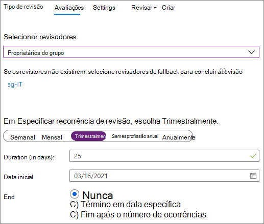
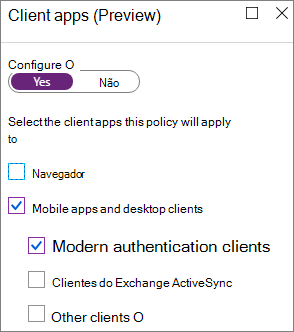
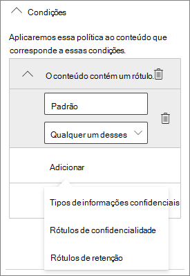
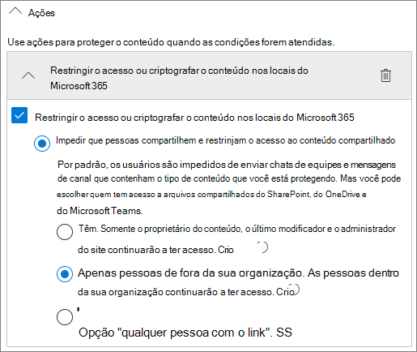

# Criar um ambiente de compartilhamento de convidados seguro

Neste artigo, abordaremos várias opções para criar um ambiente de compartilhamento de convidados seguro no Microsoft 365. Estes são exemplos para dar uma ideia das opções disponíveis. Você pode usar esses procedimentos em diferentes combinações para atender às necessidades de segurança e conformidade da sua organização.

Este artigo inclui:

- Configurar a autenticação multifator para os convidados.
- Configurar os termos de uso para os convidados.
- Configurar revisões trimestrais de acesso dos convidados para verificar periodicamente se eles continuam precisando de permissões para equipes e sites.
- Restringir convidados a acesso somente Web para dispositivos não gerenciados.
- Configurar uma política de tempo limite de sessão para garantir que os convidados autentiquem diariamente.
- Criação de um tipo de informação confidencial para um projeto altamente confidencial.
- Atribuição automática de um rótulo de confidencialidade a documentos que contêm um tipo de informação confidencial.
- Removendo automaticamente o acesso de convidados de arquivos com um rótulo de confidencialidade.

Algumas das opções discutidas neste artigo exigem que os convidados tenham uma conta do Azure Active Directory. Para garantir que os convidados sejam incluídos no diretório ao compartilhar arquivos e pastas com eles, use a [integração do SharePoint e do OneDrive com a Visualização B2B do Azure AD](https://docs.microsoft.com/sharepoint/sharepoint-azureb2b-integration-preview).

Observe que não vamos discutir a habilitação das configurações de compartilhamento de convidados neste artigo. Confira [Colaborar com pessoas de fora da sua organização](collaborate-with-people-outside-your-organization.md) para obter detalhes sobre como habilitar o compartilhamento de convidados para diferentes cenários.

## Configurar a autenticação multifator para convidados

A autenticação multifator reduz significativamente as chances de uma conta ser comprometida. Como os usuários convidados podem estar usando contas de email pessoal que não seguem políticas de governança ou práticas recomendadas, é especialmente importante exigir a autenticação multifator para convidados. Se um nome e senha de um usuário convidado forem roubados, exigir um segundo fator de autenticação reduz significativamente as chances de que partes desconhecidas obtenham acesso aos seus sites e arquivos.

Neste exemplo, configuraremos a autenticação multifator para convidados usando uma política de acesso condicional do Azure Active Directory.

Configurar a autenticação multifator para convidados

1. Vá para [Políticas de acesso condicional do Azure](https://portal.azure.com/#blade/Microsoft_AAD_IAM/ConditionalAccessBlade).
2. No **Acesso Condicional | Na folha Políticas**, clique em **Nova política**.
3. No campo **Nome**, digite um nome.
4. Em **Atribuições**, clique em **Usuários e grupos**.
5. Na lâmina **Usuários e grupos**, selecione **Selecionar usuários e grupos**, marque a caixa de seleção **Todos os convidados e usuários externos**.
6. Em **Atribuições**, clique em **Aplicativos de nuvem ou ações**.
7. Na lâmina **Aplicativos de nuvem ou ações**, selecione **Todos os aplicativos de nuvem** na guia **Incluir**.
8. Em **Controles de acesso**, clique em **Conceder**.
9. Na folha **Conceder**, marque a caixa de seleção **Exigir autenticação multifator**, e, em seguida, clique em **Selecionar**.
10. Na folha **Novo**, em **Habilitar política**, clique em **Ativar** e, em seguida, clique em **Criar**.

Agora, o convidado será solicitado a se inscrever na autenticação multifator para que possam acessar conteúdo, sites ou equipes compartilhados.

### Mais informações

[Planejando uma Implantação de Autenticação Multifator do Microsoft Azure Active Directory](https://docs.microsoft.com/azure/active-directory/authentication/howto-mfa-getstarted)

## Definir os termos de uso para os convidados

Em algumas situações, os usuários convidados podem não ter assinado acordos de não divulgação ou outros acordos legais com sua organização. Você pode exigir que os convidados concordem com os termos de uso antes de acessar os arquivos que são compartilhados com eles. Os termos de uso podem ser exibidos na primeira vez que tentam acessar um site ou arquivo compartilhado.

Para criar os termos de uso, primeiro é necessário criar um documento no Word ou em outro programa de criação e, em seguida, salvá-lo como um arquivo .pdf. Esse arquivo pode ser carregado no Azure AD.

Para criar os termos de uso do Azure AD

1. Entre no Azure como Administrador Global, Administrador de Segurança ou Administrador de Acesso Condicional.
2. Navegue até [Termos de uso](https://aka.ms/catou).
3. Clique em **Novos termos**.

   

4. Digite um **Nome** e um **Nome de exibição**.
6. Em **Documento Termos de uso**, navegue até o arquivo PDF que você criou e selecione-o.
7. Selecione o idioma para o documento de termos de uso.
8. Definir **Exigir que os usuários expandam os Termos de uso**, como **Ativado**.
9. Em **Acesso Condicional**, na lista **Impor com o modelo de política de Acesso Condicional**, escolha **Criar política de acesso condicional mais tarde**.
10. Clique em **Criar**.

Depois de criar os termos de uso, a próxima etapa é criar uma política de acesso condicional que exibe os termos de uso para os usuários convidados.

Para criar uma política de acesso condicional:

1. Vá para [Políticas de acesso condicional do Azure](https://portal.azure.com/#blade/Microsoft_AAD_IAM/ConditionalAccessBlade).
2. No **Acesso Condicional | Na folha Políticas**, clique em **Nova política**.
3. Na caixa **Nome**, digite um nome.
4. Em **Atribuições**, clique em **Usuários e grupos**.
5. Na lâmina **Usuários e grupos**, selecione **Selecionar usuários e grupos**, marque a caixa de seleção **Todos os convidados e usuários externos**.
6. Em **tarefas**, clique em **Aplicativos de nuvem ou ações**.
7. Na guia **Incluir**, selecione **Selecionar aplicativos** e, em seguida, clique em **Selecionar**.
8. Na folha **Selecionar**, selecione **Microsoft Teams**, **Office 365 SharePoint Online** e **Outlook Groups** e, em seguida, clique em **Selecionar**.
9. Em **Controles de acesso**, clique em **Conceder**.
10. Na folha **Conceder**, selecione **Temos de uso de convidado** e, em seguida, clique em **Selecionar**.
11. Na folha **Novo**, em **Habilitar política**, clique em **Ativar** e, em seguida, clique em **Criar**.

Agora, na primeira vez que um usuário convidado tentar acessar o conteúdo ou uma equipe ou um site em sua organização, será necessário aceitar os termos de uso.

> [!NOTE]
> Usar o acesso condicional exige uma licença do Azure AD Premium P1. Para mais informações, confira [O que é acesso condicional](https://docs.microsoft.com/azure/active-directory/conditional-access/overview).

### Mais informações

[Termos de uso do Azure Active Directory](https://docs.microsoft.com/azure/active-directory/conditional-access/terms-of-use)

## Acesso de convidado com revisões de acesso

Com as revisões de acesso no Azure AD, você pode automatizar uma revisão periódica do acesso do usuário a várias equipes e grupos. Requerer uma revisão do acesso dos convidados, pode ajudar a garantir que os usuários convidados não mantenham o acesso às informações confidenciais de sua organização por mais tempo do que o necessário.

As revisões de acesso podem ser organizadas em programas. Um programa é um agrupamento de revisões similares de acesso, que podem ser usadas para organizar revisões de acesso para fins de auditoria e relatórios.

Para criar um programa

1. Entre no portal do Azure e abra a página [Governança de Identidade](https://portal.azure.com/#blade/Microsoft_AAD_ERM/DashboardBlade).
2. No menu à esquerda, clique em **Programas**.
3. Clique em **Novo Programa**.
4. Digite um  **Nome** e uma **Descrição**.
5. Clique em **Criar**.

Depois de criar o programa, pode-se criar uma revisão de acesso de convidado e associá-la com o programa.

Configurar uma revisão de acesso de usuário convidado

1. Na página [Governança de Identidade](https://portal.azure.com/#blade/Microsoft_AAD_ERM/DashboardBlade), no menu à esquerda, clique em **Revisões de acesso**.
2. Clique em **Novas revisões de acesso**.

   

3. Na caixa **Nome**, digite um nome.
4. Por **Frequência**, escolha **Trimestral**.
5. Para **Fim**, escolha **Nunca.**
6. Em **Escopo**, escolha **Somente usuários convidados**.
7. Clique em **Grupo**, selecione os grupos que você deseja incluir na revisão de acesso e, em seguida, clique em **Selecionar**.
8. Em **Programas**, clique em **Vincular ao programa**.
9. Na folha **Selecionar um programa**, escolha **Programa de revisão de acesso de convidado**
10. Clique em **Iniciar**.

Uma revisão de acesso separada é criada para cada grupo que você especificar. Os proprietários de cada grupo receberão um email trimestral para aprovar ou negar o acesso de convidados aos seus grupos.

É importante observar que os convidados podem ter acesso a equipes ou grupos, ou a arquivos e pastas individuais. Quando o acesso a arquivos e pastas é fornecido, os convidados não podem ser adicionados a qualquer grupo específico. Se você quiser fazer revisões de acesso em usuários convidados que não pertencem a uma equipe ou grupo, é possível criar um grupo dinâmico no Azure AD que contenha todos os convidados e, em seguida, criar uma revisão de acesso para esse grupo. Os proprietários do site também podem gerenciar a [expiração de convidado para o site](https://support.microsoft.com/office/25bee24f-42ad-4ee8-8402-4186eed74dea)

### Mais informações

[Gerenciar o acesso de convidado com revisões de acesso do Azure AD](https://docs.microsoft.com/azure/active-directory/governance/manage-guest-access-with-access-reviews)

[Criar uma revisão de acesso de grupos ou aplicativos nas revisões de acesso do Azure AD](https://docs.microsoft.com/azure/active-directory/governance/create-access-review)

## Configurar o acesso somente da Web para usuários convidados

É possível reduzir sua superfície de ataque e facilitar a administração exigindo que os usuários convidados acessem suas equipes, sites e arquivos usando apenas um navegador da Web.

Para grupos e equipes do Microsoft 365, isso é feito com uma política de acesso condicional do Azure Active Directory. Para o Microsoft Office SharePoint Online, isso é configurado no Centro de Administração do SharePoint Online. (Você também pode [usar rótulos de confidencialidade para restringir o acesso dos convidados apenas à web](https://docs.microsoft.com/microsoft-365/compliance/sensitivity-labels-teams-groups-sites).)

Para restringir os convidados ao acesso apenas pela web para grupos e equipes

1. Vá para [Políticas de acesso condicional do Azure](https://portal.azure.com/#blade/Microsoft_AAD_IAM/ConditionalAccessBlade).
2. Na folha **Acesso Condicional – Políticas**, clique em **Nova Política**.
3. Na caixa **Nome**, digite um nome.
4. Em **Atribuições**, clique em **Usuários e grupos**.
5. Na lâmina **Usuários e grupos**, selecione **Selecionar usuários e grupos**, marque a caixa de seleção **Todos os convidados e usuários externos**.
6. Em **tarefas**, clique em **Aplicativos de nuvem ou ações**.
7. Na guia **Incluir**, selecione **Selecionar aplicativos** e, em seguida, clique em **Selecionar**.
8. Na folha **Selecionar**, selecione **Microsoft Teams** e **Outlook Groups** e clique em **Selecionar**.
9. Em **Tarefas**, clique em **Condições**.
10. Na folha **Condições**, clique em **Aplicativos cliente**.
11. Na folha **Aplicativos cliente**, clique em **Sim** para **Configurar** e selecione **Aplicativos móveis e clientes de desktop**, **Clientes Exchange ActiveSync** e configurações de **outros clientes**. Desmarque a caixa de seleção **Navegador**.

    

12. Clique em **Concluído**.
13. Em **Controles de acesso**, clique em **Conceder**.
14. Na folha **Conceder**, selecione **Exigir que o dispositivo seja marcado como em conformidade** e **Exigir o Dispositivo adicionado ao Azure AD híbrido**.
15. Em **Para vários controles**, selecione **Exigir um dos controles selecionados** e, em seguida, clique em **Selecionar**.
16. Na folha **Novo**, em **Habilitar política**, clique em **Ativar** e, em seguida, clique em **Criar**.

Para restringir os convidados ao acesso online para o Microsoft Office SharePoint Online

1. No [Centro de Administração do SharePoint Online](https://admin.microsoft.com/sharepoint), expanda **Políticas** e clique em **Controle de acesso**.
2. Clique em **Dispositivos não gerenciados**.
3. Selecione a opção **Permitir acesso limitado apenas pela web** e clique em **Salvar**.

Observe que essa configuração no Centro de administração do SharePoint Online cria uma política de acesso condicional de suporte no Microsoft Azure Active Directory.

## Configurar o tempo limite de uma sessão para usuários convidados

Exigir que os convidados autentiquem de forma regular pode reduzir a possibilidade de usuários desconhecidos acessar o conteúdo da sua organização se o dispositivo de um usuário convidado não for seguro. Você pode configurar uma política de acesso condicional de tempo limite de sessão para usuários convidados no Azure AD.

Para configurar uma política de tempo limite de sessão de convidado

1. Vá para [Políticas de acesso condicional do Azure](https://portal.azure.com/#blade/Microsoft_AAD_IAM/ConditionalAccessBlade).
2. Na folha **Acesso condicional – Políticas**, clique em **Nova Política**.
3. Na caixa **Nome**, digite *Tempo limite de sessão de convidado*.
4. Em **Atribuições**, clique em **Usuários e grupos**.
5. Na lâmina **Usuários e grupos**, selecione **Selecionar usuários e grupos**, marque a caixa de seleção **Todos os convidados e usuários externos**.
6. Em **tarefas**, clique em **Aplicativos de nuvem ou ações**.
7. Na guia **Incluir**, selecione **Selecionar aplicativos** e, em seguida, clique em **Selecionar**.
8. Na folha **Selecionar**, selecione **Microsoft Teams**, **Office 365 SharePoint Online** e **Outlook Groups** e, em seguida, clique em **Selecionar**.
9. Em **Controles de acesso**, clique em **Sessão**.
10. Na folha **Sessão**, selecione **Frequência de entrada**.
11. Selecione **1** e **Dias** para o período de tempo e, em seguida, clique em **Selecionar**.
12. Na folha **Novo**, em **Habilitar política**, clique em **Ativar** e, em seguida, clique em **Criar**.

## Criar um tipo de informação confidencial para um projeto altamente confidencial.

Os tipos de informações confidenciais são cadeias de caracteres predefinidas que podem ser usadas em fluxos de trabalho de política para reforçar os requisitos de conformidade. O Centro de Conformidade da Microsoft 365 vem com mais de 100 tipos de informações confidenciais, incluindo números de carteira de motorista, números de cartão de crédito, números de contas bancárias, etc.

Você pode criar tipos de informações confidenciais personalizados para ajudar a gerenciar o conteúdo específico da sua organização. Neste exemplo, criaremos um tipo personalizado de informação confidencial para um projeto altamente confidencial. Podemos então usar esse tipo de informação confidencial para aplicar automaticamente um rótulo de confidencialidade.

Criar um tipo de informação confidencial

1. No [Centro de Conformidade do Microsoft 365r](https://compliance.microsoft.com), na navegação à esquerda, expanda **Classificação** e, em seguida, clique em **Tipos de informação de confidencialidade**.
2. Clique em **Criar**.
3. Para **Nome** e **Descrição**, digite **Projeto Saturno** e, em seguida, clique em **Avançar**.
4. Clique em **Adicionar um elemento**.
5. Em **Detectar conteúdo contendo lista**, selecione **Palavras-chave** e, em seguida, digite *Projeto Saturno* na caixa de palavra-chave.
6. Clique em **Avançar** e em **Concluir**.
7. Se você quiser testar o tipo de informação confidencial, clique em **Não**.

### Mais informações

[Personalizar tipos de informação confidencial](https://docs.microsoft.com/Office365/SecurityCompliance/custom-sensitive-info-types)

## Criar uma política de rotulagem automática para atribuir um rótulo de confidencialidade com base em um tipo de informação confidencial

Se você estiver usando rótulos de confidencialidade em sua organização, você pode aplicar automaticamente um rótulo a arquivos que contêm tipos de informações confidenciais definidos. 

Para criar uma política de rotulagem automática

1. Abra o [Centro de administração de conformidade do Microsoft 365](https://compliance.microsoft.com).
2. No painel de navegação esquerdo, clique em **Proteção de informações**.
3. Na guia **Rotulagem automática**, clique em **Criar política de rotulagem automática**.
4. Na página **Escolha as informações às quais deseja que este rótulo seja aplicado**, escolha **Personalizado** e clique em **Avançar**.
5. Digite um nome e uma descrição para a política e clique em **Avançar**.
6. Na página **Escolha os locais onde deseja aplicar o rótulo**, ative os **sites do Microsoft Office SharePoint Online** e clique em **Escolher sites**.
7. Adicione os URLs dos sites onde deseja ativar a rotulagem automática e clique em **Concluído**.
8. Clique em **Avançar**.
9. Na página **Configurar regras comuns ou avançadas**, escolha **Regras comuns** e clique em **Avançar**.
10. Na página **Definir regras para conteúdo em todos os locais**, clique em **Nova regra**.
11. Na página **Nova regra**, dê um nome à regra, clique em **Adicionar condição** e, a seguir, clique em **Conteúdo contém tipos de informações confidenciais**.
12. Clique em **Adicionar**, clique em **Tipos de informações confidenciais**, escolha os tipos de informações confidenciais que deseja usar, clique em **Adicionar** e clique em **Salvar**.
13. Clique em **Avançar**.
14. Clique em **Escolher um rótulo**, selecione o rótulo que deseja usar e clique em **Adicionar**.
15. Clique em **Avançar**.
16. Deixe a política no modo de simulação e clique em **Avançar**.
17. Clique em **Criar política** e, a seguir, clique em **Concluído**.

Com a política em vigor, quando um usuário digita "Projeto Saturno" em um documento, a política de rotulagem automática aplicará automaticamente o rótulo especificado ao verificar o arquivo.

### Mais informações

[Aplicar um rótulo de confidencialidade automaticamente ao conteúdo](https://docs.microsoft.com/microsoft-365/compliance/apply-sensitivity-label-automatically)

## Crie uma política DLP para remover o acesso de convidados a arquivos altamente confidenciais

Você pode usar a [prevenção contra perda de dados (DLP)](https://docs.microsoft.com/microsoft-365/compliance/data-loss-prevention-policies) para evitar o compartilhamento indesejado de conteúdo confidencial por convidados. A prevenção contra perda de dados pode agir com base no rótulo de confidencialidade de um arquivo e remover o acesso de convidado.

Para criar uma regra DLP

1. No centro de administração de conformidade do Microsoft 365, vá até a [página de prevenção contra perda de dados](https://compliance.microsoft.com/datalossprevention).
2. Clique em **Criar política**.
3. Escolha **Personalizado** e clique em **Avançar**.
4. Digite um nome para a política e clique em **Avançar**.
5. Na página **Locais para aplicar a política**, desative todas as configurações, exceto **sites do Microsoft Office SharePoint Online** e **contas do OneDrive** e clique em **Avançar**.
6. Na página **Definir configurações de política**, clique em **Avançar**.
7. Na página **Personalizar regras DLP avançadas**, clique em **Criar regra** e digite um nome para a regra.
8. Em **Condições**, clique em **Adicionar condição** e escolha **Conteúdo contém**.
9. Clique em **Adicionar**, escolha **Rótulos de confidencialidade**, escolha os rótulos que deseja usar e clique em **Adicionar**.

   

10. Em **Ações**, clique em **Adicionar uma ação** e escolha **Restringir o acesso ou criptografar o conteúdo em locais do Microsoft 365**.
11. Marque a caixa de seleção **Restringir o acesso ou criptografar o conteúdo em locais do Microsoft 365** e escolha a opção **Somente pessoas fora de sua organização**.

      

12. Clique em **Salvar** e em **Avançar**.
13. Escolha suas opções de teste e clique em **Avançar**.
14. Clique em **Enviar** e, em seguida, clique em **Concluído**.

É importante observar que esta política não remove o acesso se o convidado for membro do site ou da equipe como um todo. Se você planeja ter documentos altamente confidenciais em um site ou uma equipe com membros convidados, considere o uso de [canais privados no Teams](https://support.microsoft.com/office/de3e20b0-7494-439c-b7e5-75899ebe6a0e)e apenas permita os membros de sua organização nos canais privados.

## Opções adicionais

Há algumas opções adicionais no Microsoft 365 e no Azure Active Directory que podem ajudar a proteger seu ambiente de compartilhamento de convidado.

- Você pode criar uma lista de domínios de compartilhamento permitidos ou negados para limitar com quem os usuários podem compartilhar. Confira [restringir o compartilhamento de conteúdo do SharePoint e do OneDrive por domínio](https://docs.microsoft.com/sharepoint/restricted-domains-sharing) e [Permitir ou bloquear convites para usuários B2B de organizações específicas](https://docs.microsoft.com/azure/active-directory/b2b/allow-deny-list) para obter mais informações.
- Você pode limitar os locatários do Azure Active Directory aos quais seus usuários podem se conectar. Confira [Usar restrições de locatário para gerenciar o acesso aos aplicativos de nuvem SaaS](https://docs.microsoft.com/azure/active-directory/manage-apps/tenant-restrictions) para mais informações. 
- Você pode criar um ambiente gerenciado em que os parceiros podem ajudar a gerenciar contas de convidado. Confira [Criar uma extranet B2B com convidados gerenciados](https://docs.microsoft.com/Office365/Enterprise/b2b-extranet) para obter mais informações.

## Confira também

[Limitar a exposição acidental dos arquivos ao compartilhar com convidados](share-limit-accidental-exposure.md)

[Práticas recomendadas para compartilhar arquivos e pastas com usuários não autenticados](best-practices-anonymous-sharing.md)

[Crie uma extranet B2B com convidados gerenciados](b2b-extranet.md)
