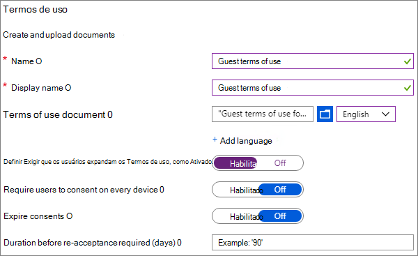

# Criar um ambiente de compartilhamento de convidados seguroCreate a secure guest sharing environment

Neste artigo, abordaremos várias opções para criar um ambiente de compartilhamento de convidados seguro no Microsoft 365.In this article, we'll walk through a variety of options for creating a secure guest sharing environment in Microsoft 365. Este é um cenário de exemplo para dar uma ideia das opções disponíveis.This is an example scenario to give you an idea of the options available. Você pode usar esses procedimentos em diferentes combinações para atender às necessidades de segurança e conformidade da sua organização.You can use these procedures in different combinations to meet the security and compliance needs of your organization. No final deste artigo, vamos abordar um caso de teste para ver como algumas dessas opções funcionam juntas.At the end of the article, we'll walk through a test case to see how some of these options work together.

Esse cenário inclui:This scenario includes:

- Configurar a autenticação multifator para os convidados.Setting up multi-factor authentication for guests.
- Configurar os termos de uso para os convidados.Setting up a terms of use for guests.
- Configurar revisões trimestrais de acesso dos convidados para verificar periodicamente se eles continuam precisando de permissões para equipes e sites.Setting up quarterly guest access reviews to periodically validate whether guests continue to need permissions to teams and sites.
- Restringir convidados a acesso somente Web para dispositivos não gerenciados.Restricting guests to web-only access for unmanaged devices.
- Configurar uma política de tempo limite de sessão para garantir que os convidados autentiquem diariamente.Configuring a session timeout policy to ensure guests authenticate daily.
- Criar e publicar rótulos de sensibilidade para classificar o conteúdo.Creating and publishing sensitivity labels to classify content.
- Criar um tipo de informação confidencial para um projeto altamente confidencial.Creating a sensitive information type for a highly sensitive project.
- Atribuir um rótulo *altamente confidencial* a documentos que contenham o tipo de informação confidencial.Automatically assigning a *highly sensitive* label to documents that contain the sensitive information type.
- Remover automaticamente o acesso de convidados de arquivos rotulados como *altamente confidenciais*.Automatically removing guest access from files labeled as *highly sensitive*.

Algumas das opções discutidas neste artigo exigem que os convidados tenham uma conta do Azure Active Directory.Some of the options discussed in this article require guests to have an account in Azure Active Directory. Para garantir que os convidados sejam incluídos no diretório ao compartilhar arquivos e pastas com eles, use a [integração do SharePoint e do OneDrive com a Visualização B2B do Azure AD](https://docs.microsoft.com/sharepoint/sharepoint-azureb2b-integration-preview).To ensure that guests are included in the directory when you share files and folders with them, use the [SharePoint and OneDrive integration with Azure AD B2B Preview](https://docs.microsoft.com/sharepoint/sharepoint-azureb2b-integration-preview).

Observe que não vamos discutir a habilitação das configurações de compartilhamento de convidados neste artigo.Note that we won't discuss enabling guest sharing settings in this article. Confira [Colaborar com pessoas de fora da sua organização](collaborate-with-people-outside-your-organization.md) para obter detalhes sobre como habilitar o compartilhamento de convidados para diferentes cenários.See [Collaborating with people outside your organization](collaborate-with-people-outside-your-organization.md) for details about enabling guest sharing for different scenarios.

## Configurar a autenticação multifator para convidadosSet up multi-factor authentication for guests

A autenticação multifator reduz significativamente as chances de uma conta ser comprometida.Multi-factor authentication greatly reduces the chances of an account being compromised. Como os usuários convidados podem estar usando contas de email pessoal que não seguem políticas de governança ou práticas recomendadas, é especialmente importante exigir a autenticação multifator para convidados.Since guest users may be using personal email accounts that don't adhere to any governance policies or best practices, it's especially important to require multi-factor authentication for guests. Se um nome e senha de um usuário convidado forem roubados, exigir um segundo fator de autenticação reduz significativamente as chances de que partes desconhecidas obtenham acesso aos seus sites e arquivos.If a guest user's username and password is stolen, requiring a second factor of authentication greatly reduces the chances of unknown parties gaining access to your sites and files.

Neste exemplo, configuraremos a autenticação multifator para convidados usando uma política de acesso condicional do Azure Active Directory.In this example, we'll set up multi-factor authentication for guests by using a conditional access policy in Azure Active Directory.

Configurar a autenticação multifator para convidadosTo set up multi-factor authentication for guests
1. No Microsoft Azure, pesquise *Acesso Condicional*.In Microsoft Azure, search for *Conditional access*.
2. Na folha **Acesso condicional – Políticas**, clique em **Nova Política**.On the **Conditional Access - Policies** blade, click **New policy**.
3. No campo **Nome**, digite *MFA de Convidado*.In the **Name** field, type *Guest MFA*.
4. Em **Atribuições**, clique em **Usuários e grupos**.Under **Assignments**, click **Users and groups**.
5. Na lâmina **Usuários e grupos**, selecione **Selecionar usuários e grupos**, marque a caixa de seleção **Todos os convidados e usuários externos**.On the **Users and groups** blade, select **Select users and groups**, select the **All guests and external users** check box.
6. Em **Atribuições**, clique em **Aplicativos de nuvem ou ações**.Under **Assignments**, click **Cloud apps or actions**.
7. Na lâmina **Aplicativos de nuvem ou ações**, selecione **Todos os aplicativos de nuvem** na guia **Incluir**.On the **Cloud apps or actions** blade, select **All cloud apps** on the **Include** tab.
8. Em **Controles de acesso**, clique em **Conceder**.Under **Access controls**, click **Grant**.
9. Na folha **Conceder**, marque a caixa de seleção **Exigir autenticação multifator**, e, em seguida, clique em **Selecionar**.On the **Grant** blade, select the **Require multi-factor authentication** check box, and then click **Select**.
10. Na folha **Novo**, em **Habilitar política**, clique em **Ativar** e, em seguida, clique em **Criar**.On the **New** blade, under **Enable policy**, click **On**, and then click **Create**.

Agora, o convidado será solicitado a se inscrever na autenticação multifator para que possam acessar conteúdo, sites ou equipes compartilhados.Now, guest will be required to enroll in multi-factor authentication before they can access shared content, sites, or teams.

### Mais informaçõesMore information

[Planejando uma implantação da Autenticação Multifator do Azure baseada em nuvem](https://docs.microsoft.com/azure/active-directory/authentication/howto-mfa-getstarted).[Planning a cloud-based Azure Multi-Factor Authentication deployment](https://docs.microsoft.com/azure/active-directory/authentication/howto-mfa-getstarted)

## Configurar os termos de uso para os convidadosSet up a terms of use for guests

Frequentemente, usuários convidados podem não ter assinado acordos de confidencialidade ou outros acordos legais com sua organização.Often times guest users may not have signed non-disclosure agreements or other legal agreements with your organization. Você pode exigir que os convidados concordem com os termos de uso antes de acessar os arquivos que são compartilhados com eles.You can require guests to agree to a terms of use before accessing files that are shared with them. Os termos de uso podem ser exibidos na primeira vez que tentam acessar um site ou arquivo compartilhado.The terms of use can be displayed the first time they attempt to access a shared file or site.

Para criar os termos de uso, primeiro é necessário criar um documento no Word ou em outro programa de criação e, em seguida, salvá-lo como um arquivo .pdf.To create a terms of use, you first need to create the document in Word or another authoring program, and then save it as a .pdf file. Esse arquivo pode ser carregado no Azure AD.This file can then be uploaded to Azure AD.

Para criar os termos de uso do Azure ADTo create an Azure AD terms of use
1. Entre no Azure como Administrador Global, Administrador de Segurança ou Administrador de Acesso Condicional.Sign in to Azure as a Global Administrator, Security Administrator, or Conditional Access Administrator.
2. Navegue até [Termos de uso](https://aka.ms/catou).Navigate to [Terms of use](https://aka.ms/catou).
3. Clique em **Novos termos**.Click **New terms**. 
   
4. Nas caixas **Nome** e **Exibir nome** boxes, digite *Termos de Uso do Convidado*.In the **Name** and **Display name** boxes, type *Guest terms of use*.
6. Em **Documento Termos de uso**, navegue até o arquivo PDF que você criou e selecione-o.For **Terms of use document**, browse to the pdf file that you created and select it.
7. Selecione o idioma para o documento de termos de uso.Select the language for your terms of use document.
8. Definir **Exigir que os usuários expandam os Termos de uso**, como **Ativado**.Set **Require users to expand the terms of use** to **On**.
9. Em **Acesso Condicional**, na lista **Impor com o modelo de política de Acesso Condicional**, escolha **Criar política de acesso condicional mais tarde**.Under **Conditional Access**, in the **Enforce with Conditional Access policy template** list choose **Create conditional access policy later**.
10. Clique em **Criar**.Click **Create**.

Depois de criar os termos de uso, a próxima etapa é criar uma política de acesso condicional que exibe os termos de uso para os usuários convidados.Once you've created the terms of use, the next step is to create a conditional access policy that displays the terms of use to guest users.

Para criar uma política de acesso condicional:To create a conditional access policy
1. No Microsoft Azure, pesquise *Acesso Condicional*.In Microsoft Azure, search for *Conditional access*.
2. Na folha **Acesso condicional – Políticas**, clique em **Nova Política**.On the **Conditional Access - Policies** blade, click **New policy**.
3. Na caixa **Nome**, digite *Política de termos de uso do usuário convidado*.In the **Name** box, type *Guest user terms of use policy*.
4. Em **Atribuições**, clique em **Usuários e grupos**.Under **Assignments**, click **Users and groups**.
5. Na folha **Usuários e Grupos**, selecione **Selecionar usuários e grupos**, clique na caixa de seleção **Todos os usuários e convidados externos** e, em seguida, clique em **Concluído**.On the **Users and groups** blade, select **Select users and groups**, select the **All guests and external users** check box, and then click **Done**.
6. Em **tarefas**, clique em **Aplicativos de nuvem ou ações**.Under **Assignments**, click **Cloud apps or actions**.
7. Na guia**Incluir**, selecione**Selecionar aplicativos** e, em seguida, clique em **Selecionar**.On the **Include** tab, select **Select apps**, and then click **Select**.
8. Na folha **Selecionar**, selecione **Microsoft Teams**, **Office 365 SharePoint Online** e **Outlook Groups** e, em seguida, clique em **Selecionar**.On the **Select** blade, select **Microsoft Teams**, **Office 365 SharePoint Online**, and **Outlook Groups**, and then click **Select**.
9. Na folha **Aplicativos de nuvem ou ações**, clique em **Concluído**.On the **Cloud apps or actions** blade, click **Done**.
10. Em **Controles de acesso**, clique em \*\* Conceder\*\*.Under **Access controls**, click **Grant**.
11. Na folha **Conceder**, selecione **Temos de uso de convidado**e, em seguida, clique em **Selecionar**.On the **Grant** blade, select **Guest terms of use**, and then click **Select**.
12. Na folha **Novo**, em **Habilitar política**, clique em **Ativar** e, em seguida, clique em **Criar**.On the **New** blade, under **Enable policy**, click **On**, and then click **Create**.

Agora, na primeira vez que um usuário convidado tentar acessar o conteúdo ou uma equipe ou um site em sua organização, será necessário aceitar os termos de uso.Now, the first time a guest user attempts to access content or a team or site in your organization, they will be required to accept the terms of use.

> [!NOTE]
> Usar o acesso condicional exige uma licença do Azure AD Premium P1.Using Conditional Access requires an Azure AD Premium P1 license. Para mais informações, confira [O que é acesso condicional](https://docs.microsoft.com/azure/active-directory/conditional-access/overview).For more information, see [What is Conditional Access](https://docs.microsoft.com/azure/active-directory/conditional-access/overview).

### Mais informaçõesMore information
[Termos de uso do Azure Active DirectoryAzure Active Directory terms of use](https://docs.microsoft.com/azure/active-directory/conditional-access/terms-of-use)

## Acesso de convidado com revisões de acessoSet up guest access reviews

Com as revisões de acesso no Azure AD, você pode automatizar uma revisão periódica do acesso do usuário a várias equipes e grupos.With access reviews in Azure AD, you can automate a periodic review of user access to various teams and groups. Requerer uma revisão do acesso dos convidados, pode ajudar a garantir que os usuários convidados não mantenham o acesso às informações confidenciais de sua organização por mais tempo do que o necessário.By requiring an access review for guests specifically, you can help ensure guest users do not retain access to your organization's sensitive information for longer than is necessary.

As revisões de acesso podem ser organizadas em programas.Access reviews can be organized into programs. Um programa é um agrupamento de revisões similares de acesso, que podem ser usadas para organizar revisões de acesso para fins de auditoria e relatórios.A program is a grouping of similar access reviews that can be used to organize access reviews for reporting and auditing purposes.

Neste exemplo, criaremos um programa para as revisões de acesso de convidado.In this example, we'll create a program for guest access reviews.

Para criar um programaTo create a program
1. Entre no portal do Azure e abra a página [Governança de Identidade](https://portal.azure.com/#blade/Microsoft_AAD_ERM/DashboardBlade).Sign in to the Azure portal and open the [Identity Governance page](https://portal.azure.com/#blade/Microsoft_AAD_ERM/DashboardBlade).
2. No menu à esquerda, clique em **Programas**.In the left menu, click **Programs**
3. Clique em **Novo Programa**.Click **New program**.
4. Na caixa **Nome**, digite *Programa de revisão de acesso de convidado*.In the **Name** box, type *Guest access review program*.
5. Na caixa **Descrição**, digite *Programa para as revisões de acesso de convidado*.In the **Description** box, type *Program for guest access reviews*.
6. Clique em **Criar**.Click **Create**.

Depois de criar o programa, pode-se criar uma revisão de acesso de convidado e associá-la com o programa.Once the program has been created, we can create a guest access review and associate it with the program.

Configurar uma revisão de acesso de usuário convidadoTo set up a guest user access review
1. Na página [Governança de Identidade](https://portal.azure.com/#blade/Microsoft_AAD_ERM/DashboardBlade), no menu à esquerda, clique em **Revisões de acesso**.On the [Identity Governance page](https://portal.azure.com/#blade/Microsoft_AAD_ERM/DashboardBlade), in the left menu, click **Access reviews**.
2. Clique em **Novas revisões de acesso**.Click **New access review**. 
   
3. Na caixa **Nome**, digite *Revisão trimestral de acesso de convidado*.In the **Name** box, type *Quarterly guest access review*.
4. Por **Frequência**, escolha **Trimestral**.For **Frequency**, choose **Quarterly**.
5. Para **Fim**, escolha **Nunca.**For **End**, choose **Never**.
6. Em **Escopo**, escolha **Somente usuários convidados**.For **Scope**, choose **Guest users only**.
7. Clique em **Grupo**, selecione os grupos que você deseja incluir na revisão de acesso e, em seguida, clique em **Selecionar**.Click **Group**, select the groups that you want to include in the access review, and then click **Select**.
8. Em **Programas**, clique em**Vincular ao programa**.Under **Programs**, click **Link to program**.
9. Na folha **Selecionar um programa**, escolha **Programa de revisão de acesso de convidado**On the **Select a program** blade, choose **Guest access review program**
10. Clique em **Iniciar**.Click **Start**.

Uma revisão de acesso separada é criada para cada grupo que você especificar.A separate access review is created for each group that you specify. Para os proprietários de grupo de cada grupo serão enviados emails trimestrais para aprovar ou negar o acesso de convidado aos grupos.Group owners of each groups will be emailed quarterly to approve or deny guest access to their groups.

É importante observar que os convidados podem ter acesso a equipes ou grupos, ou a arquivos e pastas individuais.It's important to note that guests can be given access to teams or groups, or to individual files and folders. Quando o acesso a arquivos e pastas é fornecido, os convidados não podem ser adicionados a qualquer grupo específico.When given access to files and folders, guests may not be added to any particular group. Se você quiser fazer revisões de acesso em usuários convidados que não pertencem a uma equipe ou grupo, é possível criar um grupo dinâmico no Azure AD que contenha todos os convidados e, em seguida, criar uma revisão de acesso para esse grupo.If you want to do access reviews on guest users who don't belong to a team or group, you can create a dynamic group in Azure AD to contain all guests and then create an access review for that group.

### Mais informaçõesMore information
[Gerenciar o acesso de convidado com revisões de acesso do Azure ADManage guest access with Azure AD access reviews](https://docs.microsoft.com/azure/active-directory/governance/manage-guest-access-with-access-reviews)

[Criar uma revisão de acesso de grupos ou aplicativos nas revisões de acesso do Azure ADCreate an access review of groups or applications in Azure AD access reviews](https://docs.microsoft.com/azure/active-directory/governance/create-access-review)

## Configurar o acesso somente da Web para usuários convidadosSet up web-only access for guest users

É possível reduzir sua superfície de ataque e facilitar a administração exigindo que os usuários convidados acessem suas equipes, sites e arquivos usando apenas um navegador da Web.You can reduce your attack surface and ease administration by requiring guest users to access your teams, sites, and files by using a web browser only. Isso é feito com uma política de acesso condicional do Azure AD.This is done with an Azure AD conditional access policy.

Para restringir os convidados para o acesso apenas WebTo restrict guests to web-ony access
1. No Microsoft Azure, pesquise *Acesso Condicional*.In Microsoft Azure, search for *Conditional access*.
2. Na folha **Acesso condicional – Políticas**, clique em **Nova Política**.On the **Conditional Access - Policies** blade, click **New policy**.
3. Na caixa **Nome**, digite *Navegador de acesso do usuário convidado*.In the **Name** box, type *Guest user browser access*.
4. Em **Atribuições**, clique em **Usuários e grupos**.Under **Assignments**, click **Users and groups**.
5. Na folha **Usuários e Grupos**, selecione **Selecionar usuários e grupos**, clique na caixa de seleção **Todos os usuários e convidados externos** e, em seguida, clique em **Concluído**.On the **Users and groups** blade, select **Select users and groups**, select the **All guests and external users** check box, and then click **Done**.
6. Em **tarefas**, clique em **Aplicativos de nuvem ou ações**.Under **Assignments**, click **Cloud apps or actions**.
7. Na guia**Incluir**, selecione**Selecionar aplicativos** e, em seguida, clique em **Selecionar**.On the **Include** tab, select **Select apps**, and then click **Select**.
8. Na folha **Selecionar**, selecione **Microsoft Teams**, **Office 365 SharePoint Online** e **Outlook Groups** e, em seguida, clique em **Selecionar**.On the **Select** blade, select **Microsoft Teams**, **Office 365 SharePoint Online**, and **Outlook Groups**, and then click **Select**.
9. Na folha **Aplicativos de nuvem ou ações**, clique em **Concluído**.On the **Cloud apps or actions** blade, click **Done**.
10. Em **Tarefas**, clique em **Condições**.Under **Assignments**, click **Conditions**.
11. Na folha **Condições**, clique em **Aplicativos cliente**.On the **Conditions** blade, click **Client apps**.
12. Na folha **Aplicativos dos cliente**, clique em **Sim** para **Configurar** e selecione a configuração **Aplicativos móveis e clientes de desktop**.On the **Client apps** blade, click **Yes** for **Configure**, and then select the **Mobile apps and desktop clients** setting. 
    
13. Clique em **Concluído** e, em seguida na folha **condições** e clique novamente em **Concluído**.Click **Done**, and then on the **Conditions** blade, click **Done** again.
14. Em **Controles de acesso**, clique em \*\* Conceder\*\*.Under **Access controls**, click **Grant**.
15. Na folha**Conceder**, selecione**Exigir que o dispositivo seja marcado como em conformidade** e **Exigir o Dispositivo adicionado ao Azure AD híbrido**.On the **Grant** blade, select **Require device to be marked as compliant** and **Require Hybrid Azure AD joined device**.
16. Em **Para vários controles**, selecione **Exigir um dos controles selecionados** e, em seguida, clique em **Selecionar**.Under **For multiple controls**, select **Require one of the selected controls**, and then click **Select**.
17. Na folha **Novo**, em **Habilitar política**, clique em **Ativar** e, em seguida, clique em **Criar**.On the **New** blade, under **Enable policy**, click **On**, and then click **Create**.

## Configurar o tempo limite de uma sessão para usuários convidadosConfigure a session timeout for guest users

Exigir que os convidados autentiquem de forma regular pode reduzir a possibilidade de usuários desconhecidos acessar o conteúdo da sua organização se o dispositivo de um usuário convidado não for seguro.Requiring guests to authenticate on a regular basis can reduce the possibility of unknown users accessing your organization's content if a guest user's device isn't kept secure. Você pode configurar uma política de acesso condicional de tempo limite de sessão para usuários convidados no Azure AD.You can configure a session timeout conditional access policy for guest users in Azure AD.

Para configurar uma política de tempo limite de sessão de convidadoTo configure a guest session timeout policy
1. No Microsoft Azure, pesquise *Acesso Condicional*.In Microsoft Azure, search for *Conditional access*.
2. Na folha **Acesso condicional – Políticas**, clique em **Nova Política**.On the **Conditional Access - Policies** blade, click **New policy**.
3. Na caixa **Nome**, digite *Tempo limite de sessão de convidado*.In the **Name** box, type *Guest session timeout*.
4. Em **Atribuições**, clique em **Usuários e grupos**.Under **Assignments**, click **Users and groups**.
5. Na folha **Usuários e Grupos**, selecione **Selecionar usuários e grupos**, clique na caixa de seleção **Todos os usuários e convidados externos** e, em seguida, clique em **Concluído**.On the **Users and groups** blade, select **Select users and groups**, select the **All guests and external users** check box, and then click **Done**.
6. Em **tarefas**, clique em **Aplicativos de nuvem ou ações**.Under **Assignments**, click **Cloud apps or actions**.
7. Na guia**Incluir**, selecione**Selecionar aplicativos** e, em seguida, clique em **Selecionar**.On the **Include** tab, select **Select apps**, and then click **Select**.
8. Na folha **Selecionar**, selecione **Microsoft Teams**, **Office 365 SharePoint Online** e **Outlook Groups** e, em seguida, clique em **Selecionar**.On the **Select** blade, select **Microsoft Teams**, **Office 365 SharePoint Online**, and **Outlook Groups**, and then click **Select**.
9. Na folha **Aplicativos de nuvem ou ações**, clique em **Concluído**.On the **Cloud apps or actions** blade, click **Done**.
10. Em **Controles de acesso**, clique em **Sessão**.Under **Access controls**, click **Session**.
11. Na folha **Sessão**, selecione **Frequência de entrada**.On the **Session** blade, select **Sign-in frequency**.
12. Selecione **1** e**Dias** para o período de tempo e, em seguida, clique em **Selecionar**.Select **1** and **Days** for the time period, and then click **Select**.
13. Na folha **Novo**, em **Habilitar política**, clique em **Ativar** e, em seguida, clique em **Criar**.On the **New** blade, under **Enable policy**, click **On**, and then click **Create**.

## Criar rótulos de confidencialidadeCreate sensitivity labels

Os rótulos de confidencialidade podem ser usados de várias maneiras para classificar e proteger as informações da sua organização.Sensitivity labels can be used in a variety of ways to classify and protect your organization's information. Neste exemplo, veremos como os rótulos podem ser usados para ajudá-lo a gerenciar o acesso de convidados a arquivos e pastas compartilhados.In this example, we'll look at how labels can be used to help you manage guest access to shared files and folders.

Primeiro, criaremos três rótulos de confidencialidade no Centro de Conformidade do Microsoft 365:First, we'll create three sensitivity labels in the Microsoft 365 Compliance Center:

- GeralGeneral
- confidencialsensitive
- Altamente confidencialHighly sensitive

Use o procedimento a seguir para os rótulos *Geral* e *confidencial*.Use the following procedure to create the *General* and *sensitive* labels.

Para criar um rótulo de classificação (Geral e confidencial)To create a classification label (General and sensitive)
1. No [Centro de Conformidade do Microsoft 365r](https://compliance.microsoft.com), na navegação à esquerda, expanda **Classificação** e, em seguida, clique em **Rótulos de Confidencialidade**.In the [Microsoft 365 Compliance Center](https://compliance.microsoft.com), in the left navigation, expand **Classification**, and then click **Sensitivity labels**.
2. Clique em **Criar um rótulo**.Click **Create a label**.
3. Em **Nome do rótulo**, digite *Geral* ou *confidencial*.In **Label name**, type *General* or *sensitive*.
4. Em **Dica de ferramenta**, digite *Informações gerais que possam ser compartilhadas com funcionários, convidados e parceiros* ou *Informações confidenciais. Compartilhe somente com funcionários e convidados autorizados*, e, em seguida, clique em **Avançar**.In **Tooltip**, type *General information that can be shared with employees, guests, and partners* or *sensitive information. Share only with employees and authorized guests*, and then click **Next**.
5. Deixe a criptografia **Desativada** e clique em **Avançar**.Leave encryption **Off** and click **Next**.
6. Deixe a marcação de conteúdo **Desativada** e clique em **Avançar**.Leave content marking **Off** and click **Next**.
7. Deixe a prevenção contra perda de dados **Desativada** e clique em **Avançar**.Leave endpoint data loss prevention **Off** and click **Next**.
8. Deixe rotular automaticamente **Desativado** e clique em **Avançar**.Leave auto labeling **Off** and click **Next**.
9. Clique em **Criar**.Click **Create**.

Com o rótulo *Altamente Confidencial*, adicionaremos uma marca d' água automática aos documentos com o rótulo.With the *Highly sensitive* label, we'll add automatic watermarking of documents with the label.

Para criar um rótulo de classificação (Altamente confidencial)To create a classification label (Highly sensitive)
1. Clique em **Criar um rótulo**.Click **Create a label**.
2. Em **Nome do rótulo**, digite *Altamente confidencial*.In **Label name**, type *Highly sensitive*.
3. Em **Dica de ferramenta**, digite *Informações altamente confidenciais. Não compartilhe com convidados* e, em seguida, clique em **Avançar**.In **Tooltip**, type *Highly sensitive information. Do not share with guests*, and then click **Next**.
4. Deixe a criptografia **Desativada** e clique em **Avançar**.Leave encryption **Off** and click **Next**.
5. **Ative** a marcação de conteúdo, marque a caixa de seleção **Adicionar um cabeçalho** e clique em **Personalizar texto**.Turn content marking **On**, select the **Add a header** check box, and then click **Customize text**.
6. Digite *Altamente confidencial*no texto do cabeçalho e clique em **Salvar**.Type *Highly sensitive* for the header text and click **Save**.
7. Na página **Marcação de conteúdo**, **Ative** a marcação de conteúdo.On the **Content marking** page, turn content marking **On**.
8. Marque a caixa de seleção **Adicionar uma marca d' água** e, em seguida, clique em **Personalizar texto**.Select the **Add a watermark** check box, and then click **Customize text**.
9. Em **Texto da marca d'água**,digite *Altamente confidencial*.For **Watermark text**, type *Highly sensitive*.
10. Digite *24* como **Tamanho da fonte** e, em seguida, clique em **Salvar**.Type *24* for **Font size**, and then click **Save**.
11. Na página **Marcação de conteúdo**, clique **Avançar**.On the **Content marking** page, click **Next**.
12. Deixe a prevenção contra perda de dados **Desativada** e clique em **Avançar**.Leave endpoint data loss prevention **Off** and click **Next**.
13. Deixe rotular automaticamente **Desativado** e clique em **Avançar**.Leave auto labeling **Off** and click **Next**.
14. Clique em **Criar**.Click **Create**.

Depois de criar os rótulos, a próxima etapa é publicá-los.Once you've created the labels, the next step is to publish them. 

Publicar rótulosTo publish labels
1. Na página **Rótulos de confidencialidade**, clique em **Publicar rótulos**.On the **Sensitivity labels** page, click **Publish labels**.
2. Clique em **Escolher rótulos para publicar**.Click **Choose labels to publish**.
3. Clique em **Adicionar**, selecione os rótulos que você criou e clique em **Adicionar**.Click **Add**, select the labels that you created, and then click **Add**.
4. Clique em **Concluído**.Click **Done**.
5. Clique em **Avançar**.Click **Next**.
6. Deixe os usuários e grupos definidos como **Todos** e clique em **Avançar**.Leave the users and groups set to **All** and click **Next**.
7. Em **Aplicar este rótulo por padrão a documentos e lista de emails**, escolha **Geral** e, em seguida, clique em **Avançar**.In the **Apply this label by default to documents and email** list, choose **General**, and then click **Next**.
8. Na página **Configurações de política**, digite *Confidencialidade do Documento* para o nome e, em seguida, clique em **Avançar.**.On the **Policy settings** page, type *Document sensitivity* for the name, and then click **Next**.
9. Clique em **Publicar**.Click **Publish**.

Com os rótulos publicados, eles ficam disponíveis para os usuários dos aplicativos da área de trabalho do Office.With the labels published, they're available to users of Office desktop apps. Quando os usuários aplicam o rótulo **Altamente confidencial**, uma marca d' água é adicionada automaticamente ao documento.When users apply the **Highly sensitive** label, a watermark is automatically added to the document.

### Mais informaçõesMore information
[Visão geral de rótulos de confidencialidadeOverview of sensitivity labels](https://docs.microsoft.com/Office365/SecurityCompliance/sensitivity-labels)

## Criar um tipo de informação confidencial para um projeto altamente confidencial.Create a sensitive information type for a highly sensitive project

Os tipos de informações confidenciais são cadeias de caracteres predefinidas que podem ser usadas em fluxos de trabalho de política para reforçar os requisitos de conformidade.Sensitive information types are predefined strings that can be used in policy workflows to enforce compliance requirements. O Centro de Conformidade da Microsoft 365 vem com mais de 100 tipos de informações confidenciais, incluindo números de carteira de motorista, números de cartão de crédito, números de contas bancárias, etc.The Microsoft 365 Compliance Center comes with over one hundred sensitive information types, including driver's license numbers, credit card numbers, bank account numbers, etc.

Você pode criar tipos de informações confidenciais personalizados para ajudar a gerenciar o conteúdo específico da sua organização.You can create custom sensitive information types to help manage content specific to your organization. Neste exemplo, criaremos um tipo personalizado de informação confidencial para um projeto altamente confidencial.In this example, we'll create a custom sensitive information type for a highly sensitive project. Podemos usar esse tipo de informação confidencial para aplicar automaticamente um rótulo de classificação.We can then use this sensitive information type to automatically apply a classification label.

Criar um tipo de informação confidencialTo create a sensitive information type
1. No [Centro de Conformidade do Microsoft 365r](https://compliance.microsoft.com), na navegação à esquerda, expanda **Classificação** e, em seguida, clique em **Tipos de informação de confidencialidade**.In the [Microsoft 365 Compliance Center](https://compliance.microsoft.com), in the left navigation, expand **Classification**, and then click **Sensitive info types**.
2. Clique em **Criar**.Click **Create**.
3. Para **Nome** e **Descrição**, digite **Projeto Saturno** e, em seguida, clique em **Avançar**.For **Name** and **Description**, type **Project Saturn**, and then click **Next**.
4. Clique em **Adicionar um elemento**.Click **Add an element**.
5. Em **Detectar conteúdo contendo lista**, selecione **Palavras-chave**e, em seguida, digite *Projeto Saturno* na caixa de palavra-chave.On the **Detect content containing** list, select **Keywords**, and then type *Project Saturn* in the keyword box.
6. Clique em **Avançar** e em **Concluir**.Click **Next**, and then click **Finish**.
7. Se você quiser testar o tipo de informação confidencial, clique em **Não**.If asked if you would like to test the sensitive information type, click **No**.

### Mais informaçõesMore information
[Personalizar tipos de informação confidencialCustom sensitive information types](https://docs.microsoft.com/Office365/SecurityCompliance/custom-sensitive-info-types)

## Criar uma política para atribuir um rótulo baseado em um tipo de informação confidencialCreate a policy to assign a label based on a sensitive information type

Depois de criar o tipo de informação confidencial, podemos criar uma política de arquivo no Microsoft Cloud App Security para aplicar o rótulo *Altamente confidencial* aos documentos que contêm a cadeia de caracteres *Projeto Saturno* automaticamente.Once the sensitive information type is created, we can create a file policy in Microsoft Cloud App Security to apply the *Highly sensitive* label to documents that contain the *Project Saturn* string automatically.

> [!NOTE]
> Há um processo de replicação que torna os rótulos de confidencialidade disponíveis na Cloud App Security.There is a replication process that makes sensitivity labels available in Cloud App Security. Você pode não ver o rótulo disponível para uma política imediatamente.You may not see the label available for a policy right away.

Criar uma política de arquivo baseada no tipo de informação confidencialTo create a sensitive information type-based file policy
1. Abra o [Microsoft Cloud App Security](https://portal.cloudappsecurity.com).Open [Microsoft Cloud App Security](https://portal.cloudappsecurity.com).
2. Na barra de navegação à esquerda expanda **Controle** e, em seguida, clique em **Políticas**.In the left navigation, expand **Control**, and then click **Policies**.
3. Clique em **Criar política** e, em seguida, escolha **Política de arquivo**.Click **Create policy**, and then choose **File policy**.
4. Para **Nome da politica**, digite *Rotulagem Projeto Saturno*.For **Policy name**, type *Project Saturn labeling*.
5. Em **criar um filtro para os arquivos que essa política usará**, clique em X duas vezes para excluir os filtros padrão.Under **Create a filter for the files this policy will act on**, click X twice to delete the default filters.
7. Na lista **Selecionar um filtro**, escolha **Aplicativo**, e, em seguida, selecione **Microsoft SharePoint Online** da lista **Selecionar aplicativos...**.In the **Select a filter** list, choose **App**, and then select **Microsoft SharePoint Online** from the **Select apps...** list.
8. Em **Método de inspeção**, escolha **Serviço de classificação de dados**.Under **Inspection method**, choose **Data classification service**.
9. Na lista **Escolher tipo de inspeção**,escolha **Tipo de informação confidencial**.On the **Choose inspection type** list, choose **Sensitive information type**.
10. Pesquise e selecione o rótulo de confidencialidade do *Projeto Saturno* e clique em **Concluído**.Search for and select the *Project Saturn* sensitivity label, and then click **Done**. 
   
11. Em **Governança**, expanda **Microsoft SharePoint Online**.Under **Governance**, expand **Microsoft SharePoint Online**.
12. Marque a caixa de seleção **Aplicar rótulo de classificação** e selecione o rótulo **Altamente confidencial**.Select the **Apply classification label** check box and select the **Highly sensitive** label.
13. Clique em **Criar**.Click **Create**.

Com a política implantada, quando um usuário digita "Projeto Saturno" em um documento, o Cloud App Security aplica automaticamente o rótulo *Altamente confidencial* ao verificar o arquivo.With the policy in place, when a user types "Project Saturn" into a document, Cloud App Security will automatically apply the *Highly sensitive* label when it scans the file.

### Mais informaçõesMore information
[Políticas de arquivoFile policies](https://docs.microsoft.com/cloud-app-security/data-protection-policies)

## Criar uma política para remover o acesso de convidados a arquivos altamente confidenciaisCreate a policy to remove guest access to highly sensitive files

No exemplo neste artigo, os arquivos com o rótulo *Altamente confidencial* não devem ser compartilhados com convidados.In the example in this article, files with the *Highly sensitive* label shouldn't be shared with guests. Podemos criar uma política de arquivo na Cloud App Security que remove automaticamente o acesso de convidados de arquivos com esse rótulo.We can create a file policy in Cloud App Security that automatically removes guest access from files with that label.

Observe que isso não impede que os usuários compartilhem ou compartilhem novamente esses arquivos.Note that this doesn't prevent users from sharing or re-sharing these files. Depende ainda que seus usuários sigam as políticas de governança para os arquivos armazenados em sites que permitem o compartilhamento de convidados.You're still reliant on your users to follow your governance policies for files that are stored in sites that allow guest sharing. No entanto, isso pode ser uma ferramenta útil para remover o acesso de convidados a arquivos que tiveram informações confidenciais adicionadas a eles após terem sido compartilhados com convidados.However, this can be a useful tool for removing guest access from files that had sensitive information added to them after they were shared with guests.

Para criar uma política de arquivo baseada em rótulosTo create a label-based file policy
1. Abra o [Microsoft Cloud App Security](https://portal.cloudappsecurity.com).Open [Microsoft Cloud App Security](https://portal.cloudappsecurity.com).
2. Na barra de navegação à esquerda expanda **Controle** e, em seguida, clique em **Políticas**.In the left navigation, expand **Control**, and then click **Policies**.
3. Clique em **Criar política** e, em seguida, escolha **Política de arquivo**.Click **Create policy**, and then choose **File policy**.
4. Para **Nome da politica**, digite *Projeto Saturno - remover acesso de convidado*.For **Policy name**, type *Project Saturn - remove guest access*.
5. Em **criar um filtro para os arquivos que essa política usará**, clique em X duas vezes para excluir os filtros padrão.Under **Create a filter for the files this policy will act on**, click X twice to delete the default filters.
6. Na lista **Selecionar um filtro**, escolha **Aplicativo**, e, em seguida, selecione **Microsoft SharePoint Online** da lista **Selecionar aplicativos...**.In the **Select a filter** list, choose **App**, and then select **Microsoft SharePoint Online** from the **Select apps...** list.
7. Clique em **Adicionar um filtro**.Click **Add a filter**.
8. Na lista **Selecionar um filtro**, escolha **Rótulo de classificação** e, em seguida, selecione **Proteção de informações do Azure** na lista **Selecionar filtro...**.In the **Select a filter** list, choose **Classification label**, and then select **Azure Information Protection** from the **Select filter...** list.
9. Na lista **Selecionar rótulo de classificação**, selecione **Altamente confidencial**.In the **Select classification label** list, select **Highly sensitive**. 
   
10. Em **Governança**, expanda **Microsoft SharePoint Online**.Under **Governance**, expand **Microsoft SharePoint Online**.
11. Marque as caixas de seleção **Enviar resumo da política de correspondência aos proprietários do arquivo** e **Remover usuários externos**.Select the **Send policy-match digest to file owner** and **Remove external users** check boxes.
12. Para a mensagem de notificação personalizada, digite *Esse arquivo é altamente confidencial. A política da empresa proíbe o compartilhamento com os convidados*.For the custom notification message, type *This file is highly sensitive. Company policy prohibits sharing it with guests*.
13. Clique em **Criar**.Click **Create**.

É importante observar que essa política remove o acesso a arquivos compartilhados usando um link para *Pessoas específicas*.It's important to note, that this policy removes access for files shared using a *Specific people* link. Isso não remove o acesso de links (*Qualquer pessoa*) não autenticados.It doesn't remove access from unauthenticated (*Anyone*) links. Ele também não removerá o acesso se o convidado for um membro do site ou da equipe como um todo.It also doesn't remove access if the guest is a member of the site or team as a whole. Se você planeja ter documentos altamente confidenciais em um site ou uma equipe com membros convidados, considere o uso de [canais privados no Teams](https://support.office.com/article/60ef929a-4d68-418b-bf4f-5784db184ec9)e apenas permita os membros de sua organização nos canais privados.If you plan to have highly sensitive documents in a site or team with guest members, consider using [private channels in Teams](https://support.office.com/article/60ef929a-4d68-418b-bf4f-5784db184ec9) and only allowing members of your organization in the private channels.

## Testar a soluçãoTest the solution

Para testar a solução descrita neste artigo, crie um documento do Word e salve-o em uma biblioteca de documentos.To test the solution described in this article, create a Word document and save it to a document library. Compartilhe o arquivo com um usuário convidado.Share the file with a guest user. Quando o convidado tenta acessar o documento, ele deve ser solicitado a se inscrever na autenticação multifator e, em seguida, aceitar os termos de uso.When the guest attempts to access the document, they should be required to enroll in multi-factor authentication, and then accept the terms of use.

Quando o convidado tiver acesso ao documento, digite *Projeto Saturno* no documento e salve-o.Once the guest has access to the document, type *Project Saturn* in the document and save it. Uma vez que o Cloud App Security analisa o documento, o rótulo *Altamente confidencial* deve ser aplicado e o usuário convidado não deve mais acessá-lo.Once Cloud App Security scans the document, the *Highly sensitive* label should be applied and the guest user should no longer have access to it.

Você pode usar as ferramentas descritas neste artigo em várias combinações para ajudar a criar um ambiente de compartilhamento de convidados seguro e confiável para sua organização.You can use the tools described in this article in various combinations to help create a productive but safe guest sharing environment for your organization.

## Opções adicionaisAdditional options

Há algumas opções adicionais no Microsoft 365 e no Azure Active Directory que podem ajudar a proteger seu ambiente de compartilhamento de convidado.There are some additional options in Microsoft 365 and Azure Active Directory that can help secure your guest sharing environment.

- Você pode criar uma lista de domínios de compartilhamento permitidos ou negados para limitar com quem os usuários podem compartilhar.You can create a list of allowed or denied sharing domains to limit who users can share with. Confira [restringir o compartilhamento de conteúdo do SharePoint e do OneDrive por domínio](https://docs.microsoft.com/sharepoint/restricted-domains-sharing) e [Permitir ou bloquear convites para usuários B2B de organizações específicas](https://docs.microsoft.com/azure/active-directory/b2b/allow-deny-list) para obter mais informações.See [Restrict sharing of SharePoint and OneDrive content by domain](https://docs.microsoft.com/sharepoint/restricted-domains-sharing) and [Allow or block invitations to B2B users from specific organizations](https://docs.microsoft.com/azure/active-directory/b2b/allow-deny-list) for more information.
- Você pode limitar os locatários do Azure Active Directory aos quais seus usuários podem se conectar.You can limit which other Azure Active Directory tenants your users can connect to. Confira [Usar restrições de locatário para gerenciar o acesso aos aplicativos de nuvem SaaS](https://docs.microsoft.com/azure/active-directory/manage-apps/tenant-restrictions) para mais informações. See [Use tenant restrictions to manage access to SaaS cloud applications](https://docs.microsoft.com/azure/active-directory/manage-apps/tenant-restrictions) for information.
- Você pode criar um ambiente gerenciado em que os parceiros podem ajudar a gerenciar contas de convidado.You can create a managed environment where partners can help manage guest accounts. Confira [Criar uma extranet B2B com convidados gerenciados](https://docs.microsoft.com/Office365/Enterprise/b2b-extranet) para obter mais informações.See [Create a B2B extranet with managed guests](https://docs.microsoft.com/Office365/Enterprise/b2b-extranet) for information.

## Confira tambémSee Also

[Limitar a exposição acidental dos arquivos ao compartilhar com convidadosLimit accidental exposure to files when sharing with guests](share-limit-accidental-exposure.md)

[Práticas recomendadas para compartilhar arquivos e pastas com usuários não autenticadosBest practices for sharing files and folders with unauthenticated users](best-practices-anonymous-sharing.md)

[Crie uma extranet B2B com convidados gerenciadosCreate a B2B extranet with managed guests](b2b-extranet.md)
