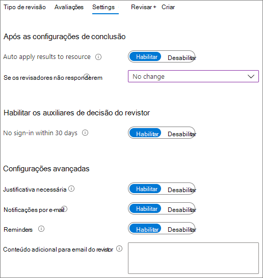

# Criar um ambiente de compartilhamento de convidados seguroCreate a secure guest sharing environment

Neste artigo, abordaremos várias opções para criar um ambiente de compartilhamento de convidados seguro no Microsoft 365.In this article, we'll walk through a variety of options for creating a secure guest sharing environment in Microsoft 365. Estes são exemplos para dar uma ideia das opções disponíveis.These are examples to give you an idea of the options available. Você pode usar esses procedimentos em diferentes combinações para atender às necessidades de segurança e conformidade da sua organização.You can use these procedures in different combinations to meet the security and compliance needs of your organization.

Este artigo inclui:This article includes:

- Configurar a autenticação multifator para os convidados.Setting up multi-factor authentication for guests.
- Configurar os termos de uso para os convidados.Setting up a terms of use for guests.
- Configurar revisões trimestrais de acesso dos convidados para verificar periodicamente se eles continuam precisando de permissões para equipes e sites.Setting up quarterly guest access reviews to periodically validate whether guests continue to need permissions to teams and sites.
- Restringir convidados a acesso somente Web para dispositivos não gerenciados.Restricting guests to web-only access for unmanaged devices.
- Configurar uma política de tempo limite de sessão para garantir que os convidados autentiquem diariamente.Configuring a session timeout policy to ensure guests authenticate daily.
- Criação de um tipo de informação confidencial para um projeto altamente confidencial.Creating a sensitive information type for a highly sensitive project.
- Atribuição automática de um rótulo de confidencialidade a documentos que contêm um tipo de informação confidencial.Automatically assigning a sensitivity label to documents that contain a sensitive information type.
- Removendo automaticamente o acesso de convidados de arquivos com um rótulo de confidencialidade.Automatically removing guest access from files with a sensitivity label.

Algumas das opções discutidas neste artigo exigem que os convidados tenham uma conta do Azure Active Directory.Some of the options discussed in this article require guests to have an account in Azure Active Directory. Para garantir que os convidados sejam incluídos no diretório ao compartilhar arquivos e pastas com eles, use a [integração do SharePoint e do OneDrive com a Visualização B2B do Azure AD](/sharepoint/sharepoint-azureb2b-integration-preview).To ensure that guests are included in the directory when you share files and folders with them, use the [SharePoint and OneDrive integration with Azure AD B2B Preview](/sharepoint/sharepoint-azureb2b-integration-preview).

Observe que não vamos discutir a habilitação das configurações de compartilhamento de convidados neste artigo.Note that we won't discuss enabling guest sharing settings in this article. Confira [Colaborar com pessoas de fora da sua organização](collaborate-with-people-outside-your-organization.md) para obter detalhes sobre como habilitar o compartilhamento de convidados para diferentes cenários.See [Collaborating with people outside your organization](collaborate-with-people-outside-your-organization.md) for details about enabling guest sharing for different scenarios.

## Configurar a autenticação multifator para convidadosSet up multi-factor authentication for guests

A autenticação multifator reduz significativamente as chances de uma conta ser comprometida.Multi-factor authentication greatly reduces the chances of an account being compromised. Como os convidados podem usar contas de email pessoais que não aderem a nenhuma política de governança ou práticas recomendadas, é especialmente importante exigir autenticação multifator para convidados.Since guests may be using personal email accounts that don't adhere to any governance policies or best practices, it's especially important to require multi-factor authentication for guests. Se o nome de usuário e a senha de um convidado forem roubados, exigir um segundo fator de autenticação reduz muito as chances de partes desconhecidas obterem acesso aos seus sites e arquivos.If a guest's username and password is stolen, requiring a second factor of authentication greatly reduces the chances of unknown parties gaining access to your sites and files.

Neste exemplo, configuraremos a autenticação multifator para convidados usando uma política de acesso condicional do Azure Active Directory.In this example, we'll set up multi-factor authentication for guests by using a conditional access policy in Azure Active Directory.

Configurar a autenticação multifator para convidadosTo set up multi-factor authentication for guests

1. Vá para [Políticas de acesso condicional do Azure](https://portal.azure.com/#blade/Microsoft_AAD_IAM/ConditionalAccessBlade).Go to [Azure conditional access policies](https://portal.azure.com/#blade/Microsoft_AAD_IAM/ConditionalAccessBlade).
2. No **Acesso Condicional | Na folha Políticas**, clique em **Nova política**.On the **Conditional Access | Policies** blade, click **New policy**.
3. No campo **Nome**, digite um nome.In the **Name** field, type a name.
4. Em **Atribuições**, clique em **Usuários e grupos**.Under **Assignments**, click **Users and groups**.
5. Na lâmina **Usuários e grupos**, selecione **Selecionar usuários e grupos**, marque a caixa de seleção **Todos os convidados e usuários externos**.On the **Users and groups** blade, select **Select users and groups**, select the **All guests and external users** check box.
6. Em **Atribuições**, clique em **Aplicativos de nuvem ou ações**.Under **Assignments**, click **Cloud apps or actions**.
7. Na lâmina **Aplicativos de nuvem ou ações**, selecione **Todos os aplicativos de nuvem** na guia **Incluir**.On the **Cloud apps or actions** blade, select **All cloud apps** on the **Include** tab.
8. Em **Controles de acesso**, clique em **Conceder**.Under **Access controls**, click **Grant**.
9. Na folha **Conceder**, marque a caixa de seleção **Exigir autenticação multifator**, e, em seguida, clique em **Selecionar**.On the **Grant** blade, select the **Require multi-factor authentication** check box, and then click **Select**.
10. Na folha **Novo**, em **Habilitar política**, clique em **Ativar** e, em seguida, clique em **Criar**.On the **New** blade, under **Enable policy**, click **On**, and then click **Create**.

Agora, o convidado será solicitado a se inscrever na autenticação multifator para que possam acessar conteúdo, sites ou equipes compartilhados.Now, guest will be required to enroll in multi-factor authentication before they can access shared content, sites, or teams.

### Mais informaçõesMore information

[Planejando uma Implantação de Autenticação Multifator do Microsoft Azure Active DirectoryPlanning an Azure AD Multi-Factor Authentication deployment](/azure/active-directory/authentication/howto-mfa-getstarted)

## Definir os termos de uso para os convidadosSet up a terms of use for guests

Em algumas situações, os convidados podem não ter assinado acordos de não divulgação ou outros acordos legais com sua organização.In some situations guests may not have signed non-disclosure agreements or other legal agreements with your organization. Você pode exigir que os convidados concordem com os termos de uso antes de acessar os arquivos que são compartilhados com eles.You can require guests to agree to a terms of use before accessing files that are shared with them. Os termos de uso podem ser exibidos na primeira vez que tentam acessar um site ou arquivo compartilhado.The terms of use can be displayed the first time they attempt to access a shared file or site.

Para criar os termos de uso, primeiro é necessário criar um documento no Word ou em outro programa de criação e, em seguida, salvá-lo como um arquivo .pdf. Em seguida, esse arquivo pode ser carregado para o Azure AD.To create a terms of use, you first need to create the document in Word or another authoring program, and then save it as a .pdf file. This file can then be uploaded to Azure AD.

Para criar os termos de uso do Azure ADTo create an Azure AD terms of use

1. Entre no Azure como Administrador Global, Administrador de Segurança ou Administrador de Acesso Condicional.Sign in to Azure as a Global Administrator, Security Administrator, or Conditional Access Administrator.
2. Navegue até [Termos de uso](https://aka.ms/catou).Navigate to [Terms of use](https://aka.ms/catou).
3. Clique em **Novos termos**.Click **New terms**.

   

4. Digite um **Nome** e um **Nome de exibição**.Type a **Name** and **Display name**.
6. Em **Documento Termos de uso**, navegue até o arquivo PDF que você criou e selecione-o.For **Terms of use document**, browse to the pdf file that you created and select it.
7. Selecione o idioma para o documento de termos de uso.Select the language for your terms of use document.
8. Definir **Exigir que os usuários expandam os Termos de uso**, como **Ativado**.Set **Require users to expand the terms of use** to **On**.
9. Em **Acesso Condicional**, na lista **Impor com o modelo de política de Acesso Condicional**, escolha **Criar política de acesso condicional mais tarde**.Under **Conditional Access**, in the **Enforce with Conditional Access policy template** list choose **Create conditional access policy later**.
10. Clique em **Criar**.Click **Create**.

Depois de criar os termos de uso, a próxima etapa é criar uma política de acesso condicional que exibe os termos de uso aos convidados.Once you've created the terms of use, the next step is to create a conditional access policy that displays the terms of use to guests.

Para criar uma política de acesso condicional:To create a conditional access policy

1. Vá para [Políticas de acesso condicional do Azure](https://portal.azure.com/#blade/Microsoft_AAD_IAM/ConditionalAccessBlade).Go to [Azure conditional access policies](https://portal.azure.com/#blade/Microsoft_AAD_IAM/ConditionalAccessBlade).
2. No **Acesso Condicional | Na folha Políticas**, clique em **Nova política**.On the **Conditional Access | Policies** blade, click **New policy**.
3. Na caixa **Nome**, digite um nome.In the **Name** box, type a name.
4. Em **Atribuições**, clique em **Usuários e grupos**.Under **Assignments**, click **Users and groups**.
5. Na lâmina **Usuários e grupos**, selecione **Selecionar usuários e grupos**, marque a caixa de seleção **Todos os convidados e usuários externos**.On the **Users and groups** blade, select **Select users and groups**, select the **All guests and external users** check box.
6. Em **tarefas**, clique em **Aplicativos de nuvem ou ações**.Under **Assignments**, click **Cloud apps or actions**.
7. Na guia **Incluir**, selecione **Selecionar aplicativos** e, em seguida, clique em **Selecionar**.On the **Include** tab, select **Select apps**, and then click **Select**.
8. Na folha **Selecionar**, selecione **Microsoft Teams**, **Office 365 SharePoint Online** e **Outlook Groups** e, em seguida, clique em **Selecionar**.On the **Select** blade, select **Microsoft Teams**, **Office 365 SharePoint Online**, and **Outlook Groups**, and then click **Select**.
9. Em **Controles de acesso**, clique em **Conceder**.Under **Access controls**, click **Grant**.
10. Na folha **Conceder**, selecione **Temos de uso de convidado** e, em seguida, clique em **Selecionar**.On the **Grant** blade, select **Guest terms of use**, and then click **Select**.
11. Na folha **Novo**, em **Habilitar política**, clique em **Ativar** e, em seguida, clique em **Criar**.On the **New** blade, under **Enable policy**, click **On**, and then click **Create**.

Agora, na primeira vez que um convidado tentar acessar um conteúdo ou uma equipe ou site em sua organização, ele deverá aceitar os termos de uso.Now, the first time a guest attempts to access content or a team or site in your organization, they will be required to accept the terms of use.

> [!NOTE]
> Usar o acesso condicional exige uma licença do Azure AD Premium P1.Using Conditional Access requires an Azure AD Premium P1 license. Para mais informações, confira [O que é acesso condicional](/azure/active-directory/conditional-access/overview).For more information, see [What is Conditional Access](/azure/active-directory/conditional-access/overview).

### Mais informaçõesMore information

[Termos de uso do Azure Active DirectoryAzure Active Directory terms of use](/azure/active-directory/conditional-access/terms-of-use)

## Acesso de convidado com revisões de acessoSet up guest access reviews

Com as revisões de acesso no Azure AD, você pode automatizar uma revisão periódica do acesso do usuário a várias equipes e grupos.With access reviews in Azure AD, you can automate a periodic review of user access to various teams and groups. Ao exigir uma análise de acesso para convidados especificamente, você pode ajudar a garantir que os convidados não retenham o acesso às informações confidenciais da sua organização por mais tempo do que o necessário.By requiring an access review for guests specifically, you can help ensure guests do not retain access to your organization's sensitive information for longer than is necessary.

Para configurar uma revisão de acesso de convidadoTo set up a guest access review

1. Na página [Governança de Identidade](https://portal.azure.com/#blade/Microsoft_AAD_ERM/DashboardBlade), no menu à esquerda, clique em **Revisões de acesso**.On the [Identity Governance page](https://portal.azure.com/#blade/Microsoft_AAD_ERM/DashboardBlade), in the left menu, click **Access reviews**.
2. Clique em **Novas revisões de acesso**.Click **New access review**.
3. Escolha a opção **Teams + Grupos**.Choose the **Teams + Groups** option.
4. Escolha a opção **Todos os grupos do Microsoft 365** com usuários convidados.Choose the **All Microsoft 365 groups with guest users** option. Clique em **Selecionar grupo(s) a excluir** se quiser excluir algum grupo.Click **Select group(s) to exclude** if you want to exclude any groups.
5. Escolha a opção **Somente usuários convidados** e clique em **Avançar: Comentários**.Choose the **Guest users only** option, and then click **Next: Reviews**.
6. Em **Selecionar revisores**, escolha **Proprietário(s) do grupo**.Under **Select reviewers**, choose **Group Owner(s)**.
7. Clique em **Selecionar revisores substitutos**, escolha quem deve ser os revisores substitutos e clique em **Selecionar**.Click **Select fallback reviewers**, choose who should be the fallback reviewers, and then click **Select**.
8. Em **Especificar recorrência de revisão**, escolha **Trimestralmente**.Under **Specify recurrence of review**, choose **Quarterly**.
9. Selecione uma data de início e duração.Select a start date and duration.
10. Para **Fim**, escolha **Nunca** e clique em **Avançar: Configurações**.For **End**, choose **Never**, and then click **Next: Settings**.

    

11. Na guia **Configurações**, revise as configurações para conformidade com suas regras de negócios.On the **Settings** tab, review the settings for compliance with your business rules.

    

12. Clique em **Avançar: Analisar + Criar**.Click **Next: Review + Create**.
13. Digite um **Nome de análise** e análise as configurações.Type a **Review name** and review the settings.
14. Clique em **Criar**.Click **Create**.

É importante observar que os convidados podem ter acesso a equipes ou grupos, ou a arquivos e pastas individuais.It's important to note that guests can be given access to teams or groups, or to individual files and folders. Quando o acesso a arquivos e pastas é fornecido, os convidados não podem ser adicionados a qualquer grupo específico.When given access to files and folders, guests may not be added to any particular group. Se desejar fazer revisões de acesso em convidados que não pertencem a uma equipe ou grupo, você pode criar um grupo dinâmico no Azure Active Directory para conter todos os convidados e, em seguida, criar uma análise de acesso para esse grupo.If you want to do access reviews on guests who don't belong to a team or group, you can create a dynamic group in Azure AD to contain all guests and then create an access review for that group. Os proprietários do site também podem gerenciar a [expiração de convidado para o site](https://support.microsoft.com/office/25bee24f-42ad-4ee8-8402-4186eed74dea)Site owners can also manage [guest expiration for the site](https://support.microsoft.com/office/25bee24f-42ad-4ee8-8402-4186eed74dea)

### Mais informaçõesMore information

[Gerenciar o acesso de convidado com revisões de acesso do Azure ADManage guest access with Azure AD access reviews](/azure/active-directory/governance/manage-guest-access-with-access-reviews)

[Criar uma revisão de acesso de grupos ou aplicativos nas revisões de acesso do Azure ADCreate an access review of groups or applications in Azure AD access reviews](/azure/active-directory/governance/create-access-review)

## Configurar o acesso apenas à Web para convidadosSet up web-only access for guests

Você pode reduzir a superfície de ataque e facilitar a administração, exigindo que os convidados acessem suas equipes, sites e arquivos usando apenas um navegador da web.You can reduce your attack surface and ease administration by requiring guests to access your teams, sites, and files by using a web browser only.

Para grupos e equipes do Microsoft 365, isso é feito com uma política de acesso condicional do Azure Active Directory.For Microsoft 365 Groups and Teams, this is done with an Azure AD conditional access policy. Para o Microsoft Office SharePoint Online, isso é configurado no Centro de Administração do SharePoint Online.For SharePoint, this is configured in the SharePoint admin center. (Você também pode [usar rótulos de confidencialidade para restringir o acesso dos convidados apenas à web](../compliance/sensitivity-labels-teams-groups-sites.md).)(You can also [use sensitivity labels to restrict guests to web-only access](../compliance/sensitivity-labels-teams-groups-sites.md).)

Para restringir os convidados ao acesso apenas pela web para Grupos e Teams:To restrict guests to web-only access for Groups and Teams:

1. Vá para [Políticas de acesso condicional do Azure](https://portal.azure.com/#blade/Microsoft_AAD_IAM/ConditionalAccessBlade).Go to [Azure conditional access policies](https://portal.azure.com/#blade/Microsoft_AAD_IAM/ConditionalAccessBlade).
2. Na folha **Acesso Condicional – Políticas**, clique em **Nova Política**.On the **Conditional Access - Policies** blade, click **New policy**.
3. Na caixa **Nome**, digite um nome.In the **Name** box, type a name.
4. Em **Atribuições**, clique em **Usuários e grupos**.Under **Assignments**, click **Users and groups**.
5. Na lâmina **Usuários e grupos**, selecione **Selecionar usuários e grupos**, marque a caixa de seleção **Todos os convidados e usuários externos**.On the **Users and groups** blade, select **Select users and groups**, select the **All guests and external users** check box.
6. Em **tarefas**, clique em **Aplicativos de nuvem ou ações**.Under **Assignments**, click **Cloud apps or actions**.
7. Na guia **Incluir**, selecione **Selecionar aplicativos** e, em seguida, clique em **Selecionar**.On the **Include** tab, select **Select apps**, and then click **Select**.
8. Na folha **Selecionar**, selecione **Microsoft Teams** e **Outlook Groups** e clique em **Selecionar**.On the **Select** blade, select **Microsoft Teams** and **Outlook Groups**, and then click **Select**.
9. Em **Tarefas**, clique em **Condições**.Under **Assignments**, click **Conditions**.
10. Na folha **Condições**, clique em **Aplicativos cliente**.On the **Conditions** blade, click **Client apps**.
11. Na folha **Aplicativos cliente**, clique em **Sim** para **Configurar** e selecione **Aplicativos móveis e clientes de desktop**, **Clientes Exchange ActiveSync** e configurações de **outros clientes**.On the **Client apps** blade, click **Yes** for **Configure**, and then select the **Mobile apps and desktop clients**, **Exchange ActiveSync clients**, and **Other clients** settings. Desmarque a caixa de seleção **Navegador**.Clear the **Browser** check box.

    

12. Clique em **Concluído**.Click **Done**.
13. Em **Controles de acesso**, clique em **Conceder**.Under **Access controls**, click **Grant**.
14. Na folha **Conceder**, selecione **Exigir que o dispositivo seja marcado como em conformidade** e **Exigir o Dispositivo adicionado ao Azure AD híbrido**.On the **Grant** blade, select **Require device to be marked as compliant** and **Require Hybrid Azure AD joined device**.
15. Em **Para vários controles**, selecione **Exigir um dos controles selecionados** e, em seguida, clique em **Selecionar**.Under **For multiple controls**, select **Require one of the selected controls**, and then click **Select**.
16. Na folha **Novo**, em **Habilitar política**, clique em **Ativar** e, em seguida, clique em **Criar**.On the **New** blade, under **Enable policy**, click **On**, and then click **Create**.

Para restringir os convidados ao acesso online para o Microsoft Office SharePoint OnlineTo restrict guests to web-ony access for SharePoint

1. No [Centro de Administração do SharePoint Online](https://admin.microsoft.com/sharepoint), expanda **Políticas** e clique em **Controle de acesso**.In the [SharePoint admin center](https://admin.microsoft.com/sharepoint), expand **Policies** and click **Access control**.
2. Clique em **Dispositivos não gerenciados**.Click **Unmanaged devices**.
3. Selecione a opção **Permitir acesso limitado apenas pela web** e clique em **Salvar**.Select the **Allow limited, web-only access** option, and then click **Save**.

Observe que essa configuração no Centro de administração do SharePoint Online cria uma política de acesso condicional de suporte no Microsoft Azure Active Directory.Note that this setting in the SharePoint admin center creates a supporting conditional access policy in Azure AD.

## Configurar um tempo limite de sessão para convidadosConfigure a session timeout for guests

Exigir que os convidados se autentiquem regularmente pode reduzir a possibilidade de usuários desconhecidos acessarem o conteúdo da sua organização se o dispositivo de um convidado não for mantido seguro.Requiring guests to authenticate on a regular basis can reduce the possibility of unknown users accessing your organization's content if a guest's device isn't kept secure. Você pode configurar uma política de acesso condicional de tempo limite de sessão para convidados no Azure Active Directory.You can configure a session timeout conditional access policy for guests in Azure AD.

Para configurar uma política de tempo limite de sessão de convidadoTo configure a guest session timeout policy

1. Vá para [Políticas de acesso condicional do Azure](https://portal.azure.com/#blade/Microsoft_AAD_IAM/ConditionalAccessBlade).Go to [Azure conditional access policies](https://portal.azure.com/#blade/Microsoft_AAD_IAM/ConditionalAccessBlade).
2. Na folha **Acesso condicional – Políticas**, clique em **Nova Política**.On the **Conditional Access - Policies** blade, click **New policy**.
3. Na caixa **Nome**, digite *Tempo limite de sessão de convidado*.In the **Name** box, type *Guest session timeout*.
4. Em **Atribuições**, clique em **Usuários e grupos**.Under **Assignments**, click **Users and groups**.
5. Na lâmina **Usuários e grupos**, selecione **Selecionar usuários e grupos**, marque a caixa de seleção **Todos os convidados e usuários externos**.On the **Users and groups** blade, select **Select users and groups**, select the **All guests and external users** check box.
6. Em **tarefas**, clique em **Aplicativos de nuvem ou ações**.Under **Assignments**, click **Cloud apps or actions**.
7. Na guia **Incluir**, selecione **Selecionar aplicativos** e, em seguida, clique em **Selecionar**.On the **Include** tab, select **Select apps**, and then click **Select**.
8. Na folha **Selecionar**, selecione **Microsoft Teams**, **Office 365 SharePoint Online** e **Outlook Groups** e, em seguida, clique em **Selecionar**.On the **Select** blade, select **Microsoft Teams**, **Office 365 SharePoint Online**, and **Outlook Groups**, and then click **Select**.
9. Em **Controles de acesso**, clique em **Sessão**.Under **Access controls**, click **Session**.
10. Na folha **Sessão**, selecione **Frequência de entrada**.On the **Session** blade, select **Sign-in frequency**.
11. Selecione **1** e **Dias** para o período de tempo e, em seguida, clique em **Selecionar**.Select **1** and **Days** for the time period, and then click **Select**.
12. Na folha **Novo**, em **Habilitar política**, clique em **Ativar** e, em seguida, clique em **Criar**.On the **New** blade, under **Enable policy**, click **On**, and then click **Create**.

## Criar um tipo de informação confidencial para um projeto altamente confidencial.Create a sensitive information type for a highly sensitive project

Os tipos de informações confidenciais são cadeias de caracteres predefinidas que podem ser usadas em fluxos de trabalho de política para reforçar os requisitos de conformidade.Sensitive information types are predefined strings that can be used in policy workflows to enforce compliance requirements. O Centro de Conformidade da Microsoft 365 vem com mais de 100 tipos de informações confidenciais, incluindo números de carteira de motorista, números de cartão de crédito, números de contas bancárias, etc.The Microsoft 365 Compliance Center comes with over one hundred sensitive information types, including driver's license numbers, credit card numbers, bank account numbers, etc.

Você pode criar tipos de informações confidenciais personalizados para ajudar a gerenciar o conteúdo específico da sua organização.You can create custom sensitive information types to help manage content specific to your organization. Neste exemplo, criaremos um tipo personalizado de informação confidencial para um projeto altamente confidencial.In this example, we'll create a custom sensitive information type for a highly sensitive project. Podemos então usar esse tipo de informação confidencial para aplicar automaticamente um rótulo de confidencialidade.We can then use this sensitive information type to automatically apply a sensitivity label.

Criar um tipo de informação confidencialTo create a sensitive information type

1. No [Centro de Conformidade do Microsoft 365r](https://compliance.microsoft.com), na navegação à esquerda, expanda **Classificação** e, em seguida, clique em **Tipos de informação de confidencialidade**.In the [Microsoft 365 Compliance Center](https://compliance.microsoft.com), in the left navigation, expand **Classification**, and then click **Sensitive info types**.
2. Clique em **Criar**.Click **Create**.
3. Para **Nome** e **Descrição**, digite **Projeto Saturno** e, em seguida, clique em **Avançar**.For **Name** and **Description**, type **Project Saturn**, and then click **Next**.
4. Clique em **Adicionar um elemento**.Click **Add an element**.
5. Em **Detectar conteúdo contendo lista**, selecione **Palavras-chave** e, em seguida, digite *Projeto Saturno* na caixa de palavra-chave.On the **Detect content containing** list, select **Keywords**, and then type *Project Saturn* in the keyword box.
6. Clique em **Avançar** e em **Concluir**.Click **Next**, and then click **Finish**.
7. Se você quiser testar o tipo de informação confidencial, clique em **Não**.If asked if you would like to test the sensitive information type, click **No**.

### Mais informaçõesMore information

[Personalizar tipos de informação confidencialCustom sensitive information types](/Office365/SecurityCompliance/custom-sensitive-info-types)

## Criar uma política de rotulagem automática para atribuir um rótulo de confidencialidade com base em um tipo de informação confidencialCreate an auto-labeling policy to assign a sensitivity label based on a sensitive information type

Se você estiver usando rótulos de confidencialidade em sua organização, você pode aplicar automaticamente um rótulo a arquivos que contêm tipos de informações confidenciais definidos.If you are using sensitivity labels in your organization, you can automatically apply a label to files that contain defined sensitive information types. 

Para criar uma política de rotulagem automáticaTo create an auto-labeling policy

1. Abra o [Centro de administração de conformidade do Microsoft 365](https://compliance.microsoft.com).Open the [Microsoft 365 compliance admin center](https://compliance.microsoft.com).
2. No painel de navegação esquerdo, clique em **Proteção de informações**.In the left navigation, click **Information protection**.
3. Na guia **Rotulagem automática**, clique em **Criar política de rotulagem automática**.On the **Auto-labeling** tab, click **Create auto-labeling policy**.
4. Na página **Escolha as informações às quais deseja que este rótulo seja aplicado**, escolha **Personalizado** e clique em **Avançar**.On the **Choose info you want this label applied to** page, choose **Custom** and click **Next**.
5. Digite um nome e uma descrição para a política e clique em **Avançar**.Type a name and description for the policy and click **Next**.
6. Na página **Escolha os locais onde deseja aplicar o rótulo**, ative os **sites do Microsoft Office SharePoint Online** e clique em **Escolher sites**.On the **Choose locations where you want to apply the label** page, turn on **SharePoint sites** and click **Choose sites**.
7. Adicione os URLs dos sites onde deseja ativar a rotulagem automática e clique em **Concluído**.Add the URLs for the sites where you want to turn on auto-labeling and click **Done**.
8. Clique em **Avançar**.Click **Next**.
9. Na página **Configurar regras comuns ou avançadas**, escolha **Regras comuns** e clique em **Avançar**.On the **Set up common or advanced rules** page, choose **Common rules** and click **Next**.
10. Na página **Definir regras para conteúdo em todos os locais**, clique em **Nova regra**.On the **Define rules for content in all locations** page, click **New rule**.
11. Na página **Nova regra**, dê um nome à regra, clique em **Adicionar condição** e, a seguir, clique em **Conteúdo contém tipos de informações confidenciais**.On the **New rule** page, give the rule a name, click **Add condition**, and then click **Content contains sensitive info types**.
12. Clique em **Adicionar**, clique em **Tipos de informações confidenciais**, escolha os tipos de informações confidenciais que deseja usar, clique em **Adicionar** e clique em **Salvar**.Click **Add**, click **Sensitive info types**, choose the sensitive info types that you want to use, click **Add**, and then click **Save**.
13. Clique em **Avançar**.Click **Next**.
14. Clique em **Escolher um rótulo**, selecione o rótulo que deseja usar e clique em **Adicionar**.Click **Choose a label**, select the label you want to use, and then click **Add**.
15. Clique em **Avançar**.Click **Next**.
16. Deixe a política no modo de simulação e clique em **Avançar**.Leave the policy in simulation mode and click **Next**.
17. Clique em **Criar política** e, a seguir, clique em **Concluído**.Click **Create policy**, and then click **Done**.

Com a política em vigor, quando um usuário digita "Projeto Saturno" em um documento, a política de rotulagem automática aplicará automaticamente o rótulo especificado ao verificar o arquivo.With the policy in place, when a user types "Project Saturn" into a document, the auto-labeling policy will automatically apply the specified label when it scans the file.

### Mais informaçõesMore information

[Aplicar um rótulo de confidencialidade automaticamente ao conteúdoApply a sensitivity label to content automatically](../compliance/apply-sensitivity-label-automatically.md)

## Crie uma política DLP para remover o acesso de convidados a arquivos altamente confidenciaisCreate a DLP policy to remove guest access to highly sensitive files

Você pode usar a [prevenção contra perda de dados (DLP)](../compliance/dlp-learn-about-dlp.md) para evitar o compartilhamento indesejado de conteúdo confidencial por convidados.You can use [data loss prevention (DLP)](../compliance/dlp-learn-about-dlp.md) to prevent unwanted guest sharing of sensitive content. A prevenção contra perda de dados pode agir com base no rótulo de confidencialidade de um arquivo e remover o acesso de convidado.Data loss prevention can take action based on a file's sensitivity label and remove guest access.

Para criar uma regra DLPTo create a DLP rule

1. No centro de administração de conformidade do Microsoft 365, vá até a [página de prevenção contra perda de dados](https://compliance.microsoft.com/datalossprevention).In the Microsoft 365 compliance admin center, go to the [Data loss prevention page](https://compliance.microsoft.com/datalossprevention).
2. Clique em **Criar política**.Click **Create policy**.
3. Escolha **Personalizado** e clique em **Avançar**.Choose **Custom** and click **Next**.
4. Digite um nome para a política e clique em **Avançar**.Type a name for the policy and click **Next**.
5. Na página **Locais para aplicar a política**, desative todas as configurações, exceto **sites do Microsoft Office SharePoint Online** e **contas do OneDrive** e clique em **Avançar**.On the **Locations to apply the policy** page turn off all settings except **SharePoint sites** and **OneDrive accounts**, and then click **Next**.
6. Na página **Definir configurações de política**, clique em **Avançar**.On the **Define policy settings** page, click **Next**.
7. Na página **Personalizar regras DLP avançadas**, clique em **Criar regra** e digite um nome para a regra.On the **Customize advanced DLP rules** page, click **Create rule** and type a name for the rule.
8. Em **Condições**, clique em **Adicionar condição** e escolha **Conteúdo contém**.Under **Conditions**, click **Add condition**, and choose **Content contains**.
9. Clique em **Adicionar**, escolha **Rótulos de confidencialidade**, escolha os rótulos que deseja usar e clique em **Adicionar**.Click **Add**, choose **Sensitivity labels**, choose the labels you want to use, and click **Add**.

   

10. Em **Ações**, clique em **Adicionar uma ação** e escolha **Restringir o acesso ou criptografar o conteúdo em locais do Microsoft 365**.Under **Actions** click **Add an action** and choose **Restrict access or encrypt the content in Microsoft 365 locations**.
11. Marque a caixa de seleção **Restringir o acesso ou criptografar o conteúdo em locais do Microsoft 365** e escolha a opção **Somente pessoas fora de sua organização**.Select the **Restrict access or encrypt the content in Microsoft 365 locations** check box and then choose the **Only people outside your organization** option.

      

12. Clique em **Salvar** e em **Avançar**.Click **Save** and then click **Next**.
13. Escolha suas opções de teste e clique em **Avançar**.Choose your test options and click **Next**.
14. Clique em **Enviar** e, em seguida, clique em **Concluído**.Click **Submit**, and then click **Done**.

É importante observar que esta política não remove o acesso se o convidado for membro do site ou da equipe como um todo.It's important to note that this policy doesn't remove access if the guest is a member of the site or team as a whole. Se você planeja ter documentos altamente confidenciais em um site ou uma equipe com membros convidados, considere o uso de [canais privados no Teams](https://support.microsoft.com/office/de3e20b0-7494-439c-b7e5-75899ebe6a0e)e apenas permita os membros de sua organização nos canais privados.If you plan to have highly sensitive documents in a site or team with guest members, consider using [private channels in Teams](https://support.microsoft.com/office/de3e20b0-7494-439c-b7e5-75899ebe6a0e) and only allowing members of your organization in the private channels.

## Opções adicionaisAdditional options

Há algumas opções adicionais no Microsoft 365 e no Azure Active Directory que podem ajudar a proteger seu ambiente de compartilhamento de convidado.There are some additional options in Microsoft 365 and Azure Active Directory that can help secure your guest sharing environment.

- Você pode criar uma lista de domínios de compartilhamento permitidos ou negados para limitar com quem os usuários podem compartilhar.You can create a list of allowed or denied sharing domains to limit who users can share with. Confira [restringir o compartilhamento de conteúdo do SharePoint e do OneDrive por domínio](/sharepoint/restricted-domains-sharing) e [Permitir ou bloquear convites para usuários B2B de organizações específicas](/azure/active-directory/b2b/allow-deny-list) para obter mais informações.See [Restrict sharing of SharePoint and OneDrive content by domain](/sharepoint/restricted-domains-sharing) and [Allow or block invitations to B2B users from specific organizations](/azure/active-directory/b2b/allow-deny-list) for more information.
- Você pode limitar os locatários do Azure Active Directory aos quais seus usuários podem se conectar.You can limit which other Azure Active Directory tenants your users can connect to. Confira [Usar restrições de locatário para gerenciar o acesso aos aplicativos de nuvem SaaS](/azure/active-directory/manage-apps/tenant-restrictions) para mais informações. See [Use tenant restrictions to manage access to SaaS cloud applications](/azure/active-directory/manage-apps/tenant-restrictions) for information.
- Você pode criar um ambiente gerenciado em que os parceiros podem ajudar a gerenciar contas de convidado.You can create a managed environment where partners can help manage guest accounts. Confira [Criar uma extranet B2B com convidados gerenciados](/Office365/Enterprise/b2b-extranet) para obter mais informações.See [Create a B2B extranet with managed guests](/Office365/Enterprise/b2b-extranet) for information.

## Confira tambémSee Also

[Limitar a exposição acidental dos arquivos ao compartilhar com convidadosLimit accidental exposure to files when sharing with guests](share-limit-accidental-exposure.md)

[Práticas recomendadas para compartilhar arquivos e pastas com usuários não autenticadosBest practices for sharing files and folders with unauthenticated users](best-practices-anonymous-sharing.md)

[Crie uma extranet B2B com convidados gerenciadosCreate a B2B extranet with managed guests](b2b-extranet.md)